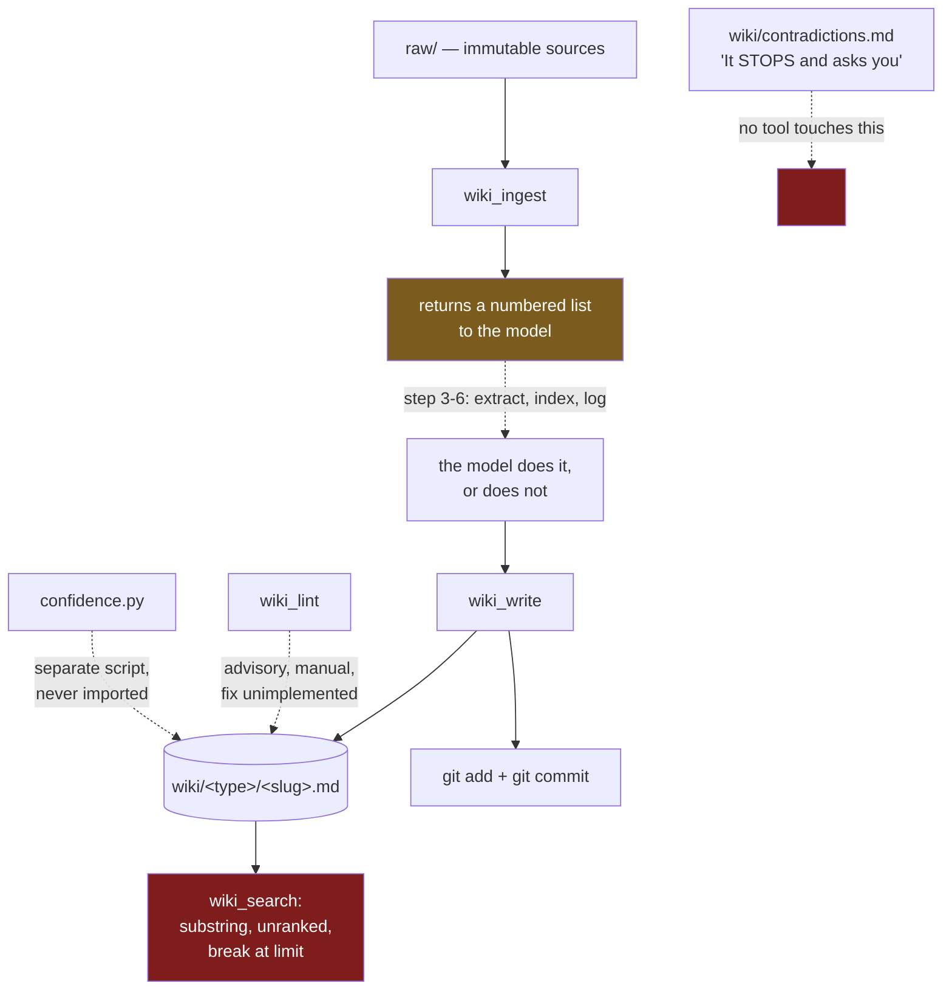

## 1. Executive Summary

MeMex is the [Karpathy LLM Wiki pattern](https://gist.github.com/karpathy/442a6bf555914893e9891c11519de94f)
packaged as a repository: `raw/` holds immutable sources, `wiki/` holds a
Markdown knowledge base the model writes, `L1/` holds per-install context, and
git holds the history. About 3,300 lines of Python across eight files, all of it
an MCP server and four ingest scripts. It shares its lineage with
[LLM Wiki Memory](../llm-wiki-memory/) and its central bet is stated on the
first screen: *"MeMex compiles knowledge once… Every new source makes the whole
wiki richer."*

That bet is real and the file layout is a good expression of it. What this report
is about is the distance between the four features the README advertises and what
the code does.

**Start with the credentials file, because it is the one finding that can cost a
reader something.** `.gitignore` contains `L1/`. `L1/credentials.md` opens with
*"🔒 CRITICAL: This file is git-ignored. NEVER commit credentials."* And
`git ls-files L1/` returns all three files in that directory. `.gitignore` does
not untrack what is already tracked, so the protection the file describes does
not apply to the file describing it. Editing it demonstrates the consequence
immediately:

```console
$ printf 'OPENAI_API_KEY=sk-DEMO\n' >> L1/credentials.md
$ git status --short L1/
 M L1/credentials.md
```

Nothing is leaked in the upstream repository — the template ships with the values
blank. The exposure is downstream: a user who clones this, fills in the file the
instructions tell them to fill in, and pushes their fork has committed their API
keys, having been told twice that they could not.

**The licence says three different things.** The README carries an MIT badge and
closes with *"MIT — Use it, fork it, adapt it, share it."* There is no `LICENSE`
file. And all eight Python files open with `# Copyright (c) 2026 Joerg Peetz. All
rights reserved.` The atlas has seen a licence asserted in a README and absent
from the tree — [Membase](../membase/) — but not one asserted in the README and
contradicted in every file you would be forking.

**Three of the four advertised mechanisms have no code path.**

- *"Zero hallucination enforcement — every claim must cite a source."* The
  enforcement is `wiki_lint`, an advisory report that tests
  `"[Source:" not in content`, fires only on pages with more than five
  substantial lines, is never run automatically, and whose `fix=true` mode
  returns the literal string `[AUTO-FIX NOT YET IMPLEMENTED]`. A substring test
  cannot tell whether a citation supports the sentence beside it.
- *"Human-in-the-loop conflict resolution."* `wiki/contradictions.md` describes
  the flow: the LLM detects a conflict, *"It STOPS and asks you to decide."* The
  server exposes nine tools — `wiki_search`, `wiki_read`, `wiki_list`,
  `wiki_query`, `wiki_ingest`, `wiki_lint`, `wiki_graph`, `wiki_stats`,
  `wiki_write` — and none of them reads or writes that file. Nothing can stop.
- *The operation log.* `wiki/log.md` exists and is 65 lines. The only occurrence
  of `log.md` in the Python is inside a returned string: step 6 of the
  instructions `wiki_ingest` hands back to the model, *"Update log: Append
  operation to `wiki/log.md`"*. No code appends to it.

**And the retrieval that is supposed to compound does not rank.** `_search` walks
every Markdown file, tests `query_lower in content.lower()`, and breaks at the
first `limit` matches (`mcp/server.py:256`). Results arrive in `rglob` order.
There is no scoring, so the tenth-best page and the best page are distinguished
only by where they sit in the directory walk — and a knowledge base whose thesis
is that it gets richer with every source is one whose recall gets worse with
every source, with nothing in the tree that would notice.

The repository does contain a hybrid BM25-plus-dense searcher with cosine
similarity over `BAAI/bge-small-en-v1.5` — `mcp/search.py`, 505 lines — under a
banner reading **"Zero-RAG — No Embeddings"**. `server.py` never imports it.

## 2. Mental Model

Three directories and one rule about who may write to each:

| Directory | Owner | Committed |
| --- | --- | --- |
| `raw/` | the human | yes, and the model must never modify it |
| `wiki/` | the model | yes, one commit per page write |
| `L1/` | the human, privately | **yes — see section 1** |

A memory is a Markdown page with YAML frontmatter (`title`, `type`, `tags`,
`created`, `author`) and inline claim tags the schema defines as
`[confidence: high|medium|low|uncertain]`, `[sources: N]`, `[verified: YYYY-MM-DD]`
and `[contradicts: page-name]`. Pages live under `sources/`, `entities/`,
`concepts/` or `synthesis/`, and link to each other with `[[wikilinks]]`.

The design's epistemics are entirely in those tags, and the tags are written by
the model about its own claims. `mcp/confidence.py` reads them back — weighting
`high` at 1.0 down to `uncertain` at 0.2, flagging anything unverified for 90
days as stale — and produces a report. Nothing on the read path consults a
confidence level, so a claim tagged `uncertain` is returned by `wiki_search`
exactly as a claim tagged `high` is. That is why `trust_state` is withheld:
the levels are a discretised self-assessment with no state that withholds
anything from use.



Solid arrows are code. Dotted arrows are conventions the design relies on and
the code does not implement.

## 3. Architecture

There is nothing to deploy. A checkout, an MCP-capable client, and optionally
Python for the ingest scripts. No database, no server process beyond the MCP
stdio server, no embedding model on the default path, no API key required by the
store itself. For the audience this targets — one person, one laptop, a wiki they
read in an editor — that is the correct amount of infrastructure, and it is the
project's strongest claim.

`git` is the whole durability story. `wiki_write` shells out to `git add` and
`git commit` with a message of the form `wiki(<agent>): add entities/foo`, so
every page write is a commit with an attributed author. Two things follow.

The first is that the audit is real but is git history, which this atlas
deliberately does not count as an `audit_log` — the definition asks for a named
append-only event record in the system's own store, and notes that git history is
a different mechanism. MeMex is the cleanest instance of that exclusion in the
corpus, because git is not a supplement to the audit here; it *is* the audit, and
it is a good one. Anything that rewrites history rewrites the record, and nothing
in the design would notice.

The second is that the attribution is a string the caller supplies:
`agent: str = "unknown"` in the signature. A multi-agent deployment — which the
README advertises — distinguishes its agents by whatever each agent typed. The
atlas has seen this resolved properly once, in [Membase](../membase/), where the
client refuses to file a record under any owner but the address its signing key
recovers to.

`wiki_write` also reports success when the commit fails:

```python
return f"✅ Written: {page_type}/{slug}.md (git commit failed: {result.stderr.strip()})"
```

The page is on disk and outside the audit, and the model is told the write
succeeded, which is true in the narrow sense and misleading in the one that
matters here.

## 4. Essential Implementation Paths

| Path | Location |
| --- | --- |
| Unranked substring search with an early break | `mcp/server.py:256` |
| Page write, frontmatter, git commit | `mcp/server.py:551` |
| Caller-supplied agent attribution | `mcp/server.py:551` (`agent: str = "unknown"`) |
| Citation check as a substring test | `mcp/server.py:418` |
| `fix` mode that is not implemented | `mcp/server.py:459` |
| Ingest returns instructions, not actions | `mcp/server.py:377`–`:382` |
| Confidence weights and the 90-day stale rule | `mcp/confidence.py:69`, `:77` |
| Hybrid BM25 + dense searcher, never imported | `mcp/search.py` |
| `L1/` ignored in `.gitignore`, tracked in git | `.gitignore:8`, `git ls-files L1/` |
| All-rights-reserved header on every source file | `mcp/confidence.py:2` and seven others |

## 5. Memory Data Model

A page is the unit, and the schema is a documentation convention rather than a
validated structure: `wiki_write` accepts `page_type`, `slug`, `title`,
`content` and `tags`, writes five frontmatter fields, and does not inspect the
body. Nothing rejects a page for missing the tags `SCHEMA.md` calls required.

`SCHEMA.md` is well written and worth reading on its own terms — it is the
system's actual specification, addressed to a model rather than to a compiler,
and it is clearer than most machine-readable schemas in this atlas. The gap is
that a specification a model is asked to follow degrades differently from one a
parser enforces: it fails quietly, per-page, and only a linter nobody ran would
find it.

`KNOWLEDGE-DECAY.md` is the part most likely to mislead a reader, and it says so
in its own header: *"Schema Design Draft… Status: DRAFT"*. It proposes
`last_verified_at`, a decaying `confidence` with a `confidence_floor`, a
`source_reliability_index`, an `is_immutable` permanence tier, and a
`revalidation_status` enum of `current | flagged | revalidating | contested |
retired`. That is a genuinely good design — a discrete status including two
states that withhold a claim, plus a decay model with a floor so nothing falls
to zero. **None of those field names appears anywhere in the Python.** A reader
skimming the repository for its trust model will find a complete one in a file
that has not been built, dated 23 April 2026 and unchanged since.

There is no deletion path, no supersession field, and no record of a rejected
value. Correction is overwriting a page behind an `overwrite` flag, with the
previous version recoverable from git. So `tombstone` and `bitemporal` are both
withheld, and forgetting does not exist as a concept in the code.

## 6. Retrieval Mechanics

`wiki_search` is fifteen lines of substring matching. For each Markdown file
under `wiki/`, if the lower-cased query appears in the lower-cased content, take
a 200-character window around the first occurrence and add it to the results;
stop at `limit`.

Three consequences worth separating.

**There is no ranking.** Not weak ranking — none. The result set is the first
*n* files in `Path.rglob` order that contain the string, so which pages an agent
sees depends on directory traversal. A page mentioning the query once in a
footnote outranks a page about the query if it is walked first.

**The early `break` makes it worse as the wiki grows.** This is the direct
tension with the project's thesis. Compounding knowledge means more pages
mentioning any given term, which means the first ten hits become steadily less
likely to be the ten best. The mechanism that makes MeMex attractive is the same
one that degrades its recall, and nothing measures the degradation.

**Only one occurrence is shown.** The snippet is built around
`content.lower().find(query_lower)` — the first match — so a page discussing the
query at length is represented by whichever mention happens to come first.

`mcp/search.py` is the answer to all three and is not connected. It builds a
SQLite FTS5 index, computes `bm25_score`, embeds pages with fastembed or
sentence-transformers, computes a `semantic_score` by cosine similarity, and
combines them. It is 505 lines, it is documented in `mcp/README.md`, and
`server.py` contains no import of it. A reader should take the "Zero-RAG" banner
as describing the wired path — accurately — while knowing the repository also
ships the thing the banner disclaims.

No scope key exists at any level, so `scope_enforced` is withheld: one checkout
is one wiki, and every search sees all of it.

## 7. Write Mechanics

Writes are synchronous and cheap: build frontmatter, write the file, `git add`,
`git commit`. There is no queue, no embedding step on the default path, no
indexing lag. A page is searchable the moment it lands, because search reads the
filesystem directly.

The interesting part is what the write path does *not* do, and the honest framing
is that this is a design choice rather than an omission. MeMex delegates
extraction, structuring, indexing and logging to the model, and `wiki_ingest`
makes that explicit — it returns a six-step recipe as text:

```text
3. **Extract entities**: Create/update pages in `wiki/entities/`…
4. **Extract concepts**: Create/update pages in `wiki/concepts/`…
5. **Update index**: Add new pages to `wiki/index.md`
6. **Update log**: Append operation to `wiki/log.md`
```

That is the Karpathy pattern faithfully implemented: the human curates, the model
does everything else. The cost is that every invariant in the design is only as
reliable as the model's compliance on that turn, and the system has no way to
detect a turn where it did not comply. `wiki/index.md` and `wiki/log.md` are
maintained by good behaviour; a model that writes a page and skips step 5 leaves
an orphan that only `wiki_lint` would surface, and only if someone ran it.

Compare [OpenYak](../openyak/), which delegates the same rewriting job to a model
and then refuses to write when the model returns nothing — a check on the
delegated work, in code. There is no equivalent here.

## 8. Agent Integration

Nine MCP tools over stdio or SSE, and four ingest scripts (`ingest-md.py`,
`ingest-pdf.py`, `ingest-voice.py`, `clip-web.py`) that move sources into `raw/`.
`PROMPTS.md` supplies the operating instructions and `SCHEMA.md` the conventions,
both intended to be loaded into the model's context.

The multi-agent story is git: several agents write pages, each commit carries the
agent name, and merge conflicts are a human's problem in the usual way. That is a
reasonable answer for a small team and it is the same answer
[GitLord](../gitlord/) gives, arrived at independently.

`human_review` is withheld, and the reason is precise rather than dismissive.
This is a design where a human reads everything the model writes — that is the
premise. But the atlas's mark asks for a place where a person inspects, approves
or adjudicates memory content, and the one MeMex designs for that,
`wiki/contradictions.md`, has no code behind it: no tool creates an entry, none
lists pending conflicts, none marks one resolved, and the *"It STOPS"* that would
make it a gate is a sentence in a Markdown file. The same call was made for
[Palazzo](../palazzo/), whose delete tool instructs the model to obtain human
approval and enforces it with a boolean the model sets.

## 9. Reliability, Safety, and Trust

The credentials finding in section 1 is the operative safety issue and it is
worth restating as a general lesson: a `.gitignore` entry protects nothing for a
file that is already tracked, and shipping a template *at* the ignored path is
how that happens. The fix is one command —
`git rm --cached L1/credentials.md L1/identity.md L1/rules.md` — plus shipping
the templates as `L1/*.example` and having the setup step copy them.

Provenance is one field, `author`, supplied by the caller. There is no notion of
which source a claim came from beyond the `[Source: …]` convention in the body
text, and nothing resolves those strings to files in `raw/`, so a citation to a
source that does not exist reads exactly like one that does.

Prompt injection has an unobstructed path. Text in `raw/` is read by the model
and becomes wiki pages; the only filter is the citation lint, which a page
containing the literal string `[Source:` passes. Given the audience — a single
person curating their own sources — that is a proportionate risk, and the design
does not claim otherwise.

Two smaller notes. The `raw/`-is-immutable rule is enforced by instruction, not
by permissions, and it is one of the better instructions in the file: making the
source corpus the thing the model may never edit is the right invariant, and
[MemPalace](../mempalace/) makes the same choice with the same reasoning. And
`wiki_write` refuses to overwrite without an explicit flag, which is a real
guard, in code, and the only one in the tool surface.

## 10. Tests, Evals, and Benchmarks

There is no test directory, no test file, and no CI configuration. For 3,300
lines including a substring searcher with an off-by-nothing early break, a linter
whose fix mode is a stub, and a hybrid searcher nobody imports, the absence is
the finding: nothing would have caught any of the gaps in this report, because
nothing runs.

No benchmark, no eval fixture, no committed retrieval results. The README's
central comparative claim — that compiling beats retrieving because *"nothing
compounds"* in RAG — is an architectural argument presented without a
measurement, which is the norm in this atlas rather than an outlier. It is worth
noting only because the claim is falsifiable and the repository ships both
arms: `server.py`'s substring scan and `search.py`'s hybrid ranker over the same
corpus would produce exactly the comparison the README asserts the answer to.

`negative_eval` is withheld; no case asserts that particular material must not be
retrieved.

## 11. For Your Own Build

### Steal

**Make the source corpus immutable and the knowledge derived.** `raw/` is
read-only to the model and `wiki/` is entirely its output. That single rule means
every derived page can be rebuilt and no amount of model error destroys the
inputs. It is the cheapest correctness property in this atlas and MeMex states it
in one line of `SCHEMA.md`.

**Separate private context from shared knowledge as a directory, not a flag.**
`L1/` for identity, rules and secrets; `wiki/` for what the model produces.
Deciding what may be committed by *where it lives* is easier to get right than
deciding per record — provided the files are actually untracked, which is the
lesson in the failure below.

**Write a schema addressed to the model and mean it.** `SCHEMA.md` is a better
specification than several machine-readable ones here. If the model is going to
do the structuring, the document telling it how is the real schema, and treating
it as a first-class artifact is correct.

**Commit per write, with the operation in the message.** `wiki(<agent>): add
entities/foo` gives a readable history for free and makes `git log` a usable
audit for a single-user store.

### Avoid

**Do not ship a template at a path you tell users is git-ignored.**
`.gitignore` has no effect on tracked files, so the warning inside
`L1/credentials.md` is contradicted by the file's own presence in the index. Ship
`credentials.md.example` and copy it during setup.

**Do not let the README claim enforcement the code does not perform.** "Zero
hallucination enforcement — every claim must cite a source" is, in code, a manual
report that greps for `[Source:` on pages longer than five lines. Either enforce
it in the write path — reject a page without a citation — or describe it as the
convention it is.

**Do not describe a stop that nothing can stop.** *"It STOPS and asks you to
decide"* has no tool behind it. A blocking step that depends on the model
choosing to block is not a gate, and it is most likely to fail on exactly the
turn where the model is confidently wrong.

**Do not return an unranked prefix of the matches.** Taking the first *n* files
containing a substring, in directory order, means recall quality is a property of
your filesystem layout — and it degrades as the corpus grows, which is the
opposite of what a compounding knowledge base promises.

**Do not contradict your own licence in every file.** An MIT badge, no `LICENSE`
file, and `All rights reserved` on all eight sources leaves a reader unable to
determine what they may do, which is the one question a licence exists to answer.

### Fit

Take the layout. `raw/` immutable, `wiki/` derived, `L1/` private, git as
history, a schema written for the model — that shape is sound, it costs nothing
to adopt, and it is the reason the Karpathy pattern keeps reappearing.

Do not take it as a memory system with the properties the README lists. The
citation enforcement, the contradiction gate and the operation log are
conventions; the confidence tags are self-assessment nothing reads at retrieval;
the decay model is a draft; and the search will get worse as the wiki gets
better. For a single person with a few hundred pages and a habit of reading what
their agent wrote, none of that may matter. For anything where a wrong page needs
to be findable *as* wrong, all of it does.

And resolve the licence before depending on it either way.

## 12. Antipatterns / Risks

- **`L1/credentials.md` is tracked** despite `.gitignore` and its own warning;
  a user who fills it in and pushes commits their keys.
- **Three contradictory licence statements** — MIT badge, no `LICENSE`, and
  `All rights reserved` on every source file.
- **Citation "enforcement" is a manual substring report** whose fix mode is
  unimplemented.
- **The contradiction gate has no code path** across nine tools.
- **`wiki/log.md` is maintained by instruction**; nothing appends to it.
- **Search is unranked and breaks early**, so recall degrades as the corpus
  grows.
- **A hybrid embedding searcher ships under a "No Embeddings" banner**, never
  imported.
- **`KNOWLEDGE-DECAY.md` reads as the trust model and is a draft**; none of its
  fields exist in code.
- **Agent attribution defaults to `"unknown"`** and is whatever the caller says.
- **A write reports success when its commit fails.**
- **No tests, no CI.**

## 13. Build-vs-Borrow Takeaways

Borrow the directory contract; build the enforcement. Every gap in this report
is the same gap — an invariant expressed as a sentence to a model rather than a
check in a code path — and each one is small to close in the write tool that
already exists. Reject a page with no `[Source:` line. Refuse a write while
`contradictions.md` has a pending entry. Append to `log.md` inside `wiki_write`
instead of asking for it. Score the search, or import the scorer already in the
repository.

The interesting question this system raises is where the line should sit. A
convention-driven design is not wrong — it is what makes MeMex installable in a
minute — and moving every rule into code would produce a different, heavier
project. But the four rules the README leads with are exactly the four a reader
would assume are enforced, and those are the ones worth moving first.

## 14. Open Questions

- **Why does `search.py` exist and stay unimported?** It is the fix for the
  weakest part of the system, it is complete, and wiring it would contradict the
  branding. The unresolved tension is visible in the tree.
- **Was `KNOWLEDGE-DECAY.md` abandoned or is it queued?** It is dated 23 April
  2026, marked "PR ready", and nothing since references it; the memory-relevant
  code was last touched 22 April 2026 and HEAD is 1 July 2026.
- **What reads `mcp/confidence.py`?** It is a complete analyser with a CLI
  `main()` and no caller in the tree.
- **How large does the wiki get before substring search stops working?** The
  question is answerable with the repository's own two searchers over the same
  corpus, and nobody has asked it.

## 15. Appendix: File Index

| File | Role |
| --- | --- |
| `mcp/server.py` | The nine MCP tools: search, read, list, query, ingest, lint, graph, stats, write |
| `mcp/search.py` | Hybrid BM25 + dense searcher; not imported by the server |
| `mcp/confidence.py` | Confidence tag analyser and stale-page reporter; no caller |
| `mcp/batch.py` | Bulk ingest helpers |
| `scripts/ingest-*.py`, `scripts/clip-web.py` | Move Markdown, PDF, voice and web sources into `raw/` |
| `SCHEMA.md` | The real specification, addressed to the model |
| `PROMPTS.md` | Operating instructions loaded into context |
| `KNOWLEDGE-DECAY.md` | Draft decay and permanence design; unimplemented |
| `wiki/contradictions.md` | The human-adjudication queue, maintained by convention |
| `wiki/log.md`, `wiki/index.md` | Operation record and catalogue, both written by the model |
| `L1/` | Private context — and tracked in git |
