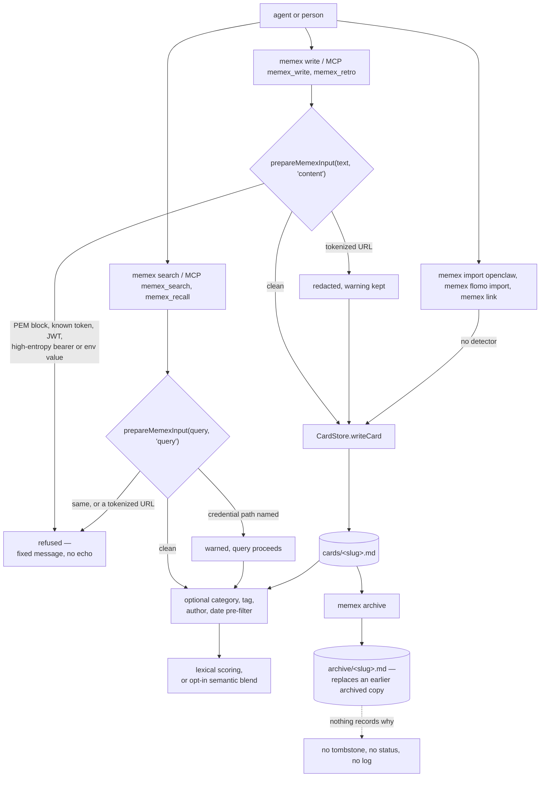

## 1. Executive Summary

Memex is a Zettelkasten for coding agents: a directory of markdown cards
addressed by slug and linked by `[[wiki-links]]`, served through a CLI, an MCP
server and several harness plugins. Its notable part is a credential detector on
the `write` and `search` commands, tested for what it must allow as well as what
it must refuse. Its weak part is correction: archiving moves a file, records
nothing about why, and silently replaces an earlier archived card of the same
slug.

**It carries one of the seven marks, `negative_eval`.** The search command's
frontmatter pre-filter is pinned by committed cases that assert named cards
absent beside named cards present, over a populated fixture
(`tests/commands/search-manifest-filter.test.ts`). There is no scope key, no
epistemic status, no audit of mutations and no review surface.

**The detector runs on both commands.** `prepareMemexInput(input, "content")`
runs before a write (`src/commands/write.ts:15`) and
`prepareMemexInput(query, "query")` before a search
(`src/commands/search.ts:54`). It refuses PEM private-key blocks, known token
shapes — `sk-`, `ghp_`, `glpat-`, Slack, AWS, Google, Stripe and npm keys, JWTs
— and `Authorization: Bearer` values that are a JWT or high-entropy
(`src/lib/sensitive-input.ts:17-35`, `:111-121`).

An environment assignment is refused when its name contains `API`, `TOKEN`,
`SECRET`, `PASSWORD`, `PRIVATE`, `CREDENTIAL`, `AUTH` or `KEY` and its value
looks like a secret (`:123-144`). A tokenized URL is redacted in content, with a
warning, and refused in a query (`:40-53`).

**The detector belongs to the `write` command, not to the store.**
`CardStore.writeCard` checks nothing, and three CLI paths call it directly:
`memex import openclaw` (`src/importers/openclaw.ts:140`), `memex flomo import`
(`src/commands/flomo.ts:356`), and `memex link`, which appends a caller-supplied
relationship sentence to a card (`src/commands/link.ts:62-64`). Every
agent-facing write reaches `writeCommand` and is screened: MCP `memex_write`
and `memex_retro`, and the Pi extension, which shells out to `memex write`.

**It is tested for false positives, not only for catches.** Beside *"rejects
actual OpenAI-style tokens"* and *"rejects complete private key blocks"* sit
*"allows security architecture language without raw secrets"*, *"allows
discussing token prefixes as knowledge"* and *"does not reject private-key block
names in prose"* (`tests/lib/sensitive-input.test.ts:9-39`). A detector that
refuses *"we should rotate the bearer token"* makes a store nobody can write
about security in, and this suite pins the line in both directions.

**The rejection message does not quote the secret.** It is a fixed constant
(`sensitive-input.ts:10-11`), and two tests pin that it stays one:
`expect(result.error).not.toContain("sk-proj")` on the library
(`tests/lib/sensitive-input.test.ts:13`) and the same assertion on the search
command's output (`tests/commands/search.test.ts:87-92`). A future message that
interpolated the match would fail them.

## 2. Mental Model

A memory is a file. A card becomes one when a write lands in the cards
directory, and stops being one when it is archived or edited away. Nothing sits
between those two ends: no candidate state, no status, no expiry. The
credential detector is the one gate, and it guards only the commands that call
it.



## 3. Architecture

A CLI and an MCP server over a directory; nothing has to be running. The home
directory is `MEMEX_HOME`, else the nearest `.memexrc` above the working
directory, else `~/.memex` (`src/lib/config.ts:111-120`). A project can
therefore hold its own home, which is a physical partition rather than a key on
a card.

The store is markdown a person can read, edit and commit. The derived state is
an embedding cache keyed by slug and invalidated by a SHA-256 content hash, so
an unchanged card is not re-embedded (`src/lib/embeddings.ts:619-698`,
`:753-796`). Four providers are wired — OpenAI, Azure OpenAI, Ollama and a local
model — and semantic search is opt-in, so the system works on lexical scoring
with no network and no key.

Optional git sync makes the home a repository. With auto sync on and a remote
configured, a write through MCP awaits a commit and a push before it returns
(`src/mcp/server.ts:116-123`, `src/lib/sync.ts:497-519`, `:560-571`). The
Claude Code plugin's SessionStart hook runs `memex sync` at every session start
(`hooks/hooks.json`).

`CardStore` validates a slug before it becomes a path: empty segments, reserved
characters and `.` or `..` segments are refused (`src/lib/store.ts:16-49`), and
`assertSafePath` refuses any resolved path outside the cards directory
(`:205-211`). The archive move repeats the containment check against the
archive directory (`:238-244`).

## 4. Essential Implementation Paths

- **Credential gate** — `src/lib/sensitive-input.ts`: fixed messages (10-15),
  patterns (17-35), `prepareMemexInput` (37-62), entropy test (138-155).
  Callers: `src/commands/write.ts:15`, `src/commands/search.ts:54`. The MCP
  layer reaches it through `writeCommand` (`src/mcp/server.ts:111`,
  `src/mcp/operations.ts:91`) and `searchCommand`.
- **Writes that skip it** — `src/importers/openclaw.ts:140`,
  `src/commands/flomo.ts:356`, `src/commands/link.ts:64`.
- **Store** — `src/lib/store.ts`: `validateSlug` (16-49), `CardStore` (56),
  `assertSafePath` (205-211), `writeCard` (213-224), `archiveCard` (226-248).
- **Retrieval** — `src/commands/search.ts`: `searchCommand` (53-132), the
  pre-filter `filterByManifest` and `matchesFilter` (146-221), `semanticSearch`
  (301); scoring in `src/lib/scoring.ts` (`isCodeToken` 77, `scoreCard` 320).
- **Links** — `src/lib/parser.ts`, `src/lib/suggest-links.ts`,
  `src/commands/link.ts`.
- **Sync** — `src/lib/sync.ts`, `src/commands/sync.ts`.
- **Surfaces** — `src/mcp/server.ts`, `src/mcp/operations.ts`,
  `hooks/hooks.json`, `.claude-plugin/`, `.cursorrules`, `.windsurfrules`,
  `pi-extension/index.ts`, `vscode-extension/src/extension.ts`, `server.json`,
  `smithery.yaml`, `skills/`.

## 5. Memory Data Model

A card is a markdown file with YAML frontmatter and a body. The write command
refuses a card without `title`, `created` and `source`, and stamps `modified`
(`src/commands/write.ts:6`, `:20-29`). The MCP write fills `source` with the
client's name when the caller omits it (`src/mcp/server.ts:107-108`). `category`,
`tags` and `author` are optional and read only by the search pre-filter.

No field carries status, confidence, a validity window or a scope key.
`parser.ts` parses whatever frontmatter is present with `gray-matter` and
imposes no schema. The graph is the links between cards rather than a property
on any one of them.

## 6. Retrieval Mechanics

The default is lexical scoring with code-token awareness: `isCodeToken`
separates an identifier from an English word, so `migration` is prose and a
camelCase symbol is not. `--semantic` blends embedding similarity with a
keyword boost (`search.ts:350-364`). `tests/lib/scoring-100-queries.test.ts`
runs 106 queries against a fixture corpus and asserts which slugs
each returns.

**An optional pre-filter narrows the candidates before either arm.** Category
and tag match case-insensitively, `author` matches the `author` or `source`
field, and `since`/`before` test `created` or `modified`
(`search.ts:169-221`). The CLI exposes it as flags and MCP `memex_recall` as
optional arguments (`src/mcp/operations.ts:35-46`); `memex_search` does not.

The filter is a facet the caller chooses. Omitted, every card in the cards
directory is a candidate, which is why `scope_enforced` is withheld. `--all`
widens the read to the `searchDirs` listed in config (`search.ts:64-72`). The
archive directory is not read by search. `memex serve` runs its own substring
search for a graph UI bound to `127.0.0.1`, with neither the detector nor the
pre-filter (`src/commands/serve.ts:184-213`, `:254`).

## 7. Write Mechanics

A write is synchronous and immediately retrievable. `writeCard` writes
`<path>.tmp` and renames it over the target, so a crash leaves the old card or
the new one (`store.ts:219-222`). Nothing locks a slug: two concurrent writers
share one temporary name and the last rename wins. A new card gets lexical link
suggestions, as advice that cannot fail the write (`write.ts:37-55`).

The embedding refresh is the only deferred work, and it runs when a semantic
search does. When auto sync is on, a git commit and push follow the write
(section 3).

**Correction is editing the file or archiving it.** `archiveCard` renames the
card into the archive directory (`store.ts:226-248`). The `Card already
archived` error fires only when no live card of that slug exists and an
archived one does (`:229-236`); it tells a caller why a slug was not found.

When a live card exists, `rename` replaces any earlier archived file of the same
slug. A slug archived, re-written and archived again keeps only the second copy,
unless git sync has committed the first. Nothing keyed on content survives the
move, so the same note can be written again with no signal that it was archived
once. **`tombstone` is withheld**, and archival is what the rubric names as not
the mark.

## 8. Agent Integration

The surfaces over one home directory:

- **CLI** — `memex` with `search`, `read`, `write`, `link`, `archive`, `sync`,
  `organize`, `import`, `flomo` and others (`src/cli.ts`).
- **MCP server** — `memex_search`, `memex_read`, `memex_write`, `memex_links`,
  `memex_archive`, and the task-level `memex_recall`, `memex_retro`,
  `memex_organize`, `memex_pull`, `memex_push`, `flomo_push` and
  `flomo_import_parse` (`src/mcp/server.ts:70-155`,
  `src/mcp/operations.ts:31-238`).
- **Claude Code plugin** — `hooks/hooks.json` registers SessionStart, which runs
  `memex sync` and injects the index's section headings with card counts and
  recall instructions, and Stop, which prints a retro reminder.
- **Rules files** — `AGENTS.md`, `CLAUDE.md`, `GEMINI.md`, `.cursorrules` and
  `.windsurfrules`, kept identical by `scripts/pre-commit` and a consistency
  test.
- **Pi extension** — registers eight tools, each spawning the `memex` CLI
  (`pi-extension/index.ts:48`, `:182-441`).
- **VS Code extension** — writes an MCP config that points at the bundled CLI
  (`vscode-extension/src/extension.ts:131-137`).

`flomo_import_parse` returns memo text to the agent and writes nothing; the
agent writes the curated cards through `memex_write`, which is screened.

## 9. Reliability, Safety, and Trust

The threat model this system takes seriously is **a secret leaking into a store
an agent will later read back into a prompt**. The detector addresses it on the
two commands an agent drives. It does not address it for imported material:
`memex import openclaw` and `memex flomo import` write outside text as cards
unscreened.

An unscreened card can leave the machine. `flomo_push` sends the card body to
the configured flomo webhook as-is (`src/commands/flomo.ts:85-116`), and git
sync pushes the cards directory to its remote. The redaction the sync command
applies covers its own URLs and error messages (`src/commands/sync.ts:34-53`),
not card content.

Correction, provenance and scope are outside the design. A Zettelkasten is a
personal knowledge store curated by hand; a review queue would be ceremony over
a directory its owner already edits. The absence that costs something is
**correction**: an archived card leaves nothing an agent can check, so an agent
that produced it once can produce it again.

Git history is the only record of what changed, and only when sync is on. It is
a real mechanism and a different one from an audit of mutations in the store.

## 10. Tests, Evals, and Benchmarks

The suite is 43 files: 19 under `tests/lib/`, 17 under `tests/commands/`, and
the rest under `tests/integration/`, `tests/mcp/` and `tests/pi-extension/`.
The scoring suite is the large one — `scoring-100-queries.test.ts` at 1,056
lines and a 504-line unit suite.

**`negative_eval` is awarded on the search pre-filter.**
`search-manifest-filter.test.ts` seeds five cards and asserts, test by test,
which cards must not come back beside which must. *"applies filter before
keyword search"* queries `guide`, which matches `docker-setup`'s body, under
`category: frontend`, and asserts `react-hooks` present and `docker-setup`
absent (`:251-259`).

*"applies filter before semantic search"* gives every card the same embedding
from a mock provider, so similarity cannot separate them, and asserts the two
frontend cards present and the other three absent (`:263-282`). Each exclusion
is paired with a positive control in the same test, so none passes on an empty
result.

The mark's limit is what it guards. These cases pin a facet the caller chose;
none asserts that an archived, corrected or out-of-scope card stays out of a
default read. The archive tests assert the move and that `resolve` returns
`null` afterwards (`tests/lib/store.test.ts:99-114`,
`tests/commands/archive.test.ts:23-30`); neither searches, and neither reaches
the already-archived branch.

The credential detector's cases are the other suite to read, for the
false-positive controls and the non-echo assertion in section 1. The MCP suite
repeats them through the tool surface: `memex_write` refuses a token without
echoing it, and a tokenized URL written through `memex_write` reads back masked
through `memex_read` (`tests/mcp/server.test.ts:143-165`). They pin what may be
stored and what an error may print, a write and egress property rather than a
retrieval one.

No paper and no `CITATION.cff` are in the tree. The release workflow rebuilds
`dist/` and commits it with the version bump
(`.github/workflows/release.yml:34`, `:57-58`).

Nothing was run. The screen reports six auto-run surfaces — a `.claude-plugin/`
marketplace manifest, `.cursorrules`, `hooks/` and `hooks/hooks.json`
registering SessionStart and Stop, `server.json` and `smithery.yaml`. It also
reports an npm `prepare` script that copies `scripts/pre-commit` into
`.git/hooks`.

## 11. For Your Own Build

### Steal

**Run the secret detector on the query, not only on the write.** A search string
is as good a place to paste a token as a note is, and it ends up in logs and
transcripts either way. `prepareMemexInput` takes a `"query" | "content"` context
and both callers exist.

**Assert that your rejection message does not contain the thing you rejected.**
`expect(result.error).not.toContain("sk-proj")` is one line, and it closes the
hole where a secret scanner becomes the thing that leaks the secret.

**Test the false positives.** *"Allows security architecture language without raw
secrets"* and *"does not reject private-key block names in prose"* keep a
detector usable. A scanner nobody can write about gets switched off.

**Redact what you can, refuse what you cannot.** A tokenized URL in a note is
stripped of its credentials and saved with a warning; a private key block is
refused. Two responses for two risks, rather than one blunt rule.

**Prove a filter with embeddings that cannot tell the cards apart.** A mock
provider returning one vector for every card means only the filter can exclude
anything, so a passing must-not case is evidence about the filter.

### Avoid

**A gate in the command rather than the store.** Every path that reaches the
writer without the command skips it, and importers are the paths that carry the
most outside text. Put the check where the bytes land.

**Archiving as your only correction.** Moving a file records that something
left, not that it was wrong. When the move can also overwrite the previous
archived copy, it records less than that.

**Assuming one directory means one principal forever.** No scope key is the
right call for one owner and the hardest thing to retrofit — every read path
would need one.

### Fit

This suits one developer who wants a Zettelkasten their coding agent can read
and write, kept in files they curate themselves, with a guard against pasting a
credential into it through the agent. It is small enough to read in an
afternoon, and the cards survive the tool.

It is the wrong fit anywhere memory must be governed or shared, and anywhere
bulk imports from other tools carry material nobody has screened. The design is
a personal knowledge store, and its absences follow from that.

## 12. Open Questions

- **Should archiving record a content hash?** It is the one change that would
  turn a file move into a correction an agent could not undo by re-extracting.
- **Is the importers' skip of the detector a decision?** Nothing in the
  importer code or its tests says so either way.
- **Does anyone use the pre-filter to separate agents?** `author` matches the
  `source` the MCP write fills with the client name, which would make it a
  per-client view if a caller always passed it; nothing in the tree does.

## Appendix: File Index

**Credential gate**

- `src/lib/sensitive-input.ts` — messages (10-15), patterns (17-35),
  `prepareMemexInput` (37-62), bearer and env checks (111-144)
- Callers: `src/commands/write.ts:15`, `src/commands/search.ts:54`; the MCP
  layer through `writeCommand` at `src/mcp/server.ts:111` and
  `src/mcp/operations.ts:91`
- Writers that skip it: `src/importers/openclaw.ts:140`,
  `src/commands/flomo.ts:356`, `src/commands/link.ts:64`
- `tests/lib/sensitive-input.test.ts` — rejections (9-14, 30-34, 41-44),
  false-positive controls (16-28, 36-39), non-echo assertion (13);
  `tests/commands/search.test.ts:82-99`, `tests/mcp/server.test.ts:143-165`

**Store and retrieval**

- `src/lib/store.ts` — `validateSlug` (16-49), `CardStore` (56),
  `assertSafePath` (205-211), `writeCard` (213-224), `archiveCard` (226-248)
- `src/commands/search.ts` — pre-filter (88-92, 146-221), semantic blend
  (301-364)
- `src/lib/scoring.ts`, `src/lib/embeddings.ts`, `src/lib/parser.ts`,
  `src/lib/suggest-links.ts`, `src/lib/sync.ts`, `src/lib/config.ts`

**Surfaces**

- `src/mcp/server.ts`, `src/mcp/operations.ts`, `hooks/hooks.json`,
  `.claude-plugin/`, `.cursorrules`, `.windsurfrules`, `server.json`,
  `smithery.yaml`, `pi-extension/index.ts`, `vscode-extension/src/extension.ts`

**Tests**

- `tests/commands/search-manifest-filter.test.ts` — the must-not cases
  (107-116, 251-259, 263-282)
- `tests/lib/scoring-100-queries.test.ts`, `tests/lib/scoring.test.ts`,
  `tests/commands/archive.test.ts`

### Commands behind the absence claims

```sh
grep -rn -iE "status|confidence|valid_from|valid_until|expires|tombstone|rejected|approve|pending" src
grep -rn -iE "append|audit|journal|history" src/lib/*.ts
grep -rn "prepareMemexInput" src pi-extension vscode-extension/src
grep -rn "writeCard(" src
grep -rn "not.toContain\|toHaveLength(0)\|toBe(\"\")" tests
grep -rln "archiveCard\|archiveCommand" tests
grep -rn -i "lock" src/lib/store.ts src/commands/write.ts
grep -rn -i "secret\|redact\|sensitive" src/importers src/commands/flomo.ts tests/lib/import-openclaw.test.ts tests/commands/flomo-import.test.ts
grep -rn "redactSensitiveText" src
grep -rn "author" pi-extension/index.ts skills hooks .cursorrules
grep -n "pathname" src/commands/serve.ts
grep -rn -i "arxiv\|bibtex\|@article\|citation\|doi" README.md docs/
ls CITATION.cff
```

## History

**2026-09-26** — [`453c0e33f527a02178dc51b5ea426145e9cd22f8`](https://github.com/iamtouchskyer/memex/commit/453c0e33f527a02178dc51b5ea426145e9cd22f8) — audit at an unchanged pin; upstream HEAD is the pinned commit. `negative_eval` is awarded: the recorded search covered `tests/lib/` only, and the pre-filter's must-not cases with positive controls sit in `tests/commands/` ([section 10](#10-tests-evals-and-benchmarks)). Corrected: the detector skips three CLI write paths; archiving overwrites an earlier archived copy rather than refusing; search has a pre-filter; cards carry required frontmatter; the suite is 43 files, not nineteen. Screened again: six auto-run surfaces (`smithery.yaml` was left out of the count), two build-time exec points, nothing inside the cooldown. Nothing installed, built or run.

**2026-09-13** — [`453c0e33f527a02178dc51b5ea426145e9cd22f8`](https://github.com/iamtouchskyer/memex/commit/453c0e33f527a02178dc51b5ea426145e9cd22f8) — first reading. Screened first: five auto-run surfaces — a `.claude-plugin/` marketplace manifest, `.cursorrules`, `hooks/hooks.json` registering SessionStart and Stop, and `server.json` — plus a committed `dist/`. Nothing was installed, no hook was registered and no test was run. No marks, which is the assessed answer rather than an unexamined one: every one of the seven was searched for and the commands are in the appendix. The mechanism worth the reading is the credential gate, wired on both the write and the query path, tested for false positives as well as catches, and asserting that its own rejection message never echoes the token it refused.
