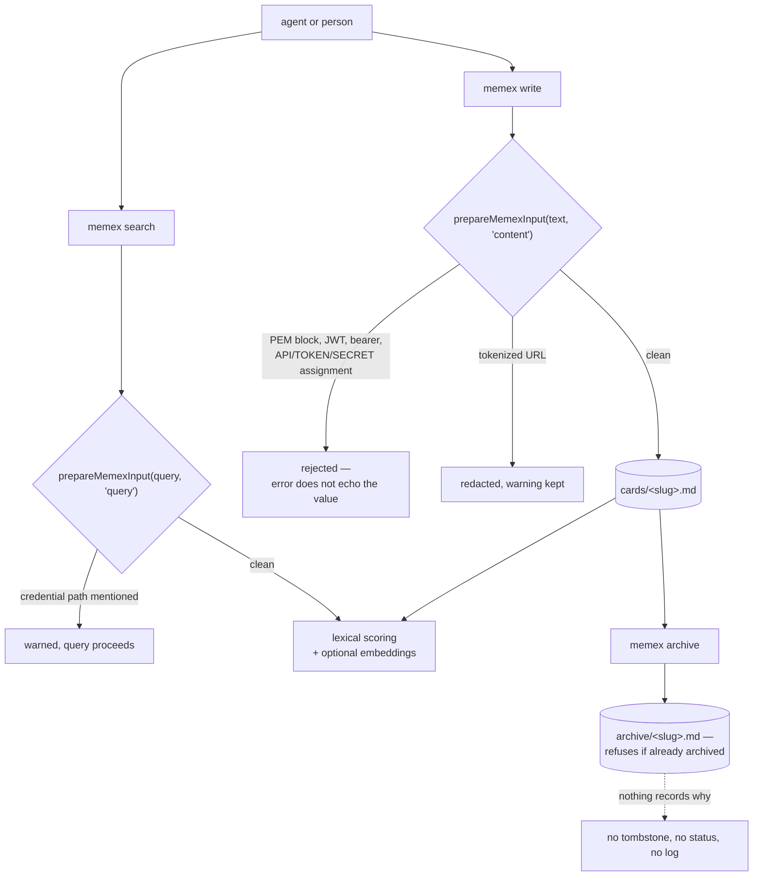

## 1. Executive Summary

Memex is a Zettelkasten for coding agents — about 16,300 lines of TypeScript, no
database, one directory of markdown cards addressed by slug and linked to each
other. It ships a CLI, an MCP server, a Claude Code plugin, a Cursor rules file
and a Pi extension, all over the same files.

**It carries none of this atlas's seven marks**, and that is the honest result
rather than a gap in the reading: there is no scope key, no epistemic status, no
audit of mutations, no review surface, and no committed case asserting that
material must not be retrieved. A card is a file, and what a person can do to a
file is what the system can do to a memory.

**What it does have is the best-tested secret gate this atlas has read.**
`src/lib/sensitive-input.ts` runs on both paths — `prepareMemexInput(input,
"content")` before a write (`src/commands/write.ts:15`) and
`prepareMemexInput(query, "query")` before a search (`src/commands/search.ts:54`)
— and refuses PEM private-key blocks, JWTs, `Authorization: Bearer` headers with a
long value, and environment assignments whose name matches `API`, `TOKEN`,
`SECRET`, `PASSWORD`, `PRIVATE` or `CREDENT`. Tokenized URL credentials are
redacted rather than refused, with a warning.

Two things make it worth copying rather than merely present.

**It is tested for false positives, not only for catches.** Beside *"rejects
actual OpenAI-style tokens"* and *"rejects complete private key blocks"* sit
*"allows security architecture language without raw secrets"*, *"allows discussing
token prefixes as knowledge"* and *"does not reject private-key block names in
prose"* (`tests/lib/sensitive-input.test.ts`). A memory whose secret scanner
refuses to store the sentence *"we should rotate the bearer token"* is a memory
nobody can write about security in, and this suite pins the distinction in both
directions.

**The rejection message is asserted not to quote the secret.**
`expect(result.error).not.toContain("sk-proj")` — the error explains what was
refused without echoing it into a log, a terminal or an agent transcript. That is
one line, it is the sort of thing that is obvious only after it has gone wrong
somewhere, and almost nothing in this corpus does it.

## 2. Mental Model

A memory is a file. The lifecycle is a filesystem lifecycle, and the only gate
between an agent and the store is the credential detector.



The dotted edge is what the design leaves out, and section 9 says why that is
coherent here rather than careless.

## 3. Architecture

A CLI and an MCP server over a directory. Nothing has to be running. The store is
markdown a person can read, edit and commit, and the only derived state is an
embedding cache keyed by content hash so an unchanged card is not re-embedded.

Embeddings are optional and pluggable — local, Azure or OpenAI — so the system
degrades to lexical scoring with no network.

`CardStore` validates a slug before it touches the filesystem, rejecting any path
segment that is `.` or `..` (`src/lib/store.ts:42-49`). For a system whose
addressing scheme is a user-supplied string that becomes a path, that check is the
one that matters.

## 4. Essential Implementation Paths

- **Credential gate** — `src/lib/sensitive-input.ts`: the patterns (17-22),
  `prepareMemexInput` (37); callers at `src/commands/write.ts:15`,
  `src/commands/search.ts:54`, and `formatWarnings` in `src/mcp/server.ts` and
  `src/mcp/operations.ts`.
- **Store** — `src/lib/store.ts`: slug validation (42-49), `CardStore` (56),
  `archiveCard` (226-236).
- **Scoring** — `src/lib/scoring.ts`; embeddings and the content-hash cache in
  `src/lib/embeddings.ts`.
- **Links** — `src/lib/parser.ts`, `src/lib/suggest-links.ts`.
- **Sync** — `src/lib/sync.ts`.
- **Surfaces** — `hooks/hooks.json`, `.claude-plugin/`, `.cursorrules`,
  `pi-extension/index.ts`, `server.json`.

## 5. Memory Data Model

A card is a markdown file with a slug and wiki-style links. There is no
frontmatter schema in the parser — no status, no confidence, no validity window,
no scope:

```sh
grep -n "created\|updated\|valid\|status\|confidence" src/lib/parser.ts
```

Nothing at the pinned commit. The model is deliberately thin, and the graph is the
links between cards rather than a property on any one of them.

## 6. Retrieval Mechanics

Lexical scoring with code-token awareness — `isCodeToken` distinguishes an
identifier from an English word, so `migration` is prose and a camelCase symbol is
not — optionally combined with embedding similarity when a provider is configured.
`tests/lib/scoring-100-queries.test.ts` runs a hundred queries against a fixture
corpus and asserts which slugs each returns.

Every card in the directory is a candidate. There is no filter of any kind on the
read path, which is why `scope_enforced` is withheld rather than being a close
call.

## 7. Write Mechanics

A write is a file write, synchronous, immediately retrievable. The embedding
refresh is the only deferred work, and it is skipped when the content hash is
unchanged.

Correction is editing the file. `archiveCard` moves a card into the archive
directory and throws `Card already archived` if one of that slug is already there
— a collision check rather than a record. Nothing keyed on the card's content
survives the move, so the same note can be written again tomorrow with no signal
that it was archived once. **`tombstone` is withheld**, and archival is what the
rubric names as explicitly not the mark.

## 8. Agent Integration

Five surfaces over one directory: a CLI, an MCP server, a Claude Code plugin whose
`hooks/hooks.json` registers SessionStart and Stop, a `.cursorrules` file injected
into an agent's context, and a Pi extension. The screen flags all of these as
auto-run surfaces, which is accurate — this is a tool designed to be installed
into a harness and to act at session boundaries.

The MCP layer imports `formatWarnings`, so an agent writing through MCP is subject
to the same credential gate as the CLI and is told what was redacted.

## 9. Reliability, Safety, and Trust

The threat model this system takes seriously is **secrets leaking into a store
that an agent will later read back into a prompt**, and it addresses that one well.
The threat models it does not address are correction, provenance and scope.

That combination is coherent for what this is. A Zettelkasten is a personal
knowledge store whose whole premise is that a person curates it by hand; a review
queue would be ceremony over a directory the owner already edits, and a scope key
means nothing when there is one owner and one directory. The absence worth naming
is not scope but **correction**: a card that was wrong and got archived leaves
nothing behind, so an agent that produced it once can produce it again, and the
system has no way to say so.

## 10. Tests, Evals, and Benchmarks

Nineteen test files. The scoring suite is the large one — a hundred queries with
asserted slugs, plus a 504-line unit suite — and `sensitive-input.test.ts` is the
one worth reading, for the false-positive cases and the non-echo assertion
described in section 1.

**`negative_eval` is withheld**, and the reason is a distinction this atlas keeps
having to make. The suite contains negative assertions and they are not vacuous —
`isCodeToken("migration")` is asserted false beside positive cases, empty inputs
resolve to empty arrays — but none of them asserts that particular *material must
not be retrieved from a populated store*. The closest is the credential gate,
which asserts material must not be **stored** and that an error must not echo it.
That is a write and egress property rather than a retrieval one, and the mark asks
for the latter.

No paper and no `CITATION.cff`:

```sh
grep -rn -i "arxiv\|bibtex\|@article\|citation\|doi" README.md docs/
```

Nothing was run. The screen reports five auto-run surfaces — a `.claude-plugin/`
marketplace manifest, `.cursorrules`, `hooks/hooks.json` registering SessionStart
and Stop, and `server.json` — and a committed `dist/`, so the published build is
in the tree beside the source.

## 11. For Your Own Build

### Steal

**Run the secret detector on the query, not only on the write.** A search string
is as good a place to paste a token as a note is, and it ends up in logs and
transcripts either way. `prepareMemexInput` takes a `"query" | "content"` context
and both callers exist.

**Assert that your rejection message does not contain the thing you rejected.**
`expect(result.error).not.toContain("sk-proj")` is one line and it closes the hole
where a secret scanner becomes the thing that leaks the secret.

**Test the false positives.** *"Allows security architecture language without raw
secrets"* and *"does not reject private-key block names in prose"* are what keep a
detector usable. A scanner that cannot be written about is a scanner that gets
switched off.

**Redact what you can, refuse what you cannot.** A tokenized URL is stripped of
its credentials and saved with a warning; a private key block is refused outright.
Two responses for two risks, rather than one blunt rule.

**Validate a slug before it becomes a path.** Rejecting `.` and `..` segments is
four lines, and every store whose identifier is user-supplied text needs it.

### Avoid

**Archiving as your only correction.** Moving a file records that something left,
not that it was wrong, and nothing stops the same content arriving again. If an
agent writes your cards, the case for a record keyed on content is stronger than
it looks.

**Assuming one directory means one principal forever.** No scope key is the right
call today and the hardest thing to retrofit — every read path would need one.

### Fit

This suits one developer who wants a Zettelkasten their coding agent can read and
write, kept in files they will curate themselves, with a real guard against
pasting a credential into it. It is small enough to read in an afternoon and the
cards survive the tool.

It is the wrong fit anywhere memory must be governed or shared: no scope, no
status, no audit, and correction that leaves no trace. Those are absences by
design rather than oversights, and the design is honest about being a personal
knowledge store rather than a memory service.

## 12. Open Questions

- **Should archiving record a content hash?** It is the one change that would turn
  a file move into a correction an agent could not undo by re-extracting.
- **Does the credential gate run on the import paths?** `import.ts` and
  `flomo.ts` bring in outside material, and only `flomo.ts` appeared in the gate's
  callers.
- **What happens when two agents write the same slug?** The store validates the
  slug and the filesystem decides the rest.
- **Is the committed `dist/` kept in step with `src/`?** A published build in the
  tree is convenient for the plugin surfaces and is a second thing to keep honest.

## Appendix: File Index

**Credential gate**

- `src/lib/sensitive-input.ts` — patterns (17-22), `prepareMemexInput` (37)
- Callers: `src/commands/write.ts:15`, `src/commands/search.ts:54`,
  `src/mcp/server.ts:13`, `src/mcp/operations.ts:14`, `src/commands/flomo.ts:6`
- `tests/lib/sensitive-input.test.ts` — rejections (9-13, 30-33), false-positive
  controls (16-22, 25-27, 36), non-echo assertion (13)

**Store and retrieval**

- `src/lib/store.ts` — slug validation (42-49), `CardStore` (56), `archiveCard` (226)
- `src/lib/scoring.ts`, `src/lib/embeddings.ts`, `src/lib/parser.ts`,
  `src/lib/suggest-links.ts`, `src/lib/sync.ts`

**Surfaces**

- `hooks/hooks.json`, `.claude-plugin/`, `.cursorrules`, `server.json`,
  `pi-extension/index.ts`

**Tests**

- `tests/lib/` — nineteen files, including `scoring-100-queries.test.ts` and
  `scoring.test.ts`

### Commands behind the absence claims

```sh
grep -n "created\|updated\|valid\|status\|confidence" src/lib/parser.ts
grep -rn -iE "append|audit|journal|history" src/lib/*.ts
grep -rn "not.toContain\|toHaveLength(0)" tests/lib/*.test.ts
grep -rn -i "arxiv\|bibtex\|@article\|citation\|doi" README.md docs/
```

## History

**2026-09-13** — [`453c0e33f527a02178dc51b5ea426145e9cd22f8`](https://github.com/iamtouchskyer/memex/commit/453c0e33f527a02178dc51b5ea426145e9cd22f8) — first reading. Screened first: five auto-run surfaces — a `.claude-plugin/` marketplace manifest, `.cursorrules`, `hooks/hooks.json` registering SessionStart and Stop, and `server.json` — plus a committed `dist/`. Nothing was installed, no hook was registered and no test was run. No marks, which is the assessed answer rather than an unexamined one: every one of the seven was searched for and the commands are in the appendix. The mechanism worth the reading is the credential gate, wired on both the write and the query path, tested for false positives as well as catches, and asserting that its own rejection message never echoes the token it refused.
