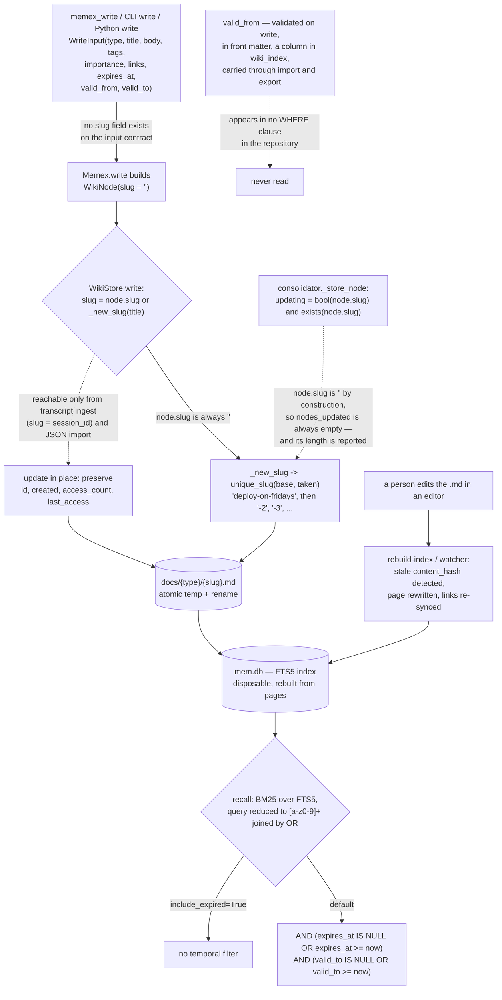

## 1. Executive Summary

memex is "[a] durable, local-first memory layer for AI coding agents", MIT,
Python 3.12+, version 0.2.4 — 10,249 lines with 297 test functions across
thirty-six test files, a published specification, and installers for four agent
harnesses. Its three claims are on the front page: "The filesystem is the memory
· the index is disposable · every session is provable."

The first two hold. A memory is a Markdown page with YAML front matter under
`~/.memex/docs/`, and SQLite FTS5 is an index that `memex rebuild-index`
reconstructs from the pages — including rewriting the front-matter `content_hash`
of a page somebody edited by hand, which makes editing a memory in your own
editor a supported operation rather than a corruption. An optional watcher does
the same continuously.

The third is the interesting one, because memex is one of very few systems here
that tries to *prove* memory was used. `memex verify` is documented as converting
"should have used memory" into a failing exit code: it checks that every page
parses, that every index row is fresh against its body hash, and that every
`[[link]]` resolves, and with `--since` plus `--require-recall` or
`--require-write` it fails the build when nothing was read or written since a
cutoff. The rest of the integration story is built around the same worry — that
agents forget to call tools — with per-turn injection hooks for pi, Claude Code,
Codex and Copilot so recall happens whether or not the model chooses it.

Against that care, the write path has a gap large enough to change what the
system is.

**Nothing can update a memory.** `WriteInput` carries type, title, body, tags,
importance, links, session and the three temporal fields — and no slug.
`Memex.write` constructs a `WikiNode` leaving `slug` at its empty default, and
`WikiStore.write` derives a slug whenever the incoming one is empty, passing it
through `unique_slug`, which returns `base`, else `base-2`, `base-3`. So writing
"Deploy on Fridays" twice produces two pages. Both are live, both are indexed,
both come back from recall, and if the second says something different from the
first, nothing resolves them.

The consolidator has the branch that would handle it:

```python
updating = bool(node.slug) and self._store.exists(node.slug)
```

`node` was built four lines earlier with no slug, so `bool(node.slug)` is always
false and `report.nodes_updated` is always empty — while the CLI and the MCP tool
both report its length as a result. And the tool description a model reads says
the opposite of what the code does: "Writing an existing slug updates it,
preserving creation history and access counts." The mechanism exists in
`WikiStore` — it preserves `id`, `created`, `access_count` and `last_access` for
an existing slug — and only two writers can reach it: transcript ingest, whose
episode slug is the session id, and JSON import, which carries slugs from an
export document. The tool a model actually calls cannot.

The consequence lands on correction. `forget` is by slug, so retiring the stale
page means finding it first; and because the retired file still exists, the next
write of that title becomes `-2` rather than reusing the slug. The store grows a
family of same-titled pages whose only distinguishing mark is a numeric suffix.

One more field is inert. `valid_from` is accepted by the API, validated as
ISO8601, written into front matter, given its own column in `wiki_index` and
carried through import and export — and appears in no `WHERE` clause in the
repository. The spec calls it "ISO8601 temporal validity start". Recall filters
`expires_at` and `valid_to` against now, never `valid_from`, so a page marked
valid from next year is returned today. The only test that touches it asserts it
survives a round trip.

The mark is for the forgetting test. `test_forget_soft` asserts a retired page is
absent from recall and, in the same body, that the same query with
`include_expired=True` returns it — the positive control that turns an empty
result into evidence about the filter rather than about the query. That pattern
is rarer in this corpus than it should be.

No trust-state mark: `valid_to` and `expires_at` are timestamps compared against
now, not a stored status, and there is no epistemic field at all — `importance`
is a continuous weight and the five node types are genres chosen at write time.
No audit mark either, and the reason is worth stating precisely: `logging.py`
opens with "Operation audit logging", and it is a `RotatingFileHandler` with
`maxBytes=5 * 1024 * 1024, backupCount=3` recording "slugs, counts, durations
only — never memory contents". A record that rotates itself away after four
files, and never says what a value was before, is an operational log wearing an
audit log's name.

## 2. Mental Model

A **page** is the memory. Markdown, front matter, in a directory named for its
type.

The **index** is a cache. Delete it, rebuild it, lose nothing.

A **write** makes a page. It never finds one.

**Forgetting** is a timestamp in the future's past, or the file being gone.



## 3. Architecture

| Area | Role |
| --- | --- |
| `domain/models.py` | Every wire contract, validated in `__post_init__` |
| `domain/operations.py` | One source for tool descriptions and wire types, shared by CLI and MCP |
| `infrastructure/wiki_store.py` | Markdown pages, atomic writes, slug derivation |
| `infrastructure/index_manager.py` | The FTS5 index and its schema |
| `infrastructure/bm25_retriever.py` | Search, filters, and access-counter side effects |
| `infrastructure/transcript_hook.py` | Session capture and provenance |
| `infrastructure/consolidator.py` | The only LLM call in the system |
| `application/verify.py` | The CI gate |
| `marketplace/` | Per-harness installers and hooks |

## 4. Essential Implementation Paths

`infrastructure/wiki_store.py:115-147` — the write, with the update branch and
the slug derivation that keeps it out of reach.

`infrastructure/bm25_retriever.py:127-131` — the two temporal predicates, and
which field is missing from them.

`application/verify.py:41-70` — three health checks and two activity-evidence
checks.

## 5. Memory Data Model

Front matter carries `id`, `type`, `title`, `tags`, `importance`, `created`,
`updated`, `access_count`, `last_access`, `expires_at`, `valid_from`, `valid_to`,
`transcript_ref`, `session_id`, `links` and `content_hash`. The body is Markdown
with `[[slug]]` links parsed into a `wiki_links` table.

The validation is unusually strict for a local tool — ISO8601 timestamps matched
against a regex *and* parsed, tags normalised and de-duplicated, importance
bounded, `session_id` restricted to `[A-Za-z0-9._-]` because it becomes a
filename, and a `TurnStreamEntry` that refuses `tool_name` on a non-tool role.
The module's own framing is that "[c]onstructors validate untrusted input eagerly
so invalid states stay unrepresentable past the boundary", and within a turn or a
page that is true.

What is unrepresentable is a *reference to an existing page*.

## 6. Retrieval Mechanics

BM25 over FTS5 with filters for node type, tag (AND semantics), an `updated`
range, and the two temporal predicates. The query reduction is the detail to
copy: `[a-z0-9]+` tokens joined by `OR`, so a query containing FTS5 operators or
unbalanced quotes degrades to a weak search instead of raising — stated in the
docstring as "untrusted input never reaches the FTS5 MATCH parser".

Recall bumps `access_count` and `last_access` on every returned hit, in the index
only; the files are untouched, so a read never dirties a page or a git diff. That
is the right split, and it is what makes `verify --require-recall` possible.

## 7. Write Mechanics

Covered above. One further note: `content_hash` is computed on every write and
used for index staleness, external-edit detection and `verify`'s `index-fresh`
check — never for de-duplication. Two pages with byte-identical bodies are two
memories.

## 8. Agent Integration

The integration layers are named and honest: pull (eight MCP tools the model may
call), push (harness hooks that inject memory every turn regardless), and proof
(`memex verify` in CI). The hook path is the answer to a real failure — a model
that has a memory tool and does not call it — and the verify path is the answer
to nobody noticing.

Tool descriptions are long, specify where each failure arrives, and are shared
between adapters so they cannot drift, under a stated rationale: "not every
consumer renders schemas, and the description is the one guaranteed-read
surface". That is good practice, which makes the one description that contradicts
its implementation costly: a model reading `memex_write` is told an update will
happen, and will not check for `title-2`.

## 9. Reliability, Safety, and Trust

Provenance traces a page to the transcript that produced it, with a confidence of
`direct`, `inferred` or `none` — `inferred` meaning an episode links to the node
rather than the node naming a transcript. Naming the weaker case rather than
flattening both into "has provenance" is the right call.

Restore moves existing data to `pre-restore-{timestamp}/` instead of deleting it,
and validates archive members against absolute paths, traversal and links before
extraction.

Transcript turns are "stored verbatim and never logged", and the logging module
records metadata only — a deliberate and well-kept boundary, which is separate
from the question of whether that log is an audit record. It is not.

## 10. Tests, Evals, and Benchmarks

297 test functions across thirty-six files, split unit and acceptance, with the
spec carrying a numbered acceptance-test table. The forgetting test earns the
mark by pairing its negative assertion with a positive control; `test_forget_decay`
directly below it makes the same negative claim without one, which is the
difference the mark is meant to detect.

The suite does not cover what the write path does on a repeated title through the
public API. `test_wiki_store_acceptance.py:52` asserts `third.slug ==
"ruff-linter-2"` at the store level — the behaviour is known and tested there —
but no test asks whether that is the right outcome for `memex_write`, and the
tool description says it is not.

## 11. For Your Own Build

Give the write contract a way to name an existing memory. An update path whose
only caller cannot construct the argument is not an update path, and the version
of this bug that costs you is the one where the description promises the
behaviour anyway.

Delete a field nothing reads, or wire it up. `valid_from` is on four surfaces and
in no query; every reader who sees it in front matter will assume it works.

Pair every "must not be retrieved" assertion with the same query proving the row
is still there. `test_forget_soft` is four lines and it is the difference between
testing a filter and testing a typo.

Ship the gate that proves memory was used. `memex verify --since --require-recall`
is a small amount of code for a question almost nobody in this corpus asks, and
it catches the failure that hooks and tool descriptions are both trying to
prevent.

And do not call a rotating operational log an audit log. Four files of metadata
with no before-image answers a different question than the name implies.

## 12. Open Questions

Whether the missing update is intended. The store supports it, the description
promises it, the consolidator has a branch for it, and no input can request it —
which reads more like a contract that lost a field than a decision.

What `nodes_updated` was meant to count. It is reported by two adapters and
cannot be non-empty.

Whether the harness hooks de-duplicate. Per-turn injection plus a write tool over
a store with no update is the combination that produces `-2` pages fastest, and
the hook code was not traced here.

## Appendix: File Index

| Path | What to read it for |
| --- | --- |
| `src/memex/infrastructure/wiki_store.py:115-147` | The update branch, and the slug derivation that hides it |
| `src/memex/domain/models.py:147-181` | A write contract with no slug |
| `src/memex/infrastructure/consolidator.py:189-205` | A flag that is always false |
| `src/memex/infrastructure/bm25_retriever.py:56-61`, `:127-131` | Safe query reduction, and the two predicates |
| `src/memex/application/verify.py:41-70` | Memory activity as an exit code |
| `tests/acceptance/test_operations_acceptance.py:48-62` | A negative assertion with its control |

## History

**2026-09-16** — [`80411705baa1004f061c8a0c29af94acbeb9e813`](https://github.com/phanijapps/memex/commit/80411705baa1004f061c8a0c29af94acbeb9e813) — first reading, at a commit dated 15 September 2026. Screened before opening, from a shallow clone: seven files scanned, no auto-run surfaces, one build-time execution point, no unpinned surfaces and three dependency files inside the seven-day cooldown. Nothing was installed, built or run.
