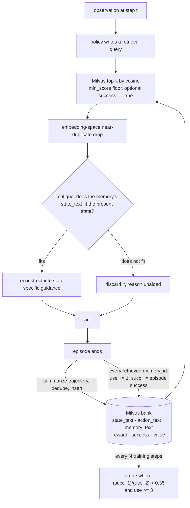

## 1. Executive Summary

MemHarness is a training stack rather than a library: 37,420 lines of Python
under `agent_system/` on top of a vendored 48,941-line `verl` trainer, Apache
2.0, 84 commits since 5 March 2026. Its paper is
[arXiv:2607.28272](https://arxiv.org/abs/2607.28272) (30 July 2026, cs.AI, 20
pages), titled *"Memory Is Reconstructed, Not Replayed"*, and the title is the
design.

**The claim it starts from is a failure mode this atlas records constantly.**
Most memory-augmented agents *"treat retrieved experiences as static records to
be replayed verbatim, injecting them into the context regardless of whether they
align with the agent's current situation"* — and the abstract names the
consequence as **negative transfer**. Retrieval that pastes a stale or
ill-fitting memory does not merely waste tokens; it makes the agent worse than
it would have been with nothing.

**The mechanism is a field, and it is the interesting one.** Every
`MemoryRecord` stores `state_text` — *the situation the memory was distilled
from* — alongside `action_text` and the `memory_text` lesson itself. Retrieval
returns the triple, and the policy's job at each step is to compare the
memory's original state against the present one, then rewrite the lesson into
state-specific guidance **or reject it and fall back to its own reasoning**.
That comparison is not prompted into a frozen model; it is trained end to end
with GRPO, so the ability to decline a badly-fitting memory is in the weights.

**The stored prior actually updates.** `experience_utility.py` keeps per-record
use and success counters and scores a record as
`(succ + 1) / (use + 2)` — a Beta(1,1) smoothed success rate, so a never-used
record sits at 0.5 rather than at zero or one. After each episode, every memory
id that appears in that trajectory's retrieval events has its counters
incremented, with success taken from the episode's own outcome. Then
`prune_low_utility_memories(threshold=0.35, min_uses=3)` deletes the records
whose measured rate has fallen below the floor, and the `min_uses` guard is what
stops one unlucky episode from evicting a good memory. This atlas repeatedly
finds a ranking prior that is assigned at write time and never moves; here the
prior is a measurement.

**Where it is weakest is verification and boundaries.** The memory subsystem is
6,044 lines and **has no test of its own** — the large `tests/` tree is verl's,
and its only memory-named file is about GPU buffers. And the scope key is
applied unevenly: `task_name` is stored on every record and AND-ed into the
deduplication probe and the random-state sampler, while the search that actually
feeds the agent's context sets a filter only when `only_successful` is on, and
then only `success == true`. Task isolation is real, but it comes from the
collection name defaulting to `agent_memories_<task_name>` — pass the optional
`collection_name` and the boundary is gone from the one path that matters.

## 2. Mental Model

A memory here is a lesson with its origin attached. The unit is not a fact and
not a message: it is `(state_text, action_text, memory_text)` distilled from one
step of one past trajectory, carrying `source_episode_id` and `source_step`, the
`reward` and `success` of the episode it came from, and a `value` that changes
over the store's life.

Nothing in that record is a claim about the world that could be contradicted.
`success` is not a judgement about the memory; it is the outcome of the episode
that produced it. So the state machine here is not epistemic — a record is
present or pruned — and what varies continuously is how much the store believes
the record is *useful*, which is a different axis from whether it is *true*.

**The lifecycle is the loop, and every stage is a decision the policy makes.**
At each step the policy writes a retrieval query; the store returns top-k above a
score floor; the policy critiques each hit by comparing its `state_text` to the
current observation; it either reconstructs the lesson into guidance for this
state or discards it and reasons unaided; it acts. At episode end a summarizer
distils new experiences from the trajectory and writes them back with
embedding-space deduplication, and the counters of every memory the episode used
are updated from whether the episode succeeded.

The consequence worth naming is that **the reject path is a first-class
outcome**. Most retrieval pipelines in this corpus can return nothing, but
cannot look at something and decide it does not apply; here that decision is
trained, and the paper's ablation claim is that the training improves the policy
*even when the memory is switched off at test time*.

## 3. Architecture

There is no service to adopt. MemHarness is a fork-and-train repository: conda,
vLLM 0.8.4, flash-attn, a vendored `verl` trainer, environment servers for
ALFWorld, WebShop, AppWorld, Sokoban and a search task, and **Milvus Lite
running locally** as the memory store — `pip install -e .` brings `pymilvus` in.
An OpenAI-compatible embedding endpoint supplies vectors (`bge_m3` at 1024
dimensions by default), so the store needs a model served beside it.

`agent_system/memory/` is the part this report is about, and the split inside it
is clean: `milvus_store.py` (1,003 lines) owns the collection, the schema and
the searches; `memory_manager.py` (569) owns the loop hooks, the write-back
schedule and the prune schedule; `experience_summarizer.py` (1,450) turns a
finished trajectory into records; `mem_adaptor_rollout.py` and
`mem_adaptor_training.py` bridge into verl's rollout and training paths; and
`experience_utility.py` (79) holds the counter arithmetic. A FastAPI wrapper and
a Slurm launcher exist for running the store as a separate process.

The operator cost is a training run, not a deployment — which also means the
memory design here has never had to survive an application's expectations about
correction, tenancy or deletion, and does not attempt them.

## 4. Essential Implementation Paths

- **Schema.** `agent_system/memory/types.py` — `MemoryRecord`, `RetrievedMemory`
  and `MemoryEvent`, the last being what a trajectory step records about what it
  retrieved.
- **Collection.** `milvus_store.py:45 _normalize_collection_name` — defaults to
  `agent_memories_<task_name>`, overridable by an explicit `collection_name`.
- **Retrieval.** `milvus_store.py:~385` — embed the policy's query, search
  top-k, drop hits below `min_score`, then near-duplicate hits in embedding
  space; the filter is set only when `only_successful` is on.
- **The scope predicate.** `_task_name_filter_expr` and
  `_scoped_search_filter_expr` (`:189`, `:193`), used at `:211` (the insert-time
  dedupe probe) and `:711` (the random-state sampler).
- **Write-back.** `experience_summarizer.py` distils records from the finished
  trajectory; `memory_text_dedupe.py:dedupe_indices_by_embedding_similarity` is
  the greedy keep-first filter applied before insert.
- **Utility.** `experience_utility.py:compute_utility_score`,
  `collect_memory_ids_from_info_list`, `episode_success_from_batch`.
- **Prune.** `memory_manager.py:~353` — every `prune_every_n_global_steps`, call
  `store.prune_low_utility_memories(threshold, min_uses)` inside a try/except
  that prints `experience_utility: prune FAILED … (training continues)`.
- **Tests.** None for any of the above.

## 5. Memory Data Model

The Milvus schema (`milvus_store.py:793`) is worth reading in full because every
column earns its place. `memory_id` is the primary key; `task_name` and
`item_id` locate the record; `source_episode_id` and `source_step` point at the
exact trajectory step it was distilled from; `state_text` (4,096 chars),
`action_text` (4,096) and `memory_text` (8,192) are the triple; `reward` and
`success` record how the source episode ended; `retrieval_count` and
`last_used_step` are usage telemetry; `value`, `value_source` and
`value_update_step` are the utility with its provenance and the step it last
moved; `created_step`, `created_at` and a JSON `metadata` blob carry the rest.

**Provenance here is unusually complete and is used for reasoning rather than
for audit.** Most systems in this corpus record where a memory came from so a
human can check it. This one records it so the *model* can check it: the
critique step exists because `state_text` is on the record, and a placeholder
constant — `MEMORY_STATE_UNAVAILABLE_PLACEHOLDER`, *"(Historical situation not
recorded for this memory.)"* — is written when the trajectory step cannot supply
one, with a comment explaining that copying `memory_text` into the field instead
would corrupt retrieval when the retrieval key *is* `state_text`. Declining to
fake the provenance field is a small decision that keeps the whole mechanism
honest.

Temporal fields are record time only — created, last used, value updated. There
is no validity axis and no as-of read, so `bitemporal` does not apply.

**There is no epistemic state.** The `value` is a float, which the rubric
excludes by name, and the boolean `success` describes the source episode rather
than the memory's standing. So `trust_state` is withheld — while noting that the
float here is doing more work than most status fields elsewhere, because it is
computed from outcomes rather than asserted.

## 6. Retrieval Mechanics

Dense only. The policy writes a natural-language query, `_embed_texts` sends it
to the embedding endpoint, and Milvus returns `top_k` (default 3) by cosine,
with `score = 1 - distance` and hits below `min_score` dropped. When
`only_successful` is set — and it defaults to true — the search filters to
`success == true`, so the bank the agent draws on is by default the record of
what worked.

Two refinements sit either side of that. Before insert, a probe searches the
neighbourhood for a near-identical `memory_text` so the bank does not accumulate
restatements. After retrieval, a second embedding-space pass drops near
duplicates among the hits themselves, prefetching beyond `top_k` so the final
set is still full after the drop. Deduplication at both ends of the pipe is
more care than most stores here take at either.

**The scope filter is the asymmetry.** `_scoped_search_filter_expr` builds
`task_name == "<task>"` — with backslash and quote escaping, which is the right
instinct — and AND-s `success == true` onto it when configured. It is called
from exactly two places: the insert-time dedupe probe and the sampler that draws
random `state_text` rows. The retrieval that assembles the agent's context does
not call it. With the default collection name the task boundary is the
collection and nothing leaks; supply `collection_name` to share a collection
across tasks and the dedupe probe stays scoped while the agent's own retrieval
does not. That is the shape the `scope_enforced` rubric excludes — a stored key
applied somewhere but not on the read path that matters — and it is why the mark
is withheld even though the key exists, is escaped, and is used.

The failure mode the design is built against is over-retrieval rather than
under-retrieval: with `top_k` at 3 and a score floor, the risk the paper cares
about is a hit that is close in embedding space and wrong for the current state,
which is precisely what the critique stage is trained to catch.

## 7. Write Mechanics

Nothing is written during an episode. At the end, `experience_summarizer.py`
turns the finished trajectory into candidate records — 1,450 lines, the largest
file in the subsystem — and each candidate is embedded, checked against its
neighbourhood for a near-identical `memory_text`, and inserted. The agent
therefore cannot decide mid-task to remember something; the loop decides after
the outcome is known, which is also what makes the outcome available to attach.

**The utility update is the part worth copying.**
`collect_memory_ids_from_info_list` walks every `memory_event` in the
trajectory's info list and unions the `memory_id`s that were retrieved;
`episode_success_from_batch` reads whether that episode succeeded; each of those
records then has `utility_use_count` incremented and `utility_succ_count`
incremented on success, and `utility_score` recomputed. A memory's standing is
the smoothed rate at which episodes that used it went on to succeed — an
attribution that is crude (every retrieved memory in a successful episode gets
credit) and honest about being a counter rather than a causal estimate.

Deletion is that score plus a guard. `prune_low_utility_memories(0.35, 3)`
removes records below the floor **only** once they have been used three times,
so the Beta prior's 0.5 starting point cannot be dragged under the threshold by
a single failure. There is no correction: a record cannot be edited, superseded
or marked wrong, and there is no value-keyed rejection, so a lesson pruned for
poor utility can be re-derived from a later trajectory and reinserted — the
dedupe probe will catch it only if the wording is close enough in embedding
space.

### Operational cost

The write path costs one summarization pass per episode plus embeddings for each
candidate, entirely off the agent's critical path. Retrieval costs one embedding
of the query and one Milvus search per step, which *is* on the critical path and
is the reason `top_k` is 3. The prune is a periodic scan every
`prune_every_n_global_steps` training steps.

Both the prune and the store-clear are wrapped so that a failure prints
`(training continues)` and returns. That is the right call for a trainer — a
memory-maintenance error should not kill a multi-day run — and it is also a
silent-degradation path: a store whose prune has been failing looks exactly like
a store with nothing to prune.

## 8. Agent Integration

There is no SDK, no MCP server and no application-facing API. The integration
surface is the verl-agent rollout: `mem_adaptor_rollout.py` injects the memory
stage into generation and `mem_adaptor_training.py` carries the resulting
structure into the training batch. Adopting the memory design outside this
repository means lifting `agent_system/memory/` and reimplementing the loop —
which is a reasonable thing to want, because the store, the counters and the
dedupe are independent of the trainer.

The model's authority over memory is total and trained rather than granted: it
writes the query, judges the fit, and decides whether to use what it gets. There
is no human in any of it — no review surface, no approval, no way for a person
to mark a memory wrong — so `human_review` is withheld without a near-miss to
report.

## 9. Reliability, Safety, and Trust

The safety story is mostly absent, and mostly out of scope for a training
harness: no redaction, no secret scanning, no tenancy, no deletion on request.
The store holds trajectories from benchmark environments, so the material is
synthetic by construction — but anyone lifting this design into a product
inherits a bank of verbatim observations with no filter between the environment
and the vector store.

**What it does have is a defensible position on trust.** The `value` is not a
model's self-report; it is a count. `value_source` records where the number came
from and `value_update_step` when it last moved, so a record can be asked *why*
it ranks where it does. That is a smaller claim than an epistemic status and a
better-founded one, and the atlas's recurring complaint — a confidence float
that nothing updates — does not apply here.

**The verification gap is the finding.** 6,044 lines of memory code, a schema
with sixteen fields, a utility rule, a prune rule, two deduplication passes and
a scope predicate, and **not one test covering any of it**. The repository's
`tests/` tree is inherited from verl and is substantial; its only memory-named
file, `tests/gpu_utility/test_memory_buffers.py`, is about GPU buffers. A
refactor that dropped the `min_uses` guard, inverted the dedupe threshold, or
removed the escaping from the task filter would pass everything that runs here.
For a subsystem whose central claim is behavioural, that is the gap a reader
should weigh before lifting it.

## 10. Tests, Evals, and Benchmarks

Evaluation is the paper's, and the numbers are strong: the README reports
**85.2%** on ALFWorld and **75.6%** on WebShop, `+8.8` and `+9.5` points over
pure GRPO, **85.9%** average on unseen ALFWorld layouts against 76.3% for naive
memory replay, and — the claim most worth noticing — **83.0% on ALFWorld with
memory disabled at test time** against 76.4% for pure GRPO, which is the
argument that the reconstruction objective improves the policy itself rather
than merely supplying it with context.

Three things a reader should hold alongside those figures. **No run artifacts
are committed**: `run_scripts/` carries the two training scripts and
`examples/data_preprocess`, and there is no results directory, no per-task
output and no seed record, so the numbers are reproducible only by retraining.
The comparison is against the authors' own baselines under their own harness,
which is ordinary for the field and still means the reader is trusting one
group's stack end to end. And an independent attempt to use the same idea
measured much less: the study behind
[*The Shapes of Agent Memory*](https://www.pinglin.tw/blog/the-shapes-of-agent-memory/)
records MemHarness's published 0.852 on ALFWorld as the bar, and its own
experience-bank arm reached 0.645 with a 35B actor and moved a frontier actor
from 0.959 to 0.973 — a different setup measuring a different thing, and a
useful reminder that a published agentic number carries its actor with it.

There is no committed negative case, no evaluation of the memory layer in
isolation, and nothing asserting that a particular record must not be retrieved,
so `negative_eval` is withheld along with everything else.

## 11. For Your Own Build

### Steal

- **Store the situation the lesson came from, next to the lesson.** A record of
  `(state, action, lesson)` lets a reader — model or human — ask whether the
  lesson's original context resembles the present one. Almost every store in
  this corpus keeps the conclusion and drops the circumstances, which is exactly
  what makes a stale memory indistinguishable from a live one at read time.
- **Make "this memory does not apply" a first-class outcome.** A retrieval
  pipeline that can only return or not return cannot express *I looked at this
  and it does not fit*. Training that judgement, rather than prompting it, is
  what this design is for, and the effect it reports survives the memory being
  switched off.
- **Let the ranking prior be a measured rate, not a written number.**
  `(succ + 1) / (use + 2)` over episodes that retrieved the record is cheap,
  needs no judge, and starts every record at 0.5 so nothing is trusted or
  condemned before it has been used.
- **Guard eviction with a minimum sample.** Pruning below a score floor *and*
  after at least three uses is the difference between removing a bad memory and
  removing an unlucky one.
- **Deduplicate at insert and at read.** A neighbourhood probe before insert
  stops the bank filling with restatements; a second pass over the hits stops
  one lesson occupying the whole context window. Prefetching beyond `top_k`
  keeps the final set full after the drop.
- **Refuse to fake a provenance field.** Writing *"(Historical situation not
  recorded for this memory.)"* rather than copying the lesson into the state
  column keeps the retrieval key honest, and the comment says so at the
  assignment.

### Avoid

- **A scope predicate that guards the housekeeping and not the read.** The task
  filter here is written, escaped, and applied to the dedupe probe and the
  sampler; the retrieval that reaches the agent omits it, and the boundary is
  actually the collection name. Enumerate every call site that touches the
  store and ask which of them a caller can reach.
- **Six thousand lines of memory with no test.** The utility arithmetic is a
  pure function of two integers and the dedupe is a pure function of two
  vectors — the two easiest things in the subsystem to pin, and neither is
  pinned. A behavioural claim with no executable behind it is a claim that
  survives its own refactor.
- **Maintenance that fails open and silently.** `prune FAILED … (training
  continues)` is right for a long training run and wrong as the only signal: a
  store that has stopped pruning looks like a store with nothing to prune.
- **Headline numbers with no committed artifacts.** Two training scripts and a
  preprocessing example are not a reproduction path for a twenty-page result.

### Fit

Take this if you are training a policy rather than shipping a store, and the
question you have is whether retrieved experience helps your agent act. The
design is coherent, the loop is legible, and three of its parts — the
state-carrying record, the utility counters and the double deduplication — lift
cleanly into a different system.

Walk away if you need a memory layer for an application. There is no correction,
no scope you can rely on, no audit, no human surface and no deletion on request;
the memory is trained into a policy you would have to train yourself; and the
subsystem carrying all of it has no tests. This is a research artifact that
argues one point well, and the point — that a retrieved memory should be
examined against the present state rather than pasted into it — is worth more
than the code that demonstrates it.

## 12. Open Questions

- The utility counters credit every memory retrieved in a successful episode
  equally. What would a per-step attribution — crediting only the memories
  retrieved at steps whose actions advanced the reward — do to the pruning
  decision, and is the smoothed rate stable enough at `min_uses = 3` to survive
  it?
- A pruned lesson can be re-derived from a later trajectory and reinserted, and
  the only thing between it and the bank is an embedding-similarity probe. Would
  a fingerprint of the pruned text, consulted at insert, be worth the storage —
  or is re-derivation after a low measured utility actually the desired
  behaviour?
- The critique stage decides whether a memory fits the current state. Is that
  decision recorded anywhere a later analysis could read — how often the policy
  rejects what it retrieves, and whether the rejection rate tracks the utility
  score the store already keeps?
- `only_successful` defaults to true, so the bank the agent draws on is what
  worked. What does a failure bank buy — is a memory of what went wrong useful
  under the same critique-and-reconstruct loop, or does it need a different
  prompt?

## Appendix: File Index

**Memory subsystem** — `agent_system/memory/`
- `types.py` — `MemoryRecord`, `RetrievedMemory`, `MemoryEvent`, and the
  unavailable-state placeholder
- `milvus_store.py` — the collection name, the sixteen-field schema, the
  retrieval search, `_task_name_filter_expr`/`_scoped_search_filter_expr`, the
  insert-time dedupe probe and `prune_low_utility_memories`
- `memory_manager.py` — the loop hooks, the write-back and prune schedules and
  their fail-open wrappers
- `experience_summarizer.py` — trajectory to records
- `experience_utility.py` — `compute_utility_score`,
  `collect_memory_ids_from_info_list`, `episode_success_from_batch`
- `memory_text_dedupe.py` — greedy keep-first embedding deduplication
- `mem_adaptor_rollout.py`, `mem_adaptor_training.py` — the verl bridges
- `memory_fastapi.py`, `local_service.py`, `remote_slurm_launcher.py` — running
  the store out of process

**Environments and training**
- `agent_system/environments/env_package/` — ALFWorld, WebShop, AppWorld,
  Sokoban, search
- `run_scripts/train_alfworld.sh`, `run_scripts/train_webshop.sh`
- `verl/` — the vendored trainer

## History

**2026-08-17** — [`31329e8e084c7fdf20556874950f6c2100b8b28e`](https://github.com/KnowledgeXLab/MemHarness/commit/31329e8e084c7fdf20556874950f6c2100b8b28e) — First reading, at 84 commits since 5 March 2026, with the paper at [arXiv:2607.28272](https://arxiv.org/abs/2607.28272) (30 July 2026, cs.AI). Screened before reading: 0 auto-run surfaces, 3 build-time execution paths, 8 unpinned dependency surfaces across four requirements files, nothing inside the seven-day cooldown; nothing was installed, built or run — the stack wants conda, vLLM, flash-attn and a served embedding model. In scope where [MemAgent](../../compare/#not-in-scope-conversation-window-management) is not: the experience bank is a Milvus collection that outlives the episode, is retrieved by a query the policy writes, and carries per-record counters that change with use. No capability mark. The four near-misses worth stating: a `value` that is a genuine measured prior — `(succ + 1) / (use + 2)` over episodes that retrieved the record — and therefore a float where the rubric asks for a discrete state; a `task_name` scope key that is stored, escaped and AND-ed into the insert-time dedupe probe and the random-state sampler but not into the retrieval that feeds the agent, leaving the boundary to a collection name that defaults per task; provenance rich enough to reconstruct a memory's origin, used for the policy's critique rather than recorded as an audit of mutations; and pruning that deletes by measured utility rather than by any rejection keyed on a value, so a pruned lesson can be re-derived and reinserted. The subsystem is 6,044 lines and has no test of its own; the repository's large `tests/` tree is inherited from `verl` and its one memory-named file concerns GPU buffers. No run artifacts are committed for the published ALFWorld and WebShop figures.
