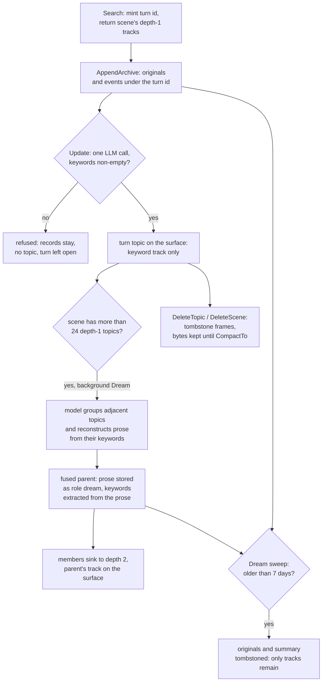

## 1. Executive Summary

MemHop is an embedded Go library that gives an agent a memory in one `.meh`
file: a turn's text is kept verbatim for seven days, and what the agent carries
beyond that is an LLM-extracted keyword track per turn, folded by a background
"Dream" pass into keyword tracks of model-written reconstructions. The host
drives it — `Search` opens a turn and returns the scene's keyword tracks,
`Update` closes it — and there is no scored retrieval at all.

What is notable is the storage engine and the test discipline around it:
CRC-checked frames, A/B headers, torn-write recovery, per-agent domains keyed in
every frame, and interface tests whose negative cases carry positive controls
and say why. What is weak is the epistemics: every layer that outlives the
window is model output, nothing marks it as less than true, and deletion and
retention remove rows from reads while the bytes stay in the file.

The library was built as the memory of MeowAgent, a host the README links as
"coming soon". Its surface has moved fast: v1.5.0 (1 September 2026) deleted a
BM25, vector and entity retrieval subsystem with RRF fusion, and v1.6.5
(22 September 2026) retired the MCP server, leaving a Go module only
(`CHANGELOG.md:369`, `:857`). The licence is a dual MIT or Apache-2.0 grant.

Two marks. `scope_enforced`, because every record frame carries its agent id and
every read path is keyed by it. `negative_eval`, on offline interface tests that
assert a sibling domain's text and a deleted turn's originals stay out of
populated reads. Section 9 names the five withheld.

## 2. Mental Model

A memory is a **topic**: one turn of one scene, identified by a hash of the
scene id and a per-scene turn counter (`internal/repo/core/model.go:162-169`).
`Search` mints the id before the turn runs; the host appends the turn's
originals and events under it; `Update` writes the user and agent text into
slots 1 and 2 and asks the model for a keyword list, and only when that list is
non-empty is the topic written (`internal/update.go:48-71`, `:105-141`). From
that moment the track is on the scene's read surface. There is no candidate
state and no check of what the model extracted.

**What survives is not what was said.** The extraction prompt asks for
keywords whose union lets a reader recover the original's facts and tone, with
synonyms added (`internal/cap/llmops/keywords.go:30-42`). The originals are
swept seven days after they were written; the track is not
(`internal/dream/prune.go:16-47`). So after a week a turn is its keyword list and
nothing else, and no pointer leads back to the text.

**Consolidation replaces tracks with tracks of reconstructions.** When a scene
passes 24 depth-1 topics, Dream asks the model which adjacent topics share a
thread and to "reconstruct the multi-turn keywords" into prose written "as if
you are rewriting what was originally said"
(`internal/cap/llmops/consolidate.go:39-43`). That prose is stored as the fused
parent's slot-1 utterance with the role `dream`, keywords are extracted from it,
and the members sink to depth 2 (`internal/dream/compress.go:183-210`). The
summary ages from the fold, so a week later the fused topic too is a keyword list
— of a reconstruction, of keyword lists.

**How a topic stops being a belief.** The host deletes it (`DeleteTopic`,
`DeleteScene`, `MergeScenes`), or Dream folds it off the surface. Nothing
expires a track. A fold that would sink a topic to depth 4 deletes it instead
(`internal/repo/l2layer.go:37-42`), and
`internal/dream/repeated_folds_test.go` pins that repeated folding collapses to
one surface row rather than reaching that gate. The profile's personality, MBTI
and emotion are refined by Dream from up to 200 top-ranked scene nodes; the
host's name, role and preferences are left alone.

## 3. Architecture

MemHop is a library: `api` is the public facade, `internal` holds one
composition root with per-layer packages under it, and `internal/repo/core` is
the storage engine (`README.md:222-250`). Three direct dependencies —
`xxhash`, `go-openai` and `golang.org/x/sys` — and no embedding or vector
service (`go.mod`). The LLM is any OpenAI-compatible chat endpoint, called for
keyword extraction, consolidation and profile distillation.

**The engine is an append-only record log.** Each frame is type, flags, length,
agent id, id hash and a CRC32 over header and payload, 26 bytes of header
(`internal/repo/core/frame.go:15-19`). Writes append and re-point an in-memory
index; deletes append a `FlagDeleted` frame with no payload
(`internal/repo/core/engine_delete.go:14-25`, `:75-93`). The file opens through
an mmap with A/B headers and an optional snapshot of the index, and a torn tail
is truncated on open. A cross-platform exclusive lock makes a second `Open` of
the same file fail.

**Domains share one file.** The primary index is `agentID → idHash → offset`
and the type index is keyed the same way (`internal/repo/core/engine.go:33-48`),
so one file holds the primary agent, any number of named sub-agents, and a
reserved domain for the shared L3 graph (`frame.go:40-49`). Each domain has its
own lock, caches and Dream; different domains run in parallel.

**Dream is the only background process.** `Update` schedules it for one scene
in a goroutine once that scene passes the topic threshold, one pass in flight
per scene; a host may call it too (`internal/dream.go:80-114`). A pass holds the
domain lock for its whole run, LLM calls included (`internal/dream.go:27-78`).

### Deployment and ergonomics

Nothing runs beside the host process: one file and an LLM endpoint. The
endpoint is required at `Open` — `LlmConfig` is validated before the path is
touched — and no turn can close without it, because `Update` refuses to write a
topic without keywords. Offline, the store opens and reads, and nothing new
becomes memory. Install is `go get`. The `.meh` format is binary JSON-in-frames
and not hand-editable; only format `0x0012` opens, with no migration from older
files (`README.md:40`).

## 4. Essential Implementation Paths

**Turn open.** `DB.Search` resolves the scene — the domain's current one, a new
one, or a named one that must exist — advances its turn counter, reads the
profile, and returns the scene's depth-1 topics from the L2Meta cache with the
new turn id (`internal/search.go:33-74`, `:85-118`;
`internal/scene/surface.go:14-28`). No LLM call and no scoring.

**Turn content.** `Session.AppendArchive` validates and writes one utterance or
event into the open turn; the call names no ids, and with no turn open it is
refused. A host may not append with role `dream`
(`internal/content/content.go:76-86`; `api/session.go:299`).

**Turn close.** `DB.Update` batch-validates and writes the input, output and
outcome records, then `settleLocked` reads the turn's utterances, calls
`llmops.ExtractKeywords`, and writes the turn topic with the utterances' time
bounds (`internal/update.go:48-141`). Inputs over 2,000 runes are chunked, and
each chunk runs a ladder of three token budgets and one format-constrained retry
(`internal/cap/llmops/keywords.go:61-132`).

**Consolidation.** `RunDream` sweeps archives and plan nodes first, then
`CompressScenes` fans out at most four scenes, asks `llmops.Consolidate` for
groups, and `applyOneGroup` writes the summary, extracts its keywords, creates
the fused parent and sinks the members, rolling back on any failure
(`internal/dream.go:27-78`; `internal/dream/compress.go:33-237`). Structure
stages rebuild L1 nodes and hyperedges, decay them, and distill the profile.

**Correction.** `DeleteTopic` and `DeleteScene` enumerate the subtree, then
`scene.DeleteCascade` tombstones archives, plan nodes and topic and scene records,
deepest first (`internal/scene/delete.go:25-44`). `DeleteL3` detaches scene
anchors across domains.

**Reads beyond the surface.** `SearchL4` takes keyword, time, ids, topic, kind,
plan step and content type as conjunctive conditions
(`internal/repo/l4layer.go:107-121`, `:183-198`). `QueryL3Nodes` is a
case-insensitive substring over title, content and keywords, and
`QueryL3Subgraph` a BFS (`internal/graph/query.go:41-55`).

**Tests.** `api/` holds the facade suites, `internal/` the white-box ones, and
`test/` the host-face interface suite against a mock OpenAI server; seven
`test/` files carry the `integration` tag and need a real endpoint.

## 5. Memory Data Model

Eleven record types share one frame format, in six groups plus a registry
record naming each sub-agent (`frame.go:23-38`):

- **`ProfileSlot`** (L0): name, role and preferences from the host;
  personality, MBTI and emotion distilled by Dream; `AgentType` stamped by the
  library (`model.go:18-33`).
- **`SceneNode`, `SceneEdge`** (L1): one node per scene with importance, valence
  and arousal, and keyword-overlap hyperedges whose weight decays. Dream is the
  only writer.
- **`SceneSlot`, `TopicSlot`** (L2): a scene is a host session with a turn
  counter and an optional L3 anchor; a topic is a turn or fused group with a
  parent pointer, depth, name, one keyword track and two timestamps
  (`model.go:80-130`).
- **`HypergraphSlot`, `HypergraphNode`, `HypergraphEdge`** (L3): named graphs of
  typed nodes with keywords and an optional source reference, and unweighted
  kinded edges (`model.go:171-202`).
- **`ArchiveSlot`** (L4): one utterance or event, addressed by topic and slot,
  with role, content type, event type, plan-step binding, `CreatedAt` and content
  (`model.go:217-244`).
- **`PlanNode`** (L5): one step of a turn's task tree, with status
  `in_progress`, `done` or `failed` (`model.go:246-288`).

**Scope** is the frame's agent id, plus the scene id on each topic. **Time** is
the host-supplied `CreatedAt` on archives, required in milliseconds and refused
in seconds or microseconds, and the user and agent timestamps on topics. There is
no validity time, no source on a keyword track, and no status on any memory row;
the one provenance mark is the `dream` role on a fused summary.

**Ids are positional.** A turn is `hash("turn:"+scene+":"+seq)`, a content slot
`hash("content:"+topic+":"+seq)`, and a fused parent hashes its bounds and its
sorted member set (`model.go:141-169`, `:237-244`). Re-closing a turn rewrites
its two dialogue slots in place instead of adding versions.

## 6. Retrieval Mechanics

There is none in the ranking sense, by decision. What a host injects is the
keyword tracks of the scene's depth-1 topics, in the order the turns were spoken,
served from memory (`internal/scene/surface.go:14-28`). Choosing the scene is the
host's job: one scene is one session, so the library never guesses which past
conversation a message belongs to.

That removes stale-hit and over-recall failures by construction and moves them
into consolidation. Everything in the scene is recalled every turn, and the size
of that is held only by Dream converging the scene toward
`DreamCompressMinTopics` (default 20) once it passes 24. A track has no length
cap — the extraction prompt says "No limit on count" — so the injected block is
bounded in topics and unbounded in words (`keywords.go:37`). Topics in other
scenes of the same domain are not recalled unless the host opens that scene.

The other reads are lookups. `SearchL4` over originals is a lowercase substring
match, and outside the seven-day window it finds nothing because the records are
gone (`l4layer.go:198`). L3 node queries are substring, type and id filters that
AND together; subgraph walks can be narrowed by edge kind, and an undefined kind
is refused rather than answered with an empty graph. The `profile.Brief` digest
that `Search` returns is capped per field, at 2,100 runes worst case
(`internal/cap/profile/profile.go:19-34`).

## 7. Write Mechanics

Writes are explicit and host-driven. The engine never decides that something is
worth remembering: every turn the host closes becomes a topic, and the agent's
own output is distilled beside the user's, so a claim the agent invented is
extracted into the same track as one the user made
(`internal/update.go:76-97`). Nothing filters injected or adversarial text before
extraction.

Updates overwrite in place under a positional id; the old frame stays in the log.
`UpdateL0` replaces the host-owned profile fields, and the guide warns that a
write omitting `Personality` clears the Dream-refined value until the next pass
(`README.md:177`). `ImportL3` has three modes — skip, merge (union keywords,
append content) and overwrite — over the shared pool
(`internal/graph/import.go:40-57`; `internal/cap/knowledge/nodemerge.go:16-40`).

Consolidation validates what the model proposes against what it was shown. A
group of one, a member another group already claimed, an id not in the listing
handed to the model, and an empty summary are each counted unusable and skipped;
an engine failure mid-group rolls back the parent, the summary and any members
already sunk (`internal/dream/compress.go:102-142`, `:160-237`). The prompt ranks
"an unrelated pair fused into one thread is a false memory" above the
compression target (`consolidate.go:41`).

### Operational cost

`Update` is synchronous: one keyword-extraction call, inside the domain lock, and
the turn is not memory until it returns. A long turn is chunked into several
calls. After `Update` returns, the track is readable immediately. Dream is
deferred but not free for the agent: it holds the same lock across one
consolidation call per qualifying scene, one extraction call per applied group
and one distillation call over up to 200 samples, so a turn that starts while a
scene is consolidating waits (`internal/dream.go:27-32`). Every Dream reads all
plan nodes from disk; the archive sweep works from the in-memory index. Nothing rewrites the
whole store. Injection is the whole scene's surface each turn, placed wherever
the host puts it.

## 8. Agent Integration

MemHop ships no tool server and no hook. The host holds a `Session` per domain
and calls `Search` at turn start, `AppendArchive` while the turn runs and
`Update` at its end; `INTEGRATION_GUIDE.md` §6.5 shows the loop behind a
decision-loop kernel's memory port, and §7.7 is a suggested table of eighteen
tool bindings with the JSON keys a model fills
(`INTEGRATION_GUIDE.md:556-600`). `api/surface_tool_map_test.go` holds the table
to the facade's shapes, and fails if a struct gains an unlisted field or an
admin-face method enters the table.

The split is the design's agency boundary. The eight admin methods — scene and
topic delete, merge, rename, graph rename and delete, and `AgentID` — are
"deliberately absent" from the tool table because "a model that can destroy
records needs the host's approval path" (`INTEGRATION_GUIDE.md:596-599`). The
model may still write the profile, append archives, trigger Dream and import into
the shared graph in overwrite mode. Porting to another Go host is direct; to
another language it means embedding the library behind a service, which the
project removed when it retired MCP.

## 9. Reliability, Safety, and Trust

**Storage integrity is the strongest part.** Frames are CRC-checked, a torn tail
is truncated on open, and headers alternate (`internal/repo/core/engine_recovery.go`);
`crash_recovery_test.go` and `snapshot_vs_scan_test.go` cover both.
An index entry pointing past the record area is reported as corruption rather
than as not-found (`engine_read.go:25-35`).

**Deletion and retention remove rows from reads, not from the file.**
`DeleteTopic`, `DeleteScene` and the seven-day sweep all end in
`DeleteRecordBatch`, which appends tombstones (`l4layer.go:44-68`;
`engine_delete.go:41-72`). The deleted payload stays in the `.meh` file until
`CompactTo` writes a copy with only live records, which the host must swap in
itself (`internal/db.go:275-300`). Nothing calls it automatically. The sweep's
own comment, "retention is what bounds the file" (`prune.go:24`), is true of the
live set and not of the bytes.

**Nothing withholds a memory.** A keyword track, a model reconstruction and a
host-imported graph node are all read as they are. The `dream` role separates a
summary from an utterance on the archive read, and a host cannot forge it, but
the track extracted from that summary carries no such mark on the surface.

**The shared L3 pool crosses the domain boundary by design.** Any domain's
session can import, overwrite, rename or delete a graph every other domain
reads; the tests assert that sharing (`test/api_interface_multi_test.go:135-151`).

Marks withheld:

- **`tombstone`** — `FlagDeleted` frames are keyed on a record id and dropped by
  `CompactTo`; nothing records a rejected value, and a re-closed or re-imported
  claim is written again.
- **`trust_state`** — no status field on topics, archives, graph nodes or the
  profile; `PlanNode.Status` is task progress, not belief.
- **`bitemporal`** — `CreatedAt` is when a line was said, the topic timestamps
  are its span; no validity interval exists.
- **`audit_log`** — the record log is the storage mechanism, is compacted away,
  and has no reader of past frames; `DreamReport` is returned, not stored.
- **`human_review`** — no memory waits in any state; `Update` writes the topic
  on the extraction's return.

## 10. Tests, Evals, and Benchmarks

I read the tests and ran none of them. The suite is large for the code: 561 test
functions and 13 benchmarks in 32,325 lines against 12,915 lines of source. Of all
574 tests and benchmarks, every one but 15 runs offline against a mock OpenAI server, and CI runs `go build`,
`go vet`, `go test ./...` and a race run on Linux, macOS and Windows, plus a
`gofmt` check and a compile of both guides' skeletons off Windows
(`.github/workflows/workflow.yml`).

The negative cases are the reason for the mark. The isolation tests read a
sibling's text by keyword and by archive id and assert nothing comes back, each
beside a read that must return rows — one with the failure message *"beta's
unfiltered read came back empty, so the ids case proves nothing"*
(`test/api_interface_multi_test.go:87-92`, `:380-394`). The delete test asserts
the deleted turn's originals read back empty while the kept turn stays on the
surface (`test/api_interface_scene_test.go:417-433`). Many cases also pin a
guide's numbers and symbols to the code (`api/guide_numbers_test.go`,
`api/guide_symbols_test.go`).

What the offline suite cannot test is the model. Keyword faithfulness,
consolidation fidelity and the "false memory" rule in the consolidation prompt
are exercised only by the integration files — `TestKeywordFidelity`,
`TestDreamCompressionFidelity`, `TestCoreCycleUpdateDream` — which need
`MEMHOP_TEST_LLM_KEY` and are not in CI. `benches/fixtures/locomo10.json` is used
as conversation material for ingestion, and the README says why there is no
LoCoMo or LongMemEval score (`test/fixture_test.go:15-18`; `README.md:218-220`).
No benchmark result is committed. No paper was found: the only
`citation` matches are about citing code symbols in guides.

Tests I would want: that a fused group's track contains no keyword absent from
its members' tracks; and that bytes of a deleted topic are absent from the file
after `CompactTo` and present before it, so the guarantee a host must act on is
pinned.

## 11. For Your Own Build

### Steal

- **Key the domain into the frame, not the path.** An agent id in every record
  header, with every index keyed by it first, gives one file many tenants and
  makes a foreign-domain read structurally impossible rather than filtered.
- **Put a positive control in the same test as the negative.** "The same query
  shape returns rows inside the domain — so this is scoping, not a filter that
  never matches" is the comment to copy.
- **Validate model proposals against what the model was shown.** Refuse a merge
  group naming an id outside the listing, a member already claimed, or an empty
  summary, and roll back a partial group.
- **Keep destructive verbs off the tool table and test that they stay off.**

### Avoid

- **Chaining lossy model transforms with the source on a timer.** Keywords of a
  reconstruction of keywords, with the originals swept after a week, is a store
  whose contents drift from what was said and cannot be checked against it.
- **Calling a tombstone sweep retention.** If deletion appends, say what bounds
  the file and make compaction part of the lifecycle, or the privacy guarantee is
  the host's unwritten chore.
- **Running consolidation under the lock the next turn needs.**

### Fit

MemHop suits a Go host that runs one agent, or a family of them, over sessions it
already delimits, and wants a single-file store with no retrieval to tune and a
storage layer engineered with unusual care. It suits badly anything that must
answer "what did the user actually say" after a week, anything with a deletion
obligation the host will not meet with `CompactTo`, and anything that needs
recall across sessions by relevance, since a topic outside the open scene is
reachable only by substring over originals that expire. A single maintainer and
a surface that changed shape twice in September 2026 make it a design to study
before a dependency to adopt.

## 12. Open Questions

- How faithful are the tracks in practice? The integration fidelity tests exist
  and need a live model; no run is committed.
- Does the host MeowAgent call `CompactTo`, and on what schedule?
- How large does a scene's surface get between the 24-topic trigger and the
  fold, given tracks have no length cap?
- Is the L3 pool meant to be writable by a sub-agent's model in overwrite mode,
  or only by the host?

## Appendix: File Index

- **Engine:** `internal/repo/core/frame.go`, `engine.go`, `engine_read.go`,
  `engine_write.go`, `engine_delete.go`, `engine_recovery.go`,
  `engine_lifecycle.go`, `reclaim.go`, `model.go`, `model_enums.go`.
- **Layers:** `internal/repo/l0layer.go` … `l5layer.go`,
  `internal/repo/index/l2meta.go`, `internal/repo/index/l4.go`.
- **Turn loop:** `internal/search.go`, `internal/update.go`,
  `internal/content/content.go`, `internal/scene/surface.go`.
- **Dream:** `internal/dream.go`, `internal/dream/compress.go`,
  `internal/dream/prune.go`, `internal/dream/structure.go`,
  `internal/cap/engram/decay.go`, `internal/cap/profile/distill.go`.
- **Prompts:** `internal/cap/llmops/keywords.go`, `consolidate.go`,
  `distill.go`.
- **Domains:** `internal/agents.go`, `internal/db.go`.
- **Correction:** `internal/scene/delete.go`, `internal/l2.go`, `internal/l3.go`.
- **Facade:** `api/open.go`, `api/session.go`, `api/types.go`.
- **Tests:** `test/api_interface_multi_test.go`,
  `test/api_interface_scene_test.go`, `test/api_interface_delete_cascade_test.go`,
  `internal/dream/repeated_folds_test.go`, `api/surface_tool_map_test.go`.

### Recorded searches

Checked against the checkout at the pinned revision.

- `grep -rloiE 'arxiv|bibtex|@article|@misc|doi\.org|CITATION' --exclude-dir=.git .` — `README.md` and `api/guide_symbols_test.go`, both about citing code symbols; no `CITATION.cff`.
- `grep -rniE 'verified|pending|candidate|approve|quarantin|trust' --include='*.go' . | grep -v _test` — comments only; no status field on a memory row.
- `grep -rniE 'audit|journal|mutation log' --include='*.go' .` — no match.
- `grep -rnE 'valid_from|valid_to|ValidFrom|ValidUntil|valid_at|invalid_at' --include='*.go' .` — no match.
- `grep -rniE 'embedding|cosine|vector' --include='*.go' . | grep -v _test` — comments recording the removed embedding service; no read path.
- `grep -rniE '\bmcp\b' --include='*.go' .` — no match.
- `grep -rnE '\.DeleteRecordBatch\(|\.DeleteRecord\(' --include='*.go' . | grep -v _test` — every delete, sweep and decay path; each appends tombstones.
- `grep -rn 'CompactTo\|\.Compact(' --include='*.go' . | grep -v _test` — `internal/db.go` and `api/open.go` only; no caller inside the library.
- `grep -rn 'RoleDream' --include='*.go' . | grep -v _test` — one writer, `internal/dream/compress.go:190`.
- `grep -rlE '^//go:build integration' --include='*_test.go' .` — seven files under `test/`.

## History

**2026-09-30** — [`5e1e1f68fe7b39695e401a2d021260095330cf03`](https://github.com/qyiun666/MemHop/commit/5e1e1f68fe7b39695e401a2d021260095330cf03) — first reading, at the head of `main`, a commit dated 25 September 2026. Two marks, `scope_enforced` and `negative_eval`; section 9 names the five withheld. Screened before reading: no auto-run surface, one build-time execution point (`Makefile`), no unpinned surface, and `go.mod` and `go.sum` inside the cooldown — every file in a depth-1 clone dates to the tip; the per-package `agent.md` files were treated as data. Read with `grep` and `sed`; nothing installed, built or run.
