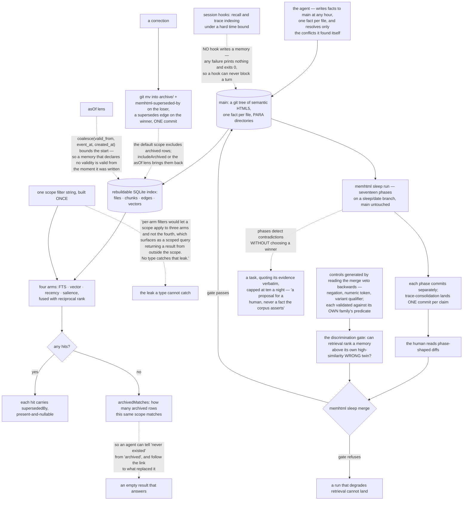

## 1. Executive Summary

memhtml "stores an agent's long-term memory as a git repository of semantic
HTML5 files, one fact per file. A rebuildable SQLite index sits over that tree,
retrieval fuses four ranking arms, and a seventeen-phase curation pipeline
commits its work to a branch a human reviews before it lands." Apache-2.0,
TypeScript, 132,835 lines across 393 files, two binaries and an MCP server.

**The design is a division of labour, stated as a rule.**

> "Three actors share one tree. The agent writes facts, and it resolves only the
> conflicts it found itself. Sleep curates on a branch when a caller fires it,
> and it detects conflicts without resolving them. The human owns the gate and
> every one-way door."

Everything else follows. The nightly pass puts its commits on `sleep/<date>` and
leaves `main` untouched. Each phase commits separately "so a human reads the
curation one phase-shaped diff at a time", and `trace-consolidation` lands "each
distilled memory as its own commit, one per memory, so a reviewer reads one
claim at a time." The phases that could decide and choose not to open a task
instead, quoting the sentence they found, because "[a] detection is a proposal
for a human, never a fact the corpus asserts." `memhtml sleep merge`
fast-forwards `main` "only after a quality gate that can refuse", and that gate
re-runs the retrieval evaluation "so a sleep run that degrades retrieval cannot
land."

**The evaluation behind that gate is the second thing to take.** Its controls
are the system's own merge veto read backwards:

> "The three predicates that forbid folding two memories together are the three
> ways to build a plausible impostor, and a control the veto cannot see does not
> test anything."

Negation, numeric token and variant qualifier become text transforms "that turn
a true claim into a high-similarity WRONG one", and the discrimination gate asks
"can the retrieval stack rank a memory above its own high-similarity WRONG
twin?" Each control is validated against its own family's predicate rather than
the disjunction, so one that trips a different rule does not count.

**A third piece answers a question most stores leave hanging: what an empty
result means.** When a scope matches nothing, `archivedMatches` reports how many
archived rows the same scope matches, so an agent can "tell 'never existed' from
'archived'" and follow `archived[].supersededBy` to the replacement. A corrected
memory leaves the default view — "the default scope excludes archived rows" —
without leaving the corpus.

**And the scope filter is built once for all four arms**, with the reason given:
"[p]er-arm filters would let a scope apply to three arms and not the fourth,
which surfaces as a scoped query returning a result from outside the scope. No
type catches that leak."

The gap is that the mutation record is git. The phase trailers and the
one-commit-per-claim discipline are real, and they live in a history a rewrite
can change, with no append-only table in the store beside them.

## 2. Mental Model

A **memory** is one HTML file in a git tree, and the index is rebuildable.

A **correction** archives the loser and links it to its winner, both ways.

A **curation run** is a branch of phase-shaped diffs.

A **task** is what the machine opens when it declines to decide.

An **empty result** says whether the address never existed or was archived.

## 3. Architecture

| Area | Role |
| --- | --- |
| `packages/store` | The git tree, supersession meta, archive moves, the merge driver |
| `packages/index` | The rebuildable SQLite index, the four arms, and the one scope filter |
| `packages/sleep` | Seventeen curation phases, each its own commit |
| `packages/eval` | Adversarial controls and the discrimination gate the merge runs |
| `packages/domain` | Divergence predicates, retention scoring, confidence decay |
| `packages/integrations` | Four host installers, and the receipts that make uninstall exact |

## 4. Essential Implementation Paths

`packages/index/src/scope.ts:6-20` — one filter for four arms, and the leak no
type catches.

`packages/index/src/scope.ts:195-200` — the point-in-time predicate and its
coalesce fallback.

`packages/index/src/retrieval.ts:140-160` — the count that makes an empty result
informative.

`packages/eval/src/controls.ts:1-20` — the merge veto read backwards into
impostors.

`packages/eval/src/discriminate.ts:8-12` — the one question the gate asks.

`packages/store/src/store.ts:253`, `:266` — a correction as one commit touching
both sides.

## 5. Memory Data Model

One semantic HTML5 file per fact, carrying the claim, type, entities, validity
bounds, confidence and supersession meta, addressed by path inside PARA
directories. The SQLite index holds files, chunks, edges and vectors and is
rebuildable from the tree, which is what makes the tree the system of record.

## 6. Retrieval Mechanics

FTS, vector, recency and salience arms fused with reciprocal rank, each
receiving the same scope filter. Archived rows are excluded by default and
admitted by `includeArchived` or by the point-in-time lens. Every hit reports
whether something superseded it and what.

## 7. Write Mechanics

The agent writes through the CLI or MCP; hooks never write. Corrections are one
commit touching the loser's meta and the winner's edge together. Eviction and
compression are `git mv` into `archive/`, so nothing is destroyed by curation.

## 8. Agent Integration

Fifteen MCP tools and three resources over stdio, plus installers for Claude
Code, Codex, Cursor and OpenCode that write MCP entries, hooks, an instruction
block and a skill — each recorded in a receipt with the SHA-256 of every owned
file or fragment, "so uninstall removes exactly what install wrote and nothing
you added beside it."

## 9. Reliability, Safety, and Trust

The strong parts are the actor separation, the refusable merge gate, the
single-filter scope, and an empty result that explains itself. The gaps are an
audit that is git rather than a table, scope that narrows only what the caller
asked, and a validity fallback that silently equates world time with write time
for memories that declare neither.

## 10. Tests, Evals, and Benchmarks

The discrimination gate runs in `pnpm check`, in CI, and again at merge, with a
deterministic fake-embedder mode so it needs no credentials, and a `live` mode
that reports `skipped: true` rather than passing when it cannot reach a model.
Write-path acceptance corpora sit beside it.

## 11. For Your Own Build

Build your scope filter once and hand the same string to every arm. A scope that
holds on three of four retrieval paths is a leak no type system will catch.

Generate your adversarial controls from the rules you already wrote. If you have
predicates that forbid merging two records, those predicates describe exactly
the impostors your retrieval has to survive.

Make an empty result say why. "Never existed" and "archived last night" are
different answers, and only one of them means the agent should stop looking.

Let the machine open a task where it declines to decide, and make the task quote
its evidence. A proposal with the sentence attached is reviewable; a flag is
not.

## 12. Open Questions

Whether an append-only record belongs beside the git history. Everything about
the curation is designed to be reviewable, and the review record itself lives
somewhere a rewrite can edit.

Whether the validity coalesce should be visible in the answer. A historical
query whose result rests on `created_at` because no memory declared a validity
is a different claim from one resting on `valid_from`, and the result does not
currently distinguish them.

## Appendix: File Index

| Path | What to read it for |
| --- | --- |
| `packages/index/src/scope.ts:6-20` | One filter for every arm, and the reason |
| `packages/index/src/retrieval.ts:140-160` | An empty result that tells you which kind of empty |
| `packages/eval/src/controls.ts:1-20` | Adversarial controls derived from your own veto |
| `packages/eval/src/discriminate.ts:8-12` | The single question a retrieval gate should ask |
| `README.md:126` | Three actors, and which one owns the one-way doors |

## History

**2026-09-16** — [`4778735a5016ecaabd725df594729848334e9968`](https://github.com/memhtml/memhtml/commit/4778735a5016ecaabd725df594729848334e9968) — first reading, at a commit dated 16 September 2026. Screened before opening, from a shallow clone: no auto-run surfaces, no build-time execution points, one unpinned dependency surface and eighteen dependency files inside the seven-day cooldown, with `pnpm-lock.yaml` present. `AGENTS.md` and `CLAUDE.md` are addressed to a reading agent and were recorded as data. Nothing was installed, built or run, no integration installer was executed, and no AWS credential was present, so the sleep pipeline and the evaluation gate are described from source rather than observed.
