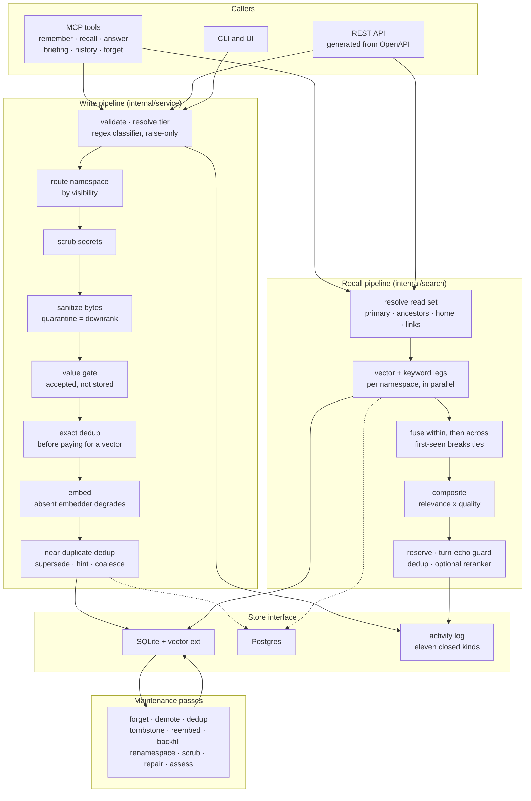

## 1. Executive Summary

memini is a memory service rather than a library: one Go binary that any
MCP-capable agent talks to, holding a store of tiered memories behind
`remember` and `recall`. It boots with no configuration on an embedded SQLite
file and runs the same code against Postgres. The licence is AGPL-3.0, with the
full text in the tree.

Two decisions shape everything else. The first is that **an untiered write is
classified by regex, not by a model**. A caller who names no tier gets
`working`, a 72-hour intake tier, unless a deterministic marker heuristic raises
it — and the heuristic can only ever raise. It never demotes, never touches a
write whose caller picked a tier, and fails safe: a miss leaves the memory in
`working`, where it can still earn durability later. That makes tiering instant
and identical on every deployment, including one with no LLM configured at all.

The second is that **the scope that widens a read narrows it on another axis at
the same time**. A recall resolves a set of namespaces — the primary, then
ancestors nearest-first, then the caller's home, then stored links — and every
leg past the primary is restricted to the durable tiers. Working and episodic
memories never cross a namespace boundary on a read. A system that cascades
without that rule leaks session chatter between projects; memini's cascade can
only ever surface distilled facts from elsewhere.

The report awards five marks: `scope_enforced`, `tombstone`, `bitemporal`,
`audit_log` and `negative_eval`. It withholds `trust_state`, and section 9 says
why — the epistemic axis here is a number, and the discrete state that withholds
a memory is the supersession pointer the `tombstone` mark already covers.

The sharpest finding is in section 10. The benchmark README publishes a full
results table and says it is *"sourced from the committed `results/` JSON"*,
linking that directory. `.gitignore` line 24 is `/bench/results/`. The harness is real and the
datasets for one suite are committed; the numbers in the headline table are not
reproducible from a clone of this repository.

## 2. Mental Model

Think of memini as a retrieval service with a lifecycle bolted to the front of
it, not as a database with search on top.

The lifecycle is four tiers on one horizon axis. `working` and `episodic` are
short-term — transient, TTL'd at 72 hours and 30 days — and `semantic` and
`procedural` are long-term, durable and curated, with no default expiry. The
mapping is a method on the tier itself rather than a table someone maintains, so
"is this short-term" and "when does this expire" have exactly one answer each.

A memory moves up that ladder in one of three ways: a caller names its tier, the
regex classifier raises it at write time, or a later consolidation pass promotes
it. It moves down by expiring, by being demoted by a maintenance pass, or by
being superseded — which does not delete it, but stamps the interval it was true
for and points at what replaced it.

The retrieval side is where the design opinion lives. Most memory systems
advertise a blend of relevance, recency and importance. memini computes
`relevance × (0.80 + 0.20 × quality)` and leaves the standalone recency and
importance weights at zero, a fact the documentation states under the heading
*"Ranking, honestly"* and the code confirms: `RerankWeights` has four fields and
the production default sets two of them.

## 3. Architecture

The `Store` interface is the seam worth studying. Its method comments are the
contract the two backends are held to — `Upsert` states what happens to a
vectorless row and to a stale vector-index entry, `GetEmbedding` explains why a
vector is deliberately absent from `Get` (dims × 4 bytes on every read path) and
warns that a Get-then-Upsert round trip is therefore lossy. One shared
conformance suite runs those contracts against SQLite and Postgres alike, which
is what makes a claim about "the store" in this report a claim about both.

## 4. Essential Implementation Paths

- **Write:** `internal/service` — validate, classify, route, scrub, sanitize,
  gate, dedup, embed, dedup again, store.
- **Tier classification:** a pure regex pass with three vetoes (length 20–400
  runes, a transcript veto on `User:`/`Assistant:` scaffolding, a hedge veto on
  tentative phrasing) and five marker families.
- **Recall:** `internal/search` — read-set resolution, parallel legs, the
  semantic floor, double fusion, the composite, the adjustment sequence.
- **Supersession:** `internal/service/consolidate.go` (`applySupersede`,
  `asyncSupersede`) and the REST `SupersedeMemory` handler, both reaching
  `Store.SetSuperseded`.
- **Activity log:** `internal/service/events.go` and `LogConfigEvent`, with the
  kind vocabulary and its validator in `internal/store/store.go`.
- **Maintenance:** ten passes in `internal/maintenance`, each its own file with
  its own test.

## 5. Memory Data Model

A `Memory` carries more axes than most records in this corpus, and the type's
comments are unusually careful about what each one means when it is absent:

- **`Tier`** — `working`, `episodic`, `semantic`, `procedural`, with `Term()`
  and `DefaultTTL()` as methods on the tier.
- **`Level`** — `explicit` or `deduced`, recording whether a fact was stated or
  inferred. The comment notes that the empty string is legacy and *passes
  filters unconstrained*, so the permissive case is the absent one.
- **`Confidence`** — a corroboration number in [0,1] that grows logistically on
  re-observation and decays without reinforcement. `nil` means untracked, and
  the comment says it is *treated as fully trusted so existing data is never
  retroactively penalized* — a migration-safety decision stated rather than
  discovered.
- **`AssessedImportance`** — an LLM judgement in [0.1,0.9] with an invariant
  written into the field comment: it is cleared whenever a caller supplies an
  explicit importance, so a non-nil value always refines a tier-seeded guess and
  never overrides what a user asked for.
- **`SupersededBy`**, **`ValidFrom`**, **`ValidTo`** — the correction axes,
  covered in sections 7 and 9.
- **`LinkedMemoryIDs`** — advisory links from the consolidator, with stale ones
  (target superseded) resolved at recall rather than at write.

## 6. Retrieval Mechanics

Read-set resolution runs concurrently with the query embedding. Each namespace
in the set gets a vector leg and a keyword leg in parallel, and failure is
isolated per leg on purpose: an unreachable ancestor is dropped and named in the
response's degradation note, a failed vector leg falls back to that namespace's
keyword results, and only losing the primary namespace's keyword leg — the one
leg every recall has — fails the call.

Before fusion, an absolute semantic gate drops vector candidates below a raw
similarity floor (0.46 by default). The reasoning is stated and is the kind of
thing that is usually learned the hard way: without an absolute bar, min-max
normalization turns a batch of uniformly irrelevant candidates into
competitive-looking scores. A keyword hit with no vector score is not gated —
vectorless rows stay eligible — but a keyword hit whose vector score is known
and below the floor is dropped from both legs.

Fusion happens twice, and the second one is where scoping and ranking meet:
per-namespace lists fuse into one ranking and **ties at equal score break by
first-seen order across the read set**, which is why the cascade appends
ancestors nearest-first. At equal relevance a memory in `acme/phoenix` outranks
the same-scored one in `acme` because its namespace was seen first.

Then the composite, then a fixed sequence: a durable-tier reserve holding up to
two top-k slots for semantic and procedural memories but only when the durable
is relevance-competitive; a turn-echo guard dropping conversation turns captured
in the last five minutes, because a just-captured turn is still in the caller's
live context and echoing it makes the agent parrot itself; dedup by normalized
content; and an optional reranker whose failure or timeout falls back to the
composite order rather than erroring the recall.

## 7. Write Mechanics

The pipeline is ten ordered steps, and three of them are decisions other
implementations tend to skip.

**Dedup runs twice, either side of the embedder.** An exact content match in the
same tier reinforces the existing memory instead of duplicating it — *before*
paying for an embedding. Only a write that survives that is vectorized, and then
a vector search over the same tier decides whether it should supersede, hint at,
or coalesce into an existing memory. Putting the cheap check first is an obvious
saving that is easy to get backwards.

**A write can be accepted and not stored.** The value gate strips harness
boilerplate from auto-captured conversation turns and drops low-signal episodic
writes, returning `stored: false` with the resolved tier. The documentation is
explicit that this is a feature rather than an error, which matters for a client
that would otherwise retry.

**Degradation is designed rather than incidental.** A slow or absent embedder
degrades the write to keyword-only instead of failing it, and the store keeps
the row searchable with no vector-index entry. `Upsert`'s comment states the
matching invariant — a stale vector-index entry from a prior upsert of the same
ID is removed, and `VectorSearch` never returns a vectorless row.

Correction is supersession rather than deletion: the predecessor keeps its row,
gains a `SupersededBy` pointer and a `ValidTo` stamp, and drops out of live
recall while staying reachable by the `IncludeSuperseded` filter and by
time travel.

## 8. Agent Integration

Nine MCP tools: `memory_remember`, `memory_recall`, `memory_get`, `memory_list`,
`memory_update`, `memory_forget`, `memory_history`, `memory_briefing` and
`memory_answer`. Alongside them a REST API generated from an OpenAPI document, a
CLI, a web UI, and plugins for several harnesses.

Three pull surfaces have different defaults, and the difference between them is
argued rather than assumed. The session-start briefing is query-less, full-scope
and **never reinforces**: it fires on every session start over the same top-N
regardless of relevance, so counting a briefing serve as a use would inflate
access counts uniformly and distort the promotion and ranking that depend on
them. The per-prompt injection runs after shape gates and is client-dependent.
Explicit `memory_recall` reinforces — each served memory's access count bumps
and its expiry slides forward by its own lifetime — and an automatic caller can
send `reinforce: false` to search without changing retention. All three still
appear in the activity log, so the record of what was served stays complete even
where the counters deliberately do not move.

## 9. Reliability, Safety, and Trust

**Scope enforcement — awarded.** The namespace is a parameter on the store's
methods rather than a clause a caller remembers, `Upsert` refuses an id that
exists under a different namespace, and the cascade's durable-tier restriction
means widening the read set cannot widen it to session material. The conformance
suite's cross-namespace case is the control, and it runs on both backends.

**Tombstone — awarded.** One store writer, two shipped producers, a read filter
that is off by default, and a reverse lookup for the versions a given id
replaced. The predecessor survives; `maintenance/repair.go` exists to find
tombstones whose chains no longer reach a live memory.

**Bitemporal — awarded.** `valid_from`/`valid_to` are settable through MCP and
REST and are stamped by supersession, and `Filter.AsOf` switches a read to the
rows whose window contained that instant. The implementation detail that earns
the mark rather than merely claiming it: for a time-travel query the backend
evaluates *live* at the as-of instant rather than at the current clock, so
expiry and supersession move with the query.

**Audit log — awarded.** Eleven kinds, a closed validator, a producer for each,
and `Forget` snapshotting the row before the delete so the feed can say what
went.

**Trust state — withheld, and the reason is worth stating.** memini has an
epistemic axis and it is a number: `Confidence` grows logistically on
re-observation and decays without reinforcement, with `nil` treated as fully
trusted. That is corroboration used for ranking — it feeds the quality term in
the composite — and the mark asks for a discrete state that decides whether a
memory may be treated as true. The field that does withhold is `SupersededBy`,
and it is already carrying `tombstone`; awarding both to the same pointer would
count one mechanism twice. `Level` (`explicit` / `deduced`) is a write-time
provenance genre and the atlas does not award this mark for those.

**Human review — not awarded.** No approval state gates what a memory may be
used for; API keys identify a writer (`metadata.author` is stamped from a named
key) but nothing holds a memory pending anyone's decision.

## 10. Tests, Evals, and Benchmarks

**No paper.** Searched the README and `docs/` for `arxiv`, `@article`, `@misc`,
`doi.org` and a `CITATION.cff`: none. This is a product repository, and its
evaluation claims are its own.

**The harness is committed and the results are not.** `bench/` holds a real
retrieval harness — `cmd/bench`, `dataset.go`, and suites behind a `bench` build
tag so they stay out of the default `go test ./...`, which the README explains
rather than hides (*"a plain `go test ./bench/` reports 'no test files' by
design"*). Three datasets ship: `sample.json`, `codingagent_pilot.json` and
`codingagent_v1.json`. The large public datasets are deliberately excluded with
a comment saying so — `bench/data/.gitignore` carries `longmemeval_*.json` and
`locomo*.json` under *"download on demand … never commit"* — which is ordinary
and fine.

The result files are a different matter. The README's "Full results" table
publishes recall@5, recall@10 and MRR for five retrieval strategies across three
dataset slices, and introduces them as *"sourced from the committed
`results/` JSON"* and links it. There is no `results/` directory anywhere in the
tree (`find . -type d -name results` returns nothing), and `.gitignore` line 24
is `/bench/results/`. So the link in the published table resolves to nothing for
anyone who clones the repository, and no figure in it — including the headline
comparison at README line 117, that memini's hybrid retrieval *"beats
`agentmemory`'s published LongMemEval-S numbers on the same model, dataset and
metric (98.4% recall@5 against 95.2%)"* — recomputes from what is committed. The
commands to regenerate them are given, so this is reproducible work whose
artifacts are excluded, not a claim with nothing behind it; but a reader cannot
check a single number without first obtaining two datasets and standing up an
embedder.

**The unit suite is large and mostly well-built**, and one case is worth naming
because it is the shape this atlas checks for. `service_test.go:645`,
`TestRecallNamespaceIsolation`, writes one memory to `alice` and asserts that a
recall from `bob` returns zero results. Nothing in it establishes that a recall
from `alice` returns the memory, so a `Recall` that returned nothing for anybody
would pass. The repair is one call. The mark is not withheld on its account,
because the store conformance suite carries a properly controlled
cross-namespace case — but a reader counting isolation coverage should count
that one and not this one.

## 11. For Your Own Build

- **Put the cheap dedup before the embedder.** An exact content match in the
  same tier reinforces without paying for a vector. The expensive
  near-duplicate check still runs, afterwards, on what survived.
- **Multiply the quality modifier by relevance instead of adding it.** An
  off-topic memory has almost no score to amplify, so a corroborated durable
  fact can rise above comparably relevant chatter without ever beating something
  genuinely more relevant. Leaving the unused weights at zero and saying so in
  the docs is the other half of that.
- **Narrow one axis when you widen another.** A cascade that reaches ancestors,
  home and links is a leak waiting to happen unless the legs past the primary
  are restricted — here, to durable tiers.
- **Decide what counts as a use.** The briefing serves memories and refuses to
  reinforce them, because a fixed top-N served on every session start would
  inflate the counters that promotion depends on. Logging the serve while not
  counting it is the distinction most systems collapse.
- **Snapshot before you delete.** An activity feed that can only say "some
  memory was forgotten" is not worth much.

## 12. Open Questions

- The event-kind comment still describes `pin`, `unpin` and `settings` as
  vocabulary that *"landed ahead of the pin/settings write paths that will
  actually emit them"*. Six handlers now emit them. Is the comment stale, or is
  some further write path still intended?
- `Level` is stamped on writes and the comment says an empty value passes
  filters unconstrained. Which read paths filter on it at all, and what happens
  to a corpus that predates the field?
- The bench README's `results/` link and the `.gitignore` entry disagree. Were
  the results committed once and removed, or was the table always written
  against a local directory?

## Appendix: File Index

- Domain types: `internal/memory/types.go`
- Store contract and event vocabulary: `internal/store/store.go`
- Backends: `internal/store/sqlitevec/`, `internal/store/postgres/`
- Shared conformance suite: `internal/store/storetest/conformance.go`
- Write path and supersession: `internal/service/service.go`,
  `internal/service/consolidate.go`
- Ranking: `internal/search/rank.go`
- Activity log: `internal/service/events.go`
- Maintenance passes: `internal/maintenance/`
- Surfaces: `internal/api/mcp/`, `internal/api/rest/`, `cmd/`
- Benchmark harness: `bench/`, `cmd/bench`

## History

**2026-09-19** — [`452ff2299c185530c7010cb164d83cce8006f78a`](https://github.com/eleboucher/memini/commit/452ff2299c185530c7010cb164d83cce8006f78a) — first reading, at the head of `main`. Screened with `scripts/screen_repo.py` before anything was read: two auto-run surfaces (a Claude Code plugin manifest and a devcontainer with a `postCreateCommand`) and every dependency manifest inside the seven-day cooldown, which is an artefact of screening a `--depth 1` clone rather than a statement about the upstream. Nothing was installed, built or run; the reading is from the source and the committed documentation. Five marks. The reading covered the domain types, both store backends and the conformance suite they share, the write pipeline and its classifier, the recall pipeline and its ranking composite, the supersession and time-travel paths, the activity log, and the benchmark harness; the UI, the importer and the per-harness plugins were read as context rather than as subject. Three findings are worth the reader's time: the benchmark table's `results/` source is excluded by `.gitignore`, so no published figure recomputes from a clone; the service-level namespace isolation test asserts an absence with no positive control, though the store conformance suite carries a properly controlled equivalent; and the event vocabulary's comment describing the pin and settings kinds as unwired has been overtaken by six handlers that emit them.
