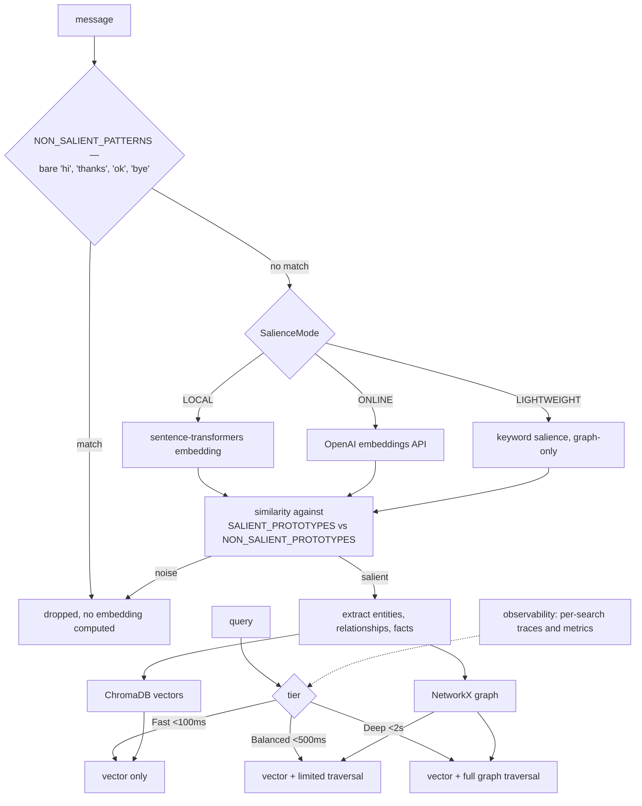

## 1. Executive Summary

Memlayer adds memory to any LLM "in just 3 lines of code" — ChromaDB plus
NetworkX, wrappers for OpenAI, Claude, Gemini and Ollama, three retrieval tiers
(Fast under 100 ms, Balanced under 500 ms, Deep under 2 s), and a "Noise-Aware
Memory Gate".

**The gate is the mechanism, and it is a third answer to the question this atlas
keeps asking: how do you decide what to store?**

`memlayer/ml_gate.py` does not ask a model. It holds two lists of **hand-written
prototype sentences** — examples of salient content and examples of noise — and
scores incoming text by embedding similarity to them:

```python
SALIENT_PROTOTYPES = [
    "My name is Sarah and I work in the Marketing department.",
    "The project deadline is next Friday, November 22nd.",
    "I prefer all reports to be in PDF format.",
    "Alice is responsible for the database architecture.",
    …
]
NON_SALIENT_PROTOTYPES = [
    "Hello, how are you doing today?", "Got it, thanks.", "Perfect.", …
]
```

with a regex fast path (`NON_SALIENT_PATTERNS`) catching bare greetings,
acknowledgements and closings before any embedding is computed.

**The property that makes this interesting is that the decision boundary is
readable and editable data.** A user whose meeting notes are not being saved can
add a sentence that looks like their meeting notes. Compare an importance prompt,
where the boundary is inside a model, or
[memv](../memv/)'s prediction error, where it moves with whichever model you
plugged in. Here it is a list, in a file, and you can diff it.

Three modes trade startup cost against capability — `LOCAL` (sentence-transformers,
"slow startup"), `ONLINE` (OpenAI embeddings, "fast startup, API cost"), and
`LIGHTWEIGHT` ("no embeddings: keyword salience + graph-only storage, instant
startup") — with the trade-off written into the enum comments rather than a
configuration guide.

**And one of the salient prototypes is `"The user's API key is sk-12345."`** —
section 9.

## 2. Mental Model

Every message is scored for salience before anything is stored. What passes is
extracted into facts and entities, held in a vector store and a graph, and
retrieved by similarity plus traversal at a latency tier the caller chooses.



## 3. Architecture

Nine modules: `client`, `services`, `ml_gate`, `embedding_models`,
`observability`, `config`, `storage/`, `wrappers/`. 9,200 lines of Python with
12 test files, an mkdocs site and examples.

The wrapper-per-provider shape (`wrappers/claude.py`, `wrappers/gemini.py`, …) is
what delivers the three-line adoption claim: you swap the client, not the
call sites.

`observability.py` as a first-class module — "trace every search operation with
detailed performance metrics" — is the right companion to a three-tier retrieval
design, because the tiers are only meaningful if you can see which one a query
used and what it cost.

## 4. Essential Implementation Paths

**Gate** — `memlayer/ml_gate.py` (`SalienceMode` with its startup/cost comments
`:6-10`, `SALIENT_PROTOTYPES` `:15-60`, `NON_SALIENT_PROTOTYPES` `:63-`,
`NON_SALIENT_PATTERNS` `:136-141`).

**Adopt** — `memlayer/wrappers/{claude,gemini,…}.py`, `memlayer/client.py`.

**Observe** — `memlayer/observability.py`.

## 5. Memory Data Model

Facts and entities in ChromaDB and NetworkX. No status, no confidence, no
supersession, no tombstone — the gate decides entry and nothing decides standing
afterwards.

That division is worth naming because it is a common shape and it has a
consequence: a system whose only epistemic act is at the door accumulates
everything that ever passed, and has no way to revise a fact that was salient and
is now wrong. The prototype list is about *what deserves to be remembered*, never
about *what is still true*.

## 6. Retrieval Mechanics

Vector similarity plus graph traversal, in three tiers with stated latency
budgets. Publishing the budget per tier — under 100 ms, under 500 ms, under 2 s —
rather than a single "fast" claim lets a caller choose against a real constraint,
and the observability module lets them check it.

**No scope key was found on the read path.** One store per application.

## 7. Write Mechanics

Gate, then extract, then store. The ordering matters and is right: the regex
patterns run before the embedding, so "thanks" costs nothing, and the embedding
runs before extraction, so noise never reaches an LLM call.

`LIGHTWEIGHT` mode dropping to keyword salience and graph-only storage means the
library works with no model download at all — a real option for a first-run
experience, and honestly labelled as a capability reduction rather than a
"lite" euphemism.

## 8. Agent Integration

`pip install memlayer` and a wrapper per provider. Proactive reminders — "schedule
tasks and get automatic reminders when they're due" — are an unusual addition:
most memory systems here are read-on-demand, and a store that can *initiate* is a
different product shape.

## 9. Reliability, Safety, and Trust

**No marks.** No trust state, no tombstone, no bitemporality, no scope key, no
audit log, no review surface, no committed exclusion case.

**And the gate is pointed the wrong way on secrets.** `SALIENT_PROTOTYPES`
includes:

```python
"The user's API key is sk-12345.",
"My email is sarah@company.com.",
"The server IP address is 192.168.1.101.",
```

These are examples of *what to remember*. So a message containing an API key,
a credential-shaped string or an internal IP is scored **toward** storage by
similarity to a prototype that is literally an API key — and no secret filtering
was found anywhere in the tree.

Four systems read in this same batch do the opposite on the write path:
[mnemos](../mnemos/) screens content before it is written and holds the match on
an unexported field so it cannot leak into a report, [vir](../vir/) scrubs
`sk-ant-` and `sk-` patterns with negative lookbehinds, [OpenCode
Memory](../opencode-mem/) redacts fail-closed, and [MemCP](../memcp/) blocks the
write outright. Memlayer is the one that treats a credential as exemplary of what
memory is for.

The fix is small and does not weaken the gate: keep the *shape* of those
prototypes — "the user gave me a configuration value", "the user told me an
address" — without instantiating them as live-looking secrets, and add a
credential screen ahead of the gate. As it stands, the prototype list is both the
salience definition and a nudge toward persisting exactly the strings that should
not persist.

**The other structural limit** is section 5's: the boundary is at the door only.

## 10. Tests, Evals, and Benchmarks

**No paper, no benchmark, no committed results.** 12 test files against 9,200
lines.

The README's performance claims are latency tiers rather than quality claims,
which is the more defensible thing to assert without an evaluation — but nothing
measures whether the gate is right. That is the number this design needs, and it
is unusually easy to get: the prototypes are a fixed list, so a labelled set of
messages scored against them would give a precision and recall for salience
directly, and would show which prototypes carry their weight.

Without it, the list is a set of assertions about what matters, and its coverage
is whatever the author happened to think of — the salient examples are English,
and specific in ways that will not generalise ("I graduated from Stanford
University in 2019", "My flight number is BA2490").

**I ran nothing.**

## 11. For Your Own Build

### Steal

- **Define salience by example rather than by prompt.** Two lists of prototype
  sentences and a similarity score is cheap, needs no LLM call, and — the real
  advantage — puts the decision boundary in a file a user can read, diff and
  extend when their content is not being kept.
- **Run a regex fast path before the embedder.** Bare greetings,
  acknowledgements and closings never need a vector.
- **Gate before extraction, not after.** Noise that never reaches the extraction
  call costs nothing.
- **Write the trade-off into the enum.** `LOCAL # default, slow startup`,
  `ONLINE # fast startup, API cost`, `LIGHTWEIGHT # instant startup` tells a
  reader what they are choosing at the point of choosing.
- **Offer a mode that needs no model download.** Graph-only with keyword salience
  makes the first run work before anything is configured.
- **Publish a latency budget per tier**, and ship the observability to check it.

### Avoid

- **Do not put a live-looking credential in your salience examples.** `"The
  user's API key is sk-12345."` as a prototype for *what to remember* means
  credential-shaped text scores toward being stored, in a system with no secret
  screen anywhere.
- **Do not let the door be your only epistemic act.** A gate decides what enters;
  nothing here decides what is still true, so a fact that was salient and is now
  wrong stays at full standing forever.
- **Do not leave the prototype list unevaluated.** It is a fixed list, so a
  labelled message set would give precision and recall for the gate directly and
  show which prototypes earn their place.
- **Do not assume the examples generalise.** Stanford, San Francisco and a
  British Airways flight number are the author's world, and salience is defined
  by what the list happens to cover.

### Fit

Reasonable for a small Python application that wants memory with three lines of
setup and no infrastructure, where you will read `ml_gate.py` and adapt the
prototypes to your domain — which is the intended and best use of the design.

Add a credential screen before the gate first.

## 12. Open Questions

- **What is the salience threshold, and is it tuned?** The prototypes are
  visible; the cutoff was not traced.
- **How does `LIGHTWEIGHT` keyword salience relate to the prototypes?** It is
  described as a separate path.
- **Is anything stored about *when* a fact was learned?** No temporal fields were
  found.
- **What do the proactive reminders do on a stale task?** Scheduling exists;
  cancellation was not traced.

## Appendix: File Index

**The gate** — `memlayer/ml_gate.py` (`SalienceMode` and its startup/cost
comments `:6-10`, `SALIENT_PROTOTYPES` including the API-key, email and IP
examples `:15-60`, `NON_SALIENT_PROTOTYPES` `:63-`, `NON_SALIENT_PATTERNS`
`:136-141`)

**Library** — `memlayer/client.py`, `services.py`, `embedding_models.py`,
`observability.py`, `config.py`, `storage/`, `wrappers/{claude,gemini}.py`

**Documentation** — `README.md` (the three modes, the three tiers, the latency
budgets), `docs/`, `examples/`

## History

**2026-08-09** — [`5e95f44061a867a5ac0caf53434240713d58b86a`](https://github.com/divagr18/memlayer/commit/5e95f44061a867a5ac0caf53434240713d58b86a) — first reading. Screened before reading; the tree was read, never installed, and no test was run.
