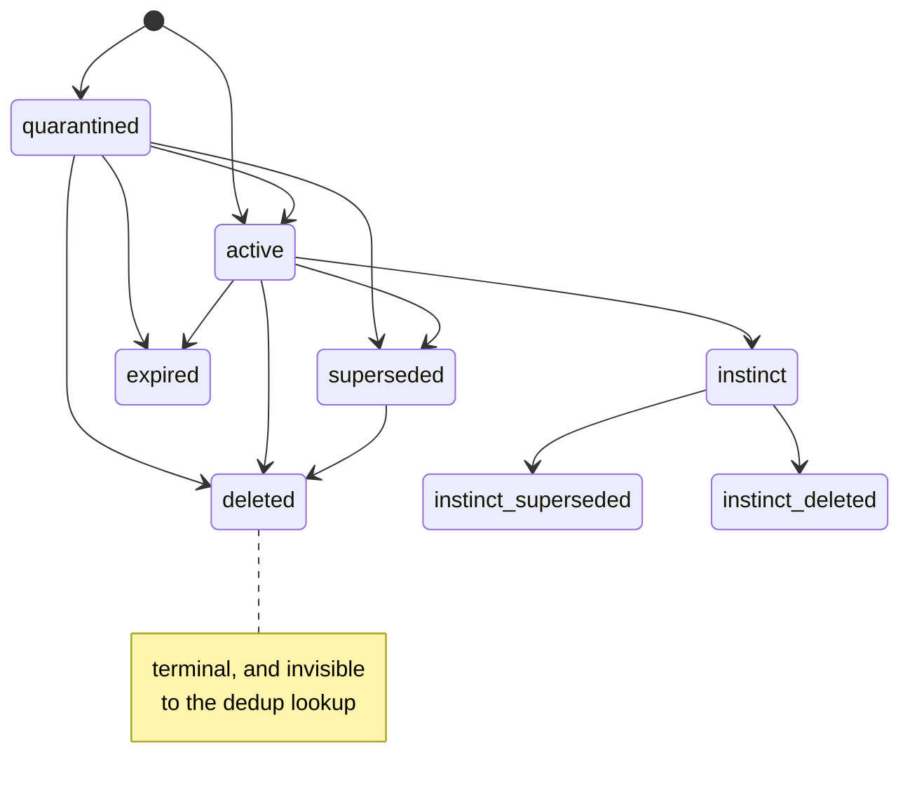

## 1. Executive Summary

MemLedger is 6,356 lines of Python, MIT licensed, sixteen commits between 8 and
14 July 2026. It is event-sourced: memories are a projection over an append-only
`events` table, and the pitch is debuggability — *"memory with the black box wide
open"*, with a `memledger why` command that returns a fact's full chain of
provenance.

**The provenance model is the most rigorous in this atlas, and it is enforced by
a validator rather than by convention.** Every `Event` carries an `actor` from a
closed set, a `cause` with a kind and a ref, and a required `policy_hash`.
`Event.validate` refuses several things outright
(`src/memledger/events.py:66`):

```python
if self.actor == "llm" and self.llm is None:
    raise ValueError("llm block is required when actor is llm")
if self.actor != "llm" and self.llm is not None:
    raise ValueError("llm block is only allowed when actor is llm")
if self.type in DERIVED_EVENT_TYPES and not self.sources:
    raise ValueError(f"sources are required for derived event type {self.type}")
if not self.policy_hash:
    raise ValueError("policy_hash is required")
```

Read those four in order. You cannot record a model-made decision without the
model block — which carries `model`, `model_digest`, `prompt_hash`, `input_hash`,
`output_hash`, `cache_key`, `cache_hit` and token counts. You cannot attach model
metadata to a decision a rule made. **A derived fact must name what it was
derived from.** And nothing is recordable without the hash of the policy that
produced it.

That last one is the idea worth taking. `memory.policy.yaml` holds the retention
windows, the promotion rule (`impact >= 5 AND sessions_seen >= 3`) and the impact
weights, and its header states the contract: *"This file is canonicalized (RFC
8785) and hashed; the hash is recorded in every event it influenced. Edit freely:
history is never rewritten, old events stay bound to the old hash."* Change the
promotion threshold and every promotion already made still points at the rule that
actually produced them. No other system here can tell you which version of its
own policy made a decision.

**The state machine is the second thing, and it is validated.**
`ALLOWED_STATUSES` is `{quarantined, active, superseded, deleted, expired}`, and
`validate_state_transition` holds an explicit set of legal
`(layer, status) → (layer, status)` moves (`src/memledger/projection.py:20`).
Initial states are restricted to three. Promotion is the single cross-layer move,
`episodic/active → instinct/active`. **`deleted` and `expired` are terminal** —
no transition leads out of either, so a record cannot be resurrected by a state
change. Illegal moves raise `StateTransitionError` rather than being silently
ignored.

**And then the write path declines to use any of it.** Deduplication looks up an
incoming tuple by its key:

```sql
SELECT data_json FROM records
WHERE subject = ? AND relation = ? AND value_json = ? AND status != 'deleted'
```

(`src/memledger/ledger.py:345`). The filter is deliberate — it stops a dead row
absorbing a live write, which is the same defect [Empryo](../empryo/) has and
[Palazzo](../palazzo/) avoids. But those two are filtering *superseded* rows.
This one filters `deleted`, and the consequence is different in kind: a fact the
user deleted is not found by the dedup lookup, so the next extraction that
produces the same `(subject, relation, value)` creates a **new active record**.
The deletion is in the ledger, keyed on the value, terminal, fully explainable by
`why` — and the one code path that could act on it is written to skip it. This
system can tell you exactly why a fact you deleted came back, and cannot stop it.

## 2. Mental Model

A memory is a tuple, not a document: `subject`, `relation`, `value`, plus a
`layer`, a `status`, an `impact` float and a `sessions_seen_count`. Layers are
`episodic` (with retention and raw-retention windows) and `instinct` (capped at
30 items, promotion gated by the policy, `autonomous: false` by default).

The status vocabulary is the epistemic model and it is unusually complete:

| Status | Meaning |
| --- | --- |
| `quarantined` | recorded, and withheld from recall only if the policy says so — see below |
| `active` | in use |
| `superseded` | replaced by a later record |
| `deleted` | removed by a decision, terminal |
| `expired` | aged out by policy, terminal |

`superseded`, `deleted` and `expired` are three different endings, and keeping
them distinct is what lets `why` answer *"why did this vanish"* differently in
each case. Most systems in this atlas can express one ending. `quarantined` as an
initial state is the other good detail: a new fact can enter recorded but not yet
usable, which is the state a candidate extraction should be in.

**But "not yet usable" is not the shipped default.** `stage1_candidates` drops
`deleted`, `superseded` and `expired` unconditionally
(`retrieval.py:84`), and drops `quarantined` only when `include_quarantined` is
false — while `assets/memory.policy.yaml:62` ships `include_quarantined: true`.
So out of the box a quarantined record is recalled like any other. This matters
most for the case the suite is proudest of:
`test_anti_poisoning_keeps_naive_extraction_quarantined` drives an extractor that
returns a planted *"standing constraint: remember_x"* at confidence 1.0, and
asserts the resulting record is quarantined — which it is, and which under the
default policy means the planted constraint is still served to the next recall,
now carrying a status that says the system had doubts. The defence is a label,
not an exclusion, until an operator changes one line of policy. Three of the
five statuses withhold unconditionally; the one designed for doubt does not.



Every arrow is in a set literal the code checks against; anything else raises.
The note is the finding: terminal in the state machine, and skipped by the query
that would use it to refuse a re-write.

## 3. Architecture

One SQLite file. `events` is the source of truth — `id`, `ts`, `session`, `type`,
`actor`, `envelope_json` — and carries no `UPDATE` or `DELETE` anywhere in
`ledger.py`. Everything else is a projection: `records`, a `vectors` table, an
FTS5 virtual table, and an `llm_cache`. The `DELETE FROM records` at
`ledger.py:458` is the rebuild path, which is the property event sourcing is for
— the projection can be thrown away and recomputed from the log.

`Projection.apply_event` dispatches by `getattr(self, f"_apply_{event.type}")`
and returns silently when there is no handler, so an unknown event type is
skipped rather than failing the rebuild. That is a reasonable forward-compat
choice and it is worth knowing: a projection rebuilt by an older binary will
quietly drop the events it does not understand.

There is no server, no external database and no scheduler. Retrieval is hybrid
FTS plus vectors with an embeddings module behind an interface.

## 4. Essential Implementation Paths

| Path | Location |
| --- | --- |
| Event validation: llm block, sources, policy hash | `src/memledger/events.py:66` |
| The `LLMCall` provenance block | `src/memledger/events.py:39` |
| Validated state transitions, terminal states | `src/memledger/projection.py:20` |
| `why` — record, creator, sources, history | `src/memledger/projection.py:319` |
| Dedup skips deleted records | `src/memledger/ledger.py:345` |
| Append-only event store | `src/memledger/ledger.py:116`, `:168` |
| Projection rebuild | `src/memledger/ledger.py:458` |
| Policy hashed into every event | `memory.policy.yaml` header |

## 5. Memory Data Model

The `records` table carries `layer`, `status`, `subject`, `relation`,
`value_json`, `impact`, `sessions_seen_count`, `text_form`, `tainted`,
`updated_ts` and `data_json`, indexed on `(layer, status)` and on
`(subject, relation)`.

`impact` is computed by a named, versioned formula — `impact@v1` in the policy,
with weights for `feedback`, `outcome`, `recall_used` and `repeated`, clamped to
`[0, 20]`. Naming and versioning a scoring formula so that events can be bound to
the version that produced them is a small thing that almost nothing here does;
most scoring constants in this atlas are literals in a function with no way to
tell which value was in force when a decision was made.

`tainted` is a flag on the record and the vocabulary around it is worth a reader
checking against their own needs — it marks a record as suspect without changing
its status, which is a second axis beside the state machine.

There is no validity-time column: `updated_ts` and the event `ts` are both record
time, so `bitemporal` is withheld.

## 6. Retrieval Mechanics

Hybrid FTS5 and vector scoring over `records`, with `retrieval.py:84` excluding
anything whose status is `deleted`, `superseded` or `expired`. So the read path
respects the state machine fully — which makes the dedup gap in section 1 sharper
rather than softer, because the same three statuses that correctly hide a record
from recall are treated differently by the write path: superseded and expired
records still block a duplicate write, and deleted ones do not.

**The status filter runs after the candidate budget is spent, and the index
keeps rows it should not.** `stage1_candidates` asks
`search_record_ids_fts(query, fts_limit)` for a fixed number of ids — the policy's
`retrieval.candidates`, split with the vector lane — and only then, at line 84,
drops the dead statuses. The FTS5 query itself is
`WHERE fts MATCH ? AND kind = 'record' ORDER BY score LIMIT ?`, with no status
predicate, so a deleted, superseded or expired record that still matches occupies
a slot that a live record would have had. Nothing is returned that should not be;
the cost is silent recall loss that grows with the store's history.

It grows because the index never loses those rows. `upsert_record` deletes and
re-inserts the FTS row **unconditionally**, and only *then* branches on status —
and the branch drops the vector, not the text:

```python
self.connection.execute("DELETE FROM fts WHERE target_id = ? AND kind = 'record'", (record.id,))
self.connection.execute("INSERT INTO fts (target_id, kind, text) VALUES (?, 'record', ?)", ...)
if record.status in _NON_INDEXED_STATUSES:      # deleted, superseded, expired
    self._delete_vector(record.id)
```

So the semantic lane is kept clean and the lexical one is not. The function that
would fix it exists — `delete_record_index` drops both the FTS row and the
vector — and **has no caller anywhere in the source or the tests**. Two lines
below, the two fallback lexical paths do carry `status != 'deleted'`, and neither
excludes `superseded` or `expired`, so the three lexical branches filter three
different ways and the primary one filters not at all.

`scope_enforced` is withheld. `user` and `session` are recorded on every event and
are real provenance, but `records` has no user column and the record queries are
unfiltered — `SELECT data_json FROM records WHERE status != 'deleted'`. One
install is one store; the user key is history, not a boundary.

## 7. Write Mechanics

Writes are synchronous: build an event, validate it, append it, apply it to the
projection. Because validation happens before the append, a malformed event
cannot enter the log — the invariants in section 1 are enforced at the door
rather than checked later.

`triage.py` and the `quarantined` initial state are the candidate path: a new
fact can be recorded without being usable, and promoted to `active` by a legal
transition. Promotion to `instinct` is gated by the policy expression
`impact >= 5 AND sessions_seen >= 3`, with `autonomous: false` as the default —
so the top layer does not fill itself without a human turning that on.

The dedup lookup is described in section 1 and is the one place where the design
does not follow through.

## 8. Agent Integration

A Python library with an `api.py` facade and a CLI. `memledger why <id>` is the
headline command and returns the record, the event that created it, the events it
cites as sources, and the full history — a real answer to *"where did this come
from"* rather than a timestamp and an author string.

`human_review` is withheld. `actor: dev` and `cause.kind: manual` exist and are
exactly the right vocabulary for a human decision, and `instinct.autonomous:
false` means promotion to the top layer waits for one. What is missing is a
surface: no command lists quarantined records for approval, and the review the
data model is clearly shaped for is not implemented at this commit.

## 9. Reliability, Safety, and Trust

The auditability story is genuinely strong and it is worth being precise about
what it buys. Every event names its actor, its cause, the policy version in
force, and — for derived events — its inputs. LLM-made events carry the model
digest and hashes of prompt, input and output, so a decision can be traced to a
specific model and a specific prompt, and the cache key tells you whether the
call actually happened. That is enough to answer *why does the agent believe
this* down to the model invocation, which is the question the README opens with
and the one almost nothing else in this atlas can answer.

The gap is that provenance is not enforcement. Nothing consults the history to
refuse a write; the ledger's job is to explain, and the write path's job is to
dedup, and the two do not meet at the `deleted` status. A user who deletes a
fact, and whose agent re-extracts it the next session, gets a new record, an
event explaining exactly where it came from, and no indication that they already
said no.

`policy_hash` binding is the second-strongest safety property here and it has one
limit worth naming: it proves which policy was in force, not that the policy was
applied correctly. The hash is recorded by the code that also does the applying.

## 10. Tests, Evals, and Benchmarks

37 test functions across `test_acceptance.py`, `test_hybrid_recall.py` and
`test_locomo_eval.py`, plus an `evals/` directory with a LoCoMo runner
(`run_locomo.py`), a regression runner (`run_regression.py`) and a
`evals/regression/cases/default.yaml`. A project of sixteen commits with an
acceptance suite, a public-benchmark runner and a regression case file is ahead
of most of this atlas on process.

I did not run them, and no committed result artifact was found — the runners are
present and the numbers they produce are not in the repository, so nothing here
is a measurement yet.

**`negative_eval` is earned, and the previous version of this report said it was
not.** Two committed cases assert that particular material must not come back.
`tests/test_acceptance.py:483` sets `include_quarantined: false`, writes a record
through `observe` and `checkpoint`, and asserts `follow_up.recall("Python", k=5)
== []` — and the store is demonstrably non-empty, because
`test_quarantine_lifts_after_second_confirming_session` runs the identical
sequence and reads the resulting row back by id.
`tests/test_hybrid_recall.py:138` is the stronger shape: two records in one
store, one query, and the same block asserts `record_a.id in fts_ids`,
`record_b.id not in fts_ids`, and both ids in the hybrid result. The refusal and
its positive control are three lines apart, so the empty half cannot be an empty
index.

What is still missing is the case section 1 asks for: nothing asserts that a
value carried by a `deleted` record does not come back, which is the one
retrieval assertion this system's own design most needs. The regression case
file remains its obvious home.

## 11. For Your Own Build

### Steal

**Hash your policy into every event it influenced.** Canonicalise the config,
hash it, record the hash. It costs a few lines and it converts *"why did the
system do that"* from an archaeology problem into a lookup, because the rule that
was in force at the time is identified rather than assumed to be the current one.

**Validate provenance at the door, in both directions.** An event whose actor is
a model must carry the model block; an event whose actor is not must not. A
derived event must name its sources. These are four `raise` statements and they
make the audit trail structurally trustworthy instead of conventionally complete.

**Write the legal state transitions down as a set and check against it.** Five
statuses, twelve legal moves, two terminal states, and an exception on anything
else. Most systems here have an implicit state machine spread across the
functions that mutate the field; this one can be read in twenty lines and
argued with.

**Distinguish your endings.** `superseded`, `deleted` and `expired` answer three
different questions, and collapsing them into one `is_active` boolean is what
makes a memory system unable to explain a disappearance.

### Avoid

**Do not let the write path skip the status your read path respects.** Retrieval
excludes `deleted`, `superseded` and `expired`; dedup excludes only `deleted`,
and the effect is that the one ending a user explicitly asked for is the one that
does not prevent the fact returning. Whatever the intended reason, the fix is a
second lookup: find the deleted record, and refuse or re-quarantine instead of
creating a fresh active one.

**Do not stop at explaining.** A perfect audit trail that nothing consults is a
debugging tool, not a correction mechanism. The distance between this system and
a working tombstone is one query.

**Do not silently skip unknown event types on rebuild.**
`Projection.apply_event` returns when no handler matches, so a downgrade drops
events rather than failing loudly — which is the behaviour you want in
production and the behaviour that quietly produces a wrong projection.

### Fit

Take MemLedger if the question you cannot currently answer is *why does my agent
believe this*. The event model, the policy hash and the `why` command are a
coherent answer, the whole thing is one SQLite file, and at 6,356 lines it is
small enough to read in an afternoon.

Do not take it yet as a correction mechanism. The states are right, the
transitions are enforced, the endings are distinguishable — and a deleted fact
comes back on the next extraction. It is also sixteen commits old with no
committed eval results, so treat the design as the contribution and the
implementation as early.

## 12. Antipatterns / Risks

- **Dedup filters `status != deleted`**, so a deleted fact is re-created rather
  than refused.
- **Provenance is explanatory only** — nothing consults history to block a write.
- **No user scope on the read path**; `user` is on events, not on records.
- **No committed eval results** despite two runners and a regression case file.
- **Unknown event types are skipped on rebuild**, so an older binary produces a
  quietly incomplete projection.
- **`policy_hash` is recorded by the code that applies the policy**, so it
  attests which version was in force, not that it was honoured.

## 13. Build-vs-Borrow Takeaways

Borrow the event envelope. `actor`, `cause`, `policy_hash`, `sources`, and the
`LLMCall` block with its four hashes are a specification for auditable agent
memory that transfers to any store, and the validator that enforces them is
shorter than this paragraph.

Build the enforcement layer it is missing. This system already records everything
a tombstone needs — a terminal status, keyed on `(subject, relation, value)`, with
the reason and the actor attached. Making the write path read it would put
MemLedger among the few systems in this atlas that can actually make a correction
stick, and the change is one `SELECT`.

## 14. Open Questions

- **Is the `deleted` exclusion in dedup deliberate?** The comment pattern
  elsewhere in this codebase is thorough, and this filter has none, so it reads
  as inherited from the superseded case rather than reasoned about.
- **What does `tainted` gate?** It is a column on every record and a second trust
  axis beside `status`; what sets it and what reads it were not established.
- **Where do the eval numbers go?** Two runners and a case file exist, and no
  result artifact is committed.
- **Is a review surface planned?** `actor: dev`, `cause.kind: manual`,
  `quarantined` and `autonomous: false` all point at a human step that has no
  command.

## 15. Appendix: File Index

| File | Role |
| --- | --- |
| `src/memledger/events.py` | `Event`, `Cause`, `LLMCall`, and the validator |
| `src/memledger/ledger.py` | SQLite append-only store, projections, dedup lookup |
| `src/memledger/projection.py` | State machine, transition table, `why` |
| `src/memledger/retrieval.py` | Hybrid FTS and vector recall over active records |
| `src/memledger/policy.py`, `memory.policy.yaml` | The hashed policy and its expressions |
| `src/memledger/triage.py` | The candidate path into `quarantined` |
| `evals/`, `tests/` | LoCoMo and regression runners, 37 test functions |

## History

**2026-09-19** — [`27f67e436ec0910e50c4b1c41cdf96f7afb6b341`](https://github.com/riktar/memledger/commit/27f67e436ec0910e50c4b1c41cdf96f7afb6b341) — `trust_state` re-tested at the unchanged pin. The record called the transition table a *"whitelist of layer-and-status transitions"*, which undersells what that buys. The entries are four-tuples over the current layer, the current status, the target layer and the target status, so the two axes are constrained *jointly*: the only legal route into the `instinct` layer is from `(episodic, active)`, which means a quarantined extraction cannot be promoted no matter what else happens to it, and no transition expires an instinct tuple. Twelve legal moves, three legal initial states, `deleted` only ever a target. On the read side the exclusion is two-tiered and, more importantly, placed before the scoring: `deleted`, `superseded` and `expired` are dropped unconditionally while `quarantined` is dropped only when the caller has not asked for it, and the recency decay and impact boost are computed after both `continue`s — so a withheld record never takes a candidate slot on its way to being discarded. The status is then included in the result payload, which is the right order: filter, then label. Nothing was installed and no suite was run.

**2026-09-18** — [`27f67e436ec0910e50c4b1c41cdf96f7afb6b341`](https://github.com/riktar/memledger/commit/27f67e436ec0910e50c4b1c41cdf96f7afb6b341) — re-read at the same commit. Nothing upstream had moved, so every correction is the atlas's own. Two of them matter.

`negative_eval` was withheld on the claim that no committed case asserts particular material must not be retrieved. Two do: `test_acceptance.py:483` recalls under `include_quarantined: false` and asserts an empty result for a record the sibling case at :298 proves exists, and `test_hybrid_recall.py:138` asserts `record_b.id not in fts_ids` three lines from `record_a.id in fts_ids` over the same two-record store. The mark is added, with the case this system still lacks named in its limits: nothing asserts that a value on a `deleted` record cannot come back.

The status table said `quarantined` means "recorded, withheld from recall". It does not by default: `retrieval.py:86` drops quarantined records only when `include_quarantined` is false, and `assets/memory.policy.yaml:62` ships it true. The anti-poisoning case therefore asserts that a planted standing constraint is *labelled*, while the shipped policy still serves it. Three of the five statuses withhold unconditionally; the one designed for doubt does not.

One new finding in the retrieval path. The FTS5 lane takes its candidate budget with no status predicate and the dead statuses are dropped afterwards, so deleted, superseded and expired records consume slots live records would have had. They stay in the index because `upsert_record` re-inserts the FTS row unconditionally and only then branches on status — dropping the vector, not the text. `delete_record_index`, which drops both, has no caller anywhere in the source or the tests, and the two fallback lexical paths filter `deleted` but not `superseded` or `expired`.

Both existing marks now carry evidence records, and `stack_source` goes from seeded to reviewed.

**2026-07-31** — [`27f67e436ec0910e50c4b1c41cdf96f7afb6b341`](https://github.com/riktar/memledger/commit/27f67e436ec0910e50c4b1c41cdf96f7afb6b341) — first reading.
