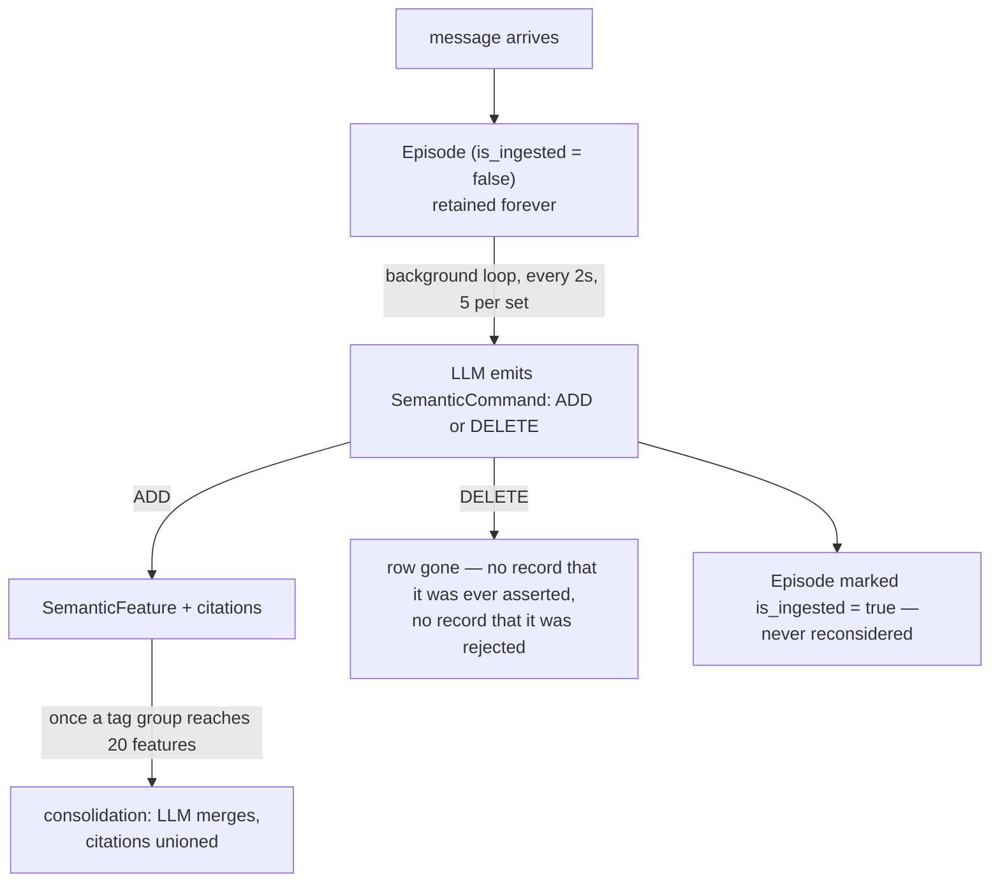
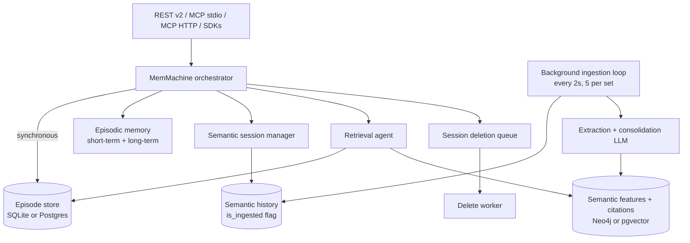

## 1. Executive Summary

MemMachine is a memory **server** — FastAPI plus MCP, backed by a real database —
that splits memory in two and refuses the trade most of this atlas makes. Every
conversation message is written to an episode store and kept. Separately, a
background loop reads those episodes and derives `SemanticFeature` rows: short
typed statements about a user or account, each carrying **citations** back to the
episode IDs it came from.

The paper calls this *ground-truth-preserving*, and the phrase is load-bearing
rather than marketing. Most systems here extract a fact and discard or archive
the conversation that produced it, which makes "why do you believe that?" a
question the store cannot answer. MemMachine keeps both halves, so its citations
resolve to text that still exists. That is the single most valuable property in
this design and very few systems in this atlas have it.

The cost is paid in the same coin. Because the source is retained forever and a
deleted feature leaves no record of having been rejected, the evidence that
originally justified a deleted belief remains permanently available. The system
is saved from re-deriving it by a one-way `is_ingested` watermark rather than by
anything that knows the value was wrong — a guard that works, and works for an
unrelated reason.

The engineering is stronger than most of what this atlas reviews: 1,978 test
functions across 112 files, alembic migrations, four vector backends, an
HNSW-corruption test suite that reads like it was written after an incident, and
a write-path guard that rejects reserved metadata keys explicitly "to prevent
cross-producer / cross-session impersonation". Against that, the deletion path
carries the weakest code in the repository — a duplicated method that silently
discards the error handling its twin has, on the one path where partial failure
is invisible to the caller.

## 2. Mental Model

A memory here is one of two things, and they have different epistemic status.

An **episode** is a message that happened. It is not a claim, it is a record,
and the system treats it as immutable ground truth: written once, never edited,
never re-interpreted. Nothing in the code updates an episode's content.

A **semantic feature** is a claim about someone, derived from episodes. It is a
four-part tuple — `category`, `tag`, `feature_name`, `value` — plus
`metadata.citations`, a list of the episode IDs that produced it
(`semantic_memory/semantic_model.py`).

The state machine is shallow, and the shallowness is the finding:



`SemanticCommandType` has exactly two members, `ADD` and `DELETE`. There is no
supersede, no reject, no confidence, no candidate state. A feature is either in
the table or it is not, and the table is the belief set.

So: memory is **background-managed**, not agent-controlled and not
user-controlled. The LLM that emits commands is not the agent holding the
conversation; it is an ingestion worker running on a timer against a prompt
template. A user can call `delete_features` through the API, and a developer can
configure which categories exist, but nobody approves an individual claim before
it becomes one. Features are treated as **inferred state presented as fact** —
with the significant mitigation that each one shows its work.

How a belief dies: someone deletes it explicitly, or a consolidation pass merges
it into a neighbour and rewrites the value. Nothing expires, nothing decays, and
nothing is ever marked wrong.

## 3. Architecture

A Python 3.12 server in a `uv` workspace of six packages — `server`, `common`,
`client`, `ts-client`, `meta`, `skills`. The server splits into
`episodic_memory`, `semantic_memory`, a `retrieval_agent`, and a `main`
orchestrator (`main/memmachine.py`, 1,671 lines) that every entry point goes
through.



Persistence is pluggable at three layers: episodes through SQLAlchemy, semantic
features through either `neo4j_semantic_storage.py` or
`sqlalchemy_pgvector_semantic.py`, and vectors through `sqlite_vec`, `sqlite`,
`qdrant_vector_store.py`, `milvus_vector_store.py`, or an in-process hnswlib
engine. Alembic migrations live under `semantic_memory/storage/alembic_pg`.

### Deployment and ergonomics

Honest summary: **this is a service, not a library.** There is a
`docker-compose.yml`, a `memmachine-compose.sh`, a configuration wizard
(`installation/configuration_wizard.py`), and a `Dockerfile`, which is the right
amount of scaffolding — but you are standing up a server, a database, and an
LLM provider before anything is stored.

- The SQLite plus `sqlite-vec` path means it **can** run local and offline for
  storage, and the vector search will work.
- It cannot run usefully without an LLM. Semantic features exist only because a
  language model emits commands; with no model configured, ingestion produces
  nothing and you are left with an episode log. An API key is not required to
  *store* — episodes commit regardless — but it is required for memory to mean
  anything beyond transcript search.
- Neo4j is a first-class semantic backend and the Postgres/pgvector path is the
  alternative; either is a real operational commitment.
- The store is inspectable — episodes are rows with plain content, features are
  rows with plain values — so hand-repair is realistic in a way it is not for
  systems that keep only embeddings.

## 4. Essential Implementation Paths

**Capture/write.** `MemMachine.add_episodes` (`main/memmachine.py:682`). Writes
to `episode_storage.add_episodes` first and awaits it, then fans out to episodic
memory and `semantic_session_manager.add_message`. The semantic branch only
records history rows; no LLM runs here.

**Extraction.** `IngestionService._process_single_set`
(`semantic_memory/semantic_ingestion.py:122`). Pulls up to five history rows
with `is_ingested=False`, fetches the episodes, runs the category's update
prompt, and applies the resulting commands in `_apply_commands` (line 280),
which calls `add_citations(f_id, [citation_id])` on every ADD. Ends by calling
`mark_messages_ingested` (line 270).

**Consolidation.** `_consolidate_set_memories_if_applicable` (line 329) groups
features by tag, keeps groups at or above `consolidation_threshold`, and hands
each to `_deduplicate_features` (line 447), which merges via LLM and unions the
input citations (line 484).

**Retrieval.** `MemMachine.query_search` (line 949) and `list_search` (line
1027), with `_search_episodic_memory` (line 744) and the agent-mediated
`_query_episodic_with_retrieval_agent` (line 802) plus
`_dedupe_and_score_agent_long_term_episodes` (line 929).

**Delete/forget.** Four distinct paths:

- `delete_features` (line 1181) — hard delete by feature ID.
- `delete_episodes` (line 1131) with `_cleanup_semantic_history` (line 1166).
- `delete_session` (line 580) — marks the session `Deleted`, then **enqueues**
  the real work on `_deletion_queue`.
- `_delete_session_worker` (line 340) → `_delete_queued_session` (line 355) →
  `_delete_session_episode_store` (line 367), which loops in batches of
  `EPISODE_DELETE_BATCH_SIZE = 1000`.

**Schema.** `common/episode_store/episode_model.py`,
`semantic_memory/semantic_model.py`.

**Integration.** `server/app.py`, `server/api_v2/`, `server/mcp_stdio.py`,
`server/mcp_http.py`, with `api_v2/mcp.py:549` exposing `mcp_delete_memory`.

**Tests.** 112 files under `packages/*/*_tests/`, 1,978 test functions.

## 5. Memory Data Model

`Episode` carries `uid`, `content`, `session_key`, `created_at`, `producer_id`,
`producer_role`, `produced_for_id`, `sequence_num`, `episode_type`,
`content_type`, `filterable_metadata` and `metadata`. One timestamp — the moment
the message was recorded. **There is no validity interval**, so nothing here is
bi-temporal; a fact that was true last year and false now is two features with no
relationship, or one feature the consolidator rewrote.

`SemanticFeature` carries `set_id`, `category`, `tag`, `feature_name`, `value`
and `Metadata{citations, id, other}`. The citation list is the only provenance
mechanism and it is a good one: `Sequence[EpisodeIdT]`, resolvable against a
store that still holds the episodes.

**Scoping** is three-level and real. `SessionData` is a protocol requiring
`org_id`, `project_id` and `session_key` (`main/memmachine.py:82`), and these
are threaded into storage calls rather than merely stored — see
`semantic_session_manager.py:382`, where `project_id` is passed only when the
set type is not org-level, so an org-level feature set is deliberately visible
across projects. Because the key is applied as a filter on the read path, this
earns `scope_enforced`.

The key is a **composed string**, and that is where its limit sits.
`_generate_set_id` builds
`mem_{set_type}_{org_project}_{n_tags}_{hash(tag_keys)}__{sorted_tags}`, where
`org_project` is `org_{org_id}` or `org_{org_id}_project_{project_id}`. Two
pieces of that do real disambiguating work: a set-type discriminator separates
an org-level set from a project-level one, and a hash of the metadata *keys*
plus their count separates differently-shaped tag sets. Those together close the
collisions that a plain concatenation would open between set types.

What they do not close is a collision *within* one set type, because `org_id`,
`project_id` and the tag values are interpolated unescaped and the separator is
an ordinary underscore. An org of `acme_project_x` with project `y` and an org
of `acme` with project `x_project_y` compose the same `org_project` segment,
the same set type and the same tag shape — and therefore the same set id.
Nothing constrains the inputs: `org_id` reaches the server as a bare
`str = Field(default="")` on the MCP request model, with no pattern, and no
validator for either identifier exists anywhere in the tree.

Whether that is reachable depends on something outside this repository — who
supplies `org_id`. A deployment deriving it from an authenticated token is
fine; one that accepts it from the caller, which the shipped request model
permits, has a scope key an untrusted party can shape. The mark stands, because
what it certifies is that the key reaches the query, and it does. What it does
not certify is that the key is injective, and here it is not.

**No versioning, no correction chain, no TTL, no pinning.** The `deleted_at`
string appears once in the repository and not as a column on either memory type.

## 6. Retrieval Mechanics

Two subsystems queried in parallel and merged by `SearchResponse`
(`main/memmachine.py:738`), which is simply `episodic_memory` and
`semantic_memory` side by side — the caller receives both rather than one fused
ranking.

Episodic retrieval runs vector search over episodes with a configurable
reranker. Semantic retrieval matches features by embedding with `min_distance`
and `limit`, and takes a `load_citations` flag, so provenance is opt-in on the
read path rather than always paid for.

The optional **retrieval agent** (`retrieval_agent/`, wired at
`_query_episodic_with_retrieval_agent`) orchestrates a longer path: run a
long-term search, pull short-term context, then dedupe and score across the
results. `_dedupe_and_score_agent_long_term_episodes` is where cross-arm
overlap is resolved.

A second agent fills the same slot for multi-hop questions.
`RaragQueryAgent` decomposes a query into hops, searches the direct and the
two-step formulation **in parallel**, intersects the results, builds combined
queries from the top overlaps, dedupes, and returns up to 200 episodes. Its
decomposer is the part worth noting: hop-splitting is attempted first by a
non-LLM spaCy pass, and the language model is the *fallback* when the optional
`multihop` dependency group is absent — the cheap deterministic path is the
default and the model is the degradation, which is the opposite of the usual
arrangement. The prompt used in the fallback cites its source in the file
([arXiv:2508.03680](https://arxiv.org/abs/2508.03680)).

Both switches default off: `use_optimized_coq` selects the agent for the
ChainOfQuery slot and `multi_hop_decomposer` enables the spaCy splitter, and a
deployment that sets neither gets the original agent. So this is shipped and
opt-in rather than shipped and live, and the import guard that makes the
fallback possible logs a full stack trace at error level when the optional
dependency is merely absent.

A filter language (`common/filter/filter_parser.py`, with `And` and `Comparison`
nodes and `to_property_filter`) is shared between the search and delete paths,
which is why session-scoped deletion can reuse the same expression the reader
uses — a small, good piece of design.

Failure modes to expect: the two arms are merged by the caller rather than
fused, so an application that concatenates them will double-count a fact that
appears both as an episode and as a feature derived from it. And features carry
no recency signal beyond their citations, so a stale profile line competes with
a fresh one on embedding distance alone.

## 7. Write Mechanics

Features are created only by the ingestion LLM. `SemanticCommand` is validated
by pydantic and strips null bytes; the command vocabulary is `add` and `delete`.
Crucially, the LLM does not get to invent structure — categories and their
allowed tags are configuration, and
`server_tests/.../test_semantic_ingestion.py:889` asserts `"LLM-invented tag
must be rejected"` after a consolidation pass that tried to rename `bugfix` to
`Productivity Style`. A constrained write vocabulary with a test proving the
constraint holds is rarer in this atlas than it should be.

The other guard worth naming is on the episode path:
`long_term_memory.py:665` refuses `filterable_metadata` keys beginning with `_`,
because they would collide with `_producer_id`, `_session_key` and
`_episode_uid` — rejected, in the code's own words, "to prevent cross-producer /
cross-session impersonation". That is an explicit defence against a caller
forging provenance, and it has tests either side of it
(`test_episode_to_event.py:135` and `:159`).

Conflict handling is consolidation and nothing else. When a tag group reaches 20
features the LLM is asked to merge them; the merged row's citations become the
**union** of its inputs'. Repeated over months this produces a feature citing
dozens of episodes — provenance that is still technically correct and
progressively less useful. Call it citation dilution; it is the predictable cost
of merging without keeping the pre-merge rows.

### Operational cost

Unusually for this atlas, the numbers are in the code rather than absent.

- **The write path does not block on an LLM.** `add_episodes` awaits the episode
  store and the history insert, both database writes.
- **The lag before a new memory is retrievable as a feature** is one poll of the
  background loop plus one extraction call. `feature_update_interval_sec`
  defaults to **2.0** (`semantic_memory.py:98`) and each pass takes **five**
  history rows per set, so a burst of 20 messages needs four passes, roughly
  eight seconds plus model latency. That is a genuinely fast deferred write, and
  it is one of the few systems here where the lag can be stated from
  configuration rather than estimated.
- **No pass re-reads the whole store.** Consolidation is scoped to one tag group
  above threshold, and ingestion is watermarked by `is_ingested`, which is set
  true in one place (`neo4j_semantic_storage.py:789`) and never reset. The token
  bill scales with the day's traffic, not with the corpus — the opposite of the
  nightly-rebuild systems elsewhere here.
- **On the read path**, `limit` and `min_distance` bound the semantic side and
  the episodic side is reranked, but the assembled prompt is the caller's
  responsibility; the server returns results, not a formatted block.

## 8. Agent Integration

Four surfaces: REST v2 (`server/api_v2/`), MCP over stdio (`mcp_stdio.py`) and
over HTTP (`mcp_http.py`), a Python SDK, and a TypeScript client. There is an
OpenClaw integration under `integrations/`.

Agency is deliberately limited, and the split is the interesting part. The agent
can **search**, **add episodes**, and **delete** — `api_v2/mcp.py:549` exposes
`mcp_delete_memory` and `to_delete_memories_spec` builds its argument shape. The
agent cannot write a semantic feature directly; features are the ingestion
worker's output. So an agent can destroy a belief but not manufacture one, which
is a defensible asymmetry and the reverse of the more common design where the
model writes memories directly.

Injection is not automatic. Nothing here hooks a turn boundary or a compaction
event; the application calls search and decides what to do with the results.
Adapting it to another agent is therefore easy — it is an HTTP or MCP call — and
the work is on the integrator's side.

## 9. Reliability, Safety, and Trust

**Provenance is the strength.** Citations resolve. That sentence is worth more
than the rest of this section, and it is true here and false for most of this
atlas.

**Uncertainty cannot be represented.** There is no confidence field on a
feature, no candidate state, no trust level. Something is a feature or it is
absent. The extraction LLM's judgement is the only filter, and its output is
stored as fact.

**Nothing records rejection.** Deleting a feature removes the row. The episodes
that justified it remain, un-annotated. The system does not re-derive the
feature — `is_ingested` prevents that — but the protection comes from a
processing watermark, not from knowledge that the claim was wrong. Two
consequences follow. First, if a message were ever re-ingested by any future
path, the deleted belief returns with no obstacle. Second, and more immediately,
a user correcting a fact in conversation produces a *new* message, which is
un-ingested, which produces a *new* feature — leaving the old and new features
side by side until a consolidation pass at twenty features decides what to do
with them.

**The deletion path is the weakest code in the repository, in two ways.**

*Deletion is acknowledged before it is performed.* `delete_session`
(`main/memmachine.py:582`) sets the session status to `Deleted` and then calls
`self._deletion_queue.put_nowait(session_data)`. The caller's request returns
successfully at that point. The actual removal happens later in
`_delete_session_worker`, whose exception handler is
`logger.exception("Failed to delete session %s", ...)`. So a failure leaves a
session marked `Deleted`, reporting itself as deleted, with its episodes still
in the store and a line in a log file as the only evidence. There is no retry
and no dead-letter path; the queue is an in-process `asyncio.Queue`, so a
restart between acknowledgement and completion loses the request entirely.

*A duplicated method silently drops error handling on that same path.* Class
`MemMachine` defines `_cleanup_semantic_history` **twice** — at line 565 and
again at line 1168. Verified by AST: both are members of the same class, and
Python binds the later one. They are not identical. The first wraps
`get_semantic_service()` in `try/except ResourceNotReadyError`, logs, and
returns so cleanup can be skipped. The second has no error handling at all. The
defensive version is dead code.

That matters because of where the sole caller sits
(`_delete_session_episode_store`, line 369):

```python
while True:
    episode_ids = await episode_store.get_episode_ids(...)
    if not episode_ids:
        break
    await self._cleanup_semantic_history(episode_ids)   # can now raise
    await episode_store.delete_episodes(episode_ids)
```

If the semantic service is not ready, the live version raises **before**
`delete_episodes` runs. The batch is not deleted, the loop aborts, the worker
logs, and the session's status still reads `Deleted`. The author of the first
definition anticipated exactly this failure and wrote the handler for it; a
later duplicate discarded it.

The project's own tooling does not catch this. `ruff check` on the file reports
no violations, although `F` is selected in `pyproject.toml` and `F811` is not in
the ignore list — the rule fires on a minimal reproduction of the same shape but
not on this file. `ty check` is likewise clean. Only the AST, or a reader, finds
it.

**Multi-tenancy** is otherwise handled with care: scope keys on the read path,
and the reserved-key guard described in section 7 specifically to stop callers
forging cross-session identity.

## 10. Tests, Evals, and Benchmarks

**1,978 test functions across 112 files**, which is among the most thoroughly
tested repositories in this atlas. The suite mirrors the source tree, under
`server_tests/memmachine_server/{semantic_memory,episodic_memory,common,server,main}`.

The standout is `common/vector_store/vector_search_engine/test_hnswlib_engine.py`:
a suite about index corruption from accumulated deletions and re-adds, including
`test_accumulated_tombstones_then_single_readd` and a `_no_corruption` invariant
helper. Its comments distinguish an expected "deleted" error from "the
corruption signature" of a label that resolves to no real slot. This is
production scar tissue, and it is worth noting that the word *tombstone*
throughout that file means an hnswlib index slot, not a rejected value — a
vocabulary collision that will mislead anyone grepping this atlas's terms.

There is real coverage of the semantic path too:
`test_semantic_ingestion.py` runs to at least 890 lines and includes the
invented-tag assertion quoted above and
`test_user_tags_preserved_after_ingestion_and_consolidation`. Deletion has
`test_memmachine_delete_session.py`, which mocks `_cleanup_semantic_history`
directly — and, because it mocks it, cannot detect that two definitions exist.

`evaluation/` holds harnesses for LoCoMo and BEAM plus a `longmemeval_test.py`,
with `data/locomo10.json` and `data/wikimultihop.json` committed. The design is
better than most: `evaluation/README.md` documents three test targets —
MemMachine alone, MemMachine with the retrieval agent, and a **pure LLM baseline
given the full session content**. A baseline that is handed everything is a
strong baseline, which is the opposite of the usual complaint on the
[benchmarks page](../../benchmarks/).

**What is claimed but not committed:** the paper reports LoCoMo 0.9169 with
gpt-4.1-mini and 93.0% on LongMemEval-S. The harness and the datasets are here;
scored output artifacts are not. So the numbers are reproducible in principle
and unverified in this repository, which is the ordinary state of affairs and
worth stating plainly rather than treating as either proof or fault.

**Tests I would want before trusting it:** one that deletes a session while the
semantic service is unavailable and asserts the session is not reported deleted;
one that asserts a corrected fact does not leave the superseded feature
retrievable before consolidation; and any test at all that exercises
`_cleanup_semantic_history` without mocking it.

## 11. For Your Own Build

### Steal

- **Keep the source and cite it.** A derived fact that carries the IDs of the
  records that produced it, in a store that still contains those records, is the
  cheapest honest answer to "why do you believe that?" — and it costs one array
  column. Most systems here cannot answer that question at any price.
- **A one-way ingestion watermark.** A boolean set once and never reset is a
  simpler and more reliable guard against re-processing than any timestamp
  comparison, and it makes the token bill scale with traffic rather than corpus.
- **Constrain the extractor's vocabulary and test the constraint.** Categories
  and tags as configuration, with a committed test asserting the model's
  invented tag was discarded, converts "the LLM might hallucinate structure"
  from a worry into a caught regression.
- **Reject reserved metadata keys by prefix.** A caller who can set
  `_producer_id` can impersonate another producer. A prefix rule with a clear
  error message closes it in ten lines.
- **State your write lag in configuration.** `feature_update_interval_sec = 2.0`
  is a number a reader can reason about. Almost nothing else in this atlas
  offers one.

### Avoid

- **Acknowledging a deletion you have only scheduled.** If the API returns
  success when the work is queued, the queue must be durable and the failure
  path must un-acknowledge. An in-process queue plus `logger.exception` plus a
  status already flipped to `Deleted` is the combination that produces a system
  which sincerely believes it deleted your data.
- **Trusting a linter to catch a duplicate definition.** It did not here, on a
  configuration that selects the rule. If a method matters, the cheap check is
  an AST pass over your own source asserting no class defines a name twice.
- **Merging without keeping what you merged.** Unioning citations on every
  consolidation makes provenance monotonically coarser. If merges are frequent,
  keep the pre-merge rows or record which input contributed which clause.
- **Treating a processing watermark as a correction mechanism.** It stops
  re-derivation as a side effect of bookkeeping. Change the pipeline and the
  protection silently disappears, because nothing ever recorded that the value
  was wrong.

### Fit

This suits a team that already runs Postgres or Neo4j and is building a
personalization layer they expect to still be operating in two years. The test
suite, the migrations, the four vector backends and the incident-shaped HNSW
tests all point at people who intend to support this, and the citation model
gives a support engineer something to look at when a user says the assistant
believes something false. If your obligation is to explain a memory rather than
merely produce one, this is the strongest starting point in the atlas.

Walk away if you want a library. There is no embedded mode worth the name: the
smallest useful deployment is a server, a database and a model provider, and the
Python-package-in-your-process story that `langmem` or `basic-memory` offer is
absent by design. Walk away too if your correctness bar includes "a deleted
thing is provably gone" — the acknowledgement-before-deletion behaviour and the
duplicated cleanup method are both fixable in an afternoon, but you would be
fixing them, and until then the honest description is that this system's
deletion is best-effort while its API says otherwise.

For a research prototype or a weekend agent, the operational cost is out of
proportion to the benefit, and the ceremony around categories and tags will feel
like work before the first memory exists.

## 12. Open Questions

- **Is there any path that resets `is_ingested`?** None was found, and the
  re-derivation guarantee rests entirely on that. A migration, a repair tool, or
  a backfill script that cleared it would silently resurrect every deleted
  feature. Confirming this needs the operational tooling, not just the source.
- **What happens to the deletion queue on shutdown?** `stop()` puts `None` on
  the queue to end the worker, but whether in-flight or pending sessions are
  drained first, and what a container kill does to them, needs a running system.
- **Does consolidation ever contradict itself across categories?** Features are
  grouped and merged per category and per tag; two categories describing the
  same person are never compared. Whether that produces visible contradictions
  in practice needs a populated store.
- **Are the paper's LoCoMo and LongMemEval numbers reproducible here?** The
  harness is committed and was not run.
- **How does the retrieval agent decide when to stop?** The orchestration path
  was read structurally; its termination behaviour under a poor query was not
  traced.

## Appendix: File Index

**Storage/schema**

- `packages/server/src/memmachine_server/common/episode_store/episode_model.py`
- `packages/server/src/memmachine_server/semantic_memory/semantic_model.py`
- `packages/server/src/memmachine_server/semantic_memory/storage/neo4j_semantic_storage.py`
- `packages/server/src/memmachine_server/semantic_memory/storage/sqlalchemy_pgvector_semantic.py`
- `packages/server/src/memmachine_server/semantic_memory/storage/alembic_pg/`

**Write path**

- `packages/server/src/memmachine_server/main/memmachine.py` (`add_episodes`, line 680)
- `packages/server/src/memmachine_server/semantic_memory/semantic_session_manager.py` (`add_message`, line 138)
- `packages/server/src/memmachine_server/episodic_memory/long_term_memory/long_term_memory.py` (reserved-key guard, line 665)

**Extraction and consolidation**

- `packages/server/src/memmachine_server/semantic_memory/semantic_ingestion.py`
- `packages/server/src/memmachine_server/semantic_memory/semantic_llm.py`
- `packages/server/src/memmachine_server/semantic_memory/cluster_splitter.py`

**Retrieval**

- `packages/server/src/memmachine_server/main/memmachine.py` (`query_search`, line 947)
- `packages/server/src/memmachine_server/retrieval_agent/`
- `packages/server/src/memmachine_server/common/filter/filter_parser.py`

**Delete path**

- `packages/server/src/memmachine_server/main/memmachine.py` (lines 340–392, 580, 1131, 1166, 1179)

**Background workers**

- `packages/server/src/memmachine_server/semantic_memory/semantic_memory.py` (`_background_ingestion_task`, line 783)

**MCP/API/SDK**

- `packages/server/src/memmachine_server/server/app.py`
- `packages/server/src/memmachine_server/server/api_v2/mcp.py`
- `packages/server/src/memmachine_server/server/mcp_stdio.py`, `mcp_http.py`

**Tests/evals**

- `packages/server/server_tests/memmachine_server/semantic_memory/test_semantic_ingestion.py`
- `packages/server/server_tests/memmachine_server/main/test_memmachine_delete_session.py`
- `packages/server/server_tests/memmachine_server/common/vector_store/vector_search_engine/test_hnswlib_engine.py`
- `evaluation/README.md`, `evaluation/retrieval_agent/`, `evaluation/data/locomo10.json`

## History

**2026-08-19** — [`2d28c1c1e57d1026335c4a829b1a9b0a918c114f`](https://github.com/MemMachine/MemMachine/commit/2d28c1c1e57d1026335c4a829b1a9b0a918c114f) — re-read two commits on. The mechanism this report describes is unchanged and the criticisms all still hold; what moved is retrieval, and what this reading adds is a limit on the one capability mark.

`RaragQueryAgent` fills the ChainOfQuery slot for multi-hop questions, intersecting a direct and a two-step search and building combined queries from the overlap. Its hop-splitter tries a non-LLM spaCy pass first and falls back to the language model when the optional dependency group is absent, which is the inverse of the usual ordering. Both switches — `use_optimized_coq` and `multi_hop_decomposer` — default to false, so it is shipped and opt-in. Section 6 carries it.

**The `scope_enforced` mark now carries an evidence record, and the record is what surfaced the limit.** The scope key is a composed string: a set-type discriminator and a hash of the metadata keys close the collisions between set *types*, and nothing closes a collision within one, because `org_id`, `project_id` and the tag values are interpolated unescaped between underscores. An org of `acme_project_x` with project `y` composes the same set id as an org of `acme` with project `x_project_y`. No validator for either identifier exists in the tree, and `org_id` arrives on the MCP request model as a bare `str = Field(default="")`. The mark stands — it certifies the key reaches the query, which it does — and section 9 now states what it does not certify.

Every line number cited against `main/memmachine.py` moved by two: a two-line insertion at line 330 shifted everything below it, including the duplicated `_cleanup_semantic_history`, which an AST check confirms is still defined twice in class `MemMachine` — now at 565 and 1168. The citations in `semantic_ingestion.py` are unchanged because the file is. `stack_source` moves from seeded to reviewed, the storage rows having been read rather than inferred at this pin.

Screened again: three dependency surfaces inside the seven-day cooldown, six `conftest.py` executing on collection, one `package.json` lifecycle script in an integration, and four unpinned manifests in examples and integrations. Nothing was installed and no test was run.

**2026-07-29** — [`a681abf9623299bba8ad931e5d9af02fb6ef0997`](https://github.com/MemMachine/MemMachine/commit/a681abf9623299bba8ad931e5d9af02fb6ef0997) — first reading.
