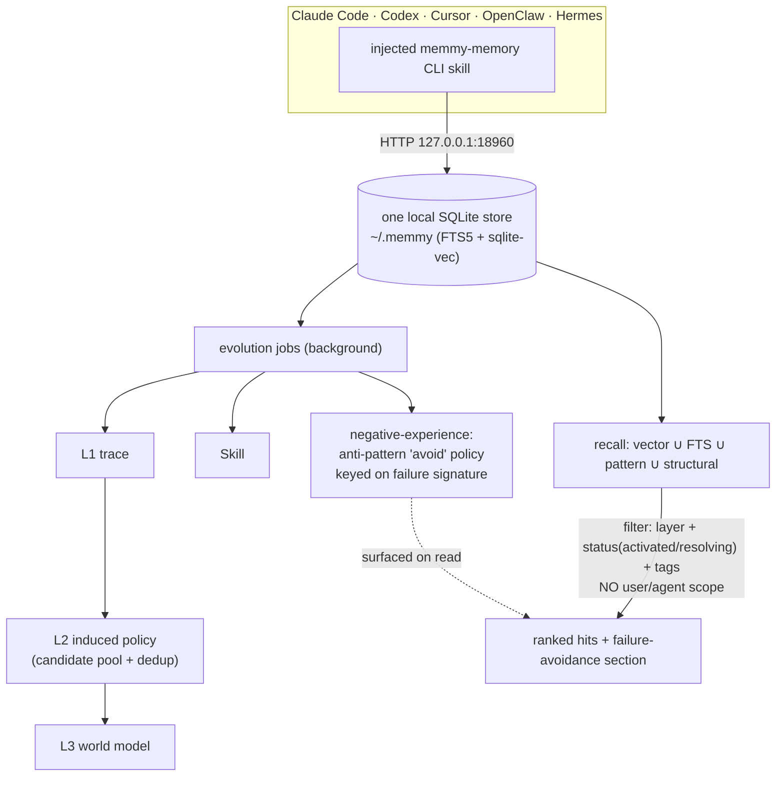

## 1. Executive Summary

Memmy — `memmy-agent` from MemTensor, the team behind MemOS — is a personal AI
agent and, more interestingly for this atlas, a **local memory hub** meant to be
shared across every coding agent a person uses: Claude Code, Codex, Cursor,
OpenClaw, Hermes. The claim is that these one-shot tools should build on each
other's context instead of starting over, and the mechanism is concrete and
distinctive. The durable memory is a real, local SQLite engine — the `@memmy/memory`
package, ~44,000 lines of TypeScript — with an FTS5 mirror, a `sqlite-vec` vector
sidecar, and local embeddings; the shipped default is `byok`/`local`/`sqlite`, so
the whole engine runs on the machine and is present in the repo, not behind a
service (`Memory/src/config/index.ts:252-255`, `storage/backend.ts:111-123`).

Two design choices make it worth a report. The first is **how it is shared**. One
local HTTP daemon (`127.0.0.1:18960`) holds the single SQLite store, and Memmy
*installs a per-agent skill* into each agent's config directory —
`~/.claude` (as `CLAUDE.md`), `~/.codex`, `~/.cursor`, `~/.openclaw`, `~/.hermes`
(`Memory/src/cli/skill-writer/index.ts:161-174`) — that teaches each agent to call
the `memmy-memory` CLI, which hits the shared daemon. Every connected agent reads
and writes the *same* SQLite store, tagged by `--source <agent>`. That is the
"unified memory across agents" realized as an injected CLI skill plus a shared
daemon, and it is a genuinely different integration shape from the MCP servers
elsewhere in this corpus.

The second is **what it stores and how it grows**. A memory is a layered structured
note — `L1` a trace, `L2` an induced policy or preference, `L3` a world-model
abstraction, `Skill` a procedure — and "self-evolving" is a concrete background
pipeline (`evolution_jobs` plus workers) that distills L1 traces, induces L2
policies from repeated traces through a candidate pool with similarity dedup,
abstracts L3, mines skills, and — the part the atlas rewards — runs a
**negative-experience pipeline** that synthesizes anti-pattern "avoid" policies
keyed on a failure signature and surfaces them on read as failure-avoidance
(`Memory/src/service/evolution/negative-experience-pipeline.ts:80-86`). That is a
rejected-value record in the induced-policy layer, and it earns `tombstone` with
the nuance that it applies to anti-patterns and rejected candidates rather than to
deleted user facts.

Memmy is its own system, not MemOS embedded: there is no `memos` dependency, the
engine is memmy's own TypeScript over SQLite, and "MemOS-powered" is lineage and
branding (plus an *optional* hosted OpenMem/MemOS cloud backend that is not the
default). It earns four marks — `tombstone`, `trust_state`, `audit_log`,
`negative_eval` — and its most important withheld one is the mirror of its headline
feature: because the shared brain **deliberately pools across agents**, the primary
recall applies no user/agent/project scope, so `scope_enforced` is withheld by
design, not omission. That trade — one shared memory, no isolation on the main read
— is the thing to weigh before adopting it.

## 2. Mental Model

A memory is a layered note that starts as a trace and is promoted upward by a
background pipeline; recall pools across every agent that shares the daemon.

```text
turns from any connected agent  -> raw_turns / episodes
evolution pipeline (background jobs):
  span-pipeline        L1: summarize traces
  policy-induction     L2: induce policies from repeated L1 (candidate pool + similarity dedup)
  world-model-pipeline L3: abstract world models (confidence-shaped)
  skill-pipeline       Skill: mine procedures
  negative-experience  anti-pattern "avoid" policy keyed on failure signature (merged, not duplicated)

recall (per agent, via CLI -> local daemon):
  vector (sqlite-vec) ∪ FTS5 ∪ pattern ∪ structural  -> per-channel max fuse -> rank
  filter: memory_layer, status IN ('activated','resolving'), tags   (NO user/agent scope)
  LLM multi-query rewrite -> failure-avoidance section injected from anti-patterns
```

The unit is a `MemoryRow` with a discrete `status` (`activated | resolving |
archived | deleted`) that the read path acts on, a `memory_layer`, a `content_hash`
for dedup and a `version`. The state that governs recall is the status — a
`resolving` row is the candidate lifecycle, and only `activated`/`resolving` are
returned — and the thing that makes the store "evolve" is the promotion of L1
traces into L2 policies and the induction of anti-patterns from failures.



## 3. Architecture

The memory core is the `Memory/` workspace (`@memmy/memory`); everything else is
shell and UI (`App/shell/desktop` Electron, `App/frontend/desktop` React,
`App/memmy-agent/src/memmy-memory` a thin HTTP client to the service).

- **`Memory/src/storage/`** — `schema.ts` (SCHEMA_VERSION 4), `db.ts` (SQLite at
  `~/.memmy/memory-service/memory.sqlite`), `backend.ts` (local sqlite vs the
  opt-in remote REST backend), `sqlite-vec-store.ts`, `repositories.ts` (4,990).
- **`Memory/src/service/`** — `memory-service.ts` (2,387), `retrieval/`
  (`indexed-candidate-pool.ts`, `retrieval-service.ts` 2,220, `query-rewrite.ts`),
  `evolution/` (span/policy-induction/world-model/skill/reward/negative-experience
  pipelines + `evolution-job-processor.ts`), `worker/`, `session/`, `namespace/`.
- **`Memory/src/model/embedder.ts`** — local `Xenova/all-MiniLM-L6-v2` via
  transformers.js by default.
- **`Memory/src/cli/`** — the `memmy-memory` CLI, the `skill-writer` that injects
  the per-agent skill, and `skills/memmy-memory/SKILL.md`.
- **`Memory/src/client/openmem-cloud-client.ts`** — the optional hosted backend.

**Storage.** One local SQLite database (`better-sqlite3`), FTS5 (`memories_fts`,
`unicode61`), and a `sqlite-vec` (0.1.9) vector sidecar (`memory_vector_entries`
with `vec_summary`/`vec_action`/`vec` and `embedding_model`/`provider`/`dim`),
plus supporting tables — `sessions`, `episodes`, `raw_turns`, `feedback`,
`decision_repairs`, `l2_candidate_pool`, `skill_trials`, `recall_events`,
`evolution_jobs`, `memory_change_log`, `audit_logs`, `idempotency_keys`. Runtime
deps are `better-sqlite3`, `sqlite-vec`, `@huggingface/transformers` — local by
default, no key required.

The optional cloud is worth stating precisely so it is not mistaken for the engine:
`RemoteRestStorageBackend` (`storage/backend.ts:74-109`, id `openmem-cloud-rest`)
delegates to MemTensor's hosted OpenMem service (`memos-api.openmem.net` /
`memos.memtensor.cn/api/openmem/v1/`), and its `repositories()` throws — it is an
alternate backend a user opts into, not the default and not present in the tree.

### Deployment and ergonomics

- **A shared local daemon plus injected skills.** Run the service; the CLI's
  skill-writer installs a `memmy-memory` skill into each agent's config dir so the
  agents call the CLI, which hits the daemon. This is the whole "one brain" story
  and it needs no MCP.
- **Local and offline by default.** SQLite on disk, local embeddings; the cloud
  backend is opt-in.
- The screen flagged FRESH manifests across the workspaces; nothing was installed
  or run, and the engine was read against 57 committed test files.

## 4. Essential Implementation Paths

- **Ingest** — turns normalized (`turn/turn-normalization.ts`) into `raw_turns`
  and `episodes` (`session/session-turn-service.ts`).
- **Evolve** — background `evolution_jobs` (schema.ts:487, unique `dedupe_key`)
  processed by `service/evolution/evolution-job-processor.ts`: `span-pipeline`
  (L1 summaries), `policy-induction` (L2 via `L2_INDUCTION_PROMPT`, `l2_candidate_pool`
  + `tracePolicySimilarity` dedup), `world-model-pipeline` (L3,
  `shapeWorldModelConfidence`), `skill-pipeline`, `negative-experience-pipeline`.
- **Anti-pattern** — `negative-experience-pipeline.ts:85`
  `policy:avoid:${stableHash(scope:signature)}` and `:409`
  `avoid:${stableHash(normalized)}`, merged into an existing policy via
  `decisionGuidance(..., "anti_pattern")`; surfaced through `failureAvoidanceSection`
  (`retrieval-service.ts:428-432`).
- **Retrieve** — `service/retrieval/indexed-candidate-pool.ts:90-137` runs
  `searchVectorIds` (sqlite-vec), `searchFtsIds` (FTS5), `searchPatternIds`,
  `searchStructuralIds` in parallel, fused by per-channel max in
  `algorithm/plugin-algorithms.ts`; LLM multi-query rewrite in
  `service/retrieval/query-rewrite.ts`.
- **Share** — `Memory/src/cli/skill-writer/index.ts:161-174` writes the skill into
  each agent's config dir; `SKILL.md` teaches the agent to call the CLI with
  `--source <agent>`; all hit `http://127.0.0.1:18960`.
- **Govern** — `memory-service.ts:1227` `deleteMemory` → soft delete;
  `:1171-1217` `archiveMemory`; `:1313` `redactRawTurn`; `repositories.ts:3286-3361`
  import conflict `skip|replace|error`.

## 5. Memory Data Model

A `MemoryRow` (`types.ts:99-131`, table at `schema.ts:24-47`) carries
`memory_type`, `status` (`activated|resolving|archived|deleted`), `visibility`
(`private|public|session`), `memory_key`, `memory_value`, `tags_json`, `info_json`,
`properties_json` (holding `internal_info.memory_layer/memory_kind`),
`memory_layer` (`L1|L2|L3|Skill`), `content_hash`, `version`, and
`created_at`/`updated_at`/`deleted_at`. Vectors are separate in
`memory_vector_entries`, stamped with the embedding model, provider and dimension —
so unlike some stores here a vector carries the space that produced it.

Three facts decide marks.

**Status is discrete and gates recall, in two nested layers.** The row status
`activated`/`resolving`/`archived`/`deleted` is declared three times so the wire,
the type and the store agree — a TypeScript union (`types.ts:33`), a Zod enum on
the runtime contract (`contracts/memory-runtime.ts:35`) and a SQLite `CHECK`
(`storage/schema.ts:35`). The lifecycle mapping is
`memoryStatusForLifecycleStatus` (`memory-service.ts:2672-2674`), where a
`candidate` becomes `resolving`. Reads act on it two ways: the cross-agent skill
pool hard-codes `AND status IN ('activated', 'resolving')`
(`storage/repositories.ts:698`), while `search` and the other list paths set it
as a **default** a caller may widen (`:922`, `:967`, `:990`, `:1018`, `:1054`,
`:1082`, `:1233`) — the viewer and HTTP APIs expose exactly that widening
(`server/viewer-api.ts:438`, `server/http.ts:1538`). Invoking a skill outside the
pair is refused rather than silently empty: `read-model/skill.ts:313` throws
`conflict` naming the offending status.

Beneath it sits a finer state that is the more interesting one. An L2 policy
carries `candidate | active | verification_required | quarantined | superseded |
archived` (`algorithm/plugin-algorithms.ts:84`). Only `active` and `candidate`
reach recall, and the candidate is not merely admitted — it is **relabelled** in
the injected context as "Candidate Experience (unverified)" with an instruction
to treat it as a hypothesis and verify it in the current task. Reuse is gated
separately by `policyIsEligibleForDownstream` (`:3336-3341`), which requires
`active` *and* a revalidation deadline that has not passed, so freshness and
belief are two conditions rather than one blended number. Induction demotes a
formerly `active` policy to `verification_required` when its support and gain
stop clearing the bar (`service/evolution/policy-induction.ts:709-711`).

`trust_state` is earned on both layers, and neither enters a score: world-model
confidence and skill-trial pass/fail are adjacent signals the ranker reads, the
states are not.

**Rejected values are recorded and keyed on content.** The anti-pattern policies
are keyed on a `stableHash` of a failure signature and merged rather than
duplicated, and `l2_candidate_pool` carries an explicit `status='rejected'` keyed
on a `candidate_key` so a rejected candidate is not re-promoted (`schema.ts:229-241`).
This is `tombstone` in the induced-policy layer — a durable rejected-value record
that steers future behaviour away — with the honest nuance that it governs
anti-patterns and induction candidates, not deletion of user facts (a deleted fact
is a soft-delete, not a value-keyed rejection).

**There is no validity-time axis.** Only `created_at`/`updated_at`/`deleted_at` —
record time — so `bitemporal` is withheld.

## 6. Retrieval Mechanics

Recall is multi-channel and fused. Per layer, `indexed-candidate-pool` runs four
routes in parallel — vector cosine over the `sqlite-vec` sidecar (against
summary, action and content vectors), FTS5 lexical, a pattern route and a
structural route — and fuses them by taking the per-channel max score into a
combined ranking (`algorithm/plugin-algorithms.ts`), with an LLM multi-query
rewrite expanding the query first. Anti-pattern policies are injected as a
dedicated failure-avoidance section, so the store not only surfaces what worked but
warns against what failed.

The property that decides the withheld mark is the filter. The scope keys
(`user_id`, `agent_id`, `app_id`, `session_id`) all exist on the row and in
`MemoryFilter`, and episode reads assert scope (`retrieval-service.ts:1486`), but
the **primary semantic recall builds its filter from `{memory_layer, status,
tags}` only** (`indexed-candidate-pool.ts:85-93`) — no user, agent or project
predicate. This is deliberate: the whole point is one memory pooled across agents,
so recall crosses agents by design. `scope_enforced` is therefore withheld not
because the key is missing but because the main read intentionally does not apply
it — which is exactly the confidentiality trade a reader must weigh (§9).

## 7. Write Mechanics

Writes are two-phase and evolutionary. Turns ingest cheaply into `raw_turns`/
`episodes`; the durable, typed memories are produced asynchronously by the
evolution pipeline, so nothing blocks the agent's turn. The pipeline is the
"self-evolving" claim made concrete: L1 summaries from traces, L2 policies induced
from *repeated* L1 traces through a candidate pool with similarity dedup, L3
abstractions with a confidence-shaping step, mined skills, and the
negative-experience pass. Deduplication is real — `content_hash`
(`repositories.ts:3552`, `contentHash ?? stableHash(memoryValue)`) and the
`evolution_jobs.dedupe_key` unique index — so the store does not simply accrete
duplicates.

Correction and conflict are handled at several layers. A user (or the panel) can
soft-delete (`status='deleted'`, `deleted_at`; reads filter `deleted_at IS NULL`),
archive, or redact a raw turn; import carries a `skip|replace|error` conflict
strategy. The sharpest mechanism is the negative-experience pipeline: a failure
becomes an anti-pattern "avoid" policy keyed on its signature and merged into
existing guidance, and a rejected induction candidate is remembered as `rejected`
in the candidate pool so it is not re-promoted. So Memmy does record rejected
values — in the induced layer — which is more than most stores here manage, even if
a plainly deleted user fact is only soft-deleted rather than tombstoned by value.

Every governance mutation is logged: an `audit_logs` row on archive/delete/redact
(`memory-service.ts:1204-1213`) and an append-only `memory_change_log` with
before/after JSON (`repositories.ts:1930-1956`, `appendChange`). The one caveat for
`audit_log` is that both are subject to retention pruning
(`scheduleLogTablePruneAfterInsert`), so the trail is append-only but not
indefinite.

## 8. Agent Integration

The integration is the distinctive thing. Memmy is **not** an MCP server; it is a
local HTTP daemon plus an injected CLI skill. The skill-writer enumerates a fixed
set of supported agents (`SUPPORTED_MEMMY_AGENT_IDS = ["codex", "cursor",
"claude", "opencode", "openclaw", "hermes"]`, `cli/skill-writer/index.ts:6`) and
writes a `memmy-memory` skill into each one's config directory — into `~/.claude`'s
`CLAUDE.md`, into `~/.codex`, `~/.cursor`, and so on — teaching that agent to shell
out to the `memmy-memory` CLI, tagging its writes with `--source <agent>`. Every
agent therefore reads and writes the one SQLite store behind the daemon. This is a
clean answer to "how do five different coding agents share one memory" that sidesteps
MCP entirely, and it is the design's signature.

The consequence is the withheld scope mark read from the integration side: because
the point is a shared brain, the memories are pooled and the main recall does not
partition by which agent wrote them. `--source` records provenance; it does not
scope retrieval. For a single user that is the feature; for anyone who would run
distinct projects or trust boundaries through one daemon it is the risk.

`human_review` is withheld: there is a governance panel where a user can archive,
delete or redact, and an explicit `feedback` polarity, but there is no
approval queue adjudicating memory *content* before it is stored — candidate
promotion is automated by the evolution pipeline, not gated on a person.

## 9. Reliability, Safety, and Trust

- **Trust is a status the store acts on, and the injected context repeats it.**
  Recall filters to `activated`/`resolving`, so an archived or deleted memory does
  not surface; a skill invoked outside that pair is refused by name rather than
  silently missing. Under it the policy lifecycle admits only `active` and
  `candidate`, and the candidate arrives in the prompt carrying its own caveat —
  the state is not just a filter the model never sees, it changes what the model
  is told about what it is reading.
- **Failures are remembered as anti-patterns.** The negative-experience pipeline
  turns a failure into a durable, content-keyed avoid policy surfaced on read. That
  is the rejected-value discipline the atlas keeps asking for, applied to induced
  policies — a genuine strength.
- **Mutations are logged, with a retention caveat.** `audit_logs` and an
  append-only `memory_change_log` with before/after record governance ops in the
  system's own store; both are pruned by a retention job, so the guarantee is
  "append-only within the window", not forever.
- **The shared brain has no scope on its main read.** This is the load-bearing
  risk. Scope keys exist and the main semantic recall does not apply them, by
  design, so every connected agent's memory pools into one recall surface. A single
  user gets the intended benefit; anyone pointing multiple projects or trust
  boundaries at one daemon gets cross-contamination with only `--source` provenance
  to reconstruct who wrote what.
- **"MemOS-powered" is lineage, and the cloud is one flip away.** The engine is
  memmy's own TypeScript, not the MemOS package; but a `RemoteRestStorageBackend`
  can point the store at MemTensor's hosted OpenMem service, at which point the
  durable mechanism moves off the machine. The default is local; the option exists.

## 10. Tests, Evals, and Benchmarks

57 `*.test.ts` files under `Memory/tests/` cover the algorithm, repositories,
retrieval service, evolution pipelines, contracts, the embedder, config, the CLI,
and a local-vs-cloud parity suite. The relevant negative case is real:
`tests/service/retrieval/injected-context.test.ts:113-115` asserts that scanned,
unrelated and stale markers (`"…MUST_NOT_BE_INJECTED"`, `"STALE_FIRST_REPORT"`)
do **not** appear in the injected context — a committed must-not-retrieve
assertion, which earns `negative_eval`.

What is absent is a retrieval-quality benchmark: the multi-channel fusion, the
LLM query rewrite and the L1→L2→L3 induction are the design's substance, and while
the pipelines are unit-tested, nothing committed measures whether recall returns
the right memories or whether induced policies improve task outcomes — the
measurement the "self-evolving" claim most invites. MemTensor's MemOS has academic
papers; none is cited in this repository, and the "MemOS-powered" line is branding
rather than a citation.

## 11. For Your Own Build

### Steal

- **Share one memory across agents with a daemon plus an injected CLI skill.**
  Writing a small skill into each agent's config dir that shells to a CLI against a
  shared local service is a pragmatic, MCP-free way to give several coding agents
  one brain — and tagging writes with `--source` keeps provenance even when
  retrieval pools.
- **Remember failures as content-keyed anti-patterns.** Turning a failure into an
  "avoid" policy keyed on a failure signature, merged rather than duplicated, and
  injected as a failure-avoidance section, is a rejected-value mechanism that
  steers future behaviour — the useful half of a tombstone in the procedural layer.
- **Keep a `rejected` state in the induction candidate pool.** A rejected L2
  candidate remembered by `candidate_key` is not re-promoted next cycle, which stops
  the evolution loop from re-proposing what it already discarded.
- **Stamp every vector with its model and dimension.** `memory_vector_entries`
  carrying `embedding_model`/`provider`/`dim` is the space-guard some stores here
  lack, and it costs three columns.

### Avoid

- **Do not pool a shared brain without a scope you can turn on.** One recall
  surface across every agent is a feature for a solo user and a confidentiality
  leak across projects or trust boundaries; the scope keys are on the row, so apply
  them when isolation matters rather than filtering by layer/status/tags alone.
- **Do not let a soft-delete masquerade as forgetting.** A deleted user fact is a
  `status='deleted'` row filtered on read, not a value-keyed rejection — if an
  extraction or a re-ingest can re-derive it, it comes back; the anti-pattern
  mechanism exists, so extend it to user deletions if that matters.
- **Do not call an append-only log durable if a retention job prunes it.** The
  change log and audit log are append-only within their window; say so.

### Fit

This suits a single developer who runs several coding agents and wants them to
share one growing, local memory — and who values the cross-agent shared brain over
per-project isolation. The layered evolution and anti-pattern induction are more
than most local stores attempt, it is genuinely local by default, and the injected-
skill integration means it works with the agents people already use without MCP
plumbing.

Walk away if you need per-project or per-trust-boundary isolation from the same
daemon — the main recall deliberately does not scope — or if "local" is a hard
requirement you cannot police, since the hosted backend is a configuration away.
And treat "self-evolving" as an LLM consolidation pipeline whose recall quality is
unmeasured here, not a proven gain.

## 12. Open Questions

- Is the unscoped main recall intended to stay a pooled shared brain, or will
  per-project/per-agent scope become applyable on the primary read? The keys are on
  every row.
- How much does the L1→L2→L3 evolution and anti-pattern induction improve task
  outcomes? The pipelines are tested; the gain is unmeasured.
- Should user-fact deletion become a value-keyed rejection like the anti-pattern
  path, so a re-ingest cannot restore a deleted fact?
- How many deployments opt into the hosted OpenMem backend, and what moves off the
  machine when they do?

## Appendix: File Index

- `Memory/src/storage/schema.ts`, `db.ts`, `backend.ts`, `sqlite-vec-store.ts`, `repositories.ts` — schema, local/remote backends, vector sidecar, dedup, change log.
- `Memory/src/service/memory-service.ts` — store/delete/archive/redact, status mapping, audit writes.
- `Memory/src/service/retrieval/` — `indexed-candidate-pool.ts` (channel fusion, filter), `retrieval-service.ts` (failure-avoidance, episode scope), `query-rewrite.ts`.
- `Memory/src/service/evolution/` — `span-pipeline`, `policy-induction`, `world-model-pipeline`, `skill-pipeline`, `negative-experience-pipeline`, `evolution-job-processor`.
- `Memory/src/model/embedder.ts` — local all-MiniLM embeddings.
- `Memory/src/cli/skill-writer/index.ts`, `cli/skills/memmy-memory/SKILL.md` — the injected per-agent skill.
- `Memory/src/client/openmem-cloud-client.ts` — the optional hosted backend.
- `Memory/tests/service/retrieval/injected-context.test.ts` — the must-not-inject assertions.

## History

**2026-09-19** — [`65c1825dc4d5daafc9d2ae283977cf08610c4938`](https://github.com/MemTensor/memmy-agent/commit/65c1825dc4d5daafc9d2ae283977cf08610c4938) — `trust_state` re-tested against the narrowed line, which asks whether the field answers *may this be acted on* and gets used for filtering, rather than *how sure* and used for ranking. The mark stands and was understated. The record described one four-value row status; there are two nested states. The row status is declared three times over — a union, a Zod enum on the runtime contract and a SQLite `CHECK` — and reads act on it two ways: the cross-agent skill pool hard-codes the pair (`Memory/src/storage/repositories.ts:698`) while `search` and six sibling list paths set it as a default a caller may widen (`:922` and after), which the viewer and HTTP APIs deliberately do. Beneath it an L2 policy carries six values — candidate, active, verification_required, quarantined, superseded, archived (`Memory/src/algorithm/plugin-algorithms.ts:84`) — of which only the first two reach recall, and the candidate is relabelled in the injected context as Candidate Experience (unverified) with an instruction to treat it as a hypothesis. Reuse is gated by a separate predicate requiring `active` and an unexpired revalidation deadline (`:3336-3341`), so freshness and belief stay two conditions instead of one blended number, and induction demotes a formerly active policy to verification_required when its support and gain stop clearing the bar (`Memory/src/service/evolution/policy-induction.ts:709-711`). Three corrections to what was written down: the candidate-to-resolving mapping is `memoryStatusForLifecycleStatus` at `memory-service.ts:2672-2674`, not `:2183`; two frontmatter anchors were missing their `Memory/` prefix; and the evidence cited `Memory/tests/repository/memory-retrieval-index.test.ts:358`, which is an `EXPLAIN QUERY PLAN` assertion pinning the index, not the filtering behaviour — the behavioural test is `Memory/tests/service/retrieval/query-and-filter.test.ts:123-177`, which walks all six policy states through recall and asserts what comes back. Screened again first; nothing was installed and no suite was run.

**2026-09-14** — [`65c1825dc4d5daafc9d2ae283977cf08610c4938`](https://github.com/MemTensor/memmy-agent/commit/65c1825dc4d5daafc9d2ae283977cf08610c4938) — re-read, 749 commits past the previous pin across 1,128 files, most of it desktop application, release and Windows work rather than memory. All four marks stand and each was re-verified in source rather than carried forward; the tree gained a `Memory/src/` prefix, so the cited pipeline path is corrected. The `tombstone` keying is worth restating because it is the clause most mechanisms in this corpus fail: the avoidance policy key is `policy:avoid:` plus a stable hash of the scope identity and the *failure signature*, so it is derived from what went wrong rather than from a row id, and `findExisting` consults it before writing. Evidence records were written for all four marks, which the report previously carried none of, including the retention limit on the audit log — `scheduleLogTablePruneAfterInsert` runs on every insert — and the fixture markers the negative cases are named after. Screened again first; nothing was installed and no suite was run.

**2026-08-15** — [`c6cdbf9a126cc297253783c5594ac5ee8acb7c1a`](https://github.com/MemTensor/memmy-agent/commit/c6cdbf9a126cc297253783c5594ac5ee8acb7c1a) — first reading. Screened before opening: FRESH manifests across the workspaces; nothing was installed or run. The `Memory/` package was established as the authoritative local engine (default `byok`/`local`/`sqlite`, `config/index.ts:252-255`), distinct from the MemOS Python package and from the optional hosted OpenMem backend; the layered store, the evolution pipeline, the anti-pattern/negative-experience mechanism, the injected per-agent CLI skill, and the unscoped main recall were read from `Memory/src/storage/`, `service/` and `cli/` and cross-checked against the committed tests (`injected-context.test.ts`). `tombstone` (anti-pattern and rejected-candidate records keyed on content), `trust_state` (status consumed on read), `audit_log` (audit and change logs, retention-pruned) and `negative_eval` are earned; `scope_enforced` is withheld because the primary recall deliberately pools across agents, and `bitemporal` and `human_review` are withheld. No paper is cited in the tree; "MemOS-powered" is lineage and branding.
