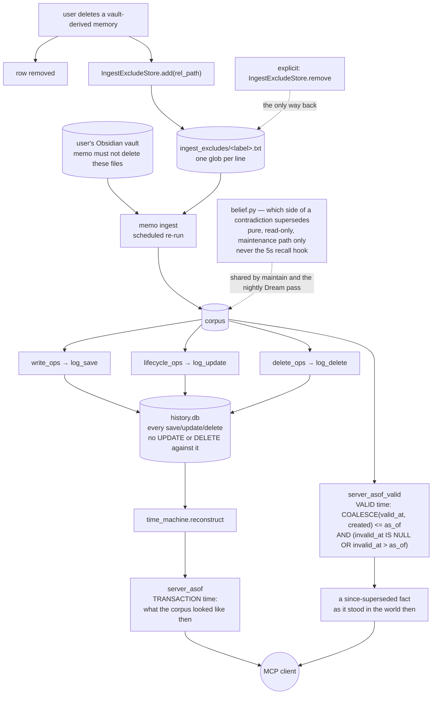

## 1. Executive Summary

memo is a local-first persistent memory for coding agents — Claude Code, Codex,
Cursor, Cline and others — in Python over SQLite, served over MCP. MIT, 1,616
files. The pitch is the familiar one about amnesia; the implementation is not.

**Four marks: `tombstone`, `bitemporal`, `audit_log` and `negative_eval`.**

The tombstone is the rare correct kind, and its docstring states the exact
problem the rubric was written for:

> When the user deletes a vault-derived memory, deleting the memo row is futile
> on its own: the `com.memo.vault-ingest` agent re-runs `memo ingest` and the
> surviving `.md` resurrects the row on the next tick. memo must not destroy
> the user's Obsidian file, so instead a *tombstone* is recorded here.

A durable record keyed on the source, consulted by the ingest path, so
re-extraction cannot silently re-assert what the user removed. Written on
delete, read on ingest, and reversible only by an explicit command.

The bitemporal work is the other reason to read this. memo ships **two separate
families of as-of tools** and the second one's header explains why:
`server_asof.py` does *"TRANSACTION-time reconstruction... what the corpus
looked like at a past point given the audit log"*, while `server_asof_valid.py`
filters each record's validity interval *"so a since-superseded fact resurfaces
exactly as it stood in the world at `as_of`."* Two questions, two endpoints,
the difference spelled out in the source.

## 2. Mental Model

Three stores rather than one. The corpus holds memories. `history.db` records
every save, update and delete. A per-vault exclusion file records what must not
come back.

The audit log is not a side channel here — it is the input to transaction-time
reconstruction, so a missing entry would show up as a wrong answer from a
feature rather than as a gap nobody notices.

## 3. Architecture

## 4. Essential Implementation Paths

**The exclusion store** — `src/memo/ingest_exclude.py:1-13`. State is
`<state_dir>/ingest_excludes/<label>.txt`, one glob per line, one file per vault
label, *"append-only-ish text files, deduped on read/write."* The module records
its own provenance too: ported from a predecessor project on its deprecation,
with a note naming the two helpers that *"died with it."*

**Both ends wired** — `cli_ops.py:274` calls `add`, `cli_ops.py:283` calls
`remove`, and `vault_ingest.py:81` constructs the store on the ingest path, with
the module docstring at `:37` saying it exists *"so re-ingestion can't resurrect
them."* Producer, consumer and a deliberate reversal.

**The two clocks** — `src/memo/server_asof_valid.py:1-13` carries the
distinction verbatim, and the predicate with it:
`COALESCE(valid_at, created) <= as_of AND (invalid_at IS NULL OR invalid_at >
as_of)`. The same shape appears at `memory/search_ops.py:103` and
`server_temporal.py:50` for edges. `COALESCE` is the honest part: a record whose
world time was never supplied is filtered by when it was written.

**The history log** — `src/memo/history.py:126`, `:165`, `:198`: `log_save`,
`log_update`, `log_delete`. The callers are the operations themselves —
`memory/write_ops.py:1066`, `memory/lifecycle_ops.py:254` and `:312`,
`memory/delete_ops.py:251` — so the three mutation verbs each log from the code
that performs them. Nothing in the tree issues an `UPDATE` or `DELETE` against
the history table.

**The contradiction rule, in one place** — `src/memo/belief.py:1-8`. *"Which
side of a contradiction (if any) supersedes. Shared by `memo maintain` and the
nightly Dream contradict pass so the recency-clobber fix lives in exactly one
place. Pure and READ-ONLY over the store... Runs only in the maintenance path,
never the 5s recall hook."* Four constraints in six lines: one implementation,
no writes, and off the latency-critical path.

## 5. Memory Data Model

A memory carries a validity interval — `valid_at` and `invalid_at` — beside its
`created` record time, and for vault-derived memories a source path that the
exclusion store can name. An entity graph sits alongside in `graph.py`.
Supersession is decided by the belief module during maintenance rather than
computed per read.

`terminal_receipt_tombstones` is a different thing under the same word: a capped
table of receipt keys with a `tombstone_limit`, bounding how many are retained.

## 6. Retrieval Mechanics

Search with an optional `as_of` that selects the valid-time filter, or the
separate transaction-time tools that reconstruct from the audit log. The
valid-time route goes *"straight through the live `Memory.search` /
`Memory.ask` index with `as_of=`; no snapshot reconstruction"* — so the two
routes differ in cost as well as in meaning.

## 7. Write Mechanics

Saves, updates and deletes each log to `history.db`. A vault delete additionally
writes the exclusion glob. Consolidation and the nightly Dream passes rewrite
and retire content during maintenance.

One line worth reading against the tombstone above:
`consolidation.py:484` notes that *"the upsert clears any delete tombstone"* —
a different, weaker marker on the reindex path, and the shape the rubric warns
about. The two coexist, and only the ingest-exclusion one survives a re-run.

## 8. Agent Integration

An MCP server with profile-gated tool families, hooks and slash commands for
several editors, launchd and systemd units, a statusline, and a web chat.

## 9. Reliability, Safety, and Trust

**`tombstone`.** Durable, keyed on the source note rather than on the deleted
row — which is the point, since the row is what gets resurrected — consulted by
the ingest path, and undone only by an explicit command.

**`bitemporal`.** Two axes with a read on each, as two separate MCP tool
families, with the difference between them written into the module header rather
than left for a reader to infer.

**`audit_log`.** Three verbs logged by the operations that perform them, into a
separate database with no rewrite path, and load-bearing: transaction-time
reconstruction is computed from it, so an incomplete log would surface as a
wrong answer rather than as silence.

**`negative_eval`** — section 10.

**`trust_state` is withheld.** `belief.py` decides which side of a contradiction
supersedes, and it runs *"only in the maintenance path, never the 5s recall
hook"*. So supersession is a retirement performed between sessions rather than a
state the recall path consults; a memory contradicted an hour ago and not yet
maintained is returned like any other. That is a defensible latency decision and
it is not a state that withholds.

**`scope_enforced` is withheld.** memo is single-user and local by design —
*"100% on your own machine"* — so there is no principal to scope against and no
stored scope key on a read path.

**`human_review` is withheld.** Deletion and exclusion are user actions at a
CLI, which is the user driving the tool rather than a memory waiting in a state
until someone resolves it.

**Worth knowing before installing.** The screen found **six auto-run surfaces** —
hooks, launchd and systemd units, an installer and editor command files. That is
inherent to what the product does, and it is a larger execution surface than
most systems in this corpus.

## 10. Tests, Evals, and Benchmarks

A large pytest suite with a conformance directory and an `eval/` tree. Nothing
was installed and nothing was run: the screen reported six auto-run surfaces.

The must-not cases are thematically tied to the tombstone, which is the sign
that resurrection is treated as the real risk rather than an edge case:

- `tests/test_consolidate_restore.py:294` — *"Keeping the id must not let a
  disk-only recovery resurrect an archive."*
- `tests/test_ingest_enhanced.py:981` — a regression case that images inside a
  `dir/**`-excluded subtree must not be ingested.
- `tests/test_dream_profile.py:302` —
  `assert "old superseded rule" not in doc  # retired via contradict pair`, an
  assertion that a superseded rule is absent from generated output.

The third is the strongest shape: material kept out of what the model is handed
because it was superseded, asserted on the output rather than on the query that
produced it.

No paper.

## 11. For Your Own Build

### Steal

- **Tombstone the source, not the row.** If a scheduled importer can re-create a
  memory from a file you do not own, deleting the row is a no-op with extra
  steps. Record what must not be re-ingested, and let the importer read it.
- **Write the resurrection scenario into the docstring.** *"the surviving `.md`
  resurrects the row on the next tick"* is why nobody will later simplify the
  exclusion away.
- **Ship the two as-of questions as two tools.** "What did the store hold" and
  "what was true" are different questions with different costs, and one
  parameter cannot express both honestly.
- **Make the audit log load-bearing.** A log that a feature reconstructs from is
  checked every time that feature runs; a log nothing reads is checked never.
- **Put the contradiction rule in one pure module and keep it off the hot path.**
  `belief.py` names all four constraints in its first six lines.

### Avoid

- **Two things called tombstone in one codebase.** The ingest exclusion survives
  a re-run; the delete marker that *"the upsert clears"* does not, and a reader
  who finds the wrong one first will draw the wrong conclusion.
- **Deciding supersession only in maintenance.** It keeps recall fast and it
  means a contradiction found last night is authoritative and a contradiction
  found an hour ago is not.

### Fit

Take it for one person on one machine who wants durable agent memory with real
temporal queries. Read the auto-run surfaces before installing; there are six,
and they are how it works rather than an oversight.

## 12. Open Questions

- The exclusion is keyed on a vault-relative glob. What happens when the user
  moves or renames an excluded note?
- `belief.py` runs only in maintenance. Is a cheap read-path check for
  recently-contradicted records intended, or is the staleness window accepted?
- `consolidation.py` clears a delete tombstone on upsert while the ingest
  exclusion survives. Are the two meant to converge?
- Transaction-time reconstruction pulls the corpus and the audit log into RAM
  with a stated bound. What is the intended behaviour past it?

## Appendix: File Index

| Path | What it holds |
| --- | --- |
| `src/memo/ingest_exclude.py` | the exclusion store, and the resurrection problem it exists for |
| `src/memo/vault_ingest.py` | the ingest path that reads it |
| `src/memo/cli_ops.py` | `add` on delete, `remove` as the deliberate reversal |
| `src/memo/server_asof.py` | transaction-time reconstruction tools |
| `src/memo/server_asof_valid.py` | valid-time tools, and the header distinguishing the two |
| `src/memo/history.py` | `log_save`, `log_update`, `log_delete` |
| `src/memo/memory/write_ops.py`, `lifecycle_ops.py`, `delete_ops.py` | the three callers |
| `src/memo/belief.py` | the shared contradiction rule and its four constraints |
| `src/memo/consolidation.py` | the weaker delete marker the upsert clears |

## Appendix: Recorded Searches

Run from the root of the checkout at the pinned commit.

| Claim | Command | Result at this pin |
| --- | --- | --- |
| The exclusion has a producer and a consumer | `grep -rn "IngestExcludeStore\|ingest_exclude" --include='*.py' src \| grep -v 'ingest_exclude.py:'` | Written at `cli_ops.py:274`, removed at `:283`, read on the ingest path at `vault_ingest.py:81` |
| The history log is never rewritten | `grep -rn "UPDATE audit\|DELETE FROM audit\|UPDATE history\|DELETE FROM history" --include='*.py' src` | Nothing |
| All three mutation verbs log | `grep -rn "log_save\|log_update\|log_delete" --include='*.py' src/memo/memory` | `write_ops.py:1066`, `lifecycle_ops.py:254` and `:312`, `delete_ops.py:251` |
| Both time axes are read | `grep -rn "as_of" --include='*.py' src/memo \| grep -iE "WHERE\|<=\|valid_at"` | `server_asof_valid.py:6`, `memory/search_ops.py:103`, `server_temporal.py:50`; transaction time via `time_machine.reconstruct` |
| Supersession is not filtered at recall | `grep -rn "superseded" --include='*.py' src/memo/memory/*.py \| grep -iE "WHERE\|filter\|exclude"` | Nothing; `belief.py:6-7` states it runs *"only in the maintenance path, never the 5s recall hook"* |
| Two mechanisms share the word tombstone | `grep -rn "tombstone" --include='*.py' src` | The ingest exclusion, a delete marker `consolidation.py:484` says an upsert clears, and a capped `terminal_receipt_tombstones` table |
| The licence carries no rider | `head -3 LICENSE`; `grep -n -i 'anthropic\|may not' LICENSE` | Stock MIT, no match |

## History

**2026-09-20** — [`b4d16ca593f0e9ede021e0b39d47ce08a4c15c5e`](https://github.com/jagoff/memo/commit/b4d16ca593f0e9ede021e0b39d47ce08a4c15c5e) — first reading, at 1,616 files. Screened before reading: **six auto-run surfaces** — hooks, launchd and systemd units, an installer and editor command files — two build-time execution points, two unpinned surfaces and nothing inside the cooldown. Nothing was installed and nothing was run, and the committed `eval/` tree was read rather than executed. MIT. Four marks: `tombstone`, `bitemporal`, `audit_log`, `negative_eval`. `trust_state` is withheld because the contradiction rule runs only during maintenance and the recall path consults no state; `scope_enforced` because the product is single-user by design. The repository's MCP name is `io.github.jagoff/memo`; the atlas had no report under that name before this one.
