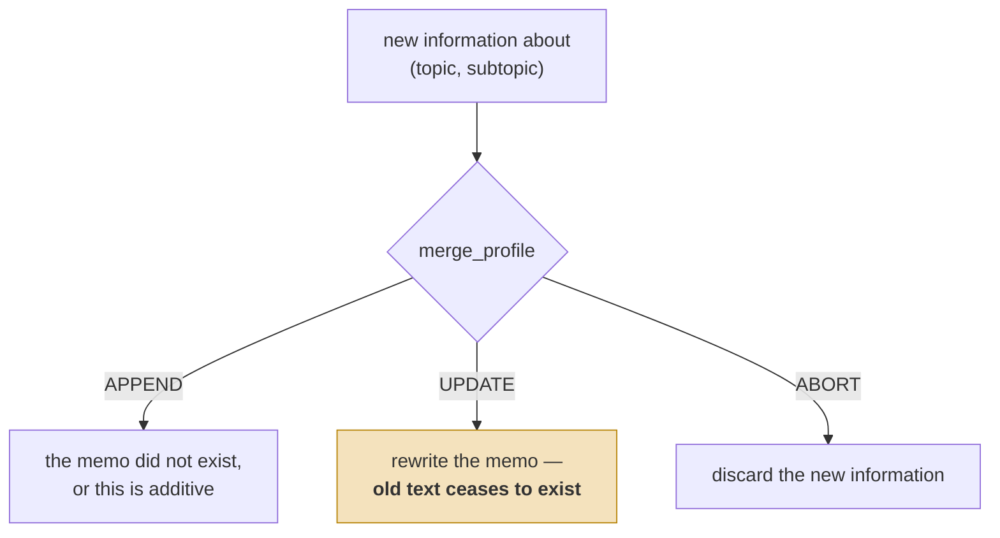
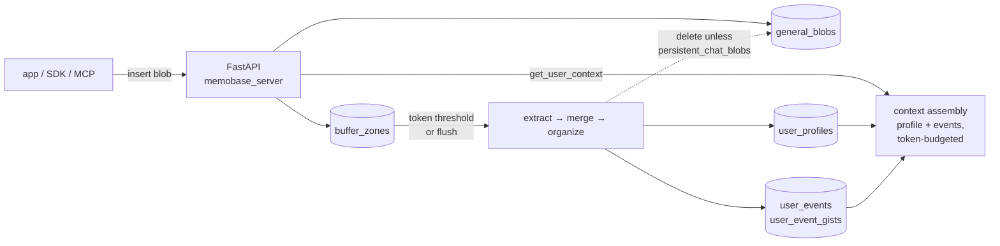

## 1. Executive Summary

Memobase is a user-profile service. You post chat transcripts to it, and it
maintains a compact, topic-indexed set of memos about each user — "basic_info /
name", "interest / books", "psychological / goal" — plus a stream of tagged
events. On retrieval you ask for a *context block* sized to a token budget, and it
returns a rendered profile and a selection of events to paste into a system
prompt.

The design commitment is bluntly stated in the code: a memo is capped at five
sentences by prompt instruction, a topic is capped at
`max_profile_subtopics = 15` before a reorganize pass merges it down, and
`max_pre_profile_token_size = 128`. Memobase is not trying to remember what
happened. It is trying to maintain the smallest description of a user that is
still useful, and to make that description cheap enough to inject on every turn.

**What is genuinely good is the scoping.** Every table's primary key is
`(id, project_id)`, every foreign key is the composite `(user_id, project_id)`,
and every index leads with those columns. Scope is not a field someone remembered
to filter on — it is the row's identity, so writing a query that crosses a tenant
boundary takes effort. Of the systems in this atlas that enforce scope, this is the
most structural implementation.

**What is weakest is that nothing survives a bad extraction.**
`persistent_chat_blobs` defaults to `False`, and on buffer flush the source chat
blobs are hard-deleted from Postgres
(`src/server/api/memobase_server/controllers/buffer.py:211`). The profile is a
string that an LLM rewrites in place. There is no prior value, no supersession
record, no confidence, and no evidence to re-derive from. If the extractor gets a
user's job wrong, the wrong answer is the only answer the system has ever had.

## 2. Mental Model

A memory in Memobase is a **memo**: a short piece of free text filed under a
`(topic, subtopic)` pair, with the whole set constituting the user's profile.

```text
UserProfile
  content     TEXT     -- the memo, ≤ 5 sentences by prompt instruction
  attributes  JSONB    -- {topic, sub_topic, ...}

UserEvent       event_data JSONB, with event_tags
UserEventGist   gist_data JSONB + embedding — the searchable unit
UserStatus      typed attributes
GeneralBlob     the raw material — deleted after processing by default
BufferZone      blobs awaiting processing
```

The life of a memo is a three-way decision made by one LLM call, and the
vocabulary comes straight from
`src/server/api/memobase_server/prompts/merge_profile.py`:



Three verdicts from one model call. `UPDATE` is the lossy one: the memo is
rewritten and the previous wording is gone, so a wrong merge cannot be walked
back.

That is the entire epistemic model, and both of its ends are worth naming. `ABORT`
discards *incoming* information with no record that it was seen — so a fact the
extractor judged valueless cannot be recovered or reconsidered. `UPDATE` discards
*existing* information by overwriting the string, and the prompt actively
encourages it: "also think about whether there are other parts of the current memo
that can be simplified or removed."

Memory is **background-managed and application-triggered**. The application posts
blobs; everything else happens on the server's schedule. A developer can write
profiles directly through the API, but nothing in the system distinguishes a memo
a human wrote from one the extractor produced.

There is one place the system knows time matters and declines to model it. The
merge prompt instructs: "Preserve time annotations from both old and new memos
(e.g.: XXX[mentioned on 2025/05/05, occurred in 2022])." That is *exactly* the
distinction [bi-temporal fact validity](../../patterns/bi-temporal-fact-validity/)
is about — when it was said versus when it was true — and it lives inside a text
string, maintained by asking a language model nicely, queryable by nothing.

## 3. Architecture



- **Runtime** is a single FastAPI service plus Postgres with `pgvector`. Redis
  appears for buffer coordination. There is no queue broker and no separate worker
  image — background work runs in-process off the API
  (`controllers/buffer_background.py`).
- **Clients** are first-class and plural: Python, TypeScript (npm and JSR), Go, an
  MCP server under `src/mcp/`, and an OpenAI-compatible wrapper
  (`assets/openai_memory.py`) that transparently adds memory to chat completions.
- **Configuration** is a single `config.yaml`, with worked examples committed under
  `src/server/api/example_config/` for education, companion and assistant profile
  schemas — a better onboarding story than most of this atlas.

### Deployment and ergonomics

One service and one database. That is a genuinely modest ask, and materially
cheaper than [MIRIX](./mirix/)'s four containers for a comparable job.

An LLM key is required to store anything durable — blobs land without one, but
nothing becomes a profile until the extractor runs, so an outage means the buffer
grows and recall returns the last flushed state. There is no
[zero-LLM capture](../../patterns/zero-llm-capture/) path.

The store is human-readable and repairable by hand: profiles are rows of text in
Postgres, and the profile API supports direct add, update and delete. That is a real
operational advantage over graph-shaped systems. What you cannot repair by hand is a
bad extraction whose source blob has already been deleted.

## 4. Essential Implementation Paths

**Capture** — `api_layer/blob.py` → `controllers/blob.py`. A blob is written to
`general_blobs` and an entry to `buffer_zones` with its `token_size`. The write
returns immediately; nothing has been extracted yet.

**Flush** — `controllers/buffer.py`. The buffer is processed when accumulated
tokens exceed `max_chat_blob_buffer_token_size` (default 1024) or when
`buffer_flush_interval` (default `60 * 60` — one hour) elapses;
`max_chat_blob_buffer_process_token_size` (16384) caps a single processing batch.
On success the buffer rows are marked `BufferStatus.done` and, unless
`CONFIG.persistent_chat_blobs` is set, the source blobs are deleted (line 211).

**Extraction and merge** — `controllers/modal/chat/`: `extract.py` → `merge.py`
(or `merge_yolo.py`) → `organize.py` → `event_summary.py`. The prompts are
separate and readable: `prompts/extract_profile.py`, `prompts/merge_profile.py`,
`prompts/merge_profile_yolo.py`, `prompts/organize_profile.py`,
`prompts/event_tagging.py`, each with a Chinese counterpart (`zh_*`).

**Retrieval and context assembly** — `controllers/context.py:115`,
`get_user_context()`. It splits the caller's `max_token_size` by
`profile_event_ratio`, then runs `get_user_profiles_data()` and
`get_user_event_gists_data()` **in parallel** via `asyncio.gather`, and renders
both through a language-specific prompt pack.

**Update/delete** — `api_layer/profile.py` exposes `get_user_profile`,
`add_user_profile`, `update_user_profile`, `delete_user_profile` and
`import_user_context`. Profile reads filter on `UserProfile.user_id` and
`UserProfile.project_id` (`controllers/profile.py:212`).

**Schema** — `models/database.py`: `Project`, `User`, `GeneralBlob`, `BufferZone`,
`UserProfile`, `UserEvent`, `UserEventGist`, `UserStatus`.

## 5. Memory Data Model

The scoping model is the thing to study. `UserProfile.__table_args__` is
representative:

```python
PrimaryKeyConstraint("id", "project_id"),
Index("idx_user_profiles_user_id_project_id", "user_id", "project_id"),
ForeignKeyConstraint(
    ["user_id", "project_id"], ["users.id", "users.project_id"],
    ondelete="CASCADE", onupdate="CASCADE",
),
```

`project_id` is in the primary key, in every index and in every foreign key. Every
other memory table follows the same shape. The consequence is that
[scope as a first-class key](../../patterns/scope-as-a-first-class-key/) is not a
discipline the developers have to maintain — the schema will not let them forget
it, and a cascade delete of a project actually removes its memory rather than
orphaning it.

What the model does *not* have is anything above the string. `UserProfile` is
`content TEXT` plus an `attributes` JSONB carrying topic and subtopic. There is no
validity-versus-record time distinction, no version, no `superseded_by`, no source
pointer back to the blob it came from, no confidence, and no status. A search
across `models/` and `controllers/` for `tombstone`, `rejected`, `trust`,
`confidence`, `valid_from`, `audit`, `approve` or `review` returns nothing.

Events are better provenanced than profiles: `UserEventGist` carries an `event_id`
foreign key back to the `UserEvent` it summarizes, plus its own `embedding`. So the
gist — the retrievable unit — can always be traced to the full event. Profiles get
no equivalent link, which is backwards: the profile is the thing most likely to be
wrong.

## 6. Retrieval Mechanics

Two retrieval paths, deliberately different, assembled together.

**Profiles are not searched, they are selected.** `get_user_profiles_data()` takes
`prefer_topics`, `only_topics`, `topic_limits` and `max_subtopic_size`, and fills a
token budget. This is the right call for a profile: you want the same stable
description every turn, not a similarity-ranked sample of it that changes depending
on what the user just said.

**Events are searched**, by tag filter (`has_event_tag`, `event_tag_equal`) and by
gist embedding against `event_similarity_threshold`, restricted to
`time_range_in_days`.

The split is governed by `profile_event_ratio`, asserted at the top of
`get_user_context()` to lie in `(0, 1]`, and the two halves are fetched
concurrently. `fill_window_with_events` lets the event half absorb whatever the
profile half did not use.

This is one of the better context assemblies in the atlas, for a specific reason:
the token budget is a parameter of the retrieval call rather than a truncation
applied afterwards. Most systems here return *k* rows and let the caller discover
the size.

The failure modes are the ones the design accepts. A capped profile cannot
represent a user with many stable traits; `only_topics` will silently starve a
question whose answer sits in an excluded topic; and because profiles are selected
rather than searched, a memo that is present but filed under an unexpected subtopic
is unreachable by relevance.

## 7. Write Mechanics

The write path is **buffered, batched and rewriting**.

Buffered: `POST` a blob and it lands in `general_blobs` and `buffer_zones`
immediately. Nothing is retrievable from it yet.

Batched: the buffer flushes at 1024 accumulated tokens or after one hour. For a
low-traffic user this is the operative number — **a fact stated now may not be
recallable for an hour.** The atlas's [benchmarks page](../../benchmarks/) notes
that the lag between writing and being able to recall is measured nowhere; Memobase
is the clearest instance in the corpus, because the lag is not an emergent property
but a documented default with a name.

Rewriting: `merge_profile` returns `APPEND`, `UPDATE\t[UPDATED_MEMO]`, or `ABORT`,
parsed on an `llm_tab_separator` (`::`). `UPDATE` carries the complete new memo, and
the controller writes it over the old `content`. Nothing checks that the rewrite
retained the facts the old memo held, which is the check the atlas's
[structural-loss guard on generated
rewrites](../../compare/#structural-loss-guard-on-generated-rewrites) exists for.

A second rewriting pass, `organize_profile`, fires when a topic exceeds
`max_profile_subtopics` (15) and merges subtopics into fewer, broader ones. Its
committed few-shot example shows eleven subtopics collapsing into two — the
compression is aggressive by design.

`profile_strict_mode` constrains extraction to the configured topic list, which is a
genuine governance knob: with it on, the extractor cannot invent a schema.

### Operational cost

- **Synchronous?** No. Blob insert returns before extraction.
- **Lag?** Bounded by `buffer_flush_interval`, default **one hour**, or by 1024
  accumulated tokens, whichever comes first. This is the atlas's clearest committed
  answer to a question it says nobody answers.
- **Whole-store passes?** No global pass. `organize_profile` rewrites one topic at a
  time when it crosses the subtopic cap, so cost scales with churn rather than with
  corpus size — a better shape than the nightly-everything designs elsewhere in this
  atlas.
- **Read path?** Explicitly budgeted by `max_token_size` and split by
  `profile_event_ratio`. Because the profile block is stable across turns and
  injected at the front, it is friendlier to prompt-prefix caching than a
  similarity-ranked block would be.

## 8. Agent Integration

Integration is the strongest non-memory part of this project. Four clients (Python,
TypeScript, Go, MCP), an OpenAI-compatible drop-in wrapper, and committed example
configs for three product shapes. The MCP server under `src/mcp/` is what you would
wire into an agent host.

Model agency over memory is **low**, and this is a design choice rather than an
omission. The agent does not call `remember` or `forget`. The application posts
transcripts and asks for a context block; what is worth keeping is decided by
server-side prompts under a configured topic schema. For a product team that wants
consistent user modelling across many conversations, that is the right allocation.
For an agent that should be able to act on "forget that", it is the wrong one —
there is no tool for the model to reach.

## 9. Reliability, Safety, and Trust

Uncertainty cannot be represented. A memo is a string; the merge prompt says "Never
make up content not mentioned in the input" and that is the whole defence.

Prompt injection has a direct route to persistence: text in an ingested transcript
is what the extractor reads, and a message crafted to look like a stated user
preference will be filed as one. With `profile_strict_mode` off it can also create
new subtopics. Nothing downstream marks a memo as model-derived.

Multi-tenancy is strong, for the structural reason in section 5. Deletion of a
project or user cascades properly through every memory table.

Privacy semantics have an unusual shape worth stating plainly, because it cuts both
ways. `persistent_chat_blobs = False` means raw transcripts do not accumulate —
which is a *good* default for a service holding other people's conversations, and
several systems in this atlas would be better off with it. It is simultaneously the
reason the system cannot repair itself: the profile is a lossy derivation and the
source is gone, so the atlas's [evidence before
belief](../../patterns/evidence-before-belief/) pattern is not merely unimplemented
here but deliberately inverted. Both readings are correct; which one matters depends
on whether you fear leaking transcripts more than you fear an unfixable profile.

The remaining data-loss risk is the buffer. Blobs sit in `buffer_zones` awaiting a
flush, and extraction runs in-process off the API service. A failure mid-flush is
handled by the session rollback, but what happens to a half-processed batch across a
restart was not traced.

## 10. Tests, Evals, and Benchmarks

Server tests are `src/server/api/tests/`: `test_api.py`, `test_controller.py`,
`test_db.py`, `test_chat_modal.py`, `test_summary_modal.py`. Client suites exist for
Python, TypeScript and Go. Coverage is real but shallow on the parts that matter —
the tests exercise API shape, filter correctness and event tagging, not extraction
quality or merge behaviour under contradiction.

`test_controller.py` contains assertions that *look* like negative retrieval
assertions and are not, and the distinction is worth recording because it is where
the atlas's rubric earns its strictness. Lines 347–361 assert that filtering by a
non-existent tag, or by `emotion=angry` when no event carries it, returns zero
events. No particular material is being excluded — the filter simply has no matches.
Compare [MIRIX](./mirix/), which creates a specific memory under one scope, queries
under another, and asserts *that memory's id* is absent from the result. The first
tests that a filter does not over-return; only the second asserts that named
material must not be retrieved. **`negative_eval` is withheld.**

There are committed experiments — `docs/experiments/900-chats/` holds a
ShareGPT-derived transcript set — but no scored benchmark results. The survey that
prompted this review reports Memobase on LoCoMo; **no LoCoMo harness or result is
committed to this repository**, so that number is a claim rather than an artifact.

The test I would want: post a fact, flush, post a contradicting fact, flush, and
assert what the profile says and whether anything records that the first value was
ever held. Nothing of that shape exists, and the honest answer from reading the code
is "the second value, and no".

## 11. For Your Own Build

### Steal

- **Put the tenant key in the primary key.** `PrimaryKeyConstraint("id",
  "project_id")` with composite foreign keys throughout is the cheapest way to make
  a scope leak a schema error rather than a code-review responsibility. It costs
  nothing at design time and cannot be retrofitted cheaply.
- **Make the token budget a parameter of retrieval, not a truncation after it.**
  `get_user_context(max_token_size, profile_event_ratio)` lets the caller say what it
  can afford and lets the assembler decide what fits. Returning *k* rows and hoping
  is the common alternative, and it is worse.
- **Select profiles; search events.** Stable user description and episodic recall
  want different retrieval, and running them concurrently against one budget is a
  clean way to express that.
- **Ship worked config examples.** Three committed profile schemas for three product
  shapes do more for adoption than a page of documentation, and they make the
  topic-schema idea legible.

### Avoid

- **Do not let an LLM rewrite the only copy.** `UPDATE\t[UPDATED_MEMO]` overwrites
  the memo with a regenerated string and nothing checks what was lost. If you must
  regenerate, keep the previous version, or assert that the new one still contains
  the facts you can enumerate.
- **Do not delete the evidence and keep only the derivation.** Whichever way you
  resolve the privacy tension in section 9, resolve it *knowingly* — a default that
  discards source material is a decision that the profile can never be repaired, and
  it does not look like one in a config file.
- **Do not put a temporal distinction inside a text field.** "[mentioned on
  2025/05/05, occurred in 2022]" is two columns wearing a disguise. It cannot be
  filtered, sorted or corrected, and it survives only as long as the next rewrite
  chooses to copy it.
- **Do not let `ABORT` be silent.** Discarding incoming information is a decision;
  if nothing records that it happened, nobody can audit what the extractor refused.

### Fit

Memobase suits a product team building a *personalized consumer application* —
companion, tutor, assistant — that wants a stable user description injected on every
turn at a predictable token cost, with one service and one database to run. Within
that brief it is well-judged: the caps are deliberate, the config surface is small,
the client story is unusually complete, and the scoping is the best in this atlas.

It is the wrong choice wherever the memory needs to be *accountable*. Anything that
must answer "why do you believe that?", "where did that come from?" or "forget that
permanently" has nowhere to stand here — the evidence is deleted, the provenance is
absent, and correction is a rewrite. That is not an oversight to be patched; it
follows from the decision to keep the profile small and cheap, and reversing it
means a different data model.

Walk away if your users can dispute what the system believes about them and expect
the dispute to stick.

## 12. Open Questions

- **What does `profile_validate_mode` do?** It is declared in `env.py` (line 118,
  default `True`) and again in the per-project config override, and no other
  reference to it was found in the server package. Either it is dead configuration
  or it is consumed somewhere the search missed.
- **What happens to a half-processed buffer across a restart?** `BufferStatus` has
  the states; the recovery path was not traced.
- **Does `merge_profile_yolo` skip the merge decision entirely?** The name and the
  separate prompt suggest a faster, less careful path; which deployments use it was
  not established.
- **Is there a retention or decay policy for events?** `time_range_in_days` bounds
  *retrieval*; no pruning of `user_events` was found.
- **Do the hosted playground and the OSS server behave identically on profile
  updates?** The atlas can only speak to the committed code.

## Appendix: File Index

**Storage/schema** — `src/server/api/memobase_server/models/database.py`,
`build_init_sql.py`, `alembic.ini`

**Write path** — `controllers/blob.py`, `controllers/buffer.py`,
`controllers/buffer_background.py`,
`controllers/modal/chat/{extract,merge,merge_yolo,organize,event_summary}.py`

**Prompts** — `prompts/extract_profile.py`, `prompts/merge_profile.py`,
`prompts/organize_profile.py`, `prompts/event_tagging.py`,
`prompts/user_profile_topics.py`

**Retrieval / context assembly** — `controllers/context.py`,
`controllers/profile.py`, `controllers/event.py`, `controllers/event_gist.py`,
`prompts/chat_context_pack.py`

**API/SDK** — `api_layer/{blob,profile,event,user,project,context}.py`, `src/mcp/`,
`src/client/`, `assets/openai_memory.py`

**Config** — `memobase_server/env.py`, `example_config/`

**Tests** —
`src/server/api/tests/{test_api,test_controller,test_db,test_chat_modal}.py`,
`src/client/tests/`
