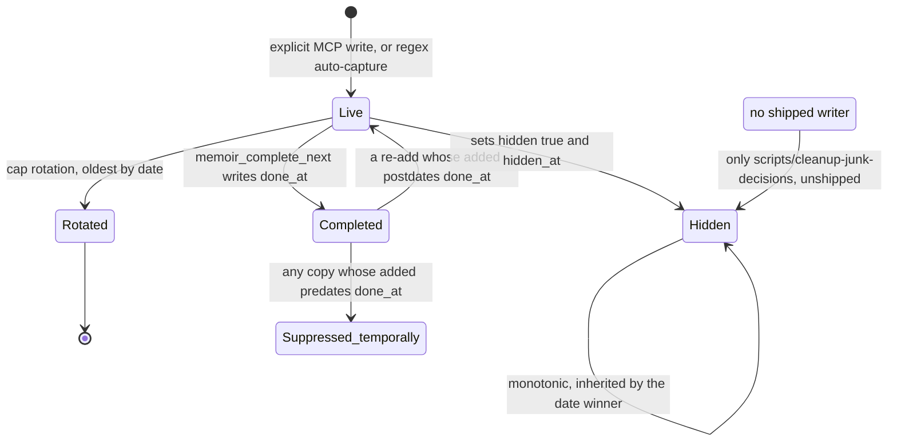

## 1. Executive Summary

memoir is an MCP memory server — 11,932 lines of JavaScript across 63 files,
MIT, 111 commits since 3 March 2026 — whose premise is that tool-native memory
is a lock-in problem. Claude Code, Cursor and Copilot each remember you in one
format on one machine; memoir federates over all of them, syncs the result
between machines with client-side AES-256-GCM, and publishes the on-disk shape
as [an open format spec](https://github.com/camgitt/memoir/blob/2c1fe382b9c24289624f9f0329f378ab2d2aa653/docs/SPEC.md)
so the accumulated context is not trapped in memoir either.

**The spec is the reason to read this repository.** It is 615 lines defining six
entry types, a session working set, and — section 5 — normative merge semantics
whose preamble states the standard the rest of the atlas should be held to:
*"Every rule here exists because its absence produced a real data-loss or
data-resurrection bug in production."* The rules are correct. Union by
normalized text so a merge never drops what the other side lacks; newest-wins
per identity; and, because plain removal cannot survive union-merge, two classes
of tombstone with an argued difference between them. A suppressed decision gets
an **absolute** tombstone that is monotonic and **date-independent** — if either
side of a merge carries `hidden: true`, the result does, whatever the dates say
— because *"suppression must be monotonic or it is not suppression."* A
completed next action gets a **temporal** tombstone, because a re-add whose
`added` postdates the `done_at` is a deliberate revival and must survive.
*"Implementations MUST NOT substitute one class for the other."*

The implementation matches the spec, and its comments carry the same forensic
habit: `unionByText` re-applies a tombstone from the losing copy in eight lines
with fourteen lines of comment naming the resurrection bug, and the cap logic
partitions tombstones out of the visible budget because they *"keep their
original (recent) date"* and were winning cap slots from real entries.

**And nothing in the shipped product can create an absolute tombstone.** The
only assignment of `hidden = true` outside the merge function is
`scripts/cleanup-junk-decisions-2026-07.mjs`, a dated one-off whose own header
says *"NOT wired into any CLI command or package.json script"*, whose match
strings are placeholders a human is expected to fill in, and which is absent
from `package.json`'s `files` array and therefore from the npm package
entirely. Three read paths filter `hidden`, the validator enforces its
invariant, a test suite asserts its exclusion across three surfaces, and the
spec makes it normative for Full conformance. No user can produce one.

Elsewhere the engineering is uneven in an ordinary way. The secret scanner is 27
patterns deep and its per-pattern length floor exists because a global floor of
eight characters let `password: s3cr3t` through into a backup. The file lock is
a correct `wx` create-exclusive with stale recovery and a comment explaining
that tmp-then-rename prevents torn writes but not lost updates. Against that,
retrieval is a substring count with no index and a `$HOME` crawl on every query,
provenance for an auto-captured decision is a prefix on a prose field, and
`cleanupOldBackups` gives a paying user a retention cap of 50 where a free user
gets 100.

## 2. Mental Model

memoir holds two kinds of memory with different lifecycles, and the split is the
design.

**Entry files** are the cold half: one memory per markdown file with YAML
frontmatter, typed as `fact`, `preference`, `decision`, `lesson`, `goal` or
`next_action`. The type answers *"what should a tool do with this when it
loads?"* — inform, constrain style, prevent relitigation, change behavior,
orient, or resume. Two types carry real structure. A `decision` is expected to
carry `why` and `rejected`, on the argument that *"we use Postgres" is trivia;
"we use Postgres because X, and we rejected SQLite because Y" is experience*;
neither is a validation error, because auto-capture legitimately lacks them, but
a validator warns. A `lesson` **requires** `trigger` and `how_to_apply` — *"or
it is an anecdote, not a lesson"* — with `fired_count` and `last_fired` reserved
for a feedback loop that no shipped code writes.

**The session working set** is the hot half: goals, next actions, open
questions, completed actions and recent decisions in one JSON document, each
list capped, each item identified by its normalized text.

A memory becomes durable by being written — there is no candidate state, no
verification, no confidence. It stops being one in exactly three ways. It
**rotates off** the end of a cap, oldest by date. It is **completed**, which
moves a next action into `completed_actions` as a temporal tombstone. Or it is
**suppressed**, which sets `hidden: true` on a decision and keeps the row so the
tombstone keeps propagating.

The interesting epistemics are entirely in how those last two survive a merge,
because a store replicated across machines has no other way to delete. Under
union-by-identity, removal is not a state — any replica still holding the item
re-unions it on the next merge. So a removal must be a *record*, and that record
must be monotonic, and the spec is unusually clear about why the two classes
cannot be collapsed: a suppressed decision text is junk forever, while finished
work can legitimately recur.

Provenance is thin, and the one place it exists is a prefix rather than a field.
`push.js` calls `addNote(text, { why: \`auto-captured: ${context}\` })`, so a
regex-extracted decision is distinguishable from a user's own only by
string-matching the beginning of a prose rationale that is otherwise meant to
hold the reason. The extractor's own `type` — `rename`, `tech`, `design`,
`stack`, `user-note` — does distinguish them, and is discarded before the write.

## 3. Architecture

There is no server and no database. memoir is an npm package (`memoir-cli`)
exposing three binaries — a CLI, an MCP stdio server, and an alias — installed
by `npx memoir-cli`, which detects host tools and writes their MCP
configuration.

The storage picture is the unusual part: **memoir owns almost none of the memory
it manages.** `src/adapters/index.js` defines eleven adapters, each pointing at a
host tool's own directory — `~/.claude`, `~/.gemini`, `~/.codex`, the Cursor,
Windsurf, Zed, Cline and Continue.dev user directories, and Aider's dotfiles in
`$HOME`. Reads walk those trees for `.md`, `.json`, `.yml` and `.yaml`; writes go
back into them. What memoir keeps for itself is three files:

- `~/.config/memoir/session.json` — the working set, schema version 1, written
  tmp-then-rename inside a lock.
- `~/.config/memoir/events.jsonl` — an append-only activity log, rotated at 5 MB
  through two generations.
- Ciphertext in a Supabase storage bucket, when cloud sync is configured.

The spec is candid about the gap between its own model and this: it defines a
memoir store as a directory of entry files plus a session file, then notes the
reference implementation *"currently keeps these in two places for
tool-compatibility reasons."* The consequence is worth stating plainly — a
reader who adopts the format gets one store, while a user who installs the CLI
gets a federation over up to eleven of somebody else's, none of which memoir
controls the lifecycle of.

Retrieval has no stack at all. `searchMemories` reads every file from every
adapter on every query, scores by how many query terms appear anywhere in the
content, then crawls `$HOME` to depth 3 for `CLAUDE.md`, `GEMINI.md`,
`CHATGPT.md`, `.cursorrules`, `.windsurfrules` and `.clinerules`, skipping a
hardcoded set of directories. Nothing is cached between calls.

Context injection is a marker-delimited block written into four always-loaded
files: `~/.claude/CLAUDE.md`, `~/.cursor/rules/memoir-session.mdc`, Windsurf's
user instructions and `~/.gemini/GEMINI.md`. The injector replaces between
markers and never touches anything outside them.

### Deployment and ergonomics

`npx memoir-cli` and nothing else — no daemon, no database, no API key, no
container. Eight runtime dependencies, all floating carets with a committed
lockfile.

It runs fully local; cloud sync is opt-in and the only thing that degrades
without it is cross-machine merge. The store is markdown and JSON the user can
open, and the spec argues that this is load-bearing rather than a compromise:
*"Memory the user cannot read is memory the user cannot trust or correct"*, and
an implementation *"MUST NOT 'upgrade' the store to a database as the canonical
form."*

Two things an operator should know before installing. Anonymous telemetry is
**on by default** — a shipped PostHog project key, an install UUID, event name,
OS and version, honoring `DO_NOT_TRACK`, `CI` and an opt-out file, disclosed
once. And auto-capture reads Claude Code's raw session transcripts under
`~/.claude/projects/`, which is the most sensitive directory on the machine for
this purpose.

## 4. Essential Implementation Paths

**Merge.** `src/session/state.js:mergeSessions` is the whole of spec section 5.
`unionByText(a, b, dateField, cap)` builds a Map keyed on
`text.trim().toLowerCase()`, keeps the newer item per key by the list's date
field, then makes a second pass re-applying `hidden: true` and its `hidden_at`
onto any winner whose key has a hidden copy on *either* side. It then partitions
before capping — `visible` and `tombstones` sliced separately — so a tombstone
cannot evict a live entry from the visible budget. `unionTombstones` merges
`completed_actions` keeping the newest `done_at` per identity, and
`next_actions` is filtered by `new Date(a.added || 0) > new Date(t.done_at)`.

**Suppression, read side.** Three independent filters, each commented as a
tombstone check: `src/session/render.js` before the pinned block is built,
`src/commands/why.js` in both the CLI display and the exported `findDecisions`,
and `src/mcp.js:727` in the `memoir_why` tool handler.

**Suppression, write side.** `scripts/cleanup-junk-decisions-2026-07.mjs:119`.
That is the entire list.

**Auto-capture.** `src/context/capture.js` finds `~/.claude/projects/**/*.jsonl`
modified within seven days, reads at most the trailing 2 MB, and parses
line-delimited JSON into user messages, written and read file paths, bash
commands and error lines — every one passed through `redactSecrets` on the way
in, with a comment noting that captured decisions *"flow into session.json,
CLAUDE.md and the git backup, none of which get a later secret scan."*

**Extraction.** `extractDecisions` runs seven regexes over the combined user and
assistant text for renames, tech choices, design and stack decisions, plus one
user-only pattern for explicit `remember that` / `note that` / `from now on`
instructions, anchored to message or line start and scoped to the first 500
characters. Each refinement carries the false positive that caused it: `going`
was dropped from a bare alternation because *"going on Monday to the office"
minted a decision (live proof: "going on PostDash" in the real store)*, and the
stack pattern requires a capitalized value because *"backend is just throwing it
away" used to leak through*.

**Quality gate.** `isQuality` rejects text under 15 or over 200 characters, with
a pipe (a table cell), with three or more markdown formatting characters, under
three words, starting with a pronoun or filler, containing a question mark, with
unbalanced brackets, or 140+ characters not ending in terminal punctuation. The
last two are truncation signatures: *"real junk: '…only gain is Y)' with no
opener, because the opening '(' was in the text BEFORE the capture started."*

**Write.** `push.js` runs `isQuality` once over the parsed decisions before
either sink, dedupes against the existing decision texts, and calls `addNote`.
The dedupe set is built from `current.current.decisions` unfiltered — which
includes hidden rows — so auto-capture incidentally will not re-assert a
tombstoned decision. `addNote` itself performs no such check.

**Locking.** `src/session/lock.js` uses `fs.openSync(lockPath, 'wx')` as an
atomic create-exclusive, retrying on `EEXIST` at 50 ms up to 5 s, treating a
lock older than 30 s as abandoned, releasing in a `finally`. The header explains
what it is for: `writeSession`'s tmp-then-rename *"only prevents a TORN write;
it does not stop two concurrent processes from both reading the same on-disk
snapshot"*, and two Claude Code sessions against the same `$HOME` each run their
own MCP server.

**Encryption.** `src/security/encryption.js` derives a 256-bit key with scrypt
(N=2¹⁴, r=8, p=1) over a random 32-byte salt, encrypts with AES-256-GCM under a
96-bit IV and 128-bit tag, and prefixes an eight-byte `MEMOIR01` magic for
format versioning. `encryptDirectory` derives once, names each output file by
`HMAC-SHA256(key, relPath)` truncated to 24 hex characters, and encrypts the
hash→path manifest separately.

**Consolidation.** `src/commands/consolidate.js` sends memory files to an LLM
for a duplicate/stale/bloat report, then presents an inquirer checkbox of files
to delete and a confirm prompt; nothing is written without `--apply`.

**Validation.** `src/commands/validate.js` checks both file kinds against the
spec by section number, including `hidden: true without hidden_at — tombstones
must carry when they were set (SPEC.md 5.3.1)`.

## 5. Memory Data Model

There is no schema in the database sense. An entry is frontmatter plus a body,
restricted to *"a simple YAML subset so that it can be parsed without a full
YAML engine"* — scalars, one level of nesting, simple string lists, with
anchors and block scalars forbidden to writers. Two JSON Schemas
(`schema/entry.schema.json`, `schema/session.schema.json`) are the
machine-readable form.

Common fields are `type` and `name` (required), `description`, `created`,
`updated`, `schema_version`, `project`, `tags`, and an `origin` mapping of
`tool`, `session_id`, `machine_id`. The extension rule is stated as an
obligation in both directions: *"Readers MUST ignore fields they do not
recognize. Writers MUST preserve fields they do not recognize when rewriting an
entry."*

Identity is the load-bearing choice and it is deliberately weak: a session item
is identified by its **normalized text**, whitespace-trimmed and case-folded; an
entry file by its filename. There is no stable id. That makes merge simple and
makes a reworded memory a different memory — an edit from "Use Postgres" to "Use
Postgres 16" produces two live entries rather than one corrected one, and a
tombstone on the first does not reach the second.

Temporal fields are per-type and single-axis: `created`/`updated` on entries,
`date` on decisions, `set_on` on goals, `added` and `done_at` on next actions,
`asked` on questions, `hidden_at` on tombstones. `done_at` versus `added` is a
comparison of two record times rather than validity against transaction time.

Scoping exists in the format and not in the read path. `project` is defined
("absent means global"), `preference` carries `scope: global | project`, and
`memoir_remember` writes project-level files — but `searchMemories` applies no
project filter to anything. Profiles are sync destinations: a profile config is
`{ provider, localPath }`, not a memory partition. There is no user, tenant or
auth boundary; the store is one person's files.

`machines` is the one identity that is done properly — a stable per-machine UUID
paired with a mutable human label, with the spec noting that *"Labels may
change; UUIDs MUST NOT."*

## 6. Retrieval Mechanics

`searchMemories(query)` splits the query on whitespace and, for every file from
every adapter, computes `score = terms.filter(t => content.includes(t)).length`,
keeping anything above zero and sorting descending. `relevance` is that score
over the term count.

This is presence counting, not ranking. A file mentioning a term once outranks
nothing that mentions it fifty times, because frequency is not measured. Nothing
weights the title, the type, recency, or the section a hit lands in — and the
unit returned is the **whole file**, so a 40 KB `CLAUDE.md` that happens to
contain "auth" is returned in full alongside a three-line entry that is about
auth.

Then it crawls. Every query walks `$HOME` to depth 3 looking for six filenames,
skipping a hardcoded list (`node_modules`, `.git`, `dist`, `Library`,
`Downloads` and others), reading and scoring each hit. There is no index and no
cache, so the cost is paid per call and grows with the home directory rather
than with the memory store.

Retrieval is tool-mediated: the model calls `memoir_recall` and decides what to
do with the result. Automatic injection is separate and unranked — the pinned
block is the working set rendered whole, with hidden decisions filtered and
decisions capped at a render limit.

The failure modes follow directly. Over-recall is the default: a common term
matches every file that mentions it. Under-recall is the complement, since
matching is literal substring — "authentication" does not match a memory that
says "auth", and there is no stemming, synonym or embedding path. And because
the pinned block is prepended into files the host loads as part of its standing
context, every working-set change rewrites a prefix the provider was caching.

## 7. Write Mechanics

Writes are **synchronous** and there is no background pass. An MCP tool call
mutates `session.json` inside the lock and returns; a memory is retrievable
immediately because retrieval reads the files. Nothing re-reads or rewrites the
store on a schedule, so there is no token bill that scales with corpus size.

Three write paths. **Explicit tool calls** — `memoir_remember`, `memoir_note`,
`memoir_set_goal`, `memoir_add_next`, `memoir_ask` and the rest — where the
model supplies the content. **Auto-capture** during `memoir push`, which parses
Claude Code's transcripts and mints decisions from regex matches. And **manual
editing**, which the format treats as a first-class path.

Extraction is entirely zero-LLM: seven regexes plus a nine-rule quality gate.
That is the right call for a capture pass that runs unattended and cannot be
reviewed, and the annotations show the cost of getting it wrong being paid
incrementally in production. What it does not do is separate whose sentence
produced the memory. The explicit `remember that` pattern is scanned over user
messages only, but the inferential branches run over user and assistant text
joined, so a model's own *"let's use Redis for the session cache"* mints a
durable decision — the self-reinforcement shape this atlas keeps naming — and
the only trace of it on the record is that `why` begins with `auto-captured:`.

Deduplication is exact-match on lowercased text at the auto-capture call site
and inside `unionByText` at merge; there is no fuzzy or semantic dedup, which is
what `memoir consolidate` exists to do with a model and a human in the loop.

Deletion is the part that is thought through, and section 2 covers the merge
rules. Two implementation details are worth adding. `completed_actions` is
capped at 50 with the spec making the retention requirement normative — the cap
*"MUST be large enough to outlive any stale replica that might still carry the
completed item, or completions resurrect"* — and `visible`/`tombstones` are
sliced separately so tombstones never consume the live budget. On the cloud
side, `cleanupOldBackups` deletes every backup past a cap that is `MAX_BACKUPS_PRO`
(50) for a paying account and `MAX_BACKUPS_FREE` (100) otherwise, so Pro prunes
twice as aggressively as free on a destructive path.

Malicious input has one strong defence and one gap. The strong one: every
model-supplied filename in `memoir_remember` and `memoir_read` is required to be
a bare markdown name with no separator and no `..`, and must resolve inside the
target directory, with the comment naming the attack — *"filename:'.zshrc'
appends to a shell rc (code execution on next shell)."* The gap: nothing scans
or bounds the *content* an MCP tool writes, so a model instructed by a poisoned
file to remember something writes it verbatim into a file the host loads on
every future session.

## 8. Agent Integration

Fourteen MCP tools across three groups: retrieval and storage (`memoir_recall`,
`memoir_remember`, `memoir_list`, `memoir_read`), working set (`memoir_set_goal`,
`memoir_add_next`, `memoir_complete_next`, `memoir_note`, `memoir_ask`,
`memoir_session`, `memoir_why`), and management (`memoir_consolidate`,
`memoir_status`, `memoir_profiles`).

The model has substantial agency: it can write entries into any host tool's
memory directory, add and complete actions, and record decisions. It cannot
suppress one — there is no `memoir_forget` and no tool that sets `hidden`. The
asymmetry is the whole finding of this report restated as an API surface: an
agent can add to memory and cannot retract from it.

Automatic injection is the second surface. The pinned block goes into four
always-loaded files, which means the working set reaches the model whether or
not it calls a tool, and `memoir_recall` is for everything else.

Adapting to another host is a data change rather than a code change — an adapter
is a name, an icon, a source directory and a filter — which is why eleven tools
are supported in 959 lines. The MCP server writes all output to stderr so it
cannot corrupt JSON-RPC on stdout, which is a small thing that many MCP servers
in this atlas get wrong.

## 9. Reliability, Safety, and Trust

Concurrency is taken seriously and the reasoning is written down. The lock covers
the whole read-mutate-write cycle rather than the write, the event log gets its
own dedicated lock rather than borrowing whichever lock a caller happens to hold,
and `appendEvent` is pure `O_APPEND` so *"a crash mid-write can at worst leave a
truncated LAST line, never corrupt earlier ones."* Stale-lock recovery at 30 s is
an explicit availability-over-exclusion trade, argued for a single-user tool.

Privacy has two real mechanisms. The event log declares an invariant in its
header — *"NEVER log raw decision/note/goal TEXT content — only counts, ids,
booleans"* — and the call sites honor it (`decision_captured` records
`{ has_why, has_rejected }`). And the secret scanner runs on every untrusted
input during capture, over 27 patterns covering modern token prefixes,
connection strings, environment assignments, private keys and JWTs, with a
per-pattern length floor that exists because a global floor of eight discarded
the six-character matches the password pattern was written to catch.

Encryption is textbook and correctly parameterized for the primitives it uses.
Two notes rather than faults: scrypt at N=2¹⁴ is at the low end of current
guidance for a passphrase KDF, and the same derived key is used both as the
AES key and as the HMAC key that hashes filenames, where separate derived
subkeys would be the conservative construction.

The version story is the strongest safety argument in the spec, and it is
implemented. Forward-incompatible data must be **quarantined, not guessed**: an
implementation meeting a newer version *"MUST NOT attempt to interpret the
data"*, must back up the original and degrade to an empty-but-valid state, and
*"a degraded read MUST contribute nothing to a merge rather than contribute a
misreading."* The stated reason is exactly right — *"A newer schema's fields may
have semantics — tombstones especially — that an old reader would destroy by
'mostly understanding' them."*

Three weaknesses. **Uncertainty cannot be represented**: there is no confidence,
no trust state, no verification, and an auto-captured guess and a user's
deliberate instruction are the same shape of row. **Provenance is a prose
prefix**, so any consumer that wants to weight the two differently must
string-match. And **the tombstone has no writer**, which means the one correction
primitive the design argues hardest for is unavailable to the person whose
memory it is.

## 10. Tests, Evals, and Benchmarks

Seventeen suites — fifteen Node, two bash — run by an aggregating runner that
*"runs every suite regardless of individual failures (the old `&&` chain
short-circuited and masked co-occurring failures)"* and skips the bash suites on
Windows. Coverage is memory-specific: session state and merge, cross-machine
sync end to end, schema migration, the session lock, secret scanning,
encryption, the MCP contract over real stdio, capture quality, auto-activation,
tidy, and hidden decisions.

`test-decisions-hidden.mjs` is a **negative retrieval assertion** done properly:
it asserts the non-hidden decision is present and the hidden one absent at three
independent surfaces — the exported `findDecisions`, the `memoir why` CLI's
captured stdout, and a real stdio call to the `memoir_why` MCP tool. It then
tests the cleanup script itself: that `--dry-run` leaves the file byte-identical
and creates no backup of any timestamp, that real mode tombstones exactly two
decisions and writes a backup, and that the backup matches the original byte for
byte.

The runner's best idea is a **real-state tripwire**. Tests must run against a
scratch `$HOME`, and on 13 July 2026 one suite imported a `./src` module before
shimming it — `state.js` binds its paths from `os.homedir()` at module load — so
the fixture write landed on the developer's real `session.json` and destroyed
live data *"(twice, before it was caught)"*. The per-file fix was to shim first;
the backstop is a generic guard that scans the real `session.json` for known
fixture strings after every suite. It matches fixture markers rather than
diffing, because a concurrent `memoir push` from another Claude Code session can
legitimately rewrite the file mid-run and a hash compare would false-positive.

What is missing is any measurement of the thing the product claims. There is no
retrieval-quality eval — no fixture corpus with expected hits, no precision or
recall number, nothing that would notice if the substring scorer got worse. The
README's comparison table against claude-mem, basic-memory and mem0 is sourced
to *"public docs, June 2026"* and is a feature-matrix claim rather than a
measured one, which it says. And the `fired_count` / `last_fired` feedback loop
the spec reserves for lessons has no writer, which the spec labels as roadmap
rather than shipped.

One artifact contradicts the tree it ships in: `server.json`, the MCP registry
manifest, declares version 3.2.2 while `package.json` is at 3.11.3.

## 11. For Your Own Build

### Steal

**Write the merge rules down, and cite the bug beside each one.** The single
most useful property of this spec is that every normative sentence in section 5
is traceable to a production failure. A merge algorithm whose rules are
justified only by symmetry arguments will get relaxed by the next contributor
who finds one inconvenient.

**Under union-merge, removal must be a record, and the record must be
monotonic.** If either replica carries the suppression, the merged result
carries it, *regardless of which copy has the newer date* — because tombstoning
does not touch the item's date, so the tombstoned copy usually loses the
recency comparison. Get this wrong and every un-synced machine resurrects the
item, forever.

**Split the tombstone into absolute and temporal, and refuse to substitute
one.** A suppressed claim is junk permanently; a completed task can legitimately
be added again. One class cannot serve both, and the discriminator is cheap: a
re-add whose timestamp postdates the completion is a revival, not a straggler.

**Size the tombstone retention against your slowest replica, and keep tombstones
out of the visible cap.** Both rules are one line of code and both were bugs
here first: a tombstone that rotates off resurrects the item, and a tombstone
that competes for cap slots evicts a live memory while doing it.

**Quarantine forward-incompatible data instead of interpreting it.** An old
reader that "mostly understands" a newer schema is exactly how a tombstone gets
dropped and a deletion undone. Degrade to empty, keep the original, and
contribute nothing to a merge.

**Ship a tripwire that checks your real state after every test run.** Not a
fixture, not a mock — a guard that looks for test-fixture signatures in the
developer's live store. Match markers rather than diffing, so a concurrent
legitimate write does not false-positive.

**Put the whole read-mutate-write cycle in the lock.** Atomic rename prevents a
torn file and does nothing about two processes reading the same snapshot. If
your agent harness can run two sessions against one home directory — and it can
— this is a live data-loss bug, not a theoretical one.

**Guard model-supplied filenames as paths, not as strings.** Bare name, no
separator, no `..`, and resolve-then-assert-containment. The concrete attack is
worth naming in the comment so nobody relaxes it.

### Avoid

**Do not let provenance live as a prefix on a prose field.** `why:
"auto-captured: …"` means every consumer that wants to treat a regex guess
differently from a user's instruction has to string-match, and the moment a user
writes a rationale beginning with those words the distinction is gone. The
extractor here already computes a type and throws it away before the write —
one more field would have carried it.

**Do not mint memories from the assistant's own text on an inferential path.**
The explicit-instruction pattern is correctly scoped to user messages; the
rename, tech, design and stack patterns are not, so the model's own suggestion
becomes a durable decision. If both sources must feed one extractor, record
which one produced each row.

**Do not ship a correction primitive with no way to invoke it.** The suppression
mechanism here is specified, implemented, filtered, validated and tested, and no
user can create one. A capability that exists everywhere except the API is
indistinguishable, from the outside, from one that was never built.

**Do not identify a memory by its text alone.** It makes merge trivially
correct and correction structurally impossible: a rephrase is a new memory, and
a tombstone on the old wording says nothing about the new one.

**Do not crawl the home directory on the read path.** An index that is rebuilt
from files is explicitly permitted by this format — the spec says so — and
nothing here builds one.

### Fit

This suits one person with several machines and several coding tools who wants
their AI's context to follow them and is willing to read markdown when it goes
wrong. That is a real and underserved shape, and the local-first, plain-text,
no-account default is the right answer for it.

It does not suit anything with more than one user, because there is no scope, no
tenancy and no auth boundary anywhere — the store is one person's home
directory. It does not suit a large corpus, because retrieval is an unindexed
substring count over whole files plus a filesystem crawl, and that cost is paid
per query. And it does not suit anyone who needs to be sure a memory is *gone*,
because the mechanism for that is the one thing the product cannot do.

The maintenance budget it assumes is small — 11,932 lines, eight dependencies,
one dominant author — and the code is dense with the kind of comment that makes
a small codebase maintainable by someone else. The format is a separable and
more durable artifact than the implementation: a reader who takes section 5 and
implements it against their own store gets most of the value here without
adopting any of the rest.

## 12. Open Questions

- Was the absent tombstone writer a deliberate deferral or an oversight? The
  cleanup script's header reads as a stopgap for one incident, and the spec
  treats `hidden` as a standing mechanism; nothing in the tree says which was
  intended.
- Is the Pro/Free backup-cap inversion a typo or a policy? Reading the code
  cannot distinguish a swapped constant from an intentional tier design, and
  no test covers `cleanupOldBackups`.
- How does the substring scorer behave on a real store? The Appendix A survey
  describes one of 326 entry files, which is where the ranking would start to
  matter, and no eval measures it.
- Has any second implementation of the format appeared? The spec asks for one
  and a conformance claim would be the test of whether section 5 is
  implementable from the text alone.
- What does the host tool do when memoir writes into its memory directory —
  reindex, ignore until restart, or conflict with its own writer? That needs the
  hosts running, not the repository.

## Appendix: File Index

**Format and schema** — `docs/SPEC.md`, `schema/entry.schema.json`,
`schema/session.schema.json`, `src/commands/validate.js`.

**Merge and tombstones** — `src/session/state.js` (`mergeSessions`,
`unionByText`, `unionTombstones`, `completeNext`, `addNote`),
`src/session/migrations.js`, `scripts/cleanup-junk-decisions-2026-07.mjs`.

**Capture and extraction** — `src/context/capture.js` (`parseSession`,
`extractDecisions`, `isQuality`), `src/commands/push.js`.

**Retrieval and injection** — `src/mcp.js` (`searchMemories`,
`readMemoryFiles`), `src/adapters/index.js`, `src/session/render.js`,
`src/session/inject.js`.

**Concurrency and durability** — `src/session/lock.js`, `src/events/log.js`.

**Security and privacy** — `src/security/scanner.js`,
`src/security/encryption.js`, `src/telemetry.js`.

**Cloud** — `src/cloud/storage.js`, `src/cloud/constants.js`,
`src/cloud/auth.js`, `src/providers/index.js`.

**Human review** — `src/commands/consolidate.js`, `src/commands/tidy.js`.

**Tests** — `run-tests.mjs`, `test-decisions-hidden.mjs`, `test-session.mjs`,
`test-cross-machine.mjs`, `test-secret-scan.mjs`, `test-mcp-contract.mjs`,
`test-capture-quality.mjs`, `test-schema-migration.mjs`, `test-session-lock.mjs`.

## History

**2026-08-19** — [`2c1fe382b9c24289624f9f0329f378ab2d2aa653`](https://github.com/camgitt/memoir/commit/2c1fe382b9c24289624f9f0329f378ab2d2aa653) — re-read seven commits on, and this report's central criticism is closed. It said the absolute tombstone the spec makes normative had no writer any user could reach — the only assignment outside the merge lived in `scripts/cleanup-junk-decisions-2026-07.mjs`, whose own header said it was not wired into any command. Release 3.12.0 ships `memoir forget "substring" [--purge] [--yes]` (`src/commands/forget.js`), which resolves the decision, prints it, states that hiding cannot be undone, and calls `hideDecision` to set `hidden` and `hidden_at`. `--purge` redacts the text while keeping a sha256 identity, and the activate template tells the model to reach for `memoir_forget` when a recorded decision is wrong.

**`tombstone` is carried.** The suppression is keyed on the decision text rather than on a row id, a tombstone is sticky across replicas — *"once any machine marks an entry hidden, the merged"* result keeps it hidden (`src/session/state.js:471`) — and `capDecisions` gives tombstones a budget separate from visible entries, so the record of a retraction is not pruned away with ordinary rows. That is the rejected-value shape the rubric asks for, and it is now reachable.

The residual risk is narrower and is what the row says: the key is the text, so a paraphrase of a hidden decision is a different identity and is not suppressed. All four marks carry evidence records. Separately, the MCP registry manifest that this report recorded as nine minors stale was corrected in `829e914`, with an npm `version` hook added to keep it in step.

**2026-08-13** — [`0ae33bbe94ac381da2cad4f99d50f65351e77a27`](https://github.com/camgitt/memoir/commit/0ae33bbe94ac381da2cad4f99d50f65351e77a27)
— first reading, at v3.11.3. Screened before reading: 1 auto-run surface
(`server.json`, an MCP manifest declaring an npm stdio start command), 2
dependency surfaces changed six days earlier and inside the cooldown, 8 floating
ranges with a lockfile beside them; the `postinstall` script is a `console.log`
banner with no network or filesystem access. Nothing was installed and nothing
was executed.
