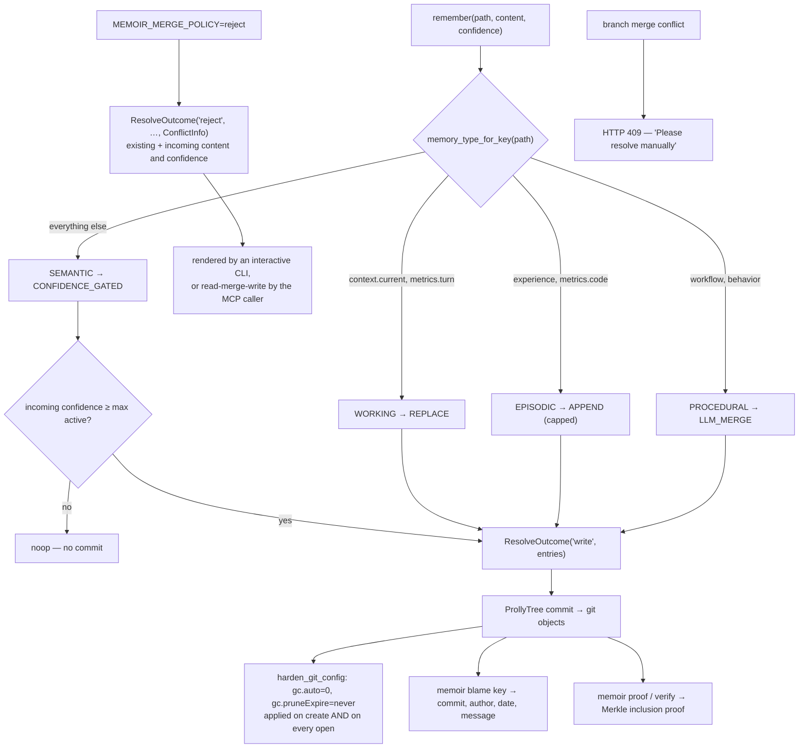

## 1. Executive Summary

Memoir is "Git for AI Memory" — 55,000 lines of Apache-2.0 Python storing
memories at semantic paths (`profile.professional.skills.python`) in a
**ProllyTree** over a git object store, with branch, commit, merge, rollback,
Merkle proofs and `memoir blame`.

**The mechanism worth the report is `src/memoir/services/merge_policy.py`.**

Most systems in this atlas have one answer to "a write landed on an occupied
key": overwrite, or append, or ask a model. Memoir has six, and picks by
**what kind of memory the path implies**:

```python
_TYPE_DEFAULT: dict[MemoryType, ConflictStrategy] = {
    MemoryType.WORKING:    ConflictStrategy.REPLACE,           # transient scratchpad
    MemoryType.EPISODIC:   ConflictStrategy.APPEND,            # ordered event log
    MemoryType.SEMANTIC:   ConflictStrategy.CONFIDENCE_GATED,  # facts / preferences
    MemoryType.PROCEDURAL: ConflictStrategy.LLM_MERGE,         # skills / how-to
}
```

The type comes from the path prefix — `context.current` and `metrics.turn` are
working, `experience` and `metrics.code` are episodic, `workflow` and `behavior`
are procedural, everything else is semantic.

This is the right shape and almost nobody does it. A scratchpad value *should*
be clobbered. An event *should* accumulate. A stated fact should not be
downgraded by a less confident restatement — `CONFIDENCE_GATED` writes only if
the incoming confidence is at least the highest active confidence, and returns
`noop` otherwise. A procedure should be consolidated rather than replaced.
Applying one policy to all four is what produces both the "my agent forgot" and
the "my agent won't stop repeating itself" complaints.

**And the module is pure.** "Everything here is pure — no store, no I/O, no LLM
— so it can be unit-tested in isolation and reused by the CLI, MCP server, and
UI." `LLM_MERGE` is the exception handled by *inversion*: the caller makes the
model call and passes the consolidated text in, so the policy layer stays
side-effect-free and testable.

**The second thing worth reading is `src/memoir/store/git_safety.py`** —
section 9.

## 2. Mental Model

A memory is a value at a path. A path implies a type. A type implies what
happens on collision. The store underneath is content-addressed and versioned,
so every prior value is a commit away and `blame` will tell you who wrote it.



## 3. Architecture

`src/memoir/`: `store` (the ProllyTree adapter, backend resolution, a
cwd-locked tree, git safety), `core/memory.py`, `services` (merge policy, crypto,
watch), `classifier`, `taxonomy`, `search` (keyword and LLM-powered),
`llm`, `cli`, `mcp`, `sdk`, `tui`, `ui`, `integration`, `memento`.

The store implements **LangGraph's `BaseStore` interface**, so it drops into an
existing LangGraph agent rather than requiring one to be built around it.

There is a small piece of engineering honesty in `prolly_adapter.py`: a
`_native_stderr_quiet()` context manager doing an FD-level stderr redirect around
the `VersionedKvStore` open, because prollytree v0.4 prints a scary warning about
a failed root-hash load. Suppressing a dependency's noise is common; documenting
*which version* prints it and *what it says* is not.

35 test files.

## 4. Essential Implementation Paths

**Resolve a collision** — `src/memoir/services/merge_policy.py`
(`ConflictStrategy` `:67-78`, `MemoryType` `:80-87`, `_TYPE_RULES` `:90-98`,
`_TYPE_DEFAULT` `:100-105`, `ConflictInfo` `:108-127`, `ResolveOutcome`
`:129-141`, `apply_strategy` `:285-334`, `read_project` `:337-354`).

**Protect the objects** — `src/memoir/store/git_safety.py` `harden_git_config`.

**Prove and attribute** — `src/memoir/services/crypto_service.py`
(`generate_proof` `:29-96`, `verify_proof` `:100`, `get_blame` `:187`),
`src/memoir/cli/commands/crypto.py` `blame` `:170-218`.

**Search** — `src/memoir/search/intelligent.py` (`store.search(namespace_tuple,
…)` `:305`).

## 5. Memory Data Model

`schema_version: 2` introduces a **timestamped-facet** model: a key holds a list
of dated entries, each with `content`, `confidence`, `timestamp` and a `status`.

Two design notes are worth lifting verbatim:

> "The stored blob always carries a projected top-level
> `content`/`confidence`/`timestamp` (see `project_entries`) so legacy readers
> keep working; `entries` is purely additive."

> "A blob without `schema_version`/`entries` is a valid v1 doc (one implicit
> entry) — `upgrade_blob` lifts it lazily, only on write."

A schema migration with no migration step: v1 documents remain readable, are
upgraded when touched, and the v2 blob keeps a projection old readers still
parse. And `_UPDATE_SEP` is "kept byte-identical to the legacy append behaviour
so projecting two active entries reproduces the old output exactly" — a
compatibility constraint stated as a constant.

`_active(entries)` filters to `status == "active"` and "falls back to all entries
if none are explicitly active", and `read_project` projects only the active set.
The read path is ready for a superseded status. Nothing writes one:
`make_entry(status="active")` is the only producer found, and `apply_strategy`
never demotes an entry — `REPLACE` and `LLM_MERGE` drop prior entries from the
blob entirely, with the comment "prior values survive in git history."

That is the honest position and it is why the `trust_state` mark is withheld
(section 9): the field exists, the reader respects it, and no writer sets it.

## 6. Retrieval Mechanics

Path discovery first — `self.store.search(namespace_tuple, limit=10000)` — then
keyword or LLM-powered ranking over the discovered paths, with an optional
person filter matching a `person.` path prefix.

**Namespace is the scope key and it reaches the query.** It is a tuple prefixed
onto the full key (`":".join(namespace_tuple) + ":" + key`) and it is the first
argument to every `store.search`. In a prefix-ordered tree that is stronger than
a filter — out-of-namespace keys are not in the scanned range at all. The
`scope_enforced` mark is earned.

The claimed advantage over vector stores is O(log n) hierarchical lookup instead
of a similarity scan, which is what a Prolly tree gives you. The cost is that
retrieval depends on the classifier putting a memory at the right path, and the
README is upfront that classification is a separate layer with its own engine
choice.

## 7. Write Mechanics

`apply_strategy` returns one of three actions — `write`, `noop`, `reject` — and
the distinction between `noop` and `reject` is the part to copy. A
confidence-gated write that loses produces `noop`: no commit, no error, nothing
for the caller to handle. A `reject` produces a `ConflictInfo` carrying
`existing_content`, `existing_confidence`, `existing_timestamp`,
`incoming_content` and `incoming_confidence` — "doubles as the signal an
interactive CLI renders and as the payload a read-merge-write caller (MCP/plugin)
inspects before re-issuing the write."

Two different failures, two different shapes, neither of them an exception.

Growth is bounded by `MEMOIR_FACET_MAX_ENTRIES` (default 50, `0`/`none`/`off`/
`unlimited` disables), resolved by one shared helper "so the cap is applied
consistently" by every writer.

## 8. Agent Integration

An MCP server whose `remember` tool exposes `merge_policy` directly — "with
`reject`… the response carries `conflicts` describing the existing value, for
read-merge-write" — plus a CLI, an SDK, plugins documented for Claude Code,
Codex, OpenClaw and Hermes, a TUI, a web UI with a branch view, a watch service,
and PyPI distribution as `memoir-ai`.

The framing in the README is the sharpest statement of the problem in this
corpus:

> "Context contamination happens every time you `git checkout`. Without
> branch-aware memory, your agent tries to apply experimental refactor patterns
> to stable production hotfixes."

And: "Without `memoir blame` or `memoir checkout`, there's no way to audit who
taught the agent a rule or revert a hallucination without wiping the whole
store."

## 9. Reliability, Safety, and Trust

**Scope enforced — awarded**, per section 6.

**Audit log — awarded.** The store is a git object graph, and
`memoir blame <key>` returns, per change, the commit hash, the author, the date
and the message. An append-only record of memory mutations in the system's own
store, with authorship — which is more than most audit tables in this atlas
carry.

**Human review — awarded**, on a narrow basis worth stating precisely: a branch
merge that conflicts returns HTTP 409 with "Merge conflict detected. Please
resolve manually" (`ui/handlers/branch_handler.py:283-285`), which is a person
adjudicating memory content before it takes effect. The `REJECT` /
`ConflictInfo` path is designed for both an interactive CLI and an automated
read-merge-write caller, so it supports the mark rather than establishing it.

**`git_safety.py` is the best short file in this batch.** The hazard:

> "prollytree's Git backend stores tree nodes as *dangling* git blob objects:
> present in `.git/objects/` but not reachable from any branch or tag. Git's
> default garbage collector is free to delete dangling objects when it runs,
> which would silently corrupt memoir's memory data."

The fix: `gc.auto = 0` and `gc.pruneExpire = never`, "called from the store-create
paths and on every store open (idempotent), so the retrofit reaches every
existing memoir store the first time the new memoir version opens it."

And the residual, unprompted:

> "This protects against silent / automatic gc only. An explicit
> `git gc --prune=now` overrides the config and can still prune. The File
> backend (chunks outside `.git/objects/`) is the only fully bulletproof option
> against that case."

A durability hazard named, mitigated, retrofitted to existing installations, and
its remaining exposure stated along with the configuration that closes it. This
atlas has read systems that claimed durability and never went looking for the
process that would eat their data.

**Cryptographic proofs are delegated, not hand-rolled.** `generate_proof` calls
prollytree's `generate_proof` on the full key and returns a base64 Merkle
inclusion proof; `verify_proof` takes an optional `expected_value`. When
versioning is off it returns a structured failure — "Proof generation not
available (versioning may be disabled)" — rather than raising.

**Trust state — withheld**, per section 5.

**Tombstone — no.** `REPLACE` drops prior entries from the blob; they survive in
git history and are recoverable by `blame` or `checkout`, but nothing consults
them on the next write, so a re-asserted wrong value is written again.

**Bitemporal — no.** Entries carry a `timestamp`; no valid-time interval.

**Negative eval — no.**

## 10. Tests, Evals, and Benchmarks

**No paper.** 35 test files, ruff, a Makefile, packaging, a release document.

`benchmarks/locomo/` is a complete, carefully-designed harness against
**LoCoMo-Plus** (Li et al., 2026), and it does several things right at once:

- It uses **the paper's own constraint-consistency LLM judge**, "reused
  verbatim", rather than inventing a rubric.
- It runs a **full-context baseline (no memoir)** as "the comparison anchor", so
  the number has something to be measured against.
- It names both models — `gpt-4o-mini` for generation and memoir-internal
  recall, `gpt-4o` for judging, "paper-aligned".
- It defaults to `--prompt-style unified` = "no task disclosure (paper sec
  5.1/5.3)", following the paper's own protocol rather than the easier one.
- It uses memoir's branching as part of the method: each cognitive instance is "a
  cheap branch carrying only its cue" off a base conversation ingested once.
- `--resume` reuses existing predictions and judgments, and "both runners flush
  incrementally, so runs are interruption-safe".
- It even warns to run the two regimes sequentially because "the `gpt-4o` judge
  shares a per-minute token limit, so two judge streams at once throttle each
  other".

**And no results are published anywhere in the repository.** No `summary.json`,
no committed output directory, no percentage in the README, no accuracy badge.
The harness describes exactly what it would produce and produces nothing that is
checked in.

That is the opposite of the usual failure — a headline with no harness — and it
is much the better one to have, because the harness is the part a reader cannot
write themselves. It still means this report can say nothing about how Memoir
performs.

**I ran nothing.**

## 11. For Your Own Build

### Steal

- **Pick the collision policy from the memory type.** A scratchpad value should
  be clobbered, an event should accumulate, a fact should not be overwritten by a
  less confident restatement, and a procedure should be consolidated. One policy
  for all four is the source of both "it forgot" and "it keeps repeating itself".
- **Derive the type from the path, not from a flag.** `context.current` is
  working memory because of where it lives; the caller does not have to be told
  and cannot get it wrong.
- **Keep the policy module pure.** No store, no I/O, no LLM — and invert the one
  strategy that needs a model, so the caller makes the call and passes the text
  in. The entire decision table becomes unit-testable.
- **Distinguish `noop` from `reject`.** A gated write that loses is not an error;
  a collision that needs a decision is not a silent skip. Two actions, two
  shapes, no exceptions.
- **Make the conflict machine-readable.** Existing content, existing confidence,
  existing timestamp, incoming content, incoming confidence — one struct that a
  CLI can render for a person *and* an MCP caller can inspect for
  read-merge-write.
- **Go looking for the process that eats your data.** Dangling git objects and
  automatic gc is exactly the class of hazard nobody finds until a store is
  empty. Harden on create *and* on every open so existing installations get the
  fix.
- **State the residual with the mitigation.** "This protects against silent /
  automatic gc only… the File backend is the only fully bulletproof option."
- **Migrate schemas lazily and keep a projection.** v1 blobs stay readable, are
  upgraded only on write, and the v2 blob carries top-level fields old readers
  still parse — with a separator constant kept byte-identical for compatibility.
- **Implement someone else's interface.** LangGraph's `BaseStore` means adoption
  is a swap rather than a rewrite.
- **Use the paper's own judge and a no-memory baseline.** Reusing the rubric
  verbatim and anchoring against full context is what makes a memory benchmark
  mean something.

### Avoid

- **Do not build the harness and skip the run.** Everything needed to produce a
  LoCoMo-Plus number is here — judge, baseline, models, protocol, resume — and no
  result is committed. One `summary.json` in the tree would convert a well-argued
  design into evidence.
- **Do not read a status field nothing writes.** `_active()` respects a
  superseded status that no code path sets; the reader is ahead of the writer.
- **Do not rely on git history as your correction record.** "Prior values survive
  in git history" is true and recoverable; it is not consulted on the next write,
  so the same wrong value can be re-asserted.

### Fit

The strongest fit in this batch for a coding agent whose memory should track the
branch you are on, and the only system in this atlas where "revert the
hallucination without wiping the store" is a command rather than an aspiration.
Alpha status, per its own badge.

Read `merge_policy.py` even if you adopt nothing else. It is 350 pure lines and
it answers a question every system here faces and most answer once, globally, by
accident.

## 12. Open Questions

- **What does it score?** The harness is complete and no result is committed.
- **What sets a non-active facet status?** The reader respects it; no writer was
  found.
- **How is branch-awareness wired to the working tree?** The README's central
  claim is that memory follows your git branch; the UI reads the current branch,
  and whether the CLI and MCP read paths do the same was not traced.
- **How much does classification accuracy bound retrieval?** Path-based lookup is
  O(log n) only if the memory is at the path you look under.

## Appendix: File Index

**Merge policy** — `src/memoir/services/merge_policy.py` (the purity note
`:10-14`, the invariants `:16-22`, `_UPDATE_SEP` `:34-37`, `facet_max_entries`
`:49-66`, `ConflictStrategy` `:67-78`, `MemoryType` `:80-87`, `_TYPE_RULES`
`:90-98`, `_TYPE_DEFAULT` `:100-105`, `ConflictInfo` `:108-127`,
`ResolveOutcome` `:129-141`, `make_entry` `:150-168`, `_active` `:169-173`,
`project_entries` `:175-190`, `upgrade_blob` `:192`, `apply_strategy`
`:285-334`, `read_project` `:337-354`)

**Store** — `src/memoir/store/prolly_adapter.py` (`_native_stderr_quiet`
`:29-35`), `src/memoir/store/git_safety.py` (the whole docstring `:1-24`),
`src/memoir/store/backend.py`, `src/memoir/store/cwd_locked.py`

**Crypto and attribution** — `src/memoir/services/crypto_service.py`
(`generate_proof` `:29-96`, `verify_proof` `:100`, `get_blame` `:187`),
`src/memoir/cli/commands/crypto.py` (`blame` `:170-218`)

**Search** — `src/memoir/search/intelligent.py` (namespace tuple and
`store.search` `:297-306`, person filtering `:308-320`)

**Review surfaces** — `src/memoir/ui/handlers/branch_handler.py` (the 409
`:283-285`), `src/memoir/mcp/server.py` (`merge_policy` and `conflicts`
`:303-325`, `:469`)

**Benchmark** — `benchmarks/locomo/README.md` (method `:1-34`, commands
`:50-63`, flags `:72-88`, output `:90-94`), `run.py`, `cognitive.py`,
`judge.py`, `memoir_runner.py`

## History

**2026-08-09** — [`868703a96fae8c9e058db3b04790229addeb7e93`](https://github.com/zhangfengcdt/memoir/commit/868703a96fae8c9e058db3b04790229addeb7e93) — first reading. Screened before reading; the tree was read, never installed, and no benchmark was run.
