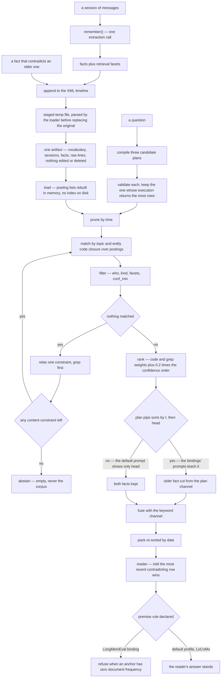

## 1. Executive Summary

KITE is Memoket's open symbolic memory for long-term conversational agents, and it has **no embeddings anywhere**. Conversations become dated facts in one XML file a person can read, a question compiles into a plan a person can read, and the reader model gets a small pack of facts with their source lines. The benchmark machinery around it is built to be checked by a sceptic. Everything after a write is weak: nothing in the library can edit, supersede or delete a fact, and the published scores come from a configuration the library does not ship.

**Contradiction is settled at read time, and on the default path by the reader model.** The README's example is the pitch: March says Marcus owns the Henderson account, June says Dana does, and KITE answers Dana. The plan language can do it with `sort` by event time and `head`, and the benchmark bindings' compile prompts teach that shape. The library's default compile prompt shows `head` and never `sort` (`prompts/recall.py:11-13`). What the default path does is order the evidence pack by date (`core/algebra.py:1131`, `pipeline/retrieve.py:253`) and tell the reader "When rows CONTRADICT, the most recent wins" (`prompts/answer.py:26`).

Nothing else exists. The public API is `load`, `remember`, `recall`, `answer`, and `grep -rn -i "def forget\|def delete\|def remove\|def retract\|def supersede" --include="*.py" src/` returns nothing. A fact written wrongly is in the file for good, and an erasure request has no path through the library.

**The benchmark infrastructure is built for a sceptic.** `benchmarks/reproduce/manifest.json` pins each dataset's upstream revision, immutable URL and SHA-256. `sealed.py` digests the judged rows, and `verify.py` recomputes the published metric from the bytes the digest check returned, with a comment saying why: "Recomputing from a re-opened file would accept any edit to the verdicts that preserved the row count". `benchmarks/tools/leak_check.py` scans every string the shipped prompts export for terms concentrated in a small fraction of a benchmark corpus.

**The artifact it verifies is not published.** The manifest names `artifacts/results/locomo-freeze2-0811/judged.jsonl` and a release asset `memoket-kite-v0.1.0-locomo.tar.gz`, and records its own release status as `sealed_awaiting_packaging` with `git_commit: null`. No results file is committed (`find benchmarks -name "*.json*"` returns the manifest alone). The manifest carries no `asset_sha256`, so `prepare.py` refuses before it downloads, and a GET against the release URL returns 404 because the single v0.1.0 release has no assets. The verifier works; only the project can run it.

**And the published configuration is not the shipped one.** 93.51% on LoCoMo and 85.60% on LongMemEval-S come from per-benchmark *bindings* over a shared knob baseline (`benchmarks/common/settings.py:181-209`). That baseline turns on eleven switches the library's `DefaultMemoryProfile` leaves off, among them a BM25-lite keyword channel, a rank-fused pack, a date-window channel, plan repair, a second reader pass and source hydration. Each binding then adds its own extraction, compile and answer prompts, `KINDS` vocabulary, seed taxonomy and token cap.

LoCoMo's binding also enables an inference pass beside the comment "Its QA set contains no unanswerable questions, so a bounded inference pass can only recover an answer, never invent a refusal". The pipeline reads every knob as `getattr(profile, NAME, <off>)`, and `Memory` always passes the default profile (`memory.py:247-254`), so a caller of `Memory.load(...)` gets none of them. Every switch is a named constant in a committed file with a comment beside it. It is the sentence a reader needs before carrying the headline anywhere.

## 2. Mental Model

A memory is **a dated claim with its utterance attached**. `remember()` sends one session to an extraction model and gets back facts; each fact keeps `src` ids pointing at `<line>` elements that stay in the same file, so every answer resolves to the words somebody actually said. The unit is small and typed: a `kind` from a closed list, a `who`, an event time, topic and entity codes from a controlled vocabulary, and facets for object class, place, event type and duration.

**Truth is an ordering, not a state.** There is no `valid_until`, no supersession edge, no tombstone, no rejected value. Two facts that contradict each other both live in the timeline, and read time decides which one the reader believes. `FactRecord.when` returns the event time if there is one and the session date otherwise, and every fact-level sort runs on it (`core/algebra.py:56-57`).

A plan that asks for `sort` on `t` and then `head` drops the older fact from the plan channel. The keyword channel fused beside it can still admit that fact when it shares a word with the question, and a plan without the sort returns both. Either way the pack is re-sorted by date, the newer row last, and the reader is told the most recent contradicting row wins. Correctness rests on the extracted event time and on the reader following one prompt line.

**Not knowing is computed without a model, and acts only where a binding declares it.** `GateContext` takes the question's possessives and capitalised runs and marks the premise at risk when every stem of any one of them has zero document frequency in the store. Its docstring gives the reason: "a question whose subject anchors have zero document frequency in the store asks about something memory has never seen". Weekday and month words are excluded because they are held structurally rather than as fact text (`pipeline/verdicts.py:22-32`, `:68-75`).

The verdict is written to the answer ledger every time (`pipeline/answer.py:250-251`), and only the `premise` post-processing rule refuses on it. LongMemEval's binding declares `premise,hedge`; LoCoMo's declares no rule and the default profile declares none. On the default path a refusal comes from the reader prompt's "No information" instruction and from the relaxation ladder abstaining.

## 3. Architecture

Nothing has to be running. The library is a Python package with `dependencies = []`; the only optional extra is `tiktoken`, used for token accounting in the answer ledger and replaced by a character estimate when absent. Memory is one or more XML files that a user owns, opens and can read. The one external requirement is an OpenAI-compatible endpoint, `gpt-4.1-mini` unless the caller names another model. A recall makes three plan-compile calls, an answer adds one reader call, and each remembered session makes one extraction call.

There are two API layers. `memoket_kite.Memory` is the public surface: load, remember, recall, answer, answer_with_evidence. `memoket_kite.research` is the lower one, exposing `SymbolicQuery`, `QueryPlan`, `Evidence`, `ExecutionTrace`, a `ReasonerProfile` protocol and per-stage telemetry. It is built for method evaluation and is the layer the benchmark bindings drive.

`benchmarks/` is a third component and nearly as large as the library: per-benchmark bindings (adapter, build, evaluate, protocol, profile, score), shared machinery for judging, ownership, single-writer locking, canonicalisation and resumption, and the reproduce/verify/seal/leak-check tools.

## 4. Essential Implementation Paths

**Remember** — `Memory.remember` requires a memory loaded from exactly one file, refuses a session id already in the store before paying for extraction, and extracts into a copy of the vocabulary so a failed write leaves no phantom topics (`memory.py:126-154`). `build_session` validates the messages and refuses XML control characters rather than stripping them (`remember.py:44-45`). `extract_facts` makes one model call.

`storage.append_session` then re-parses the artifact, refuses a duplicate session id, appends the session and its facts, and merges the vocabulary. It refuses a write whose vocabulary lacks symbols the file on disk carries, writes a staged temporary file, loads it back the way a reader will, carries the original file's permission bits, and `os.replace`s it into place (`storage.py:60-113`).

**Compile** — `pipeline/compile_plan.py` fills the profile's `COMPILE_PROMPT` and samples three plans, the first at temperature 0 and two at 0.8. `pipeline/retrieve.py:_score_plan` executes each against the store and keeps the highest score, which counts returned rows up to twelve before any structural bonus (`compile_plan.py:226-252`, `retrieve.py:447-481`). `research/query.py` validates every entry, rejecting an unknown `conf_min`, a malformed time bound or an unknown operator.

**Execute** — `core/algebra.py:execute` runs prune → match → filter → rank → refine → pack, logging each stage into a `Trace`. `_relax` is the refine ladder, relaxing in a fixed order so the same plan over the same memory takes the same steps.

**Retrieve** — `pipeline/retrieve.py:_run_retrieval` fuses the plan's rows with a keyword channel by reciprocal rank, admits up to the caller's `limit` rows with at most five per session, and sorts them by date (`retrieve.py:210-253`, `:662-687`, `:823-859`).

**Answer** — `pipeline/answer.py` opens a ledger, computes the premise gate, renders each row with up to two source quotes, calls the reader, applies whatever post-processing rules the active profile declares — none on the default profile — and snapshots the telemetry into the record.

## 5. Memory Data Model

The artifact has three parts: a `<vocab>` of topic and entity codes with aliases, a `<timeline>` of sessions, and inside each session its `<fact>` and `<line>` elements. `Store.load` reads them into `FactRecord`s and builds eight posting indexes — by topic, entity, kind, who, unit, object class, place and event — plus a token index and an entity-to-object-class bridge (`core/algebra.py:96-128`, `:360-388`).

Two times are stored. `t` is the event time the extractor resolved; `unit_date` is the date of the session it was said in. `FactRecord.when` coalesces them, and every fact-level time filter and sort runs on that value (`algebra.py:678`, `:1025`, `:1140`); raw lines and sessions filter on their own date (`:900`, `:862`).

The bi-temporal mark is withheld on three counts. `t` is a point rather than a validity interval, and nothing records when a fact stopped being believed, because nothing can stop it. A fact-level query cannot separate "true in February" from "said by February" either, since both times collapse into `when`.

`conf` is `low`, `med` or `high`, and a missing value orders as `med` (`CONF_ORDER`, `algebra.py:23`). It is used twice. As a floor, `conf_min` is set by the research API's `SymbolicQuery.confidence` and never named in the default compile prompt. As a ranking bonus it applies on every query. Three ordered degrees of sureness with a threshold is the shape the [rubric](../../methodology/atlas-rubric/) separates from a trust state — nothing here says "on record, not to be acted on".

The package holds one mutation of stored facts. `consolidate_topics` and `consolidate_entities` merge equivalent vocabulary codes and rewrite the `topics` and `entities` attributes of every fact (`pipeline/extract.py:506-589`, `:591-634`). Only the benchmark build scripts call them (`benchmarks/locomo/build.py:80-81`, `benchmarks/longmemeval/build.py:247-249`), and neither touches a fact's text, time or confidence. `Store.apply_rewrite`, the in-memory counterpart, has no caller.

## 6. Retrieval Mechanics

Matching starts from codes, not text. The plan's topics and entities are expanded through the vocabulary's closure (a topic includes its children, an entity its aliases), intersected over posting lists, and filtered by the remaining `where` clauses. `_score` then adds fixed weights — 3.0 for an exact topic code, 2.0 for an entity, 1.5 per matching facet, 1.0 for a kind — to an IDF-weighted grep score and `0.2 * CONF_ORDER[conf]` (`algebra.py:732-785`). Per-fact token specificity is a tie-breaker, used only when a `head` or `tail` pipe truncates.

`_relax` is the part to study. When a query returns nothing, constraints come off in the order `RELAX_ORDER` fixes — grep, event, object, kind, place, who, entities, time, topics — and the trace records each step (`algebra.py:417-427`, `:811-839`). Two guards keep the ladder from widening into a dump. A query with no constraint left stops empty, and a query whose content constraints have all gone while a speaker or time filter remains abstains (`:955-977`). That is what makes abstention checkable.

A keyword channel runs beside the plan on every question. On the default profile it regex-matches each of the question's words against every fact and every line and sums their IDF (`retrieve.py:642-652`). The BM25-lite scorer over the token postings sits behind `LEXICAL_V2`, which only the benchmark baseline turns on. The two channels are fused by reciprocal rank, so a fact the plan cut can return through the keyword channel.

The pack bounds what reaches the reader. On the public API the bound is the `limit` argument, ten rows by default, with at most five per session, and each fact row carries up to two source quotes cut to 120 characters (`research/codebook.py:406-414`, `pipeline/answer.py:663`). The README's "~1.6K tokens per question" is the bindings' `TOKEN_CAP`, 1500 for LoCoMo and 1700 for LongMemEval; the default leaves it at 0, which disables the token cap. The ledger books every contributor in two currencies without altering a byte of the prompt.

## 7. Write Mechanics

One model call per session, on the caller's thread, and the fact is retrievable as soon as the file is rewritten and the memory reloads. There is no queue, no batching and no background consolidation. `remember` is marked experimental in its docstring and in `docs/api.md`.

The write path's care is the notable part. `append_session` refuses a duplicate session id and a stale vocabulary, and it parses the completed temporary file through `Store.load` before replacing the user's only durable copy. The comment gives the reasoning: "a symbol the writer allowed but the reader rejects produces valid XML that can never be opened again. Failing here costs this remember() call; failing later costs the memory."

What the write path does not do is look at what is already there. A fact id collision is refused and nothing else is checked: no near-duplicate detection, no contradiction check, no supersession. The file grows monotonically. Each `remember` parses it, builds the store twice — once for the session-id check, once to verify the staged file — and reloads it, so its cost is linear in the memory's size.

Concurrent writers are unsupported by statement. The `remember` docstring says persisting "takes no lock, so two writers against the same file are not supported", and `docs/api.md` rules out "multiple writable shards, concurrent writers, or conflict resolution". `append_session` re-reads the timeline from disk, so a stale `Memory` instance does not drop another writer's sessions. Two calls that interleave between `ET.parse` and `os.replace` lose one session, and the vocabulary check does not see it.

## 8. Agent Integration

There is no adapter for anything. No MCP server, no CLI entry point in `pyproject.toml`, no HTTP surface, no framework bindings — an agent uses this by importing it and calling four methods. `answer_with_evidence` returns an `Answer` carrying the retrieved facts and the citation ids, and the `Answer` docstring states the limit of its own receipts: "Evidence is the retrieved basis for the answer, not a proof of it: the reader chose its words, and the receipts record what it saw" (`fact.py:84-85`).

## 9. Reliability, Safety, and Trust

**Provenance is structural.** The raw utterances are in the same file as the facts extracted from them, a fact names its sources, and an answer names the ids it cited. A reader can follow any claim to the sentence it came from without leaving the artifact.

**Durability is handled properly** — staged write, load-back verification, permission preservation, atomic replace, stale-vocabulary refusal. This is the one part of the system where a failure would be unrecoverable, since the XML file is the only copy.

**Deletion and correction do not exist**, which is a safety statement as much as a feature gap. There is no way to remove a fact about a person, no way to mark an extraction wrong, and no way to keep a stale fact out of the pack. For a memory holding conversations with users, that is the risk to weigh first.

**A wrong event time is decisive and unrecoverable.** It drives both the plan's sort and the pack order the reader is told to trust, it is an LLM output, and nothing re-checks it.

**The reader is the only unconstrained component, and on the default path it also settles contradictions.** Everything between load and pack is deterministic and traced; the answer is whatever the model says over the pack, with declared post-processing rules applied afterward. The changelog records two earlier rules, a count repair and a zero-answer disclosure, as withdrawn. It also states that neither remaining rule acts where the caller says the question has an answer, because "a refusal there is a certain miss".

**Confidence ranks by default and filters only on request.** The public API cannot set `conf_min`, so on the default path a `low` fact is retrieved and loses 0.2 to an otherwise equal `med` one.

## 10. Tests, Evals, and Benchmarks

**I did not run this suite or the benchmarks.** The screen found one build-time execution path (`tests/conftest.py`, at collection) and one unpinned surface, nothing inside the dependency cooldown. I kept the read-only posture, and the benchmark reproduction needs an API key and paid model calls in any case. Everything below is read from the committed code, except two checks against GitHub: the release listing, and a GET against the asset URL the downloader builds.

297 test functions sit in 23 modules across unit, research, public-API and regression suites. `tests/conftest.py` seals the provider: a test that reaches `llm`, `llm_json` or `_http_llm` in any of six modules, or opens a socket, fails at once unless marked `@pytest.mark.provider`, and no test carries the mark. Two tests skip, both in `tests/unit/test_harness_cli.py`: one on a clean git tree with no diff to fingerprint (`:1287`), and one when the licensed LongMemEval corpus is absent (`:1934`), which it is in every clean clone. CI runs the suite on Python 3.10–3.12 with a 75% coverage floor.

`tests/unit/test_algebra.py` holds the retrieval assertions that matter. One function builds an in-memory store and runs eight subqueries. Seven assert positive result sets, five of them exact, and one asserts an empty result once the ladder has dropped an impossible grep. `tests/unit/test_retrieval_channels.py:241-242` asserts a fact outside a date window is absent while two inside it are present. No case exercises the `abstain(content-lost)` branch, where a speaker or time filter outlives the content constraints.

**The reproduction machinery**, in the order a reader would use it. `prepare.py datasets` downloads LoCoMo and cleaned LongMemEval_S from the pinned immutable URLs, verifying SHA-256 into a temporary file before moving it. `locomo.sh` and `longmemeval.sh` build Codebooks and judge answers, writing failed ids to `failed.txt` and exiting nonzero rather than retrying silently. `score.py --offline` recomputes a run's own metric from its own seal. `verify.py` checks a reference run against the manifest's Codebook count, row count and score, to within 1e-12, from digest-verified bytes. `leak_check.py --require-corpus` scans the shipped strings for corpus-specific terms.

**Two gaps sit against that.** The reference artifacts are not obtainable: no results file is committed, and the manifest omits the `asset_sha256` that `prepare.py artifacts` requires. It raises "release asset is not published in manifest.json; run the full evaluation first", and `https://github.com/memoket/memoket-kite/releases/download/v0.1.0/memoket-kite-v0.1.0-locomo.tar.gz` returns 404 against a release carrying no assets.

And the numbers belong to the benchmark configuration rather than to the library. The shared baseline in `benchmarks/common/settings.py` and the per-benchmark overrides in `benchmarks/*/profile.py` — `INFER_PASS`, `INSTANCE_ALIGNMENT`, `TOPIC_REFINEMENT`, `DUAL_DATE`, `SPEAKER_LABEL`, `PROFILE_PACK`, the token caps, the per-corpus `KINDS`, the extraction, compile and answer prompts, and the seed taxonomies — are all absent from `DefaultMemoryProfile`, whose compile prompt is the one that never shows `sort`.

**There is no paper.** The README says a technical report is in preparation and that BibTeX will land with the arXiv id; `CITATION.cff` cites the software. `grep -rniE 'arxiv|bibtex|@article|@misc|doi\.org' README.md CITATION.cff docs/` finds only that sentence, at `README.md:295`.

**The data licensing is handled better than the code it accompanies is licensed.** `LICENSE-DATA.md` states that Apache-2.0 covers the source and not the benchmark data, that LoCoMo derivatives carry CC BY-NC 4.0 and LongMemEval derivatives MIT, and that datasets are downloaded from their publishers and never redistributed. The upstream licence texts are vendored under `licenses/third-party/`.

## 11. For Your Own Build

### Steal

**Recompute a published metric from digest-verified bytes, not from the file.** `verify.py`'s comment is the whole idea: recomputing from a re-opened file accepts any edit that preserves the row count. Sealing the rows and scoring the sealed bytes closes that, and it costs a hash. The contract — `prepare.py`, `sealed.py`, `verify.py` and `leak_check.py` — is 480 lines and independent of anything else KITE does.

**Ship a contamination gate and run it before publishing a number.** `leak_check.py` scans every string the library's prompts export for terms that appear in only a handful of a corpus's documents, and reports them for review rather than as a verdict. A missing corpus is SKIPPED, and `--require-corpus` makes that an error.

**Load the artifact back the way a reader will, before it replaces the only copy.** Parsing alone accepts files the loader later refuses. Two lines, and the failure mode it prevents is the unrecoverable one.

**Refuse a write whose vocabulary is older than the one on disk.** A whole-file rewrite from a stale in-memory vocabulary silently drops symbols another writer added while keeping the facts that reference them. Comparing symbol sets and failing closed costs one set difference.

**Give a relaxation ladder a floor.** Widening a query until something matches is how a symbolic retriever avoids brittle misses, and without a floor it ends by returning the corpus. KITE stops when no content constraint is left, which keeps "nothing matched" a result.

**Compute "the premise is false" without a model, and declare where it applies.** A zero document frequency for every stem of a capitalised anchor, with structural time words excluded, is deterministic and instant, and it distinguishes "never said" from "not found". KITE makes the refusal a declared rule, because on a workload where every question has an answer it can only cost.

### Avoid

**Do not let read-time ordering be the only correction mechanism.** It works when the extractor got the event time right and either the plan sorted or the reader obeyed a prompt line. When neither holds it returns both answers, and there is no state to inspect afterward and no way to say which fact was meant to win.

**Do not teach a mechanism in the benchmark prompt and leave it out of the default one.** The README's plan example uses `sort`, the bindings' compile prompts teach it, and the library's default prompt never shows it. A plan selector that prefers the candidate returning more rows pulls against a `head: 1` plan as well.

**Do not publish a score whose rows cannot be fetched.** The verifier here is better than most and nobody outside the project can run it, which converts an unusual strength into an ordinary unverified claim.

**Do not fold a benchmark's own properties into a configuration switch without saying so where the number is printed.** "This QA set contains no unanswerable questions" is a fair reason to enable an inference pass and an unfair thing to leave only in the source when the README shows the result.

### Fit

Take this if you want **a memory a person can open in an editor**: one file, typed facts, the original sentences beside them, and a query you can read. For a single-user assistant over a bounded history, the whole stack is four methods and no infrastructure, and the absence of a vector database is an operational saving rather than a slogan. Borrow the write path wholesale if your memory is a single file.

Do not take it where **anything has to be corrected, forgotten or scoped**. A wrong fact is permanent, a user's erasure request has no path, and two users' memories are separated only by being in different files — a real boundary, and one an application has to enforce itself. Build correction before adopting the store: the smallest version that fits this design is a `valid_until` on the fact and one clause in the time filter. The alpha classifier on the package is honest.

## 12. Open Questions

- The manifest records `sealed_awaiting_packaging` and a null `git_commit`. Will the release carry the `asset_sha256` values the downloader checks, and when?
- What happens to a memory after a year of sessions? Nothing in the tree prunes, compacts or archives, and every load and every `remember` rebuilds the posting lists from the whole artifact.
- `validate_profile` says it fails early "without promoting optional research switches to public API" (`research/profile.py:23`), and `Memory` always passes the default profile. Is the benchmark baseline meant to become the library default, or to stay a research configuration?
- How often does the default compile prompt produce a `sort` pipe without being shown one, and how often does the plan selector keep it? Answering needs a model run.
- `conf` is set by the extraction model. Nothing in the tree calibrates it, and no test asserts anything about its distribution.

## Appendix: File Index

**Library.** `src/memoket_kite/memory.py` (the public `Memory`), `src/memoket_kite/remember.py` (`build_session`), `src/memoket_kite/storage.py` (`append_session`, `_verify_loadable`, `_refuse_stale_vocab`), `src/memoket_kite/fact.py` (`Fact`, `Answer`), `src/memoket_kite/defaults.py` (`DefaultMemoryProfile`).

**Query algebra.** `src/memoket_kite/core/algebra.py` (`Store`, `FactRecord`, `parse_plan`, `execute`, `_relax`, `RELAX_ORDER`, `_score`, `CONF_ORDER`), `src/memoket_kite/core/vocab.py` (codes, aliases, closure, merges).

**Pipeline.** `src/memoket_kite/pipeline/` — `extract.py` (extraction, consolidation, instance alignment), `compile_plan.py`, `retrieve.py` (`_score_plan`, channel fusion, row selection), `answer.py`, `verdicts.py` (the premise gate), `postproc.py`, `ledger.py`.

**Prompts and research API.** `src/memoket_kite/prompts/recall.py` (default compile prompt), `src/memoket_kite/prompts/answer.py` (`KERNEL_POLICIES`), `src/memoket_kite/research/` — `query.py` (plan validation), `codebook.py` (`Codebook`, `Reasoner`), `profile.py`.

**Benchmarks.** `benchmarks/reproduce/manifest.json`, `prepare.py`, `verify.py`, `sealed.py`, `package.py`; `benchmarks/tools/leak_check.py`; `benchmarks/common/settings.py` (the knob baseline); `benchmarks/locomo/profile.py`, `benchmarks/longmemeval/profile.py` (the bindings).

**Tests cited.** `tests/conftest.py`, `tests/unit/test_algebra.py`, `tests/unit/test_retrieval.py`, `tests/unit/test_retrieval_channels.py`, `tests/unit/test_harness_cli.py`, `tests/research/test_api.py`.

**Recorded searches.** Every absence claim above rests on one of these, run from the tree root at the pinned commit:

- `python3 scripts/screen_repo.py <checkout>` — no auto-run surface, one build-time execution path, one unpinned surface.
- `grep -rn -i "def forget\|def delete\|def remove\|def retract\|def supersede" --include="*.py" src/` — empty.
- `grep -rniE 'embed|vector|cosine|faiss|numpy' --include="*.py" src` — two comments, in `pipeline/ledger.py:69` and `pipeline/retrieve.py:563`; no embedding code.
- `grep -nE 'scripts|entry' pyproject.toml` and `grep -rliE 'mcp|fastapi|flask|http\.server|argparse' src` — both empty.
- `sed -n 35,57p src/memoket_kite/core/algebra.py` — the `FactRecord` fields; no tenant, user or project key.
- `grep -rniE 'retention|expire|ttl|archive|compact|evict' --include="*.py" src` — the ledger's `compact` token currency and a prompt renderer; nothing removes or archives a fact.
- `grep -rniE 'dedup|near.dup|similar' --include="*.py" src/memoket_kite/storage.py src/memoket_kite/remember.py src/memoket_kite/memory.py src/memoket_kite/pipeline/extract.py` — facet-value normalisation and the instance registry the benchmark build writes; nothing compares a new fact with stored ones.
- `grep -rniE 'calibrat' --include="*.py" src tests` — empty.
- `grep -rn -i "supersede\|contradict\|conflict" --include="*.py" src/` — vocabulary and id clashes in `core/algebra.py` and `core/vocab.py`, the duplicate-session comment at `memory.py:139`, and the reader instruction at `prompts/answer.py:26`; no supersession field or check.
- `grep -rn '"sort"' src/memoket_kite/pipeline src/memoket_kite/prompts src/memoket_kite/defaults.py` — the `compile_plan.py:13` docstring alone; the default compile prompt's schema shows `head` only, and plan normalisation adds no sort.
- `grep -rn 'apply_rewrite\|consolidate_topics\|consolidate_entities' --include="*.py" src benchmarks` — the definitions and the benchmark build scripts; no library caller.
- `grep -rn 'abstain\|content-lost' tests` — empty.
- `grep -rn 'pytest.skip' tests` — two, at `tests/unit/test_harness_cli.py:1287` and `:1934`, both in harness tests.
- `grep -rn 'mark.provider' tests` — the conftest docstring and error message only.
- `find benchmarks -name "*.json" -o -name "*.jsonl" -o -name "*.csv"` — `manifest.json` alone.
- `curl -sS -o /dev/null -w "%{http_code}" -L https://github.com/memoket/memoket-kite/releases/download/v0.1.0/memoket-kite-v0.1.0-locomo.tar.gz` — 404.
- `curl -sS https://api.github.com/repos/memoket/memoket-kite/releases` — one release, v0.1.0, no assets.
- `grep -rn "getattr(profile" --include="*.py" src/` — every switch defaults off except `AGGREGATE_SHORTCIRCUIT`, which defaults on.
- `grep -rniE 'arxiv|bibtex|@article|@misc|doi\.org' README.md CITATION.cff docs/` — `README.md:295` alone.

## History

**2026-09-26** — [`8745fedab8d10ea698066583dfc3ba4e0a32e294`](https://github.com/memoket/memoket-kite/commit/8745fedab8d10ea698066583dfc3ba4e0a32e294) — an audit at an unchanged pin: `main` has not moved, and two unmerged branches carry later work. Screened again from a full clone: no auto-run surface, one build-time execution path, one unpinned surface, nothing inside the cooldown. Nothing installed, built or run. No mark moved; `negative_eval` gains a date-window case. Corrected: the default compile prompt never shows `sort`, three plans are sampled per question, and a keyword channel is fused beside the plan, so on the default path the reader settles contradictions over a date-ordered pack ([section 2](#2-mental-model)). The benchmark baseline enables eleven switches the default leaves off; the premise gate refuses only under LongMemEval's rule; `build_session` refuses control characters; there are eight posting indexes; two tests skip.

**2026-09-12** — [`8745fedab8d10ea698066583dfc3ba4e0a32e294`](https://github.com/memoket/memoket-kite/commit/8745fedab8d10ea698066583dfc3ba4e0a32e294) — first reading, at the default branch's head, a commit dated 21 August 2026. Screened before reading: no auto-run surface, one build-time execution path (`tests/conftest.py`, which runs at pytest collection), no dependency surface inside the seven-day cooldown, and one unpinned surface — a `pyproject.toml` with no lockfile beside it, which declares no runtime dependencies at all. Nothing was installed, built or run, and no test or benchmark in this repository was executed. Two checks were made against GitHub rather than the checkout: the repository's release listing, and a GET against the release-asset URL `prepare.py` constructs. Licence is Apache-2.0 per `LICENSE`; `LICENSE-DATA.md` separately governs benchmark data and anything derived from it.
