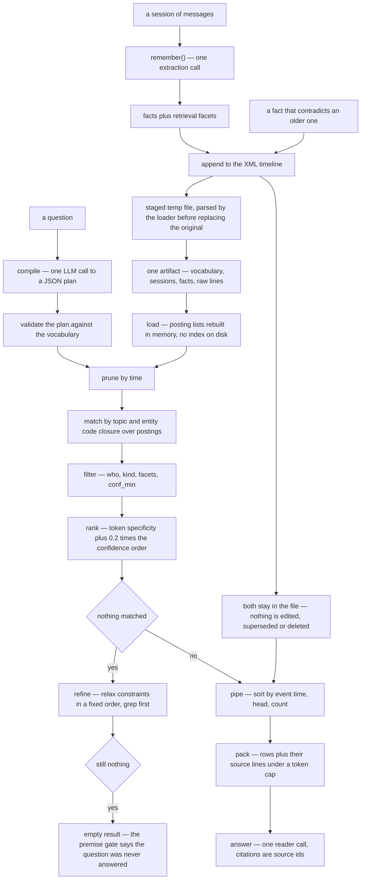

## 1. Executive Summary

KITE is Memoket's open symbolic memory for long-term conversational agents: about 8,300 lines of Python in the package, 22,400 with the benchmark harness and tests, Apache-2.0, zero runtime dependencies, alpha per its own classifier, and one commit history that ends at this pin on 21 August 2026. Its claim is unusual enough to be worth stating in its own terms — **no embeddings anywhere**. Conversations become dated facts in one XML file; a question compiles into a readable plan; the plan runs over posting lists; the reader model gets a small pack of facts and their source lines.

**The design's whole answer to contradiction is read-time ordering.** The README's example is the pitch: March says Marcus owns the Henderson account, June says Dana does, and a similarity search has no notion of *now*. KITE's plan sorts by event time and takes the head. That is a real mechanism and it is the only one — the public API is `load`, `remember`, `recall`, `answer`, and `grep -rn -i "def forget\|def delete\|def remove\|def retract\|def supersede" src/` returns nothing. A fact written wrongly is in the file for good, and an erasure request has no path through the library.

**The benchmark infrastructure is built for a sceptic, and the artifact it verifies is not published.** `benchmarks/reproduce/manifest.json` pins each dataset's upstream revision, immutable URL and SHA-256; `sealed.py` digests the judged rows; `verify.py` recomputes the published metric *from the bytes the digest check returned* rather than from a re-opened file, with a comment saying why — "recomputing from a re-opened file would accept any edit to the verdicts that preserved the row count". And `benchmarks/tools/leak_check.py` scans every string the shipped prompts export for terms concentrated in a small fraction of a benchmark corpus, a self-administered contamination check almost nothing in this atlas ships. What is missing is the input: the manifest names `artifacts/results/locomo-freeze2-0811/judged.jsonl` and a release asset `memoket-kite-v0.1.0-locomo.tar.gz`, no such file is committed (`find benchmarks -name "*.json*"` returns the manifest and nothing else), the manifest carries no `asset_sha256` so `prepare.py` refuses before it downloads, and a GET against the release URL returns 404 — the single v0.1.0 release has no assets. The verifier works; only the project can run it.

**And the published configuration is not the shipped one.** 93.51% on LoCoMo and 85.60% on LongMemEval-S are produced by per-benchmark *bindings*: each has its own knob settings, its own `KINDS` vocabulary and its own seed topic taxonomy. LoCoMo's binding turns on an inference pass with the reason written beside it — "Its QA set contains no unanswerable questions, so a bounded inference pass can only recover an answer, never invent a refusal" — and LongMemEval's turns on instance alignment, topic refinement, dual dates, speaker labels and two post-processing rules that LoCoMo declares none of. The library's own `DefaultMemoryProfile` declares none of these attributes, and the pipeline reads them with `getattr(profile, NAME, <off>)`, so a caller using `Memory.load(...)` gets the baseline. Saying so is not an accusation: every one of those switches is a named constant in a committed file with a comment explaining it. It is the sentence a reader needs before carrying the headline anywhere.

## 2. Mental Model

A memory is **a dated claim with its utterance attached**. `remember()` sends one session to an extraction model and gets back facts; each fact keeps `src` ids pointing at `<line>` elements that stay in the same file, so every answer resolves to the words somebody actually said. The unit is small and typed: a `kind` from a closed list, a `who`, an event time, topic and entity codes from a controlled vocabulary, and facets for object class, place, event type and duration.

**Truth is a sort order, not a state.** There is no `valid_until`, no supersession edge, no tombstone, no rejected value. Two facts that contradict each other both live in the timeline, and the plan decides which one the reader sees. `FactRecord.when` returns the event time if there is one and the session date otherwise, and the sort runs on that. The consequence follows directly: correctness depends on the extraction having got the event time right, and on the compiled plan having asked for a sort — an under-specified plan returns both facts, ranked by a score in which confidence contributes `0.2 * CONF_ORDER[conf]`.

**Not knowing is a first-class outcome, and it is computed without a model.** `GateContext` takes the question's capitalised anchors, looks up each stem's document frequency in the store, and marks the premise at risk when they are all zero — "a question whose subject anchors have zero document frequency in the store asks about something memory has never seen; on a workload that contains unanswerable questions, that is a false premise rather than a retrieval failure". Weekday and month words are excluded from the anchor set with a stated reason: they are held structurally rather than as fact text, so their frequency is always zero and says nothing.



## 3. Architecture

Nothing has to be running. The library is a Python package with `dependencies = []`; the only optional extra is `tiktoken`, used for token accounting in the benchmark harness and replaced by a character estimate when absent. Memory is one or more XML files that a user owns, opens and can read. The one external requirement is an OpenAI-compatible endpoint for two calls per question — the plan compiler and the reader — plus one per remembered session.

There are two API layers. `memoket_kite.Memory` is the public surface: load, remember, recall, answer, answer_with_evidence. `memoket_kite.research` is the lower one, exposing `SymbolicQuery`, `QueryPlan`, `Evidence`, `ExecutionTrace` and per-stage telemetry — built for method evaluation, and the layer the benchmark bindings drive.

`benchmarks/` is a third component and nearly as large as the library: per-benchmark bindings (adapter, build, evaluate, protocol, profile, score), shared machinery for judging, ownership, single-writer locking, canonicalisation and resumption, and the reproduce/verify/seal/leak-check tools.

## 4. Essential Implementation Paths

**Remember** — `Memory.remember` → `build_session` validates and normalises the messages, stripping XML-illegal characters → `extract_facts` makes one model call → `storage.append_session` parses the artifact, refuses a duplicate session id, appends the session and its facts, merges the vocabulary, refuses a write whose vocabulary is *older* than the one on disk (a stale writer would drop symbols another writer added while keeping facts that reference them), writes a staged temporary file, loads it back the way a reader will, carries the original file's permission bits, and `os.replace`s it into place.

**Compile** — `pipeline/compile_plan.py` turns the question into a JSON plan; `research/query.py` validates every entry, rejecting an unknown `conf_min`, a malformed time bound or an unknown operator.

**Execute** — `core/algebra.py:execute` runs prune → match → filter → rank → refine → pack, logging each stage into a `Trace`. `_relax` is the refine ladder, relaxing in a fixed order so the same plan over the same memory takes the same steps.

**Answer** — `pipeline/answer.py` opens a ledger, computes the premise gate, packs rows and neighbour lines under a token cap, calls the reader, applies whatever post-processing rules the active profile declares, and snapshots the telemetry into the record.

## 5. Memory Data Model

The artifact has three parts: a `<vocab>` of topic and entity codes with aliases, a `<timeline>` of sessions, and inside each session its `<fact>` and `<line>` elements. `Store.load` reads them into `FactRecord`s and builds seven posting indexes — by topic, entity, kind, who, unit, object class, place and event — plus a token index for the lexical arm.

Two times are stored and one is queried. `t` is the event time the extractor resolved; `unit_date` is the date of the session it was said in. `FactRecord.when` coalesces them — `t` if present, else `unit_date` — and every fact-level time filter and sort runs on that coalesced value (`algebra.py:678`, `:1025`, `:1140`). The raw-line filter uses `unit_date` directly (`:900`). So a reader can ask "what was true in February" and cannot separately ask "what had been said by February" about facts, which is why the bi-temporal mark is withheld: both timestamps exist, only one axis is queryable.

`conf` is `low`, `med` or `high`. It is used twice: as an optional floor (`conf_min`, validated and settable through the research API), and as a ranking bonus. Three ordered degrees of sureness with a threshold is the shape the rubric separates from a trust state — nothing here says "on record, not to be acted on".

## 6. Retrieval Mechanics

Matching starts from codes, not text. The plan's topics and entities are expanded through the vocabulary's closure (a topic includes its children, an entity its aliases), intersected over posting lists, and filtered by the remaining `where` clauses. Only then does text matter: `_score` blends per-fact token specificity — an inverse-document-frequency measure computed over the store — with a grep bonus and the confidence term.

`_relax` is the part worth studying. When a query returns nothing, constraints come off in a fixed order (grep first), and the trace records which steps were taken, so an empty result means "even the relaxed query found nothing" rather than "the first attempt was too narrow". That is what makes the abstention claim checkable, and it is exactly what the committed refusal test asserts.

The pack stage bounds what reaches the reader: rows are admitted under a token cap with per-unit caps, neighbour lines are attached for context, and the ledger books every contributor in two currencies without altering a byte of the prompt. The README's "~1.6K tokens per question" is that cap doing its work — the LongMemEval binding sets `TOKEN_CAP=1700`.

## 7. Write Mechanics

One model call per session, on the caller's thread, and the fact is retrievable as soon as the file is rewritten. There is no queue, no batching and no background consolidation; the consolidation stages that do exist — instance alignment across sessions, topic refinement against the final taxonomy — belong to the benchmark build scripts, not to `remember`.

The write path's care is the notable part. `append_session` refuses a duplicate session id, refuses a vocabulary older than the one on disk, and — the step worth copying — parses the completed temporary file through `Store.load` before replacing the user's only durable copy, with the reasoning in a comment: "a symbol the writer allowed but the reader rejects produces valid XML that can never be opened again. Failing here costs this `remember()` call; failing later costs the memory."

What the write path does not do is look at what is already there. No duplicate detection beyond an exact fact-id collision, no contradiction check, no supersession. The file grows monotonically.

## 8. Agent Integration

There is no adapter for anything. No MCP server, no CLI entry point in `pyproject.toml`, no HTTP surface, no framework bindings — an agent uses this by importing it and calling four methods. `answer_with_evidence` returns an `Answer` carrying the retrieved facts and the citation ids, with a docstring that states the limit of its own receipts: "Evidence is the retrieved basis for the answer, not a proof of it: the reader chose its words, and the receipts record what it saw."

## 9. Reliability, Safety, and Trust

**Provenance is structural.** The raw utterances are in the same file as the facts extracted from them, a fact names its sources, and an answer names the ids it cited. A reader can follow any claim to the sentence it came from without leaving the artifact.

**Durability is handled properly** — staged write, load-back verification, permission preservation, atomic replace, stale-vocabulary refusal — and this is the one part of the system where a failure would be unrecoverable, since the XML file is the only copy.

**Deletion and correction do not exist**, which is a safety statement as much as a feature gap. There is no way to remove a fact about a person, no way to mark an extraction wrong, and no way to stop a stale fact being retrieved except to hope the plan sorts. For a memory holding conversations with users, that is the risk to weigh first.

**The reader is the only unconstrained component.** Everything between load and pack is deterministic and traced; the answer is whatever the model says over the pack, with declared post-processing rules applied afterward — and the changelog records that two earlier rules, a count repair and a zero-answer disclosure, were withdrawn, with the reasoning that a refusal rule must not act where the caller says the question has an answer, because "a refusal there is a certain miss".

## 10. Tests, Evals, and Benchmarks

**I did not run this suite or the benchmarks.** The screen found one build-time execution path (`tests/conftest.py`, at collection) and one unpinned surface, nothing inside the dependency cooldown; I still kept the read-only posture, and the benchmark reproduction needs an API key and paid model calls in any case. Everything below is read from the committed code, except two checks made against GitHub: the release listing, and a GET against the asset URL the downloader builds.

24 test files, 297 test functions, across unit, research, public-API and regression suites, with the LLM monkeypatched — no network, no skip paths. `tests/unit/test_algebra.py` is the important one: a single function loads the demo Codebook and runs eight subqueries, six asserting exact positive result sets and one asserting an empty one after the relaxation ladder.

**The reproduction machinery**, in the order a reader would use it: `prepare.py datasets` downloads LoCoMo and cleaned LongMemEval_S from the pinned immutable URLs, verifying SHA-256 into a temporary file before moving it; `locomo.sh` and `longmemeval.sh` build Codebooks and judge answers, writing failed ids to `failed.txt` and exiting nonzero rather than retrying silently; `score.py --offline` recomputes a run's own metric from its own seal; `verify.py` checks a reference run against the manifest's Codebook count, row count and score, to within 1e-12, from digest-verified bytes; `leak_check.py --require-corpus` scans the shipped strings for corpus-specific terms.

**Two gaps sit against that.** The reference artifacts are not obtainable: no results file is committed, the manifest omits the `asset_sha256` that `prepare.py artifacts` requires — it raises "release asset is not published in manifest.json; run the full evaluation first" — and `https://github.com/memoket/memoket-kite/releases/download/v0.1.0/memoket-kite-v0.1.0-locomo.tar.gz` returns 404 against a release that carries no assets. And the numbers belong to the benchmark bindings rather than to the library: `INFER_PASS`, `INSTANCE_ALIGNMENT`, `TOPIC_REFINEMENT`, `DUAL_DATE`, `SPEAKER_LABEL`, `PROFILE_PACK`, the per-corpus token caps, the per-corpus `KINDS` and the seed taxonomies are all set in `benchmarks/*/profile.py`, and `DefaultMemoryProfile` declares none of them.

**There is no paper.** The README says a technical report is in preparation and that BibTeX will land with the arXiv id; `CITATION.cff` cites the software. `grep -rn -i "arxiv\|doi" README.md CITATION.cff docs/*.md` finds only that sentence.

**The data licensing is handled better than the code it accompanies is licensed.** `LICENSE-DATA.md` states that Apache-2.0 covers the source and not the benchmark data, that LoCoMo derivatives carry CC BY-NC 4.0 and LongMemEval derivatives MIT, and that datasets are downloaded from their publishers and never redistributed — with the upstream licence texts vendored under `licenses/third-party/`.

## 11. Patterns Worth Stealing

### Steal

**Recompute a published metric from digest-verified bytes, not from the file.** `verify.py`'s comment is the whole idea: recomputing from a re-opened file accepts any edit that preserves the row count. Sealing the rows and scoring the sealed bytes closes that, and it costs a hash.

**Ship a contamination gate and run it before publishing a number.** `leak_check.py` scans every string the library's prompts export for terms that appear in only a handful of a corpus's documents — too specific to be task language, too rare to be coincidence — and reports them for review rather than as a verdict. A missing corpus is SKIPPED, and `--require-corpus` makes that an error.

**Load the artifact back the way a reader will, before it replaces the only copy.** Parsing alone accepts files the loader later refuses. Two lines, and the failure mode it prevents is the unrecoverable one.

**Refuse a write whose vocabulary is older than the one on disk.** A whole-file rewrite from a stale in-memory view silently drops symbols another writer added while keeping the facts that reference them; comparing symbol sets and failing closed is cheaper than any locking scheme.

**Compute "the premise is false" without a model.** Zero document frequency for every capitalised anchor in the question, with structural time words excluded from the anchor set. Deterministic, instant, and it distinguishes "never said" from "not found".

### Avoid

**Do not let read-time ordering be the only correction mechanism.** It works when the extractor gets the event time right and the compiler asks for a sort, and it silently returns both answers when either is missed. There is no state to inspect afterwards and no way to say which fact was meant to win.

**Do not publish a score whose rows cannot be fetched.** The verifier here is better than most and nobody outside the project can run it, which converts an unusual strength into an ordinary unverified claim.

**Do not fold a benchmark's own properties into a configuration switch without saying so where the number is printed.** "This QA set contains no unanswerable questions" is a fair reason to enable an inference pass and an unfair thing to leave only in the source when the README shows the result.

### Fit

Take this if you want **a memory a person can open in an editor**: one file, typed facts, the original sentences beside them, and a query you can read. For a single-user assistant over a bounded history, the whole stack is four methods and no infrastructure, and the absence of a vector database is a genuine operational saving rather than a slogan.

Do not take it where **anything has to be corrected, forgotten or scoped**. A wrong fact is permanent, a user's erasure request has no path, and two users' memories are separated only by being in different files — which is a real boundary, and one an application has to enforce itself. The alpha classifier on the package is honest.

## 12. Antipatterns / Risks

**The file only grows.** No deletion, no correction, no supersession, no retention. Over a long deployment the store accumulates every contradicted fact and every wrong extraction, all of them eligible for retrieval.

**A wrong event time is unrecoverable and decisive.** The event time is both the correction mechanism and an LLM output, and nothing re-checks it.

**The whole memory is rewritten on every `remember`.** `append_session` parses, mutates and rewrites the artifact each time; the write is atomic and verified, but its cost is linear in the memory's size and two processes writing the same file race on everything except the vocabulary, which is the only thing checked.

**Confidence is doing two jobs.** The same three-valued field contributes a ranking bonus and acts as a threshold, so tightening `conf_min` to exclude weak facts also changes the order of the ones that survive.

**The published numbers and the packaged defaults are different configurations**, and only the source says so.

## 13. Build-vs-Borrow Takeaways

**Borrow the reproduction contract wholesale** if you publish benchmark numbers: pinned dataset revision and hash, sealed rows, a verifier that recomputes without a model, a leak gate, and failed ids written to a file instead of a silent retry. Every piece of it is independent of anything else KITE does, and the contract is about 600 lines.

**Borrow the write path** if your memory is a single file: stage, verify by loading, preserve mode, atomic replace, refuse a stale vocabulary.

**Borrow the premise gate** if abstention matters — it is about forty lines and needs no model.

**Build correction yourself before adopting the store.** The smallest version that would fit this design is a `valid_until` on the fact and one clause in the time filter; the mechanism is absent rather than difficult.

## 14. Open Questions

- Is the reference run's judged output intended to be published? The manifest, the downloader and the verifier all expect it, and the release it names is empty — which reads like a packaging step that did not run rather than a decision.
- What happens to a memory after a year of sessions? Nothing in the tree prunes, compacts or archives, and every query rebuilds the posting lists from the whole artifact on load.
- The library-default profile carries none of the benchmark knobs. Whether an application is expected to author its own profile, and what the supported surface for that is, is not documented in `docs/api.md`.
- `conf` is set by the extraction model. Nothing in the tree calibrates it, and no test asserts anything about its distribution.

## 15. Appendix: File Index

**Library**
- `src/memoket_kite/memory.py` — the public `Memory`: `load`, `remember`, `recall`, `answer`, `answer_with_evidence`
- `src/memoket_kite/storage.py` — `append_session`, `_verify_loadable`, `_refuse_stale_vocab`
- `src/memoket_kite/core/algebra.py` — `Store`, `FactRecord`, `parse_plan`, `execute`, `_relax`, `_score`, `CONF_ORDER`
- `src/memoket_kite/core/vocab.py` — topic and entity codes, aliases, closure
- `src/memoket_kite/pipeline/` — `extract.py`, `compile_plan.py`, `retrieve.py`, `answer.py`, `verdicts.py` (the premise gate), `ledger.py`, `postproc.py`
- `src/memoket_kite/research/` — `query.py` (plan validation), `codebook.py`, `profile.py`
- `src/memoket_kite/defaults.py` — `DefaultMemoryProfile`

**Benchmarks**
- `benchmarks/reproduce/manifest.json`, `prepare.py`, `verify.py`, `sealed.py`, `package.py`
- `benchmarks/tools/leak_check.py`
- `benchmarks/locomo/profile.py`, `benchmarks/longmemeval/profile.py` — the per-benchmark bindings
- `benchmarks/common/settings.py` — the knob baseline

**Tests cited**
- `tests/unit/test_algebra.py`, `tests/unit/test_retrieval.py`, `tests/research/test_api.py`

**Commands this reading used**
```sh
python3 scripts/screen_repo.py <checkout>
grep -rn -i "def forget\|def delete\|def remove\|def retract\|def supersede" --include="*.py" src/
grep -rn -i "supersede\|contradict\|conflict" --include="*.py" src/      # vocab id clashes only
find benchmarks -name "*.json" -o -name "*.jsonl" -o -name "*.csv"       # manifest.json alone
curl -sS -o /dev/null -w "%{http_code}" https://github.com/memoket/memoket-kite/releases/download/v0.1.0/memoket-kite-v0.1.0-locomo.tar.gz
curl -sS https://api.github.com/repos/memoket/memoket-kite/releases       # one release, no assets
grep -rn "getattr(profile" --include="*.py" src/                          # every knob defaults off
grep -rn -i "arxiv\|doi" README.md CITATION.cff docs/*.md                 # no paper
```

## History

**2026-09-12** — [`8745fedab8d10ea698066583dfc3ba4e0a32e294`](https://github.com/memoket/memoket-kite/commit/8745fedab8d10ea698066583dfc3ba4e0a32e294) — first reading, at the default branch's head, a commit dated 21 August 2026. Screened before reading: no auto-run surface, one build-time execution path (`tests/conftest.py`, which runs at pytest collection), no dependency surface inside the seven-day cooldown, and one unpinned surface — a `pyproject.toml` with no lockfile beside it, which declares no runtime dependencies at all. Nothing was installed, built or run, and no test or benchmark in this repository was executed. Two checks were made against GitHub rather than the checkout: the repository's release listing, and a GET against the release-asset URL `prepare.py` constructs. Licence is Apache-2.0 per `LICENSE`; `LICENSE-DATA.md` separately governs benchmark data and anything derived from it.
