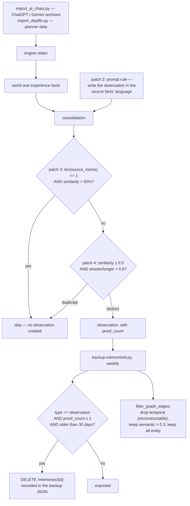

## 1. Executive Summary

MemoMind is a local memory system for coding agents: PostgreSQL with pgvector,
CUDA-accelerated embeddings, MCP over stdio, a dashboard, and importers for
ChatGPT and Gemini archives.

**Almost all of it is [Hindsight](../hindsight/)**, which this atlas already
reports. Of roughly 63,000 lines, MemoMind's own Python is **1,411** — a backup
script, two importers, a dashboard, a patcher and a proxy bridge. The engine is
vendored under `engine/` and pip-installed at runtime.

**What makes it worth a report is `engine/PATCHES.md`.**

It is a field report from someone who ran an upstream memory engine in anger and
wrote down what broke. Four patches, each with the file, the change and the
reason. Two of them are findings about memory quality that the upstream project
does not appear to have published:

> **Skip Trivial Observations** — "Consolidation creates 1:1 copies of world
> facts as observations when there's only one source fact. Real observations
> should synthesize across multiple facts."

> **Similarity Threshold** — "gpt-4o rephrases enough to bypass 80% threshold but
> the observation is still semantically identical."

The first says the consolidator manufactures the appearance of synthesis: an
`observation`, the type Hindsight's design reserves for bottom-up claims derived
across facts, gets created from a *single* fact, restated. The second says the
0.8 similarity gate meant to stop duplicate observations is defeated by the
model's own paraphrasing — fixed here by dropping the threshold to 0.5 **and**
adding a length-ratio check (`shorter / longer > 0.6`), because either alone is
insufficient.

**This atlas predicted the first one and could not confirm it.** The Hindsight
report's stated weakness is that "facts and observations are still produced or
rewritten by LLMs… a synthesized observation can become influential without an
explicit candidate/verified/rejected state." MemoMind is a downstream operator
independently arriving at the same place from the other direction — not from
reading the design, but from watching the output.

**The third mechanism is MemoMind's own and it is good** — section 7's
proof-count pruning.

**And the installer disables database authentication** — section 9.

## 2. Mental Model

Conversations and life-log data are imported into a Hindsight bank. The engine
extracts facts, links them, and consolidates them into observations. MemoMind
adds a weekly job that exports everything and deletes the observations that never
earned their keep.



## 3. Architecture

`engine/` holds `hindsight` and `hindsight_api` — a reference copy of the
upstream source with the patches already applied, kept so the patches can be
restored after an upgrade. The runtime dependency is the pip-installed
`hindsight-all` / `hindsight-api`, which `install.sh` edits in place.

MemoMind's own surface: `install.sh`, `patch_hindsight.py`,
`backup-memomind.py`, `restore_backup.py`, `import_ai_chats.py`,
`import_daylife.py`, `sync_daylife_smart.py`, `dashboard.py`,
`proxy-bridge.py`, and two slide builders.

`patch_hindsight.py` defaults its venv path to
`D:\pythonPycharms\memomind-env` — one machine's layout, overridable by
argument.

The README is bilingual (English and Chinese) and points at a companion project,
Recall, for the human-facing conversation-history half, with the division stated
up front: this handles "what the AI knows", that handles "what you can review".
Naming the half you do not do is a clarity most projects skip.

## 4. Essential Implementation Paths

**Patch** — `engine/PATCHES.md`; `install.sh` `:79-123` (the four patch blocks,
each guarded by a `grep -q` so it is idempotent);
`patch_hindsight.py` (the Windows path).

**Prune** — `backup-memomind.py` (`PRUNE_AGE_DAYS = 30`, `PRUNE_MAX_PROOF = 1`
`:26-27`, `prune_stale_observations` `:54-88`, `filter_graph_edges` `:91-96`).

**Import** — `import_ai_chats.py`, `import_daylife.py`,
`sync_daylife_smart.py`.

## 5. Memory Data Model

Hindsight's: source chunks, `world` and `experience` facts, consolidated
`observation` facts with `proof_count` and `source_memory_ids`, user-curated
reflections, and a link graph of entity, semantic, temporal and causal edges.
The atlas's [Hindsight report](../hindsight/) covers it; nothing in MemoMind
changes the schema.

What MemoMind adds is a *policy* over `proof_count`, which the engine records and
does not act on.

## 6. Retrieval Mechanics

The engine's. `engine/hindsight_api/engine/.../link_expansion_retrieval.py` — the
vendored upstream file, not MemoMind's work — carries a design note worth reading
regardless of which project you credit it to: entity links are a precomputed
co-occurrence graph bounded to `MAX_LINKS_PER_ENTITY`, semantic links are a
precomputed kNN graph capped at top-5 above 0.7, causal links are boosted by
+1.0 as "highest-quality signal", and

> "All three signals are bounded at retain time, so no LATERAL fan-out caps are
> needed at query time."

Doing the bounding on the write path so the read path needs no defensive limits
is the right trade for a graph expansion, and it is the kind of thing that only
shows up in a comment.

## 7. Write Mechanics

Imports go through the engine's retain path. The interesting write is a
**delete**.

`prune_stale_observations` runs weekly from the backup script:

```python
PRUNE_AGE_DAYS = 30
PRUNE_MAX_PROOF = 1
# "Delete observations with proof_count <= 1 that are older than 30 days."
```

An observation supported by at most one fact, and not corroborated in a month, is
deleted, and each deletion is appended to a `pruned` list carried into the backup
JSON with the id, the first 80 characters and the proof count.

This is **forgetting keyed on evidence rather than on recency or on a decay
curve**, and it is rare in this corpus. The rule reads as a policy statement: a
derived claim that no second fact ever supported was never a synthesis, and
after a month it is not going to become one. Together with Patch 3 — which stops
those observations being created — it is the same defect addressed at both ends,
which is what an operator does when a fix cannot be retroactive.

`filter_graph_edges` shows the same instinct applied to the backup: temporal
edges are dropped because they are "reconstructable from timestamps", semantic
edges are kept only above weight 0.3, and "keep all entity edges (most
valuable)". Deciding what is derivable and what is primary is exactly the
judgement a backup format should encode.

## 8. Agent Integration

MCP over stdio, a dashboard, install scripts for Windows and WSL2, a
`deploy/server` directory, a `proxy-bridge.py`, and a backup/restore pair. The
installer provisions its own PostgreSQL instance under
`/home/memomind/.pg0`, installs into `/opt/memomind-env`, pre-warms the CUDA
models with a 60-second timed boot, and points Hugging Face at `hf-mirror.com`.

## 9. Reliability, Safety, and Trust

**No marks — and the reason is the point of this report.**

The bank scoping and the audit logging that would earn `scope_enforced` and
`audit_log` are the vendored engine's, and they are already recorded against
[Hindsight](../hindsight/). Awarding them again here would double-count one
implementation. MemoMind's own 1,411 lines add a delete policy, importers and a
dashboard; none of them carries a mark.

**The installer disables database authentication.**

```bash
PG_HBA=$(find /home/memomind/.pg0 -name pg_hba.conf 2>/dev/null | head -1)
if [ -n "$PG_HBA" ]; then
    sed -i 's/password/trust/g' "$PG_HBA"
    ...
    echo "  Database auth fixed (trust mode)"
fi
```

The scope is narrower than it first looks — this is the application's own
embedded instance under a dedicated `memomind` home directory, not a
system-wide PostgreSQL — and `trust` in `pg_hba.conf` still means **any local
process running as any user can connect to that database as any role, without a
password**, which for a store holding years of imported private conversations is
a decision the user should make knowingly. Two things make it worse than it needs
to be: a blanket `s/password/trust/g` rewrites every matching line rather than
the one that needed changing, and the message calls it *"Database auth fixed"*.
A local-socket-only listener with `scram-sha-256` and a generated password would
cost one more line.

**Patching an installed dependency in place is a fragile-by-design choice**, and
the project says so:

> "Running `pip install --upgrade hindsight-all hindsight-api` will overwrite
> these patches. After upgrading, re-run the patch sections of `install.sh` or
> copy files from this `engine/` directory."

The patch blocks are individually guarded by `grep -q` so re-running is safe, and
the reference copy under `engine/` is the recovery path. That is about as good as
this approach gets; a fork or an upstream PR would be better.

## 10. Tests, Evals, and Benchmarks

**No paper, no benchmark, no test directory.** `docs/` holds screenshots,
diagrams, demos and a slide outline.

The evidence this project offers is of a different kind: four defects observed in
production use, each with the symptom, the file, the change and the reason. On
this atlas's terms that is worth more than an unreproducible score — it is
checkable against the upstream source, and two of the four are claims about
memory quality that nothing in the upstream repository measures.

**I ran nothing**, and the patches' effects are unverified here: this report
confirms that the patches exist, say what they say, and are applied by the
installer, not that the behaviours they describe reproduce.

## 11. For Your Own Build

### Steal

- **Keep a PATCHES file.** File, change, reason — three lines each. If you are
  carrying local modifications to a dependency, this is the artifact that makes
  them survivable, and it is the artifact that makes your findings useful to the
  upstream project and to anyone else evaluating it.
- **Prune derived claims by evidence, not by age alone.** `proof_count <= 1` and
  older than 30 days is a policy with a stated meaning: a synthesis that never
  found a second supporting fact was not a synthesis. Most forgetting in this
  corpus is a decay curve that cannot tell an unsupported claim from an
  unpopular one.
- **Fix a generation defect at both ends.** Patch 3 stops trivial observations
  being created; the pruner removes the ones created before the patch existed. A
  fix that cannot be retroactive needs a sweep.
- **Assume the model will paraphrase past your dedup threshold.** 0.8 cosine did
  not catch gpt-4o restating its own observation; 0.5 plus a length-ratio check
  did. If your dedup gate has never been tuned against real model output, it is
  a guess.
- **Tell the consolidation prompt to preserve the source language.** Without it,
  the model translates, and the memory layer silently becomes English-only.
- **Record what you deleted, in the export.** The pruner writes id, text prefix
  and proof count into the backup JSON, so the deletion is reviewable after the
  fact.
- **Decide what your backup does not need.** Temporal edges are reconstructable
  from timestamps; semantic edges below 0.3 are noise; entity edges are the
  expensive part. That is a real analysis of the format, not a `pg_dump`.
- **Guard each patch step with a `grep -q`.** Idempotent install scripts are
  re-runnable install scripts.
- **Name the half you are not building.** "This handles what the AI knows; the
  companion project handles what you can review."

### Avoid

- **Do not `sed 's/password/trust/g'` a `pg_hba.conf`,** and do not print
  "auth fixed" when you have removed it. Bind to a local socket and generate a
  password.
- **Do not hardcode your own machine's path as a default.**
  `D:\pythonPycharms\memomind-env` is overridable and it is still the value
  someone will run first.
- **Do not patch an installed package in place if a fork will do.** The project
  documents the upgrade hazard, which is the right mitigation for the wrong
  approach.

### Fit

If you are running Hindsight, read `engine/PATCHES.md` before you run it again.
That is the recommendation, and it is independent of whether you adopt MemoMind.

MemoMind itself suits a Windows or WSL2 user with a CUDA GPU who wants Hindsight
provisioned end to end and their ChatGPT and Gemini archives imported, and who
will change the `pg_hba.conf` line by hand.

## 12. Open Questions

- **Were the patches offered upstream?** No PR reference appears in
  `PATCHES.md`; two of the four are defects any Hindsight user would want.
- **How was the 0.6 length ratio chosen?** The threshold change from 0.8 to 0.5
  is explained by the symptom; the ratio is asserted.
- **Does the pruner ever delete an observation that later mattered?** Nothing
  measures the false-positive rate of `proof_count <= 1`, and the deleted text is
  preserved only in whichever weekly backup happened to capture it.
- **Is `engine/` in step with the pip-installed version?** The reference copy is
  the recovery path, and nothing checks that it matches the installed release.

## Appendix: File Index

**The patch set** — `engine/PATCHES.md` (base version `:5`, the four patches
`:9-30`, the application note and upgrade warning `:32-36`), `install.sh` (the
`pg_hba` rewrite `:72-77`, startup timeout `:79-84`, language rule `:86-90`,
trivial-observation skip `:92-123`), `patch_hindsight.py`

**Pruning and backup** — `backup-memomind.py` (`PRUNE_AGE_DAYS` /
`PRUNE_MAX_PROOF` `:26-27`, `prune_stale_observations` `:54-88`,
`filter_graph_edges` `:91-96`), `restore_backup.py`

**Import** — `import_ai_chats.py`, `import_daylife.py`, `sync_daylife_smart.py`

**Vendored engine** — `engine/hindsight/server.py`,
`engine/hindsight_api/engine/consolidation/prompts.py`, `consolidator.py`,
`engine/link_expansion_retrieval.py` (the retain-time bounding note `:1-21`)

**Related** — the atlas's [Hindsight](../hindsight/) report, whose stated
epistemic weakness this project's Patch 3 independently corroborates

## History

**2026-08-09** — [`d45a7a08dfec155f38c0bed41d1159f7c6234fc1`](https://github.com/24kchengYe/MemoMind/commit/d45a7a08dfec155f38c0bed41d1159f7c6234fc1) — first reading. Screened before reading; the tree was read, never installed, and no patch effect was reproduced.
