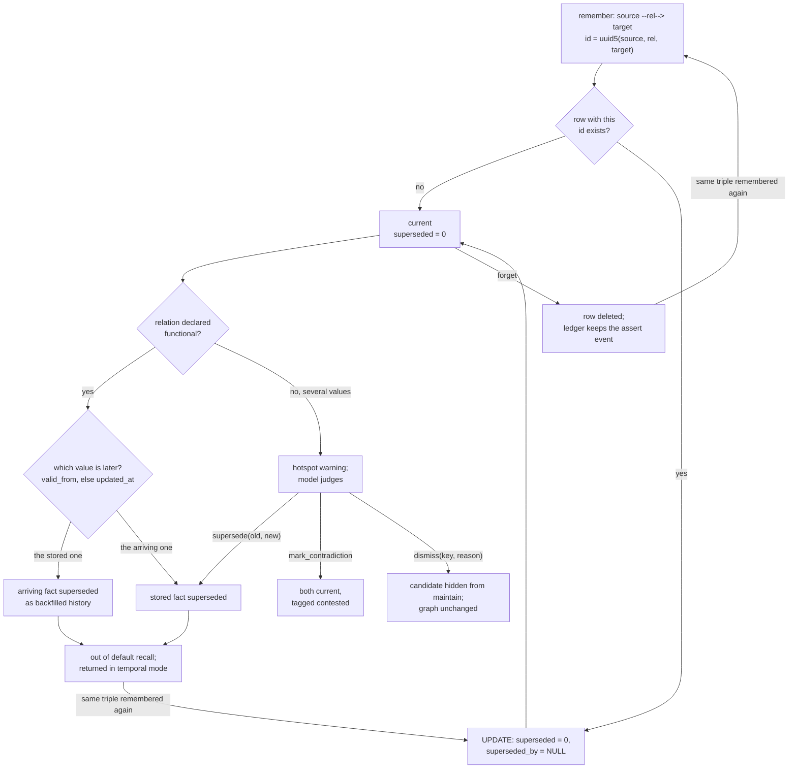

## 1. Executive Summary

Memoose is a local memory plugin for coding agents: a typed knowledge graph
of entities and relations in one SQLite file per project, read and written
through a CLI, 26 MCP tools and four skills, and filled in the background by
a Haiku "keeper" that Claude Code's Stop hook launches through `claude -p`.
The engine never calls a model; extraction and judgement are the host model's
job, directed by skills.

What is notable is the correction vocabulary. Every fact carries an evidence
pointer. A relation declared functional keeps one current value, ordered by
`valid_from` rather than by arrival. A provenance table records every write,
and a dismissal ledger stops maintenance proposing a declined candidate twice.

What is weak is that supersession is keyed on the record, not the value:
re-asserting an old fact clears its flag. The capture keeper runs with an
unrestricted shell and no permission prompt over transcript text.

The project began on 6 September 2026 as `mnemoth`, a port of
[cognee](../cognee/) with the model calls replaced by skills, and was renamed
on 9 September 2026. Its benchmark documentation is unusually candid,
including a paired test showing the graph does not beat plain chunk retrieval
on LoCoMo; the headline 90.4 was measured with the graph empty (section 10).

Three marks: `bitemporal`, `audit_log` and `negative_eval`. Section 9 names
the four withheld.

## 2. Mental Model

A memory is a **Fact**: `source --relation--> target` between two typed
entities, with a description, an evidence pointer and optional validity
dates. Its identity is a UUIDv5 of the source id, the relation name and the
target id (`src/memoose/graph/ids.py:25-27`), so the same triple always lands
on the same row. A fact becomes current the moment `remember` commits it.
There is no candidate state.

**A fact stops being current in three ways.** A later assertion of a
*functional* relation supersedes the older value automatically, unless the
older one carries a later `valid_from`, in which case the arrival is filed as
backfilled history (`src/memoose/graph/contradictions.py:68-102`). A model
calls `supersede(old, new, reason)` after judging a hotspot. Or `forget`
deletes the row outright. Superseded rows stay, flagged, and leave default
recall.

**The flag is not sticky.** `upsert_relation` on an existing id sets
`superseded=0, superseded_by=NULL` (`src/memoose/store/sqlite_store.py:226-237`).
Re-asserting a superseded fact therefore revives it. On a functional relation
where neither value is dated, the revived row then has the newer
`updated_at`, and `supersede_functional` retires the value that had replaced
it. A forgotten fact re-asserted by the next capture is simply new. This was
read, not reproduced.

**Contradictions are annotations.** `mark_contradiction` records a pair with
a reason and a confidence; recall tags both facts `contested` and returns
them (`src/memoose/graph/retrieval.py:235-236`). Resolution is a later
`supersede`.

## 3. Architecture

`src/memoose/` is three layers and two entry points: `store/` (SQLite schema,
store, embeddings, dataset paths), `graph/` (ontology, retrieval,
contradictions, maintenance, sessions, procedures), the `Engine` facade in
`engine.py`, and two surfaces over it, `server.py` (MCP over stdio) and
`cli/main.py` (`CONTEXT.md` states the layering). `harness/` holds what
reaches the host without importing the package: skills, a subagent
definition, and six stdlib-only hook scripts that open the SQLite file
read-only.

A **Dataset** is one file, `~/.memoose/<name>.sqlite`. The default name is
the working directory's basename plus the first eight hex digits of a SHA-1
of its resolved path (`src/memoose/store/datasets.py:27-31`), and `user` is a
second file for facts that hold everywhere. The hooks re-implement the naming
rule and a test asserts they agree (`tests/test_hooks.py:30-36`).

Each file carries the graph, an FTS5 table, an `embeddings` table of float32
blobs keyed by kind, id and model name, context buckets, sessions, lessons
and the provenance ledger (`src/memoose/store/schema.py:3-71`). Vector search
loads every row for the active model name and scores with one numpy matrix
multiply (`src/memoose/store/sqlite_store.py:614-635`). The embedder is
fastembed `bge-small-en-v1.5` when the extra is installed and a hashed
bag-of-words otherwise; vectors written under one name are invisible to the
vector arm under the other.

### Deployment and ergonomics

`pip install memoose` needs Python 3.11 and three dependencies; nothing else
runs. No API key is needed to store or recall. The background keeper and the
advisor need the `claude` CLI and spend the user's own subscription. The store
is plain SQLite and readable by hand, and `memoose view` writes the graph as
one HTML file. On Claude Code the plugin route installs hooks, skills and the
subagent in one step; other hosts get the skills and the CLI.

## 4. Essential Implementation Paths

**Write.** `Dataset.remember` (`src/memoose/engine.py:104-147`) builds typed
rows, refusing an unknown type or a dangling endpoint, embeds them before
opening the transaction, then inside one `with self.store.conn:` upserts
entities, upserts relations, records `assert` or `reassert`, runs
`supersede_functional`, and stores chunks. After commit it computes hotspots
over the touched entities and returns them as a warning.

**Capture.** `harness/hooks/capture.py` runs on Stop and PreCompact with
`async: true`. It reads the transcript from a per-session byte cursor, drops
tool calls, tool results, thinking and injected system text
(`harness/hooks/_common.py:120-159`), skips slices under 400 characters, and
pipes the rest into `claude -p --model haiku` with a prompt that tells the
keeper to write through `memoose remember` (`capture.py:42-82`, `:171-186`).

**Recall.** `Engine.recall` (`engine.py:561-580`) opens the project dataset
and `user`, runs `Recaller.recall` on each and merges with a reserve of
`limit // 4` slots for the second. `Recaller` routes by regex, fuses FTS5 and
vector hits with RRF at k=60, expands the top entities to their relations,
and multiplies by frequency and feedback weights
(`src/memoose/graph/retrieval.py:73-221`).

**Inject.** `session_start.py` prints standing context, the five latest
lessons and the eight most-mentioned entities, capped at 4,000 characters.
`recommend.py` runs a bm25 search of the prompt against both datasets and
injects at most four hits plus two-hop procedure guidance, each capped at 900
characters (`harness/hooks/recommend.py:66-131`).

**Correct.** `supersede` (`engine.py:281-288`), `mark_contradiction`
(`:265-279`), `merge_entities` (`:476-493`), `dismiss` (`:230-246`) and the
`forget_*` methods (`:524-535`, `:599-608`).

**Maintain.** `Dataset.maintenance` (`engine.py:429-470`) returns one worklist:
hotspots, open contradictions, near-duplicate names, co-occurring pairs,
stale bucket summaries and undistilled sessions, each filtered against
dismissals. It decides nothing.

## 5. Memory Data Model

| Table | Holds | Notes |
| --- | --- | --- |
| `entities` | name, type, description, mentions | id from the case-folded name; the longer description wins on merge |
| `relations` | source, target, name, description, evidence, chunk | `superseded`, `superseded_by`, `supersession_reason`, `weight`, `valid_from`, `valid_to`; Transition columns `condition`, `advice`, `pitfall` and outcome counters |
| `contradictions` | two relation ids, reason, confidence | `resolved_by` set when either side is superseded |
| `chunks`, `entity_chunks`, `fts`, `embeddings` | source text and indexes | FTS rows are not removed on supersession |
| `sessions`, `session_turns`, `session_context`, `lessons` | the working loop | context entries retire by `retired_at` |
| `provenance` | at, actor, action, kind, ref_id, payload | insert-only |

**Evidence is a string the writer supplies**, such as
`repo://src/auth.py#L40-L82` or `user said 2026-09-18`. Nothing resolves or
verifies it; the keeper prompt tells the model to fill it.

**Scope is the file.** No table has a user, project or tenant column, and no
query carries a scope predicate. Every MCP tool accepts a `dataset` argument
and `list_datasets` returns every file in the data directory, so an agent in
one project can read or write another project's memory by name
(`src/memoose/server.py:150-152`).

**Time.** Relations carry record time (`created_at`, `updated_at`, REAL
epoch) and validity time (`valid_from`, `valid_to`, free text). Supersession
overwrites `updated_at`; the time a fact was superseded is kept only in its
`supersede` ledger row.

## 6. Retrieval Mechanics

The router scores twelve regexes and picks `hybrid`, `facts`,
`neighbourhood`, `lexical`, `summaries`, `temporal`, `rules` or `session`
(`retrieval.py:30-59`). In the committed LoCoMo run it chose `temporal` for
551 of 1,540 questions.

**Temporal mode returns superseded facts regardless of the caller's flag**
(`retrieval.py:147-148`). A query containing *when*, *before*, *since* or a
year therefore gets old values beside current ones, each tagged
`superseded: true`. Every other mode drops them in `_facts_payload`
(`:226-227`).

The hooks cannot import the engine and filter separately. `search_memory`
removes superseded relation ids after the FTS query, and its docstring gives
the reason: supersession leaves the FTS row in place, so a replaced fact can
outrank its replacement (`harness/hooks/_common.py:192-227`). Chunks are
never filtered: source text that stated an old value is returned by `hybrid`
recall with no marker.

Injection is bounded: 4,000 characters at session start, 1,800 per prompt.
`SessionStart` opens only the project file (`session_start.py:83`), so the
user dataset reaches the model through the per-prompt hint and `recall`, not
at session start.

## 7. Write Mechanics

Explicit writes are synchronous and model-free: validation, one transaction,
provenance in the same transaction. Entities merge by case-folded name;
relations merge by triple, keeping the longer description and coalescing
evidence and dates.

**Capture is deferred and unbounded in time.** The keeper runs after the turn
with a 300-second timeout and up to 24 turns. A captured fact is retrievable
when the keeper's `memoose remember` commits, typically within a minute of
the turn ending; nothing in the tree measures it. One capture per session
runs at a time under a lock file that goes stale after 900 seconds.

**A failed keeper can lose the slice.** `subprocess.run` is called without
`check` and its return code is not read, so only a missing binary or a
timeout returns `None` and leaves the cursor in place; any other failure,
such as an authentication error or a rate limit, advances the cursor past the
slice (`capture.py:180-185`). The advisor beside it does read the return code
(`harness/hooks/advisor.py:233-236`).

**What the keeper stores is the model's call.** The prompt lists what to keep
and what to skip, and tells it to declare a functional relation and store
both values when a fact changed. Nothing filters content, and the keeper is
told to reply `NOTHING` when unsure.

### Operational cost

- Write, explicit: synchronous, milliseconds plus one embedding batch.
- Write, captured: one Haiku `claude -p` run per turn over 400 characters,
  asynchronous, never blocking the conversation.
- Background: no daemon; the SessionStart hook suggests `memoose maintain` at
  most once per 24 hours, and the agent or the `memory-keeper` subagent runs it.
- Read: up to 4,000 characters at session start and 1,800 per prompt, both as
  `additionalContext` appended after the system prompt.

## 8. Agent Integration

The MCP server exposes 26 tools across ontology, write, read and session
groups (`src/memoose/server.py:50-191`). The CLI mirrors them, and
`memoose tool <name>` reaches any public engine method with JSON arguments.
Skills teach the host model when to recall, how to phrase facts, how to judge
maintenance candidates and how to onboard a project from its README and git
log. The `memory-keeper` subagent runs on Haiku with fifteen memoose tools and
is told never to write Procedures.

The procedural half follows *Procedural Graphs*
([arXiv:2609.09153](https://arxiv.org/abs/2609.09153), Lu, Chen, Wu and Arik,
8 September 2026). A Procedure is an entity, a Transition a relation between
two, and `session_end(outcome)` adds the outcome to every Transition the
session's declared positions traversed (`src/memoose/graph/procedures.py:72-81`).
Guidance is keyed only on a position the agent declares.

The advisor is a second Haiku session fed the primary's transcript deltas. It
has `Read`, `Grep`, `Glob`, `memoose recall` and one advisory script, and no
permission bypass; a test asserts that (`tests/test_advisor.py:118`).

## 9. Reliability, Safety, and Trust

**The keeper is the widest surface.** It runs `claude -p` with
`--allowedTools Bash` and `--dangerously-skip-permissions` in a temporary
directory, over user and assistant text from the transcript
(`capture.py:171-176`). `Bash` without a pattern admits any command. Text an
assistant quoted from a web page or a file reaches a model that holds a shell
and asks no one. The advisor, built in the same week, runs on an allowlist
and has a test asserting it, and the capture test asserts only that
`--allowedTools Bash` is present (`tests/test_hooks.py:173`).

**Corrections do not hold.** Supersession is a flag on a row keyed by its
triple, and the write path clears it (section 2). A keeper that sees an old
value restated, or an onboarding run over an old README, revives it. With
`valid_from` on both values the functional ordering holds; without it, write
order decides.

**Dismissals are keyed on a candidate, not on its contents.** A hotspot's key
is `hotspot:<source_id>:<relation>` (`contradictions.py:61`), so dismissing
"Alice works at two places, both fine" also hides a third employer from
`maintain` and `contradiction_candidates` later (`engine.py:227`, `:441`).
The per-write warning is unfiltered and still fires (`:144`). `dismissed()`
reads the latest 200 dismissals (`sqlite_store.py:384-397`), so older ones
lapse.

**Provenance is uniform.** Every row's actor is `host-model`
(`engine.py:23`), whether the keeper, the subagent, the primary model or a
person at the CLI wrote it.

Capability marks:

- `bitemporal`, `audit_log`, `negative_eval` — awarded; evidence in the
  frontmatter records and section 10.
- `tombstone` — withheld. Supersession and dismissal are keyed on a row id
  and a candidate key; `remember` consults neither, and re-assertion clears
  the supersession.
- `trust_state` — withheld. `superseded` is a two-value replacement marker
  that filters most recall modes, not an epistemic status: temporal mode
  ignores it and the write path clears it. `contested` is disclosure only.
- `scope_enforced` — withheld. One file per dataset is a physical partition;
  no row carries a scope key and no read carries a predicate.
- `human_review` — withheld. The upkeep skill tells the model to ask the user
  which contradicted fact is right, and `supersede` is a tool the same model
  holds. The request is prose.

## 10. Tests, Evals, and Benchmarks

I built and ran nothing; everything below is from reading the tests and the
committed result files at the pin. CI runs `uv run pytest -q` on every push
(`.github/workflows/ci.yml:19`).

**The negative cases.** `test_recommend_never_hints_a_superseded_fact`
(`tests/test_hooks.py:381-409`) runs the real hook against a store holding a
superseded and a current region and asserts the current one is injected and
the old one is not. `test_functional_relation_supersedes_older_value`
(`tests/test_core.py:28-41`) asserts default recall returns exactly `Bob` and
history returns both. `test_superseded_transition_leaves_guidance_and_dismissals_show`
(`tests/test_procedures.py:105-114`) asserts the exact hop-one set after a
Transition is superseded.

**Hooks.** 29 functions cover the transcript reader, the capture gate, the
lock, the kill switches, the hint's user reserve and the maintenance stamp,
using a fake `claude` binary that records its arguments.

**Not covered.** No test re-asserts a superseded or forgotten fact. No test
queries one dataset and asserts another's facts are absent from a non-empty
result; `test_project_then_user_dataset_with_reserve` asserts `not any(...)`
over a result that could be empty (`tests/test_core.py:240-241`). No test
checks the keeper's return code.

**LoCoMo.** `benchmarks/locomo/results/full-haiku-k20/` holds all 1,540 rows,
and they recompute to the README's 90.4 (1,392 correct), its per-category
scores and its $88.55. The run's `ingest` is `chunks`: turns are chunked
deterministically and speakers become entities, so 1,500 of 1,540 questions
saw one fact and 40 saw none. The headline measures FTS5 plus vector chunk
retrieval with a Haiku answerer, not the graph or its extraction. The
two-arm test on 45 questions reports 40/2/3/0 discordance and McNemar
p = 1.00 at 77% more prompt tokens for the graph arm, and says so plainly.

**LongMemEval** is a 30-question pilot at 83.3, also chunk-ingested; its
knowledge-update type scored 3 of 5.

**Paper.** The tree cites *Procedural Graphs* only. `.gitignore` excludes
`paper/*` and names a `memoose.bbl` kept for arXiv, so any paper source is
outside the tree; a web search for the project's title on 30 September 2026
found no arXiv entry.

## 11. For Your Own Build

### Steal

- **Order a single-valued relation by validity time, then by arrival.** A
  backfilled old value should become history, not replace the present.
- **Filter superseded rows in every reader, including the ones that cannot
  import your library,** and test each reader against a store holding both
  values. The docstring on `search_memory` names the exact failure.
- **Record a declined maintenance candidate with its reason** and show the
  reason next time, so the same judgement is not redone.
- **Keep the engine model-free** and put extraction in a replaceable
  background job; the store then behaves identically whoever fills it.
- **Publish the benchmark rows and the result that cuts against you.**

### Avoid

- **An upsert that silently un-supersedes.** If a replaced value can arrive
  again, check the history before clearing the flag, or key the rejection on
  the value.
- **Giving a background extractor a general shell with prompts disabled.**
  A keeper that only needs `remember` should hold only `remember`.
- **Advancing a cursor on a process you did not check.** A best-effort job
  still has to distinguish "nothing to keep" from "never ran".
- **Keying a dismissal on the question rather than the answer.** A later
  value on the same subject is a new question.

### Fit

This suits one developer running Claude Code on a few long-lived projects who
wants decisions and ownership facts kept with a pointer to their source, and
is content with a local file per project. It assumes the host model's
judgement is good enough to run upkeep unsupervised and that the transcript
is trusted input. Anyone whose sessions read untrusted web content, or who
needs a correction to stay corrected, should read sections 2 and 9 before
installing the hooks. The graph's advantage over chunk retrieval is argued
for tasks the committed benchmarks do not test.

## 12. Open Questions

- Does a re-asserted superseded fact appear in practice? The keeper reads
  each transcript slice once, so revival needs a restatement or an onboarding
  re-run; how often that happens is unmeasured.
- Does Claude Code expose tools beyond Bash to a `claude -p` run started with
  `--allowedTools Bash --dangerously-skip-permissions`? The report assumes
  only that Bash is unrestricted.
- How does the agent-ingested graph arm score on all 1,540 questions?
- Is a paper in preparation, given the ignored `paper/` directory?

## Appendix: File Index

- **Storage/schema:** `src/memoose/store/schema.py`,
  `src/memoose/store/sqlite_store.py`, `src/memoose/store/datasets.py`,
  `src/memoose/store/embeddings.py`, `src/memoose/graph/ids.py`.
- **Write and correction:** `src/memoose/engine.py`,
  `src/memoose/graph/contradictions.py`, `src/memoose/graph/memify.py`,
  `src/memoose/graph/ontology.py`.
- **Retrieval:** `src/memoose/graph/retrieval.py`,
  `src/memoose/graph/procedures.py`, `src/memoose/graph/sessions.py`.
- **Hooks:** `harness/hooks/_common.py`, `capture.py`, `session_start.py`,
  `recommend.py`, `advisor.py`, `deliver.py`, `hooks.json`.
- **Surfaces:** `src/memoose/server.py`, `src/memoose/cli/main.py`,
  `harness/skills/*/SKILL.md`, `harness/agents/memory-keeper.md`.
- **Design:** `CONTEXT.md`, `docs/adr/0001` to `0006`.
- **Tests and benchmarks:** `tests/test_core.py`, `tests/test_hooks.py`,
  `tests/test_procedures.py`, `tests/test_advisor.py`,
  `benchmarks/locomo/RESULTS.md`, `benchmarks/locomo/results/full-haiku-k20/`.

### Recorded searches

Checked against the checkout at the pinned revision.

- `grep -rnE 'UPDATE provenance|DELETE FROM provenance' . --include='*.py'` — no match; the ledger is insert-only.
- `grep -rn 'upsert_relation\|dismissed()' --include='*.py' src harness` — two write callers (`engine.py:126`, `:276`), neither consulting dismissals or supersession history.
- `grep -rn 'valid_to' tests src harness` — schema, model, CLI argument, upsert, payloads and viewer; no predicate reads it.
- `grep -rn 'reassert' tests src harness` — `engine.py:131` only; no test re-asserts a superseded fact.
- `grep -rn 'dangerously' --exclude-dir=.git .` — `harness/hooks/capture.py:175`, `benchmarks/locomo/run_locomo.py:138`, and the advisor test's negative assertion.
- `grep -c '@server.tool' src/memoose/server.py` — 26.
- `grep -rn 'tenant\|user_id\|WHERE.*dataset' --include='*.py' src` — no match; no scope column or predicate.
- `grep -rliE 'arxiv|bibtex|@article|@misc|doi\.org|CITATION' --exclude-dir=.git .` — the ADRs, README, site pages and `.gitignore`, all citing [arXiv:2609.09153](https://arxiv.org/abs/2609.09153), the *Procedural Graphs* paper; no `CITATION.cff`.
- `grep -rniE 'renamed|formerly' --exclude-dir=.git --exclude-dir=results .` — no match; the rename from `mnemoth` is in the commit log (`gh api repos/AndrewNgo-ini/memoose/commits`, 9 and 20 September 2026).

## History

**2026-09-30** — [`7708331ede1bcb8d1397c354c593e4bc8a066f42`](https://github.com/AndrewNgo-ini/memoose/commit/7708331ede1bcb8d1397c354c593e4bc8a066f42) — first reading, at the head of `main`, a commit dated 25 September 2026. Three marks: `bitemporal`, `audit_log`, `negative_eval`. Screened before reading: two auto-run surfaces (`.claude-plugin/`, `mcp.json`), one build-time execution point (`tests/conftest.py`), two dependency files inside the cooldown — every file in a depth-1 clone dates to the tip — and no unpinned surface; `CONTEXT.md` and the skills read as data. The LoCoMo headline was recomputed from the committed rows with a short Python script over the JSONL; nothing from the tree was installed, built or run.
