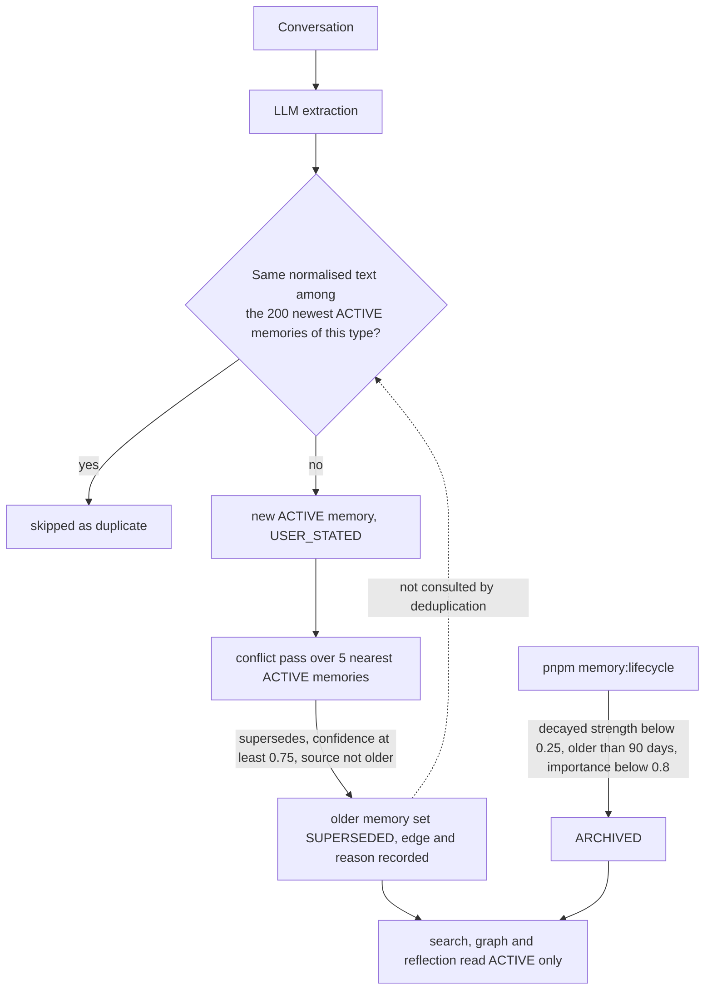

## 1. Executive Summary

Memora Engine is a TypeScript memory service — Fastify, Zod, Prisma over Postgres with pgvector — built by one author in eleven commits between 2 and 6 September 2026. The repository carries **no licence file** and GitHub reports none, so by default nothing in it is licensed for reuse; that is stated here so a reader knows what they may do with what they read, and it changes nothing about the analysis. A second, unrelated project of the same name is [Memora](../memora/).

Its design turns on one idea done carefully: **a memory that stops being true is marked, not removed.** When extraction stores a new memory, a conflict pass asks a model to classify the new memory's relationship to its five nearest active neighbours — `supersedes`, `refines`, `coexists` — and a `supersedes` verdict above a 0.75 confidence threshold flips the older memory to `SUPERSEDED` and writes a `memory_relationships` row carrying the model's reason, both in one transaction. A guard refuses to let an older memory supersede a newer one. Search, graph expansion and reflection all read `ACTIVE` rows only.

The part worth the atlas's `negative_eval` mark is the test that proves it. The committed evaluation seeds twenty-five memories for one fictional user — one already superseded, one archived — runs twenty-six queries through the production search path, and asserts that no superseded or archived memory reaches any query's top five. The result sets are populated by construction, and the case can fail: with the status filter removed, the stale memory ranks second for the query that asks what the user currently prefers.

The gap sits one step upstream of all that care. Extraction's deduplication compares a candidate only against *active* memories of the same type. A superseded value is not active, so if the conversation repeats it, it is stored again as a fresh memory — and because it is now the newer of the two, the guard that stops an older memory superseding a newer one lets it supersede the correction. The supersession record exists, keyed on the memory rather than the value, and nothing on the write path consults it. That is the tombstone this design is one lookup away from, and why the mark is withheld.

## 2. Mental Model

A memory is born `ACTIVE` with an origin of `USER_STATED`, extracted from a conversation. It can leave `ACTIVE` three ways: a conflict pass supersedes it, the lifecycle pass archives it for low strength and age, or a person archives it through the API. A restored memory returns to `ACTIVE`. A second origin, `LLM_DERIVED`, is reserved for reflections — patterns a model derives from several user-stated memories — and it is set by the reflection path only; the create and update APIs refuse it.

Status and origin do different jobs, and it matters which. Status is what retrieval filters on: a `SUPERSEDED` or `ARCHIVED` memory is invisible to search, graph expansion and reflection. Origin is what reflection filters on: an inferred memory is never used as evidence for another inference. Origin does not withhold anything from search — a reflection is retrieved like any memory, and the evaluation asserts that it should be.



## 3. Architecture

One Node service and one Postgres database with the pgvector extension. `docker-compose.yml` stands up both; Prisma migrations create the schema. The model calls — extraction, conflict classification, reflection, and the demo agent's chat — go to an OpenAI-compatible provider configured by environment, and embeddings to a 1,536-dimension provider. There is no queue, no worker and no scheduler: every mechanism runs inside a request, except decay and archival, which run when an operator invokes `pnpm memory:lifecycle`.

`src/modules/` is organised by capability — `memory-formation`, `memories` (CRUD, search, ranking, lifecycle), `conflicts`, `consolidation`, `reflection`, `graph`, `embeddings`, `agent` — each with a routes, service, repository and schema file. `src/sdk/` is a typed client with no business logic, and the demo agent under `src/modules/agent/` calls the service through it, which makes the SDK an exercised surface rather than a stub. `showcase/` is a static Next.js page describing the project, not a memory interface.

## 4. Essential Implementation Paths

### Formation

`MemoryFormationService.extractAndSave` (`src/modules/memory-formation/memory-formation.service.ts:42-93`) extracts candidates with the model, drops any under five characters, and deduplicates each against the batch and against storage by `hasExistingDuplicate` (`:110-124`), which lists up to `DEDUP_SCAN_LIMIT = 200` memories of the same type with `status: 'active'` and compares lowercased, whitespace-collapsed text. Embeddings for every surviving candidate are generated and validated before anything is inserted, so an embedding failure leaves no partial batch. Each memory is then created and handed to the conflict pass inside a `try` that logs and continues: conflict analysis must never block formation.

### Conflict resolution

`ConflictService.analyzeAndPersist` (`src/modules/conflicts/conflict.service.ts:55-115`) fetches the `MEMORY_CONFLICT_CANDIDATE_LIMIT` (default 5) nearest active memories with `findSimilarMemories`, asks the model to classify each pairing, and keeps a relationship only if its confidence reaches `MEMORY_CONFLICT_CONFIDENCE_THRESHOLD` (default 0.75), the id it names was among the candidates shown, and — for `supersedes` — the source is not older than the target (`:95-98`). `persistAcceptedRelationships` (`src/modules/conflicts/conflict.repository.ts:51-90`) upserts each edge and, for a `supersedes` edge, sets the target's status to `SUPERSEDED` inside the same transaction. `POST /memories/:id/resolve-conflicts` runs the same pass on demand for an existing memory.

### Search and ranking

`MemorySearchService.search` (`src/modules/memories/memory-search.service.ts:40-110`) runs a semantic arm — cosine distance over pgvector, `WHERE status = 'ACTIVE'`, ordered and limited to `MEMORY_CANDIDATE_LIMIT` (default 20), with an optional similarity floor — and a keyword arm over `to_tsvector('english', content) @@ plainto_tsquery(...)`, also `ACTIVE` only (`src/modules/memories/memory.repository.ts:185-230`). `mergeCandidates` unions them and `rankMemories` scores each by five weights that must sum to one: semantic 0.4, keyword 0.2, importance 0.15, confidence 0.15, recency 0.1, with recency decaying over thirty days (`src/config/env.ts:17-23`). An optional `minScore` filters, the top `limit` are returned, and only those have their access recorded and strength reinforced (`:71-77`).

### Lifecycle

`LifecycleService.runMaintenance` (`src/modules/memories/lifecycle/lifecycle.service.ts:79`) evaluates every active memory against a pure policy: strength decays exponentially over `MEMORY_DECAY_DAYS` (30) from its last access, and a memory whose effective strength falls below 0.25 and whose age exceeds 90 days is archived — unless its importance is 0.8 or higher, which protects it outright (`src/modules/memories/lifecycle/lifecycle.policy.ts:40-58`). Its only callers are `scripts/lifecycle-maintenance.ts`, exposed as `pnpm memory:lifecycle`, and the lifecycle tests.

### Reflection and consolidation

`POST /memories/reflect` expands a seed through the relationship graph, keeps only nodes that are `active` and `user_stated` (`src/modules/reflection/reflection.service.ts:115`), refuses outright if an explicitly named memory is `LLM_DERIVED` (`:43`), and stores the model's pattern as a new `LLM_DERIVED` memory with `DERIVED_FROM` edges to its evidence. `POST /memories/consolidate` merges several memories into one and records `CONSOLIDATES` edges back to the originals.

## 5. Memory Data Model

| Field | Meaning |
| --- | --- |
| `memoryType` | `SEMANTIC`, `EPISODIC` or `PROCEDURAL`, set by extraction |
| `content` | the memory as text |
| `importance`, `confidence` | 0–1 floats from extraction; ranking signals |
| `strength`, `accessCount`, `lastAccessedAt` | reinforced on retrieval, decayed by the lifecycle pass |
| `status` | `ACTIVE`, `ARCHIVED` or `SUPERSEDED` — what every read path filters on |
| `origin` | `USER_STATED` or `LLM_DERIVED` — what reflection filters on |
| `embedding` | `vector(1536)`, nullable, backfilled by `pnpm memory:backfill` |

`memory_relationships` holds one row per `(source, target, type)` with a confidence and a free-text `reason`, typed `SUPERSEDES`, `REFINES`, `COEXISTS`, `CONSOLIDATES` or `DERIVED_FROM`, and cascades on delete of either end.

There is no user, tenant, agent or session key anywhere in the schema. One deployment holds one person's memory.

## 6. Retrieval Mechanics

Retrieval is always hybrid and always filtered to `ACTIVE`. The semantic arm has no similarity floor unless a caller passes `minSimilarity`, so over any non-empty corpus it returns its full candidate limit; the keyword arm returns only rows that match the query's lexemes. The two are merged by id, so a memory found by both carries both scores. Ranking is a weighted sum rather than a reranker, and `includeScores: true` returns the per-feature breakdown for every result, which is the design's answer to *why was this retrieved*.

Graph retrieval — `GET /memories/:id/graph` and `/related` — walks relationship edges to a bounded depth and excludes `ARCHIVED` and `SUPERSEDED` neighbours, never expanding through them.

## 7. Write Mechanics

A write through `/extract-and-save` blocks the caller for one extraction call, one batched embedding call, the inserts, and one conflict-classification call per created memory. A memory is retrievable as soon as its insert commits, before its conflict pass has run; if the pass fails, the memory stays and the failure is logged. Supersession therefore lags the write by the duration of one model call, and a crash between the insert and the pass leaves two contradicting active memories until someone calls `resolve-conflicts`.

No background pass rewrites the store. The lifecycle command changes status and strength on the rows its policy selects, and nothing else.

## 8. Agent Integration

The integration surface is the REST API and the SDK. The demo agent (`src/modules/agent/`) is a real consumer: `POST /agent/chat` searches memory through the SDK, puts the retrieved memories into the model's context, answers, and returns `memoriesUsed` so a caller can see what grounded the reply. There is no MCP server and no framework adapter.

## 9. Reliability, Safety, and Trust

**Supersession is a record of the memory, not of the value.** The `SUPERSEDES` edge names two memory ids and a reason, and the loser's status is `SUPERSEDED`. That is everything a tombstone needs except the key. Deduplication asks *is this exact text among the active memories* — `status: 'active'` at `memory-formation.service.ts:119` — so the one place a rejected value could be refused on its way back in does not look where it is kept. The sequence the code permits: the user says they prefer MongoDB; later they switch to PostgreSQL and the conflict pass supersedes the MongoDB memory; later still, a conversation mentions preferring MongoDB in passing, extraction stores it as a new active memory, and the conflict pass — comparing it against the PostgreSQL memory, which is now the older of the two — is allowed by the age guard to classify the new MongoDB memory as superseding the correction. Whether the model does so is not certain; nothing in the tree prevents it.

**The deduplication window is also bounded.** It scans the 200 most recent memories of the candidate's type, and a comment in the file calls that a placeholder until indexed lookup exists. An exact duplicate older than that window is stored again.

**Deletion is real and unrecorded.** `DELETE /memories/:id` calls `prisma.memory.delete` (`memory.repository.ts:123-125`), and the relationship rows cascade with it, including any `SUPERSEDES` edge that explained why another memory is current. The README's statement that nothing is hard-deleted is true of the lifecycle; it is not true of the API.

**No scope, and no authentication in the tree.** There is no user key to filter on, and no route checks a caller's identity. Deployed as it stands, anyone who can reach the service can read and rewrite the memory.

**Origin is provenance, not a trust state.** `LLM_DERIVED` keeps an inference out of reflection's evidence, which is the design's promise that the system is honest about what it merely inferred. It does not keep an inference out of search or out of the demo agent's context, and nothing moves a memory from one origin to the other. That is why `trust_state` is withheld: there is no status at which a memory is held back from being treated as true.

## 10. Tests, Evals, and Benchmarks

Eighteen test files, 3,760 lines, under `tests/`, run by Vitest against a real Postgres that each file truncates between cases — which is why `vitest.config.ts` disables file parallelism. The repository has no `.github/` directory and so no CI. I did not run the suite; everything below is read from the committed files.

**The evaluation is the strongest thing here.** `src/evaluation/` holds a twenty-five-memory dataset for one fictional user and twenty-six queries across semantic, keyword, paraphrase, conflict, refinement, archival, reflection and unrelated categories, each with `relevantKeys` and, for four, `excludedKeys`. `pnpm evaluate` runs it with a deterministic fake embedder and prints recall@5, hit rate@5 and MRR for the hybrid path against a keyword-only baseline. `tests/evaluation/evaluation.service.test.ts` turns it into assertions: hybrid beats the keyword baseline on recall and MRR, recall@5 is at least 0.75, hit rate at least 0.85, MRR at least 0.65, and — the case the mark rests on — `leakedExcludedKeys` is empty for every query (`:42-49`). That last assertion is not vacuous. The search call passes no floor, so every query returns ranked active memories. And it discriminates: I reproduced the evaluation's scoring offline — the same hashing-trick embedder at 1,536 dimensions, the default weights, the seeded importances and the seeder's default confidence of 0.9, with recency tied because every memory is seeded within milliseconds — and with the `status = 'ACTIVE'` predicate removed the superseded *I prefer MongoDB for backend projects* ranks second for q4, *What database does the user currently prefer?*, and fourth for q5, *PostgreSQL*. The keyword arm contributes nothing to q4, because `plainto_tsquery` ANDs every lexeme and no memory contains all of them. That is a computation, not a run of the suite. A separate check in the same file drives the real conflict pass with a scripted model and asserts the older memory ends `SUPERSEDED`.

**Several other exclusion tests are vacuous.** `conflict.test.ts:258-268` seeds one memory, supersedes it, and asserts it is absent from `findSimilarMemories`; `lifecycle.test.ts:130-141` does the same for an archived memory and search; the graph tests at `graph.test.ts:176-196` and `:248-257` assert a graph of only the seed node and an empty related list. Each would pass against a read path that returned nothing. The reflection test at `reflection.test.ts:325-346` asserts archived and derived memories are absent from the reflection prompt without asserting the active neighbour is present. None is needed for the mark; each is one `expect(...).toContain(control)` from being a real case.

No paper, no external benchmark. `scripts/evaluate-llm.ts` runs the dataset against a live model and embedder, and no output from it is committed.

## 11. For Your Own Build

### Steal

- **The leak test.** Seed a small realistic corpus with retired memories in it, run the production search path with no score floor, and assert no retired memory reaches the top *k* for any query. It costs one `it` block and it is the test most memory systems here do not have.
- **The age guard on supersession.** A contradiction classifier will sometimes get direction wrong; refusing to let an older memory supersede a newer one bounds what that costs.
- **Keeping the reason.** Every relationship edge stores the model's stated reason, so a supersession can be explained to the person it happened to.
- **Embedding the whole batch before inserting any of it**, so a provider failure cannot leave half a conversation remembered.

### Avoid

- **Deduplicating against the active set only.** The check that decides whether a value is new must also ask whether it was superseded, or the correction can be undone by repetition. The supersession edge already holds what is needed; key a lookup on the normalised text of the loser.
- **A hard delete that takes the explanation with it.** Cascading the `SUPERSEDES` edge on delete removes the record of why the surviving memory is current.

### Fit

A clear, small, well-tested reference for a single-user memory service with supersession, and a good one to read before building one. Not something to deploy for more than one person — there is no scope key and no authentication — and not something to rely on for durable corrections until deduplication consults superseded memories. The absence of a licence means it is a design to learn from rather than code to take.

## 12. Open Questions

- How often, with a real model, the conflict pass classifies a repeated stale value as superseding its correction. The code permits it; frequency is empirical, and `evaluate-llm` would be the place to measure it.
- Whether the maintainer intends the lifecycle command to be scheduled; the tree ships it only as a manual script.

## Appendix: File Index

- Schema: `prisma/schema.prisma`.
- Formation and deduplication: `src/modules/memory-formation/memory-formation.service.ts`.
- Conflict pass and supersession: `src/modules/conflicts/conflict.service.ts`, `conflict.repository.ts`.
- Search, ranking, repository SQL: `src/modules/memories/memory-search.service.ts`, `ranking/`, `memory.repository.ts`.
- Lifecycle: `src/modules/memories/lifecycle/`, `scripts/lifecycle-maintenance.ts`.
- Reflection, consolidation, graph: `src/modules/reflection/`, `src/modules/consolidation/`, `src/modules/graph/`.
- Configuration defaults: `src/config/env.ts`.
- Evaluation: `src/evaluation/`, `tests/evaluation/evaluation.service.test.ts`.

**Searches recorded for the negative claims**

```sh
rg -n "status: 'active'" src/modules/memory-formation/memory-formation.service.ts   # dedup reads ACTIVE only
rg -n "SUPERSEDED|superseded" src/modules/memory-formation                          # 0: formation never consults supersession
rg -n "userId|user_id|tenant|agentId" prisma/schema.prisma src/modules               # 0: no scope key
rg -n "setInterval|node-cron|cron\(|schedule\(" src/modules src/server.ts src/app.ts  # 0: nothing schedules maintenance
rg -n -i "preHandler|onRequest|authenticate|@fastify/auth|jwt|bearer" src/app.ts src/server.ts src/modules --glob '!**/openai*'   # 0: no request authentication
ls .github                                                                           # absent: no CI
```

## History

**2026-09-11** — [`4c3d1aa984c980ff1401d6ee42c6802d4c301065`](https://github.com/Nikeshchaudhary52494/memora/commit/4c3d1aa984c980ff1401d6ee42c6802d4c301065) — first reading. Screened with `scripts/screen_repo.py`: no auto-running configuration and no build-time execution path; four dependency manifests inside the seven-day cooldown and two unpinned surfaces, in the service and the showcase. Nothing was installed, built or run.
