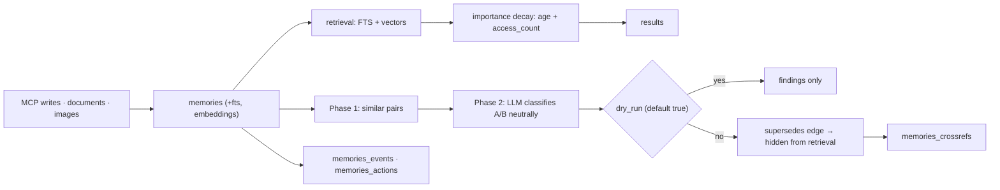

## 1. Executive Summary

Memora is an MIT-licensed MCP memory layer — about 14,900 lines, dominated by `storage.py` (4,881) and `server.py` (3,240), with a `graph/` package, embeddings, document and image ingestion, a dotted-tag hierarchy, and cloud sync to a D1 backend.

Most of that is competent and familiar. One part is not, and it addresses the failure this atlas has spent forty-four reports circling: **correction here can be rehearsed before it is committed.**

Memora's supersession pass runs in three phases — candidate pairs by embedding similarity, LLM classification of each pair, then edge creation — and the signature is:

```python
def ..., dry_run: bool = True, ...
    """
    Phase 1: Find candidate pairs via embedding similarity.
    Phase 2: Classify each pair with LLM (neutral A/B presentation).
    Phase 3: Create supersedes edges for confirmed pairs (unless dry_run).
        dry_run: If True, only report findings without creating edges
    """
```

**The default is `True`.** Reporting is the default behaviour and mutating memory is opt-in. Every other correction mechanism in the atlas acts immediately: [CowAgent](../cowagent/) overwrites `MEMORY.md` on a nightly schedule, [Magic Context](../magic-context/) marks memories stale in place, [Atomic Agent](../atomic-agent/) deprecates rows. None lets an operator ask *what would this change?* first.

The second good idea is the classification vocabulary. Rather than a boolean "is this a duplicate", pairs are sorted into:

```
a_supersedes_b | b_supersedes_a | duplicate | related | contradicts | neither
```

Each is defined in the prompt — `a_supersedes_b` means "A is a strictly newer version of B covering the same topic with updated information, making B fully obsolete." Two properties follow. `contradicts` is a **relation between two identified memories**, not a flag on one, so a contradiction names both parties — more actionable than [Gini](../gini-agent/)'s `conflicted` status or [MateClaw](../mateclaw/)'s detector. And the pair is presented **neutrally as A and B**, with the model deciding direction, rather than being asked to confirm a direction the caller already assumed.

The gap is the familiar one: supersession *hides* a memory from active retrieval, and nothing records the rejected value, so re-ingesting the same content creates it again.

## 2. Mental Model

Six tables, and the last two matter:

```sql
memories             id, content, metadata, tags, created_at, updated_at
                     + importance, access_count, last_accessed (added by migration)
memories_fts         FTS5 over content, metadata, tags
memories_embeddings  vectors
memories_crossrefs   typed edges: supersedes, superseded_by, extends, references, ...
memories_events      what happened
memories_actions     what was done
```

Retrieval ranking folds in decay:

```python
result["importance_score"] = calculate_importance(
    row["created_at"], base_importance, access_count
)
```

so age and use adjust reachability, in the manner the [decay and reinforcement](../../patterns/decay-and-reinforcement/) pattern asks for — and, as that pattern warns, `access_count` rising on retrieval is a self-reinforcing loop.

Correction lifecycle:

```text
embedding similarity → candidate pairs
  → LLM classifies each pair, A/B presented neutrally
      a_supersedes_b | b_supersedes_a | duplicate | related | contradicts | neither
  → dry_run (default) → return findings, change nothing
  → dry_run=False     → write supersedes edges; superseded rows hidden from retrieval
```

## 3. Architecture

- `storage.py` (4,881) — schema, retrieval, importance, the supersession pipeline.
- `server.py` (3,240) — the MCP surface.
- `graph/` — `templates.py` (1,390), `server.py` (820), `data.py` (681).
- `backends.py` (1,141) — storage backends including D1.
- `document.py` (550), `embeddings.py` (418), `image_storage.py` (314).
- `hierarchy.py` — builds a tree from dotted tags (`project.acme.api`).
- `cloud_sync.py`, `schema.py`, `cli.py`.



## 4. Essential Implementation Paths

### A correction pass you can preview

Splitting candidate discovery from classification from mutation is ordinary pipeline hygiene. Defaulting the mutating phase off is the choice worth copying.

It changes what an operator can do. A supersession sweep over a large store is exactly the kind of operation whose blast radius is unknowable in advance — an over-eager classifier can hide dozens of memories that were merely similar. With reporting as the default, the sweep becomes something you run, read, and then decide about, rather than something you discover the effects of afterwards.

The atlas asks for this indirectly in several places — [governed write gateway](../../patterns/governed-write-gateway/) wants mutation concentrated and reviewable, and [Hermes Agent](../hermes-agent/) stages memory writes for human approval. Memora is the first to make *preview* the default posture for automated correction.

### Neutral A/B classification

"Phase 2: Classify each pair with LLM (neutral A/B presentation)" — the model is not told which memory is newer or which the caller suspects is obsolete; it returns the direction as part of its answer (`a_supersedes_b` versus `b_supersedes_a`).

That matters because the alternative anchors the model. Asking "is B obsolete?" invites yes; asking "what is the relation between A and B?" does not presuppose one. For a classifier whose output silently hides memories, removing that anchor is worth the small extra prompt complexity.

### `contradicts` as an edge

Most systems that model contradiction attach a status to a single row — Gini's `conflicted`, or a detector that emits a list. Memora writes the relation into `memories_crossrefs` between two identified memories, so "what does this contradict?" is a graph query rather than a scan.

The vocabulary also distinguishes `duplicate` from `related` from `neither`, which keeps the pipeline from collapsing every similarity into a supersession decision.

### Importance with decay

`calculate_importance(created_at, base_importance, access_count)` blends a base importance, age, and access count into a score used at retrieval. `last_accessed` is tracked alongside.

This sits on the correct side of the atlas's truth/reachability line — it is a ranking signal, not a confidence — but it inherits the reinforcement hazard: retrieval increments `access_count`, which raises `importance_score`, which makes future retrieval more likely.

### Migration-tolerant schema

`_ensure_importance_columns`, `_ensure_updated_at_column`, `_ensure_embeddings_table`, `_ensure_crossrefs_table`, `_ensure_events_table`, `_ensure_actions_table` are each applied idempotently at open, so an older database gains columns and tables without a separate migration step. A comment notes that `memory_absorb` stores source and confidence in metadata rather than columns — an honest record of where the schema was extended sideways.

## 5. Memory Data Model

The base row is deliberately thin — content, tags, metadata, timestamps — with importance and access tracking added by migration, and everything structural pushed into `memories_crossrefs`.

What is absent:

- **No trust or verification state.** A memory is present or superseded; nothing marks it candidate, verified, or rejected.
- **No rejected-value tombstone.** Supersession hides a row from active retrieval; re-ingesting the same content produces a new row that nothing blocks. In a system with document and image ingestion, re-ingestion is a realistic path.
- **No explicit scope** surfaced in the schema; the dotted-tag hierarchy organizes but does not isolate.
- **Provenance lives in metadata**, not in typed columns, so source and confidence are unindexed.

## 6. Retrieval Mechanics

FTS5 over content, metadata, and tags, plus embeddings, with importance decay folded into ranking. The dotted-tag hierarchy (`hierarchy.py` builds a tree from `a.b.c` tags) gives a browsable structure over the same rows, and the `graph/` package provides a separate relational view.

Superseded memories are hidden from active retrieval rather than deleted, so the correction is reversible by removing the edge — a genuinely nice property that pairs well with the dry-run default.

## 7. Write Mechanics

MCP tools for text, with `document.py` and `image_storage.py` handling richer ingestion. `memories_events` and `memories_actions` give an append-only record alongside the rows themselves, which is the [append-only memory audit](../../patterns/append-only-memory-audit/) shape.

No write gate, actor model, or verification tier appears — the sophistication is concentrated in what happens to memories *after* they are written.

## 8. Agent Integration

An MCP server plus a CLI and a separate graph server, with cloud sync to a D1 backend for cross-device use. Positioned as a drop-in memory layer for MCP-speaking agents.

## 9. Reliability, Safety, and Trust

Strengths:

- **Correction defaults to reporting**, not mutating.
- **A defined relation vocabulary** rather than a similarity threshold.
- **Neutral A/B classification** that does not anchor the model on a direction.
- **`contradicts` as an edge** between two named memories.
- **Supersession hides rather than deletes**, so the decision is reversible.
- **Event and action logs** alongside the rows.
- **Idempotent schema upgrades** applied at open.
- **Decay kept in ranking**, not in a confidence field.

Gaps:

- **No tombstone**, so a superseded value can return through re-ingestion.
- **No trust state or verification.**
- **Reinforcement loop** via `access_count`.
- **Provenance in untyped metadata.**
- **No scope isolation** — tags organize but do not separate.
- **A very large `storage.py`** carrying schema, retrieval, importance, and correction together.

## 10. Tests, Evals, and Benchmarks

Nothing was run for this review, and no memory-quality benchmark was found.

For a system whose distinctive feature is a classifier that hides memories, the measurement that matters is **classification precision** — how often `a_supersedes_b` is wrong, and what fraction of a sweep's proposals a human would reject. The dry-run mode makes exactly that measurable, since a run produces a reviewable list without side effects. Nothing indicates it has been done.

## 11. Patterns Worth Stealing

- **Default automated correction to a dry run.** Reporting should be the default and mutation opt-in, for any pass that can hide or delete memory in bulk. This is the most transferable idea here and costs a keyword argument.
- **Classify pairs into a defined vocabulary**, including `neither`, instead of thresholding similarity.
- **Present the pair neutrally** and let the model choose the direction, so the question does not anchor the answer.
- **Make contradiction an edge**, so both parties are named and queryable.
- **Hide rather than delete on supersession**, keeping the correction reversible.
- **Apply schema upgrades idempotently at open** rather than in a separate migration step.

## 12. Antipatterns / Risks

- **Supersession without a tombstone**, in a system that ingests documents and images and can therefore re-ingest.
- **Access-driven reinforcement** in the ranking signal.
- **Untyped provenance** in metadata.
- **One module holding schema, ranking, and correction.**

## 13. Build-vs-Borrow Takeaways

Borrow:

- The `dry_run: bool = True` posture for any bulk correction pass.
- The six-way relation vocabulary and the neutral A/B framing.
- Hiding rather than deleting superseded rows.

Do not copy:

- Supersession as the whole correction story; add a value-level tombstone if content can be re-ingested.
- `access_count` feeding ranking without a counterweight.

## 14. Open Questions

- How precise is the pair classifier? The dry-run output is exactly the artifact needed to find out.
- What stops a superseded memory returning when the same document is ingested again?
- Does anything surface `contradicts` edges to an operator, or do they only sit in the graph?
- Is there a scope boundary beneath the tag hierarchy for multi-user use?
- Does the D1 cloud sync propagate supersession edges, or only rows?

## Appendix: File Index

- Schema and tables: `memora/schema.py` (`memories`, `memories_fts`, `memories_embeddings`, `memories_crossrefs`, `memories_events`, `memories_actions`).
- Storage, ranking, importance, supersession pipeline: `memora/storage.py`.
- MCP surface: `memora/server.py`; graph surface: `memora/graph/server.py`, `data.py`, `templates.py`.
- Backends and cloud: `memora/backends.py`, `cloud_sync.py`.
- Ingestion: `memora/document.py`, `memora/image_storage.py`, `memora/embeddings.py`.
- Tag hierarchy: `memora/hierarchy.py`.
