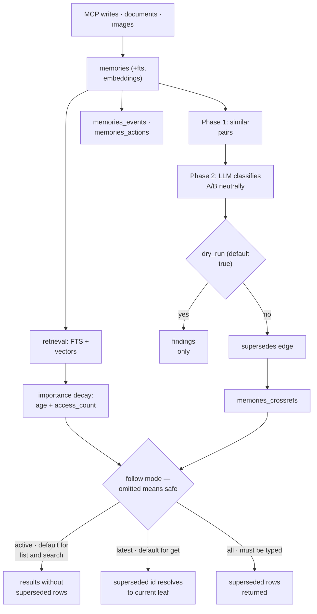

## 1. Executive Summary

Memora is an MIT-licensed MCP memory layer at version 0.3.2 — dominated by `storage.py` (5,229) and `server.py` (3,299), with `embeddings.py` (1,491), a `graph/` package, document and image ingestion, a dotted-tag hierarchy, and cloud sync to a D1 backend.

Most of that is competent and familiar. One part is not, and it addresses the failure this atlas has spent its whole corpus circling: **correction here can be rehearsed before it is committed.**

Memora's supersession pass runs in three phases — candidate pairs by embedding similarity, LLM classification of each pair, then edge creation — and the signature is:

```python
def ..., dry_run: bool = True, ...
    """
    Phase 1: Find candidate pairs via embedding similarity.
    Phase 2: Classify each pair with LLM (neutral A/B presentation).
    Phase 3: Create supersedes edges for confirmed pairs (unless dry_run).
        dry_run: If True, only report findings without creating edges
    """
```

**The default is `True`.** Reporting is the default behaviour and mutating memory is opt-in. Every other correction mechanism in the atlas acts immediately: [CowAgent](../cowagent/) overwrites `MEMORY.md` on a nightly schedule, [Magic Context](../magic-context/) marks memories stale in place, [Atomic Agent](../atomic-agent/) deprecates rows. None lets an operator ask *what would this change?* first.

The second good idea is the classification vocabulary. Rather than a boolean "is this a duplicate", pairs are sorted into:

```
a_supersedes_b | b_supersedes_a | duplicate | related | contradicts | neither
```

Each is defined in the prompt — `a_supersedes_b` means "A is a strictly newer version of B covering the same topic with updated information, making B fully obsolete." Two properties follow. `contradicts` is a **relation between two identified memories**, not a flag on one, so a contradiction names both parties — more actionable than [Gini](../gini-agent/)'s `conflicted` status or [MateClaw](../mateclaw/)'s detector. And the pair is presented **neutrally as A and B**, with the model deciding direction, rather than being asked to confirm a direction the caller already assumed.

The third idea is about what an omitted argument means. Retrieval takes a `follow` mode — `active`, `latest`, `full_history`, `all` — and the public MCP tools resolve an omitted one to a safe default rather than to no filtering (`storage.py:2216`): `memory_list` and `memory_search` default to `active` and exclude superseded rows, `memory_get` defaults to `latest` and resolves a superseded id to the current leaf, and `all` is the explicit forensic escape hatch. The comment says the thing worth quoting: *"None is no longer a public 'give me everything' signal on MCP tools."* Almost every system in this atlas that has a correctness-relevant retrieval argument makes the caller remember it; this one makes forgetting it correct and makes the unsafe reading the one you have to type.

Supersession *hides* a memory from ordinary retrieval, and retirement does more than hide: a `tombstones` row keyed on a normalised hash of the content survives the deleted memory — the schema comment says so literally, *"Tombstones survive the deleted row (no FK)"* — and both automatic ingest paths consult it. `absorb_memory` skips a fact whose digest is tombstoned and reports `action: tombstoned` with the reason the memory was retired for; the import path skips the entry. So the same text cannot re-enter by either route it could previously arrive through. What the gate deliberately does not bind is the operator: `memory_create` is still allowed after a tombstone, and a committed case pins that.

## 2. Mental Model

Six tables, and the last two matter:

```sql
memories             id, content, metadata, tags, created_at, updated_at
                     + importance, access_count, last_accessed (added by migration)
memories_fts         FTS5 over content, metadata, tags
memories_embeddings  vectors
memories_crossrefs   typed edges: supersedes, superseded_by, extends, references, ...
memories_events      what happened
memories_actions     what was done
```

Retrieval ranking folds in decay:

```python
result["importance_score"] = calculate_importance(
    row["created_at"], base_importance, access_count
)
```

so age and use adjust reachability, in the manner the [decay and reinforcement](../../patterns/decay-and-reinforcement/) pattern asks for — and, as that pattern warns, `access_count` rising on retrieval is a self-reinforcing loop.

Correction lifecycle:

```text
embedding similarity → candidate pairs
  → LLM classifies each pair, A/B presented neutrally
      a_supersedes_b | b_supersedes_a | duplicate | related | contradicts | neither
  → dry_run (default) → return findings, change nothing
  → dry_run=False     → write supersedes edges
```

A supersedes edge does not change the row. It changes what the row means to the read path, and the read path has three answers to choose from:

```text
follow=active        → superseded rows are absent            (default for list/search)
follow=latest        → a superseded id returns its leaf      (default for get)
follow=full_history  → the chain, oldest to newest
follow=all           → no lineage post-processing at all     (explicit only)
```

So a memory is never destroyed by being corrected, and is never returned as current by accident. The one deliberate exception is `memory_get_document`, which reads without a follow mode so that historical document versions stay retrievable by version number — an exception with a test asserting it (`tests/test_server.py`, `test_document_get_still_returns_superseded_roots`).

What that picture has no room for is a state meaning anything other than *replaced*. There is no candidate, no verified, no rejected. A memory is present or it has been superseded by another memory, and nothing distinguishes a fact the system checked from a fact it was told.

## 3. Architecture

- `storage.py` (5,229) — schema, retrieval, importance, lineage walking, the supersession pipeline.
- `server.py` (3,299) — the MCP surface.
- `embeddings.py` (1,491) — providers, credential fingerprinting, integrity epochs, rebuild leases.
- `graph/` — the Python viewer: `templates.py`, `server.py`, `data.py`.
- `memora-graph/` — a second viewer, a Cloudflare Worker serving a force-directed graph from D1, with its own test scripts under `scripts/`.
- `backends.py` (1,141) — storage backends including D1.
- `document.py`, `image_storage.py`.
- `hierarchy.py` — builds a tree from dotted tags (`project.acme.api`).
- `cloud_sync.py`, `schema.py` (332), `cli.py`.



## 4. Essential Implementation Paths

### A correction pass you can preview

Splitting candidate discovery from classification from mutation is ordinary pipeline hygiene. Defaulting the mutating phase off is the choice worth copying.

It changes what an operator can do. A supersession sweep over a large store is exactly the kind of operation whose blast radius is unknowable in advance — an over-eager classifier can hide dozens of memories that were merely similar. With reporting as the default, the sweep becomes something you run, read, and then decide about, rather than something you discover the effects of afterwards.

The atlas asks for this indirectly in several places — [governed write gateway](../../patterns/governed-write-gateway/) wants mutation concentrated and reviewable, and [Hermes Agent](../hermes-agent/) stages memory writes for human approval. Memora is the first to make *preview* the default posture for automated correction.

### Neutral A/B classification

"Phase 2: Classify each pair with LLM (neutral A/B presentation)" — the model is not told which memory is newer or which the caller suspects is obsolete; it returns the direction as part of its answer (`a_supersedes_b` versus `b_supersedes_a`).

That matters because the alternative anchors the model. Asking "is B obsolete?" invites yes; asking "what is the relation between A and B?" does not presuppose one. For a classifier whose output silently hides memories, removing that anchor is worth the small extra prompt complexity.

### `contradicts` as an edge

Most systems that model contradiction attach a status to a single row — Gini's `conflicted`, or a detector that emits a list. Memora writes the relation into `memories_crossrefs` between two identified memories, so "what does this contradict?" is a graph query rather than a scan.

The vocabulary also distinguishes `duplicate` from `related` from `neither`, which keeps the pipeline from collapsing every similarity into a supersession decision.

### An omitted argument that means the safe thing

`resolve_follow(follow, *, default, for_get=False)` in `storage.py` is eleven lines and is the whole mechanism. `None` becomes the tool's safe default; the string `"all"` becomes `None` at the storage layer, which is where unfiltered lives; anything else is validated. The storage layer keeps its permissive `None` for internal callers, and the MCP boundary is the place the default is applied.

The distinction that makes this worth copying is that the safe behaviour is not the *only* behaviour. Forensic access is preserved and made explicit, so an operator investigating what the store used to believe types `follow="all"` and gets it. What is removed is the case where an agent that never heard of lineage gets superseded content back because it did not pass a parameter it had no reason to know about.

The one gap the commit that introduced it names in its own message is on the other side: matching lineage during `memory_absorb` is a write-path concern and was left as separate work. So the read path resolves lineage correctly, and the write path can still add a new row asserting what an existing chain already superseded. The tombstone gate does not close this: it is keyed on a normalised hash of the content, so the identical text is refused and a paraphrase of it is not — `_search_snapshot_full` takes no `follow` argument, and absorb's candidate set is not lineage-filtered.

### Provenance on the vector, not just the memory

`memories_embeddings` gained `representation`, `dimension`, `encoding_source` and `writer_token` columns, and `schema.py` installs triggers that maintain an integrity epoch in SQL rather than in application code. When the read path finds vectors that disagree — mixed dimensions, an unrecognised writer, a rebuild lease that was lost — it raises `EmbeddingIntegrityFault` and refuses to fix itself:

```python
"message": "Automatic rebuild skipped. Run memory_verify_integrity and repair the named writer/data."
```

Refusing an automatic rebuild is the correct call and an uncommon one. A silent re-embed on the read path would rewrite the store as a side effect of a query, using whatever credentials and model happen to be configured at that moment — which is how a store ends up with two generations of vectors and no record of the boundary. Credentials for embedding are also separated from the LLM's and are cached by a non-reversible fingerprint rather than by the key.

### Importance with decay

`calculate_importance(created_at, base_importance, access_count)` blends a base importance, age, and access count into a score used at retrieval. `last_accessed` is tracked alongside.

This sits on the correct side of the atlas's truth/reachability line — it is a ranking signal, not a confidence — but it inherits the reinforcement hazard: retrieval increments `access_count`, which raises `importance_score`, which makes future retrieval more likely.

### Migration-tolerant schema

`_ensure_importance_columns`, `_ensure_updated_at_column`, `_ensure_embeddings_table`, `_ensure_crossrefs_table`, `_ensure_events_table`, `_ensure_actions_table` are each applied idempotently at open, so an older database gains columns and tables without a separate migration step. A comment notes that `memory_absorb` stores source and confidence in metadata rather than columns — an honest record of where the schema was extended sideways.

## 5. Memory Data Model

The base row is deliberately thin — content, tags, metadata, timestamps — with importance and access tracking added by migration, and everything structural pushed into `memories_crossrefs`.

What is absent:

- **No trust or verification state.** A memory is present or superseded; nothing marks it candidate, verified, or rejected. The nearest thing is derived rather than stored: the force-graph API computes an `authority_unknown` flag per node from the crossref graph — a self-cycle, a lineage conflict, or a failed lineage query — and the viewer renders those nodes as *"authority not certified (self-cycle or integrity); do not treat as current"* rather than as current. It fails closed, so a lineage query that errors marks **every** node unknown. It is a real third state, and it exists only in a viewer and only for the duration of a request; nothing on the retrieval path consults it and no column holds it.
- **The retirement gate binds the automatic paths only.** A tombstone refuses the same content through `absorb` and through import, and `memory_create` is exempt by design, so an operator can re-enter retired text directly. That is a defensible line — the gate exists to stop an extraction loop re-asserting what a person retracted — and it is the boundary a reader should know about rather than assume.
- **No explicit scope** surfaced in the schema; the dotted-tag hierarchy organizes but does not isolate.
- **Provenance lives in metadata**, not in typed columns, so source and confidence are unindexed.

## 6. Retrieval Mechanics

FTS5 over content, metadata, and tags, plus embeddings, with importance decay folded into ranking. The dotted-tag hierarchy (`hierarchy.py` builds a tree from `a.b.c` tags) gives a browsable structure over the same rows, and two graph viewers provide separate relational views.

Lineage is applied as post-processing over the ranked results, not as a SQL predicate: `apply_follow` walks `supersedes` and `superseded_by` chains breadth-first with a visited set, a depth cap of 200, and branch collection when a memory was superseded by more than one successor. Superseded memories are excluded rather than deleted, so the correction is reversible by removing the edge — a genuinely nice property that pairs well with the dry-run default.

The cost of doing lineage after ranking is that a result set can be depleted rather than backfilled: a query whose top *k* rows are all superseded returns fewer than *k* rows rather than reaching further down the ranking. For a store where corrections are common on a narrow topic, that is the failure mode to watch.

The force-graph viewer is where lineage becomes legible to a person. Nodes carry `SUPERSEDED` or `AUTHORITY UNKNOWN` labels, superseded nodes render in a distinct colour that is deliberately "still not current white", and a current-state-only filter excludes both superseded and authority-unknown nodes. Supersession edges are styled separately from association edges, so the relation graph is something an operator reads rather than something only the classifier writes.

## 7. Write Mechanics

MCP tools for text, with `document.py` and `image_storage.py` handling richer ingestion. `memories_events` and `memories_actions` give an append-only record alongside the rows themselves, which is the [append-only memory audit](../../patterns/append-only-memory-audit/) shape.

No write gate, actor model, or verification tier appears — the sophistication is concentrated in what happens to memories *after* they are written.

### The classifier that was deleted

A keyword matcher used to stamp `type: issue` or `type: todo` on incoming memories from their content. It is gone: `_detect_memory_type` and `_apply_auto_detection` were removed along with their call sites in `add_memory` and `add_memories`, and `memory_create_issue` and `memory_create_todo` are the only ways a memory acquires either type. Everything written through a plain create or through absorb stays untyped knowledge.

The reason recorded in the commit is worth more than the change. Tightening the matcher removed its spurious hits but could not fix what the commit calls the underlying limitation — *word frequency cannot distinguish a note ABOUT a bug from a bug REPORT* — and the evidence for that was the fix's own write-up, which scored five legitimate whole-word hits and was filed as an open issue. A classifier that misfiles its own postmortem is a clean demonstration of the class of error, and the response was to delete the feature rather than tune it further.

The advisory half survives: `_infer_type` and `_suggest_tags` in `server.py` return suggestions in the response and never write. Separating a suggestion the caller may act on from a stamp the store applies silently is the distinction the removal preserves.

### And the matcher that came back, one layer out

The distinction holds inside the server and not across the product. `claude-plugin/` ships a Claude Code plugin whose `PostToolUse` hook captures significant actions automatically — git commits, test results, documentation edits and research fetches — above a significance threshold of 0.6, excluding its own `mcp__memora__` tools so a capture cannot loop. The capture decision is reasoned about in the handler's docstring, and the reasoning is the same one that deleted the server-side matcher: raw code edits are not captured because *"without knowing WHY a change was made, the capture is low-value noise"*.

The type it writes is decided by keyword. `get_memory_type_config` reads a test run's output and sets `has_failures = any(kw in output.lower() for kw in ["failed", "error", "failure"])`; when that is true the memory is written as `memory_type: "issue"` with `status: open`, `severity: major` and `category: testing` stamped into its metadata, and when it is false as a `regular` memory. Research capture is keyword-gated the same way, against a list of comparison words and URL patterns.

So the property the server's write path protects — a suggestion the caller may act on, never a stamp the store applies silently — does not hold for a user who installs the plugin, which is the documented way in. The limitation the commit named is unchanged by the move: word frequency still cannot distinguish a note about a failure from a failure, and the hook writes the stamp without a caller in the loop.

## 8. Agent Integration

An MCP server plus a CLI and two graph viewers, with cloud sync to a D1 backend for cross-device use. Positioned as a drop-in memory layer for MCP-speaking agents.

The agent-facing contract is documented in `skills/memora/SKILL.md`, and it carries an instruction most tool documentation does not: the defaults are enforced, so stop passing `follow="active"` on every call. Telling a model to *stop* specifying a parameter is only safe once the default is the safe one, and doing both in the same change is the right order.

## 9. Reliability, Safety, and Trust

Strengths:

- **Correction defaults to reporting**, not mutating.
- **A defined relation vocabulary** rather than a similarity threshold.
- **Neutral A/B classification** that does not anchor the model on a direction.
- **`contradicts` as an edge** between two named memories.
- **Supersession hides rather than deletes**, so the decision is reversible.
- **The safe retrieval mode is the omitted one**, and the unsafe one has to be typed.
- **Event and action logs** alongside the rows.
- **Per-vector writer, model and dimension provenance**, with a read path that refuses to silently rebuild when they disagree.
- **Embedding credentials separated from the LLM's** and cached by fingerprint rather than by key.
- **Idempotent schema upgrades** applied at open, with the concurrent-create race handled explicitly rather than swallowed.
- **Decay kept in ranking**, not in a confidence field.
- **A classifier deleted rather than tuned** when its error class turned out to be intrinsic.

Gaps:

- **No tombstone**, so a superseded value can return through re-ingestion.
- **No trust state or verification** in the store; `authority_unknown` is derived in a viewer and never consulted by retrieval.
- **Lineage matching is absent on the write path**, so absorb can assert what an existing chain already superseded — named as separate work in the commit that fixed the read path.
- **Reinforcement loop** via `access_count`.
- **Provenance in untyped metadata** for memories, while vectors get typed provenance columns.
- **No scope isolation** — tags organize but do not separate.
- **A very large `storage.py`** carrying schema, retrieval, importance, lineage, and correction together.

## 10. Tests, Evals, and Benchmarks

**I ran nothing.** The screen flagged `pyproject.toml` and both `memora-graph` manifests as changed inside the seven-day cooldown, and `tests/conftest.py` executes at collection, so the tree was read and not installed. Everything below is read from committed test code. No memory-quality benchmark and no paper, arXiv reference or citation file exists in the repository.

The test suite carries committed **negative retrieval assertions**, which is the rarer half of a memory test suite. `tests/test_server.py` builds two memories with overlapping content, links one as superseding the other, and asserts:

```python
assert old["id"] not in default_ids, (
    f"superseded memory #{old['id']} must not appear under default semantic_search; got {default_ids}"
)
```

then asserts the complement — that `follow="all"` *does* return it — and separately that `memory_get` on a superseded id resolves to the leaf, that `follow="all"` on the same id returns the exact row, and that the document path still returns superseded roots by version. Four cases covering both directions of the same boundary.

This is the harder version of the assertion. Most committed must-not tests in this atlas assert about a scope boundary or about material that was never admitted; these assert that a value *the system itself corrected* stays out of ordinary recall, which is the property every correction claim ultimately rests on.

`tests/test_embeddings.py` (1,374 lines) covers the integrity epoch, rebuild leases, mixed-dimension detection, credential separation and strict batch validation. `tests/test_memory_type_detection.py` asserts the *absence* of classification through the real write path and pins the removed helpers as gone — a regression test against a feature returning, which is a shape worth naming.

The thing that matters most is unmeasured: **classification precision**. How often `a_supersedes_b` is wrong, and what fraction of a sweep's proposals a human would reject, decides whether the correction pipeline improves the store or quietly buries it. The dry-run mode makes exactly that measurable, since a run produces a reviewable list without side effects. Nothing in the repository indicates it has been done.

## 11. For Your Own Build

### Steal

- **Default automated correction to a dry run.** Reporting should be the default and mutation opt-in, for any pass that can hide or delete memory in bulk. This is the most transferable idea here and costs a keyword argument.
- **Make the omitted argument the safe one.** If a retrieval parameter decides whether corrected values come back, a caller who has never heard of it must get the safe behaviour, and the unsafe behaviour must be a string somebody typed on purpose. Keep the permissive path for internal callers and apply the default at the tool boundary.
- **Give the vector its own provenance** — writer, model, representation, dimension — and refuse to serve, rather than silently rebuild, when they disagree. A read that repairs the store is a write you did not authorize.
- **Delete a classifier whose errors are intrinsic.** If the misclassification comes from the method rather than the thresholds, tuning buys a quieter failure, not a rarer one. Keep the advisory suggestion and drop the silent stamp.
- **Test the absence of a removed feature**, so its return is a red test rather than a rediscovery.
- **Classify pairs into a defined vocabulary**, including `neither`, instead of thresholding similarity.
- **Present the pair neutrally** and let the model choose the direction, so the question does not anchor the answer.
- **Make contradiction an edge**, so both parties are named and queryable.
- **Hide rather than delete on supersession**, keeping the correction reversible.
- **Apply schema upgrades idempotently at open** rather than in a separate migration step.

### Avoid

- **Supersession without a tombstone**, in a system that ingests documents and images and can therefore re-ingest.
- **Fixing lineage on the read path and leaving the write path alone.** A read that respects supersession and a write that does not means the store keeps accumulating rows the reader has to filter out.
- **Access-driven reinforcement** in the ranking signal.
- **Untyped provenance** in metadata.
- **Lineage filtering applied after ranking**, unless you also backfill — the result set shrinks instead of reaching deeper.
- **One module holding schema, ranking, and correction.**

### Fit

This is a single-operator memory layer that has been reasoned about by somebody who ran it. The evidence is in what got fixed: defaults that were technically correct and practically wrong, a classifier that misfiled its own postmortem, an embedding path that could quietly serve two generations of vectors. Those are not the defects a design review finds; they are the defects a store you depend on produces after a few months. It suits a reader in the same position — one person or a small team, one store, MCP-speaking agents, willing to run a supersession sweep and read its output.

It does not suit multi-user deployment, and the tag hierarchy is the trap: dotted tags look like a scope key and are not one. There is no owner column, no filter, and no boundary that a query can enforce, so a shared store is a shared store all the way down.

The judgement that matters for a builder is about weight. Everything distinctive here — the dry-run posture, the relation vocabulary, the resolved default, the vector provenance — is small, independent, and portable into a store you already have. The parts that are large — 5,229 lines of `storage.py`, two graph viewers, D1 sync, document and image ingestion — are the parts you would be adopting rather than borrowing, and none of them is why this report is worth reading.

## 12. Open Questions

- How precise is the pair classifier? The dry-run output is exactly the artifact needed to find out.
- What stops a superseded memory returning when the same document is ingested again? Nothing on the write path matches lineage, and the read path can only filter rows that exist.
- Is there a scope boundary beneath the tag hierarchy for multi-user use?
- Does the D1 cloud sync propagate supersession edges, or only rows? A sync that carries rows without edges would restore superseded content as current on the other device.
- How often does the lineage filter deplete a result set — a query where most of the top *k* has been corrected returns fewer results rather than reaching further down.
- Under what real conditions does `EmbeddingIntegrityFault` fire, and does a store that hits it stay readable while an operator repairs the named writer?

## Appendix: File Index

- Schema, integrity triggers, embedding provenance columns: `memora/schema.py`.
- Storage, ranking, importance, lineage walking, supersession pipeline: `memora/storage.py` (`FOLLOW_MODES`, `resolve_follow`, `_walk_chain`, `apply_follow`).
- MCP surface: `memora/server.py`; agent contract: `skills/memora/SKILL.md`.
- Graph surfaces: `memora/graph/server.py`, `data.py`, `templates.py`; `memora-graph/functions/api/graph.ts`, `memora-graph/public/force-graph.html`, `_selection.mjs`.
- Backends and cloud: `memora/backends.py`, `cloud_sync.py`.
- Ingestion and embeddings: `memora/document.py`, `memora/image_storage.py`, `memora/embeddings.py`.
- Tag hierarchy: `memora/hierarchy.py`.
- Tests cited: `tests/test_server.py`, `tests/test_storage.py`, `tests/test_embeddings.py`, `tests/test_memory_type_detection.py`.

## History

**2026-09-12** — [`c497d0752ea29983b8d12bad94ea026e2bef4251`](https://github.com/agentic-box/memora/commit/c497d0752ea29983b8d12bad94ea026e2bef4251) — re-read at v0.4.0, 95 commits and about 17,600 added lines past the previous pin. Screened before reading: one auto-run surface that was not there at the previous pin — `.claude-plugin/marketplace.json`, read first; one build-time exec (`tests/conftest.py` at collection); two unpinned manifests; no dependency surface inside the seven-day cooldown, and the `memora-graph` lockfile unchanged for 32 days. Nothing was installed and nothing was executed.

**`tombstone` is earned at this commit, and it closes a gap this report published as open.** `tombstones` and `tombstone_components` are keyed on `content_tombstone_hash(content)`, carry no foreign key so they survive the row, and are consulted by both automatic ingest paths: `absorb_memory` skips a tombstoned digest with the retirement reason attached, and import skips the entry. `memory_create` remains exempt. The report's matrix risk row and its section 5 bullet both asserted the opposite — *"re-ingesting the same content produces a new row that nothing blocks"* — and both are corrected in place.

**A keyword classifier returned on a different layer.** The report credits `30da3b5` with removing keyword auto-detection from the server's write path, and that removal stands. The shipped Claude Code plugin now carries a `PostToolUse` hook that captures git commits, test results, documentation edits and research fetches automatically, and stamps `memory_type: "issue"` when a test output matches `failed`, `error` or `failure`. The matrix write row said *"nothing is classified by keyword"*; that is true of the server and false of the product as installed, and the row now says which is which.

Also at this commit: one database per named instance with a committed isolation suite, whose own docstring records that its first version asserted both sets were empty and *"survived the broken-routing mutation untouched"*; a durable absorb in-flight table so process death can be reconciled; and session routing hardened over eight commits (#999) after a POST bypass. The repository's `marketplace.json` still names the `agentic-mcp-tools` org and version 0.2.20, both of which the repository itself has moved past — the canonical remote is `agentic-box/memora` and the release is 0.4.0.

**2026-08-11** — [`e3621fda42d07e95b854f1a7e3392442116212fb`](https://github.com/agentic-box/memora/commit/e3621fda42d07e95b854f1a7e3392442116212fb) — re-read at version 0.3.2, 81 commits and roughly 8,000 added lines past the previous pin. Screened before reading: 0 auto-run surfaces, 1 build-time exec (`tests/conftest.py`), 2 unpinned manifests, 3 dependency surfaces changed inside the seven-day cooldown; nothing was installed and nothing was executed.

Three things moved. `de8e9e9` made an omitted `follow` argument resolve to a safe default on the public MCP tools — before it, omitting the argument meant unfiltered, and only the digest path passed `follow="active"` explicitly. `30da3b5` removed keyword auto-detection of issue and TODO types from the write path. The embedding layer gained per-vector writer, model and dimension provenance with a read path that refuses automatic rebuild on a mismatch, and a force-graph viewer gained a fail-closed `authority_unknown` state.

`negative_eval` is earned at this commit: `tests/test_server.py` asserts that a superseded memory must not appear under default semantic search or default list, in both directions. `stack_source` is promoted from `seeded` to `reviewed`.

**Correction.** This report previously stated, in the matrix and in sections 2 and 6, that superseded rows were "hidden from retrieval" at [`bc64ff745a9b2c0e6245e0137654f041fba0c155`](https://github.com/agentic-box/memora/commit/bc64ff745a9b2c0e6245e0137654f041fba0c155). That was wrong in the direction that matters. At that commit the exclusion applied only where a caller passed `follow="active"` — inside `_build_memory_digest` and `_collect_bucket_items` — while `memory_list`, `memory_search` and `memory_get` passed the caller's argument straight through, and `None` meant no lineage filtering at all. An agent calling those tools without the parameter received superseded memories as ordinary results.

**2026-07-27** — [`bc64ff745a9b2c0e6245e0137654f041fba0c155`](https://github.com/agentic-box/memora/commit/bc64ff745a9b2c0e6245e0137654f041fba0c155) — first reading.
