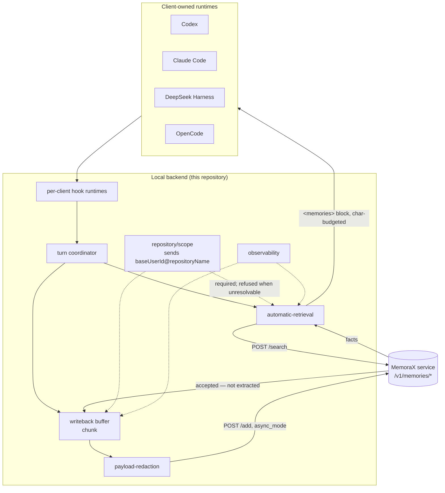

## 1. Executive Summary

MemoraX Code is middleware that gives four coding agents — Codex, Claude Code,
DeepSeek Harness and OpenCode — a shared memory across sessions. MIT, ~27,000
lines of TypeScript across six packages: one local backend, four client
deployment adapters, and an npm assembly layer. `ARCHITECTURE.md` describes the
backend as *"a capability-oriented modular monolith"* and is explicit that the
clients keep ownership of models, credentials, native tools and transcripts.

**The store is not here.** `src/provider/memorax/adapter.ts` speaks three
endpoints — `POST /v1/memories/search`, `POST /v1/memories/add`, and
`GET /v1/memories/add/status/{taskId}` — against a hosted MemoraX service. What
this repository contains is the client half: when to retrieve, what to send,
what to strip before sending, how to render what comes back, and how to survive
a failed write. Everything the atlas usually cares most about — what a memory
is, how it is ranked, whether it can be corrected, what happens when two facts
disagree — is decided on the far side of that boundary and is not inspectable
at this commit. The report says so throughout rather than hedging each sentence.

**Strongest, and worth taking whether or not you use this:**
`src/memory/payload-redaction.ts` redacts credential material *before the
payload leaves the machine* — private-key blocks, `Authorization` headers,
Bearer and Basic tokens, JWTs, and sensitive key/value pairs — with a
`SAFE_CREDENTIAL_VALUE_PATTERN` allowlist so that `${ENV_VAR}`, `<placeholder>`
and `change-me` are left alone. Its committed tests carry the positive control
this atlas argues for: one case asserts the categories are replaced, another
asserts *"representative non-sensitive coding text"* survives untouched, a third
asserts the transform is idempotent, and a fourth asserts that a payload
consisting only of placeholders is not meaningful text.

**Weakest:** there is no delete. Not "no tombstone" — no removal of any kind in
the client's vocabulary, and no endpoint for one in the surface it speaks. A
user who wants a memory gone has nothing in this repository to call.

## 2. Mental Model

A memory is whatever the service returns. The client's model of it is thin by
design: a rendered line with a `memory_type`, assembled into a block.

```text
turn start ──► automatic-retrieval ──► POST /v1/memories/search
                                              │
                                              ▼
                             <memories>
                               <facts memory_type="...">
                                 ...lines...
                               </facts>
                             </memories>          truncated at maxContextChars

turn end   ──► writeback buffer ──► chunk ──► redact ──► POST /v1/memories/add
                                                              │  taskId
                                                              ▼
                                              GET /v1/memories/add/status/{taskId}
```

There is **no state machine**, because the client holds no state a memory can be
in. Nothing here marks a fact candidate, verified, rejected or stale; nothing
expires it; nothing supersedes it. The one epistemic act the client performs is
negative and happens before the write: if redaction leaves nothing but
placeholders, `hasMeaningfulMemoryPayloadText` returns false and there is
nothing worth storing.

Control is **automatic**. Retrieval fires at turn start behind
`memoryRetrievalEnabled`, writeback fires at turn end, and the model is not
asked. There is no tool a model can call to remember or recall something
deliberately — the memory is a property of the session, not an instrument the
agent operates.

The system treats what the service returns as ground truth, and has no field in
which to disagree with it.

## 3. Architecture



**Runtime shape.** One local backend process serving four adapters, installed
from npm as `@memorax/memorax-code`, Node ≥20. Adapters install client-side
hooks; `src/clients/{codex,claude,dsh,opencode}/memory-hook-runtime.ts` gives
each host its own turn-start and writeback runtime behind a common
`MemoryService` interface (`recordTurnStart`, `writebackTurn`, `drain`,
`close`).

**Persistence.** None of its own that holds memories. The local state is
operational: a writeback buffer with chunking, a per-client reconciliation of an
interrupted turn, and a trace store. The memories live in the
hosted service.

**Search.** Not here. `stack_retrieval` is empty for that reason — the client
issues one search per turn start and renders the response; there is no lexical
index, no vector store and no ranking code in this repository.

### Deployment and ergonomics

`npm i -g @memorax/memorax-code`, then per-client install. An account and
credentials are required before anything can be stored at all — the merge at
this pin is `feat/secure-trial-credentials` — so this is not a system you can
run offline or inspect end to end. The local half is readable TypeScript with a
`memorax memory status | search | add` CLI, which is the part an operator can
debug.

**The licence covers the client.** MIT applies to what is in this repository;
the service it depends on is not covered by it, and the terms under which the
stored memories are held are not visible from the tree.

## 4. Essential Implementation Paths

**Retrieval.** `src/memory/automatic-retrieval.ts` — gated by
`memoryRetrievalEnabled` with a `startupRetrieveTimeoutMs`, takes an optional
`query`, a `ConfiguredRepositoryMemoryResult` and a `sessionKey`, and returns
`{context?, retrieved, skipReason?}`. The `skipReason` is the interesting field:
a turn that retrieved nothing says why.

**Rendering.** `src/provider/memorax/adapter.ts:500-516` groups returned items
by `memory_type` into `<facts memory_type="…">` blocks inside a `<memories>`
element, escapes attributes, and truncates the joined result at
`config.maxContextChars`. Recall arrives as structured, bounded, fenced text
rather than as loose prose — though the fence is a rendering convention, and
nothing in the client tells the model that the content inside it is untrusted.

**Scope.** `src/repository/scope.ts` resolves a `RepositoryMemoryScope` of kind
`git-repository`, `local-directory` or `general`, with an explicit
fallback reason (`git_metadata_invalid`) and result kinds `none`, `invalid`,
`degraded` and `repository`. `adapter.ts` refuses outright:
*"memory scope is required for MemoraX search/add"*. A scope that cannot be
resolved is an error, not a default — which is the opposite of the caller-
supplied string this atlas usually finds.

**Two keys come out of that resolution and only one of them is sent.**
`scope.ts:214` builds the identity the service sees as
``effectiveUserId: `${input.baseUserId}@${input.repositorySlug}` `` — and the
slug is a bare repository *name*: `repositoryNameFromRemotePath` takes the last
path segment of the origin URL and strips `.git`, falling back to the common
directory's basename and then to the workspace folder name. Beside it sits
`repositoryKey`, a SHA of the git common directory or the absolute workspace
path, which does not collide — and which never leaves the machine. Its comment
says what it is for: *"repositoryKey separately identifies the local scope used
for session binding."*

So `github.com/one/Shared` and `github.com/two/Shared` address the same remote
memory. That is not an oversight; the tree asserts it. `repository-memory-scope.test.mjs:363`
is named *"independent same-named clones share a namespace but remain distinct
sticky session scopes"* and pins `firstScope.scope.effectiveUserId` to
`"alice@Shared"`, asserts the second equals it, and asserts the two
`repositoryKey`s differ. The private work of two employers, or a fork and its
upstream, land under one key whatever the service does with it — and no
enforcement on the far side can separate what the near side has already merged.

The `general` kind is the same shape with the collision made total. It resolves
to the slug `General` for every projectless session across every managed client,
so `alice@General` is one namespace holding every default chat the user has with
any of the four agents. The care taken elsewhere in this file is real — a
projectless hint does not override Git authority, an unreadable `cwd` still
fails closed, and `repositoryMemoryScopeCanBindGeneralWorkspace` gates the
transition — but all of it governs the local key, not the one on the wire.

**Writeback.** `src/memory/automatic-writeback.ts` with
`writeback-buffer.ts` and `writeback-chunk.ts`: decisions are buffered (with a
scope-upgrade path), chunked, redacted, and posted. Failures are classified —
`automatic-writeback.ts:506-509` retries only on HTTP 408, 429 and 5xx, so a
400 is not retried into a loop.

**Redaction.** `src/memory/payload-redaction.ts` — an ordered rule set over
private-key blocks, `Authorization` and `Proxy-Authorization` headers, Bearer
and Basic tokens, JWTs, and a broad sensitive-key pattern covering
`password`, `client_secret`, `api_key`, `access_token`, `refresh_token`,
`private_key`, `credential`, `secret` and `token`. `SAFE_CREDENTIAL_VALUE_PATTERN`
exempts values that are obviously not secrets — `${ENV}`, `process.env.X`,
`<placeholder>`, `example`, `change-me`, type names — so a config snippet is not
destroyed to protect a variable name.

**Turn coordination.** `src/memory/turn-coordinator.ts` and
`repository-session.ts` bind a turn to a scope and a session key so retrieval
and writeback agree about what they are talking about.

**Observability.** `src/memory/observability.ts` and
`src/app/memory-observability.ts` emit events with a source, related turns and a
diagnostic logger; `src/memory/reminder-trace-recorder.ts` records reminders.

**Tests.** Eleven files under `test/memory/` covering retrieval, writeback, the
buffer, chunking, the CLI, the service, the turn coordinator, the hook command,
the harness runtime, the quota notice and redaction, plus per-client
hook-runtime suites and `test/repository/repository-memory-scope.test.mjs`,
which is where the scope's intended behaviour is written down.

## 5. Memory Data Model

There is no schema in this repository. The client's types describe *transport*:
a rendered item with a `memory_type` and a line, a writeback decision, a buffered
decision with a scope upgrade. What a
stored memory contains, which fields it carries, and whether it has an id the
client could later reference are all service-side.

**Scoping** is the one identity the client owns, and the resolution is well
made: a scope is required, three kinds are distinguished, a degraded resolution
is named rather than silently downgraded, and the reason for a fallback is
carried (`git_metadata_invalid`). The *key* is the weak half. What reaches the
service is `baseUserId@repositoryName`, so the resolution's care buys precision
the wire format then discards, and a namespace can hold two repositories that
share a name. Whether even that key is enforced on the read is the service's
business, which is why the mark is withheld below — but the granularity
question is answerable here, and the answer is a repository name.

**Provenance and time.** A memory carries the turn and scope it was written
under. There is no validity interval, no capture time visible in the client's
model, and no author field.

**Correction.** None. `grep` for a delete, a removal or a forget across
`provider/memorax/adapter.ts` returns nothing, and the three endpoints the
adapter speaks contain no removal. This is the sharpest thing the report can say
about correction, and it is a statement about the visible surface rather than
about the product.

## 6. Retrieval Mechanics

One search per turn start, with an optional query, a timeout, and a
`skipReason` when it does not fire. The response is grouped by `memory_type`,
rendered into the `<memories>` block and truncated at a character budget — so
the injection cost is bounded and the truncation is at the end of the rendered
text rather than by dropping whole items, which means the last fact in the block
can be cut mid-line.

**Ranking is not in this repository.** `parseScore` exists in
`provider/memorax/config.ts`, so the service returns a score the client can
read; nothing in the client filters or re-orders on it. What a search matches, how
it is ranked and whether it is lexical, vector or hybrid cannot be determined
from this tree, and no committed artifact reports it.

**Failure modes.** A search that returns nothing and a search that was skipped
are distinguishable to the operator through `skipReason` and the observability
events, which is better than most. A search that returns the *wrong* facts is
invisible: there is no relevance signal the client acts on and no negative
feedback path.

## 7. Write Mechanics

Automatic, per turn, and asynchronous by contract: `POST /v1/memories/add`
returns a task id and `GET /v1/memories/add/status/{taskId}` reports on it. The
atlas notes repeatedly that **write-to-readable lag is measured nowhere**; here
it is at least *acknowledged in the API*, because the add is explicitly a task
with a status rather than a synchronous write. The client polls, but nothing
reports the distribution, and the report cannot say what the lag is.

**Redaction is the write path's most consequential step**, and it runs before
the network call rather than after ingestion — the boundary that matters when
the store is someone else's.

**Deduplication, conflict handling and supersession** are absent from the client.
Two contradictory facts from two turns are two adds.

### Operational cost

The retrieval call sits on turn start, so the agent waits for it up to
`startupRetrieveTimeoutMs`. Writeback is buffered and drained rather than
blocking the turn. Nothing re-reads the corpus locally, so the local token cost
is the rendered block per turn, bounded by `maxContextChars`; the service-side
cost of an add — whether it extracts, embeds or consolidates — is not visible.
Because the block is injected per turn rather than once per session, it sits
where a provider's prompt-prefix cache is invalidated on every request, which
[cache-preserving injection](../../patterns/cache-preserving-injection/)
describes and nothing here reports.

## 8. Agent Integration

Four adapters, four hook runtimes, one `MemoryService` interface. The agent does
not call memory; the middleware calls it around the agent. There is **no MCP
server and no tool** — no `remember`, no `recall`, nothing the model can invoke
deliberately — which is a coherent product decision and the reason the model
cannot direct its own memory here.

The CLI (`memorax memory status | search | add`) is the human's surface, and
`--config-only` on status makes the configuration inspectable without a network
call.

Compaction and session lifecycle are handled per client in
`src/clients/*/memory-hook-runtime.ts`; the Claude runtime carries
`transcriptReadAttempts` and `transcriptRetryDelayMs`, which is an admission
that reading a transcript from disk races the host writing it.

## 9. Reliability, Safety, and Trust

**The privacy boundary is the strong part.** Redaction before transmission, an
allowlist that keeps placeholder values intact, an idempotence property, and a
check that refuses to treat an all-placeholder payload as content. For a system
that ships a developer's session text to a hosted service, that is the right
place to spend the effort.

**Trust representation:** none. The client has no field for doubt and no way to
express that a returned fact is wrong. The `<memories>` block is rendered into
the model's context as ordinary text; nothing labels it untrusted, and since its
contents came from previous sessions of the same or other repositories, a
poisoned memory has no barrier on the way back in.

**Deletion and privacy.** No delete path in the client, and none in the three
endpoints it speaks. Whatever the service offers, this repository cannot reach
it — so a user asking *"remove what you learned about X"* has no answer here.

**Failure handling** is careful up to the point where it stops. Retries are
bounded to 408/429/5xx, and each client's `memory-hook-runtime.ts` carries a
`reconcilePreviousInterruptedTurn` that picks up a turn whose writeback never
ran, logging `interrupted_turn_reconciled`. Past the post there is nothing. The
payload sets `async_mode: true` under a comment that states the consequence —
*"Acceptance acknowledges task submission, not completed memory extraction"* —
and the client calls exactly two endpoints, `/v1/memories/add` and
`/v1/memories/search`. `http.ts:141` throws if the immediate envelope comes back
`failed`, `error` or `cancelled`; an add that is accepted and then fails during
extraction produces no local signal at all, and no code path asks.

**What cannot be assessed** from this tree: multi-tenancy, retention, whether
scope is enforced server-side, whether the service deletes on request, and what
it does with the transcripts it receives.

## 10. Tests, Evals, and Benchmarks

Ten memory test files plus per-client hook-runtime suites, and the redaction
suite is the one that earns the mark. Its four cases together form the shape
this atlas argues for elsewhere: an absence assertion (each detector category is
replaced), a **positive control** (representative non-sensitive coding text
survives), an idempotence property, and a semantic check
(`hasMeaningfulMemoryPayloadText("[REDACTED:EMAIL], [REDACTED:API_KEY]")` is
`false`, while the same placeholders inside a sentence are `true`).

**What is not tested, because it cannot be:** everything about the store. There
is no fixture service, no recorded fixture of a search response used to assert
ranking behaviour, and no benchmark. The repository does not claim otherwise —
`ARCHITECTURE.md` says live source and executable tests are the authority for
current behaviour, and the store is neither.

## 11. For Your Own Build

### Steal

- **Redact before the payload leaves the machine, and pair the rule set with an
  allowlist.** Redaction that destroys `${DATABASE_URL}` and `change-me` along
  with real secrets makes the memory useless; the `SAFE_CREDENTIAL_VALUE_PATTERN`
  half is what makes the aggressive half safe to ship.
- **Test redaction with a positive control and an idempotence case.** "Secrets
  are removed" passes on an empty string; "non-sensitive coding text is
  preserved" is what stops the rule set from eating the corpus.
- **Refuse a scope you cannot resolve.** Three named kinds, a named fallback
  reason, and an outright refusal beat defaulting to a global namespace.
- **Keep two keys and know which one you are sending.** A collision-resistant
  local key for session binding and a human-readable one for the wire is a
  reasonable split — provided the wire key is as precise as the isolation you
  are claiming. Here it is not, and the tree is honest enough to assert the
  consequence in a test rather than leave a reader to discover it.
- **Say why a retrieval did not happen.** A `skipReason` beside `retrieved:
  false` turns "memory did nothing" into a debuggable event.
- **Name an asynchronous write as accepted rather than done.** The comment on
  `async_mode: true` — acceptance acknowledges submission, not extraction — is
  the honest description of a write that is not readable yet. Follow it with a
  way to find out, which this client does not have.

### Avoid

- **Do not ship a memory client with no delete.** Whatever the service supports,
  the surface a user can reach is the surface that exists; a store you can only
  add to is a commitment nobody can undo.
- **Do not render recall as ordinary context.** A fenced block is a good start,
  and it needs a sentence telling the model the contents are data from an earlier
  session rather than instructions.
- **Do not truncate the rendered block by characters** without saying what was
  cut. A budget that clips the last fact mid-line loses a memory silently.

### Fit

This suits a developer who works across several coding agents and wants one
memory behind all of them without building it. The engineering on the local half
is careful, and the redaction posture is better than most of what this atlas has
read. It is not a fit if you need to inspect or own the store, if deletion is a
requirement, or if the correction semantics matter to you — none of those
questions can be answered from this repository, and the report is not able to
answer them on the product's behalf.

## 12. Open Questions

- What does the service store, and what does a `memory_type` mean? The client
  groups by it and never enumerates the values.
- Is there a delete API the client does not use? Three endpoints are spoken; the
  surface may be larger.
- Is scope enforced server-side, or is the required client-side scope the whole
  boundary? This decides whether the isolation is real, and it is not visible
  here — though the granularity is: two repositories named `Shared` address one
  namespace however well the service enforces it.
- Is the shared `General` namespace across four clients the intent, or a
  consequence of collapsing `Codex-General` into a client-neutral slug?
- What is the actual write-to-readable lag, and how would anyone know? The add
  is accepted asynchronously and nothing in the client observes what became of
  it, so a failure during extraction is indistinguishable from a turn that had
  nothing worth keeping.
- What are the retention and deletion terms for transcripts sent to the service?

## Appendix: File Index

- **Provider boundary:** `packages/ts/memorax-code-backend/src/provider/memorax/adapter.ts`, `http.ts`, `config.ts`
- **Retrieval:** `src/memory/automatic-retrieval.ts`, `src/memory/turn-coordinator.ts`
- **Write path:** `src/memory/automatic-writeback.ts`, `writeback-buffer.ts`, `writeback-chunk.ts`; interrupted-turn recovery in `src/clients/*/memory-hook-runtime.ts` (`reconcilePreviousInterruptedTurn`)
- **Privacy:** `src/memory/payload-redaction.ts`
- **Scope:** `src/repository/scope.ts` (`effectiveUserId` at :214, `generalMemoryScope`, `repositoryNameFromRemotePath`), `src/memory/repository-session.ts`, `test/repository/repository-memory-scope.test.mjs:363`
- **Client integration:** `src/clients/{codex,claude,dsh,opencode}/memory-hook-runtime.ts`, `packages/ts/memorax-code-*-adapter/`
- **Operator surface:** `src/memory/cli.ts`, `src/memory/observability.ts`
- **Tests:** `test/memory/memory-payload-redaction.test.mjs`, `automatic-memory-retrieval.test.mjs`, `automatic-memory-writeback.test.mjs`, `memory-service.test.mjs`, `test/repository/repository-memory-scope.test.mjs`

## History

**2026-09-14** — [`1525c20fbcad8c688bfaf4bb54dc117876fd6a09`](https://github.com/memorax-ai/memorax-code/commit/1525c20fbcad8c688bfaf4bb54dc117876fd6a09) — second reading, 274 commits and eleven releases on. Screened first: no auto-executing surface, three build-time execution points, nine dependency manifests inside the seven-day cooldown; nothing was installed, no client was deployed and no request was made to the service. The boundary of the first reading holds — every claim is still about the client. Three corrections. `writeback-reconciler.ts` and `writeback-task-projection.ts` were deleted with the Memory Viewer at [`d6cd5335cc908d57a63227ebd4d32ae51d37ba71`](https://github.com/memorax-ai/memorax-code/commit/d6cd5335cc908d57a63227ebd4d32ae51d37ba71); reconciliation of an interrupted turn survives per client in `memory-hook-runtime.ts`, but nothing follows an accepted add, and the status endpoint the report described is not called anywhere. `codex-projectless` became `general`, shared across all four clients under one slug. And the scope key itself was read this time rather than assumed: `effectiveUserId` is `baseUserId@repositoryName`, the collision-resistant `repositoryKey` stays local, and `repository-memory-scope.test.mjs:363` asserts that two clones named `Shared` from different owners share a namespace. `negative_eval` re-tested at the producer (`automatic-writeback.ts:289-290` calling `redactMemoryPayloadText` before the post) and holds unchanged; no mark moves.

**2026-08-20** — [`b98cb8c78956a1cd5b6b364549217fb2b6db601b`](https://github.com/memorax-ai/memorax-code/commit/b98cb8c78956a1cd5b6b364549217fb2b6db601b) — first reading. Screened before anything was read: no auto-executing surface, three build-time execution points, seven dependency manifests inside the seven-day cooldown, and `AGENTS.md` and `CLAUDE.md` addressed to a reading agent, recorded as data; nothing was installed, no client was deployed and no request was made to the service. Every claim here is about the client at this commit — the store behind `/v1/memories/*` was not exercised, and the report says where that boundary falls rather than inferring across it.
