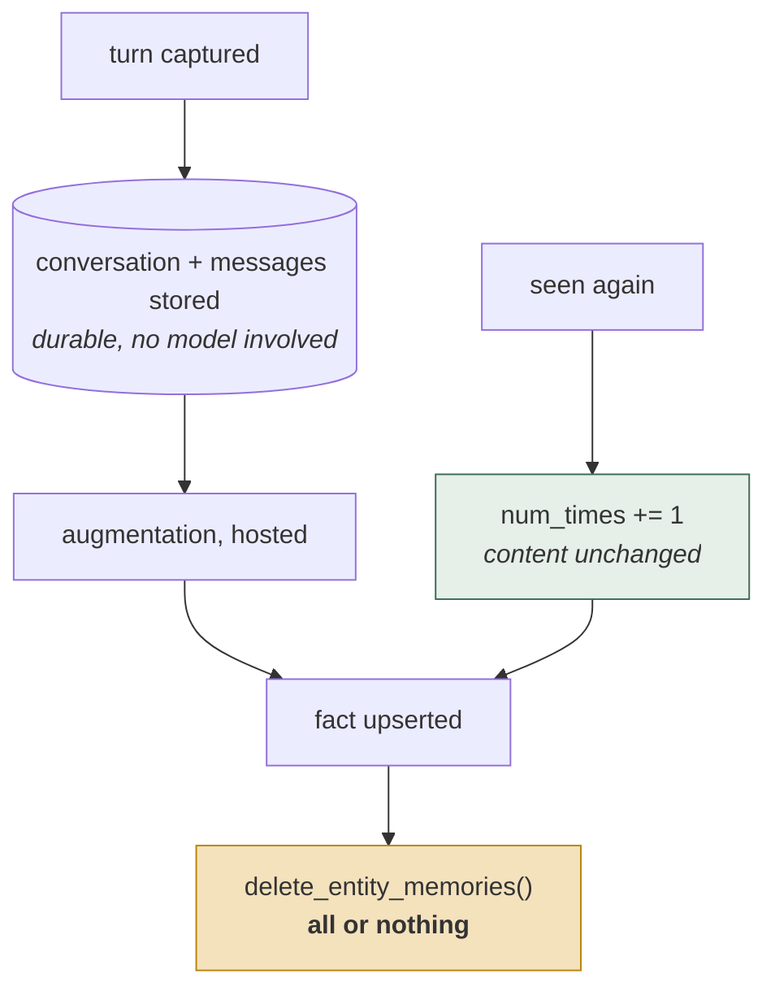
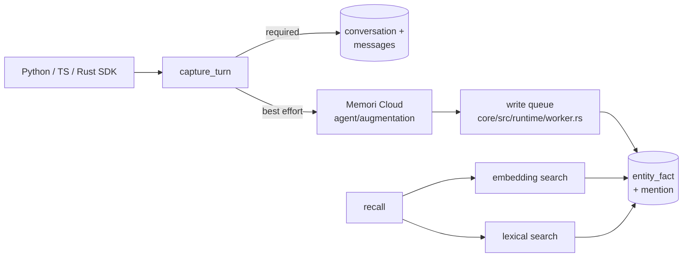

## 1. Executive Summary

Memori is a memory store with unusually good bones and one defect that matters
more than everything else in this report.

The bones: a Rust core (`core/src/`) with Python and TypeScript bindings, storage
drivers for SQLite, PostgreSQL, MySQL, Oracle, OceanBase and MongoDB, a schema
that models entities, processes, sessions, conversations, messages, facts and a
subject–predicate–object graph, and — rarest of all — a
`memori_entity_fact_mention` join table that records **which conversations
mentioned which fact**. Very little in this atlas can answer "why do you believe
that?" with a foreign key. Memori can.

The defect: facts are deduplicated on a content-addressable key,
`generate_uniq`, which normalizes by keeping only ASCII alphanumerics before
hashing. Any fact containing no ASCII letters or digits — every fact written in
Chinese, Japanese, Korean, Arabic, Hebrew, Greek, Cyrillic, Thai — normalizes to
the empty string and hashes to `e3b0c442...`. The unique constraint is
`(entity_id, uniq)`, and the write is `ON CONFLICT ... DO UPDATE SET num_times =
num_times + 1`, which does not touch `content` or `content_embedding`. So for a
non-Latin-script user, the first fact ever stored is the only fact ever stored,
and every subsequent one silently increments its counter. Section 5 works through
it.

There is a second structural thing to know before adopting: the storage is open
and self-hostable, but **the extraction is not**. What becomes a fact is decided
by `api.augmentation_async()`, a call to Memori Labs' hosted service. You own the
database and rent the judgement.

## 2. Mental Model

A memory is an **entity fact**: a sentence about an entity, with a normalized
hash for identity, a count of how many times it has been seen, and a set of
conversations that produced it.

```text
memori_entity            the subject of memory — external_id is your user id
  └─ memori_entity_fact  content, content_embedding, num_times,
                         date_last_time, uniq  ← UNIQUE(entity_id, uniq)
       └─ memori_entity_fact_mention (entity_id, fact_id, conversation_id)
memori_conversation → memori_conversation_message   the retained source
memori_subject / _predicate / _object / _knowledge_graph
memori_process / _process_attribute   memory about the *agent*, not the user
```

The `memori_process` tables are the part the tagline is about — "memory from what
agents do, not just what they say". A process is a running agent, and it
accumulates its own attributes alongside the entity's facts. Few systems here
model the agent as a memory subject in its own right.

The lifecycle is two states and no transitions between them:



Seeing a fact again increments a counter and leaves the content alone, so
repetition is recorded without rewriting. The only exit is entity-wide: there is
no way to remove one fact.

A fact is never superseded, corrected, contradicted, expired or rejected. It is
created, counted, and eventually deleted along with everything else about that
entity. The vocabulary for anything in between does not exist in the schema.

Memory is **automatic**. There is no tool the model calls to remember or forget,
and no surface where a person adjudicates.

## 3. Architecture



- **The Rust core** (`core/src/`) holds the augmentation, embeddings, retrieval,
  search and storage pipelines, with a `runtime/worker.rs` draining a write
  queue. Python (`memori/`) and TypeScript (`memori-ts/`) are bindings over it,
  with parallel pure-Python drivers for the dialects the core does not carry.
- **Seven backends.** `core/src/storage/migrations/` covers SQLite, PostgreSQL
  and MySQL; `memori/storage/migrations/` adds Oracle, OceanBase and MongoDB.
  The migrations are hand-written SQL with named constraints, which makes the
  data model unusually easy to audit — this report's central finding was read out
  of them.
- **Search** is FAISS plus a lexical path (`memori/search/_faiss.py`,
  `_lexical.py`, and `core/src/search/lexical.rs`).

### Deployment and ergonomics

Better than most for the local half. `pip install memori`, point it at a SQLite
file, and the schema builds itself through a versioned migration table
(`memori_schema_version`). Nothing else has to be running.

But an API key is required to store anything *meaningful*, because the
augmentation that turns a turn into facts is a network call to
`https://<subdomain>.memorilabs.ai`, metered with a `QuotaExceededError`. Without
it you get conversations and messages — a transcript log — and no facts. That is
the honest way to state the offline story, and `MEMORI_API_URL_BASE` lets you
point at a different host without providing anything to run there.

The store is SQL and hand-repairable, which matters more here than usual: it is
the only way to fix the collision in section 5 once it has happened.

## 4. Essential Implementation Paths

**Capture** — `memori/agent.py:94`, `capture_turn()`. It posts the turn to
`agent/conversation/turn` and then, in a `try/except` that swallows everything,
posts to `agent/augmentation`. The docstring states the intent plainly: "The
conversation turn write is required to succeed. The collector-side augmentation
request is best-effort so agent integrations do not fail after the durable turn
has already been recorded." That is
[recoverable background work](../../patterns/recoverable-background-work/) done
right, and it is the best thing in the codebase after the mention table.

**Augmentation** —
`memori/memory/augmentation/augmentations/memori/_augmentation.py:125`,
`AdvancedAugmentation.process()`. It summarizes the conversation, selects
messages, builds a payload, and calls `api.augmentation_async(payload)`. The
returned object becomes `Memories`, and `_schedule_entity_writes`,
`_schedule_process_writes` and `_schedule_conversation_writes` queue the rows.
`_registry.py` registers exactly one augmentation; there is no local alternative.

**Fact write** — `memori/storage/drivers/*/\_driver.py`, around line 245 in the
PostgreSQL driver and line 245 in SQLite. `uniq = generate_uniq([fact])`, then
the upsert quoted in section 5.

**Key derivation** — `memori/_utils.py:46` and
`core/src/storage/drivers/mod.rs:37`. Two implementations, with a comment on the
Rust side stating they must agree: "Matches the Python SDK: join all terms, strip
non-alphanumeric characters, lowercase, then SHA-256."

**Retrieval** — `memori/memory/recall.py`, `memori/search/_core.py`,
`_faiss.py`, `_lexical.py`; `core/src/retrieval/pipeline.rs` on the Rust side.
The frequency index `idx_memori_entity_fact_entity_id_freq (entity_id, num_times
DESC, date_last_time DESC)` is what ranks by repetition.

**Deletion** — `memori/memory/recall.py:193`, `delete_entity_memories()`, and
`delete_by_entity(entity_id)` in each driver.

**Schema** — `memori/storage/migrations/_sqlite.py` is the most readable copy;
`core/src/storage/migrations/postgresql.rs` is the Rust twin.

## 5. Memory Data Model

Start with what is good, because it is genuinely good.

`memori_entity_fact_mention` is a three-column join —
`(entity_id, fact_id, conversation_id)`, unique on all three — that survives
because `memori_conversation_message` retains the source text. A fact in this
system can name the conversations it came from, and those conversations still
exist. That is [evidence before belief](../../patterns/evidence-before-belief/)
with an actual foreign key rather than a hopeful `source` string, and only a
handful of systems in this atlas manage it.

Scoping is likewise structural. Every memory table hangs off `entity_id` or
`process_id` with `ON DELETE CASCADE`, and every read carries `WHERE entity_id =
?`. `memori_entity.external_id` is your application's user identifier, uniquely
constrained. Deleting an entity really does remove its memory.

Now the defect.

```sql
CREATE TABLE memori_entity_fact(
    ..., content TEXT NOT NULL, content_embedding BLOB NOT NULL,
    num_times INTEGER NOT NULL, uniq TEXT NOT NULL,
    CONSTRAINT uk_memori_entity_fact_entity_id_uniq UNIQUE (entity_id, uniq)
)
```

```python
def generate_uniq(terms: list):
    sha256 = hashlib.sha256()
    sha256.update(re.sub(r"[^a-z0-9]", "", "".join(terms).lower()).encode("utf-8"))
    return sha256.hexdigest()
```

The regex keeps `a-z0-9` only. Non-ASCII characters are not folded, transliterated
or preserved — they are deleted. Reimplementing that function from the committed
source and running it (Memori itself was not run) gives:

| Fact | `uniq` prefix |
| --- | --- |
| `User lives in Berlin` | `0db907e58ae8137b` |
| `用户住在柏林` | `e3b0c44298fc1c14` |
| `ユーザーは東京に住んでいる` | `e3b0c44298fc1c14` |
| `المستخدم يعيش في القاهرة` | `e3b0c44298fc1c14` |
| `!!!` | `e3b0c44298fc1c14` |

`e3b0c442...` is the SHA-256 of the empty string. Every fact with no ASCII
alphanumerics is the same key. Combined with the write:

```sql
ON CONFLICT (entity_id, uniq) DO UPDATE SET
    num_times = memori_entity_fact.num_times + 1,
    date_last_time = CURRENT_TIMESTAMP
```

— which updates neither `content` nor `content_embedding` — the consequence is
exact. For an entity whose facts are written in a non-Latin script, the store
holds **one fact**: whichever arrived first. Every later fact increments its
counter, refreshes its timestamp, and is otherwise discarded. Because
`num_times DESC` leads the ranking index, that single row also climbs to the top
of recall. And `memori_entity_fact_mention` dutifully records every conversation
as evidence *for that one fact*, so the provenance mechanism reports confidently
on a claim most of those conversations never made.

The same normalization has a smaller inverse problem in Latin scripts: `café`
becomes `userlovescaf` and `cafe` becomes `userlovescafe`, so an accent-folding
key fails to fold accents. Both errors have one cause — treating "strip
punctuation" and "strip everything non-ASCII" as the same operation.

This belongs in this atlas rather than only in an issue tracker, because
[the tombstone pattern](../../patterns/rejected-value-tombstone/) argues that
**normalization is where the work is** in any content-addressable memory key, on
the evidence of a red team defeating Verel's `strip().lower()` with unicode
look-alikes. Memori is the same seam reached from the opposite direction: a
carefully engineered content-addressable key, implemented twice for cross-language
parity, tested for case and punctuation insensitivity — and never tested with a
non-ASCII string. `tests/test_utils.py:37` asserts that `"Abc. Def"` and
`"abc def"` agree. Nothing asserts that two different Chinese sentences disagree.

Beyond that: no validity interval, no version, no supersession column, no status,
no confidence. `num_times` is a sighting count, not a belief.

## 6. Retrieval Mechanics

Two arms, both scoped by `entity_id`: embedding similarity over
`content_embedding` (FAISS on the Python side, `core/src/search/` in Rust) and a
lexical path. `recall()` and `recall_summary()` are the public entry points, with
a score threshold (`_score_for_recall_threshold`) and a resolved limit.

The frequency index means repetition is a ranking signal, and here — unlike
[Memary](../memary/), where the equivalent sort runs backwards — the index is
declared `num_times DESC` and used that way. That is the correct version of the
same idea.

The failure mode is the one section 5 creates. Frequency ranking amplifies the
collision rather than revealing it: the collapsed row is the most-counted row, so
the system's confidence in its single non-Latin fact grows with every conversation
that should have added a different one. A user would experience this as the
assistant becoming *more* insistent about one thing it remembers and never
learning anything else.

There is no gate on retrieval — no decision that a turn needs no memory — and no
fusion between the lexical and embedding arms beyond the caller choosing.

## 7. Write Mechanics

The write path is deferred and split, and the split is well judged: the durable
turn write must succeed, the augmentation may fail. An outage costs you facts, not
data, and the conversation can be augmented later because the messages are still
there.

Extraction itself is a hosted call. `AdvancedAugmentation.process()` posts the
conversation to Memori Labs and receives facts back; `_registry.py` registers no
other augmentation. This is the cleanest instance in the atlas of
[platform-only capability behind an open API](../../compare/#platform-only-claims-hidden-behind-oss-apis):
the schema is open, the drivers are open, the Rust core is open, and the one
judgement that determines what the memory *contains* is a remote service you
cannot inspect, run offline, or reproduce.

Correction does not exist, and the shape of its absence is unusual. The upsert is
deliberately non-destructive — it never rewrites `content`, which is the opposite
of [Memobase](../memobase/)'s in-place rewrite and avoids that whole class of loss.
But the same choice means a fact can never be *fixed*: if the extractor produces
"User lives in Berlin" and the user moves, a later "User lives in Lisbon" is a
different `uniq`, so both rows exist, both are ranked, and nothing marks either as
superseded.

Deletion is entity-scale only. `delete_entity_memories()` is the sole removal
surface exposed by the SDK, and the drivers back it with `delete_by_entity`. There
is no "forget this one thing" — the granularity of forgetting is the person.

### Operational cost

- **Synchronous?** The turn write is; the augmentation is not.
- **Lag?** Until the hosted augmentation returns and the Rust worker drains its
  queue. Unmeasured here.
- **Whole-store passes?** None. Cost scales with turns, not with corpus size —
  a better shape than the nightly-rewrite designs elsewhere in this atlas.
- **Read path?** Bounded by a resolved limit and a score threshold. Because
  extraction is a remote metered call, the recurring cost is a vendor bill rather
  than a token bill, which is a different thing to budget for.

## 8. Agent Integration

Three SDKs (Python, TypeScript, Rust) and three shipped plugins —
`integrations/claude-code`, `integrations/hermes`, `integrations/openclaw` — which
puts Memori alongside the host-runtime plugins this atlas tracks under
[pluggable memory provider](../../patterns/pluggable-memory-provider/).

The model has no agency over memory at all. `capture_turn` is called by the
integration with the user and assistant content; the model never decides to
remember, and there is no forget tool for it to reach. `feedback(content)` posts
free text to the vendor, and is telemetry rather than a memory operation.

Adapting this to another host is realistic — `capture_turn` and `recall` are the
whole contract — provided you accept the hosted augmentation dependency.

## 9. Reliability, Safety, and Trust

Provenance is the strength and it is real: fact → mentions → conversation →
messages, all with foreign keys and cascade semantics. Section 5's collision
undermines it for non-Latin content, which is worth stating as one sentence rather
than two separate findings — a provenance mechanism attached to a corrupted
identity reports confidently and wrongly.

Trust is unrepresented. Nothing distinguishes a fact the user stated from one the
hosted extractor inferred, and there is no status a downstream query could filter
on.

Prompt injection reaches the extractor by construction: the conversation is what
is sent, and text crafted to look like a stated fact will come back as one. The
mitigation would be a trust state, and there is none.

Multi-tenancy is sound — cascade-scoped foreign keys, no cross-entity read path —
though `entity_id` is the only boundary; there is no organization or project layer
above it in the schema.

The largest privacy consideration is not in the schema at all: conversations are
posted to a third-party API for augmentation, and that is the default and only
path to having any facts.

## 10. Tests, Evals, and Benchmarks

153 files under `tests/`, which is the largest suite of any system reviewed in
this round, plus per-driver test modules and a TypeScript suite under
`memori-ts/tests/`. The coverage is real: drivers, storage calls, search, config,
network.

It is also the exhibit for what a large suite does not buy you.
`tests/test_utils.py:37` tests `generate_uniq` — the function this report is
mostly about — with exactly two assertions, both ASCII, both confirming that
punctuation and case are ignored. No test in the repository passes a non-ASCII
string to it. A search for non-ASCII content across `tests/` returns nothing. The
defect in section 5 is not hidden in a corner of the codebase; it is in the
most-tested utility function, and the tests confirm the behaviour the author
intended rather than probing the behaviour they did not.

`benchmarks/` holds `01_load_indexes.ipynb` and `02_run_benchmark.ipynb` with a
README, and the project's marketing links to a hosted benchmark page. **No scored
results are committed to this repository**, so the numbers are claims rather than
artifacts. The survey that prompted this review lists Memori with an empty
evaluation column.

The tests I would want: `generate_uniq("用户住在柏林") != generate_uniq("用户喜欢咖啡")`,
and a round-trip asserting that two distinct non-ASCII facts produce two rows.

## 11. For Your Own Build

### Steal

- **Make provenance a join table.** `(entity_id, fact_id, conversation_id)` with
  the messages retained is the cheapest complete answer to "why do you believe
  that?", and it is a schema decision rather than an architecture.
- **Make the durable write required and the smart write optional.** Storing the
  turn unconditionally and extracting best-effort means a provider outage costs
  you derived data you can regenerate, not source data you cannot.
- **Give the agent its own memory subject.** `memori_process` and
  `memori_process_attribute` model the running agent as something to remember
  facts *about*, separately from the user. Most designs only have the user.
- **Upsert without rewriting content.** Incrementing a counter rather than
  regenerating the text avoids the loss that in-place LLM rewrites cause. Just
  give yourself a supersession path as well, which Memori does not.

### Avoid

- **Do not build a normalization function that deletes what it does not
  recognize.** `[^a-z0-9]` is a whitelist wearing a blacklist's clothing: it looks
  like "strip punctuation" and behaves like "strip every writing system except
  English". If a key is content-addressable, normalize with NFKC and case-fold —
  do not filter to an alphabet.
- **Do not test a hash function only with inputs that hash to something.** Two
  assertions on ASCII confirmed the intent and missed the collision. The test that
  matters for any dedupe key is that two *different* things get different keys,
  including in the scripts your users actually write in.
- **Do not make the granularity of forgetting the person.** "Delete everything
  about this user" is a compliance operation. "Forget that one wrong thing" is the
  operation users actually ask for, and it needs its own path.
- **Be explicit when the open part is the storage and the closed part is the
  judgement.** A reader evaluating an Apache-2.0 memory library will assume they
  can run it. Say clearly, early, which decisions require your service.

### Fit

Memori suits a team that wants a portable, auditable memory schema across an
unusual range of databases, is happy to depend on a vendor for extraction, and
whose users write in Latin scripts. Within that envelope it is one of the
better-engineered systems in this atlas — the migrations are legible, the
provenance is real, the capture path degrades correctly, and the Rust core with
three SDKs is more portability than most projects attempt.

It is the wrong choice today for any product with users writing Chinese, Japanese,
Korean, Arabic, Hebrew, Russian, Greek or Thai, and that is a statement about one
function rather than about the design — the fix is a few lines, and everything
around it is sound. Until it lands, verify the behaviour against your own data
before storing anything you would miss.

It is also the wrong choice if the point of self-hosting was to keep
conversations inside your perimeter. The augmentation call is not optional and it
is not local.

## 12. Open Questions

- **Is the non-ASCII collision known upstream?** Issue and PR history was not
  read. The finding here is static — the schema, the driver upsert, and a
  reimplementation of `generate_uniq` run against non-Latin input — and Memori
  itself was not run.
- **Does Memori Cloud normalize differently?** The hosted augmentation returns
  fact strings; the `uniq` is computed client-side in both SDKs, so the collision
  is in the open code regardless. Whether the hosted product's own store shares
  it cannot be determined from here.
- **Can augmentation be run locally at all?** `MEMORI_API_URL_BASE` redirects the
  call, but no server implementation ships and `_registry.py` registers one
  augmentation.
- **What does the Rust `worker.rs` queue guarantee across a crash?** The write
  batch types (`WriteOp`, `WriteBatch`, `WriteAck`) suggest acknowledgement
  semantics; the durability contract was not traced.
- **How do the pure-Python drivers and the Rust core stay in step?** Both
  implement `generate_uniq` and both carry migrations; the mechanism that keeps
  the two schema sets identical was not established.

## Appendix: File Index

**Storage/schema** — `memori/storage/migrations/_sqlite.py`, `_postgresql.py`,
`_mysql.py`, `_oracle.py`, `_oceanbase.py`, `_mongodb.py`;
`core/src/storage/migrations/{sqlite,postgresql,mysql}.rs`;
`core/src/storage/models.rs`

**Key derivation** — `memori/_utils.py` (`generate_uniq`),
`core/src/storage/drivers/mod.rs` (`generate_uniq`)

**Write path** — `memori/agent.py` (`capture_turn`),
`memori/memory/augmentation/augmentations/memori/_augmentation.py`,
`memori/memory/_writer.py`, `memori/storage/drivers/*/_driver.py`,
`core/src/runtime/worker.rs`

**Retrieval path** — `memori/memory/recall.py`, `memori/search/_core.py`,
`_faiss.py`, `_lexical.py`, `core/src/retrieval/pipeline.rs`,
`core/src/search/lexical.rs`

**Integrations** — `integrations/claude-code/`, `integrations/hermes/`,
`integrations/openclaw/`, `memori-ts/`

**Tests/benchmarks** — `tests/test_utils.py`, `tests/storage/drivers/`,
`memori-ts/tests/`, `benchmarks/`

## History

**2026-07-29** — [`538b61f245295aa1a43df8033879f8293627f74d`](https://github.com/MemoriLabs/Memori/commit/538b61f245295aa1a43df8033879f8293627f74d) — first reading.
