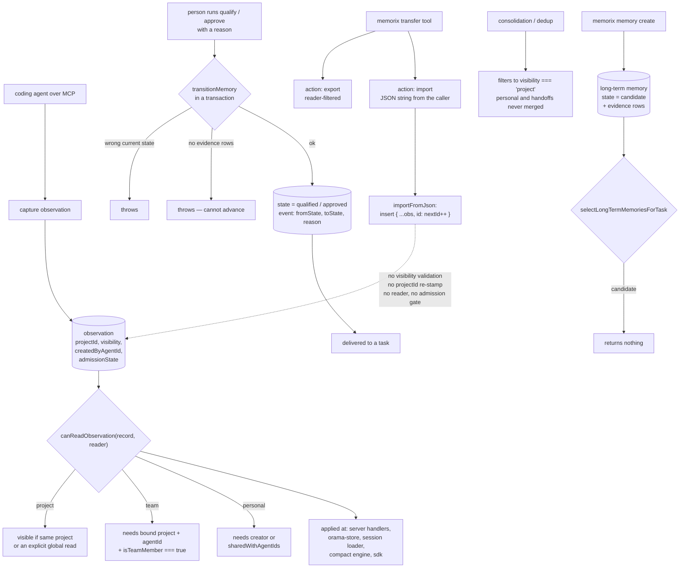

## 1. Executive Summary

Memorix is a local-first shared memory layer for coding agents — Apache-2.0,
version 1.9.3, 833 commits since 14 February 2026, 292,812 lines of TypeScript
against 135,576 lines across 620 test files. It targets a long list of hosts
through MCP and its own hooks, and keeps everything on the machine.

Its memory has two tiers, and both are more carefully governed than the norm.

An **observation** carries a visibility — `personal`, `team` or `project` — and
`canReadObservation` is consulted at every seam that returns one: the MCP
server's handlers, the Orama store's search and hydration paths, the session
loader, and the compaction engine. The policy is fail-closed where it matters:
a personal or team record needs a bound project *and* an agent id before it is
visible at all, team needs `isTeamMember === true`, and the server derives
membership from the coordination store inside a `try` whose `catch` carries the
rule in a comment — "A missing coordination store must never grant team
visibility."

A **long-term memory** climbs a ladder. It is created as a `candidate`, and
`selectLongTermMemoriesForTask` will not return it. A person runs `memorix
memory qualify` and then `approve`, each with a reason; the transition runs in a
transaction, refuses to fire unless the record is in the expected state,
refuses to advance a record with no evidence rows, and appends an event
carrying `fromState`, `toState` and the reason. Archived and superseded records
drop out of delivery.

The discipline extends to the background work, which is where systems in this
corpus usually leak. Consolidation filters to project visibility before
clustering, with the reason written down: personal notes and targeted handoffs
"must remain individually inspectable and are never merged by a background job
or another agent's manual cleanup."

Against all of that stands one unchecked write. The `memorix` transfer MCP tool
has two actions. Export calls `exportAsJson(projectDir, project.id,
getObservationReader())`, so it returns only what the caller may read. Import
takes a JSON string, parses it, and hands it to `importFromJson`, which loops
over `data.observations` and inserts `{ ...obs, id: nextId++ }`. It does not
validate `visibility`, does not re-stamp `projectId`, does not check
`createdByAgentId` against the caller, does not consult a reader, and does not
apply the admission gate. Since an unrecognised visibility resolves to
`project` and a missing `admissionState` counts as deliverable, a crafted
payload writes project-wide, automatically-delivered memory attributed to any
project and any agent — through the same tool surface the agent already holds.

Four marks: `scope_enforced`, `trust_state`, `human_review`, `negative_eval`.

## 2. Mental Model

An **observation** is what an agent noticed: an entity, a type, a body, and the
provenance around it. Its **visibility** decides who sees it; its
**admissionState** decides whether it is delivered without being asked for.

A **reader** is the caller's identity: a bound project id, an agent id, and
whether that agent is an active team member. Every read takes one. A reader of
`undefined` returns true from the policy and is documented as reserved for
"trusted internal maintenance, not MCP delivery".

A **long-term memory** is a curated, durable lesson — episodic, semantic or
procedural — scoped to a project, a user or a team, marked `project-bound` or
`portable`, and backed by typed **evidence** rows whose relation is `supports`,
`verifies`, `derives` or `user-confirmed`.

A **lifecycle** is the ladder: `candidate` → `qualified` → `approved`, with
`archived` and `superseded` as exits. Only `qualified` and `approved` are
delivered.

## 3. Architecture

| Area | Role |
| --- | --- |
| `src/memory` | The model: `visibility.ts`, `admission.ts`, `long-term*.ts`, `consolidation.ts`, `deduplication.ts`, `retention.ts`, `freshness.ts`, `secret-filter.ts`, `attribution-guard.ts`, `disclosure-policy.ts` |
| `src/store` | The Orama index and the observation store, both applying the visibility filter |
| `src/server.ts` | The MCP server: reader construction, every tool handler, the transfer tool |
| `src/compact` | Compact search, timeline and detail — the bounded retrieval surface for one turn |
| `src/cli` | The CLI, including the `memory` command where qualification and approval live |
| `src/codegraph`, `src/rerank`, `src/embedding`, `src/knowledge` | Retrieval machinery and the knowledge-claim layer |
| `src/audit` | Tracks files Memorix wrote into a project (hooks, rules) for cleanup and rollback — not a memory mutation log |
| `packages/` | `agent-core`, `ai`, `memcode`, `tui` |

## 4. Essential Implementation Paths

- `src/memory/visibility.ts:42-54` — `canReadObservation`, the whole policy.
- `src/server.ts:621-637` — `getObservationReader`, and the fail-closed catch.
- `src/memory/long-term.ts:394-425` — `transitionMemory`.
- `src/memory/admission.ts:15-29` — the delivery gate and its legacy default.
- `src/memory/consolidation.ts:151-157` — why personal records are never merged.
- `src/memory/export-import.ts:157-212` — `importFromJson`.
- `src/server.ts:4268-4281` — the transfer tool's import branch.

## 5. Memory Data Model

Observations carry provenance and policy fields side by side: `projectId`,
`visibility`, `createdByAgentId`, `sharedWithAgentIds`, `admissionState`,
`valueCategory`, `topicKey`. The types that count as durable automatic captures
are enumerated — `decision`, `gotcha`, `problem-solution`, `trade-off`,
`why-it-exists` — which is a narrower and more opinionated set than most.

Long-term memories are deliberately separate, and the header says so: these
contracts are "intentionally separate from Observation provenance and Knowledge
Claim truth contracts." A long-term memory has a kind, a scope, a state, a
portability, `qualifiedAt` / `approvedAt` / `archivedAt` / `lastValidatedAt`,
and evidence rows typed by both source kind and relation.

## 6. Retrieval Mechanics

The compact API is the normal path for one coding turn, with an explicit
retrieval boundary that keeps accidental search-and-detail loops cheap and an
escape hatch when a caller genuinely needs history. Every one of those calls
passes a reader.

`selectLongTermMemoriesForTask` filters on scope, lifecycle and portability
before scoring, then ranks by similarity with a bonus for `approved` and a
freshness term derived from `lastValidatedAt` or the approval date. A
project-bound user memory stays in its project; an explicitly portable one
crosses.

## 7. Write Mechanics

Observation capture runs through the secret filter and the attribution guard.
Long-term creation produces a candidate and nothing else; the header on the
creation helper says it plainly — "Qualification and approval are deliberate
later transitions."

Import is the exception, and it is the one write that skips every check the
rest of the file applies. Its only guard is a dedup on `topicKey` scoped by the
`projectId` *in the payload*, which the payload also controls.

## 8. Agent Integration

An MCP server aimed at a long list of hosts, plus hooks, rules, a TUI and a
dashboard. Agents get the compact retrieval surface, capture tools and the
transfer tool. Qualification and approval are deliberately not MCP tools —
they are CLI commands, which is what makes the human-review mark real rather
than nominal.

## 9. Reliability, Safety, and Trust

**Import is the hole in an otherwise careful policy.** `exportAsJson` takes a
reader and returns only readable records. `importFromJson` takes a parsed
object and inserts each observation with a fresh id and everything else copied.
Three defaults compound it. `resolveObservationVisibility` maps any value that
is not `personal`, `team` or `project` to `project` — a deliberate upgrade
choice, since "[p]re-control-plane records were intentionally project-shared",
but it means an absent or misspelled visibility becomes project-wide.
`isEligibleForAutomaticDelivery` treats an absent `admissionState` as
deliverable, for the same compatibility reason. And nothing re-stamps
`projectId` to the importing project. The result is that the transfer tool can
write project-visible, automatically-delivered observations attributed to any
project and any agent id — and it is an MCP tool, so the agent holds it.

Two smaller notes. An explicit global read drops `projectId` from the reader,
and `canReadObservation` then allows project-visible records from other
projects; the comment states the intent and the narrow scopes stay fenced, so
this is a documented widening rather than a slip. And the module called `audit`
records which files Memorix wrote into a project so they can be cleaned up or
rolled back; it is not a mutation log for memory, and the only per-record
mutation history is the long-term tier's transition events. `audit_log` is
therefore withheld: no append-only record covers the observation write paths.

## 10. Tests, Evals, and Benchmarks

620 test files. `tests/memory/long-term.test.ts` is the one to read first: its
eight cases are each named for a property rather than a function, and they pair
a must-not with a positive control in the same body — nothing selected before
qualification and an exact match after, nothing selected without team
membership and the record returned with it, a portable user fact crossing
projects while a project-bound one stays home, and a portable candidate derived
from project evidence rejected outright.

## 11. For Your Own Build

### Steal

- **Put the visibility check at every seam that returns a record**, not at one
  gate. Memorix calls the same predicate from the server, the index, the
  session loader, the compaction engine and the SDK, which is why adding a
  retrieval path does not quietly add a bypass.
- **Refuse to advance a memory that has no evidence.** The transition throws
  rather than promoting an unsupported record, and the reason a person typed is
  stored on the event.
- **Exclude personal and handoff records from background merging**, and write
  down why. Consolidation is where privacy scopes usually die.
- **Keep promotion off the agent's tool surface.** Qualification and approval
  are CLI-only, so the thing being reviewed cannot approve itself.

### Avoid

- **An import that trusts its payload when the export beside it does not.** If
  every read is fenced and one write is not, the write is the policy.
- **Compatibility defaults that fail open on a field that decides visibility.**
  Defaulting an unknown visibility to project-wide is defensible for rows
  written before the field existed; applying the same default to rows arriving
  from outside is not the same decision.

### Fit

Reach for this if you want local-first shared memory across several agent hosts
with real per-agent and per-team scoping, and a curated tier a person controls.
Be deliberate about who can call the transfer tool.

## 12. Open Questions

- Should `importFromJson` re-stamp `projectId`, reject unknown visibility
  values, and drop `createdByAgentId` it cannot attribute to the caller? All
  three are one-line changes against the helpers already in the file.
- Should the import action be a CLI-only surface, like qualification, rather
  than an MCP tool?
- Does anything call the observation read path with `reader: undefined` outside
  maintenance? The bypass is documented; a type that made it unrepresentable on
  MCP paths would retire the question.

## Appendix: File Index

| Path | What to read it for |
| --- | --- |
| `src/memory/visibility.ts` | The read policy and its fail-closed reasoning |
| `src/memory/admission.ts` | The delivery gate and the legacy default |
| `src/memory/long-term-types.ts` | States, scopes, portability, evidence kinds |
| `src/memory/long-term.ts` | The transition machinery and its refusals |
| `src/memory/consolidation.ts` | Why personal records are never merged |
| `src/memory/export-import.ts` | The unchecked import |
| `src/server.ts` | Reader construction and the transfer tool |
| `src/cli/commands/memory.ts` | Where a person qualifies and approves |
| `tests/memory/long-term.test.ts` | Eight property-named tests worth copying |

## History

**2026-09-16** — [`7071a49c178f3ea7aa3eb811fa802da4c436f28e`](https://github.com/AVIDS2/memorix/commit/7071a49c178f3ea7aa3eb811fa802da4c436f28e) — first reading, at a commit dated 14 September 2026. Screened before opening, from a shallow clone: thirty-five files, three auto-run surfaces (`.gitmodules`, an `.opencode/` directory and an MCP server manifest declaring a start command), five build-time execution points, three unpinned surfaces, four dependency files inside the cooldown, and `CLAUDE.md` and `GEMINI.md` read as data. Nothing was installed, built or run.
