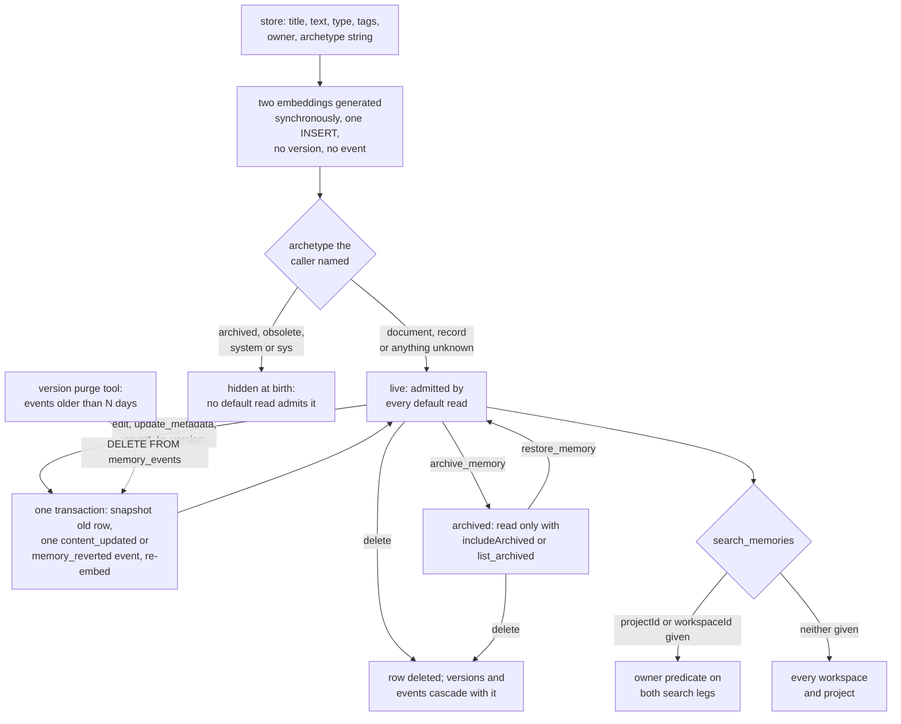

## 1. Executive Summary

Memorizer is a self-hosted memory service for coding agents, written in .NET and
maintained by Petabridge from a fork of Dario Griffo's `postg-mem`. An agent
connects over MCP and stores titled Markdown documents in Postgres, finds them
by hybrid search, edits them by find-and-replace, and organises them into
workspaces and projects. A web UI on the same port lets a person browse, edit,
diff and revert the same rows.

What is notable is the editing model. Every edit, metadata change and revert
snapshots the prior state and writes a change event in one transaction, so a
bad edit is one `revert_to_version` away. The retrieval choice is argued from a
committed evaluation corpus, recorded in an ADR, rather than asserted.

What is weak is the record around the edits. The event vocabulary declares six
change types and two have producers. Deleting a memory cascades its history
away, and a time-based purge deletes events outright. `delete_workspace` reports
moving memories it does not move. No inbound authentication exists.

The design is document-shaped rather than fact-shaped. A memory is closer to a
wiki page than to an extracted claim: the agent writes it, rewrites it, and
checks items off inside it. Nothing extracts, consolidates or judges. That is
the right shape for plans, checklists and reference notes an agent maintains
across sessions, and it leaves every question of truth to whoever writes.

## 2. Mental Model

A memory is whatever the caller stores: a title, a Markdown body, a free-text
type and source, tags, a confidence number, an owner and an archetype. It
becomes live the moment `store` commits. There is no candidate state, no
extraction, and no model call on the way in. It stops being live in one of
three ways: `archive_memory` hides it from default reads, `delete` removes it
with its history, or a later `edit` replaces its text in place.

**Archetype is the only state, and it is a visibility switch.** `document` and
`record` are admitted by every default read. `archived` is admitted only when a
caller passes `includeArchived`. `system` holds internal index rows for project
and workspace search and is admitted only by that search
(`src/Memorizer/Services/Memory.cs:1454-1463`). The archive tool describes its
effect as *"marking it as obsolete"*, and the `maintain_memory` prompt tells the
agent to archive anything *"old or not useful"*. Obsolete and wrong are the same
state.

**The caller picks the archetype, including the hidden ones.** `store` passes
its `archetype` string to `ParseArchetype`, which maps `archived`, `obsolete`
and `system` as readily as `document` (`src/Memorizer/Models/Enums/ArchetypeEnum.cs:67-80`).
The tool's description names only `document` and `record`. A memory stored with
`system` never appears in `search_memories`, `get_by_filter` or a project
listing, and no tool lists system rows.

**A record is described as immutable and is not.** The enum comment calls
`record` a *"historical, immutable record"* and `IsMutable()` returns false for
it (`ArchetypeEnum.cs:85-88`). Nothing outside the test projects calls
`IsMutable()`: `edit`, `update_metadata` and `revert_to_version` rewrite a
record exactly as they rewrite a document.

**Versions are the correction mechanism.** An update copies the pre-edit row
into `memory_versions` and writes one `memory_events` row, then overwrites
`memories` and re-embeds (`Memory.cs:1086-1102`). A revert snapshots the
current state before restoring an older one, so a revert can itself be reverted.
The history lives only as long as the row: `memory_versions` and
`memory_events` both reference `memories(id) ON DELETE CASCADE`
(`src/Memorizer/migrations/008_add_memory_versioning.sql:19`, `:56`).

Retrieval presents every hit as equally settled. `confidence` is stored,
displayed by `get`, and read by no WHERE clause or ranking term.

## 3. Architecture

One ASP.NET Core process serves three surfaces on one port: the MCP server at
`/mcp` over stateless Streamable HTTP, an MVC web UI at `/`, and a REST API
under `/api/` (`src/Memorizer/Program.cs:43-51`, `:129`). All three call one
scoped `Storage` class that issues hand-written SQL through Npgsql
(`Memory.cs:445-460`). Akka.NET hosts four background actors, each started from
the `/tools` page of the UI and reporting progress over server-sent events
(`src/Memorizer/Routes.cs`).

Persistence is one Postgres database with the `vector` extension. Twenty-one
numbered migrations run at startup through `SchemaMigrator`. Embeddings come
from Ollama or an OpenAI-compatible endpoint, configured at startup and
editable in the UI. An LLM provider is configured beside it and used only by
the title-generation actor.

### Deployment and ergonomics

The documented path is `docker-compose up -d`, which starts
`pgvector/pgvector:pg17`, pgAdmin, Ollama and the `petabridge/memorizer:latest`
image. Four services, all local, with no API key needed to store anything. It
runs offline once Ollama has pulled the embedding model. Every store blocks on
that model, so the service stores nothing while Ollama is down.

The shipped compose file publishes Postgres on 5432 with `postgres/postgres`
and Memorizer on 5000, both on all interfaces by Docker's default. It sets
`ASPNETCORE_ENVIRONMENT=Development` for the Memorizer container.

The store is repairable by hand in the way any Postgres table is, and pgAdmin
ships in the compose file for that purpose. The version history makes most
repairs unnecessary: the UI shows a diff between any two versions and reverts
with one click.

A fresh instance seeds sample content. `appsettings.json` sets
`Seeding:Enabled` to true, and `InitializationService` calls `SeedAsync` at
startup, which writes the 17 memories in `SeedData/seed-data.json` into sample
workspaces when no workspace exists yet. An operator who does not want sample
memories in an agent's search results has to turn it off.

## 4. Essential Implementation Paths

**Write.** `MemoryTools.Store` validates `text` and `title`, parses owner ids
defensively, parses the archetype string, and calls `Storage.StoreMemory`
(`src/Memorizer/Tools/MemoryTools.cs:33-119`). `StoreMemory` extracts a body
from JSON keys `text`, `fact`, `observation` or `content` if the input parses as
JSON, embeds title plus body and then title plus tags, and inserts one row
(`Memory.cs:488-612`). It writes no version and no event. An optional
relationship is inserted afterwards, outside any transaction.

**Retrieval.** `search_memories` calls `HybridSearch` with the caller's scope
and archive flags (`MemoryTools.cs:360-371`). `HybridSearch` builds the owner
and archetype predicates once and splices them into a vector query and a
full-text query, each limited to `max(limit*3, 30)` rows, then fuses by RRF
(`Memory.cs:1521-1700`). The HTTP routes `/api/memory/search` and
`/api/memory/search/metadata` call `SearchWithMetadataEmbedding` instead, a
single vector query that does apply a distance threshold
(`src/Memorizer/Controllers/MemoryController.cs:535-620`).

**Context assembly.** There is none on the server. `search_memories` returns
title, type, owner, archetype, tags and similarity per hit unless
`Search:ReturnFullContent` is set (default false), and ends with the `get_many`
call to make. `get` returns the full text, relationships, optional version
history, and by default up to five similar memories from anywhere in the store
(`MemoryTools.cs:523-737`).

**Update.** `edit` performs a find-and-replace on the stored text and calls
`UpdateMemory`, as does `update_metadata`. `UpdateMemory` reads the row,
computes a line diff and re-embeds both vectors. Then, in one transaction, it
writes the snapshot and a `content_updated` event, updates the row, and prunes
snapshots beyond `Versioning:MaxVersionsPerMemory` (50)
(`Memory.cs:1005-1147`, `:465-486`).

**Revert.** `RevertToVersion` writes a `memory_reverted` event, snapshots the
current state, restores the target snapshot and re-embeds, in one transaction
(`Memory.cs:1983-2098`). Relationships are not restored: the snapshot records
their ids and nothing reads them back.

**Archive and delete.** `UpdateMemoryArchetypeAsync` is one UPDATE with no
event (`Memory.cs:4068-4092`). `Delete` is `DELETE FROM memories WHERE id = @id`,
and the cascade takes versions, events and relationships (`Memory.cs:745-759`).

**Ownership.** `move_memory` and the UI's owner PATCH update `owner_type` and
`owner_id` with no event (`Memory.cs:1248-1268`, `:3809-3826`). Deleting a
project fires `trg_project_delete_move_memories`, which re-homes its memories
to Unfiled (`migrations/015_add_project_delete_trigger.sql`). Deleting a
workspace runs `DELETE FROM workspaces` and nothing else (`Memory.cs:2755-2769`).

**Background.** `VersionPurgeActor` calls `PurgeVersionsOlderThan`, which
deletes every event older than the cutoff and every snapshot older than it
except each memory's newest (`Memory.cs:2122-2163`). `TitleGenerationActor`
asks the configured LLM for titles on untitled rows. `EmbeddingRegenerationActor`
and `DimensionMigrationActor` rebuild vectors after a model change.

**Tests.** `src/Memorizer.IntegrationTests` boots Testcontainers Postgres and
Ollama once per collection (`IntegrationTestFixture.cs`). The scoping, archive
and versioning suites are described in section 10.

## 5. Memory Data Model

`memories` carries `id`, `title`, `text`, a legacy `content` JSONB, `type_legacy`
(free text), `memory_type` (a six-value enum no write path sets), `source`,
`tags`, `confidence`, `created_at`, `updated_at`, `current_version`,
`owner_type`, `owner_id`, `archetype`, two `vector` columns and `search_vector`.
The tsvector is maintained by a trigger weighting title A, tags B and body C
(`migrations/020_add_full_text_search.sql`).

**The owner is polymorphic and has no foreign key.** `owner_type` is 0 for a
workspace and 1 for a project, and `owner_id` is a UUID defaulting to the
Unfiled workspace (`migrations/014_extend_memories.sql:15-17`). The project
delete trigger keeps project-owned rows consistent. Nothing does the same for a
workspace, so memories owned directly by a deleted workspace keep an
`owner_id` pointing at nothing. Scoped reads then never reach them, and neither
does the Unfiled filter, which matches the zero UUID.

**Workspaces and projects nest without limit.** Both have `parent_id`; projects
also carry a status from draft to archived and free-text victory conditions.
Each project and workspace gets a `system` archetype memory in the hidden
*System Memories* workspace, whose text indexes its name and description for
`SearchProjectsAsync` and `SearchWorkspacesAsync`.

**History tables.** `memory_versions` holds full snapshots without embeddings,
unique on `(memory_id, version_number)`. `memory_events` holds `event_type`,
`event_data` JSONB, `timestamp` and a nullable `changed_by`. Only
`RevertToVersion` writes `changed_by`, from an optional string the caller
supplies. An update's event is stamped with the pre-edit version number, while
a revert's event carries the post-revert one, so `version_number` means
different things by event type.

**Relationships** are typed edges with an optional similarity score.
`created_in_version` and `deleted_in_version` exist on the table, set once by
migration 008 and written by nothing in `src/Memorizer`. No path removes a
relationship except the delete cascade.

No field carries validity time. `created_at` and `updated_at` are record time,
and a snapshot's `versioned_at` is when it was taken.

## 6. Retrieval Mechanics

**The primary search is two legs and a rank fusion.** The vector leg orders by
cosine distance on the title-plus-tags embedding, with no distance predicate.
The lexical leg builds an AND of prefix terms (`postgres:* & backup:*`) and
ranks by `ts_rank_cd`. RRF adds `weight/(60 + rank)` per leg, with the lexical
weight at 1.5 for queries of one or two words, and applies a 10 percent
multiplier for a tag match (`Memory.cs:1541`, `:1613-1651`). The body reaches
ranking only through the C-weighted tsvector; the body embedding is not
queried here.

**The similarity threshold is a documented no-op, and the tool still advertises
it.** `HybridSearch` accepts `minSimilarity` and never reads it. The ADR records
this as intended, *"accepted but not applied"*, because a hard threshold caused
zero-result queries (`docs/adr/2026-02-14-hybrid-search-rrf.md:58`). The MCP
parameter is still described as a *"Minimum similarity threshold"* with a
default of 0.7 (`MemoryTools.cs:317`).

The consequence is that `search_memories` cannot report that nothing relevant
exists. On any non-empty scope the vector leg returns rows, so every query gets
up to `limit` hits. The fallback that retries at a threshold 0.1 lower when
nothing matched cannot find what the first call missed, since the value it
lowers is not read (`MemoryTools.cs:378-410`).

**Scope is a predicate, when asked for.** With `projectId`, both legs add
`owner_type = 1 AND owner_id = @projectId`, optionally OR the Unfiled
workspace. With `workspaceId`, they admit the workspace's own rows and every
row owned by a project in it (`Memory.cs:1425-1444`). With neither, the search
spans the whole store. The two ids are mutually exclusive, enforced in the tool
and again by `EnsureOwnerScopeExclusive`.

**`workspaceId` means two things.** In `search_memories` it rolls up the
workspace's projects. In `get_by_filter` it is an exact owner match, so the same
id returns the workspace's direct memories only (`Memory.cs:3918-3922`).

**The similar-memories list crosses every boundary.** `get` defaults
`includeSimilar` to true and calls `GetSimilarMemories`, whose SQL excludes
archived and system rows and has no owner predicate (`Memory.cs:913-927`). Each
`get` therefore puts up to five titles from any project into the agent's
context. The parameter description says the comparison uses the content
embedding; the query uses the metadata embedding.

Injection is bounded by `limit` (default 10) and by the lightweight result
format. Nothing is injected automatically, so the server never touches a
provider's prompt-prefix cache.

## 7. Write Mechanics

Writes are explicit and synchronous. `store` blocks on two embedding calls and
one INSERT; the memory is retrievable when the call returns. `edit` and
`update_metadata` block on two embedding calls and a four-statement
transaction. The `update_metadata` description promises no embedding
regeneration, and it calls the same `UpdateMemory`, which regenerates both
(`MemoryTools.cs:251`).

**No deduplication or consolidation runs on the write path.** The duplicate
signal is surfaced to the agent instead: `get` lists similar memories and the
tool text suggests consolidating them. The agent merges by editing one memory
and archiving the other, which the `maintain_memory` prompt prescribes.

**Conflict handling is last-write-wins on the row.** `UpdateMemory` reads the
current row outside its transaction and writes `current_version + 1` inside it.
Two concurrent edits to one memory both compute the same next version. The
snapshot insert uses `ON CONFLICT DO NOTHING`, so the second writer's snapshot
is dropped and its UPDATE wins.

**Agent-generated content is stored as given.** `source` defaults to `LLM` and
is otherwise whatever the caller passes. No filter looks at the text.

### Operational cost

No LLM call sits on any memory write. Each store costs two embedding requests,
and each search one embedding request and two SQL queries. Nothing rewrites the
whole store on a schedule. Embedding regeneration and dimension migration
re-embed everything, but only when an operator starts them after changing
models. Per-search output is bounded by `limit` and the lightweight format;
`get` returns the full body.

## 8. Agent Integration

The MCP server registers 21 tools across `MemoryTools` and `WorkspaceTools`,
named in snake case as the MCP tests assert (`McpServerTests.cs:70-73`):
`store`, `edit`, `update_metadata`, `search_memories`, `get`, `get_many`,
`delete`, `create_reference`, `revert_to_version`, `archive_memory`,
`restore_memory`, `get_by_filter` and `list_archived`, plus workspace and
project CRUD, `get_project_context` and `move_memory`. Seven prompts describe
workflows, and one resource returns the workspace tree
(`src/Memorizer/Prompts/MemorizerPrompts.cs`, `src/Memorizer/Resources/MemorizerResources.cs`).

The agent has every verb. It can create, rewrite, revert, archive, restore and
permanently delete any memory in any workspace, with no confirmation on any of
them. Retrieval is entirely tool-driven: no hook injects anything at session
start, and the README asks the operator to paste a tool list into the agent's
system prompt.

`ToolArgumentGuard` validates arguments at the CallTool boundary and returns a
message the model can act on instead of the SDK's binding error. Ids accept a
`doc-` prefix. These are the parts most easily lifted into another MCP server.

Porting to another agent is trivial for any MCP client: one URL. The session
lifecycle is the client's.

## 9. Reliability, Safety, and Trust

**No inbound authentication exists.** `Program.cs` registers no authentication
scheme, and CORS defaults to any origin, any method and any header
(`src/Memorizer/Settings/CorsSettings.cs:35-40`, `appsettings.json:24-29`).
With the shipped defaults, any page open in a browser on the same machine can
send `DELETE /api/memory/{id}` to the service and read its responses.
`docs/security.md` recommends restricting origins for production; the defaults
are open.

**Provenance is caller-asserted.** `source` is a free string and `changed_by`
is recorded only on reverts, from a parameter. Nothing distinguishes a memory a
person wrote in the UI from one an agent stored.

**Prompt-injected memories have no gate.** An agent that reads hostile text can
store it, and a later session retrieves it with the same standing as anything
else. The same agent can archive or delete the memories that would contradict
it.

**Deletion is thorough at the row and loses its own record.** `delete` removes
the memory, its snapshots and its events together. The embedding goes with the
row. Nothing records that the memory existed.

**One tool reports an effect it does not have.** `delete_workspace` checks for
child projects and workspaces, deletes the workspace, and returns *"N memories
were moved to Unfiled"* (`src/Memorizer/Tools/WorkspaceTools.cs:331-386`). No
trigger or statement moves them, and the HTTP route returns the same count as
`memoriesMoved`. The memories survive with a dangling owner, reachable by an
unscoped search or by id and by no scoped read.

**Uncertainty cannot be represented as a state.** `confidence` is a number no
read consults, and `archived` means put away rather than disbelieved.

Capability marks:

- `scope_enforced` — awarded. The owner is a key on the row, and the search and
  listing reads apply it as a predicate when a scope is named. It is optional,
  unauthenticated, and bypassed by `get`, `get_many` and the similar list.
- `negative_eval` — awarded, section 10.
- `audit_log` — withheld. `memory_events` is written on the right path for
  updates and reverts, inside the same transaction, and it is not an
  append-only mutation record. Of six declared event types, `content_updated`
  and `memory_reverted` have producers. `memory_created` is written only by the
  migration 008 backfill, and `metadata_updated`, `relationship_added` and
  `relationship_removed` by nothing (`src/Memorizer/Models/MemoryEvent.cs:101-109`).
  Store, archive, restore, move and delete write no event.
  `PurgeVersionsOlderThan` deletes events by age (`Memory.cs:2128-2134`), and
  the cascade deletes them with their memory.
- `trust_state` — withheld. `archived` filters, and it is a retention pair with
  the live archetypes, the call made for [Lerim](../lerim/). Nothing expresses
  *recorded but not believed*: the agent archives the obsolete and the wrong
  alike, restores either at will, and can store directly into a hidden
  archetype.
- `human_review` — withheld. The web UI edits and reverts the same rows the
  agent's tools reach, after the write has landed. No memory waits on a person.
- `tombstone` — withheld. `delete` removes the row and its history, and
  `archive` keeps the row keyed on its id. Nothing keyed on rejected text stops
  it being stored again.
- `bitemporal` — withheld. No validity time exists.

## 10. Tests, Evals, and Benchmarks

Nothing was built or run for this report. Everything below is from reading the
tests at the pin.

CI runs `dotnet build` and `dotnet test` on `ubuntu-latest`
(`.github/workflows/pr_validation.yml`). The integration fixture starts
`pgvector/pgvector:pg17` and `ollama/ollama:latest` containers and pulls
`all-minilm` before any test runs. No test in either project carries a `Skip`,
so a run without Docker fails rather than passing empty.

**The scope case is the strongest test in the tree.**
`SearchWithMetadataEmbedding_WithWorkspaceId_RollsUpWorkspaceAndProjects`
stores five memories whose titles share a per-run nonce: one on workspace A,
two in A's projects, one on workspace B and one in B's project. It searches
workspace A with a threshold of zero and asserts the three A memories present
and the two B memories absent (`McpToolsProjectScopingTests.cs:464-579`). The
comment beside the nonce records why: a title mismatch had made the test flaky.

**The archive case pairs exclusion with an exact count.**
`GetMemoriesByOwnerAsync_ExcludesArchivedMemories` stores five memories in one
project, archives two, and asserts the listing holds exactly three rows, each
active id, and neither archived id (`ArchivedMemoryTests.cs:254-336`). That
listing is what `get_project_context` returns.

**The weaker cases sit beside them.**
`SearchWithMetadataEmbedding_WithProjectId_FiltersCorrectly` asserts only
`Assert.All(results, owner == project1)`, which passes on an empty result
(`McpToolsProjectScopingTests.cs:255`, `:271`). No test runs `HybridSearch`
against a database for results. The unit test for the MCP search asserts that
the tool forwards `workspaceId` to a fake (`MemoryToolsCanonicalUrlTests.cs:182-202`).
The one `record` immutability assertion checks the return value of
`IsMutable()`, not an attempted edit (`McpToolsProjectScopingTests.cs:175`).

**Versioning is well covered.** `MemoryVersioningTests.cs` exercises
pre-versioning rows, repeated edits, revert-the-revert and pruning past the
cap, asserting the pruned version numbers are gone. Nothing tests event
coverage, and nothing tests deleting a workspace that holds memories.

**The retrieval eval is a harness, not a result.**
`SearchEval/synthetic_corpus.json` and `evaluation_queries.json` (30 queries
with expected relevant ids) ship in the tree. `POST /api/search-eval/run`
computes MRR, recall, hit rate and NDCG for three search methods at three
thresholds against a live instance, and the ADR quotes a table from it. No run
output is committed. `HybridSearch` ignores the threshold, so its three rows
per run are the same search.

No paper or citation file exists in the tree. The ADR's production figures come
from a 2,335-memory dataset that is not committed.

## 11. For Your Own Build

### Steal

- **Snapshot before overwrite, in the write's transaction.** A full prior-state
  row per edit, plus a revert that snapshots before restoring, makes every
  agent edit reversible at the cost of one INSERT. Cap the count, and say so.
- **Keep a committed retrieval corpus and pick the ranker with it.** The ADR
  table comparing three methods on MRR, recall and NDCG is a better argument for
  a ranking change than any description of it.
- **Share one predicate builder across every search method.** The owner filter
  is one function spliced into both legs and into the older search, which is
  why a test against one method says something about the others.
- **Return correctable tool errors.** Validate MCP arguments before binding and
  answer with the fix, not the exception.

### Avoid

- **An event vocabulary wider than its producers.** Declaring six change types
  and writing two reads as an audit trail to anyone who reads the schema. Write
  the event on every mutation path, or declare only what is written.
- **Cascading history away with its subject.** If the log is how a correction
  is explained, a delete is the correction most in need of a record, and a
  cascade removes it.
- **A parameter kept for compatibility after it stops working.** An ignored
  threshold with a default and a description tells the model it is filtering.
  Remove it or rename it.
- **A caller-parsed visibility state.** When a free-form string can select a
  hidden state, the agent can hide memories by accident. Accept only the states
  a caller is meant to set.
- **A tool message describing work the code does not do.** A success string is
  read as fact by the agent and by the person watching it.

### Fit

This suits a single developer or a small trusted team on one machine or a
private network, who want an agent to keep living documents — plans,
checklists, specs, reference notes — organised by project, with a UI to see and
undo what the agent did. The operator cost is a Docker compose file and an
embedding model.

Walk away if memory must be isolated between users, defended against hostile
input, or explainable after a deletion. There is no user, no authentication and
no durable record of what was removed. Walk away too if the agent should learn
facts from conversation without being told to: nothing here extracts.

## 12. Open Questions

- Whether the published `petabridge/memorizer:latest` image carries
  `Seeding:Enabled` true, as `appsettings.json` does at the pin, and so seeds
  sample memories into every fresh deployment.
- Whether the `delete_workspace` message is known to be wrong upstream, or
  relied on a trigger that existed only on another branch.
- What the search eval reports on a store holding only the synthetic corpus.
  The harness searches unscoped, so on a working instance the user's own
  memories compete with the corpus.
- `docker-compose.yml` sets `MEMORIZER_LLM__Chunking__*` variables, and two
  ADRs describe chunking; whether that feature was removed or never landed on
  `dev`.

## Appendix: File Index

- **Schema:** `src/Memorizer/migrations/008_add_memory_versioning.sql`,
  `014_extend_memories.sql`, `015_add_project_delete_trigger.sql`,
  `016_add_archived_support.sql`, `017_add_system_archetype.sql`,
  `020_add_full_text_search.sql`.
- **Storage:** `src/Memorizer/Services/Memory.cs` (`StoreMemory`,
  `UpdateMemory`, `HybridSearch`, `GetSimilarMemories`, `RevertToVersion`,
  `PurgeVersionsOlderThan`, `CreateVersionSnapshot`, `GetMemoriesByOwnerAsync`,
  `DeleteWorkspaceAsync`).
- **Model:** `src/Memorizer/Models/Enums/ArchetypeEnum.cs`,
  `src/Memorizer/Models/MemoryEvent.cs`, `src/Memorizer/Models/Memory.cs`.
- **MCP:** `src/Memorizer/Tools/MemoryTools.cs`,
  `src/Memorizer/Tools/WorkspaceTools.cs`, `src/Memorizer/Tools/ToolArgumentGuard.cs`,
  `src/Memorizer/Prompts/MemorizerPrompts.cs`, `src/Memorizer/Program.cs`.
- **HTTP and UI:** `src/Memorizer/Controllers/MemoryController.cs`,
  `WorkspaceController.cs`, `SearchEvalController.cs`, `ToolsController.cs`.
- **Background:** `src/Memorizer/Actors/VersionPurgeActor.cs`,
  `TitleGenerationActor.cs`, `EmbeddingRegenerationActor.cs`,
  `DimensionMigrationActor.cs`.
- **Decisions:** `docs/adr/2026-02-14-hybrid-search-rrf.md`.
- **Tests:** `src/Memorizer.IntegrationTests/McpToolsProjectScopingTests.cs`,
  `ArchivedMemoryTests.cs`, `MemoryVersioningTests.cs`,
  `MemoryToolsIntegrationTests.cs`, `Mcp/McpServerTests.cs`,
  `src/Memorizer.UnitTests/Tools/MemoryToolsCanonicalUrlTests.cs`.

### Recorded searches

Checked against the checkout at the pinned revision, from the repository root.

- `grep -rn 'memory_events\|memory_versions' --include='*.cs' src | grep -v 'Tests/'` — inserts only in `Memory.cs` at `:2020` (revert) and `:2222` (`CreateVersionSnapshot`); deletes at `:479`, `:2112`, `:2131`, `:2142`.
- `grep -rn 'CreateVersionSnapshot' --include='*.cs' src` — one caller, `UpdateMemory` at `Memory.cs:1095`.
- `grep -rn 'new \(MemoryCreatedEvent\|ContentUpdatedEvent\|MetadataUpdatedEvent\|RelationshipAddedEvent\|RelationshipRemovedEvent\|MemoryRevertedEvent\)' --include='*.cs' src | grep -v Tests` — producers at `Memory.cs:1086` and `:2016`; the rest are deserializer fallbacks in `MemoryEvent.cs`.
- `awk 'NR>=1521 && NR<=1700 && /minSimilarity|maxDistance|BuildDistanceFilter/' src/Memorizer/Services/Memory.cs` — one line, the signature at `:1524`.
- `grep -rn 'IsMutable' --include='*.cs' src` — the definition and two test files; no production caller.
- `grep -rn -i 'CREATE TRIGGER' src/Memorizer/migrations` — `trg_project_delete_move_memories` and `memories_search_vector_trigger`; none on `workspaces`.
- `grep -rn 'deleted_in_version\|created_in_version' --include='*.cs' src` — one doc comment at `Memory.cs:2439`; no writer.
- `grep -rn -i 'Authorize\|AddAuthentication\|Bearer' --include='*.cs' src | grep -v Tests` — outbound embedding and provider-test headers only.
- `grep -rn -i 'order by.*confidence\|where.*confidence\|confidence *[<>]' --include='*.cs' src/Memorizer` — two matches, the `Confidence` value type's declaration and its JSON converter.
- `grep -rn -i 'chunk' src --include='*.cs' | grep -v Tests` — streaming response chunks in `OllamaMemorizerAgentProvider.cs` only; no `Chunking` setting is read.
- `grep -rn 'Skip' --include='*.cs' src/Memorizer.UnitTests src/Memorizer.IntegrationTests` — no match.
- `grep -rniE 'tombstone|blocklist|denylist|rejected|suppress' src --include='*.cs' --include='*.sql' | grep -v Tests` — one comment in `ToolArgumentGuard.cs` about argument binding.
- `grep -rniE 'valid_from|valid_to|valid_at|invalid_at|effective_' src --include='*.cs' --include='*.sql'` — no match.
- `grep -rliE 'arxiv|bibtex|@article|@misc|doi\.org' . --exclude-dir=.git` — no match, and no `CITATION` file.

## History

**2026-09-26** — [`0c043e4c0af20e92af5b9f18b8fd939780a025cf`](https://github.com/petabridge/memorizer/commit/0c043e4c0af20e92af5b9f18b8fd939780a025cf) — first reading, at the head of `dev`, a commit dated 11 September 2026. Two marks, `scope_enforced` and `negative_eval`. Screened before reading: no auto-run surface, no build-time execution point, nothing inside the cooldown, and three unpinned surfaces, each a `.csproj` whose versions are pinned exactly in `Directory.Packages.props` through central package management. `AGENT.md` and `CLAUDE.md` were recorded as data. Read with `grep` and `sed`; nothing installed, built or run.
