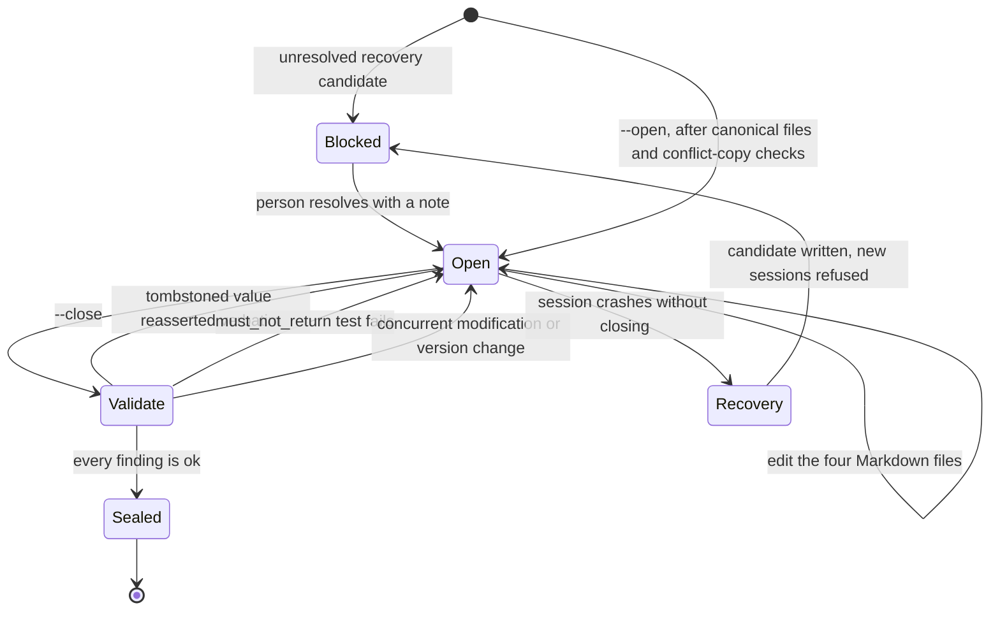

## 1. Executive Summary

Memory Compiler is 1,432 lines — one 848-line Python file with no third-party dependencies, four Markdown conventions, two templates and a worked example. MIT licensed, three commits, all uploaded on 11 August 2026, and self-described as *"a reference implementation, not a maintained product — pulled out of a real project and genericized for sharing"*.

It is in this atlas because of one file and one function. `TOMBSTONES.md` is an add-only table whose columns are `ID | Fact / Key | Rejected value | Replacement | Date | Reason | Source`, and `tombstone_collision_check()` scans the other canonical files for any rejected value appearing verbatim. A hit is a blocking finding: `cmd_close` refuses to seal the session and leaves the ledger entry `OPEN`. That is a durable record keyed on the **value**, consulted mechanically, with teeth — the [rejected-value tombstone](../../patterns/rejected-value-tombstone/) this atlas finds in a small minority of the systems it has read, implemented in about thirty lines by someone who evidently hit the problem it solves.

The design premise is stated in the README and is the opposite of most of this corpus: *"it assumes most of what happens in a session should be thrown away, and the small amount that should persist should be written deliberately, validated mechanically, and provably correctable when it turns out wrong."* There is no extraction, no embedding, no retrieval engine and no background pass. The four files are the memory; the compiler's whole job is to refuse to let them go quietly wrong.

**The finding that matters is a noise floor.** `tombstone_collision_check` only considers rejected values of twelve characters or more, with the reason in a comment — *"ignore short/generic strings, too noisy"*. Both tombstones in the shipped example are ten characters long: `2026-09-01`, a superseded go-live date, and `hex 1E3A5F`, a superseded brand colour. Neither is visible to the automatic check. What actually covers them is `memory_tests.yaml`, where two hand-written `must_not_return` cases name the same values — so in the project's own example, the safety net that runs on every close cannot see either tombstone, and the mechanism that catches them is the one an adopter has to remember to write.

That is not fatal and it is worth being precise about: dates, hex codes, prices, version numbers and names are most of what gets corrected in practice, and they are almost all under twelve characters.

## 2. Mental Model

A memory is a row in one of four tables, and which table it is in *is* its epistemic status.

- **`CONTEXT.md`** holds durable facts. Every mutable entry carries an `as_of` date and an evidence pointer.
- **`OPEN_ITEMS.md`** is the work ledger. Items have permanent IDs and must resolve to `OPEN`, `BLOCKED`, `DONE` or `DROPPED` — `DROPPED` being distinct from `DONE` is the point, because the handoff discipline is designed to catch items quietly abandoned rather than finished.
- **`DECISIONS.md`** is append-only, and each decision carries its *why*.
- **`TOMBSTONES.md`** is add-only and holds what is no longer true.

A fact becomes memory because a person or an agent typed it into a table. It stops being memory by moving to `TOMBSTONES.md` with a replacement, a date, a reason and a source — and the replacement is recorded as a **pointer, not a copy**. The architecture states why: *"A copied value is the next stale fact waiting to happen."* In the example, `T-001`'s replacement column reads `D-002`, a decision id, and `CONTEXT.md`'s current go-live entry says in its own margin that it deliberately does not repeat the old date because that is exactly the reassertion the tombstone exists to prevent.

There is no trust ladder, and that is a decision rather than an omission. `ARCHITECTURE.md` §5 records it: *"Trust tags kept to one: `candidate`, recovery-sourced only. More granular trust levels sounded appealing but nobody could agree on the boundaries, and a tag nobody maintains is worse than no tag."* Only facts recovered from a crashed session are tagged, and only until reconciled.

The state that governs everything is the session, not the memory. A session is `OPEN` or `CLOSED`, and the transition between them is where every check lives.



## 3. Architecture

There is no runtime. `memory_check.py` is a command-line program run twice per session — `--open` at the start, `--close` at the end — against a directory of Markdown files.

- **`memory_check.py`** (848 lines) — validation, the generated index, the test runner, the session ledger, locking and recovery.
- **`templates/HANDOFF_TEMPLATE.md`** — the end-of-session writeup, with a size cap and a supersedes-diff discipline.
- **`templates/RECOVERY_TEMPLATE.md`** — generated when a session crashes.
- **`examples/`** — a freelancer's client-rebrand project with all four files populated plus `memory_tests.yaml`.

Storage is the filesystem: four Markdown files at a topic root, a JSON ledger entry per session, and recovery candidates as JSON plus a rendered Markdown view. Writes go through `atomic_write_json` and `atomic_write_text`.

### Deployment and ergonomics

Cheap to the point of being hard to beat: Python 3, no dependencies, one file to copy. The store is Markdown, so it is diffable, reviewable in a pull request, correctable in any editor, and readable by any agent that can open a file — the properties the [memory-as-an-editing-surface](../../patterns/memory-as-an-editing-surface/) pattern is about.

Multi-machine use is addressed rather than assumed. The synced folder is transport and never authority; a single-writer rule prevents the final write race while baseline hashing detects a stale writer, and the architecture insists the distinction matters. The compiler detects sync conflict-copy files by name and blocks. `§6.3` names the case it does not solve — two machines editing offline simultaneously — instead of implying coverage.

**What is missing is the integration.** The README is explicit that *"the glue code is yours to write for whatever agent harness you're on"*. There is no hook, no plugin, no slash command and no MCP server in the repository, so an adopter supplies the part that makes `--open` and `--close` actually run. Everything this report describes is contingent on that glue existing.

## 4. Essential Implementation Paths

### The tombstone — `tombstone_collision_check()`

```python
val = row[2].strip().strip("`\"")
if len(val) >= 12:  # ignore short/generic strings, too noisy
    rejected_values.append((row[0], val))
```

then, for each canonical file other than `TOMBSTONES.md`, `if val in text` produces an `ask` finding naming the tombstone id. `run_validate` collects it, and `cmd_close` turns any `ask` into a refusal:

```python
if any(f[0] == "ask" for f in findings):
    print("[ASK] validation finding(s) above must be resolved before this close can seal — "
          "ledger entry left OPEN.")
    return 1
```

Three properties are worth separating. It is keyed on the **value**, not on a record id, which is what distinguishes this from the supersession chains that fill the rest of this corpus. It is **enforced at a chokepoint** — you cannot seal a session past it. And it is **substring matching over four files**, which bounds what it can honestly claim: it catches a stale value copied back into canonical memory, not a model reasserting the same fact in different words, and not anything said in conversation.

The twelve-character floor is the part to weigh. It exists for a real reason — a two-character rejected value would match everywhere — and the cost is that the class of value most often corrected falls below it.

### The tests — `run_tests()`

`memory_tests.yaml` is parsed by a hand-rolled reader and supports exactly two assertion types:

- `must_reference` — a value that must still be findable in a named file.
- `must_not_return` — a value that must never reappear, with the failure text *"tombstoned value '…' found verbatim"*.

Both run on `--close`, and a failure blocks the seal on the same path as a validation finding. The example ships one positive and two negatives, and the two negatives are precisely the two tombstoned values the collision check is too short-sighted to see. Whether that is deliberate design — tests as the escape hatch for short values — or coincidence, it is the arrangement that makes the example correct, and an adopter who writes no tests loses it.

### The close — `cmd_close()`

The gate is a sequence of refusals, and its order is deliberate: conflict-copy files, then a **compiler version check** (*"memory tooling changed during session — opened under X, closing under Y. Revalidate, don't silently continue"*), then baseline-hash comparison for concurrent modification, then validation, then build, then tests. Only after all of them does the ledger entry become `CLOSED`.

Step five is the one worth quoting, because it is an absence declared rather than implied:

```python
print("[ok] audit: not implemented in this reference build — no audit trail was written")
```

This atlas has recorded the opposite shape more than once — a schema with an audit table, an ORM class, indexes and a dashboard counter that nothing ever inserts into. Printing "this did not run" on every close is the cheapest possible defence against a reader assuming it did.

### Recovery — `cmd_recovery_scan()` / `cmd_resolve_recovery()`

A session that crashes leaves an `OPEN` ledger entry. `--recovery-scan` finds stale ones and writes a candidate document from `RECOVERY_TEMPLATE.md`; a person or another agent fills in the facts from the transcript and runs `--resolve-recovery` with a note. Two things make this a real gate rather than a report. An unresolved candidate **hard-blocks `--open`**, so no new writing session starts while a crash is unreconciled. And the resolution seals the stale entry with `closed_via: "recovery"`, marked, in the code's words, *"distinctly marked so it's never mistaken for a normal validated close"* — a session that was reconciled by hand and one that passed every check are different facts, and the ledger keeps them different.

### Validation — the other checks

`validate_open_items`, `validate_tombstones` and `validate_decisions` enforce exact table headers, unique permanent IDs, and no empty cells — every field in a tombstone row is mandatory, so a rejection without a reason or a source cannot be recorded. `truncation_check` looks for a file that ends mid-structure: an odd number of code fences, a row whose column count disagrees with the header, a file ending on an unterminated table row. That is aimed squarely at the failure where a model writes a file and stops partway.

## 5. Memory Data Model

Markdown tables. `TOMBSTONES.md` carries seven mandatory columns; `OPEN_ITEMS.md` uses permanent IDs and a closed status vocabulary; `DECISIONS.md` is append-only with a rationale column; `CONTEXT.md` is prose with an `as_of` date and an evidence pointer on every mutable claim.

Provenance is a convention enforced only at the column level: a tombstone must have a non-empty `Source`, but nothing checks that the source resolves to anything. Temporal information is a single `as_of` per fact — when the claim was evidenced — with no separate record of when the file learned it, so the store cannot answer what it believed on a past date. There is no scope key; the unit of isolation is the topic directory.

## 6. Retrieval Mechanics

There are none, and the report should be plain about it. No index is queried, no similarity is computed, and the compiler never answers a question. `build_generated_index` regenerates a disposable summary view marked as generated, and the design intent is that the agent reads the canonical files directly.

That makes the four files a *context payload* rather than a retrieval result, and it puts a hard ceiling on scale: everything durable is meant to fit in a prompt. For the target — one long-running project, one or two people — that is the right trade, and it is the reason the rest of the design can be as strict as it is. A system that must select from ten thousand memories cannot afford to block a session close on a whole-file scan.

## 7. Write Mechanics

Writes are manual. A person or an agent edits the Markdown; nothing extracts facts from a transcript, and no model is called anywhere in the repository. `HANDOFF_TEMPLATE.md` imposes a size cap and a supersedes diff, which is where the discipline against quiet drops lives.

### Operational cost

- **Nothing runs on the turn.** The agent's session is unaffected until `--close`.
- **The lag before a memory is usable is zero** — it is in the file the moment it is typed.
- **No background pass exists**, so nothing can silently re-derive a value that was tombstoned. In a corpus where most deletions survive only until the next scheduled job, having no scheduled jobs is a real property.
- **The close cost is a full scan** of four files plus every test, which is milliseconds at the intended scale and grows linearly with the store.

## 8. Agent Integration

Deliberately absent. The README states the intent — session-start behaviour runs `--open` and `--recovery-scan`, session-end runs `--close` — and leaves the wiring to the adopter. In practice that means the guarantees here hold exactly as often as the adopter's harness remembers to invoke the compiler, and nothing in the repository can enforce that. A session that simply never calls `--close` gets none of the checks and leaves a stale `OPEN` entry that blocks the next one, which is at least a failure that surfaces.

## 9. Reliability, Safety, and Trust

Strengths:

- **A rejected value reasserted verbatim blocks the session from sealing.**
- **Tombstone replacements are pointers**, with the reasoning recorded: a copied value is the next stale fact.
- **Every tombstone field is mandatory**, so a rejection cannot be recorded without a reason and a source.
- **An unresolved crash hard-blocks new sessions**, and a recovery close is marked as distinct from a validated one.
- **A tooling-version change mid-session refuses the close** rather than revalidating under different rules.
- **Single-writer locking and stale-writer detection are treated as different jobs**, and the architecture says why.
- **The unimplemented audit prints that it did not run.**
- **`ARCHITECTURE.md` §5 records the decisions that could have gone the other way**, each with the condition under which an adopter should choose differently.

Gaps:

- **The collision floor excludes short values**, which is most of what gets corrected — and both tombstones in the example fall under it.
- **Verbatim substring matching only**, so a paraphrase of a rejected value passes every check.
- **The checks bound the files, not the model.** Nothing here prevents an agent from stating a tombstoned fact in conversation; the guarantee is about what is written back.
- **No audit trail**, by declaration.
- **Provenance is a non-empty string**, not a resolvable reference.
- **No integration ships**, so every guarantee depends on glue the adopter writes.
- **Three commits of history**, all uploaded on one day, with no test suite for the compiler itself.

## 10. Tests, Evals, and Benchmarks

**There is no test suite for `memory_check.py`.** The 848 lines that enforce every rule in this report are themselves unexercised by any committed test, which is the gap I would close first — `tombstone_collision_check` and the `ask`-blocks-close path are each a few lines and each carries the whole guarantee.

What is committed is a *test format for the memory*, which is a different and rarer thing. `memory_tests.yaml` supports `must_reference` and `must_not_return`, both run on every close, both able to block the seal. The example ships two `must_not_return` cases naming tombstoned values.

Those are **committed negative assertions about a corrected value**, which is the harder form this atlas has otherwise recorded in very few systems. The kind matters and is worth stating for a strict reader: they assert about the contents of a canonical Markdown file rather than about the result of a query. In this design that distinction is thin, because the file *is* what reaches the agent — but a reader applying the rubric's narrowest reading should count it as an assertion about a written artifact, not a retrieval result.

**I ran nothing.** The screen reported `NOTHING SCANNED` — there is no manifest, hook or agent file at any path it knows about — so I read the tree by hand instead: eleven files, and no build, install or execution surface among them beyond the single script. The character-length observations in this report were computed separately rather than by running the compiler.

**No paper, arXiv reference or citation file exists in this repository.**

## 11. For Your Own Build

### Steal

- **Key the tombstone on the value and check it at a chokepoint.** The whole mechanism is a table with a rejected-value column and thirty lines that scan for it before anything is allowed to seal. Every part of this atlas's argument about correction is satisfied by that much code, at this scale.
- **Record the replacement as a pointer, not a copy.** A copied value is the next stale fact, and a tombstone that copies is a tombstone that will need a tombstone.
- **Make every field of a rejection mandatory.** A rejected value with no reason and no source is an assertion nobody can review later.
- **Refuse the close, do not warn on it.** A finding that leaves the session `OPEN` is a mechanism; the same finding printed as a warning is a habit.
- **Print the absences.** A pipeline step that announces "not implemented in this build — nothing was written" costs one line and prevents a reader from assuming an audit trail exists.
- **Distinguish a reconciled close from a validated one** in the record. Sealing both as `CLOSED` would erase the difference between a session that passed the checks and one somebody patched up by hand.
- **Separate detection from prevention and say which is which.** Hash comparison detects a stale writer; a single-writer rule prevents the race. Conflating them is how a system claims a guarantee it only has a symptom of.
- **Write down the decisions that could have gone the other way**, with the condition that would change them. §5 is the most reusable file in this repository and contains no code.

### Avoid

- **A noise floor that excludes your real data.** If short strings are too noisy to match, the fix is a narrower comparison — a whole-cell or field-scoped match — not a length cutoff that silently drops dates, prices and identifiers. Test the floor against your own corrections before trusting it.
- **Verbatim-only reassertion checks presented as reassertion prevention.** They catch a copy-paste and nothing else; say so where the guarantee is stated.
- **Leaving the enforcement path untested.** The code that refuses is the code that matters, and here it is the code with no test.
- **Shipping the conventions without the glue.** A close-time gate that depends on the adopter remembering to invoke it is a gate with an unmeasured miss rate.

### Fit

This suits one specific person: someone running a long project with an agent, who already writes things down, and whose memory problem is that a correction from three weeks ago keeps coming back. It is a few hours to adopt and the entire mechanism fits in one reading. Its ceiling is the prompt — everything durable is meant to be small enough to hand over whole — so it does not compete with a store, it replaces the need for one at a scale most of this corpus has moved past.

Do not reach for it if memory has to be shared, scoped, or queried, or if extraction has to be automatic; none of that is here and none of it is pretended. And weigh the maturity honestly: three commits, no tests on the compiler, and a self-description as a reference implementation. What it is worth is not the code you would run but the shape of it — this is the smallest complete demonstration in the atlas that correction can be made to fail loudly, and it is worth reading whatever you are building.

## 12. Open Questions

- Was the twelve-character floor measured against a real corpus of corrections, or chosen to quiet a specific false positive?
- Are the example's two `must_not_return` tests deliberately covering what the collision check cannot see, or is the overlap incidental?
- What did the original project — the one this was genericized from — use as its agent glue, and how often did a session end without `--close`?
- Does the handoff supersedes-diff discipline catch quietly dropped items in practice, or does it depend on the writer already noticing?

## Appendix: File Index

- Validation, gates, ledger, recovery: `memory_check.py` (`tombstone_collision_check`, `run_validate`, `run_tests`, `cmd_close`, `cmd_open`, `cmd_recovery_scan`, `cmd_resolve_recovery`, `truncation_check`).
- Canonical file conventions and design rationale: `ARCHITECTURE.md`, especially §4 (lifecycle), §5 (decisions) and §6 (multi-machine sync).
- Worked example: `examples/CONTEXT.md`, `examples/OPEN_ITEMS.md`, `examples/DECISIONS.md`, `examples/TOMBSTONES.md`, `examples/memory_tests.yaml`.
- Session discipline: `templates/HANDOFF_TEMPLATE.md`, `templates/RECOVERY_TEMPLATE.md`.

## History

**2026-08-11** — [`e79ee179a70688b349fc4f1bd957aafc54d0c224`](https://github.com/KTVSUN/memory-compiler/commit/e79ee179a70688b349fc4f1bd957aafc54d0c224) — first reading, on the `main` default branch, at the third commit of a repository created the same day. Screened before reading: the screen reported `NOTHING SCANNED`, finding no manifest, hook or agent file at any path it knows about, so the tree was enumerated and read by hand — eleven files, one of them executable code. Nothing was installed and nothing was executed; the character-length arithmetic in section 1 was computed separately from the repository's own code.
