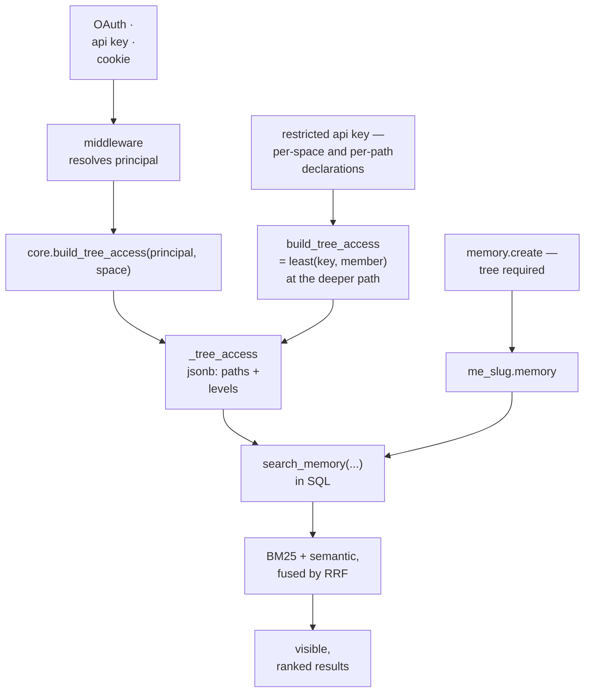

## 1. Executive Summary

Memory Engine is Timescale's Apache-2.0 memory service: about 51,000 lines of
TypeScript on Bun over PostgreSQL 18, using ltree, pgvector/halfvec, BM25, JSONB
and tstzrange rather than application-layer abstractions. Memories live in one
table per space, searched by hybrid BM25 and semantic retrieval fused with RRF
inside SQL functions.

The memory model is deliberately plain. The access model is the most developed
in this atlas, and it is the reason to read the repository.

**A delegated credential is a ceiling, not a grant.** Principals are users,
service accounts or groups, and a credential can be *restricted*: an API key
carries per-space declarations and, optionally, per-tree-path access levels of
read, write or owner. What those declarations express is a maximum.
`api_key_declared_tree_access` says so in its own header — it returns *"the
ceiling on effective tree access implied by an api key — not the effective
access itself"* — and `build_tree_access` intersects that ceiling against the
member's live grants.

Grants are `(space, principal, tree_path, level)` with three additive levels —
read, write, owner — where `tree_path` is an ltree, so a grant covers a subtree.
The intersection is `least(ka.access, ma.access)` and it runs in both
directions: where the member's grant sits at or above the key's path the key is
clamped down at the key's path, and where the key's declaration sits at or above
a narrower member grant the minimum is taken at the member's path. A declaration
with no tree rows means no key-side restriction at all, encoded as an
owner-at-root sentinel, and a key whose member and space do not agree yields
zero rows — an empty grant array, which the comment names as *"the safe
direction"*.

That clamp is the good idea. Letting people mint scoped credentials without an
approval workflow is only safe if a delegation cannot exceed the delegator, and
making that a `least()` at every path means a careless or malicious
over-declaration is
*harmless by construction* rather than caught by a check somebody might forget.
A declaration with no tree rows is the common case and means the key inherits
whatever its holder has in that space, so the narrow path is opt-in rather than
the default a caller has to remember.

Three more decisions are worth the read. Authorization is evaluated **inside the
search SQL**: `core.build_tree_access(principalId, spaceId)` produces a
`_tree_access` jsonb passed into `search_memory` and friends, so a principal's
visibility and the ranking are one query rather than a filter applied afterwards.
Writes **require an explicit `tree`**, because "callers choose `share` vs `~`
deliberately". And a space creator gets `admin + owner@home + owner@share` but
deliberately **not** `owner@root`, so creating a space does not grant sight of
other members' private trees.

Reservations. This is memory as a governed *store*, not as a belief model: there
is no trust state, no candidate/verified distinction, no supersession chain, no
contradiction handling, and no tombstone. It knows exactly who may read a
memory and nothing about whether the memory is true.

## 2. Mental Model

```text
core (control plane)                     me_<slug> (data plane, one per space)
  principal   u | a | s | g                memory
  space                                      id uuid v7 (check-constrained)
  principal_space  (admin = structural)      content, name
  group_member                               meta   jsonb
  tree_access (space, principal,             tree   ltree
               tree_path ltree,              temporal tstzrange
               access 1|2|3)                 embedding halfvec(1536)
  api_key                                    embedding_version int4
```

Two authority axes, kept apart:

| Axis | Carried by | Governs |
| --- | --- | --- |
| **structural** | `principal_space.admin` | roster, groups, invitations |
| **data** | `owner@path` | reading and writing memory under a subtree |

Reserved tree roots: `home.<member_id>` (input sugar `~`) and the shared
`share`. An owner grant at any path delegates access-management *within that
subtree*, and `owner@root` is the whole space.

## 3. Architecture

Packages, in lines of TypeScript excluding tests:

- `cli/` (27,443) — much of the surface, including harness adapters.
- `server/` (7,085) — JSON-RPC endpoints, auth middleware.
- `web/` (2,549), `protocol/` (2,299), `database/` (2,303), `engine/` (1,789),
  `embedding/` (1,281), `client/` (1,182), `worker/` (748).
- `queries/` — seventeen numbered psql benchmark files plus tuned variants.



## 4. Essential Implementation Paths

### A delegated key, clamped to its holder

The clamp is the mechanism this atlas has been missing without naming it. Every
system here that mounts memory into an agent gives it whatever the process has.
Ask "can this agent read the other project's memories?" and the answer is a
property of the deployment, not of the data model.

Memory Engine answers it in the schema, and then solves the delegation problem
the answer creates. Somebody must be able to mint a credential for a tool —
routing every one through an approval makes the feature unusable, while
unrestricted self-service invites privilege escalation. Intersecting a key's
declaration with the holder's live grants at every path dissolves the dilemma: a
member may scope their own keys freely, because the declaration is evaluated
against their own level at that path. Over-declare and it clamps down; lose
access yourself and the key loses it too, without a revocation sweep.

The impersonation header this discipline was originally carried by, `X-Me-As-Agent`,
is retired, and `authenticate-space.integration.test.ts` pins the retirement with
a case named *legacy X-Me-As-Agent is ignored* — a header that quietly stops
meaning anything is otherwise indistinguishable from one that quietly still
works. The human behind a call is recorded as `authenticatedAs` "for
observability only (never gates authz)", which is precisely the right split
between an audit field and an authorization field, and one that systems get
wrong in the other direction all the time.

### Authorization inside the ranking query

`build_tree_access` materializes the caller's grants as jsonb and passes it into
the space SQL functions. Visibility is therefore a join condition in the same
statement that ranks, not a filter applied to results afterwards.

The difference matters for a reason the
[scope as a first-class key](../../patterns/scope-as-a-first-class-key/) pattern
states and few systems honour: a post-filter interacts badly with `LIMIT`. Rank
first and filter after, and a user with narrow grants gets fewer than *k* results
— or the system silently over-fetches to compensate, and the effective ranking
changes with the caller's permissions.

### A documented negative result on RLS

The obvious way to do this in Postgres is row-level security, and the repository
says plainly why it does not:

> "**Access via `tree_access`, not RLS**: RLS was unperformant."

There is no `me.user_id` GUC, and `queries/13-tree-access.sql` — labelled "Direct
RLS helper expansion benchmark" — keeps the replacement measurable.

This atlas complains repeatedly that systems do not measure their design
decisions. Here is one that tried the textbook answer, measured it, rejected it,
recorded the reason next to the alternative, and committed a benchmark to keep
watching. The engineering is unremarkable; the *documentation of a negative
result* is rare enough to be worth copying on its own.

### Writes must name their destination

`memory.create` and `batchCreate` **require** an explicit `tree`, so callers
"choose `share` vs `~` deliberately". Only file importers default a tree-less
record, and they default it to `share` via a canonically defined constant.

This is [explicit write destination](../../patterns/explicit-write-destination/)
enforced at the API boundary rather than encouraged in a tool description — the
strongest instance of that pattern the atlas has found. The pattern page argues
that defaults are acceptable only when safe, obvious and surfaced; here the
default is *absent* on the interactive path and present only where a human
already chose a file to import.

### Least privilege for the space creator

A space creator gets `admin`, `owner@home` and `owner@share` — **not**
`owner@root`. They can see the shared tree and their own home, and not other
members' homes. As an admin they *can* self-grant `owner@root`, which makes the
escalation explicit and auditable rather than implicit in provisioning.

Custom spaces can vary this (`--no-home-grants` flips the creator to "god mode"
with `owner@/`), so the safe default is a default rather than a constraint.

### Idempotent writes with visible per-row outcomes

The idempotency key is a named row's `(tree, name)` slot, else the explicit id.
`onConflict` is `error` (default), `replace`, or `ignore`, and every row reports
`{id, status}` where status is `inserted | updated | skipped` — `batchCreate`
returns one entry per input **in input order**, "so a skip is visible and ids map
back to inputs".

Importers stamp `meta.importer_version` with deterministic metadata and no
per-run timestamp, so an unchanged re-import is a genuine no-op while a version
bump makes meta differ and forces a re-render. That is a clean answer to a
problem several systems in this atlas have: re-ingestion that silently duplicates
or silently does nothing, with no way to tell which happened.

### A schema that constrains rather than documents

The memory table carries constraints that would elsewhere be conventions:

```sql
id uuid not null primary key default uuidv7()
   check (uuid_extract_version(id) = 7)
meta jsonb not null default '{}' check (jsonb_typeof(meta) = 'object')
temporal tstzrange
-- point-in-time events: lower = upper, inclusive '[same,same]'
-- time periods:         lower < upper, '[start,end)'
```

`temporal` being a **range** rather than a timestamp gives validity time
first-class treatment, with a check constraint enforcing the convention so a
caller cannot store a point-in-time event as a half-open interval and quietly
break range queries. Indexes match: GiST on `temporal` and `tree`, GIN on `meta`,
BM25 on `content`, HNSW on `embedding`.

`embedding_version int4` deserves note on its own. This atlas lists behaviour
under embedding-model change as a dimension it does not cover systematically,
because almost nothing here stamps the model that produced a vector. Memory
Engine does, which makes a re-embedding campaign a query rather than an
archaeology exercise.

## 5. Memory Data Model

One table per space: `content`, an optional filename-like `name` unique within
`(tree, name)`, `meta` jsonb, `tree` ltree, `temporal` tstzrange, `embedding`
halfvec(1536) with a version, and timestamps. Addressed by immutable id or by
`folder/name` path; `deleteTree` removes a subtree.

The stated principle is that "complexity comes from conventions in `meta` and
`tree`, not schema proliferation".

What is absent, and it is most of what this atlas cares about:

- **No trust or verification state.**
- **No supersession chain** — `replace` overwrites in place.
- **No tombstone**, so a deleted memory returns on the next import that produces
  it, subject only to the `(tree, name)` idempotency slot.
- **No provenance** beyond `meta` conventions and importer stamps.
- **No contradiction handling.**

Correction here means editing or deleting a row, with authorization checked. For
a system whose thesis is that Postgres should do the work, that is coherent — but
it means Memory Engine answers "who may read this" comprehensively and "is this
still true" not at all.

## 6. Retrieval Mechanics

Hybrid BM25 plus semantic similarity fused by Reciprocal Rank Fusion, computed
in SQL functions rather than in application code, with ltree path filters,
JSONB containment filters on `meta`, and temporal range predicates.

`queries/` holds seventeen numbered psql files mirroring the engine's generated
SQL "as closely as possible, including transaction setup, local timeouts,
`search_path`" — every combination of fulltext, semantic, meta and ltree, plus
`12-hybrid-candidates`, `14-count-visible`, and two diagnostics:
`15-diagnose-semantic-visibility` and `17-diagnose-auth-owner`.

Committing diagnostic queries for "why can this principal not see what I
expected" is the sort of thing that only exists after an incident, and it is the
operational counterpart to the atlas's complaint that nobody can explain their
retrieval.

## 7. Write Mechanics

JSON-RPC `memory.create` / `batchCreate` with a required tree, plus importers for
git history, sessions, and memory packs. A worker pool handles embedding
generation. Harness adapters inject an environment contract so a `me` call from
inside Claude, opencode, Codex or Gemini resolves to the configured credential
rather than to whatever the shell happened to hold.

That last part matters for the access model: without it, a tool's writes would
land under whichever key was ambient and the scoping would be decorative. A
Claude Code plugin registers the same contract through hooks — `me claude env` at
SessionStart, `me claude hook` on Stop and SessionEnd — and a
`.claude-plugin/marketplace.json` at the repository root is the entry a harness
installs it from.

## 8. Agent Integration

Two JSON-RPC endpoints with deliberately different credentials — the memory data
plane accepts any bearer plus an `X-Me-Space` header; the user plane bars agent
keys entirely, because "agents can't manage the account", and key creation is
session-only so "keys can't mint keys". MCP, a CLI, a web UI, and per-harness
adapters complete the surface.

The credential-safety gate is worth noting: a `.me/config.yaml` in a repository
may pin a server only if it is on a trusted list, "so an untrusted repo's `.me`
can't redirect a global api key… to an attacker". A project-local config file
that can redirect credentials is a supply-chain hazard that several
config-file-driven systems in this atlas simply have.

## 9. Reliability, Safety, and Trust

Strengths:

- **A delegated key is a ceiling**, per-space and per-tree-path, not a grant.
- **`least(key, member)` clamping in both path directions**, making delegation safe by construction, with an inconsistent triple resolving to no access at all.
- **A retired header that stays retired**, pinned by `legacy X-Me-As-Agent is ignored`.
- **Authorization inside the ranking query**, not as a post-filter.
- **A documented negative result on RLS**, with a benchmark retained.
- **Explicit write destination**, enforced at the API.
- **Least privilege for the space creator**, with explicit escalation available.
- **Structural and data authority kept on separate axes.**
- **`temporal` as a constrained range**, with conventions enforced by the
  database.
- **`embedding_version`**, making a model migration tractable.
- **Idempotent writes with per-row, input-ordered outcomes.**
- **Committed SQL benchmarks and access diagnostics.**
- **A trusted-server gate** on project-local config.

Gaps:

- **No trust state and no tombstone.** Memory is a governed store, not a belief
  model: nothing marks a memory doubtful, superseded or rejected.
- **`replace` overwrites the row in place**, and the prior shape survives in
  `memory_event` rather than in the table — recoverable from the log, and only
  inside its retention window.
- **The mutation log has a horizon.** Where TimescaleDB is installed the
  migration installs a thirty-day retention policy, and its comment states the
  consequence: per-memory history is bounded to that window. On a plain-Postgres
  deployment the policy is skipped and the table grows without one.
- **Access is evaluated per query from a materialized jsonb**, so a grant change
  mid-request is not observable — acceptable, but the staleness window is not
  documented.
- **One database, one pool**, with sharding deferred; the per-slug schema keeps
  a future split cheap but the current ceiling is a single Postgres.
- **Api-key secrets are sha256**, "not argon2" — stated plainly in the design
  notes, which is better than hiding it, but it is a weaker choice than the
  password path.

## 10. Tests, Evals, and Benchmarks

Integration tests against a real Postgres, migration tests, a CLI e2e suite, and
the `queries/` benchmark set. Nothing was run for this review.

There is no retrieval-*quality* benchmark — no labelled corpus, no recall@k, no
LoCoMo or LongMemEval harness. The measurement culture here is aimed at latency,
query plans and access correctness rather than at whether the right memory comes
back, which is the mirror image of most systems in this atlas and leaves the same
kind of hole in the other wall.

## 11. For Your Own Build

### Steal

- **Make the agent a principal.** If an agent has memory, "which memories may
  this agent read" should be answerable from the schema rather than from the
  deployment.
- **Make a delegated credential a ceiling and intersect it with live access**,
  with `least()` at the deeper of the two paths and in both directions. It turns
  self-service delegation from a privilege-escalation risk into a
  no-op-when-wrong, and removes the need for an approval workflow.
- **Resolve an inconsistent credential to no access rather than to an error.** A
  key whose member and space do not agree yields zero rows and an empty grant
  array; the failure direction is chosen and commented.
- **Pin a retired auth header with a test that it is ignored.** A header that
  quietly starts meaning nothing is indistinguishable from one that quietly
  still works.
- **Log the change, not the write.** The trigger fires on every insert and
  delete, and on an update only when the tree, temporal range, name, meta or
  content actually differ — so a no-op write leaves the history alone.
- **Let the caller name the cause and mint the operation id yourself.** A
  session-local setting carries a `cause` into every row of a multi-row
  operation, and the engine supplies a shared `operation_id` when the caller
  does not.
- **Evaluate authorization inside the ranking query**, so `LIMIT` means the same
  thing for every caller.
- **Require the write destination**, and let the default exist only where a human
  already chose the source.
- **Do not grant the creator the root.** Make the escalation an explicit,
  auditable action instead of a provisioning side effect.
- **Constrain conventions in the schema.** A check constraint on range bounds
  costs nothing and prevents a class of silent query breakage.
- **Stamp `embedding_version`** on every vector.
- **Report per-row write outcomes in input order**, so a skip is visible.
- **Commit the diagnostic queries** for "why can this principal not see this",
  not only the happy-path ones.
- **Write down the negative results**, with the benchmark that produced them.

### Avoid

- **A governed store mistaken for a memory model.** Excellent authorization does
  not make extracted facts true, and nothing here tracks whether they are.
- **In-place `replace`** as the only correction.
- **Retrieval quality unmeasured**, in a system that measures almost everything
  else.

### Fit

Borrow:

- The principal model and the agent clamp, which are transferable to any system
  where agents act on a user's behalf.
- Authorization inside the ranking query.
- The required write destination and the creator-privilege default.
- `embedding_version` and the constrained `temporal` range.

Do not copy:

- The assumption that access control is the hard part of memory. It is the part
  this repository solved.

## 12. Open Questions

- How stale can a materialized `_tree_access` be relative to a concurrent grant
  change?
- Does anything test that an over-declared key actually clamps, or is the
  invariant only argued in the function's header comment?
- What is retrieval quality? No labelled evaluation was found.
- Does `deleteTree` reach embeddings and any derived artifacts, or only rows?
- Past the thirty-day retention window, with `replace` overwriting in place and
  the event dropped, what recovers a memory a bad import
  clobbered?

## Appendix: File Index

- Access model: `packages/database/core/migrate/incremental/005_tree_access.sql`,
  `core.build_tree_access`, `agent_tree_access`.
- Memory schema: `packages/database/space/migrate/incremental/001_memory.sql`
  (uuidv7 check, `temporal` bounds convention, BM25/HNSW/GiST/GIN indexes,
  `embedding_version`).
- Design notes: `CLAUDE.md` (principal model, access decisions, RLS rationale,
  conflict semantics), `AUTH_DESIGN.md`, `HARNESS_DESIGN.md`.
- Benchmarks and diagnostics: `queries/01`–`17`, `queries/tuned-*.sql`,
  `queries/README.md`.
- Search: `packages/engine/ops/memory.ts` and the space SQL functions.
- Harness contract: `packages/cli/harness-contract.ts`, `packages/cli/failsafe.ts`.

## History

**2026-09-10** — [`2ef90da9385448e0bbb02ed1da82c04bd663602d`](https://github.com/timescale/memory-engine/commit/2ef90da9385448e0bbb02ed1da82c04bd663602d) — read again, 144 commits and 339 files past the previous pin, and the delegation model changed shape. `018_remove_agents.sql` deletes every agent principal and drops `create_agent`, `list_agents` and `agent_tree_access`, and `017_scoped_api_keys.sql` puts a restricted API key in their place, carrying per-space declarations and optional per-tree-path levels. The clamping property survives the substitution and is better documented for it: `api_key_declared_tree_access` returns a *ceiling* rather than an effective access, `build_tree_access` intersects it against the member's live grants with `least()` in both path directions, and a key whose member and space do not agree yields zero rows — an empty grant array the comment names as the safe direction. The retired impersonation header is pinned by a test asserting it is ignored. `audit_log` is earned where it was not: a `memory_event` table records every insert, update and delete with the prior tree, temporal range, name, meta, content and version, written by a database trigger rather than by an application path, with the caller's declared `cause` and an `operation_id` shared across a multi-row operation, and firing on an update only when something actually differs. Two published gaps move with it — a corrected memory leaves a recoverable prior shape, in the log rather than the table — and one arrives: where TimescaleDB is installed a retention policy drops those events after thirty days. `bitemporal` and `scope_enforced` hold, the temporal query surface having grown to five predicates beside the range itself. The absence claim that no labelled retrieval evaluation exists was re-run and holds; the `queries/` set is still query-shape benchmarks. Screened before reading: one auto-run surface that was not there at the previous pin — a `.claude-plugin/marketplace.json` registering a plugin whose hooks run `me claude env` at SessionStart and `me claude hook` on Stop and SessionEnd — two build-time execution paths and twelve unpinned dependency surfaces; nothing was installed, built or run.

**2026-07-28** — [`54e4d7d201b5c7ba3aed618ea343d9f4d3f40927`](https://github.com/timescale/memory-engine/commit/54e4d7d201b5c7ba3aed618ea343d9f4d3f40927) — first reading.
