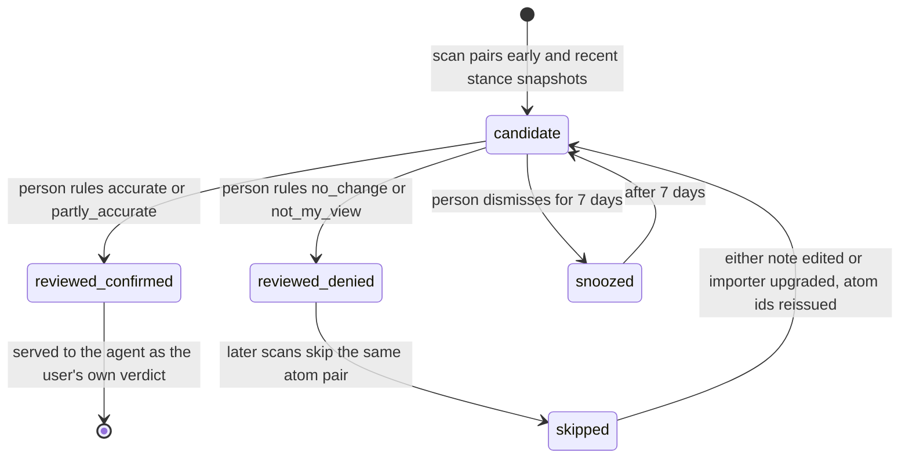

## 1. Executive Summary

Memory Garden is a personal *cognitive retrospection* agent written in Chinese: it reads a person's Obsidian vault, looks for places where what they wrote about a topic at one time differs from what they wrote later, and asks them whether that is a real change. MIT-licensed, one author, about 10,500 lines of Python in the package beside 32 test files; the published history restarts at a single squashed commit on 12 September 2026.

The notes are the evidence, not the memory. The memory is what the system and the person build on top of them: stance snapshots extracted offline from each paragraph, *discovery candidates* that pair an earlier and a later snapshot as a possible change, and the person's *verdicts* on those candidates and on the agent's answers. The design's rule, stated in the schema's own comment, is that **the only writer of confirmed cognition is the user**. A candidate is a candidate until the person rules on it; the most recent note is labelled `latest_memory_candidate` rather than assumed to be current; and events inside a time interval are marked `within_interval` rather than offered as causes, with the harness refusing a final answer that skips the interval and counter-evidence steps.

That rule earns three marks. `trust_state`: a discovery is `candidate`, then `reviewed` with a verdict, and the rejecting verdicts are filters — a pair the person denied is skipped on every later scan. `human_review`: the web workspace and the CLI are where that ruling happens, over candidates the scans write. `negative_eval`: a *long-term memory* layer added since the first reading turns only a saved user verdict into a remembered position, and its tests assert a revoked memory, an earlier superseded verdict and a memory whose source was withdrawn are all absent from recall after being present.

The weak point is the key. A denied pair is remembered by the ids of its two source atoms, and an atom's id is a hash of its file's whole-content revision, the importer version and its position in the file. Edit an unrelated line in either note, or upgrade the importer, and every atom in that file gets a new id — and the pair the person denied is eligible to be proposed again. The rejection is consulted; it is keyed on the file revision rather than on the statement, which is why `tombstone` is withheld.

## 2. Mental Model

A paragraph of a note becomes an *atom* with a record time (the note's creation or frontmatter date, low confidence), an *event time* only when the note declares one explicitly, and an authorship — `user`, `quoted`, `ai_generated` or `derived`. An extractor turns each atom into a stance snapshot: a topic, a stance, a quote, how firmly it is held, and whether it is the writer's own view. A discovery scan pairs an early and a recent snapshot on the same topic, classifies the difference — `true_change`, `parallel_stance`, `wording_drift`, `deepening`, `contextual_stance` — and writes the pair as a candidate. Nothing becomes a belief about the person until the person says so.



## 3. Architecture

A local Python application. `importer.py` syncs the vault read-only into SQLite, hashing every file and recording each content revision in `source_revisions`; `retrieval.py` offers BM25 over an FTS5 trigram index, a character-hashing embedder, a real embedding provider and an RRF hybrid; `snapshots.py` extracts stances deterministically or with a model in batches; `cognitive.py` holds the discovery and verdict services; `agent.py` is a single-agent harness over an OpenAI-compatible model with a tool budget and a protocol guard; `tools.py` defines eight read-only domain tools that `mcp_server.py` also exposes over MCP; `web.py` serves the workspace. Nothing runs on a schedule, and the model is optional — an explicitly labelled offline demo runs from templates.

`agent_runs` records every run's trace, token counts and a `private_vault_sent` flag set whenever vault content went to a cloud model or embedding provider — a run-level privacy audit, and on the context side of the line rather than a record of memory mutations.

## 4. Essential Implementation Paths

- **Discovery.** `DiscoveryService.run_scan` (`src/memory_garden/cognitive.py:127-200`) takes candidates from the snapshot engine, or a heuristic fallback when no snapshots exist, and before inserting each one checks `discoveries` for the same `(early_atom_id, recent_atom_id)` with a snooze inside seven days or a `review_verdict` of `no_change` or `not_my_view` (`:142-150`). A match is skipped.
- **Review.** `review` (`:243-270`) sets the discovery to `reviewed` with the verdict and revision, and inserts a topic-level verdict; `react` records `accurate`, `wrong` or `boring` in `candidate_reactions`, which feeds ranking and removes a `wrong` candidate from the pending list; `dismiss` snoozes.
- **Answers.** `AgentHarness` requires the timeline, candidate pairing, interval search and both supporting and challenging evidence before it accepts a final answer (`agent.py:941-975`). If the latest verdict on the topic is `no_change` or `not_my_view`, the answer type is forced to `no_clear_change` and the person's revision is added as challenging evidence cited as the user's verdict (`:1254`, `:1293`, `:1348-1355`).
- **Atom identity.** The importer marks a file's atoms not current and re-upserts them `ON CONFLICT(uid)`, where `uid = sha256(source_id : revision_hash : IMPORTER_VERSION : seq)` (`importer.py:443-470`, `:464`). An unchanged file keeps its atom ids; a changed file, anywhere, does not.

## 5. Memory Data Model

| Table | Holds |
| --- | --- |
| `sources`, `source_revisions` | notes with stable uid across moves, `recorded_at`, `event_time`, authorship, and every content hash seen |
| `source_atoms`, `source_atoms_fts`, `atom_vectors` | paragraphs with line ranges and times, trigram FTS, vectors per provider, model and text version |
| `stance_snapshots` | one per atom: topic, stance, quote, tone strength, own-view flag, confidence, extractor |
| `discoveries` | candidate change pairs with change type, confidence, status, review verdict, shown count |
| `verdicts` | the person's rulings by topic, with revision, confirmed interpretation, missing event, accepted and rejected atom ids |
| `candidate_reactions` | lightweight feedback feeding ranking |
| `memory_items` | one long-term memory per saved verdict: topic, verbatim statement, evidence, and a status of active, superseded, needs_review or revoked |

`rejected_atom_ids_json` on a verdict is written on every review and handed to the agent with the verdict (`agent.py:636`), so the atoms a person rejected as evidence reach the model as part of the ruling; no retrieval path filters on them.

`memory_items` (`db.py:211-223`) is the long-term layer: one row per saved verdict, with the topic, a statement taken verbatim from the person's revision or confirmed interpretation, the evidence, and a status of `active`, `superseded`, `needs_review` or `revoked`. The module states the rule: *"Only a saved user verdict can produce a memory."* A `defer` verdict produces none, a later verdict on the same answer supersedes the earlier memory, and `revoke` marks both the item and its verdict revoked rather than deleting them.

## 6. Retrieval Mechanics

Retrieval runs over atoms, with a route chosen by configuration: BM25 on the trigram index, which handles Chinese without a word segmenter; a deterministic character-hash embedding for offline use; a configured embedding model; or a reciprocal-rank fusion of them, keeping each route's attribution score. Queries filter by authorship — so a quotation or an AI draft is not treated as the person's view — and by a date window. The window is over `COALESCE(event_time, recorded_at)` (`retrieval.py:177-180`): the two times are stored separately and every query reads them as one timeline, which is why `bitemporal` is withheld.

## 7. Write Mechanics

Nothing the agent does writes to the vault. Sync is a foreground command; snapshot extraction and discovery scans run when invoked and write their results immediately. A verdict is written when the person submits it and changes the next answer on that topic at once. No background pass rewrites anything.

## 8. Agent Integration

The harness drives an OpenAI-compatible model through the eight read-only tools, under a step and token budget, with citation validation that rejects a reference the trace did not produce. The same tools are available over MCP for another agent to use, read-only. Model use is optional and declared: a template demo runs without a key, and each run records whether private vault content left the machine.

## 9. Reliability, Safety, and Trust

**The denial decays with editing.** The discovery-level rejection is keyed on the pair of atom ids, and atom ids change whenever their file's content hash changes. A vault is a living set of notes; the people this is for are the people who go back and edit. The topic-level denial survives edits — it is keyed on `topic_key` and forces `no_clear_change` on the next answer — but it shapes answers, not scans, so a scan after an edit can write the denied pair back into the candidate list. Keying the scan's check on the normalised text of the two quotes would keep it.

**Rejected evidence reaches the agent, not the retriever.** The atoms a person marks as rejected travel with the verdict into the agent's context; retrieval does not exclude them.

**A memory is only as recallable as its sources.** `verdict_available_for_recall` and `list_items` (`memory.py:153-200`) serve a memory only while its item and verdict are active and every cited atom still belongs to a present, searchable source, so hiding or removing a note withdraws the memories that rest on it.

**The authorship boundary is the design's best defence, and it holds at retrieval.** Quotes and AI drafts are imported with their authorship and filtered out of the person's positions, and the agent evaluation's `quoted-view` and `ai-generated` cases require the agent to abstain.

**No scope inside a vault,** by design. `workspaces.py` lets one installation switch between vaults, each owning *"a complete app and database"* — a partition, not a filter.

## 10. Tests, Evals, and Benchmarks

Thirty-two test files and two evaluation suites. Nothing was run for this review.

The unit tests are careful about the behaviours that define the product: review sinks into verdict memory and marks the discovery reviewed (`test_cognitive.py:20-31`); a prior denial forces `no_clear_change` on the next answer (`test_agent.py:54-68`); a reaction of `wrong` drops a candidate from the pending list and records the reaction (`test_snapshots.py:95-108`); event time is taken only from an explicit declaration and never from dates in the body (`test_importer.py:27-40`); interval events are constrained to their dates; a final answer is refused until the evidence plan is complete; a dismissal does not become a belief verdict.

**`negative_eval` is earned on the memory layer.** `test_edit_then_revoke_never_resurrects_earlier_judgment` saves a denial, corrects it to an accepted revision, asserts the memory recalls the corrected statement, revokes it, and asserts `context_for_topic` returns `[]` and the verdict tools return nothing — so neither the revoked memory nor the superseded earlier judgment comes back. `test_withdrawn_source_is_not_recalled_as_long_term_memory` asserts a memory is recalled, makes its cited note unsearchable, and asserts recall is empty; `test_memory_source_closure.py` repeats that per evidence role and asserts the model's own interpretation text is absent from the rendered context.

**Three earlier near-misses remain one assertion from counting.** `test_authorship_filter_excludes_quoted_and_ai` asserts `authorships <= {"user"}`, which an empty result satisfies. `test_dismissal_does_not_become_a_belief_verdict` asserts `all(...)` over the second scan's candidates, which is true of none. And the discovery evaluation (`evaluation.py:396-474`) names an `excluded_pairs` entry — a wording drift that must not become a candidate — and computes `excluded_pair_leak`, but its test (`test_cli.py:18-30`) asserts only that snapshots were extracted and candidates returned. Asserting the leak is zero beside the expected-pair recall it already computes would make it the case the mark asks for.

The agent evaluation (`evals/agent_cases.json`) is gated: twelve cases across true change, wording drift, quoted and AI-generated material, missing endpoints, adjacency without causality, a prior denial and event-versus-record time, and `test_cli.py` asserts a pass rate of 1.0. Its abstention cases would also pass against a retriever that returned nothing for their query, which is why they are not counted either.

No paper and no external benchmark.

## 11. For Your Own Build

### Steal

- **Only the person confirms a belief about the person.** Every inference is a candidate with a status, and the confirmed state is written by a human action. It is the right default for memory about someone's own mind.
- **Authorship as a column, filtered at retrieval.** A quotation is not an opinion and an AI draft is not a diary entry; recording which is which at import is cheap and prevents a whole class of misattribution.
- **A harness that refuses the causal shortcut.** Requiring the interval, the supporting and the challenging evidence before a final answer, in code, is how the design keeps its "adjacent is not causal" promise.
- **Recording whether private data left the machine**, per run.
- **Tie a memory's recall to the presence of its sources.** A remembered position that silently outlives the note it came from is a belief without evidence; checking every cited atom at recall time withdraws it.

### Avoid

- **Keying a rejection on an identifier derived from the whole file.** Key it on the normalised text of the statements, so an unrelated edit does not reopen a question the person already answered.
- **Telling the model about rejected evidence instead of excluding it.** Passing `rejected_atom_ids` to the agent leaves the exclusion to the model; filtering them from the next retrieval would not.

### Fit

A thoughtful design for one person who keeps a long-running notes vault and wants help noticing how their thinking has moved, without a model deciding what they believe. It is not a general agent memory — it remembers judgements about change, not facts to act on — and it is still a young, single-author project rather than something to depend on.

## 12. Open Questions

- Whether snapshot extraction by a model in batches, rather than the deterministic extractor, changes discovery precision on a real vault; the committed evaluation runs on the synthetic one.

## Appendix: File Index

- Schema: `src/memory_garden/db.py`. Import and atom identity: `src/memory_garden/importer.py`.
- Retrieval: `src/memory_garden/retrieval.py`. Snapshots and discovery engine: `src/memory_garden/snapshots.py`.
- Discovery, review and verdict services: `src/memory_garden/cognitive.py`.
- Harness and answer construction: `src/memory_garden/agent.py`. Tools and MCP: `src/memory_garden/tools.py`, `mcp_server.py`.
- Web workspace and CLI: `src/memory_garden/web.py`, `cli.py`.
- Evaluation: `src/memory_garden/evaluation.py`, `evals/`. Tests: `tests/`.

**Searches recorded for the negative claims**

```sh
rg -n "rejected_atom_ids\(" src                                  # defined, never called
rg -n "event_time" src/memory_garden/retrieval.py src/memory_garden/tools.py   # read, and filtered only through COALESCE with recorded_at
rg -n "excluded_pair_leak" tests                                 # 0: the discovery exclusion is computed and never asserted
rg -n "atom_uid *=" src/memory_garden/importer.py                # uid hashes source_id, file revision, importer version and position
ls .github                                                       # absent: no CI
```

## History

**2026-09-15** — [`d7fdb1c7c354e3eafdead896ed64941a049755ac`](https://github.com/drephantom/memory-garden/commit/d7fdb1c7c354e3eafdead896ed64941a049755ac) — the history was republished. The pinned commit no longer resolves from the default branch; fetched by its full sha it is intact, and no commit on the new branch shares its tree. The new history starts at [`4e23b3e44f27c12a599027ba3750ce3d785f3026`](https://github.com/drephantom/memory-garden/commit/4e23b3e44f27c12a599027ba3750ce3d785f3026) (2026-09-12, *"Memory Garden: local notes, conversations, and memory"*), six commits later reaching 2026-09-14, and differs from the old pin by about 4,500 lines of source and 2,700 of tests. Screened before reading: no auto-run surface, one `conftest.py` executing on collection, and two manifests inside the cooldown; nothing was installed or run. Added since the first reading: a long-term memory layer that only a saved user verdict can populate and the person can revoke, recall gated on the presence of cited sources, chat import and a local chat, context budgeting and compaction, a global graph view, and per-vault workspaces. The denial on atom ids and the event-time-as-record-time window stand. `negative_eval` added on the revoke and source-withdrawal recall tests; `trust_state` and `human_review` kept with records extended to the memory items. Three marks.

**2026-09-11** — [`f8171c471aaf7c321addc0557c010619fbad2bfb`](https://github.com/drephantom/memory-garden/commit/f8171c471aaf7c321addc0557c010619fbad2bfb) — first reading. Screened with `scripts/screen_repo.py`: no auto-running configuration, one `conftest.py`, two manifests inside the seven-day cooldown and no unpinned surface. Nothing was installed or run.
