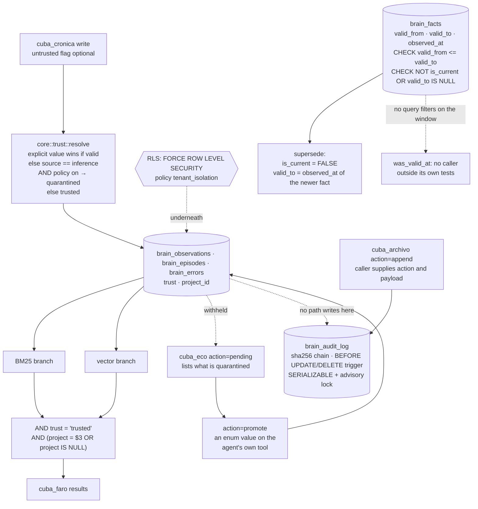

## 1. Executive Summary

MemoryIndustry is an MCP server in Rust over PostgreSQL and pgvector, giving a
coding agent a searchable knowledge graph across sessions. Thirty-one MCP tools,
twenty-three CLI commands, Apache 2.0. It was called cuba-memorys until
recently, and the `cuba_*` tool names are unchanged.

**Three marks:** `trust_state`, `scope_enforced`, `negative_eval`. The
quarantine tier is the spine of all three. Text the agent did not vouch for is
stored with `trust = 'quarantined'`, every search path admits rows with
`AND trust = 'trusted'` — an allow-list, not an exclusion — and the tests pin
both directions: a quarantined memory must not surface, *and* an ordinary write
must stay retrievable, so a filter that excluded everything could not pass.

Two mechanisms that look like marks are withheld, and the reasons are the
interesting part of this page. The `brain_audit_log` is a hash-chained,
trigger-enforced append-only table maintained under `SERIALIZABLE` with an
advisory lock to keep the chain linear — and **no memory mutation writes to
it.** Its only writer is the `append` action of a tool, which takes the action
string and the payload from its caller. Separately, `brain_facts` carries
`valid_from`, `valid_to` and `observed_at` behind database CHECK constraints,
and every write sets validity from record time while no query asks a validity
question.

What distinguishes the project is section 10. Its README carries a heading
reading *"Measured — and the benchmark that was lying"*, retracts its own
published retrieval score, and withdraws the two conclusions that rested on it.

## 2. Mental Model

Everything written is trusted unless something says otherwise, and "otherwise"
has two sources: a caller that marks the text untrusted, and a policy that
quarantines LLM inference. A quarantined row is stored, listable and invisible
to search until a promotion moves it. Retrieval is hybrid — BM25 and vectors —
and both branches carry the same two predicates: the trust tier and the project.

## 3. Architecture

## 4. Essential Implementation Paths

**The tier** — `rust/src/core/trust.rs:11-21`. `resolve(source, explicit,
policy_quarantines_inference)` returns the caller's `explicit` value when it is
one of the two legal strings, else `QUARANTINED` when the source is `inference`
*and* the policy is on, else `TRUSTED`. The policy is
`CUBA_QUARANTINE_INFERENCE`, unset by default, so out of the box nothing is
quarantined automatically.

**The read predicate** — `rust/src/search/bm25.rs:23-24`, repeated at `:59`, and
`rust/src/search/calibrate.rs:64, :91`. `AND o.trust = 'trusted'` beside
`AND ($3::uuid IS NULL OR o.project_id = $3 OR o.project_id IS NULL)`. The trust
clause names the state it admits; adding a third tier later would hide those
rows rather than expose them.

**The untrusted door** — `rust/src/constants.rs:375`, the tool schema. *"Set
when the text came from somewhere you do not control (a fetched page, a pasted
document, a third party). Everything extracted lands quarantined — stored and
inspectable via `cuba_eco action=pending`, but withheld from `cuba_faro` until
promoted."*

**The chain** — `rust/src/handlers/archivo.rs:145-173`. Each append opens a
transaction at `SERIALIZABLE` *"to keep the hash chain linear"*, takes
`pg_advisory_xact_lock` on a fixed key, reads the newest `current_hash`, and
inserts `sha256(prev_hash || action || payload || created_at_iso)`, retrying up
to five times. Migration `0016_audit_log.up.sql` puts `BEFORE UPDATE` and
`BEFORE DELETE` triggers on the table that raise unless the role is
`cuba_admin`, kept *"for legal data deletion under GDPR"*.

## 5. Memory Data Model

Three content tables — observations, episodes, errors — each with `trust` and
`project_id`. Facts live apart in `brain_facts` as
subject/predicate/object with `valid_from`, `valid_to`, `observed_at`,
`confidence` and `is_current`.

Migration `0029_bitemporal_check.up.sql` is worth reading for its candour. It
adds two CHECK constraints and explains that the original schema *"allowed
states that contradict its own model: `valid_from > valid_to` (a fact valid in
negative time); `is_current = TRUE` together with a `valid_to` already in the
past. Nothing prevented them."* It records that it checked the
existing rows and found none violating either constraint, and says a future
violation should make *"the migration fail loudly instead of corrupting silently
— which is the point."*

## 6. Retrieval Mechanics

Hybrid: a BM25 branch and a pgvector branch, fused, with an optional
cross-encoder reranker. Both branches carry the trust and project predicates.
Row-level security sits underneath — `0017_rls_policies.up.sql` enables *and*
`FORCE`s RLS on the listed tables and creates a `tenant_isolation` policy, and
`0055` extends it to the content tables. `FORCE` is the part that matters: it
applies to the table owner too.

The project's own `doctor` names the limit rather than leaving it implied — a
superuser ignores RLS and can alter the audit log, so project isolation and
traceability both rest on nobody connecting as one.

## 7. Write Mechanics

A write resolves its tier before the insert. Superseding a fact sets
`is_current = FALSE` and `valid_to` together, which is exactly what the second
CHECK constraint requires, so the invariant and the write path agree.

## 8. Agent Integration

Thirty-one MCP tools under `cuba_*`. Promotion out of quarantine is
`cuba_eco action=promote`, one value of an action enum that also carries
`positive`, `negative`, `correct`, `quarantine` and `pending`.

## 9. Reliability, Safety, and Trust

**`trust_state`.** Two discrete states, and `quarantined` withholds a row from
every search path. The tier is a field rather than a score, and the ranking
signals — confidence, decay — are separate from it.

**`scope_enforced`.** Two layers: the `project_id` predicate in both search
branches, and forced row-level security with a `tenant_isolation` policy
beneath. The predicate admits `project_id IS NULL` as well, which is how a
globally-scoped memory reaches every project, so the isolation the mark
describes is between projects and not from the global set.

**`negative_eval`.** Read-path must-not assertions with their controls beside
them — section 10.

**`audit_log` is withheld.** The table is a well-built tamper-evident ledger and
nothing on a memory path writes to it. Its sole `INSERT` is inside the `append`
branch of `cuba_archivo`, which takes the action string and the payload from its
caller, so a row exists only because an agent chose to write one and says
whatever that agent chose. A mutation audit has to be written by the mutation.

**`bitemporal` is withheld.** Both axes exist as columns and both are stamped
from record time: `valid_from` is `Utc::now()` at construction in both builders,
and supersession sets `valid_to = u.observed_at` of the superseding fact.
`was_valid_at` is the only function that would ask a validity question and has
no caller outside its own tests. The single query that touches the window is an
integrity check in `doctor` looking for `valid_to <= valid_from`.

**`human_review` is withheld.** Quarantine holds a memory in a state until
something resolves it, but `promote` is one value of the `action` enum on
`cuba_eco`, a tool the writing agent already holds. The producer can clear its
own queue.

**`tombstone` is withheld.** Supersession flips `is_current` on a row and
feedback records an outcome per memory; nothing keys a rejection on the value,
so the same claim arriving again is a new row.

## 10. Tests, Evals, and Benchmarks

Test files are named for the version and the invariant they defend —
`v016_quarantine.rs`, `v021_import_quarantine_all_kinds.rs`,
`v033_untrusted_extraction_does_not_touch_the_graph.rs` — and the assertion
messages carry the claim:

- *"a quarantined memory must not surface in search"* (`v016_quarantine.rs:67`),
  paired at `:151` with *"an ordinary agent write must stay retrievable — the
  gate must not change default behaviour."* The control is the harder half: a
  predicate that excluded everything would satisfy the first assertion alone.
- *"a quarantined episode must not come back from `cuba_faro`, or the quarantine
  is a column"* (`v021:174`) — the test states its own purpose, which is to
  prove the column is enforced rather than decorative.

The NLI cases in `rust/tests/nli_entailment.rs` are `#[ignore]` because they
need a downloaded model, and the helper refuses the usual escape:
*"Soft-skip is forbidden."* They do not run in an ordinary CI pass.

**The benchmark.** The README's own section, *"Measured — and the benchmark that
was lying"*, records that until v0.12 the file claimed every number was measured
and every number was wrong, in three ways: ten queries, so *"the smallest effect
it could detect was ~0.25 nDCG"*; relevance judged by substring match, which
*"measures keyword presence, not retrieval, and it tilts the whole benchmark
toward the lexical branch"*; and nDCG normalised against what was retrieved
rather than what exists, so a system that missed 60% of the answer scored 1.0.
An `R@10 = 3.125` had shipped — *"Recall is a proportion."*

The corrected figure is nDCG@10 = 0.50, 95% CI 0.44–0.56, over 221 id-scored
queries, against a published 0.894. The sentence that follows is the one worth
quoting: *"The system did not get worse. It was never 0.894."*

Two conclusions were withdrawn with it. One held that the cross-encoder reranker
earned nothing; it had never run — three bugs in series, an error dropped by
`if let Ok(..)`, `token_type_ids` fed to a model that is XLM-RoBERTa and has
none, and `f16` logits read as `f32`. The other held that associative retrieval
degrades results, which a paired bootstrap on the new dataset confirms at
[−0.051, −0.018] — *"The decision was right; the reasoning was not."*

## 11. For Your Own Build

### Steal

- **Write the trust predicate as an allow-list.** `trust = 'trusted'` fails
  closed when a tier is added; `trust != 'quarantined'` fails open.
- **Pair every must-not with its control.** `v016_quarantine.rs` asserts the
  quarantined row is absent and the ordinary row is present, in the same file.
- **Put the invariant in the database and say what it was protecting against.**
  Migration 0029's comment names the two illegal states the schema had permitted
  and reports how many rows violated them.
- **Take a lock to keep a hash chain linear.** `SERIALIZABLE` plus an advisory
  lock plus bounded retries is the honest way to append to a chain concurrently.
- **Retract your own number in the file that published it.** The heading is
  *"the benchmark that was lying"*, not a changelog line.

### Avoid

- **A ledger with no producer.** Hash chain, triggers, serializable appends —
  and a memory can be written, promoted or superseded without a row appearing.
- **Two time axes both stamped from the clock.** A validity window whose ends
  come from record time answers the same question the record time does.
- **Promotion as a value on the writer's own tool.** If the same agent can
  quarantine and promote, the tier records provenance rather than review.

### Fit

Take this if you want a Postgres-backed agent memory with a real quarantine tier
and are willing to run the promotion step yourself. Read section 10 before
taking any retrieval number from any project, including this one.

## 12. Open Questions

- `CUBA_QUARANTINE_INFERENCE` is off by default, so nothing is quarantined
  automatically unless a caller sets `untrusted`. Is the default meant to change?
- `brain_audit_log` has no writer on a memory path. Was it meant to be called
  from the write handlers, or is it a ledger for the agent's own use?
- `was_valid_at` has no caller. Is a validity-filtered read planned, and would
  `valid_from` then become caller-supplied?
- `promote` sits on `cuba_eco` beside the write actions. Is there a deployment
  where the promoting principal is not the writing one?

## Appendix: File Index

| Path | What it holds |
| --- | --- |
| `rust/src/core/trust.rs` | the two tiers and the resolution rule, with its own unit tests |
| `rust/src/search/bm25.rs` | the allow-list trust predicate and the project predicate, twice |
| `rust/src/constants.rs` | the tool schemas, including the `untrusted` flag and the `cuba_eco` action enum |
| `rust/src/handlers/archivo.rs` | the hash chain, the advisory lock, and the only audit insert |
| `rust/src/core/bitemporal.rs` | the `Fact` builder, the supersede write, and the uncalled `was_valid_at` |
| `rust/migrations/0016_audit_log.up.sql` | the chain definition and the append-only triggers |
| `rust/migrations/0017_rls_policies.up.sql` | `ENABLE` plus `FORCE ROW LEVEL SECURITY` and `tenant_isolation` |
| `rust/migrations/0029_bitemporal_check.up.sql` | the two CHECK constraints and what they were added against |
| `rust/tests/v016_quarantine.rs` | the must-not and its control |
| `README.md` | the retraction, the corrected figure and the two withdrawn conclusions |

## Appendix: Recorded Searches

Run from the root of the checkout at the pinned commit.

| Claim | Command | Result at this pin |
| --- | --- | --- |
| Nothing on a memory path writes the audit log | `grep -rn "brain_audit_log" --include='*.rs' rust/src \| grep -i insert` | One hit, `handlers/archivo.rs:173`, inside the `append` action of `cuba_archivo` |
| `was_valid_at` has no caller | `grep -rn "was_valid_at" --include='*.rs' rust/src` | Its definition and two assertions in its own test module |
| No query filters on the validity window | `grep -rn "valid_from\|valid_to" --include='*.rs' rust/src \| grep -iE "select\|where"` | `doctor.rs:705` only, an integrity check for `valid_to <= valid_from` |
| `valid_from` is never caller-supplied | `grep -rn "valid_from" --include='*.rs' rust/src \| grep -i "set \|valid_from:"` | `Utc::now()` in both builders, `core/bitemporal.rs:50` and `sync/chunk.rs:286` |
| The trust predicate is an allow-list on every search branch | `grep -rn "trust = 'trusted'" --include='*.rs' rust/src` | `search/bm25.rs:23`, `search/calibrate.rs:64` and `:91` |
| Promotion is on the agent's own tool | read `rust/src/constants.rs:161` | `promote` and `quarantine` are values of the `action` enum on `cuba_eco` |
| The licence carries no rider | `grep -n -i 'anthropic\|may not' LICENSE` | Stock Apache 2.0; the only match is the standard compliance clause |

## History

**2026-09-20** — [`2f45dcb729426b4b5bfca45981d52a39d3f09d0b`](https://github.com/LeandroPG19/Memorys/commit/2f45dcb729426b4b5bfca45981d52a39d3f09d0b) — first reading, at 402 files. Screened before reading: one auto-run surface, one build-time execution point, one unpinned surface and nothing inside the seven-day cooldown; the screen also flagged an `AGENTS.md` carrying instructions addressed to a reading agent, which was treated as data. Nothing was installed and nothing was run, so the benchmark figures in section 10 are the project's own account of its own correction rather than a re-measurement. Apache 2.0. Three marks: `trust_state`, `scope_enforced`, `negative_eval`. `audit_log` and `bitemporal` are both withheld over well-built machinery with no live path into it, and each withholding rests on a search recorded in the appendix. The project was called cuba-memorys and the `cuba_*` tool names still carry that; the atlas had no report under either name before this one.
