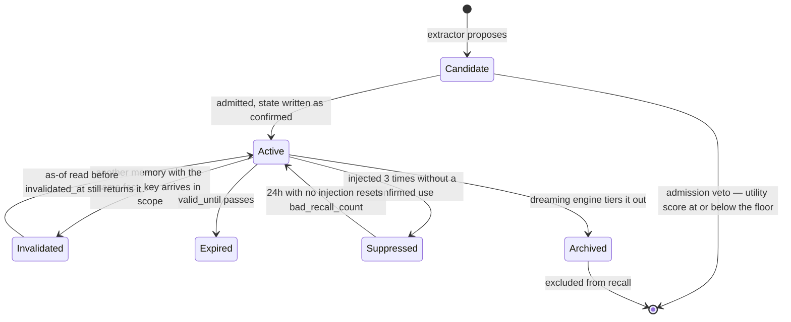

## 1. Executive Summary

memory-lancedb-pro is an OpenClaw plugin: LanceDB for storage, an LLM for
extraction and admission, `before_prompt_build` hooks for injection, and about
39,700 lines of TypeScript across 54 source files. It captures preferences,
decisions and project context automatically and recalls them into later
sessions.

Three things make it worth a report, and one of them is a warning.

**Fact-keyed supersession.** Every memory can carry a `fact_key`, derived from
its category and text when the extractor does not supply one. On write, the
system scans within the requesting scopes for an *active* memory with the same
normalized fact key and supersedes it. That is correction keyed on what the
fact is *about* rather than on a document id — the ingredient a tombstone needs,
put to a different use.

**A validity axis that reaches a read.** `valid_from`, `invalidated_at` and
`valid_until` are separate fields; `isMemoryActiveAt(meta, atMs)` takes a
caller-supplied timestamp, and the fact-query tool passes one through, so
"which value was current at time T" is answerable. `valid_from` defaults to the
row's insertion timestamp but is parsed from the extraction, so a fact stated
today about last March can carry March.

**An injection-feedback loop.** `src/auto-recall-tier1.ts` counts injections
that were never confirmed as used. Three of them and the memory is suppressed
from auto-recall for thirty minutes; twenty-four hours without an injection
resets the counter, on the reasoning that "this memory is being needed again".
The threshold is deliberately not configurable, and the comment says why: the
three-strikes rule is "a behavioral design choice that should hold across
deployments", while the windows around it are operational tuning.

**And the warning.** `MemoryState` is `pending | confirmed | archived`, and
`tools.ts:158` gates on it — `if (meta.state !== "confirmed") return false`.
That looks like an epistemic gate and is not one. The default state for
everything except session summaries is `confirmed`
(`src/smart-metadata.ts:350`), and four write sites in the extractor set it
explicitly with the same comment: `state: "confirmed", // #350: write confirmed
to unblock auto-recall`. No writer in `src/` produces a memory in the `pending`
state; the literal survives in the type, the normalizer, and the tool's input
schema. The gate exists, the read path honours it, and the population it was
meant to hold back is empty by construction.

## 2. Mental Model

A memory here is a *fact about a subject* rather than a document. That is why
`fact_key` is the interesting field: two statements about the same subject
collide, and the newer one wins by invalidating the older.

Everything else is a scoring layer around that. Admission decides whether a
candidate is worth storing at all. Decay decides how a stored memory ranks over
time. Tiering decides which store it lives in. The dreaming engine runs
overnight and moves memories between tiers.

The lifecycle has three exits and they are genuinely distinct:

The arrow back from `Invalidated` is the point of the validity axis: an
invalidated memory is not gone, it is *no longer current*, and a query anchored
to an earlier time still sees it.

## 3. Architecture

One LanceDB directory, one Node process, no server. The plugin registers
against OpenClaw's `before_prompt_build` hook — the README notes this replaced
the deprecated `before_agent_start` and that upgrading users should run
`openclaw doctor --fix`.

Metadata is a JSON string carried on each row and parsed on read
(`parseSmartMetadata`), which is why `src/smart-metadata.ts` is so defensive:
every field goes through a normalizer with a fallback, because the string may
have been written by any prior version. `normalizeTimestamp`, `clamp01`,
`clampCount`, `normalizeTier`, `normalizeState` and `normalizeLayer` all exist
to make a legacy row parse into a valid current row rather than crash.

Optional Redis provides a distributed lock (`src/redis-lock.ts`) for
multi-process installs. Embedding and reranking are outsourced to a configured
provider; there is no local model.

**Licence.** `package.json` declares `MIT` and the README carries an MIT badge,
but **no `LICENSE` file exists in the tree** at this commit. A reader should
know that the grant is asserted in metadata and not in a licence text.

## 4. Essential Implementation Paths

**Candidate → stored.** `src/smart-extractor.ts` builds candidates →
`src/admission-control.ts` scores them → `src/store.ts` writes to LanceDB.

**Collision → supersession.** `src/tools.ts:355-380` scans rows in the
requested scopes, skips anything not `isMemoryActiveAt`, normalizes the fact key
and collects matches.

**Prompt → injection.** The `before_prompt_build` hook →
`src/adaptive-retrieval.ts` and `src/retriever.ts` → `src/auto-recall-tier1.ts`
updates the counters and suppression on every injected memory.

**Nightly.** `src/dreaming-engine.ts` (default cron `0 3 * * *`) walks pages of
memories through `src/decay-engine.ts` and `src/tier-manager.ts`, promoting,
demoting and compacting.

## 5. Memory Data Model

`SmartMemoryMetadata` (`src/smart-metadata.ts:40`) carries about thirty fields.
The structural ones:

- **Three content levels** — `l0_abstract`, `l1_overview`, `l2_content` — so
  injection can spend the abstract and expand only when needed.
- **Four classifications** — `memory_category`, `tier`
  (`core | working | peripheral`), `memory_layer`
  (`durable | working | reflection | archive`), and `source` (six values from
  `manual` to `legacy`).
- **Validity** — `valid_from`, `invalidated_at`, `valid_until`, plus
  `memory_temporal_type` of `static | dynamic`, which says whether the fact is
  the kind that can go out of date at all.
- **Identity and correction** — `fact_key`, `supersedes`, `superseded_by`,
  `canonical_id`, `relations`.
- **Feedback counters** — `access_count`, `injected_count`,
  `last_confirmed_use_at`, `bad_recall_count`, `suppressed_until_ms`.

`suppressed_until_ms` documents a three-way presence semantic that is worth
copying as a habit: `undefined` means Tier 1 has never touched this row and is
a lazy-heal sentinel, `0` means touched with no active suppression, `> 0` means
suppressed. Distinguishing "never computed" from "computed as zero" is what
lets the migration heal old rows without a migration script.

`invalidated_at` is only accepted if it is `>= valid_from`, so an incoherent
interval is dropped rather than stored.

## 6. Retrieval Mechanics

Vector search over LanceDB with tag-token search beside it, query expansion
(`src/query-expander.ts`), intent analysis (`src/intent-analyzer.ts`), an
outsourced reranker with a timeout and deadline, and neighbour enrichment.
Ranking blends a Weibull stretched-exponential decay — recency with an
importance-modulated half-life and a tier-specific beta, log-saturating
frequency, and an intrinsic term of importance × confidence.

`src/retrieval-trace.ts` and `src/retrieval-stats.ts` keep the decomposition
inspectable rather than collapsing it into one number.

The scope filter is where this system is better than most of its neighbours.
`isRowScopeAccessible` (`src/store.ts:383`) returns true only when the row's
scope is in the filter, and the comment above it records the change that got it
there: rows with a null scope now "deny … against any real scope filter (no
more `OR scope IS NULL`)". An empty array is treated as an explicit deny-all
rather than as "no filter", and the supersede scan re-checks scope membership
itself because "store reads mask legacy NULL scopes as `global`" and a
collision target outside the requested scopes must never be touched. Three
separate places where a scope could have leaked, each closed on purpose.

## 7. Write Mechanics

**Admission is the only real gate, and it is an LLM.**
`src/admission-control.ts` scores each candidate on utility, confidence,
novelty, recency and a per-category type prior, against `admitThreshold` and
`rejectThreshold`, with three presets (`balanced`, `conservative`,
`high-recall`). The mechanism worth naming is `utilityVetoThreshold`, described
in the code as "the utility judge's floor of authority: a candidate whose LLM
utility score is at or below this is rejected outright, regardless of the
weighted composite (which the type prior otherwise dominates)". A veto that
overrides a weighted blend is the correct answer to the failure where a
generous prior floats junk past a low utility score.

Supersession runs after admission: derive the fact key, scan the requested
scopes for an active memory with the same key, invalidate it and link the pair.
`FACT_KEY_SCAN_MAX_ROWS` bounds the scan and throws
`FactKeyScanOverBoundError` rather than silently truncating — the right choice,
because a truncated collision scan produces a duplicate fact, not an error.

Writes go through the extractor and the admission LLM, so capture is not
instantaneous, and `bulk-store` paths exist for batching. Nothing records a
rejected value: an admission veto leaves no trace on the store, so the same
candidate arriving tomorrow is judged again from scratch — cheap when the judge
is deterministic and it is not.

## 8. Agent Integration

An OpenClaw plugin (`openclaw.plugin.json`) hooking `before_prompt_build`, a
CLI (`cli.ts`), a tool surface (`src/tools.ts`, 3,000-plus lines), a `skills/`
directory, and a team-scope module (`src/clawteam-scope.ts`). Twelve translated
READMEs.

Auto-recall injects on prompt build; manual recall goes through the tools. The
distinction matters because only the auto-recall path feeds the Tier 1
suppression counters — a memory the user fetches deliberately does not accrue
bad-recall strikes.

## 9. Reliability, Safety, and Trust

**Bitemporal — awarded.** `valid_from` and `invalidated_at`/`valid_until` form a
validity interval separate from the row's `timestamp`, `isMemoryActiveAt` takes
an arbitrary `at`, and the fact-query tool threads a caller-supplied `atMs`
through to `serializeFactEntry`, returning `activeAt` and `validFrom` per row.
The qualification: `valid_from` falls back to the insertion timestamp, so the
two axes coincide unless the extractor supplies a date.

**Scope enforced — awarded**, and it is one of the stricter implementations in
this atlas for the reasons in section 6.

**Trust state — withheld, and the near-miss is the report's headline.** A
three-value `state` field consulted on the read path is exactly the shape the
mark describes. It fails on two counts: there is no rejected value, and the
candidate value is unreachable — every writer in `src/` emits `confirmed`, four
of them with a comment saying the change was made to unblock auto-recall. What
remains is `archived`, a lifecycle flag, wearing an epistemic vocabulary.

**Audit log — no.** `src/reflection-event-store.ts` records reflection
lifecycle events and `src/admission-stats.ts` aggregates admission outcomes,
but there is no append-only record of mutations to the memory store itself.

**Human review — no.** No approval surface; the `state` field's approval-shaped
vocabulary has no operator behind it.

**Tombstone — no**, and this is the closest miss in the batch. `fact_key` is a
value-derived key, the collision scan already runs on the write path, and
`invalidated_at` already exists. What is absent is a record that a *value* was
rejected: superseding writes the new fact and retires the old one, so
re-asserting the retired value simply supersedes back. The machinery to refuse
it is in the file.

**Negative eval — no.** 171 test files, none asserting that particular material
must not be retrieved.

## 10. Tests, Evals, and Benchmarks

**No paper**, and no benchmark. There is no arXiv reference, DOI, `CITATION.cff`
or BibTeX block, and no committed evaluation harness or result file — no
LoCoMo, LongMemEval or retrieval-quality number anywhere in the tree. Every
quality claim in the README is qualitative.

171 test files under `test/`, almost all `.mjs`, and they are unusually
well-targeted at the mechanisms this report cares about:
`admission-utility-veto`, `admission-control-batch-utility`,
`autocapture-fallback-gating`, `clawteam-scope`, `agentid-validation`,
`batch-dedup`, `auto-recall-timeout`, `cjk-recursion-regression`. Several are
named after the bug they pin rather than the feature they cover, which is a
good sign about how they were written.

**I did not run them.** The screen flagged both `package.json` and
`package-lock.json` as changed within the last day — inside the seven-day
cooldown, where `npm ci` would faithfully reproduce a pin however new it is —
so this tree was read and never installed.

Two artifacts at the repository root are worth a reader's notice because they
are not part of the product: `commit_msg.txt` and `restore_files.py`.

## 11. For Your Own Build

### Steal

- **Key correction on the fact, not the row.** Deriving a `fact_key` from
  category plus text, then scanning for an active collision inside scope, is
  what makes "the user's editor preference" a single thing that can be updated
  rather than a pile of statements about editors.
- **Give the LLM judge a veto that outranks the blend.** `utilityVetoThreshold`
  exists because a type prior can otherwise carry a useless candidate over the
  admit threshold. A floor beats reweighting.
- **Throw when a bounded scan hits its bound.** `FactKeyScanOverBoundError`
  turns a silent duplicate into a loud failure, which is the correct trade for
  a scan whose whole purpose is finding the one row that collides.
- **Suppress what the agent keeps ignoring, and let the suppression expire.**
  Three unconfirmed injections, thirty minutes of suppression, twenty-four hours
  to reset — a self-correcting loop that costs three integers and needs no
  model.
- **Fix the threshold and expose the windows.** The comment explaining why
  three strikes is a constant while the windows are config is the clearest
  statement of that distinction in this corpus.
- **Distinguish "never computed" from "computed as zero".** `undefined` versus
  `0` on `suppressed_until_ms` is what lets old rows heal on first touch instead
  of needing a migration.
- **Deny null-scope rows against a real filter.** The comment marking the
  removal of `OR scope IS NULL` is the exact hole several other systems here
  still have.

### Avoid

- **Do not keep a gate whose blocking state you have stopped writing.** Four
  `// write confirmed to unblock auto-recall` comments mean the `pending` state
  became an obstacle and was routed around rather than removed. What is left
  reads, to anyone auditing the code, like an approval workflow.
- **Do not let admission be the only filter when admission is a model call.**
  With `pending` gone, an LLM utility score is the sole thing between an
  extraction and permanent memory, and a rejection leaves no record, so the
  same candidate is re-judged from zero every time it recurs.
- **Do not ship an MIT badge without a LICENCE file.** The declaration in
  `package.json` is a claim; the file is the grant.
- **Do not carry structured metadata as a JSON string if you can avoid it.**
  It is why `smart-metadata.ts` needs six normalizers and why every read pays a
  parse — a reasonable price for LanceDB's schema constraints, and a price.

### Fit

This is for an OpenClaw user who wants automatic capture and recall with real
lifecycle management and is willing to pay for an LLM call per candidate batch.
The scope work is solid enough to trust with more than one project in one store,
which is not true of every plugin in this class.

It is not for anyone who needs to verify retrieval quality: nothing is measured,
and the ranking stack — Weibull decay, tier-modulated half-lives, a five-term
admission blend — is exactly the kind of composite that
[ClawMem's eval](../clawmem/) found could cost two thirds of its MRR when nobody
checks. The mechanisms are the reason to read this; the tuning is unverified.

## 12. Open Questions

- **What broke in issue #350?** Four comments reference it as the reason
  `confirmed` is written at capture. Whether `pending` was ever a working queue
  with a promoter, or always inert, is not answerable from this commit.
- **How often does the fact-key scan hit its bound?** `FactKeyScanOverBoundError`
  is thrown to the caller; what the caller does with it — abort the write, or
  store an uncollided duplicate — was not traced.
- **Does anything consume `memory_temporal_type`?** Marking a fact `static` or
  `dynamic` is exactly the signal a decay engine should use, and the connection
  between the classifier and the decay weights was not established.
- **What is the admission cost per session?** Every candidate batch is an LLM
  call and no aggregate is committed.

## Appendix: File Index

**Metadata and validity** — `src/smart-metadata.ts` (`SmartMemoryMetadata` at
`:40`, `isMemoryActiveAt` `:285`, `isMemoryExpired` `:295`, normalization
`:330-380`), `src/temporal-classifier.ts`

**Fact-keyed supersession** — `src/tools.ts:275` (`isTemporalFactEntry`), `:287`
(`serializeFactEntry`), `:355-380` (the collision scan and
`FactKeyScanOverBoundError`), `src/identity-addressing.ts`

**Admission** — `src/admission-control.ts` (`utilityVetoThreshold` at `:44`),
`src/admission-stats.ts`, `src/autocapture-fallback-admission.ts`,
`src/reflection-mapped-admission.ts`, `src/noise-filter.ts`,
`src/noise-prototypes.ts`

**Injection feedback** — `src/auto-recall-tier1.ts` (`isSuppressed` `:57`,
`computeTier1Patch` `:85-140`), `src/access-tracker.ts`

**Scope** — `src/store.ts:373-390` (`isExplicitDenyAllScopeFilter`,
`isRowScopeAccessible`), `src/scopes.ts`, `src/workspace-boundary.ts`,
`src/clawteam-scope.ts`

**Retrieval** — `src/retriever.ts`, `src/adaptive-retrieval.ts`,
`src/query-expander.ts`, `src/intent-analyzer.ts`, `src/retrieval-trace.ts`,
`src/retrieval-stats.ts`

**Lifecycle** — `src/decay-engine.ts`, `src/dreaming-engine.ts`,
`src/tier-manager.ts`, `src/memory-compactor.ts`, `src/memory-upgrader.ts`

**Extraction** — `src/smart-extractor.ts`, `src/extraction-prompts.ts`,
`src/prompt-blocks.ts`, `src/chunker.ts`, `src/batch-dedup.ts`

**Reflection** — `src/reflection-store.ts`, `reflection-event-store.ts`,
`reflection-item-store.ts`, `reflection-ranking.ts`, `reflection-slices.ts`,
`reflection-retry.ts`

**Integration** — `openclaw.plugin.json`, `cli.ts`, `index.ts`,
`src/openclaw-memory-capability.ts`, `skills/`

**Tests** — `test/` (171 files; `admission-utility-veto.test.mjs`,
`clawteam-scope.test.mjs`, `batch-dedup.test.mjs`,
`autocapture-fallback-gating.test.mjs`)

## History

**2026-08-09** — [`f6e63af3450be7fb3bb8cdb4898e5010afcb87a7`](https://github.com/CortexReach/memory-lancedb-pro/commit/f6e63af3450be7fb3bb8cdb4898e5010afcb87a7) — first reading. Screened before reading: no auto-run surface, but `package.json` and `package-lock.json` both changed within a day, inside the seven-day cooldown. The tree was read, never installed, and no test was run.
