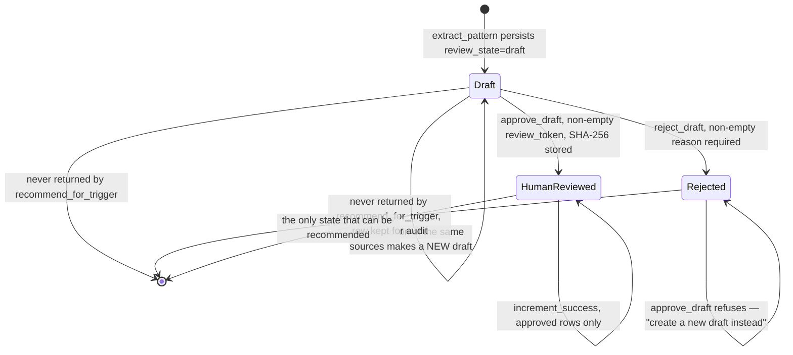

## 1. Executive Summary

Memory Palace is a self-hosted memory backend — FastAPI, SQLite, a React
dashboard, one MCP server serving Claude Code, Codex, Gemini CLI and OpenCode.
MIT licensed, roughly 98,000 lines of Python across backend and tests, with a
Docker Compose deployment and a bilingual documentation set.

Most of it is a competent instance of a shape this atlas has many examples of:
paths pointing at memory rows, chunked text, FTS5 and vectors fused by RRF, an
optional reranker, four latency/quality profiles with committed benchmark
numbers.

**The part worth the report is `backend/core/procedural_engine.py`.** Procedural
memory here is draft-by-default and the default is enforced in three independent
places:

- `review_state` is a three-value field — `draft`, `human_reviewed`, `rejected`
  — validated on construction (`ProceduralDraft.__post_init__` raises on an
  unknown value);
- `recommend_for_trigger` returns **only** `human_reviewed` rows, with the
  docstring naming this as "the read-side enforcement of the draft-by-default
  invariant";
- migration 0008 marks the provenance columns `NOT NULL`, so, in the module's
  own words, "even a bypassing caller cannot create a provenance-less row".

Approval requires a non-empty `review_token` that passes a configured validator,
and the SHA-256 of that token is stored in `review_token_fingerprint`.
Rejection is terminal: `approve_draft` refuses a rejected row with "create a new
draft instead of approving a rejection". The engine never deletes; rejected
drafts stay queryable.

That is the strongest form of [human review](../../patterns/) this atlas has
found for derived memory, and it is worth stating precisely what it is not.
`extract_pattern` computes `source_hashes` for every draft it builds and **never
compares them against rejected rows**. Reject a procedure today, run extraction
over the same source memories tomorrow, and you get a fresh `draft` with no
trace of the earlier verdict. The rejection is durable, read-excluded and
terminal *for that row*. It is not a tombstone, and closing the gap is one
`SELECT`.

The other finding is an absence. `access_log` — described in migration 0004 as
the L0 layer that persists "per-memory operation events (read, write,
search_hit, compact) used by the forgetting engine, reflection workflow, and
observability dashboards" — is created by the migration, declared as an ORM
model, imported into `sqlite_client.py`, surfaced in the dashboard as
`l0_count`, and **written by nothing in the inspected tree**. A grep of every
`.py`, `.js`, `.jsx` and `.sql` file for an insert against it returns nothing;
the dashboard panel falls back to `?? 0` and its own storybook values are
hardcoded. The migration's rollback note even hedges: no data export is required
"in an environment that has not yet started writing to it".

## 2. Mental Model

Memory Palace layers memory and treats each layer as less trustworthy than the
one below it.

**L1** is what was written: a `memories` row with content, reachable through one
or more `(domain, path)` pairs. Updating a memory does not overwrite it — a new
row is created and the old one's `migrated_to` points at it, forming a version
chain, with the old row flagged `deprecated`.

**L2 and above** are derived: gists (`memory_gists`), topic summaries
(`memory_summaries`), procedures (`procedural_memories`). Every derived row must
satisfy what the code calls the Derived Memory Contract — `source_memory_ids`,
`source_hashes`, `derivation_method`, `confidence`, `review_state`,
`storage_budget_bytes`. The contract is why the trust state exists: a derived
row is a claim the system made about its own contents, and the schema records
who made it, from what, and whether a person has looked.

The three engines that produce and retire this material are deliberately
asymmetric in what they are allowed to do:

- `LayeringEngine` "never deletes anything. It also never modifies L1 rows." It
  builds a summary draft and hands it back; persistence is a separate call.
- `ForgettingEngine` splits into three methods by escalating danger —
  `simulate_decay` (pure read, projects vitality forward N days for the
  dashboard), `get_candidates` (informational queue), and `approve_archive`,
  "the ONE method that actually mutates state", which demands a review token,
  moves the row to `archived_memories`, and marks the L1 row `deprecated`
  instead of deleting it.
- `ProceduralEngine` inserts drafts and changes exactly one field per operation.

The self-loop on `Draft` is the gap. Everything else in the diagram is enforced
in code; that arrow is the one the code does not close.

## 3. Architecture

A FastAPI backend, a SQLite database, a React/Vite dashboard, and an MCP server
that can run over stdio or SSE. Docker Compose is the documented deployment,
with a GHCR image and an acceptance checklist beside it.

The backend is organised as a facade (`backend/core/facade.py`) over a large
`SQLiteClient` (`backend/db/sqlite_client.py`, the single biggest file in the
tree) with repositories layered on top — `memory_repo`, `search_repo`,
`gist_repo`, `path_repo`, `vitality_repo`, `index_repo`, `maintenance_repo`.
The repositories are honest about being thin: `MaintenanceRepository` is
documented as a "Round 1 delegate facade" whose implementation "remains on
`SQLiteClient`".

Schema changes go through a migration runner with paired forward and rollback
SQL for all eight migrations, checksums in `schema_migrations`, and a separate
`migration_gate.py` that dry-runs each migration's preconditions and builds an
`audit_log` list *of the migration run* — which is a different thing from the
memory audit table discussed in section 9, and easy to confuse when grepping.

Standing this up costs an operator a Docker host, an embedding provider if they
want profile C or D, and an API key for the maintenance routes: every endpoint
under `/review` and `/maintenance` sits behind `require_maintenance_api_key`.

## 4. Essential Implementation Paths

**Write.** `backend/mcp/tools/create_memory.py` → the write lane
(`backend/api/_write_lane.py`) → `SQLiteClient.write_guard` → insert or update →
chunking and embedding.

**Guard.** `write_guard` (`backend/db/sqlite_client.py:6374`) runs a semantic
search and a keyword search for the incoming content, then returns one of
`ADD`, `UPDATE` or `NOOP` with a reason and a method.

**Search.** `search_advanced` → `fts5_channel` and `vector_channel` (both
opening with `where_clause = "m.deprecated = 0"`) → `rrf_fusion` → optional
rerank.

**Derive.** `LayeringEngine.generate_summary` → draft → explicit
`persist_draft`; `ProceduralEngine.extract_pattern` → draft row.

**Review.** `backend/api/review.py` (snapshot diffs, selective rollback) and the
procedural approve/reject path, both behind the maintenance API key.

**Forget.** `ForgettingEngine.simulate_decay` → `get_candidates` →
`approve_archive` with a token → `archived_memories` plus `deprecated = 1`.

## 5. Memory Data Model

Eleven ORM classes in `backend/db/models.py`. The ones that carry the design:

| Table | Role |
| --- | --- |
| `memories` | `content`, `deprecated`, `migrated_to`, `vitality_score`, `access_count`, `last_accessed_at` |
| `paths` | Composite PK `(domain, path)` → `memory_id`, plus `priority` and `disclosure` |
| `memory_chunks` / `memory_chunks_vec` | Retrieval units and their vectors, with `char_start`/`char_end` offsets |
| `memory_gists` | L1.5 compaction, with the full provenance contract from migration 0007 |
| `memory_summaries` | L2, provenance columns `NOT NULL`, indexed on `review_state` |
| `procedural_memories` | Trigger + ordered steps + provenance + `review_state`, `review_token_fingerprint`, `rejection_reason`, `success_count` |
| `archived_memories` | Where `approve_archive` puts a row instead of deleting it |
| `access_log` | Declared, migrated, modelled — and never written |

Two modelling choices are worth naming. A memory has no title: the display name
is derived from the last segment of its path, so renaming is a path operation
and the content row is untouched. And `disclosure` on `Path` — free text saying
*when to expand this memory* — is a small idea with a good shape: it puts the
progressive-disclosure hint on the pointer rather than the content, so the same
memory can be surfaced differently from two places.

The version chain is a singly-linked list through `migrated_to`, and the model
docstring documents the repair rule for a permanently deleted middle node:
`A→B→C`, delete `B`, splice to `A→C`. `backend/api/review.py` walks it with a
`_VERSION_CHAIN_MAX_HOPS = 64` bound and substitutes
`"[Permanently deleted, old content unavailable]"` where a link is gone — the
chain degrades visibly rather than silently.

## 6. Retrieval Mechanics

Two channels feed RRF fusion. `fts5_channel` queries `memory_chunks_fts` with a
sanitised FTS5 query, falling back to `LIKE` over chunk text and path when FTS
is unavailable or returns nothing. `vector_channel` reads persisted vectors,
with a hash-embedding fallback that is treated as a degradation rather than a
mode. Both start their SQL with `m.deprecated = 0`, so a superseded version is
excluded in candidate selection.

Four profiles trade latency for quality, and the committed numbers
(`docs/EVALUATION_EN.md`) are unusually specific about their own weakness: A
and B are keyword-tier, C adds real embeddings, D adds the reranker, and the
average p95 goes 2.7 ms → 14.7 ms → 208.8 ms → 3,004.9 ms for HR@10 of 0.125 →
0.188 → 0.812 → 0.875. The document states the setup — two datasets, eight
queries each, 200 distractors — which is small enough that the ranking between
C and D should not be read as significant, and large enough that the gap between
B and C should.

The degradation vocabulary is the good part of this section. Channels return
`degrade_reasons` alongside results — `embedding_fallback_hash`,
`embedding_config_missing`, `vector_dim_mismatch_requires_reindex` — and those
strings reach the caller. A system that tells you it just answered from a hash
embedding is doing something most of this corpus does not.

## 7. Write Mechanics

**The Write Guard is the design's best transferable idea.** Before a write
lands, `write_guard` runs both a semantic and a keyword search over the
incoming content, scoped by domain and optional path prefix, and returns a
decision: `ADD` for genuinely new content, `UPDATE` with a target when it is a
revision of something present, `NOOP` when it adds nothing.

What makes it worth copying is the failure behaviour. If the embedding provider
degraded — hash fallback, missing config, remote error, dimension mismatch — and
fail-open is not explicitly enabled, the guard returns `NOOP` with the
degradation reason rather than a decision. It refuses to judge duplication on
evidence it does not trust. Most dedup gates in this atlas silently fall through
to "not a duplicate", which is the answer that grows the store.

**Snapshots** are taken before the first modification to a resource within a
session, shared across later modifications to the same resource, and stored as
JSON on disk under `snapshots/{session_id}/` with a manifest, a file lock and
90-day retention. Rollback creates a *new* version carrying the snapshot's
content rather than rewinding the row, so the version chain stays append-only.
Path snapshots and memory snapshots are separate resource types, so a metadata
change can be rolled back without touching content.

Writes are serialised through a write lane (`backend/api/_write_lane.py`,
`RUNTIME_WRITE_LANE_QUEUE` on by default). Retrieval lag is real but bounded:
chunking and FTS indexing happen in the write path, embeddings depend on the
configured provider.

## 8. Agent Integration

Ten MCP tools (`backend/mcp/tools/`): create, read, update, delete, search,
`add_alias`, `compact_context`, `index_status`, `rebuild_index`. The stated
recommended posture is "skills + MCP, not MCP-only" — a repo-local `AGENTS.md`
plus a rendered MCP snippet for IDE hosts that do not support skills, and full
skill packages for the four CLI clients.

The dashboard is a first-class surface rather than a viewer, with four feature
areas: Memory (browse, layer hierarchy), Review (snapshot diffs, selective
rollback, deprecated-memory purge), Maintenance, and Observability. The
procedural approve/reject flow and the forgetting approval both live behind it,
which is what makes the review states reachable by a person rather than
theoretical.

## 9. Reliability, Safety, and Trust

**Trust state — awarded.** `review_state` is a discrete three-value field on
procedural memories, gists and summaries, validated on construction, indexed on
`memory_summaries`, and — crucially — consulted on the read path.
`ProceduralReviewState.ALL` is the vocabulary; `get_by_review_state` raises on
anything outside it. `increment_success` refuses to operate on a draft or a
rejection "so the success counter truly reflects approved usage", which is the
kind of small consistency the field is usually not given.

**Human review — awarded.** Not a display surface: `approve_draft` and
`reject_draft` are mutations that only a person holding a review token can
cause, the token's SHA-256 is persisted for audit, `reject_draft` refuses an
empty reason, and `approve_archive` in the forgetting engine has the same shape.
The review routes sit behind `require_maintenance_api_key`.

**Scope — withheld, and the near-miss matters.** `domain` and `path_prefix` are
real predicates — `p.domain = :domain_filter` at `sqlite_client.py:6852` — but
they are applied only when the caller passes them. There is no default domain
floor and no tenancy: two users on one instance see one store. The one predicate
that *is* unconditional in the channel SQL is `m.deprecated = 0`, which is
correction rather than scope.

**Audit log — withheld, and this is the finding.** The `access_log` table is
fully specified in migration 0004 as the L0 operation record, has two indexes, a
paired rollback, an ORM class, an import in `sqlite_client.py`, and a dashboard
count. Nothing inserts into it. The forgetting engine, which the migration names
as a consumer, decays on `vitality_score`, `last_accessed_at` and `access_count`
on the `memories` row instead. So the observability story the schema tells and
the one the code implements are different stories, and a reader who trusts the
migration comment would conclude this system has an audit trail it does not
have.

The counterweight is the snapshot directory, which *is* written and *is* a
durable record of what changed — but it is a rollback buffer scoped to a
session with 90-day retention, not an append-only log of mutations in the
system's own store.

## 10. Tests, Evals, and Benchmarks

**No paper.** No arXiv link, `CITATION.cff`, DOI or BibTeX block anywhere in the
tree.

84 test files under `backend/tests/`, including dedicated suites for the
forgetting engine, the layering engine, the compression engine, the migration
runner and the 0004–0007 migration gate. Several assert the invariants this
report leans on — `test_forgetting_engine.py:381` asserts that archiving flips
`deprecated` to 1 rather than deleting, and
`test_drill_down_returns_live_and_archive_and_tombstone` exercises the case
where a source memory was purged and checks it surfaces as a tombstone entry
rather than vanishing from the provenance list.

**I did not run them.** `backend/api/setup.py` executes at install time and
`backend/tests/conftest.py` executes on collection; the tree was read, not
installed.

The benchmark document commits per-profile HR@10, MRR, NDCG@10, Recall@10 and
p95 across four profiles and two distractor densities, plus an old-vs-new
comparison. The numbers are self-reported and the harness lives in
`backend/tests/benchmark/`, so they are reproducible in principle. What is
absent is any case asserting that particular material must *not* be retrieved —
which is the test a draft-by-default system most wants, because
"`recommend_for_trigger` excludes drafts" is exactly the kind of invariant a
refactor breaks silently.

## 11. For Your Own Build

### Steal

- **Make derived memory unusable until approved, and enforce it on the read
  path.** One `WHERE review_state = 'human_reviewed'` in the recommendation
  query is the whole mechanism. Everything else — the token, the fingerprint,
  the terminal rejection — is hardening around it.
- **Put the provenance columns under `NOT NULL`.** A dataclass that refuses to
  construct without provenance protects your code; a `NOT NULL` protects you
  from a caller that bypasses your code.
- **Make rejection terminal and keep the row.** `approve_draft` refusing a
  rejected row with "create a new draft instead" means an approval can never be
  a rehabilitation, and the rejected row stays queryable as evidence.
- **Split a dangerous operation into simulate / list / apply.** The forgetting
  engine's three methods are ordered by how much damage they can do, and only
  the third takes a token. Anyone reading the class knows which one to audit.
- **Fail a dedup gate closed when its evidence is degraded.** Returning `NOOP`
  with `embedding_fallback_hash` instead of a confident `ADD` is the difference
  between a guard and a formality.
- **Return degradation reasons to the caller.** Not a log line — a field in the
  response, so the agent and the dashboard both know the answer came from a
  fallback.
- **Roll back by writing a new version.** Restoring snapshot content as a new
  row keeps the chain append-only and makes the rollback itself auditable.

### Avoid

- **Do not stop at rejecting the row.** The one query this design is missing —
  compare a new draft's `source_hashes` against the rejected set — is the
  difference between a review queue and a memory that learns from rejection.
  Without it, a reviewer's "no" has a shelf life of one extraction run.
- **Do not ship a schema that promises a log nothing writes.** `access_log` has
  a migration, a rollback, two indexes, an ORM class and a dashboard counter.
  Every artifact of an audit trail exists except the insert. A reviewer reading
  the migration would report this system as having operation-level
  observability.
- **Do not let repository classes be delegate shells.** Seven repositories all
  forwarding to one 6,000-line `SQLiteClient` gives the import graph of a
  modular design and the change surface of a monolith.
- **Do not read four-profile benchmarks from sixteen queries as a ranking.**
  The document is honest about its setup; a reader skimming the table is the
  risk.

### Fit

This suits a single team that wants a self-hosted memory service with a
dashboard, is willing to run Docker and an embedding provider, and specifically
wants a human in the loop before derived memory reaches an agent. If you want
the human out of the loop, most of what is distinctive here is overhead: the
retrieval stack alone is unremarkable.

It is not multi-tenant. The maintenance API key is an operator boundary, not a
user boundary, and `domain` is a convention rather than a wall. Two people
sharing an instance share everything.

## 12. Open Questions

- **Was `access_log` ever wired, or never?** The migration is Round 2 and reads
  as forward-looking rather than abandoned. Either way, the forgetting engine
  described as its consumer works from denormalised counters on the memory row.
- **What validates a review token?** `review_token_validator` is an injected
  hook and the default path was not traced end to end; whether a deployment
  without a configured validator accepts any non-empty string is the question
  that decides how strong the gate really is.
- **Does anything drive `procedural_memories` from real usage?** Extraction is
  `rule_based` in v1 with `llm_pattern` reserved for a later approval flow, so
  the review queue's value depends on an extractor that is deliberately
  conservative.
- **How large does the version chain get?** Every update creates a row and the
  walker caps at 64 hops; what happens to a memory edited a hundred times was
  not traced.

## Appendix: File Index

**Trust state and review** — `backend/core/procedural_engine.py`
(`ProceduralReviewState` at `:63`, `extract_pattern` `:243`, `approve_draft`
`:369`, `reject_draft` `:427`, `recommend_for_trigger`), `backend/api/review.py`

**Derived memory contract** — `backend/core/layering_engine.py`,
`backend/core/compression_engine.py`,
`backend/db/migrations/0007_add_gist_provenance.sql`,
`0008_add_procedural_memories.sql`

**Forgetting** — `backend/core/forgetting_engine.py` (`simulate_decay`,
`get_candidates`, `approve_archive`), `backend/api/forgetting.py`,
`backend/db/migrations/0006_add_archived_memories.sql`

**Write path** — `backend/db/sqlite_client.py:6374` (`write_guard`), `:6172`
(`_build_guard_decision`), `backend/api/_write_lane.py`,
`backend/mcp/tools/create_memory.py`, `update_memory.py`

**Snapshots and rollback** — `backend/db/snapshot.py`, `backend/api/review.py`

**Retrieval** — `backend/db/search/fts5_channel.py`, `vector_channel.py`,
`rrf_fusion.py`, `base_channel.py`, `backend/db/repositories/search_repo.py`

**Schema** — `backend/db/models.py`, `backend/db/migrations/0001`–`0008` with
paired rollbacks, `backend/db/migration_gate.py`, `migration_runner.py`

**The unwritten log** — `backend/db/migrations/0004_add_access_log.sql`,
`backend/db/models.py:248`, `frontend/src/lib/api.js:717`

**Integration** — `backend/mcp/tools/`, `backend/mcp/views/`,
`backend/mcp_server.py`, `backend/run_sse.py`, `docs/skills/`

**Dashboard** — `frontend/src/features/{memory,review,maintenance,observability}`

**Benchmarks** — `docs/EVALUATION_EN.md`, `backend/tests/benchmark/`

## History

**2026-08-09** — [`56c9bed39957f615da0b66b5e1459281d8fd1fef`](https://github.com/agi-is-going-to-arrive/memory-palace/commit/56c9bed39957f615da0b66b5e1459281d8fd1fef) — first reading. Screened before reading: no auto-run surface, build-time execution in `backend/api/setup.py` and `backend/tests/conftest.py`, three unpinned dependency surfaces. The tree was read, never installed, and no test was run.
