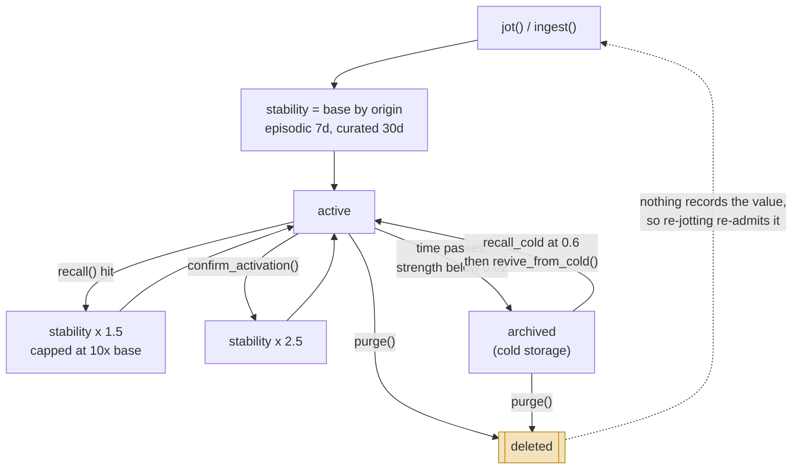

## 1. Executive Summary

memory-project is **long-term memory for one developer's Claude Code sessions**,
wired in globally through hooks so it works from any directory. It is small —
3,113 lines of Python across a flat module layout, 26 commits, **AGPL-3.0** —
which puts it with [Logseq](../logseq/), [OpenViking](../openviking/),
[SillyTavern](../sillytavern/), [Aukora Kernel](../aukora-kernel/) and
[Juggler](../juggler/) in the copyleft corner of this corpus, and is a real
constraint on anyone thinking of vendoring it.

The design commitment is stated in the README and honoured in the code: model
the *phases* of human memory rather than build a search index. Encoding, filing,
association, decay, reinforcement, retrieval, consolidation, cued recall and
non-destructive forgetting each have a function behind them, and the tuning
constants that make them work are named and grouped at the top of
`memory_store.py` rather than scattered as literals.

**The best idea here is that forgetting has two speeds, and only the slow one is
destructive.** `prune()` is routine cleanup and it *archives* — it flips
`archived: True` in metadata, drops the entry out of `recall()` entirely, and
keeps the embedding and the content. A sufficiently specific cue can still reach
it through `recall_cold()`, and `revive_from_cold()` puts it back. The docstring
names the phenomenon it is imitating — *"I haven't thought about that in 40
years!"* — and states outright that this models human cold storage "rather than
true forgetting". `purge()` is the other speed, documented as rare and manual,
"for something that should never have been recorded in the first place (e.g.
accidentally jotted sensitive content)".

Most systems in this atlas conflate those two. Here the split is deliberate, and
the source's honesty about which one is which is worth more than the README's
"non-destructive forgetting" claim standing alone.

**The weakest part is what `purge()` actually achieves.** It calls
`col.delete(ids=[doc_id])` on Chroma, and that is where the guarantee stops —
see section 9. The function built for accidentally-recorded secrets is the one
whose erasure is least complete.

Second weakness: there is no correction mechanism at all. No tombstone, no
supersession, no rejected value, no trust state — the words do not appear
anywhere in the repository. A claim that was purged can be jotted again five
minutes later and nothing notices. For a system whose whole thesis is memory
lifecycle, correction is the phase the phase model left out.

## 2. Mental Model

A memory is a **document in one Chroma collection** carrying a strength that
decays with time and grows with use.

Two numbers do the work. `stability` is how slowly the memory decays, and
`_raw_strength(last_accessed, stability)` converts elapsed time into a value
between 0 and 1. Every recall multiplies stability by `STABILITY_GROWTH` (1.5),
capped at `STABILITY_CAP_FACTOR` (10) times the base — so a memory that keeps
being useful becomes progressively harder to lose, and one that is never
retrieved slides down a curve.

Where a memory starts on that curve depends on how it arrived:

| Origin | Base stability |
| --- | --- |
| Episodic (extracted from a transcript) | 7 days |
| Semantic (consolidated) | 90 days |
| Curated (`jot()` or an ingested summary) | 30 days |

Three thresholds decide what the number means. Above `RETRIEVAL_FLOOR` (0.1) a
memory can appear in `recall()`. Below `DELETION_FLOOR` (0.02) `prune()` moves
it to cold storage. `recall_cold()` ignores strength entirely and ranks by raw
similarity, requiring `COLD_REVIVAL_THRESHOLD` (0.6) — the mechanism behind the
"specific enough cue" idea: everyday recall cannot reach an archived memory, but
a precise query can.

`_maybe_consolidate` promotes an episodic memory to semantic as its stability
grows, which is [promotion between tiers](../../patterns/promotion-between-tiers/)
driven by use rather than by a scheduler.

### How a thing becomes a belief, and how it stops being one

The loop on the left is the design's point: **nothing leaves the store because
it decayed.** The only edge out is `purge()`, and it is a separate deliberate
call. The dashed edge is the gap — deletion terminates the record and says
nothing about the value, so the same claim can walk back in through `jot()`.

## 3. Architecture

One process, no server, no network. `chromadb` provides persistence at
`.chromadb/` beside the source, and `sentence-transformers` runs
`all-MiniLM-L6-v2` locally, so the store works offline once the model is cached.
An operator needs Python, the two packages, and disk. That is the whole
deployment.

`install.py` wires three Claude Code hooks globally rather than per project,
which is what makes the cross-project claim work: a memory jotted in one repo is
reachable from a session started anywhere.

- `hooks/session_start_backstop.py` (297 lines) — the largest hook, a backstop
  for sessions where the other paths did not run.
- `recall_hook.py` — fires on prompt submission, retrieves, and formats a
  context block.
- `hooks/session_end_capture.py` (63 lines) — hands the transcript to
  `auto_capture.py`.

`activity.log` sits beside the database as a plain-text append-only record. Its
docstring gives the reason plainly: *"so activity is visible without querying
ChromaDB."*

### Deployment and ergonomics

The cost is a local embedding model and a Chroma directory that grows without
bound unless someone runs `prune()`, which **is not scheduled anywhere**. The
docstring for `review_feedback_patterns` is candid about this: it runs on demand,
"consistent with how `prune()` also isn't automatically scheduled in this project
today". So on a default install the forgetting curve computes strengths that
nothing ever acts on, and the archive tier stays empty until a human invokes it.

## 4. Essential Implementation Paths

- **Write:** `jot()` (`memory_store.py:274`) and `ingest()` (`:210`).
- **Retrieve:** `recall()` (`:430`), `recall_associative()` (`:468`), scoring in
  `_score_hits()` (`:337`).
- **Decay and reinforcement:** `_raw_strength()` (`:118`), `_grow_stability()`
  (`:122`), `_reinforce()` (`:407`).
- **Lifecycle:** `_maybe_consolidate()` (`:127`), `prune()` (`:544`), `purge()`
  (`:579`), `recall_cold()` (`:597`), `revive_from_cold()` (`:645`).
- **Feedback loop:** `find_feedback_patterns()` (`:696`),
  `draft_rule_from_cluster()` (`:752`), `review_feedback_patterns()` (`:774`).
- **Capture:** `auto_capture.py` chunks a transcript and runs extraction in a
  subprocess; `capture_state.py` tracks per-session progress.

## 5. Memory Data Model

One collection, `memories`. Each document carries content, an embedding, and
metadata: `topic`, `title`, `last_accessed`, `stability`, `memory_type`,
`consolidation_level`, and — once archived — `archived` and `archived_at`.

`memory_type` is a **tier**, not a trust class. It records where a memory came
from and how far it has been consolidated; it says nothing about whether the
content is believed, disputed or wrong. `consolidation_level` is a counter.
There is no status field anywhere in the schema, which is why the trust column is
empty: strength stands in for confidence, and strength is a function of recency
and use rather than of evidence.

Re-ingesting an edited summary preserves accumulated access metadata, so
"a content update doesn't reset the memory's accumulated strength or silently
demote a consolidated memory back to episodic" — a small, correct decision that
several larger systems in this atlas get wrong.

## 6. Retrieval Mechanics

`recall()` embeds the query, asks Chroma for neighbours, then re-scores each hit
by multiplying similarity by the memory's current strength and applying
`TOPIC_BOOST_FACTOR` (1.5) when the hit's topic matches the caller's hint.
Anything under `RETRIEVAL_FLOOR` drops out, and archived entries are excluded
outright.

**Topic is a boost, never a filter.** `jot()` defaults `topic_hint` to the
basename of the working directory, so a fragment written in `project-a/` carries
that topic — but a session in `project-b/` still sees it, ranked slightly lower.
That is the design goal stated in the README, and it is also why the scope mark
is withheld: the atlas requires a stored scope key *applied as a filter on the
read path*, and this is deliberately the opposite. Nothing here can confine a
memory to one project, which is the right trade for a single-developer portfolio
and the wrong one the moment a second person or a client boundary is involved.

`recall_associative()` adds a second hop, following the first pass's hits to
their neighbours — the "association" phase of the model.

## 7. Write Mechanics

Two front doors. `jot()` stores a one-line fragment with no file and no
ceremony. `ingest()` takes a session-summary Markdown file from
`session_summaries/`.

Neither blocks the agent for long: embedding is local and single-document.
Session-end capture is the asynchronous path — `auto_capture.py` chunks the
transcript, starts extraction in a subprocess (`_start_extraction`), and
collects results (`_collect_extraction`), with `capture_state.py` recording how
far it got so a re-run resumes rather than duplicates.

**No background pass rewrites the whole store.** `prune()` scans all metadata
and updates the entries below the floor, but it neither re-embeds nor
re-generates content, and it is idempotent — already-archived entries are left
alone. Consolidation drafts text for a human and does not mutate memories.

## 8. Agent Integration

Claude Code only, through three hooks and a `CLAUDE.md.example` that documents
the tool surface for the model. There is no MCP server, no HTTP API and no SDK,
so adopting this outside Claude Code means writing the integration.

`recall_hook.py` is the interesting one: it formats retrieved memories into a
context block with a time context, and gates on `CONFIDENT_THRESHOLD` (0.35) for
a hit worth stating plainly versus `ACTIVATION_FLOOR` (0.15), below which a hit
is "too weak to even hedge about". A memory system that distinguishes *assert*
from *hedge* from *stay silent* at the injection boundary is doing something most
of this corpus does not.

## 9. Reliability, Safety, and Trust

**`purge()` does not trust its storage engine, and the docstring is the reason
to read it.** The function is documented for the one case where erasure has to be
real — "accidentally jotted sensitive content" — and it does a full rebuild:
read every remaining row, `delete_collection`, `create_collection`, re-add. The
comment explains why `col.delete(ids=[doc_id])` will not do, in the engine's own
terms — Chroma's local index is hnswlib-backed and soft-delete only, so *"a
deleted vector's slot isn't necessarily zeroed or compacted"* and the embedding
can sit in `.chromadb/<uuid>/data_level0.bin` until a later insert happens to
take the slot. This is the mechanism set out under
[the layer below delete](../../compare/#the-layer-below-delete-what-the-storage-engine-does-with-the-vector),
answered rather than inherited.

**And the rebuild alone is not enough, which the project found by measuring.**
`delete_collection()` drops the old segment from `chroma.sqlite3`'s own
`segments` table, and leaves that segment's UUID-named directory on disk — *"just
orphans it, still fully intact, still fully readable outside the Chroma API."*
The docstring reports the audit: every purge before the fix left exactly one such
directory, and *"a real corpus of ~140 purges had accumulated ~137 of them, every
one still holding a complete, undeleted copy of a 'purged' collection's full
index."* `_gc_orphaned_segments()` is named as the actual fix — *"it's what makes
the old data genuinely gone, not the rebuild by itself."* The cost is stated with
it: an O(corpus) rebuild on every call, accepted because purge is documented as
rare and deliberate rather than routine, with the size at which that stops being
true named. So is the trap for callers — the module-level collection handle is
replaced, and any handle taken before the call raises afterwards, *"confirmed
empirically: a stale handle fails loudly, not silently."*

**Correction is encoded, and it is opt-in on purpose.** `purge(doc_id,
tombstone=True)` records the rejected claim's text and embedding before the row
goes, and `jot()` refuses any later write within 0.82 similarity of a tombstone,
logging it as `blocked`. The two deletion modes are kept apart deliberately,
because they want opposite things from the embedding: a correction tombstone
*"keeps the rejected claim's embedding around on purpose, because the whole point
is recognizing when the same wrong claim comes back"*, while the
accidentally-jotted-secret case needs the embedding gone. Most systems in this
atlas have one delete verb and inherit whichever of those two properties their
engine happens to give them.

The failure it closes is the one automatic capture creates: session-end
extraction re-reads transcripts, so a purged claim still sitting in a retained
transcript had a live path back in — and would have returned *"at full stability
like nothing happened."*

**The mutation log earns its mark, narrowly.** `_log_activity`
(`memory_store.py:202`) appends a line for `ingest`, `jot`, `confirm`, `archive`,
`purge` and `revive` — an explicit append-only record of every mutation, in the
system's own artifact rather than in git history. Two limits belong beside the
mark: it is plain text rather than queryable, and nothing in the codebase ever
reads it. It is a record for a human tailing a file, not a structure the write
path consults.

**Human review is real and unusually well-reasoned.** `review_feedback_patterns`
clusters recurring feedback, drafts a candidate rule per cluster, and appends
them to `pending_rules.md`. The docstring states the boundary: *"CLAUDE.md is
never written to directly by this process — it only changes on explicit approval,
since it's a standing instruction file, not something that should get silently
rewritten by a background process."* That is a system declining to let its own
consolidation edit the file that governs the agent, which is the
[governed write gateway](../../patterns/governed-write-gateway/) instinct applied
to the one file where getting it wrong is worst.

## 10. Tests, Evals, and Benchmarks

`regression_test.py` carries 95 checks against a live store — the decay and
reinforcement maths, the archive and revive round trip, the tombstone refusal,
topic exclusion, orphan-sweep behaviour and capture idempotence. I did not run
it.

**Two committed cases assert that something must not be retrieved, and both
carry their own positive control.** The prune cycle ages a document past the
deletion floor, asserts `prune()` archived it, then asserts it is *invisible to
`recall()`* and *invisible to `recall_associative()` (both tiers)* — and asserts
in the next line that the same id is *findable via `recall_cold()`*. Absence in
one retriever and presence in another, on one document, is a shape neither half
can fake: a retriever returning nothing fails the cold check. The tombstone case
does the same work on the write path — the refused re-write returns `None`, an
unrelated write in the same test still succeeds, and no `tombstone/` id appears
in a `recall()` that returns that unrelated fact.

The suite's most quietly useful check is the inverse one: *plain `purge()`
(tombstone=False) does not block a later identical jot()*. Asserting that a
feature stays off when it was not asked for is how an opt-in stays opt-in.

`classify.py` is the closest thing to an eval: it fits a vectorizer over the
corpus and runs `leave_one_out_eval` on topic classification. That measures the
filing phase rather than retrieval quality, and no result is committed.

## 11. For Your Own Build

### Steal

- **Two-speed forgetting.** Routine cleanup that archives and is reversible, plus
  a separate explicitly-named call that deletes. Roughly forty lines between
  `prune()` and `purge()`, and it removes the most common false choice in this
  corpus — either memory grows forever or "forget" destroys.
- **A revival threshold on raw similarity.** `recall_cold()` deliberately drops
  the strength weighting and requires 0.6 raw similarity. Decoupling "can this be
  found at all" from "should this surface unprompted" is the mechanism behind the
  cold-storage metaphor, and it is three lines.
- **Refusing to let consolidation write the instruction file.** Drafting to
  `pending_rules.md` and requiring a person to move a rule into `CLAUDE.md`.
- **Assert / hedge / silent as three injection bands.** Two thresholds in
  `recall_hook.py`, and the agent stops stating weak recalls as fact.

### Avoid

- **Trusting `purge()` for secrets** without also compacting or rebuilding the
  Chroma index. If the accidental-secret case is real for you, the vector needs a
  path to actually leave the disk.
- **Shipping decay with nothing scheduled to act on it.** `prune()` runs on
  demand only, so the default install computes strengths that never take effect.
- **Treating strength as confidence.** A memory is strong here because it is
  recent or frequently used, which is uncorrelated with whether it is still true.

### Fit

This suits **one developer with several repositories and a Claude Code habit**,
and it is honest about being that. The cross-project design that makes it useful
is precisely what makes it unsuitable for anything with a boundary in it: there
is no scope filter, no tenant, no per-client isolation, and adding one means
changing the ranking model rather than adding a predicate. The AGPL licence
compounds this — reusing the code in anything network-facing carries the copyleft
obligation, which is a reason to read it for the mechanisms rather than to depend
on it. That is a narrower objection than the source-available licences elsewhere
in this atlas — BSL, ELv2 and PolyForm restrict *what you may do with it*, while
AGPL restricts *what you must give back*.

If you need correction — a memory that can be marked wrong and stay wrong — this
is the wrong starting point, and the gap is structural rather than a missing
feature.

## 12. Open Questions

- **Does anything schedule `prune()` in practice?** The code says no and the plan
  calls a scheduled version a v2 item. Until then the archive tier is reachable
  only by a user who knows to run it, and the forgetting curve is a ranking input
  rather than a lifecycle.
- **How much does the embedding retain after `purge()`?** The vector is a lossy
  projection, and how much of a purged secret is recoverable from it is a
  question this report can pose and not answer.
- **What does session-end extraction do with a claim that was already purged?**
  There is no tombstone to consult, so the presumption is that it re-admits it,
  but no test covers the sequence.
- **Is `topic` ever intended to become a filter?** The cross-project design says
  no, but a single-developer store that later holds client work would need one,
  and the boost-based ranking would have to change shape.

## Appendix: File Index

**Storage and schema**
- `memory_store.py` — the whole store: schema-by-metadata, tuning constants,
  every lifecycle function

**Write path**
- `auto_capture.py` — transcript chunking and subprocess extraction
- `capture_state.py` — per-session resume state
- `ingest_corpus.py` — bulk ingestion of `session_summaries/`

**Retrieval path**
- `recall_hook.py` — prompt-time retrieval, confidence banding, context block
- `backlinks.py`, `backlink_lib.py`, `apply_backlinks.py`,
  `incremental_backlink.py` — association between summaries

**Integration**
- `install.py` — global hook wiring
- `hooks/session_start_backstop.py`, `hooks/session_end_capture.py`
- `CLAUDE.md.example` — the tool surface as documented to the model

**Tests and evals**
- `regression_test.py` — 16 assertions on the decay and archive maths
- `classify.py` — leave-one-out evaluation of topic classification

## History

**2026-09-10** — [`83b2ac97c19b6dc650e9d48e20c47e68df50f998`](https://github.com/acdesigntech/memory-project/commit/83b2ac97c19b6dc650e9d48e20c47e68df50f998) — read again, 18 commits past the previous pin. Two marks are added and they arrive for opposite reasons. **`tombstone` is genuinely new**: `reject_claim()` and the `TOMBSTONE_MATCH_THRESHOLD` check inside `jot()` were committed on 4 August under the message *"Add correction-encoding tombstones so purged facts can't silently recur"*, which names the failure it closes — an autonomous re-extraction pulling a corrected claim back out of a retained transcript. **`negative_eval` is a first-reading error**: the report said `regression_test.py` carried sixteen assertions and that no committed case asserted anything must not be retrieved, and at the previous pin the file already held seventy-five `check()` calls including *archived doc invisible to `recall()`*, *invisible to `recall_associative()` (both tiers)* and *findable via `recall_cold()`* on the same document — the exact paired shape the report described as the one that would prove the headline claim. The count and the claim were both wrong when written. The central `purge()` finding was fixed upstream and the fix went past it: the rebuild the project added is documented as necessary but not sufficient, because `delete_collection()` leaves the old segment's directory on disk *"still fully intact, still fully readable outside the Chroma API"* — measured at about 137 orphaned copies across a real corpus of 140 purges — and `_gc_orphaned_segments()` is named as what actually makes the data gone. Two commit messages in this range name the atlas review as their source. `audit_log` and `human_review` hold, the first strengthened by a `query_activity.py` that makes the log queryable and by `blocked` entries recording the writes a tombstone refused. Checks went from 75 to 95. Screened before reading: one auto-run surface in `hooks/`, no manifest inside the seven-day cooldown, no build-time execution path and no unpinned dependency surface; nothing was installed or run.

**2026-08-03** — [`992dc090b347f31976316cfac885b097a26bb298`](https://github.com/acdesigntech/memory-project/commit/992dc090b347f31976316cfac885b097a26bb298) — first reading.
