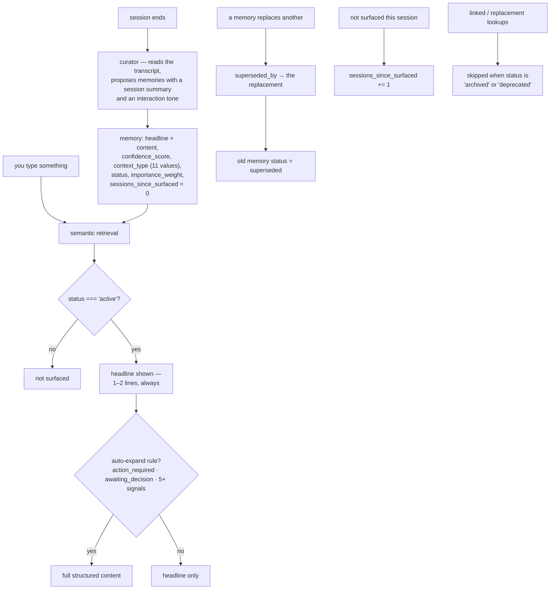

## 1. Executive Summary

memory-ts is a memory layer for Claude Code *and* Gemini CLI — hooks, a curator
that extracts memories from the session transcript, semantic surfacing, and a
session primer ("Last session: 2 hours ago. We implemented embeddings…").

**The artifact worth the report is `src/types/schema.ts`'s version history**,
which records what the schema *removed* and why:

> "v3: Consolidated metadata — removed fragmented/unused fields:
> `knowledge_domain` (overlaps with `project_id` + `domain`);
> **`emotional_resonance` (580 variants, never used)**;
> `component` (**always empty**);
> `expires_after_sessions` (never used);
> `parent_id`/`child_ids` (**no logic implemented**);
> `retrieval_weight` (retrieval uses `importance_weight`);
> `temporal_relevance` (replaced by `temporal_class`)."

This atlas spends a great deal of its time finding declared-and-unread fields —
audit models with no writer, `valid_from` columns no query touches, status enums
nothing sets. **This is a project that went looking for its own and deleted
them, and left the evidence for each.** "580 variants, never used" is a
measurement someone took. "No logic implemented" is an admission. "Always empty"
is a query someone ran against their own store.

A schema that shrinks is rare; a schema that documents *why* each field failed to
earn its place is rarer, and it is the single most useful thing a maintainer can
leave for the next person — including themselves, when they are tempted to add
`emotional_resonance` again.

**And v4 is a good idea in its own right** — section 5's two-tier memory.

## 2. Mental Model

A session ends, a curator reads the transcript and proposes memories. Each
carries a status, a confidence, a context type from a closed enum, and a headline
separate from its body. Retrieval surfaces headlines, filters to `active`, and
expands the body only when a rule says it matters.

## 3. Architecture

`src/` splits into `core` (curator, retrieval, store, session-parser), `server`,
`cli`, `types` (schema, memory), `migrations`, `utils`. Hooks and skills
directories sit beside it, and the package installs globally through Bun.

The dual-CLI support is the integration claim — "use your preferred AI coding
assistant, or even both simultaneously. The memory server handles concurrent
sessions from different CLIs seamlessly" — which makes the memory the shared
thing rather than the tool.

11,600 lines of TypeScript. There is a `migrations/` directory, which follows
from having a schema that changes.

## 4. Essential Implementation Paths

**The schema and its history** — `src/types/schema.ts` (the v2–v4 changelog
`:20-34`, `confidence_score` `:43`, `context_type` `:46`, `status` `:65`,
`sessions_since_surfaced` `:72`, `superseded_by` `:84`).

**Retrieve** — `src/core/retrieval.ts` (the active filter `:158`, `:812`, the
replacement and linked-memory guards `:491`, `:646`).

**Curate** — `src/core/curator.ts`, `src/core/session-parser.ts`,
`test-curation.ts`.

## 5. Memory Data Model

`status` is a five-value enum — `active | pending | superseded | deprecated |
archived` — with `superseded_by` pointing at the replacement, and it is **read on
the retrieval path**: `if (memory.status && memory.status !== 'active') return
false` appears at two sites, and the replacement and linked-memory lookups
separately skip anything `archived` or `deprecated`. That earns `trust_state`,
and the distinction between the five is meaningful: `pending` is not yet
believed, `superseded` was replaced, `deprecated` was retired, `archived` was put
away.

**`sessions_since_surfaced` counts decay in sessions, not in time.** That is a
better unit for this workload than a wall-clock half-life: a memory that has not
been relevant across twenty working sessions is stale whether those took a week
or three months, and a project you did not touch for a month should not have its
memories decay for the holiday.

**v4's two-tier structure is the other idea to take:**

> "headline: 1-2 line summary (always shown in retrieval); content: full
> structured template (expand on demand). Auto-expand rules: `action_required`,
> `awaiting_decision`, 5+ signals."

Storing the summary and the body as separate fields — rather than truncating at
render time — means retrieval can show twenty headlines for the cost of two full
memories, and the **auto-expand rules decide when brevity is the wrong default**.
"Something is awaiting your decision" is exactly the case where the user needs
the whole thing unprompted.

## 6. Retrieval Mechanics

Semantic surfacing with cosine similarity over a filesystem-backed store, no
external service. The interface shown in the README puts the confidence and the
tags in front of the memory — `[🔧 • 0.9] [fsdb, vectors] fsdb has
cosineSimilarity` — so the model and the user see the system's own uncertainty
beside the claim rather than having it applied silently.

`project_id` and `domain` exist on a memory; no scope key was found applied as a
read predicate, so `scope_enforced` is not earned.

## 7. Write Mechanics

Curation runs at session end against the transcript, producing memories plus a
`session_summary` and an `interaction_tone`. `curateWithSessionResume` handles a
session that was resumed rather than started fresh, which is the case a
naive end-of-session hook gets wrong — it would re-curate material already
captured.

The curator is a **subprocess call to a CLI** (`getClaudeCommand`,
`getCuratorPromptPath`), with the prompt in a separate file. Keeping the
extraction prompt as an editable artifact rather than a string literal is right;
depending on a CLI binary being present and stable is the cost.

## 8. Agent Integration

`bun install -g @rlabs-inc/memory` then `memory install` for Claude Code or the
Gemini CLI equivalent. Hooks, skills, and a server handling concurrent sessions
from both CLIs.

## 9. Reliability, Safety, and Trust

**One mark: trust state**, per section 5.

**Tombstone — no.** `superseded_by` records the replacement and nothing keys on
the superseded *value*, so the same content re-extracted from a later session is
a new memory.

**Bitemporal, audit log, scope, human review, negative eval — no.**

**The risk is the curator's dependency shape.** Extraction is a subprocess
invocation of an external CLI, so the memory layer's quality is downstream of a
binary's presence, version and prompt-following. `test-curation.ts` at the
repository root — a hand-run script that prints the result of curating one
session — is the only exercise of it found, and it is a debugging aid rather than
a test.

For a system whose entire value is what the curator chooses to keep, that is the
gap. The schema history shows this project is willing to measure its own fields
and delete the ones that fail; the same instinct applied to curation output —
what fraction of curated memories are ever surfaced, how many are duplicates of
an existing memory — would be the natural next measurement, and
`sessions_since_surfaced` is already the column that would answer the first.

## 10. Tests, Evals, and Benchmarks

**No paper, no benchmark, no test directory.** `test-curation.ts` is a
`#!/usr/bin/env bun` script that curates one session id and prints the summary,
the tone and the memories.

The schema changelog is, in an unusual sense, the evaluation record this project
does have: seven fields removed with a stated reason each is evidence that
somebody checked whether the design was carrying its weight. It is retrospective
and manual, and it is more self-examination than most repositories in this atlas
show.

**I ran nothing.**

## 11. For Your Own Build

### Steal

- **Record what your schema removed and why.** "580 variants, never used",
  "always empty", "no logic implemented", "overlaps with X + Y" — four different
  reasons a field failed, all worth knowing, and all lost if the field is quietly
  dropped.
- **Go looking for your own dead fields.** Almost every system in this atlas has
  one; almost none has deleted one. `SELECT COUNT(DISTINCT field)` and
  `SELECT COUNT(*) WHERE field IS NOT NULL` are the two queries.
- **Store the headline and the body as separate fields.** Truncating at render
  time throws away the choice; two fields let retrieval show twenty summaries for
  the cost of two full memories.
- **Write down when brevity is wrong.** `action_required`, `awaiting_decision`
  and "5+ signals" as auto-expand rules mean the cases that need the whole thing
  get it without being asked for.
- **Count decay in sessions, not in days.** A project untouched for a month
  should not have its memories age for the holiday; twenty working sessions
  without a memory surfacing is real evidence of staleness.
- **Give status five values and read it on the retrieval path.** `pending`,
  `superseded`, `deprecated` and `archived` are four different reasons not to
  surface something, and the replacement lookup should skip the last two too.
- **Handle the resumed session explicitly.** `curateWithSessionResume` avoids
  re-curating material a fresh-session hook would capture twice.
- **Keep the extraction prompt in a file.** Editable, diffable, and not a string
  literal in the curator.
- **Show confidence beside the memory in the interface.** `[🔧 • 0.9]` in front
  of the claim beats applying the number silently.

### Avoid

- **Do not leave the curator untested when the curator is the product.** A
  hand-run script that prints one session's output is a debugging aid; what
  fraction of curated memories are ever surfaced is the measurement, and
  `sessions_since_surfaced` already holds the answer.
- **Do not depend on an external CLI binary for your core extraction** without
  saying what happens when it is absent or its output shape changes.
- **Do not let `superseded_by` be the whole correction story.** It records the
  replacement and nothing prevents the superseded content being re-extracted from
  a later transcript as a fresh memory.

### Fit

A reasonable choice if you switch between Claude Code and Gemini CLI and want one
memory behind both — that dual-CLI framing is uncommon, and the two-tier
headline/content structure is a genuinely good answer to injection cost.

`src/types/schema.ts` is worth opening whatever you build. Its first thirty lines
are a model of how to document a schema that changed its mind.

## 12. Open Questions

- **What sets `pending`?** The status is filtered on retrieval; the writer of
  each state was not traced.
- **Does anything act on `sessions_since_surfaced`?** It is incremented and named
  a decay counter; the threshold was not found.
- **What happens when the curator CLI is missing?** `getClaudeCommand` resolves
  it; the failure path was not read.
- **How do concurrent sessions from two CLIs avoid double-curating?** The claim
  is that the server handles it seamlessly.

## Appendix: File Index

**Schema** — `src/types/schema.ts` (the v2/v3/v4 changelog with the removal
reasons `:20-34`, `confidence_score` `:43`, `context_type` enum `:46`, `status`
`:65`, `sessions_since_surfaced` `:72`, `superseded_by` `:84`,
`superseded_count` `:151`), `src/types/memory.ts` (`V4_DEFAULTS` `:167`,
`:203`), `src/migrations/`

**Retrieval** — `src/core/retrieval.ts` (the active-status filters `:158`,
`:812`, the replacement guard `:491`, the linked-memory guard `:646`)

**Curation** — `src/core/curator.ts` (`CuratorConfig`, `getClaudeCommand`,
`getCuratorPromptPath`), `src/core/session-parser.ts`, `src/core/store.ts`
(`:239`), `test-curation.ts`

**Surfaces** — `src/server/`, `src/cli/`, `hooks/`, `skills/`

## History

**2026-08-09** — [`8fcadf6d8783869878a64d42aec3ed88f7f91a70`](https://github.com/rlabs-inc/memory-ts/commit/8fcadf6d8783869878a64d42aec3ed88f7f91a70) — first reading. Screened before reading; the tree was read, never installed, and no curation was run.
