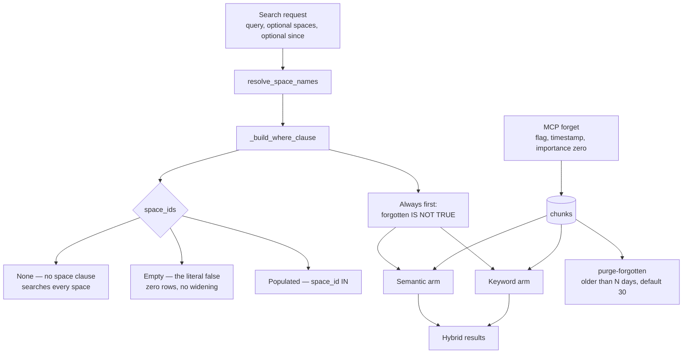

## 1. Executive Summary

Memory Vault is an MIT-licensed self-hosted memory for AI applications —
17,143 lines of Python, 589 test functions across 57 files, 165 commits since
March 2026 — over one Postgres with pgvector, reached through an MCP server, a
REST API, a dashboard and a CLI.

Three marks, and the one worth reading the repository for is a single `else`
branch.

`_build_where_clause` documents three cases for its space filter, and the third
is the interesting one:

> `None` → no space filter (search every space)
> `[]` → caller asked for specific spaces but none resolved; return zero rows
> (a hard `false` predicate) rather than silently widening to every space

The end-to-end test names the bug that produced that comment: a
`spaces=["unknown"]` filter *"used to silently widen to every space because
`resolve_space_names` returned `[]` and the caller collapsed it to `None` via
`or None`."*

That is the falsy-collapse bug this atlas keeps meeting — and here it failed in
the worst possible direction, turning a narrowing request into a widening one.
The fix is three lines, and the test that guards it ingests a uniquely-tokened
document, searches for it under a space name that does not exist, and asserts
zero results; the next test ingests a different token, searches with no filter,
and asserts a hit, so the exclusion cannot be satisfied by a store that is simply
empty.

Forgetting is the second mark and follows the same instinct. `forget` sets a
flag, stamps the time and zeroes the importance; the row stays. Every read
excludes it, starting with the first clause the shared builder emits. Destruction
is a separate, later, operator-run step with a thirty-day floor.

## 2. Mental Model

Chunks in Postgres, with an embedding for the semantic arm and a text index for
the keyword arm, a space for organisation, and a JSONB metadata bag carrying the
content hash and the forgotten flag. Entities and relations are extracted
alongside into a knowledge graph with live views over the same table.

Two boundaries matter and they are different in kind. The space is an
*organising* key that becomes a filter when a caller names one. The forgotten
flag is an *exclusion* that applies whether or not anyone asks. Both are compiled
into the SQL rather than applied to results, and both live in one builder shared
by the two search arms, which is what stops them diverging.

## 3. Architecture



## 4. Essential Implementation Paths

- **Filter.** `_build_where_clause(space_ids, since)` emits the forgotten
  exclusion unconditionally, then the space clause for the three documented cases
  (`services/search.py:285-310`).
- **Forget.** The MCP tool reads the chunk, refuses if it is already forgotten,
  sets `forgotten` and `forgotten_at` in the metadata and zeroes `importance`
  (`mcp/server.py:500-525`).
- **Purge.** `purge-forgotten --older-than N` destroys only what has been
  forgotten for at least that many days, defaulting to thirty, and reports what
  remains (`cli.py:203-230`).
- **Deduplicate.** A unique index on `(space_id, content_hash)` — added because
  the MCP tool checked for an existing hash and inserted in a separate statement,
  so two concurrent calls could both pass the check
  (`migrations/004_chunk_content_hash_dedup.sql`).

## 5. Memory Data Model

A chunk carries its content, an embedding, an importance, a space, and a JSONB
metadata bag. The trust axis is one boolean and its timestamp, which is a narrow
model and an honest one — there is no confidence to calibrate, no provenance to
misread, and no supersession pointer that might go unwritten.

`tombstone` is withheld, and the near miss is instructive. The content hash *is*
value-keyed, and the unique index on `(space_id, content_hash)` does refuse a
second write of the same text. But its job is concurrency, not correction: the
index entry lives on the row, so forgetting a memory and storing the same text
again succeeds, because there is no longer a row to collide with. A record keyed
on the value of something *removed* is the mark, and this is a record keyed on the
value of something *present*.

`bitemporal` is absent — `forgotten_at` and `created_at` are both record-axis —
and `audit_log` has no table.

## 6. Retrieval Mechanics

Two arms, one builder. That structure is the reason the forgotten exclusion
cannot go missing from one of them, and the test makes the property explicit
rather than trusting the structure: `test_forgotten_check_is_always_present` loops
over all three shapes of the space argument and asserts the clause is in every
one.

The space semantics deserve their own sentence because the middle case is the
one systems get wrong. Asking for spaces that do not exist is not the same as
asking for no spaces, and collapsing the first into the second is a widening
disguised as a default. Here the empty list becomes `false`, the populated list
becomes an `IN`, and the unit tests pin the two against each other — one asserts
`false` is present and no `space_id` clause is, the other asserts the `IN` is
present and no `false` is.

The remaining limit is the `None` case: with no space named, a search spans every
space. Under the threat model that is correct — the document's opening declares a
single-tenant, self-hosted application where the operator is the only user — and
it becomes the boundary the moment a deployment stops matching that description.

## 7. Write Mechanics

Ingestion chunks text and extracts entities; `remember` stores a single memory
through MCP. The migrations are the best-documented part of the repository, and
they read as a record of the project's own mistakes:

- 004 adds the unique index because *"the MCP `remember` tool checked for an
  existing content hash and then inserted in a separate statement. Two concurrent
  calls could both pass the check before either insert ran."* It also collapses
  duplicates already committed by the race, because otherwise `CREATE UNIQUE
  INDEX` fails and *"the container will not finish booting"*.
- 006 narrows that index, because once file ingestion also persisted a content
  hash, *"one content hash per space"* stopped meaning *"one stored memory per
  space"* — a document may legitimately repeat a passage, and under the 004 index
  ingesting an ordinary file failed outright.

A migration that says which earlier migration it corrects, and why the earlier
one stopped being right, is worth more than a comment on the index itself.

## 8. Agent Integration

An MCP server with `remember`, `recall`, `forget`, `move_memory` and a
`memory://spaces` resource, plus REST, a dashboard and a local-LLM chat over the
operator's own memories.

`move_memory` rebuilding its graph entries is a small correctness detail worth
noting: moving a memory between spaces without rebuilding the entity edges would
leave the graph pointing at the old scope.

## 9. Reliability, Safety, and Trust

The threat model is the strongest document in the repository and one of the
better ones in this corpus. It states the deployment it is built for — a
developer on their own machine, homelab or single-purpose VPS, where they control
the host and the network — and then does three things most such documents do not.

It declares what the system is *not* for: *"Memory Vault is not built for PHI,
payment data, or anything carrying subject-access obligations."*

It names the gap rather than assuming it away, with a whole section on
deployments beyond the default model — the compose file publishing Postgres on
5432, the CORS default, the default credentials.

And it offers verification: *"You do not have to take the claims below on trust.
The repository ships a re-runnable pentest script that exercises the auth,
input-validation and injection defenses against a live instance."* A security
claim with a script attached is a different kind of claim.

The least-privilege migration is in the same spirit and carries the honest
caveat. It defines three NOLOGIN group roles — DML for the application, SELECT
for dashboards and backups, DDL only while migrating — and states the threat it
answers: until then one user did everything, so *"'drop the chunks table' was in
range of the same credential that answers /api/search."* But it is opt-in by
construction: nothing creates a login user or changes who the application
connects as, and *"a deployment that ignores this migration entirely keeps working
exactly as it does today, which is the point — this must not be able to lock
anyone out of their own database."*

That is a defensible trade for a self-hosted tool, and it means the default
deployment still answers search with a credential that can drop the table. The
migration supplies the roles; adopting them is an operator action the threat model
documents.

## 10. Tests, Evals, and Benchmarks

589 test functions across 57 files, plus the pentest script; nothing was run here.
The suite is organised around named regressions — `test_space_filter_security.py`,
`test_purge_forgotten.py`, `test_bad_input_matrix.py`,
`test_async_embed_yields_event_loop.py`, `test_chat_think_tag_boundary.py` — and
the ones behind the marks assert both directions on the same store.

The purge pair is the neatest: *"a memory forgotten today must survive a 30-day
purge"* and *"a memory forgotten 60 days ago should be gone"*, with a zero-day
variant and a no-op case beside them. Four assertions pin a retention rule that
would otherwise be a number in a default argument.

## 11. For Your Own Build

- **An unresolved filter is not an absent filter.** Names that resolve to nothing
  must produce zero rows, not every row. The collapse happens through an innocuous
  `or None`, and it converts a narrowing request into a widening one.
- **Emit the exclusion from one builder both arms share.** A hybrid search with
  two query paths has two places to forget a rule; one clause list used by both is
  structurally safer than two correct copies.
- **Hide first, destroy later, with a floor.** Marking forgotten and purging after
  thirty days gives a mistaken forget a recovery window and still keeps the
  material out of every read in the meantime.
- **Say which migration you are correcting.** 006 explains what 004 meant and why
  it stopped being true. A reader who finds a puzzling index learns the whole
  story from the file that changed it.
- **Publish what you do not defend.** A threat model that names the data classes
  the system is unsuitable for, and ships a script that tests its own claims, is
  more use to a deployer than a longer list of features.

## 12. Open Questions

- Would a content hash retained past a forget be wanted, so that re-storing text
  the operator explicitly forgot is at least visible? The hash is already computed.
- The least-privilege roles are opt-in. Is there a path to making the compose file
  create and use the `memory_vault_app` login role by default without risking the
  lockout the migration is careful to avoid?
- With no space named, a search spans every space. If a second person ever gets a
  token, is that the boundary you would want, or would a default space be safer?

## Appendix: File Index

- Search and scope: `src/memory_vault/services/search.py:285-315` (the builder and
  its three documented cases).
- Forgetting: `src/memory_vault/mcp/server.py:500-525` (the forget tool),
  `:576-590` (the forgotten counts), `:679`, `:741`, `:777` (the further
  exclusions), `src/memory_vault/api/routers/chunks.py:54-80` (the default and the
  view caveat), `src/memory_vault/cli.py:203-230` (`purge-forgotten`).
- Migrations: `004_chunk_content_hash_dedup.sql`,
  `006_scope_remember_dedup_index.sql`, `008_token_expiry.sql`,
  `009_least_privilege_roles.sql`.
- Security: `docs/threat-model.md`, `scripts/security-pentest.sh`, `SECURITY.md`.
- Tests: `tests/test_space_filter_security.py:55-140`,
  `tests/test_purge_forgotten.py:55-105`, `tests/test_space_delete.py:118`.

**Searches recorded for the negative claims**

```sh
grep -rn "forgotten" src/memory_vault --include='*.py'          # one writer, five read exclusions, one purge
grep -rn "space_ids" src/memory_vault/services/search.py        # the three cases, all in one builder
grep -rn "content_hash" src/memory_vault --include='*.py' --include='*.sql'   # dedup on live rows; nothing retained past a delete
grep -rn "valid_from\|as_of\|recorded_at" src/memory_vault --include='*.py'   # 0 — both timestamps are record-axis
```

## History

**2026-09-17** — [`84987337c1418d85468c4dd09c28e7a75252c378`](https://github.com/MihaiBuilds/memory-vault/commit/84987337c1418d85468c4dd09c28e7a75252c378)
— first reading, at the head of `main`, 165 commits in. Screened with
`scripts/screen_repo.py` first: one auto-run surface (a `server.json` MCP
manifest), one build-time execution path (a pytest `conftest.py` collection hook),
and three dependency manifests changed inside the seven-day cooldown. Nothing was
installed, built or run — no pip, no Docker, no Postgres started, and the
committed pentest script was read rather than executed. Three marks. `tombstone`
is withheld on a near miss worth naming: the content hash is value-keyed and a
unique index refuses a duplicate write, but the entry lives on the live row, so
forgetting a memory and storing the same text again succeeds. `bitemporal` is
absent — `created_at` and `forgotten_at` are both record-axis — and `audit_log`
has no table. `human_review` is absent: the operator forgets and purges directly,
with no approval recorded.
