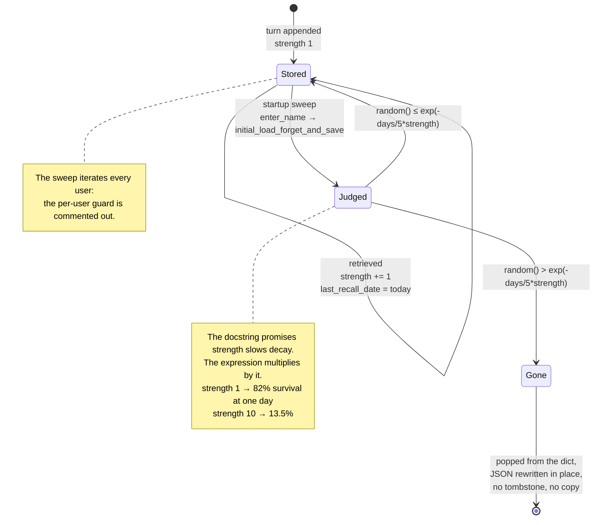

## 1. Executive Summary

MemoryBank is the reference implementation of
[*MemoryBank: Enhancing Large Language Models with Long-Term Memory*](https://arxiv.org/abs/2305.10250)
(Zhong, Guo, Gao, Ye and Wang, submitted 17 May 2023), and it is the origin of a
pattern that now shows up across this atlas: **memory that decays on an
Ebbinghaus forgetting curve, and is strengthened by being recalled.** SiliconFriend,
the companion chatbot wrapped around it, is a LoRA-tuned ChatGLM or BELLE — or
plain ChatGPT — with a JSON memory bank, a FAISS index over it, per-day
summaries and a per-user personality portrait injected into the prompt.

It is a small research artifact: about 3,300 lines of Python, MIT licensed, no
commit since 24 May 2023, no tests. Its historical importance is out of all
proportion to its size, because the forgetting curve is the mechanism everyone
cites and almost nobody re-derives.

Which is why the central finding matters. `memory_bank/memory_retrieval/forget_memory.py:36`
reads:

```python
return math.exp(-t / 5*S)
```

Python parses that as `((-t) / 5) * S`, not `-t / (5 * S)`. The docstring
immediately above it says "The higher the memory strength, the slower the rate
of forgetting, and the longer the information is retained." **The code does the
opposite.** A memory with strength 1 has an 82% chance of surviving one day; a
memory with strength 10 — one that has been recalled nine times — has a 13.5%
chance. Over a week the strong memory's retention is 1 in 10⁶. Since
`update_memory_when_searched` increments `memory_strength` by one on every
retrieval, **the act of remembering something is what destroys it**, and it
destroys it faster the more often it mattered.

Two design choices turn that from a wrong number into data loss. Forgetting is
*destructive*: the losing turns are `pop`ped from the dictionary and the JSON
file is overwritten in place, with no tombstone, no archive and no second copy.
And the pass is *not scoped*: the loop iterates every user in the file with the
`if user_name != name: continue` guard commented out at
`forget_memory.py:88-89`, so one user opening the app runs a random destructive
sweep over everybody's memories.

The genuinely good parts are the idea and the dataset. Recall-strengthened decay
with a per-item strength counter and a `last_recall_date` is the right shape for
an agent that should let unimportant things go, and `eval_data/` ships fifteen
simulated users with ten days of history each and roughly a hundred hand-written
probing questions in both English and Chinese — a reusable retrieval-quality
fixture that costs nothing to adopt.

## 2. Mental Model

A memory is one **dialogue turn**: `{query, response, memory_strength,
last_recall_date, memory_id}`, filed under a date, under a user name. Two
derived forms sit beside it — a **daily summary** and, at the user level, an
`overall_history` digest and a `personality` portrait produced by a separate
summarization pass. All three are retrievable; only turns and summaries enter
the vector index.

The state machine has three transitions and one of them is fatal:

```text
turn appended (strength 1, last_recall_date = today)
   │
   ├── retrieved  ->  strength += 1, last_recall_date = today
   │                  (and the file is rewritten immediately)
   │
   └── startup    ->  days = today - last_recall_date
                      p = exp(-days / 5 * strength)
                      random() > p  ->  POPPED FROM THE FILE, permanently
```

Nothing is superseded, nothing is contradicted, nothing is marked wrong. There
is exactly one way a memory dies and it is a coin flip weighted by a formula
pointing the wrong way. Memory is entirely background-managed in the sense that
no agent and no user ever chooses to forget — but the "background" is the
foreground: the sweep runs synchronously inside `enter_name` while the user
waits for the greeting.

The system treats memory as ground truth. There is no confidence field, no
provenance beyond `memory_id`, and no representation of doubt, so the only thing
`memory_strength` can express is *how often this came up* — which, given the
formula, it converts into *how soon this will be gone*.

Recency and strength therefore pull in opposite directions, and this is the part
worth holding on to. Recall does two things at once: it resets
`last_recall_date`, which helps, and it increments `memory_strength`, which in
this implementation hurts far more. A memory recalled today survives the
immediate sweep on recency; the damage lands on the next quiet week, when its
inflated strength collapses its retention faster than a turn nobody ever asked
about.



## 3. Architecture

Three entry points share one memory core.

- **`SiliconFriend-ChatGLM-BELLE/app_demo.py`** (389 lines) — a Gradio web UI.
- **`SiliconFriend-ChatGLM-BELLE/cli_demo.py`** (209 lines) — the same flow on a terminal.
- **`SiliconFriend-ChatGPT/cli_llamaindex.py`** (207 lines) — a ChatGPT variant using LlamaIndex's `GPTSimpleVectorIndex` instead of FAISS.

The memory core is `memory_bank/`:

- `memory_retrieval/forget_memory.py` (360 lines) — the forgetting curve, the
  loader that applies it, and `LocalMemoryRetrieval`, which owns the FAISS index.
- `memory_retrieval/local_doc_qa.py` (290 lines) — the generic document-QA
  retrieval this was forked from, still present.
- `summarize_memory.py` (155 lines) — daily summaries, an overall history digest,
  and a personality analysis, all via `gpt-3.5-turbo`.
- `build_memory_index.py` (68 lines) — the LlamaIndex path.
- `utils/memory_utils.py`, `utils/prompt_utils.py` — session wiring and the
  prompt templates that inject memory.

Persistence is one JSON file for all users plus a FAISS directory per user
index. Embeddings are HuggingFace sentence transformers chosen in
`memory_retrieval/configs/model_config.py`; summarization is OpenAI. The
Chinese text splitter is a 25-line regex.

The two index paths disagree with each other in a way worth noting.
`build_memory_index()` filters by user name (`if user_name != name: continue`,
`build_memory_index.py`) — the LlamaIndex path is correctly scoped. The FAISS
path's equivalent filter is the commented-out one. Same repository, same
concept, opposite behaviour.

### Deployment and ergonomics

- **What has to be running:** a local LLM (ChatGLM-6B or BELLE with a LoRA
  adapter) on a GPU, or an OpenAI key for the ChatGPT variant. The README states
  the experiments used a single A100 80GB with CUDA 11.7.
- **An OpenAI key is required regardless of model choice**, because
  summarization and personality analysis always call `gpt-3.5-turbo`.
- **The store is human-readable and hand-repairable** — it is one indented JSON
  file, which is the single best operational property here and the reason data
  loss is recoverable if you thought to copy it.
- Install is `pip install -r requirement.txt` plus a manual LoRA checkpoint
  download from a GitHub release; launch is one of four shell scripts with an
  API key and adapter path filled in by hand.
- Pinned dependency era: `langchain.vectorstores`, `llama_index`'s
  `GPTSimpleVectorIndex`, and `openai.ChatCompletion.create` — 2023 APIs, all
  since removed or renamed upstream. This will not `pip install` cleanly against
  current releases.

`scripts/screen_repo.py` reported **NOTHING SCANNED** for this checkout on
13 August 2026: no manifest, hook or agent file at any path the screen knows.
That is not a pass. Read by hand, the execution surface is `requirement.txt`
(unpinned), four launch shell scripts, and a committed `__pycache__` directory
under `memory_bank/memory_retrieval/`. Nothing was installed and nothing was run.

## 4. Essential Implementation Paths

- **Capture** — `save_local_memory()` in `utils/memory_utils.py`. Appends
  `{'query', 'response'}` to `memory[user]['history'][today]` and rewrites the
  entire JSON file on every turn. No `memory_strength` and no `last_recall_date`
  are set here; they are back-filled by the loader on next startup with defaults
  of `1` and the conversation date.
- **The forgetting sweep** — `MemoryForgetterLoader.initial_load_forget_and_save()`
  at `forget_memory.py:83`, called by `load_memory_file()` (`:171`), called by
  `LocalMemoryRetrieval.init_memory_vector_store()` (`:252`), called by
  `enter_name()` in `utils/memory_utils.py`. Building the index *is* the
  forgetting pass; there is no way to load memories without risking them.
- **The curve** — `forgetting_curve(t, S)` at `forget_memory.py:20`.
- **Strengthening** — `update_memory_when_searched()` at `forget_memory.py:63`,
  called at the end of `search_memory()` (`:353`), followed immediately by
  `save_updated_memory()` which rewrites the file.
- **Retrieval** — `LocalMemoryRetrieval.search_memory()` at `forget_memory.py:326`.
  `similarity_search_with_score` with `k=6`, then results are sorted by
  `metadata["source"]` and concatenated per date.
- **The score monkeypatch** — `similarity_search_with_score_by_vector()` at
  `forget_memory.py:187`, bound onto the `FAISS` class inside
  `load_memory_index()` (`:320`).
- **Summarization** — `summarize_memory()` in `memory_bank/summarize_memory.py`,
  with `summarize_content_prompt` (per-day), `summarize_overall_prompt`
  (digest) and a personality prompt. Triggered by a UI button, not automatically.
- **Context assembly** — `utils/prompt_utils.py`, which formats
  `history_summary`, `related_memory_content`, `memo_dates` and `personality`
  into a bilingual meta-prompt.
- **Delete path** — none, other than the sweep.
- **Tests** — none anywhere in the tree.

## 5. Memory Data Model

One JSON document, keyed by user name:

```text
{ "<user name>": {
    "name":            "<user name>",
    "history":         { "YYYY-MM-DD": [ {query, response,
                                          memory_strength, last_recall_date,
                                          memory_id, source}, … ] },
    "summary":         { "YYYY-MM-DD": {content, memory_strength,
                                        last_recall_date, memory_id, source} },
    "personality":     { "YYYY-MM-DD": … },
    "overall_history": "…",
    "meta_information": … } }
```

`memory_id` is `f'{user_name}_{date}_{i}'` — the user name, the date, and the
turn's *position in the list*. That is the only identity a memory has, and it is
not stable: the sweep pops entries from the middle of the list, so a turn's
index shifts and the ids assigned on the next load no longer denote the same
turns. Any external reference to a `memory_id` silently repoints. `source` is
set to the same string, which is what retrieval later sorts and groups by,
having elsewhere treated `source` as though it were a date
(`doc.metadata["source"] != pre_date`).

Scoping is by dictionary key and nothing else. There is no session, no project,
no tenant, and no auth. `eval_data/en/memory_bank_en.json` contains fifteen user
keys including `' Jason '`, `' Linda'`, `' Ivy '` and `' Roland '` — leading and
trailing whitespace inside the identity key, which is a small illustration of
what happens when the primary key is a name typed into a text box.

Temporal fields are the date bucket and `last_recall_date`. Both are record
time: when the conversation happened, and when it was last read. Nothing tracks
when a fact was *true*, so the atlas's `bitemporal` mark is withheld. There is no
versioning, no correction chain, no contradiction handling, no TTL and no
pinning. A memory cannot be edited — only appended, or removed by chance.

## 6. Retrieval Mechanics

Top-6 cosine similarity over HuggingFace sentence-transformer embeddings of
formatted turn strings (`Conversation content on {date}: [|User|]: … [|AI|]: …`)
and summary strings. No lexical arm, no reranking, no temporal weighting at
query time, no query rewriting. Results are grouped by `source` and joined with
newlines, and the dates are returned separately so the prompt can say when the
memory is from.

`similarity_search_with_score_by_vector` is monkeypatched onto the FAISS class
to expand each hit with adjacent chunks from the same source until `chunk_size`
is reached — a reasonable idea, chunk-neighbour expansion, borrowed from the
document-QA project this was forked from. Its implementation has two defects.
The loop variable `k` shadows the function's `k` parameter. And the score
attached to every returned document is `scores[0][j]`, where `j` is left over
from a *previous, completed* loop — so every result in a call carries the same
score, the one belonging to whichever candidate happened to be examined last.
Nothing downstream thresholds on the score, so the effect is confined to the
`score` key in metadata being meaningless.

The failure mode that matters is not ranking, it is **cross-user recall**. The
FAISS index is built from the documents `initial_load_forget_and_save` returns,
and that function iterates all users. `enter_name` passes the shared memory file
as `filepath`, so a fifteen-user file yields a fifteen-user index, and user
Emily's top-6 can be Frank's turns. The retrieved text is then injected into a
prompt that tells the model it is recalling *your* past conversation.

## 7. Write Mechanics

Writes are synchronous, unconditional and whole-file. Every turn calls
`json.dump` over the complete multi-user document; so does every retrieval, via
`save_updated_memory()`. There is no queue, no worker, no lock and no atomic
rename. Two processes on the same file — the CLI and the web demo, or two users
— lose each other's writes, and a crash mid-`dump` truncates the only copy.

No extraction happens on the hot path. The turn is stored verbatim, which means
lag before retrievability is one restart: a turn written today is not in the
FAISS index until `enter_name` rebuilds it, and rebuilding it runs the
forgetting sweep. **A memory can therefore be destroyed before it has ever been
retrievable** — written today, swept on next startup, never indexed.

Consolidation is manual and out-of-band. `summarize_memory()` re-reads the whole
memory file, calls `gpt-3.5-turbo` once per user per day for a summary, again
for an `overall_history` digest, and again for a personality analysis. It is
wired to a button in the Gradio UI. This is a full-corpus pass whose token bill
scales with total history rather than with the day's activity, and nothing
caches or incrementalizes it.

There is no deduplication, no conflict handling, and no filtering of any kind.
Whatever the user types becomes memory, and the summarizer will happily
summarize it.

## 8. Agent Integration

There is no integration surface. This is a demo application, not a library: no
package, no API, no MCP server, no framework adapter. Adopting the mechanism
means copying `forget_memory.py` — which, given section 1, is precisely the
outcome to worry about.

The model has no agency over memory. It cannot save, search or forget; the
application retrieves before each turn and injects the result. The prompt
templates in `utils/prompt_utils.py` are worth reading as an artifact of the
period: they interpolate a `personality` string ("The personality of user
{user_name} and the response strategy of the AI Companion are: …"), an
`overall_history` digest, the retrieved memory content, and the dates those
memories carry, with an explicit instruction that the model is *recalling*
rather than being told.

Session lifecycle is a name in a text box. `enter_name` either greets a returning
user and rebuilds their index, or creates an empty record for a new one. There
is no compaction boundary because there is no session boundary.

## 9. Reliability, Safety, and Trust

**Data loss is the design, not an accident of it** — and the guards a
destructive forgetting pass needs are all absent. Deletion is unconditional
(`pop`, no archive), against the only copy (in-place rewrite), stochastic (a
different subset each run), unbounded (no floor on how much a single pass may
remove), unlogged (nothing records what went), and applied to every user in the
file regardless of who is logged in. Any one of those on its own would be
defensible in a research demo. Together they mean the honest description of
starting SiliconFriend is: it deletes a random sample of everyone's memories,
and you cannot find out which.

The blast radius has a second edge. When every turn on a date is forgotten,
`initial_load_forget_and_save` also pops that date's summary — reasonable, since
the summary now describes nothing. But it does so at `forget_memory.py:130-131`
*before* the `if 'summary' in …` existence check three lines below, so a user
whose record has `history` but no `summary` key raises `KeyError` on the first
date that empties, mid-sweep, after the file has already been partially mutated
in memory but before `write_memories` runs.

Provenance is `memory_id`, which is a position that moves. Trust is absent: no
confidence, no verification, no corroboration, no status field. Nothing
distinguishes a fact the user asserted from one the assistant invented, and
since assistant responses are stored and indexed alongside user queries, a
hallucination is remembered with exactly the authority of a statement of fact —
and is then eligible to be summarized into the daily digest and the personality
portrait, where its origin is gone entirely.

There is no protection against prompt-injected memory and no auth boundary of
any kind. Concurrency safety is nil, per section 7. There is no backup, sync or
replication.

The one real protection is accidental and should be said plainly: the store is a
single readable JSON file, so `cp memory.json memory.json.bak` before launch
neutralizes most of the above.

## 10. Tests, Evals, and Benchmarks

There are no tests in the repository — no `tests/` directory, no test file, no
CI workflow.

There is, however, a **committed evaluation dataset**, and it is the artifact
most worth taking. `eval_data/` holds `memory_bank_{en,cn}.json` — fifteen
simulated users generated by ChatGPT with distinct personalities, each with ten
days of conversation history, summaries, personality analyses and an overall
digest — and `probing_questions_{en,cn}.jsonl`, roughly a hundred hand-written
questions grouped by user, of the form "I recommended a science fiction movie
before, what was it?" and "A few days ago, I mentioned that I had been to Green
Wheat Park. Do you remember me saying what I saw there?". A parallel Chinese set
makes it one of the few bilingual memory-recall fixtures available.

**What is missing is the runner.** No script in the tree loads the probing
questions, asks them, or scores anything. `grep` for `probing_questions` across
the Python finds nothing. The dataset is the input to an evaluation performed
elsewhere; the numbers are in the paper, and the harness that produced them is
not committed here.

The paper ([arXiv:2305.10250](https://arxiv.org/abs/2305.10250), 17 May 2023)
reports qualitative analysis on real user dialogs and quantitative analysis on
these simulated ones, concluding that SiliconFriend "exhibits a strong
capability for long-term companionship". Note what that evaluation is of: memory
*recall*. Neither the paper's abstract nor anything in this repository evaluates
the forgetting mechanism — whether the right memories are dropped, or how much
is dropped, or whether the retention curve behaves as described. Given section 1,
that is the ablation whose absence turns out to matter most.

Before trusting this, a reader would want: a unit test asserting
`forgetting_curve(t, 10) > forgetting_curve(t, 1)`, a test that the sweep touches
only the logged-in user, a test that a retrieved document's score is its own, and
a test that a turn written in one session is retrievable in the next.

## 11. For Your Own Build

### Steal

**Recall-strengthened decay, as a shape.** A per-item strength counter, a
`last_recall_date`, and a retention probability that rises with strength and
falls with elapsed time is a good primitive — it is the only mechanism in wide
circulation that lets a memory system shed material *without* asking a language
model what matters. Implement it; just implement it deliberately.

**A bilingual probing-question fixture.** Fifteen personas, ten days of history
each, and a hundred questions whose answers are known to be somewhere in the
history. This is what a retrieval regression test looks like, it is MIT
licensed, and building your own costs a week.

**Injecting the memory's date alongside its text.** The prompt tells the model
both what was recalled and when, and the retrieval path preserves the dates
specifically so it can. Recall without a timestamp invites the model to treat a
year-old preference as current.

### Avoid

**Do not let a decay function ship without a monotonicity test.** The failure
here is a missing pair of parentheses in a one-line expression that has a
correct docstring directly above it, in the reference implementation of a widely
cited paper, unfixed since 2023. Two assertions would have caught it. Any scoring
function whose sign or direction is load-bearing — decay, recency, confidence,
relevance — needs a test that says *this way up*.

**Do not make forgetting destructive against your only copy.** Soft-delete, or
write to an archive, or at minimum log what was removed. Stochastic deletion
with no record is unauditable by construction: when a user says "you forgot
something", there is no way to confirm it, and no way to tell a forgetting bug
from a retrieval bug.

**Do not put a mutation inside a load path.** `init_memory_vector_store` builds
an index *and* deletes data. Callers reasonably assume loading is safe, so the
one operation nobody guards is the one that destroys.

**Do not derive a memory's identity from its position in a list.** `user_date_i`
breaks the moment anything is removed from the middle, and it breaks silently:
the ids all still resolve, to the wrong rows.

**Scope every pass, not just most of them.** This repository contains the
correctly scoped version of its own loop, twenty lines away in a different file.
A commented-out `continue` is the entire difference between per-user memory and
a shared one.

### Fit

Nobody should deploy this. It is a 2023 research demo pinned to APIs that no
longer exist, and its central mechanism is inverted.

It is worth reading for two audiences. Anyone building recall-strengthened decay
should read `forget_memory.py` first — the design is right and the fifty lines
around the formula are a compact catalogue of what to get right. And anyone who
has cited MemoryBank's forgetting curve as prior art should check whether they
inherited the expression along with the idea, because the pattern travelled
widely and the file is short enough to copy whole.

## 12. Open Questions

- Were the paper's reported results produced with this expression? If so, the
  evaluated system was one where recall accelerated forgetting, which the paper
  does not describe.
- Was `-t / 5*S` intended as `-t / (5*S)`, giving a five-day base time constant
  scaled by strength? That is the reading the docstring's worked example
  (`t=1, S=7`) supports, but the example's expected output is not written down.
- Does the LlamaIndex path (`build_memory_index.py` plus
  `enter_name_llamaindex`) apply forgetting at all? It filters by user correctly
  and never calls `MemoryForgetterLoader`, which suggests the ChatGPT variant has
  scoped memory and no decay — the opposite trade from the ChatGLM one.
- What does `meta_information` hold? It appears in the evaluation data's user
  records and is read nowhere in the code.
- Is the `KeyError` at `forget_memory.py:131` reachable in practice, or does
  every record that has `history` also have `summary` because
  `summarize_memory` is always run first?

## Appendix: File Index

**Storage and data model**

- `eval_data/en/memory_bank_en.json`, `eval_data/cn/memory_bank_cn.json` — the memory-bank document shape, fifteen users.
- `utils/memory_utils.py` — `save_local_memory()`, `enter_name()`, `enter_name_llamaindex()`.

**Forgetting and write path**

- `memory_bank/memory_retrieval/forget_memory.py` — `forgetting_curve()`, `MemoryForgetterLoader`, `initial_load_forget_and_save()`, `update_memory_when_searched()`, `write_memories()`.

**Retrieval**

- `memory_bank/memory_retrieval/forget_memory.py` — `LocalMemoryRetrieval`, `search_memory()`, the `similarity_search_with_score_by_vector` monkeypatch.
- `memory_bank/memory_retrieval/local_doc_qa.py` — the document-QA retrieval this was forked from.
- `memory_bank/memory_retrieval/configs/model_config.py` — embedding model and chunk size.
- `memory_bank/build_memory_index.py` — the LlamaIndex path, correctly scoped by user.

**Consolidation**

- `memory_bank/summarize_memory.py` — daily summary, overall digest, personality analysis.

**Context assembly**

- `utils/prompt_utils.py` — the bilingual meta-prompts that inject memory, dates and personality.

**Applications**

- `SiliconFriend-ChatGLM-BELLE/app_demo.py`, `cli_demo.py` — Gradio and CLI.
- `SiliconFriend-ChatGPT/cli_llamaindex.py` — the ChatGPT variant.

**Evals**

- `eval_data/{en,cn}/probing_questions_*.jsonl` — roughly a hundred bilingual recall questions, with no runner in the tree.

## History

**2026-08-13** — [`cf61c4196e4cfdb0f2b7a0316249fa40312dc3a9`](https://github.com/zhongwanjun/MemoryBank-SiliconFriend/commit/cf61c4196e4cfdb0f2b7a0316249fa40312dc3a9) — first reading, at a commit dated 24 May 2023. `screen_repo.py` returned NOTHING SCANNED; the tree was read by hand and nothing was installed or run. The forgetting curve's behaviour was confirmed by evaluating the expression as written, not by running the repository.
