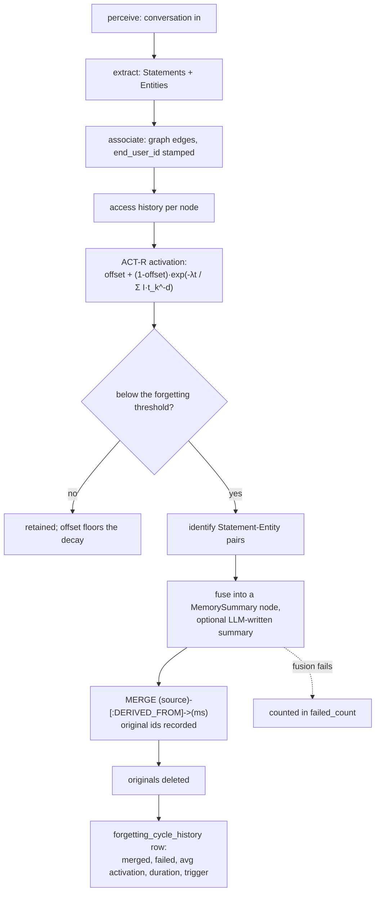

## 1. Executive Summary

MemoryBear is a memory service built on Neo4j and FastAPI with a web console —
"Perceive · Extract · Associate · Forget" — Apache-2.0, roughly 410,000 lines
across an API, a web app and sandbox infrastructure, bilingual in English and
Chinese throughout.

**The mechanism worth the report is what its forgetting does instead of
deleting.**

`forgetting_engine/actr_calculator.py` implements a real ACT-R base-level
activation model, with the formula written out in the header and Anderson (2007)
cited:

```
R(i) = offset + (1-offset) * exp(-λ*t / Σ(I·t_k^(-d)))
```

where `offset` is a "minimum retention rate (prevents complete forgetting)", `I`
is importance, `t_k` is time since the *k*-th access and `d` is a decay constant
around 0.5. Recency and frequency combine into one activation value rather than
being separate ranking terms.

When activation falls below a threshold, `forgetting_strategy.py` does not
delete. It **identifies low-activation Statement–Entity node pairs, fuses them
into a `MemorySummary` node, and wires `DERIVED_FROM` edges from the sources to
the summary** before removing the originals — the module's own list of
responsibilities ends with "保留溯源信息并删除原始节点" (preserve provenance
information and delete the original nodes), and step 4 of the fusion is "溯源保留：
记录原始节点 ID，保持可追溯性" (provenance retention: record the original node ids,
maintain traceability).

So forgetting here is lossy compression with a typed edge back to what was lost,
and the summary keeps `original_statement_id` and `original_entity_id`. A reader
who later asks "what happened to this fact" gets a summary and a pointer rather
than an absence — which is the property most decay-based systems in this atlas
give up.

**And the forgetting cycle audits itself.** `forgetting_cycle_history` records,
per run and per user: `merged_count`, **`failed_count`**,
`average_activation_value`, `total_nodes`, `low_activation_nodes`,
`duration_seconds` and `trigger_type` (`manual` or `scheduled`), indexed on
`(end_user_id, execution_time)`.

`failed_count` is the column to notice. A forgetting pass that records the node
pairs it *could not* fuse is admitting that fusion can fail and making the
failure countable — most background passes in this corpus report what they did
and are silent about what they could not do.

## 2. Mental Model

A conversation is perceived, extracted into **Statements** and **Entities**, and
associated into a Neo4j graph. Every node and every relationship carries
`end_user_id`.

Access history accumulates per node (`access_history_manager.py`), activation is
computed from it, and the scheduler runs cycles that fuse the bottom of the
distribution.



The `offset` term is worth its own sentence. Because activation is floored, a
memory never decays to zero — the curve asymptotes to a minimum retention rate.
Combined with fusion rather than deletion, the design's position is that nothing
is ever entirely gone, only progressively coarser.

## 3. Architecture

Neo4j holds the graph; Postgres holds configuration, cycle history and
operational state; Redis caches. FastAPI serves the API, a React web console
sits over it, and an `e2b-infra` directory plus a `sandbox` directory support
sandboxed execution. Docker Compose is the documented deployment.

The forgetting engine is its own package with nine modules — the ACT-R
calculator, an access-history manager, a memory-strength module, a strategy, a
scheduler, a service and configuration utilities — which is more separation than
most decay implementations here get, and it is why the strategy can be read
independently of the maths.

Configuration is loaded from the database (`load_actr_config_from_db`), so the
decay constant, forgetting rate and threshold are operator-tunable per
deployment rather than compiled in.

## 4. Essential Implementation Paths

**Activation** — `forgetting_engine/actr_calculator.py`, with
`access_history_manager.py` supplying the `t_k` series.

**Cycle** — `memory_forget_service.py` → `ForgettingScheduler` →
`ForgettingStrategy.identify` → fuse → `ForgettingCycleHistoryRepository`.

**Fusion** — `forgetting_strategy.py:355-395`: the Cypher `OPTIONAL MATCH` over
inbound relationships and `MERGE (source)-[:DERIVED_FROM]->(ms)` for both the
statement and the entity side, so edges into the originals are rerouted to the
summary rather than orphaned.

**Scope** — `neo4j_connector.py:219` and `:232`: `MATCH (n) WHERE n.end_user_id
= $end_user_id` for nodes and the matching form for relationships;
`create_indexes.py:348` builds indexes that require the property.

## 5. Memory Data Model

The graph is the model: `Statement` and `Entity` nodes with a `MemorySummary`
tier above them, `DERIVED_FROM` edges recording fusion lineage, and
`end_user_id` on everything.

`forgetting_cycle_history` is the relational side and it is the more interesting
table, described in section 1. Recording `average_activation_value` per cycle
means an operator can watch the distribution move over time — whether the store
is drifting toward everything being cold, which is the failure mode a decay
system needs to detect and almost none instruments.

`trigger_type` distinguishing `manual` from `scheduled` matters for reading that
history: a manually-triggered cycle during a demo and a nightly one produce very
different numbers, and separating them is one column.

## 6. Retrieval Mechanics

Graph traversal plus vector search, with activation available as a ranking
signal, and a "vector version (non-graph)" mode described in the README as
trading some accuracy for latency.

**Scope is enforced and it is enforced everywhere**, which is the correct answer
for a multi-user service on a single graph database: `end_user_id` is a
predicate in the connector's queries, a required property in the index
definitions, and the key of the delete path (`add_nodes.py:16` deletes a user's
entire subgraph with `MATCH (n {end_user_id: ...}) DETACH DELETE n`).

That last line is worth flagging as a hazard as well as a feature: it is an
f-string interpolating `end_user_id` directly into Cypher rather than binding a
parameter, in a function that deletes everything matching. The surrounding calls
bind parameters properly; this one does not.

## 7. Write Mechanics

Extraction is an LLM pipeline behind the API, so writes are not instantaneous
and the graph lags the conversation.

Correction is not a first-class operation. There is no supersession pointer, no
contradiction detection surfaced in the forgetting engine, and no rejected-value
record. What exists is decay plus fusion: a memory that stops being reinforced
becomes part of a summary. A memory that is *wrong* and frequently accessed will
be reinforced and retained, which is the standard weakness of usage-driven
retention and is worth stating plainly for a system whose whole lifecycle is
activation-driven.

## 8. Agent Integration

A FastAPI service with an MCP surface, a web console, a sandbox tier and Docker
Compose. The console is where the forgetting curve and the cycle history are
surfaced — the service layer exposes "遗忘曲线生成" (forgetting-curve generation)
as an API concern, so an operator can see the decay model they configured.

## 9. Reliability, Safety, and Trust

**Scope — awarded**, per section 6, with the interpolation caveat.

**Audit log — awarded, and scoped precisely.** `forgetting_cycle_history` is an
append-only per-run record with counts, an average, a duration and a trigger
type. It audits *the forgetting subsystem*, not every mutation — an edit or an
association does not appear — so it is a background-pass ledger rather than a
full mutation log, and it is a good one.

**Trust state — no.** `importance` feeds activation; nothing records belief.

**Tombstone — no.** The `DERIVED_FROM` edge is lineage, not refusal: the same
statement can be re-extracted and will enter as a new node.

**Bitemporal, human review, negative eval — no** on what was inspected.

**Two cautions.** The Cypher interpolation in the user-delete path noted above.
And the `offset` floor means a memory can never decay out entirely — which is
the design's intent, and it also means an operator who *wants* something gone
must delete rather than wait, and the fusion path is not a deletion path.

## 10. Tests, Evals, and Benchmarks

**Three papers are cited**, which is more than most systems here have: a core
technical report hosted on the project's own site, a multimodal affective
memory engine report ([arXiv:2603.22306](https://arxiv.org/abs/2603.22306)), and
**A-MBER**, an affective memory benchmark
([arXiv:2604.07017](https://arxiv.org/abs/2604.07017)) — which the atlas's own
[benchmarks page](../../benchmarks/) already tracks. Publishing a benchmark
dataset alongside the system it measures is a real contribution and also a
conflict of interest worth naming.

**The benchmark claims cannot be checked from this tree.** The README reports
F1, BLEU-1 and LLM-as-a-Judge scores, states that MemoryBear "consistently
outperforms competing systems including Mem0, Zep, and LangMem across all four
task categories", and gives 72.90 ± 0.19% for the vector version and 75.00 ±
0.20% for the graph version. **Every one of those figures is inside a PNG.**
There is no harness, no result file, no dataset reference and no run
configuration in the repository — the numbers are images with error bars, and an
error bar in an image is not reproducible.

That is a different failure from the three systems in earlier batches whose
benchmarks live in a sibling repository: there, a reader can go and look. Here
there is nowhere to go.

14 test files against 410,000 lines. **I ran nothing.**

## 11. For Your Own Build

### Steal

- **Fuse instead of deleting, and keep the edge.** A `MemorySummary` with
  `DERIVED_FROM` edges from what it replaced, holding the original ids, turns
  forgetting from an absence into a coarser record. "What happened to this fact"
  stays answerable.
- **Reroute inbound edges to the summary.** The `OPTIONAL MATCH` plus `MERGE`
  is what stops fusion orphaning the graph around the nodes it removed.
- **Count what your background pass could *not* do.** `failed_count` beside
  `merged_count` is one column and it is the difference between a pass that
  reports its work and one that reports its success rate.
- **Record the average activation per cycle.** It is how you notice a store
  drifting cold before every memory is a summary.
- **Separate manual from scheduled runs in the history.** Otherwise a demo
  contaminates the trend.
- **Floor the decay curve.** An `offset` term means activation asymptotes to a
  minimum rather than reaching zero, which is a deliberate position on whether
  forgetting should ever be total.
- **Load the decay parameters from the database.** Decay constants are exactly
  the thing an operator needs to tune per deployment without a rebuild.
- **Give the forgetting engine its own package.** Nine modules — calculator,
  history, strength, strategy, scheduler, service, config — means the maths can
  be read separately from the policy.

### Avoid

- **Do not publish benchmark numbers only as images.** Error bars in a PNG
  cannot be checked, reproduced or cited, and a reader has nowhere to look.
- **Do not interpolate an identifier into a `DETACH DELETE` query.** The
  surrounding code binds parameters; `add_nodes.py:16` does not, and it is the
  most destructive statement in the repository.
- **Do not expect usage-driven retention to correct anything.** A wrong memory
  that is frequently retrieved is reinforced by exactly the mechanism that keeps
  a right one.

### Fit

This suits a team wanting a hosted multi-user memory service with a console, a
graph backend and a principled decay model, comfortable with Neo4j plus Postgres
plus Redis and with a codebase whose comments are largely Chinese.

The transferable idea is small and separable: fusion-with-provenance as the
forgetting operation, and a cycle-history table that counts its own failures.
Both are worth lifting into a system with a different decay model entirely.

## 12. Open Questions

- **Where are the benchmark numbers from?** No harness, dataset or result file
  is in the tree, and the three papers are hosted elsewhere.
- **What happens when fusion fails?** `failed_count` is recorded; whether the
  pair is retried next cycle, skipped permanently, or left below threshold
  forever was not traced.
- **Can a `MemorySummary` itself be forgotten?** The strategy fuses
  Statement–Entity pairs; whether summaries participate in later cycles decides
  whether the store converges or accumulates a summary tier.
- **Is the A-MBER benchmark's evaluation of MemoryBear independent?** The
  benchmark and the system share authors, which the reader should know.

## Appendix: File Index

**Activation** — `api/app/core/memory/storage_services/forgetting_engine/actr_calculator.py`
(the formula and the Anderson citation `:1-23`), `access_history_manager.py`,
`memory_strength.py`, `config_utils.py`

**Fusion** — `forgetting_engine/forgetting_strategy.py` (the responsibilities
`:1-12`, provenance retention `:38` and `:191`, the `DERIVED_FROM` rewiring
`:355-395`), `forget_service.py`, `forgetting_engine.py`

**Cycles** — `forgetting_engine/forgetting_scheduler.py`,
`api/app/services/memory_forget_service.py`,
`api/app/models/forgetting_cycle_history_model.py:15-35`,
`api/app/repositories/forgetting_cycle_history_repository.py`

**Scope** — `api/app/repositories/neo4j/neo4j_connector.py:219`, `:232`,
`create_indexes.py:348-364`, `add_nodes.py:16` (the interpolated delete)

**Retrieval** — `api/app/core/memory/src/search.py`

**Service and console** — `api/`, `web/`, `sandbox/`, `e2b-infra/`

**Claims** — `README.md` §Benchmarks (images only), §Papers (three, all hosted
outside the repository)

## History

**2026-08-09** — [`857bb5b4022fec641b0a511b82b0968a761a0d62`](https://github.com/SuanmoSuanyangTechnology/MemoryBear/commit/857bb5b4022fec641b0a511b82b0968a761a0d62) — first reading. Screened before reading; the tree was read, never installed, and no test or benchmark was run.
