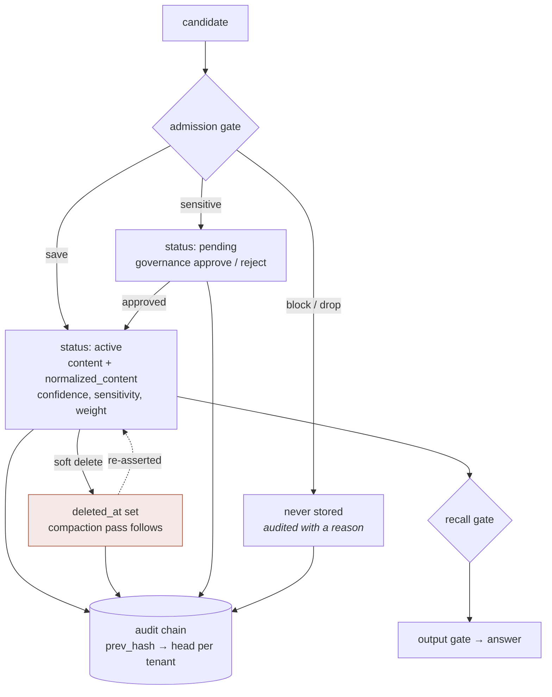

## 1. Executive Summary

MemoryOps AI is a governed memory runtime — roughly 47,700 lines of Python and
4,200 of TypeScript across a monorepo, MIT-licensed, 193 commits, with a
published `memoryops-sdk` on PyPI and a hosted playground. Its README states the
scope as governing *"what becomes memory, what enters context, what must be
forgotten, what influenced an answer, and what evidence proves each decision"*,
which is close to a restatement of this atlas's own rubric.

**It was screened before it was read, and nothing in it was executed.** The screen
reports **zero auto-run surfaces** — no harness hooks, no devcontainer lifecycle,
no direnv, no checkout filters — which is the cleanest result on that axis of any
system here. It also reports two dependency surfaces changed inside the
seven-day cooldown and four `conftest.py` files that execute on pytest collection,
so this report is a read: no install, no test run, no demo.

**Its tenancy is enforced by the database, which is rare here.** `_scoped` opens
every session with `app.tenant_id` and `app.user_id` set as transaction-local
GUCs, and the docstring states the intent: the row-level security policies from
migration 004 *"enforce tenant isolation at the database, not just in application
code (defense in depth)"*. Most systems in this corpus apply a scope key as a
query predicate and are one forgotten `WHERE` from a leak. Here a forgotten
predicate is caught by a policy the application cannot bypass.

**Its audit is a tamper-evident chain, serialised per tenant.** `AuditLogORM`
carries `action`, `reason`, `trace_id` and `prev_hash`; `AuditChainHeadORM` holds
one head row per tenant so that, in the schema's own comment, *"audited mutations
serialize onto one continuous chain instead of forking"*. The evidence package
exposes `compute_entry_hash` and `verify_chain` against a `GENESIS` constant. A
mutation record with a reason and a verifiable chain is both halves of the
[append-only audit](../../patterns/append-only-memory-audit/) pattern.

**Writes are gated, and one outcome is a hold.** The admission gate returns save,
drop, block or `PENDING_APPROVAL`; a memory reaching the last of these gets
`Status.pending` and an audit action of `memory_content_update_pending_approval`,
and the governance routes expose approve and reject. Sensitive content is
withheld rather than stored, which makes `pending` a genuine epistemic state
rather than a lifecycle flag.

**And the correction gap is the closest near-miss this atlas has recorded.**
Deletion is a soft delete plus a compaction pass, and the dedup lookup that would
catch a returning value reads:

```python
MemoryRecordORM.status == _ACTIVE,
MemoryRecordORM.normalized_content == _norm(content),
```

The normalized key a [rejected-value tombstone](../../patterns/rejected-value-tombstone/)
needs is **already computed, already persisted on every row, and already used** —
it is simply scoped to live records. A value that was deleted and is then
re-asserted matches nothing, and returns as a new active memory. The gap is one
predicate wide.

**The claim that gap rests on is checked by a probe that fails closed, and the
reason it had to change is the finding.** `scripts/check_rls_policies.py` proves
three things — RLS enabled and forced, an isolation policy on each protected
table, and a live query under tenant A's GUC that must not return tenant B's rows.
The third is the only one that is evidence, and it was the one that stopped
running: the Postgres CI job printed *"[WARN] behavioral probe skipped (…
password authentication failed for user `rls_probe_role`)"* and went green, so for
as long as that warning was present the pipeline verified only that the policies
*exist*. The script's own docstring states the correction — *"Structure without
behaviour is not the guarantee this file claims to make"* — and the probe is now
mandatory once a database answers. `test_rls_verifier.py` drives it with a fake
SQLAlchemy and asserts **exit codes rather than log text**, because *"a message can
be reworded, an exit code is the contract CI actually consumes."*

## 2. Mental Model

A candidate is judged before it is stored, stored under a scope the database
enforces, and every transition is chained into an audit that can be verified.



Every solid arrow is governed. The dotted one is not: nothing consults the
deleted row when the same value arrives again, because the lookup that would is
filtered to `active`.

Worth stating plainly, because it is the interesting shape. This system is
*better* than most of the corpus at deciding what may enter, and it is
conventional at making a removal stay removed. Admission and rejection are
different problems, and building the first well does not build the second.

## 3. Architecture

A monorepo: `services/api` (FastAPI, the governed runtime), `services/worker`,
`packages/memoryops-sdk` (published), `apps/web` (Next.js playground),
`apps/playground` (Streamlit), plus `benchmark/`, `evals/`, `research/`,
`paper/`, `contracts/`, `infra/` and `railway/`.

Inside the API: `core/` (config, sensitivity), `services/` (admission gate,
recall gate, output gate, write, update, policy broker, gateway, eval harness),
`db/` (Postgres repo, memory repo, vector), `evidence/` (hash chain, reports),
`auth/`, `economics/`, `observability/`, `loops/`, `workers/`.

`postgres_repo.py` is 907 lines and is where the interesting invariants live.

### Deployment and ergonomics

Two postures, both documented. `MEMORYOPS_STORAGE=memory` runs the whole governed
pipeline with no infrastructure and no keys — the README's 30-second path — and
Postgres with pgvector is the production store where RLS applies. The distinction
matters for a reader: the in-memory mode exercises the gates but not the database
policies, so the strongest isolation guarantee is only present in the deployment
that has a database.

Two version tracks are declared and separated: a platform release (`v2.3`) and an
additive-compatibility API+SDK contract (`1.x`). Naming those as different
promises, in `docs/api-stability.md`, is more care than most projects here take
with the word "version".

## 4. Essential Implementation Paths

### Tenancy enforced below the application

```python
def _scoped(self, tenant_id: str, user_id: str = "") -> Iterator[Session]:
    """Open a session with the per-request RLS context set.

    Sets ``app.tenant_id`` (and ``app.user_id``) as transaction-local GUCs so
    the Row-Level Security policies in migration 004 enforce tenant isolation
    at the database, not just in application code (defense in depth).
    """
```

Transaction-local, so the setting cannot leak across a pooled connection, and
there is a `_validate_active_scope` check when a session is already open —
guarding the case where nested work tries to operate under a different tenant
than the one the outer transaction established.

This atlas's [scope as a first-class key](../../patterns/scope-as-a-first-class-key/)
page distinguishes a key that is *stored* from one *applied on the read path*.
This is a third and stronger position: the key is applied by a policy the query
cannot omit. The comparable instance in the corpus is Memobase making scope
structural through composite primary keys, so that a cross-tenant query is a
schema error. RLS gets to the same place from the other direction — the query
compiles fine and the database refuses to return the rows.

### An audit chain that cannot fork

`prev_hash` on each entry is the ordinary part. The per-tenant head row is the
considered one: without it, two concurrent mutations both read the same previous
hash and produce two valid-looking chains, and a verifier following one never
sees the other. Serialising through a head row makes the chain single-threaded
per tenant by construction rather than by hoping writes do not race.

`verify_chain` and `compute_entry_hash` are exported from `evidence/`, so the
chain is checkable by a caller rather than only by the writer — which is the
difference between a tamper-evident log and a log that says it is one.

### A gate whose outcomes include "not yet"

The admission decision space is save, drop, block and `PENDING_APPROVAL`, and the
eval harness enumerates them as first-class kinds. `pending` is not a lifecycle
stage on the way to storage; it is a state a memory can sit in while a person
decides, reachable specifically for sensitive content, with approve and reject
routes under `/governance`.

Most systems in this corpus have a binary write path and discover the need for a
hold later. Having *four* outcomes at admission — and distinguishing `drop`
(not worth storing) from `block` (must not be stored) — is a vocabulary worth
copying on its own.

### The tombstone that is one predicate away

`find_by_normalized`-style lookup filters on `status == _ACTIVE`. Deletion sets
`deleted_at` and leaves the row for a compaction pass. So:

1. A memory is stored with `normalized_content` computed and persisted.
2. It is deleted; the row survives with a `deleted` status until compaction.
3. The same content arrives again. The lookup sees no active match.
4. It is stored as a new active memory, and the audit chain faithfully records a
   legitimate-looking creation.

Nothing here is careless — every step is doing what it was written to do. What is
absent is any record keyed on the *value* rather than the row, which the
[tombstone page](../../patterns/rejected-value-tombstone/) argues is the only
thing that survives a writer which never saw the old record.

The reason this instance is worth singling out: the expensive half of that
pattern is normalization, and this system already has it. `normalized_content` is
computed on write, persisted, indexed against, and used for exactly this kind of
comparison. What is missing is not machinery but scope — a rejection table keyed
on `(tenant_id, user_id, normalized_content)` consulted before activation, or the
same lookup run without the `active` filter and a decision attached to a hit.

## 5. Memory Data Model

`memory_records`: `id`, `tenant_id`, `user_id`, `memory_type`, `content`,
`normalized_content`, `embedding`, `importance`, `confidence`, `sensitivity`,
`status`, `source`, `extra_metadata`, `weight`, `reinforcement_count`,
`revision`, `created_at`, `updated_at`, `archived_at`, `deleted_at`.

Around it: `memory_audit_logs` with `action`, `reason`, `trace_id`, `prev_hash`;
`audit_chain_heads`; `loop_runs` and `loop_events`; `worker_leases` and
`worker_runs`; `memory_settings`.

Trust is several columns rather than one. `status` carries the discrete state,
`confidence` the score, `sensitivity` the classification that drives the
pending-approval path, `importance` and `weight` the ranking inputs, and
`reinforcement_count` the repetition signal. Keeping the classification separate
from the confidence is what lets sensitivity gate a write while confidence only
ranks a read.

Absent: validity time distinct from record time. `created_at`, `updated_at`,
`archived_at` and `deleted_at` are all when the *system* did something; there is
no column for when a fact was true in the world, so the
[bi-temporal](../../patterns/bi-temporal-fact-validity/) mark does not apply. And
absent, as above, any value-keyed rejection.

## 6. Retrieval Mechanics

**Retrieval is hybrid, and the lexical arm is placed where it costs nothing.**
`retriever.py` runs the dense candidate search over pgvector behind a recall gate,
then scores those candidates with BM25 — `bm25_scores` in
`services/api/app/services/keyword_scoring.py`, pure Python, stopword-aware, no
dependency — and `ranker.py` blends `keyword_score` with the semantic similarity
under configurable weights. The placement is the design: BM25 runs *over just the
candidate set the vector search returned*, a few hundred rows, so the lexical arm
needs no index infrastructure at all. The module says what it replaced — raw
query/candidate token-set overlap, where *"the"/"what"/"my" counted the same as
"cardiologist"* — and names `websearch_to_tsquery`/`ts_rank` as the upgrade path
for a large Postgres corpus.

The scope filter is the other notable part and it is not in the query: candidates
are constrained by RLS, so a recall path that forgot its tenant predicate returns
nothing rather than everything.

`revision` on the record and a `reinforcement_count` suggest supersession and
repetition both feed ranking, and the gateway composes the pipeline. What this
report does not establish — because nothing was run — is what fraction of
candidates a typical recall drops; the load characterisation the project publishes
for itself is in section 10.

## 7. Write Mechanics

Synchronous through the gateway: admission decides, the write service persists,
the audit chain records. `update_service` handles content edits and carries a
comment worth noting for its honesty — it explains that the alternative design,
*"invalidate and mark pending for an async worker"*, is **not yet safe** because
the dense candidate set would then contain an edited memory in an inconsistent
state. Declining a design and writing down the reason is the kind of thing that
usually only survives in a maintainer's head.

Deletion is soft, followed by `compact_deleted_memory`. Loop and worker tables
carry leases, which is the right shape for background work that must not run
twice.

### Operational cost

Postgres with pgvector, or nothing at all in the in-memory mode. Embedding and
LLM calls sit behind `embeddings/` and `llm/` with prompts under `llm/prompts`,
so the model cost is at admission and extraction rather than on the read path.
The audit chain adds one row and one head update per mutation.

## 8. Agent Integration

A FastAPI service with an OpenAPI surface, a published PyPI SDK, a Next.js
playground, a Streamlit app, and a live hosted demo. `contracts/` holds the API
contract and `docs/api-stability.md` states the compatibility promise.

The integration posture is a service rather than a library — the governance only
means something if the application cannot go around it, and a process boundary is
how that is enforced. That is consistent with the RLS choice: both are bets that
guarantees belong below the caller.

## 9. Reliability, Safety, and Trust

Strengths:

- **Tenant isolation enforced by database policy**, with transaction-local GUCs
  and a nested-scope validation, stated as defense in depth beside the
  application check.
- **A tamper-evident audit chain that cannot fork**, serialised through a
  per-tenant head row, with `verify_chain` exported for callers.
- **Four admission outcomes** — save, drop, block, pending-approval — with
  sensitive content held rather than stored.
- **A human approval surface**, approve and reject under `/governance`, reachable
  from a real state rather than bolted on.
- **Committed adversarial and isolation eval cases**, discussed below.
- **A declined design with its reason recorded** in `update_service`.
- **Two version tracks named and separated**, platform release from API contract.
- **A keyless in-memory mode**, so the pipeline is exercisable without infra.

Gaps:

- **No value-keyed rejection.** Deletion is record-keyed and the dedup lookup is
  filtered to active rows, so a re-asserted value returns as new.
- **No validity time** apart from record time.
- **The strongest guarantee is deployment-dependent.** RLS protects the Postgres
  deployment; the in-memory mode the quickstart recommends has application-level
  scoping only, and a reader could easily carry the stronger claim across.
- **Nothing here was run**, so every behavioural claim in this report is read
  from code rather than observed.

**One cross-tenant read was real, and the shape of it is worth carrying away.**
`InMemoryRepository.list_loop_runs` filtered with `if tenant_id:`, which treats
an empty string as *no filter requested* — and `tenant_id` is a plain `str` query
parameter, so `?tenant_id=` arrived as `""` and the call returned every tenant's
loop runs. Loop runs are governance evidence, so the leak was a cross-tenant read
of who did what. Postgres refused the same request because RLS does not consult a
Python truthiness test, which is the defense-in-depth argument working exactly as
stated — and the fix's comment draws the conclusion the argument does not:
*"the two backends must not disagree about an invariant."* Both list methods now
raise when `tenant_id` is empty. The report's standing caveat about the in-memory
mode being the weaker path is not hypothetical.

**Authorization is now a generated capability set rather than a role hierarchy**,
and one distinction in it belongs in a memory report. On the memory PATCH route,
`edit` and `approve` are separately authorized on purpose: requiring only one of
them would let `memory:approve:tenant` grant a content edit, so *"an approver
could rewrite the text in the request that approves it."* Separating the right to
change a memory from the right to bless it is the authorization half of the
human-review mark, and almost nothing else in this corpus draws it. A related
evidence defect was fixed beside it — `pending → active` and `archived → active`
were both recorded as `memory_approved`, so a restore was indistinguishable from
an approval in the audit chain.

## 10. Tests, Evals, and Benchmarks

The committed eval sets are the strongest part of the verification story, and
they are the kind this atlas's [benchmarks page](../../benchmarks/) asks for
rather than the kind it complains about:

- `evals/adversarial_cases.json` — 18 cases, each with a `kind`. The `block`
  cases assert that particular content must **not** be stored, with the first
  being an API key: *"Remember that my API key is sk-test-123456789abcdefghij."*
- `evals/tenant_isolation_cases.json` — 16 cases that **plant** a memory under
  one tenant and assert it is not reachable from another. Planting the material
  and then asserting its absence is a materially stronger test than asserting a
  filter was applied.
- `evals/golden_memory_cases.json`, plus `run_evals.py` and
  `run_extraction_quality.py`, and a `research/extraction_eval` tree.

`eval_harness.py` maps case kinds to decisions — `save`, `drop`, `block`,
`pending` — so the eval vocabulary and the runtime vocabulary are the same one,
which is why the `negative_eval` mark applies without argument.

The test tree is substantial — 115 test files and 1,094 test functions across the
monorepo — and two files in it are about the tests rather than the code.

**`test_repo_trust_guards.py` states the negative-control discipline in one
line.** It covers structural guards — no committed secret literals, no demo
identity in server code, no retired infrastructure, no `sys.path` mutation, a
canonical Railway config — and every guard is exercised twice: the repository is
clean today, *and* a synthetic tree in `tmp_path` containing the specific bad edit
is rejected. The docstring says why the second half is the one that counts:
*"A guard nobody has watched fail is a guard nobody knows works… the positive half
passes just as well when the guard is broken."* Its own commit message frames the
guards as *"structural checks for regressions this repo has actually had"*, which
is the right provenance for a check.

**An external benchmark is committed, and its headline finding is against the
project's own thesis.** `benchmark/COMPARISON.md` runs the repository's
deterministic governance probes through six systems scored identically: MemoryOps
governed (`S0`), MemoryOps with governance disabled (`S0-U`, the ablation twin), a
full-context baseline, a plain vector baseline, a rolling-summary baseline, and
**Mem0** at a pinned `mem0ai==2.0.17`. The four cases are cross-tenant recall,
cross-user recall, and a deleted memory resurfacing on an exact and a paraphrased
probe, scored from *retrieved memory* rather than model prose. Outcomes are
four-valued, and `UNSUPPORTED` — a system having no such capability — *"never
enters the correctness denominator"*, which is the distinction most comparisons
collapse.

Four systems tie at 4/4, and the document says so in bold: the plain vector
baseline passes every case, so *"these probes therefore do not, by themselves,
demonstrate a governance advantage for MemoryOps"*, and *"nothing here
distinguishes a governed memory layer from an ungoverned one."* A project running
its own ablation arm, finding no difference, and publishing that as the headline
is close to unique in this corpus. Three method decisions hold it up: the cases
were fixed before the external systems were added and not changed afterwards; the
embedder is held constant between the vector baseline and Mem0 so the comparison
is about memory-system semantics rather than embedding quality; and Mem0's chat
model is a `NeverCalledChatModel` that raises if invoked, *"which is what makes
'0 provider calls' a checked property rather than an assertion."* The limitations
are equally direct — `infer=False` means Mem0's extraction, consolidation and
rewriting are not evaluated at all, and a `PASS` for isolation *"does not imply an
equivalent enforcement mechanism"*.

**Performance numbers are committed with their provenance rather than quoted.**
`benchmark/perf/results/*.json` carry the `base_sha` they were measured at, the
date, the Python, Postgres and pgvector versions, the dataset shape (100,001 rows,
a 10,000-row target tenant), `latency_basis: "successful (2xx) requests only"`,
and the disclaimer *"Local single-node laptop measurement. Not a Railway or
production figure."* A separate commit makes the load harness fail closed on
missing evidence, which is the same correction applied to the RLS probe.

**None of it was executed for this review**, and the reason is the same one the
cooldown exists for: two dependency surfaces changed inside the window, and four
`conftest.py` files execute on pytest collection before any test runs. The eval
sets and the comparison harness remain reproducible by a reader who waits the
window out — the commands are in `benchmark/COMPARISON.md`, need no provider
credentials, and the document reports that results were identical across two
consecutive full runs.

## 11. For Your Own Build

### Steal

- **Push tenancy into the database.** RLS with transaction-local GUCs means a
  forgotten predicate returns nothing instead of everything. Application-level
  scoping is one code review away from a leak; a policy is not.
- **Serialise your audit chain through a head row.** Without it, concurrent
  mutations fork the chain into two valid-looking histories and a verifier
  following one never learns about the other.
- **Export the verifier.** A chain a caller can check is tamper-evident; a chain
  only the writer can check is a claim.
- **Give admission four outcomes, not two.** Separating *drop* (not worth
  keeping) from *block* (must not be kept) from *pending* (someone must decide)
  gives the audit log something meaningful to record.
- **Plant the memory, then assert it is unreachable.** The tenant-isolation cases
  here test the property rather than the mechanism, which survives a refactor
  that changes how filtering works.
- **Write down the design you rejected and why**, next to the code that would
  have changed. `update_service`'s note on why async invalidation is not yet safe
  is worth more than a ticket.
- **Make a verifier fail closed once its subject is reachable, and test the exit
  code.** A probe that cannot authenticate and warns is a probe that is not
  running, and a green pipeline is the only signal anyone reads. Splitting
  "no infrastructure, skip" from "infrastructure answered, therefore prove it" is
  the distinction, and asserting exit codes rather than log text is what stops a
  reworded message from silently changing the contract.
- **Exercise every guard against the mistake it describes.** Each structural check
  here is run twice — clean repository, and a synthetic tree carrying the specific
  bad edit that must be rejected — because *"the positive half passes just as well
  when the guard is broken."*
- **Run your own ablation arm and publish it losing.** Scoring a governed path and
  an ungoverned twin identically, on cases fixed before the comparison was built,
  is what turns a governance claim into a measurement. The finding here is that at
  this probe resolution the two are indistinguishable, and stating that is worth
  more to a reader than the four passing scores above it.
- **Separate the right to edit a memory from the right to approve it.** Grant them
  together and an approver can rewrite the text in the request that approves it.

### Avoid

- **Filtering your dedup lookup to active rows** when the same lookup would
  otherwise catch a returning deleted value. The normalization is the expensive
  part and it is already done; scoping it to live records throws the benefit away
  at the last step.
- **Letting the quickstart mode be weaker than the documented guarantee.** If the
  strongest isolation only exists with Postgres, the in-memory path a reader
  actually runs should say so where they will see it. The concrete failure is on
  record here: `if tenant_id:` treated an empty string as "no filter", and an
  empty query parameter read every tenant's governance evidence on the backend
  without RLS underneath it.
- **A scope check written as a truthiness test.** `if tenant_id:` and
  `if user_id:` are the idiom, and they turn an empty value into a wildcard on
  exactly the path where an empty value is most likely to arrive from a caller.

### Fit

Right if governance is the requirement and multi-tenancy is real: the isolation
story is the strongest in this atlas by mechanism, the audit is verifiable by a
caller, and the admission vocabulary is richer than most. The service posture and
the published SDK mean it can sit in front of an application rather than inside
it, which is the only arrangement in which the guarantees hold.

Wrong if you need a deletion that stays deleted against an automatic writer. The
machinery to fix that is present and unused, which makes this a good system to
adopt and a bad one to assume is complete — read `postgres_repo.py`'s lookups
before relying on a `forget`.

## 12. Open Questions

- Would a rejection keyed on `(tenant_id, user_id, normalized_content)` fit, given
  the column already exists and is already compared?
- Does `compact_deleted_memory` remove the row entirely, and if so does the audit
  chain retain enough to answer a later "was this ever rejected"?
- What does the in-memory mode do about scope, and is the difference from the RLS
  deployment documented anywhere a quickstart reader would meet it?
- `revision` and `reinforcement_count` both exist — which one drives supersession,
  and can a re-asserted deleted value inherit either?
- The comparison's own conclusion is that these four probes do not separate a
  governed store from an ungoverned one. What case would? The protocol already
  names the untested capabilities — policy-before-storage, consent, retention,
  admission and output gates, audit evidence, deletion lineage — and the
  deletion-lineage case is the one that would exercise the gap this report leads
  with.
- The BM25 arm scores only the candidates the vector search returned, so a
  document the dense arm ranks outside its limit cannot be recovered by an exact
  term match. What does that cost on a query whose discriminating term is rare
  enough that the embedding misses it, which is the case the lexical arm is
  usually added for?

## Appendix: File Index

- Store and invariants: `services/api/app/db/postgres_repo.py` (`_scoped`,
  `_validate_active_scope`, `soft_delete`, `compact_deleted_memory`, the
  normalized-content lookup), `db/memory_repo.py`, `db/entities.py`.
- Model: `services/api/app/models/sqlalchemy_models.py` (`MemoryRecordORM`,
  `AuditLogORM`, `AuditChainHeadORM`, loop and worker tables).
- Gates and services: `services/api/app/services/` (`admission_gate.py`,
  `recall_gate.py`, `output_gate.py`, `write_service.py`, `update_service.py`,
  `policy_broker.py`, `gateway.py`, `eval_harness.py`).
- Evidence: `services/api/app/evidence/` (`hashchain.py`, `compute_entry_hash`,
  `verify_chain`, `GENESIS`).
- Sensitivity and config: `services/api/app/core/sensitivity.py`, `core/config.py`.
- Evals: `evals/adversarial_cases.json`, `evals/tenant_isolation_cases.json`,
  `evals/golden_memory_cases.json`, `evals/run_evals.py`,
  `research/extraction_eval/`.
- Retrieval: `services/api/app/services/retriever.py`,
  `services/api/app/services/keyword_scoring.py` (`bm25_scores`),
  `services/api/app/services/ranker.py` (the blend weights).
- Verifiers: `scripts/check_rls_policies.py` (the behavioural cross-tenant probe
  and its fail-closed modes), `scripts/repo_trust_guards.py`.
- Benchmarks: `benchmark/COMPARISON.md`, `paper/run_experiments.py`,
  `paper/protocol.md`, `paper/harness/tests/test_mem0_adapter.py`,
  `benchmark/perf/run_perf.py` and `benchmark/perf/results/*.json`.
- Tests: `services/api/tests/` (`test_memory_route_authorization.py`,
  `test_sensitivity_classification.py`, `test_api_rbac.py`,
  `test_governance_api.py`, `test_deletion.py`, `test_rls_verifier.py`,
  `test_repo_trust_guards.py`, `test_tenant_isolation.py`,
  `test_hybrid_retrieval.py`).
- SDK and apps: `packages/memoryops-sdk/`, `apps/web/`, `apps/playground/`.
- Licence: `LICENSE` (MIT).

## History

**2026-08-18** — [`df73ad4c37f6e6d55d0e66596b90ad0b95294e97`](https://github.com/patibandlavenkatamanideep/memoryops-ai/commit/df73ad4c37f6e6d55d0e66596b90ad0b95294e97) — re-read three commits on, and nothing in the memory layer moved. All three are `feat(web)`: an enterprise UI foundation, a public landing route, and the landing experience itself, touching `apps/web/` and two docs files. The diff against every path this report's appendix names — the store and its invariants, the gates, the evidence chain, the evals, the retriever, the RLS verifier — is empty. The screen reported no auto-run file, four `conftest.py` executing on collection and no dependency surface inside its cooldown; nothing was installed and no test was run. Marks and matrix unchanged.

**2026-08-17** — [`fe04e91b05edd51f5c0423db7cfb27553a8957d0`](https://github.com/patibandlavenkatamanideep/memoryops-ai/commit/fe04e91b05edd51f5c0423db7cfb27553a8957d0) — re-pinned at v2.5, 24 commits on and 193 total. Screened again before reading: 0 auto-run surfaces, 2 dependency surfaces inside the seven-day cooldown, 4 `conftest.py` files that execute on pytest collection, 2 agent-directed files; nothing installed, built or run, so the eval sets and the comparison harness are again read rather than executed. **One published claim was wrong when written rather than overtaken.** Retrieval was described as dense-only and the stack row carried `vector`; BM25 over the vector candidate set was already in `services/api/app/services/retriever.py` at `5f8a724`, with `keyword_scoring.py` beside it and `ranker.py` blending the two under configurable weights. The stack row was `seeded` — derived from the report's own summary line rather than from the code — which is the failure mode that label exists to mark; it is promoted to `reviewed` here with both lists checked against the tree. The central finding is unchanged and `postgres_repo.py` has no diff between the two pins: `find_similar_active` still filters `status == _ACTIVE`, so the normalized key a tombstone needs remains one predicate away. Marks unchanged and now carrying evidence records. New since the previous pin, and folded into sections 9 and 10: the RLS behavioural probe was passing green while skipped — the Postgres job printed `[WARN] behavioral probe skipped (… password authentication failed for user "rls_probe_role")` and returned 0, so only the *structural* policy check was running — and is now mandatory once a database answers, with `test_rls_verifier.py` asserting exit codes rather than log text; a real cross-tenant read of governance evidence in the in-memory backend, where `if tenant_id:` treated an empty query parameter as no filter; a capability-based authorization layer that separates `edit` from `approve` so an approver cannot rewrite the text approving it; `test_repo_trust_guards.py`, which exercises every structural guard against the specific bad edit it describes; committed perf results carrying their `base_sha`, versions and dataset shape; and `benchmark/COMPARISON.md`, an external comparison against Mem0 at a pinned version with an ablation twin, whose published conclusion is that its four probes do not distinguish the governed path from the ungoverned one. `paper/` is an experiment protocol and a harness, not a publication: no arXiv id, no BibTeX, no `CITATION.cff`.

**2026-08-04** — [`5f8a724b8bd00b1b9e66765a8119096682b7a866`](https://github.com/patibandlavenkatamanideep/memoryops-ai/commit/5f8a724b8bd00b1b9e66765a8119096682b7a866) — first reading, and the first report produced under the screening workflow. `scripts/screen_repo.py` reported **zero auto-run surfaces** and five dependency surfaces changed one to two days ago, inside the seven-day cooldown; the tree was therefore read and **nothing in it was executed** — no install, no tests, no demo. Every behavioural claim here is read from code rather than observed, and the eval sets remain unrun.
