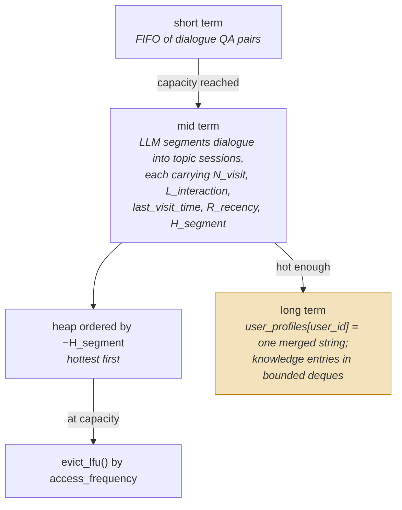

## 1. Executive Summary

MemoryOS is an Apache-2.0 research system from BAI-LAB — about 2,100 lines in
the core `memoryos-pypi` package, plus an MCP server, a ChromaDB variant, a
playground and an evaluation tree. It implements the shape most people picture
when they hear "agent memory": short-term, mid-term and long-term tiers with
material promoted upward as it proves itself.

The promotion signal is explicit, which is rarer than it should be:

```python
HEAT_ALPHA = 1.0
HEAT_BETA = 1.0
HEAT_GAMMA = 1
RECENCY_TAU_HOURS = 24

def compute_segment_heat(session, alpha, beta, gamma, tau_hours):
    ...
    return alpha * N_visit + beta * L_interaction + gamma * R_recency
```

Mid-term memory holds topic-segmented sessions in a heap ordered by that heat,
and hot segments feed profile and knowledge updates in long-term memory. Writing
the promotion rule down as a formula with named coefficients is the right
instinct — [Generative Agents](../generative-agents/) did the same thing and the
atlas has been comparing systems to it ever since.

Two things about that formula are worth a builder's attention, and both are
instructive rather than fatal.

**It sums three different kinds of thing.** `N_visit` is reinforcement — how
often this was retrieved. `L_interaction` is interaction length. `R_recency` is
time decay. Adding them with weights of 1, 1 and 1 means a long conversation
scores like a frequently-revisited one, so **verbosity is indistinguishable from
importance**. The comment says the constants "can be tuned or made configurable";
nothing in the repository ablates them, and the paper this repository
accompanies — [arXiv:2506.06326](https://arxiv.org/abs/2506.06326), *Memory OS
of AI Agent* — settles it from the other side. It prints the same formula and
states that "the values of α, β, and γ in Eq. 4 are equality set to 1", and its
one ablation removes **modules** — mid-term memory, the long-term persona
module, the dialogue page chain — never the three weights. The coefficients are
not an implementation shortcut that the research tuned elsewhere; they are 1, 1
and 1 in both places.

**And the third term is not a signal.** `R_recency` is
`exp(-Δhours / tau_hours)` over the gap between `last_visit_time` and now — but
three of the four live calls to `compute_segment_heat` set `last_visit_time` to
the current timestamp on the line immediately before, so the gap is zero and the
decay is `exp(0) = 1.0` every time:

```python
session["N_visit"] += 1
session["last_visit_time"] = current_time_str
session["access_count_lfu"] = session.get("access_count_lfu", 0) + 1
self.access_frequency[session_id] = session["access_count_lfu"]
session["H_segment"] = compute_segment_heat(session)   # decays from now to now
```

That is `mid_term.py:345-350`, the retrieval-hit path. Session creation
(`:170`) sets `last_visit_time` to the creation timestamp and computes heat in
the same breath; insertion (`:273`) calls `get_timestamp()` on the preceding
line. The **only** site where the stored timestamp is still older than now is
`memoryos.py:214`, after a segment has been analysed — and its own neighbouring
comment says *"Recency will re-calculate naturally"*, which is precisely what the
other three prevent. The periodic refresh that would re-decay stored heat is
present and commented out: `rebuild_heap` carries
`# session_data["H_segment"] = compute_segment_heat(session_data)` above the line
that rebuilds the heap from whatever heat was last stored.

So with γ = 1, recency adds a constant 1.0 to every segment's heat and cannot
change any ordering. The formula the paper prints has three terms; the code has
two and an offset. This strengthens the criticism above rather than replacing it:
the weights are untuned *and* the term whose weight would matter most is inert.

**The LoCoMo harness does not use the shipped formula.** `eval/` carries its own
copy of `compute_segment_heat` with different defaults —
`alpha=0.8, beta=0.8, gamma=0.0001` against the library's `1.0, 1.0, 1` — and
its own `compute_time_decay` whose `tau` is 3600 in units of *seconds* against
the library's 24 in *hours*. Its recency is 1.0 for the same reason
(`eval/mid_term_memory.py:237-238` sets `last_visit_time` then measures from it),
and at γ = 0.0001 the term contributes one ten-thousandth of a constant. The
harness also constructs short-term memory with `max_capacity=1`
(`main_loco_parse.py:233`) where the library defaults to 10, so every pair is
promoted immediately. The committed benchmark is therefore evidence about a
configuration that is not the one the package installs, which is worth knowing
before reading the numbers as a property of the system.

**There are two access counters.** Heat consumes `N_visit`, while capacity
eviction runs a separate LFU path over `self.access_frequency` and
`access_count_lfu`. So the score that decides *what is hot* and the counter that
decides *what gets deleted* are different numbers maintained separately — a
segment can be hot by one and evicted by the other.

The evaluation tree is the part most systems in this atlas lack: `eval/` contains
`evalution_loco.py`, `locomo10.json`, and per-tier evaluation scripts. The
dataset is committed next to the harness.

Reservations. There is no trust state, no provenance, no correction path, and no
scope beyond `user_id` / `assistant_id`. The long-term profile is a merged
string. This is a research implementation of a memory architecture, not an
operational memory layer, and it reads as one.

> **Not to be confused with [MemOS](../memos/)**, a separate system by MemTensor
> also reviewed here. Different projects, different authors, similar names.

## 2. Mental Model



Promotion is driven by heat, and the destination is the problem: a user's profile
is **one merged string**, so everything that gets hot enough is folded into a blob
with no per-fact identity left to correct.

How a memory dies: it is evicted by LFU when mid-term is full, or falls off the
end of a bounded deque in long term, or is overwritten when a profile is merged.
There is no supersession, no rejection, and nothing records that any of those
happened.

## 3. Architecture

`memoryos-pypi/` — `memoryos.py` (395), `mid_term.py` (393), `utils.py` (385),
`updater.py` (238), `prompts.py` (232), `long_term.py` (172), `retriever.py` (130),
`short_term.py`. Alongside: `memoryos-mcp/` with an MCP server,
`memoryos-chromadb/` as a vector-store variant, `memoryos-playground/`, and
`eval/`.

### Deployment and ergonomics

`pip install`, an OpenAI-compatible client, and JSON files on disk — the default
path needs no database. The ChromaDB variant swaps the store. Embeddings default
to `all-MiniLM-L6-v2` locally, so the vector path does not require a hosted
service, though segmentation and profile updates do call an LLM.

That makes it one of the easier systems here to stand up, and the JSON store is
inspectable by hand, which matters for a research artifact people are meant to
read.

## 4. Essential Implementation Paths

### Heat as a promotion signal

The idea is sound and worth separating from its implementation. Most systems in
this atlas promote on a threshold nobody wrote down — a summarizer runs every N
turns, or a fact becomes durable because an LLM decided so. MemoryOS names the
quantity, exposes the coefficients, and keeps the heap ordered by it, so the
question "why did this get promoted" has an answer you can compute.

The [decay and reinforcement](../../patterns/decay-and-reinforcement/) pattern
asks for exactly that, and then warns about the two things this implementation
does. Reinforcement (`N_visit`) feeds a score that governs future reachability,
which is a self-amplifying loop with no damper. And a single scalar mixes signals
that answer different questions: how often was this used, how much was said, and
how long ago. A segment can be hot for three unrelated reasons and the score
cannot say which.

`L_interaction` is the one to think hardest about before copying. Length is a
cheap proxy for engagement and a poor proxy for value — a rambling exchange
outranks a short decisive one, and long-term memory is built from what wins.

### Two counters for one concept

```python
self.access_frequency = defaultdict(int)   # for LFU eviction
self.heap = []                             # (-H_segment, session_id)
...
"access_count_lfu": 0
```

`N_visit` inside the heat formula and `access_frequency` outside it both track
"how often has this been used", separately.

This is worth naming because it is a common shape rather than an unusual bug:
retention and ranking get built at different times, each grows its own counter,
and the two drift. The consequence is that a segment can sit high in the heap and
still be selected for eviction, which is the opposite of what either mechanism
intends. One counter, consumed by both, would be strictly simpler and would make
the eviction policy explicable in the same terms as the promotion policy.

### The long-term profile is a merged string

`update_user_profile(user_id, new_data, merge=True)` concatenates or rewrites a
single profile string per user, and `get_raw_user_profile` returns `"None"` — the
string — when absent.

This is the [core memory as a junk drawer](../../compare/#core-memory-as-a-junk-drawer) risk the atlas names:
a single unstructured blob that everything writes into, with no per-fact
identity, so nothing can be individually corrected, sourced, or deleted. Asking
"where did the system get that idea about me" has no answer, because the profile
has no parts.

Knowledge entries are better — discrete entries in bounded `deque`s — though the
bound means an entry can fall off the end silently, and nothing records that it
did.

### A committed evaluation with its dataset

`eval/` holds `evalution_loco.py`, `main_loco_parse.py`, `retrieval_and_answer.py`,
per-tier scripts, and **`locomo10.json` itself**.

Shipping the dataset next to the harness is better practice than most of this
atlas manages. The [benchmarks page](../../benchmarks/) records repeated instances
of published figures with no reproducible path; here the path is present. No
scored result artifacts were located, so the gap that remains is the smaller one:
a harness and its data, without a committed run.

## 5. Memory Data Model

Short-term: dialogue pairs. Mid-term: a session object carrying the QA pairs of a
topic segment plus `N_visit`, `L_interaction`, `last_visit_time`, `R_recency`,
`H_segment`, `access_count_lfu`. Long-term: a profile string per user, and
knowledge deques.

What is absent, and it is most of the atlas's rubric:

- **No trust state, no provenance, no actor.** A memory does not know where it
  came from.
- **No supersession or tombstone.** Correction means the next profile merge
  writing something different, with the old text gone.
- **No scope** beyond `user_id` / `assistant_id` — no project, no session
  isolation for shared deployments.
- **No audit.** Eviction, promotion and profile rewrites leave no record.

## 6. Retrieval Mechanics

Per-tier embedding similarity via `retriever.py`, with mid-term segments ordered
by heat and a `topic_similarity_threshold` (default 0.5) controlling segmentation
and matching. `all-MiniLM-L6-v2` by default.

There is no lexical arm, so exact identifiers and rare tokens depend entirely on
the embedding — the failure the [hybrid retrieval fusion](../../patterns/hybrid-retrieval-fusion/)
pattern exists to prevent.

## 7. Write Mechanics

Dialogue pairs land in short-term memory. On overflow they are segmented by topic
into mid-term sessions using an LLM. Heat is recomputed on visit, and hot
segments drive profile and knowledge updates in long-term memory.

### Operational cost

The capture path is cheap — appending a QA pair costs nothing — but the promotion
path is not: segmentation and profile updates are LLM calls triggered by
overflow and heat, so cost scales with conversation volume rather than with a
schedule. Retrieval is local embeddings, so read latency is low and does not
depend on a provider.

There is a lag between an exchange happening and being retrievable in a promoted
form, bounded by the short-term capacity rather than by time, and nothing
measures it.

## 8. Agent Integration

A PyPI package with a direct Python API, an MCP server (`memoryos-mcp`), a
ChromaDB-backed variant, and a playground. `user_id` and `assistant_id` are the
addressing.

## 9. Reliability, Safety, and Trust

Strengths:

- **A written promotion rule** with named coefficients rather than an implicit
  threshold.
- **A committed LoCoMo harness with its dataset**, plus per-tier evaluation
  scripts.
- **Local embeddings by default**, so retrieval needs no hosted service.
- **An inspectable JSON store**, appropriate for a research artifact.
- **Multiple surfaces** — package, MCP, vector variant, playground — from a small
  core.

Gaps:

- **Heat sums three unlike signals** with weights of 1, 1 and 1, ablated in neither
  the repository nor the paper.
- **`L_interaction` rewards verbosity**, and long-term memory is built from what
  scores highest.
- **Two access counters** that can disagree about the same segment.
- **Reinforcement with no damper**, so retrieval makes future retrieval likelier.
- **A single merged profile string**, with no per-fact identity or correction.
- **No trust state, provenance, scope, audit, or tombstone.**
- **Vector-only retrieval.**
- **Silent loss** through LFU eviction and bounded deques.

## 10. Tests, Evals, and Benchmarks

`test.py` in the package, `test_simple.py` in the MCP server, and the `eval/`
tree with the LoCoMo dataset committed. Nothing was run for this review and no
scored artifacts were found.

The measurement this design most needs is the one its own constants invite: does
`alpha * N_visit + beta * L_interaction + gamma * R_recency` beat any of its
three terms alone? The code is parameterized for that ablation and the harness
exists to run it.

## 11. For Your Own Build

### Steal

- **Write the promotion rule down as a formula with named coefficients.** It
  turns "why is this in long-term memory" from a guess into a computation, and it
  makes the ablation possible even if nobody runs it.
- **Ship the dataset next to the harness.** A committed evaluation with its data
  is reproducible in a way a script pointing at a download is not.
- **Keep the store inspectable** when the artifact is meant to be read and
  learned from.

### Avoid

- **Summing unlike signals into one score.** Frequency, length and recency answer
  different questions; a single scalar cannot say which one made something hot,
  and tuning it means trading them off blind.
- **Length as a proxy for importance.** Verbosity is not value, and anything
  built from the top of the ranking inherits that mistake.
- **Two counters for one concept.** If ranking and eviction both track "how often
  used", they must be the same number or they will eventually disagree about the
  same record.
- **A single merged profile string.** Without per-fact identity there is nothing
  to source, correct, or delete.

### Fit

Read it as a clear, small, legible implementation of the tiered-memory
architecture — that is what it is for, and the eval tree makes it a good base for
experiments on promotion policy. Do not deploy it as a memory layer for real
users: there is no provenance, no correction, no audit and no scope, and the
profile blob makes a deletion request unanswerable. It sits with
[Generative Agents](../generative-agents/) and [A-MEM](../a-mem/) as an artifact
to learn the shape from, not to build on.

## 12. Open Questions

- Does the three-term heat beat any single term? The parameters and the harness
  are both present.
- Why do `N_visit` and `access_frequency` exist separately, and can a hot segment
  be evicted?
- What happens to a knowledge entry that falls off the end of its deque — is it
  recorded anywhere?
- After a profile merge, is the previous profile retained?
- How is `topic_similarity_threshold = 0.5` chosen, and what does segmentation
  quality do either side of it?

## Appendix: File Index

- Heat and mid-term: `memoryos-pypi/mid_term.py` (`compute_segment_heat`,
  `HEAT_ALPHA/BETA/GAMMA`, `RECENCY_TAU_HOURS`, `evict_lfu`, `self.heap`,
  `access_frequency`).
- Promotion and updates: `memoryos-pypi/updater.py`
  (`topic_similarity_threshold`).
- Long term: `memoryos-pypi/long_term.py` (`update_user_profile`,
  `add_knowledge_entry`).
- Orchestration: `memoryos-pypi/memoryos.py`; retrieval: `retriever.py`.
- Evaluation: `eval/evalution_loco.py`, `eval/locomo10.json`,
  `eval/retrieval_and_answer.py`, per-tier scripts.
- Surfaces: `memoryos-mcp/server_new.py`, `memoryos-chromadb/`,
  `memoryos-playground/`.

## History

**2026-09-17** — third reading, at the same commit, confirmed still the tip by `git ls-remote` before cloning; the last commit upstream is 7 July 2026. Nothing could have moved, so this reading audited the previous two. Screened again: no auto-run surface, no build-time execution path, six unpinned manifests, nothing inside the cooldown; nothing was installed or run, from a `--depth 1` clone because the pin is the tip.

**The heat formula's third term is a constant, which neither earlier reading caught.** `R_recency` is `exp(-Δhours / tau_hours)` between `last_visit_time` and now, and three of the four live `compute_segment_heat` calls set `last_visit_time` to the current timestamp on the line immediately before — session creation at `mid_term.py:170`, insertion at `:273`, and the retrieval-hit path at `:345-350`. The gap is zero, so the decay is `exp(0) = 1.0` every time. The one call where the stored timestamp is still older is `memoryos.py:214`, after analysis, whose neighbouring comment reads *"Recency will re-calculate naturally"* — which is exactly what the other three prevent. And the periodic refresh that would re-decay stored heat sits commented out inside `rebuild_heap`. With γ = 1 the term adds a constant 1.0 to every segment and cannot affect an ordering: the paper prints three terms and the code has two and an offset. This does not replace the standing criticism about untuned weights, it sharpens it — the weight that would matter most is applied to a constant.

**The committed LoCoMo harness is not running the shipped configuration.** `eval/` carries its own `compute_segment_heat` with `alpha=0.8, beta=0.8, gamma=0.0001` against the library's `1.0, 1.0, 1`, its own `compute_time_decay` whose `tau=3600` is in seconds where the library's 24 is in hours, and a short-term memory constructed with `max_capacity=1` where the library defaults to 10. The 2026-08-09 entry recorded that the paper and the code agree on α = β = γ = 1; the harness that produced the numbers agrees with neither. Read the benchmark as evidence about that configuration rather than about the package.

Everything else held: two access counters maintained separately, the profile merged by rewrite, and no trust or provenance on a memory. Marks unchanged at none; `stack_source` moves from `seeded` to `reviewed`. Five copies of the memory implementation ship in one repository — `memoryos-pypi`, `memoryos-playground`, `memoryos-mcp/memoryos`, `memoryos-chromadb` and `eval` — which is how a formula can be edited in one of them without anything noticing.

**2026-08-09** — the accompanying paper ([arXiv:2506.06326](https://arxiv.org/abs/2506.06326)) was read and cited, which the first reading did not do. It changes no claim: the paper prints the same heat formula, states the three coefficients are set to 1, and ablates modules rather than weights — so the report's central criticism holds in both artifacts rather than only in the code.

**2026-07-28** — [`587ed7755c7aed179965792830ff1b5ad9a6fa92`](https://github.com/BAI-LAB/MemoryOS/commit/587ed7755c7aed179965792830ff1b5ad9a6fa92) — first reading.
