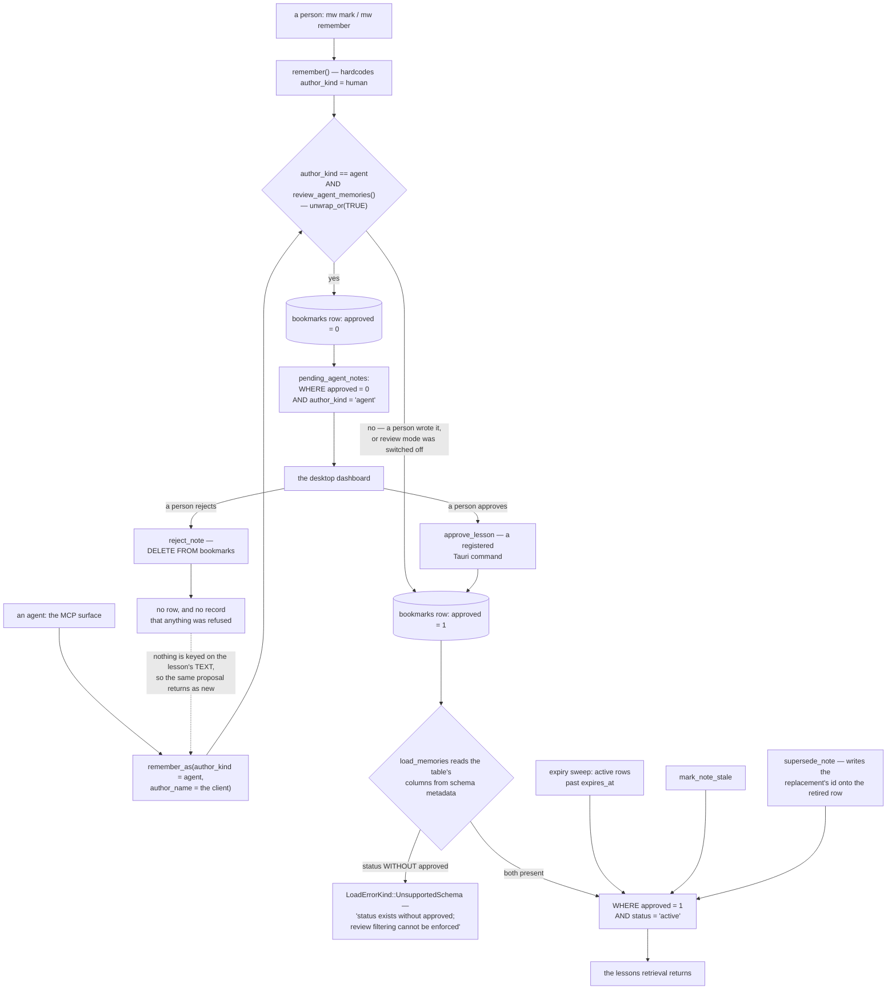

## 1. Executive Summary

MemoryWhale is "[p]ersistent local debugging memory for developers and coding
agents" — MIT, Rust, version 0.10.0, 34,341 lines across 75 files in two crates
and a Tauri shell, with 401 test attributes. Everything stays on the machine;
the README badge says so plainly.

**The mechanism to take away is where the approval decision is made.** A great
many systems in this corpus have a review flag, and in most of them the flag is
set by whatever wrote the row and then consulted nowhere. Here the flag is
derived from *who wrote it*, at the moment of writing:

```rust
let approved = if author_kind == "agent" && review_agent_memories() {
```

and the two authors are separated by the API rather than by a parameter a
caller might fill in wrongly. `remember` — what `mw remember` and `mw mark`
call — is one line:

> `remember_as(text, cwd, "human", None, None)`

while `remember_as` with `"agent"` is what the MCP surface uses, carrying the
client's name. So a person's lesson is approved because a person wrote it, and
an agent's lesson waits.

**Review mode is on by default, and the switch is framed in the safe
direction.** `review_agent_memories()` ends `.unwrap_or(true)`, and the doc
comment describes turning it off as opting "into automatic approval" rather
than opting out of review — a small piece of phrasing that puts the burden on
the person loosening the gate.

**Every reader filters on it, and the loader refuses the one schema shape where
that could fail silently.** The comment above the query states the contract:

> "Review mode is enforced at write time (agent notes land with approved=0), so
> every reader filters approved=1 when that column exists."

What makes this more than a convention is the arm beneath it. The loader reads
the table's columns from schema metadata — "not by treating an arbitrary prepare
error as a legacy-schema signal" — and if it finds `status` without `approved`
it returns an error rather than a result:

> "status exists without approved; review filtering cannot be enforced"

A database in that shape is not something a released migration can produce, and
the loader treats it as unsupported instead of falling back to the weaker
filter. That is the failure this atlas most often finds shipped the other way:
a guard that degrades quietly when its column is missing.

**The lifecycle rides in the same query.** `status` carries `active`,
`expired`, `stale` and `superseded`, and the loader asks for
`approved = 1 AND status = 'active'`. Each value has a distinct writer and a
distinct meaning. The expiry sweep moves rows past their `expires_at` and the
comment says why it is a status rather than a delete — it "stops surfacing them
without deleting the evidence". `mark_note_stale` retires a memory on
judgement, clearing `superseded_by_id` as it goes. `supersede_note` retires one
in favour of another and writes the replacement's id onto the retired row, after
refusing a memory that would supersede itself and refusing a replacement id
naming no row.

**What it does not do is remember what it rejected.** Rejection from the review
queue is `DELETE FROM bookmarks WHERE id = ?1`. Nothing is keyed on the lesson's
content, and no table records that the rejection happened, so an agent that
proposed something a person threw out can propose it again and the queue will
show it again as new. The review gate is a filter on what reaches retrieval, not
a memory of what was refused.

## 2. Mental Model

Two layers, and the interesting rules live between them.

Underneath is **evidence**: command runs with their argv, exit code, output and
an error fingerprint; session transcripts; agent turns. It is bulky, it is
captured automatically, and it is never the thing retrieval hands back.

On top are **lessons** — the `bookmarks` table, despite the name — each one a
sentence somebody or something concluded, carrying provenance, an approval flag
and a lifecycle status. Retrieval returns these.

Between them sits a compaction rulebook that decides which evidence may shrink,
and the first rule is the one that shows the product knows its user:

> "Failures outrank successes. A failed command or an errored run is exactly
> what future-you will search for, so it is never auto-compacted."



## 3. Architecture

| Area | Role |
| --- | --- |
| `crates/memorywhale-core` | The loader, the scorer, the embedding path, the privacy redaction and the compaction policy |
| `crates/mw-cli` | The `mw` binary: capture, migrations, the lesson API, the review queue, the terminal UI and the integrations |
| `src-tauri` | The desktop dashboard's commands, including the pending list and `approve_lesson` |
| `src`, `index.html` | The dashboard front end |
| `benchmarks`, `tests` | Retrieval and compatibility harnesses |

## 4. Essential Implementation Paths

- `crates/mw-cli/src/lib.rs:1405-1420` — `review_agent_memories()`, defaulting to on.
- `crates/mw-cli/src/lib.rs:1558-1590` — `remember` and `remember_as`, where the approval flag is decided.
- `crates/mw-cli/src/lib.rs:1471-1492` — `pending_agent_notes`, the review queue.
- `crates/mw-cli/src/lib.rs:1494-1509` — `approve_note` and `reject_note`.
- `crates/mw-cli/src/lib.rs:1511-1552` — `mark_note_stale` and `supersede_note`, with their validation.
- `crates/mw-cli/src/lib.rs:389-394` — the expiry sweep.
- `crates/memorywhale-core/src/sqlite.rs:448-490` — the loader, its schema introspection and its refusal.
- `src-tauri/src/lib.rs:383-440` — the dashboard's pending list and `approve_lesson`.
- `crates/memorywhale-core/src/policy.rs` — the compaction rulebook.

## 5. Memory Data Model

A lesson carries `label`, `cwd`, `created_at`, `command_run_id`, `session_id`,
and — added by numbered migrations — `author_kind`, `author_name`,
`source_session_id`, `approved`, `status` and `superseded_by_id`. The migration
comments are careful about what each change does to a populated database, noting
that `ADD COLUMN` with a constant default never rewrites rows, and that
migration 1 backfills existing lessons as human through the column defaults.

Evidence carries more: a command run has its argv, exit code, output, a
`capture_kind` distinguishing a full capture from a shell-hook row that keeps
only command, directory and exit code, and an `error_fingerprint` that groups
recurring failures so `mw context --last-error` can show a history immediately.

Every time here is a record time. There is no validity axis and no as-of read,
so `bitemporal` is withheld on an absence. `expires_at` is a retention policy
rather than a statement about when something was true.

## 6. Retrieval Mechanics

Search is FTS5 over captured commands, with each whitespace term quoted and
given a trailing prefix `*` so "link" still finds "linker" — the comment says
this is deliberately "closer to the old substring search" the index replaced.
Quoting escapes punctuation so a query cannot break `MATCH` syntax.

Lessons come from the loader, behind the two predicates above. A scorer produces
named reasons alongside its numbers, and an embeddings table supports an
optional vector path.

## 7. Write Mechanics

Every note-writing surface — `mw mark`, `mw remember`, MCP, the desktop app —
routes through `remember_as`, and the capture gate runs "before the database is
opened", so a directory excluded from capture never reaches storage at all.
Redaction runs over captured text, with tests asserting that a token value is
absent from the result.

The compaction pass is separate and is where the evidence layer is managed. Its
policy module is pure: thresholds arrive as arguments "so the CLI can expose
flags and tests can pin every boundary", and every decision returns a `Tier`
carrying the `Reason` that selected it — `Distilled`, `StaleLarge` or
`SuccessNoise`. The second rule is the one that ties the two layers together: an
approved lesson distilled from a session makes the transcript copy redundant,
"the reasoning lives in the lesson".

## 8. Agent Integration

An MCP surface writes lessons attributed to the calling client, shell hooks
capture commands as they run, and a `capture_kind` records which tier a row came
from. The desktop dashboard and the terminal UI are the person's surfaces; the
TUI's own text tells the reader where agent memories land when review mode is
on.

## 9. Reliability, Safety, and Trust

**Human review — awarded.** The producer test is what decides it: the approving
action is a desktop command a person invokes, the queue is exactly the
agent-written unapproved rows, and the two author kinds are written by two
different functions rather than by one function with a parameter. The
qualification belongs beside it: review mode is a setting. It defaults to on and
the documentation frames the change in the safe direction, but one line in
`config.toml` or one environment variable makes every agent lesson retrievable
at the moment it is written.

**Trust state — awarded.** Four values, filtered in the same SQL as the approval
flag, each with its own writer, and a supersession that names its replacement
and validates before writing.

**Negative evaluation — awarded.** The fixture is built so that each excluded
row differs from the expected one in exactly one column, which is what makes it
discriminating rather than merely non-empty, and the unsupported-schema arm
asserts that the dangerous configuration fails loudly.

**Scope enforced — withheld.** Project and machine are real stored keys, and the
query places them behind `(?1 IS NULL OR column = ?1)`. A caller that supplies
nothing reads across everything, so the boundary is the caller's habit.

**Tombstone — withheld.** Rejection deletes the row, and nothing is keyed on the
lesson's text, so a rejected proposal can return as a new pending note. The
lifecycle statuses do retain evidence, which is the right instinct in a
neighbouring place — but a superseded row is not consulted when anything is
written.

**Audit log — withheld.** Fifteen tables and none of them a mutation record. An
approval, a supersession and a rejection all leave the same trace.

## 10. Tests, Evals, and Benchmarks

401 test attributes across the two crates. The loader test is the load-bearing
one and is described above. The policy module's tests pin every threshold
boundary, which is what its thresholds-as-arguments design is for. The privacy
tests assert a secret's absence from a redacted string. A `benchmarks` directory
and a shortcut-evaluation example drive retrieval over a synthetic store.

## 11. For Your Own Build

- **Decide approval from the author, at write time.** A flag set by the writer
  and checked by the reader only works if the writer cannot lie about who it is.
  Two functions — one that hardcodes the human kind, one that takes an agent's
  client name — is a cheaper guarantee than a parameter everyone must pass
  correctly.
- **Refuse the schema you cannot filter.** The best line in this codebase is the
  one that turns a missing column into an error because "no released migration
  creates it". A guard that degrades quietly when its column is absent is a
  guard that will be absent exactly when it matters.
- **Read the schema from metadata, not from a failed prepare.** Treating an
  arbitrary error as a legacy-schema signal is how a broken query becomes a
  silent policy change.
- **Give retirement more than one word.** `expired`, `stale` and `superseded`
  say three different things about why a memory stopped being offered, and the
  last of them names what replaced it.
- **Attach the reason to the decision.** The compaction tier carries which rule
  fired, so a shrunken row can be explained later without re-deriving the
  policy.

## 12. Open Questions

- Should rejection leave anything behind? Today it deletes, so the same lesson
  can be proposed again with nothing to notice — the review queue has no memory
  of its own decisions.
- Is the scope meant to bind? A project column exists on the session and the
  query makes it optional; which is the intended contract is not written down.
- What happens to a lesson whose evidence was compacted and whose status later
  becomes stale? The transcript path still points at the raw file, but the
  relationship between the two lifecycles is not stated.
- Will the approval flag ever record who approved, and when? The lesson records
  who wrote it in three columns and records nothing about who let it through.

## Appendix: File Index

| Path | What lives there |
| --- | --- |
| `crates/mw-cli/src/lib.rs` | Migrations with their notes, the lesson API, the review queue, the lifecycle writers and the expiry sweep |
| `crates/memorywhale-core/src/sqlite.rs` | `load_memories`, the schema introspection, the two predicates and the unsupported-schema refusal |
| `crates/memorywhale-core/src/policy.rs` | The compaction rulebook, its tiers and its named reasons |
| `crates/memorywhale-core/src/privacy.rs` | Redaction, with tests asserting a secret's absence |
| `crates/memorywhale-core/src/scorer.rs` | Ranking with named reasons |
| `src-tauri/src/lib.rs` | The dashboard commands, including the pending list and `approve_lesson` |
| `crates/mw-cli/src/tui.rs` | The terminal UI, including where it tells a reader agent memories land |
| `crates/mw-cli/src/agent_hook.rs` | The hook that captures agent activity |

Searches behind the absence claims above, run from the repository root:

```sh
grep -rn 'valid_from\|valid_to\|as_of' crates --include='*.rs'   # no validity axis; the hits are 'invalid_toml'
grep -rhoE 'CREATE TABLE (IF NOT EXISTS )?[a-z_]+' crates src-tauri | sort -u   # fifteen tables, none a mutation history
grep -rn 'IS NULL OR project' crates --include='*.rs'            # the scope predicate is omittable
grep -rn 'reject_note' crates --include='*.rs'                   # rejection is a DELETE
```

## History

**2026-09-19** — re-pinned to [`a124b102663a8db9f17a133572fb50c607b4d95c`](https://github.com/wuisabel-gif/MemWhale/commit/a124b102663a8db9f17a133572fb50c607b4d95c). All three marks stand. `human_review`'s anchors were re-resolved and the record gained its producer test, which this design passes on the strongest available footing: `author_kind` is written into the call site rather than taken from the caller — the MCP `remember` handler is `remember_as(text, None, "agent", client_name, None)` at `mcp/tools.rs:409` — so a model cannot present itself as the human path, and the six tools that surface reaches carry no approve or reject verb while `approve_lesson` lives in the Tauri desktop command table. The default direction was re-checked too: `review_agent_memories()` still ends `.unwrap_or(true)` at `lib.rs:1420`. Screened again first; nothing was installed and no suite was run.

**2026-09-16** — [`91b978508866fa8479136142d1eb415e3fd067b1`](https://github.com/wuisabel-gif/MemWhale/commit/91b978508866fa8479136142d1eb415e3fd067b1) — first reading, at a commit dated 15 September 2026. Screened before opening, from a shallow clone: eleven files scanned, no auto-run surface, one build-time execution point — `src-tauri/build.rs`, which cargo runs at build time — one unpinned dependency surface, and one dependency file inside the seven-day cooldown, with both `package-lock.json` and `Cargo.lock` present. `AGENTS.md` is addressed to a reading agent and was recorded as data. Nothing was installed, built or run, and no benchmark was reproduced.
