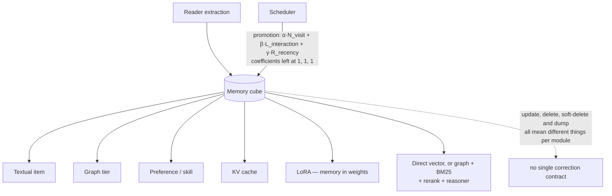

## 1. Executive Summary

MemOS is the broadest memory substrate in this batch. It treats memory as an operating-system concern with swappable memory modules, reusable “memory cubes”, schedulers, services, readers, users, feedback, and chat orchestration. Its memory types are not limited to text: the code includes textual graph memory, user preferences, skills, transformer KV caches, vLLM prefix caches, and LoRA-style parametric memory.

The promising idea is the common lifecycle across heterogeneous memory forms. A `GeneralMemCube` can carry textual, activation, parametric, and preference memory together; `MOSCore` registers cubes to users and routes add/search/get/delete operations; schedulers can transform textual memories into activation memory.

The weakness is architectural breadth and uneven maturity. Several modes and adapters coexist, optional dependencies are numerous, interfaces are not equally capable, and some implementations are thin wrappers or placeholders. MemOS is valuable as an exploration of memory virtualization, but adopting it means evaluating the exact configured cube—not relying on the umbrella abstraction alone.

## 2. Mental Model

MemOS models memory as resources mounted into a user/agent runtime:

```text
messages -> reader/extractor -> TextualMemoryItem
        -> MemCube
             |- text memory: vector or graph/tree
             |- preference memory
             |- activation memory: KV/prefix cache
             `- parametric memory: LoRA
        -> MOSCore user registration + routing
query   -> cube searcher -> graph/vector/BM25/reranker/reasoner
chat    -> retrieved memory + optional internet context -> LLM
scheduler -> textual memory -> activation cache / maintenance
```

A cube is a deployable memory bundle, not just a namespace. It can be dumped locally, initialized from a directory, or loaded from a remote repository. This suggests sharing and composing memory resources independently from the agent process.



## 3. Architecture

Major layers:

- `src/memos/mem_os/`: `MOSCore` and the higher-level `MOS` chat facade.
- `src/memos/mem_cube/`: cube configuration, loading, dumping, and memory-module composition.
- `src/memos/memories/`: textual, preference, activation, parametric, and skill implementations.
- `src/memos/mem_reader/`: message-to-memory extraction.
- `src/memos/mem_scheduler/`: periodic and event-driven memory transformation.
- `src/memos/mem_chat/`: chat and context orchestration.
- `src/memos/mem_user/`: user state and cube registration.
- `src/memos/mem_feedback/`: feedback services.
- `src/memos/memories/textual/tree.py` plus `graph_dbs/`: graph-backed tiered memory.
- `src/memos/vec_dbs/`, `embedders/`, `reranker/`, and `llms/`: backend factories.
- `src/memos/api/`: service surfaces.

Factories construct most components from Pydantic configuration. This gives MemOS broad portability but makes behavior configuration-dependent: “MemOS retrieval” is not one algorithm.

## 4. Essential Implementation Paths

- Public runtime: `MOS` in `mem_os/main.py`.
- Core registration and routing: `MOSCore` in `mem_os/core.py`.
- Cube composition: `GeneralMemCube` in `mem_cube/general.py`.
- Simple vector text memory: `GeneralTextMemory` in `memories/textual/general.py`.
- Tiered graph text memory: `TreeTextMemory` in `memories/textual/tree.py`.
- Text memory record: `TextualMemoryItem` and metadata types in `memories/textual/item.py`.
- Preference memory: `memories/textual/preference.py`.
- KV-cache memory: `memories/activation/kv.py` and `activation/vllmkv.py`.
- Parametric memory: `memories/parametric/lora.py`.
- Search pipeline: `memories/textual/tree.py` and `memories/textual/searcher/`.
- Memory reorganization: `memories/textual/memory_manager.py`.
- Scheduler conversion: `mem_scheduler/base_scheduler.py`.

## 5. Memory Data Model

`TextualMemoryItem` wraps a string plus structured metadata. The metadata supports source messages, user/session identity, tags, timestamps, memory type, status, background, confidence-like fields, and graph-specific hierarchy. Archived variants preserve prior textual state.

`TreeTextMemory` divides content into `WorkingMemory`, `LongTermMemory`, and `UserMemory`. Its graph store carries memory nodes and typed edges; the memory manager enforces configurable size budgets and can reorganize items.

`GeneralTextMemory` is much simpler: the whole `TextualMemoryItem` becomes vector payload, with one embedding per memory.

Activation records hold serialized transformer caches and model metadata. Parametric records point at LoRA resources. Preferences and skills use specialized textual representations. This breadth is a real conceptual contribution: “memory” can be prompt-visible text, cached neural activations, or learned parameters.

## 6. Retrieval Mechanics

Retrieval varies by module:

- `GeneralTextMemory.search()` is direct vector similarity.
- `TreeTextMemory.search()` constructs a `Searcher` with graph store, embedder, BM25 retriever, reranker, optional internet retriever, and strategy.
- Tree search supports fast and fine modes, working/long-term/user memory filters, metadata filters, user scope, preference memory, skill/tool memory, deduplication, and optional embeddings.
- `get_relevant_subgraph()` finds embedding/full-text seeds and merges bounded neighborhoods.
- Fine paths can use an LLM reasoner; fast paths favor lower latency.

This makes the search surface powerful but difficult to summarize or tune. Optional internet retrieval also blurs the boundary between remembered evidence and newly fetched context unless callers preserve source labels.

## 7. Write Mechanics

The simple path uses an LLM reader to extract key/value/tag memories from messages, embeds them, and writes them to a vector database. Update re-embeds the replacement. Delete targets IDs.

Tree memory delegates add and reorganization to `MemoryManager`, which assigns memory tiers and respects per-tier capacities. It can add raw-file nodes and graph edges, soft-delete items, replace working memory, and dump snapshots with backup cleanup.

Activation memory extracts and persists model KV caches, can reconstruct a combined dynamic cache, and can derive a cache from textual memory. Schedulers expose `update_activation_memory()` and periodic refresh, making memory transformation an explicit background operation.

## 8. Agent Integration

`MOS.chat()` retrieves user-scoped memory and constructs a response context. More advanced chain-of-thought helpers decompose a query, search subproblems, and assemble answers. API, CLI, and chat modules provide other entrypoints.

Users register memory cubes with `MOSCore`; operations resolve the target user/cube and then delegate to its modules. This is stronger than passing an arbitrary vector-store filter, but applications must understand which cubes are mounted and which memory types are enabled.

## 9. Reliability, Safety, and Trust

Positive mechanisms include:

- typed configuration and factories;
- user/cube routing;
- dump/load and backup rotation;
- explicit working/long-term/user tiers;
- source-message metadata;
- soft deletion in graph memory;
- scheduler status tracking and feedback modules;
- retries for malformed extraction responses.

Risks remain substantial. The simple extractor repairs malformed JSON heuristically and can return an empty object that later code expects to contain `"memory list"`. Module capability is uneven: some base operations are abstract, some concrete `drop()` methods are empty, and persistence semantics differ between vector, graph, cache, and LoRA backends. Trust state and injection fencing are not consistently imposed across memory types.

## 10. Tests, Evals, and Benchmarks

The repository contains unit, integration, and benchmark areas spanning cubes, textual memory, graph stores, search, APIs, schedulers, and performance datasets. The research project also publishes memory benchmarks.

The important evaluation lesson is configuration provenance: results must name the exact text-memory implementation, LLM, embedder, graph/vector backend, reranker, search mode, and enabled auxiliary memories. An aggregate “MemOS” score can conceal materially different pipelines.

## 11. For Your Own Build

### Steal

- Package multiple memory forms into a mountable memory cube.
- Give users explicit cube registration rather than implicit global storage.
- Separate working, long-term, and user memory budgets.
- Treat KV caches as reusable activation memory.
- Allow textual memory to be transformed into faster model-native memory.
- Make search modes and auxiliary preference/skill channels explicit.
- Keep dump/load at the cube boundary for portability.

### Avoid

- One umbrella API hides very different consistency and durability guarantees.
- Factory/configuration breadth makes reproducibility harder.
- Optional dependencies create many partially exercised combinations.
- LLM extraction has weak epistemic verification.
- Internet retrieval can be confused with stored memory.
- Cache and LoRA memory raise model-version compatibility and privacy issues.
- Some concrete methods and backends appear incomplete.
- Complex search modes can become difficult to benchmark fairly.

### Fit

Borrow the cube abstraction if your application truly needs several physical forms of memory or deployable memory bundles. Activation memory is especially promising for repeated long contexts where prompt reprocessing dominates latency.

For ordinary agent memory, choose and validate one text implementation first. Do not adopt the full operating-system vocabulary until you need mounting, scheduling, sharing, or transformation across memory types. A clean text/evidence store is easier to trust than a broad abstraction with unclear guarantees.

## 12. Open Questions

- Which cube operations are transactional across text, preference, activation, and parametric stores?
- How are KV caches invalidated when model weights, tokenizer, or prompt prefix changes?
- Can deletion prove removal from dumps, backups, graph nodes, caches, and LoRA artifacts?
- How are conflicting memories reconciled across working, long-term, and user tiers?
- Which configured pipeline corresponds to published benchmark numbers?
- What security model governs loading a remote memory cube?

## Appendix: File Index

- `src/memos/mem_os/main.py`
- `src/memos/mem_os/core.py`
- `src/memos/mem_cube/general.py`
- `src/memos/memories/textual/item.py`
- `src/memos/memories/textual/general.py`
- `src/memos/memories/textual/tree.py`
- `src/memos/memories/textual/memory_manager.py`
- `src/memos/memories/textual/searcher/`
- `src/memos/memories/textual/preference.py`
- `src/memos/memories/activation/kv.py`
- `src/memos/memories/activation/vllmkv.py`
- `src/memos/memories/parametric/lora.py`
- `src/memos/mem_scheduler/base_scheduler.py`
- `src/memos/mem_reader/`
- `src/memos/api/`
- `tests/`
