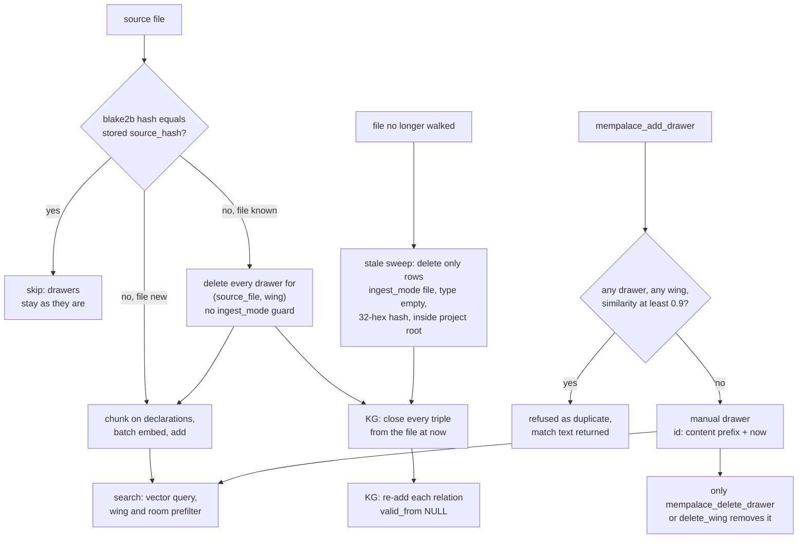

## 1. Executive Summary

mempalace-code is a fork of [MemPalace](../mempalace/) rebuilt for source code.
It keeps the palace vocabulary — wings, rooms, drawers holding verbatim text —
and the MCP surface, and replaces the storage and the ingest: LanceDB instead of
ChromaDB, chunks cut on declaration boundaries with symbol and line-range
metadata, per-file content hashes that make re-mining incremental, and a SQLite
graph of type relationships extracted from .NET and Python sources. What is
strong is the ingest bookkeeping around a code index. What is weak is the manual
memory beside it, which gained a SQL injection in the port and still lacks an
update verb, a mutation audit and a trust state.

**The relationship to upstream is a hard fork with a pinned review.** The
history begins with MemPalace's own commits. The last shared commit is
[`c30bc9e71e890d50b2019788e8d5a89a2164cc79`](https://github.com/MemPalace/mempalace/commit/c30bc9e71e890d50b2019788e8d5a89a2164cc79),
dated 7 April 2026. The fork's first commit,
[`66ff5a61f2c335b3827050df287839f89effb15b`](https://github.com/rergards/mempalace-code/commit/66ff5a61f2c335b3827050df287839f89effb15b),
on 13 April 2026, swaps in LanceDB. Upstream's package at the fork point was
8,580 lines of Python; the fork's is 35,098. GitHub does not list the repository
as a fork.

Some modules came across almost unchanged — `dialect.py`, `spellcheck.py`,
`entity_detector.py`, `palace_graph.py`, `layers.py` — and the manual add and
delete handlers keep upstream's code nearly line for line. Everything else this
report describes was written in the fork. The fork tracks upstream deliberately
rather than merging it: `docs/UPSTREAM_COMPARISON.md` pins the upstream commit
last reviewed (`e038af97`, 20 September 2026) and classifies each upstream commit
since the previous pin. A release gate refuses to publish when upstream's head
has moved past the pin.

Four findings shape the rest of this report.

- **`mempalace_delete_drawer` can delete the whole store.** `LanceStore.get` and
  `LanceStore.delete` build `id IN ('…')` by string interpolation with no
  escaping (`storage.py:1228-1230`, `:1315-1316`). The handler passes the
  agent's `drawer_id` straight through, and its existence check uses the same
  interpolation. An id carrying `') OR ('1'='1` passes the check and matches
  every row. Upstream at the fork point handed ids to ChromaDB as parameters;
  the port introduced it. Read from code, not run.
- **The CLI and the MCP server read different knowledge graphs by default.**
  `mempalace-code mine <dir>` without `--palace` writes type relations to
  `~/.mempalace/knowledge_graph.sqlite3`. The MCP server always opens
  `<palace>/knowledge_graph.sqlite3`, so the five code-intelligence tools query
  a graph the documented mining command did not fill.
- **Mined memory has an authority, manual memory has none.** A mined drawer is
  a projection of a file, and the file corrects it. A manual drawer is corrected
  only by deleting it and writing a new one.
- **Scope is enforced on search and nowhere else.** The duplicate check and the
  graph read across wings.

Three marks are carried: `bitemporal`, `scope_enforced` and `negative_eval`.
Section 9 names the four withheld and why.

## 2. Mental Model

A drawer is one verbatim chunk. It becomes a belief when it is written and stays
one until a delete removes it. Nothing marks it provisional, nothing expires
it, and a search returns it as text with its wing, room and source.

There are two kinds of drawer, and they die differently.

| Kind | Written by | Authority | How it stops being true |
| --- | --- | --- | --- |
| Mined file chunk | `mine`, the watcher, `mempalace_mine` | The source file at the recorded `source_hash` | The file changes: every drawer for `(source_file, wing)` is deleted and the new chunks are added. The file disappears: the stale sweep deletes it |
| Manual drawer | `mempalace_add_drawer`, `diary write` | None; the text is the record | `mempalace_delete_drawer` by id, or `mempalace_delete_wing` |
| KG triple | `mempalace_kg_add`, the miner, the architecture pass | Caller dates, or the source file | `valid_to` is set; the row stays |

**For mined drawers the model is "the code is true, the index follows it".**
The hash on each row is what makes that cheap: an unchanged file is skipped
without re-chunking, and a deleted mined drawer comes back on the next mine
because its file is no longer in the hash inventory. That is correct for a code
index. A person cannot suppress a mined chunk except by excluding the file.

**For manual drawers there is no model beyond add and delete.** The usage rules
the project ships route two cases apart: a *wrong* drawer is searched, deleted by
id and re-added; an *evolved* fact gets an additive write, or a KG
invalidate-and-add, and the history stands (`docs/LLM_USAGE_RULES.md:219-230`).
The plugin's minimal profile has no delete, and its skill tells the agent to stop
and ask for a richer registration rather than write a competing drawer.

**KG triples are the one place a belief is closed rather than erased.** A
manual invalidation stamps `valid_to` with a caller date or the current UTC
instant. The miner, re-reading a changed file, closes every triple from that file
and writes each relation again with no `valid_from`.

## 3. Architecture

The package is a Python CLI, `mempalace-code`, an MCP stdio server,
`mempalace-code-mcp`, and an optional file watcher. A palace is a directory
holding one LanceDB table and optionally a SQLite graph beside it. Embeddings
come from FastEmbed's ONNX build of `all-MiniLM-L6-v2`, normalised;
`sentence-transformers` models are an opt-in extra. ChromaDB is gone: opening a
palace that holds `chroma.sqlite3` raises `ChromaRuntimeRetiredError`
(`storage.py:2195-2241`).

`storage.py` defines the store. `DrawerStore` keeps the ChromaDB call shapes —
`add`, `upsert`, `get`, `query`, `delete` taking lists of ids, documents and
metadata dicts — and `LanceStore` translates them. The `where` dicts become SQL
through `_where_to_sql`, which escapes string values (`:2110-2190`). The
metadata schema is one tuple, `_META_FIELD_SPEC`, from which the Arrow schema,
defaults and migrations all derive (`:719-767`).

Maintenance is LanceDB's version model. `optimize()` compacts fragments,
`cleanup_stale_fragments` prunes versions older than seven days by default, and
`recover_to_last_working_version` walks older versions and can `restore()` one
(`:1575-1579`, `:1752`, `:2000-2104`). A pre-optimize backup and a pre-watch
backup write `.tar.gz` archives of the table and the graph (`backup.py`).

The graph is SQLite with the upstream schema: `entities` and `triples` with a
validity window, `extracted_at`, `confidence` and source columns
(`knowledge_graph.py:202-234`). The miner feeds it from regex extractors for C#,
F#, VB.NET and Python type declarations and from `.sln`, `.csproj` and XAML
files (`mining/kg_extract.py`). A post-mine architecture pass adds naming-rule
facts such as `is_pattern Service` and `is_layer Data` (`architecture.py`).

**Which graph a process opens depends on how it was started.** The MCP runtime
always opens `palace_kg_path(config.palace_path)` (`mcp/runtime.py:30-36`). The
CLI `mine`, `mine --watch` and `mine-all` pass `db_path=None` unless `--palace`
was given (`cli_commands/ingest.py:184-185`, `:220-221`, `:345`). `None` resolves
to `~/.mempalace/knowledge_graph.sqlite3` (`knowledge_graph.py:166`, `:196-200`).
`watch --all` and `mempalace_mine` use the palace path. A test pins the CLI half
of this as intended (`tests/test_installed_cli_palace_scope.py:162`).

Much of the tree is release engineering, not memory: an upgrade orchestrator
(`updater.py`, 1,780 lines), a wing-merge operator that works only through sealed
receipts (`wing_migration.py`, 5,398 lines), and gates for dependency age,
documentation drift and the upstream pin.

### Deployment and ergonomics

Nothing has to be running. A `pip install`, then `mempalace-code init <dir>` and
`mine <dir>`, produce a working palace, fully local, with no API key. The first
run fetches the embedding model unless an owned cache exists. The store is not
hand-editable: LanceDB fragments need the library to read. `export` writes
drawers and triples as JSONL, with `--only-manual` selecting the `manual_v1` and
`diary_v1` strategies that re-mining cannot regenerate. The watcher needs the
`watch` extra and refuses to start if its pre-watch backup fails.

## 4. Essential Implementation Paths

**Mine.** `mine()` in `mining/orchestrator.py` precomputes a blake2b hash per
walked file and loads two inventories: every `(source_file, source_hash)` in the
wing, and a project-scoped one that marks rows as regenerable only when
`ingest_mode = 'file'`, `type` is empty and the hash is 32 hex digits
(`:530-556`; `storage.py:841-848`, `:1381-1429`). A run where nothing changed
returns before the embedder loads. Per file, an unchanged hash skips; otherwise
`_collect_specs_for_file` chunks it, and if the file was known,
`delete_by_source_file(source_file, wing)` removes its drawers (`:636-717`).
Specs buffer until the batch size and flush through `add_drawers_batch`.

**KG emission while mining.** For files with a `_KG_EXTRACT_EXTENSIONS` suffix,
the same branch calls `kg.invalidate_by_source_file(source_file)` and then
`kg.add_triple(subj, pred, obj, source_file=source_file)` for each extracted
relation (`orchestrator.py:716-731`). After the loop, the architecture pass
closes architecture predicates for the project root and re-emits them
(`:795-825`).

**Stale sweep.** Only with `limit == 0` and a successful scoped inventory, the
files in the inventory that were not walked go to
`delete_by_source_files(..., project_root=project_path)`. That call adds the
regenerable predicate to the SQL and checks each path lies inside the project
root (`orchestrator.py:756-790`; `storage.py:1342-1379`). Their triples are
closed only if every deletion succeeded.

**Conversation mining.** `convo_miner.py` uses `replace_source`, a single
`merge_insert` keyed on `(id, source_file, wing)` with
`when_not_matched_by_source_delete` scoped to that source, so a re-mined
conversation is replaced atomically (`convo_miner.py:417`; `storage.py:1161-1215`).
The project miner does not use it.

**Manual write.** `tool_add_drawer` runs `tool_check_duplicate(content, 0.9)`,
builds `drawer_{wing}_{room}_{md5(content[:100] + now)[:16]}`, and calls
`col.add` with `chunker_strategy: "manual_v1"` (`mcp/tools/write.py:12-51`).
Diary entries go to wing `wing_<agent>` and room `diary` with a UUID id
(`mcp/tools/diary.py:10-52`).

**Delete.** `tool_delete_drawer` calls `col.get(ids=[drawer_id])` and then
`col.delete(ids=[drawer_id])` (`write.py:54-67`). `tool_delete_wing` counts and
deletes on an escaped `wing = '…'` predicate (`:70-83`; `storage.py:1318-1327`).

**Search.** `tool_search` calls `search_memories`, which validates the wing and
room against the palace taxonomy, builds the `where` dict and calls
`store.query` (`searcher.py:189-273`). `code_search` adds language and symbol
type to the prefilter, overfetches three times, or five with the hybrid rerank,
and applies `symbol_name` and `file_glob` as Python post-filters (`:333-496`).

**Code intelligence.** `find_implementations`, `find_references`,
`show_project_graph`, `explain_subsystem` and `extract_reusable` read the graph
through `query_entity` or `query_relationship` and keep only facts whose
`current` flag is true (`mcp/tools/architecture.py:77`, `:118`, `:152`, `:228`,
`:268`).

## 5. Memory Data Model

Every drawer row is `id`, `text`, `vector` and the 30 columns of
`_META_FIELD_SPEC` (`storage.py:724-764`). The ones that matter here:

| Field | Written by | Read by |
| --- | --- | --- |
| `wing`, `room` | every writer | the search prefilter, delete-by-wing, taxonomy validation |
| `source_file`, `source_hash` | miner; caller-supplied `source_file` on manual writes | incremental skip, stale sweep, the reader |
| `ingest_mode`, `type` | miner sets `file`; diary sets `type: diary_entry` | the regenerable-row guard |
| `symbol_name`, `symbol_type`, `language` | chunkers | `code_search` prefilter and post-filter |
| `line_start`, `line_end` | miner | `mempalace_read` line slices |
| `added_by`, `filed_at`, `extractor_version`, `chunker_strategy` | every writer | `export --only-manual` selects on the strategy |

**Scope is a column.** `wing` is the project, or `wing_<agent>` for a diary;
`room` is an aspect within it. Nothing on the row names a user or tenant, and
palaces are separate directories selected by config or `--palace`.

**Mined ids are positional.** `md5(source_file + chunk_index)` makes a chunk's id
stable across re-mines while the file's structure holds (`orchestrator.py:306`).
Manual ids include the wall-clock time, so the same text written twice gets two
ids. The duplicate check is what stops that, and the shipped skill states that
the write has no stable deduplication identity to retry against.

**The graph has no scope column.** `triples` carries `subject`, `predicate`,
`object`, `valid_from`, `valid_to`, `confidence`, `source_closet`,
`source_file` and `extracted_at` (`knowledge_graph.py:213-226`). Entity ids are
the lower-cased name with spaces replaced (`:254-255`), so a `Config` class in
two projects in one palace is one entity.

## 6. Retrieval Mechanics

**Search is one vector query with a prefilter.** `LanceStore.query` embeds the
text, opens `table.search(vec).limit(fetch_limit)` and attaches the SQL `where`
(`storage.py:1255-1307`). At the locked LanceDB 0.33.0 `where()` defaults to
`prefilter=True`
([`query.py:910`](https://github.com/lancedb/lancedb/blob/c0a9a4d48a384096dbfd928fbbf808f6527dba9c/python/python/lancedb/query.py#L910)),
so a scoped query returns the top rows *within* the scope. The manifest allows
`lancedb>=0.20`; a resolver that picks another release gets that release's
default.

**Reranking is deterministic and never adds candidates.** For queries that look
like a project-file or symbol lookup, `query` overfetches and `retrieval_rerank.py`
promotes `.csproj` rows or rows whose `symbol_name` matches. `code_search(rerank="hybrid")`
scores token overlap over the text and metadata of the overfetched pool and uses
storage rank as the tie-break (`search_reranker.py`). There is no lexical index
and no LLM reranker.

**Post-filters can starve the result.** `symbol_name` and `file_glob` run in
Python after an overfetch capped at 150, or 200 with the hybrid rerank
(`searcher.py:417-484`). A narrow glob over a large wing can return fewer hits
than asked with matches left unread.

**Context arrives by tool call.** Nothing injects drawers automatically. The
wake-up stack in `layers.py` — an identity file plus the top drawers grouped by
room, capped near 3,200 characters — is a port of upstream reached through the
CLI `wake-up` command, not through a hook in this tree.

**The graph read returns history by default.** `mempalace_kg_query` without
`as_of` returns past, current and future facts, each with a `current` flag
computed at the wall clock. The tool description tells the model to filter on
it. The code-intelligence tools filter for it themselves.

`similarity` is reported as `1 - _distance` on LanceDB's default L2 distance
over normalised vectors. The duplicate check's 0.9 threshold is applied to that
number, not to a cosine.

## 7. Write Mechanics

**Mining is synchronous and batched.** The CLI blocks while it hashes, chunks,
embeds in batches sized to the hardware, and adds. `mempalace_mine` runs the same
path inside the MCP server with stdout and stderr redirected at the file
descriptor, so the agent waits for the whole mine (`mcp/runtime.py:92-117`). A
drawer is searchable when its batch flushes.

**A changed file is deleted before its replacement is written.** The delete
happens per file inside the loop; the add happens when the batch fills or at the
end. A `KeyboardInterrupt` flushes the pending batch (`orchestrator.py:846-850`).
Any other exception in a flush leaves the changed files without drawers until the
next incremental mine, which re-adds them because they are no longer in the hash
inventory. `replace_source` would make each file's swap atomic; only the
conversation miner calls it.

**The changed-file delete lacks the stale sweep's guard.** `delete_by_source_file`
deletes every row matching `(source_file, wing)` (`storage.py:1329-1340`). A
manual drawer written into the project's wing with `source_file` equal to a mined
file's absolute path is therefore deleted the next time that file changes. The
stale sweep protects exactly that row, and its test covers the protection only
with the manual drawer in another wing (`tests/test_miner.py:2186-2245`). Read
from code, not reproduced.

**The graph accumulates a pair of rows per re-mine.** `invalidate_by_source_file`
closes every open triple from the file at the current instant; `add_triple` then
finds no open duplicate and inserts the relation again with `valid_from` NULL
(`knowledge_graph.py:272-331`, `:333-363`). An unchanged `class Foo(Base)` in an
edited file yields one closed row and one open row, both unbounded below.

**Manual writes are hot-path and refuse near-duplicates across wings.** The
duplicate check queries the five nearest drawers with no `where`
(`mcp/tools/search.py:44-78`). A note refused as a duplicate of a drawer in
another project comes back with that drawer's id, wing, room and first 200
characters in the response.

Nothing filters injected or agent-generated text. Content is stored as given.

### Operational cost

- Mining: one embedding pass per changed chunk, no model call. A no-op mine
  hashes every file and returns before loading the embedder.
- Watcher: re-mines on a 5-second debounce (`watcher.py:516`), reusing one
  warmed model; each cycle is incremental.
- Manual write: one vector query for the duplicate check and one add, both local.
- Read: one vector query per search; nothing is injected per turn, so there is
  no prefix-cache interaction.
- Background: `optimize` after a mine by default; version cleanup is explicit.

## 8. Agent Integration

The MCP server registers 29 tools and resolves a static profile at startup —
`minimal`, `kg`, `code`, `notes`, or `full`, the default (`mcp_tool_profiles.py:19-71`).
`--tools`, `--include` and `--exclude` edit the set. The packaged agent plugin
registers the server with `--profile=minimal`: status, search, duplicate check
and add (`agent_plugin/mcp.json`). The destructive tools are reachable only
through a direct registration with a wider profile.

The plugin's `SKILL.md` is the most careful prose in the tree. It says a search
miss does not prove absence, forbids dropping an unknown wing filter to broaden a
search, and routes corrections to the owner because the profile cannot delete. It
also handles an ambiguous write: search for the content before retrying, since
the write has no stable identity.

`hooks/mempal_save_hook.sh` is upstream's Stop hook, ported: every 15 human
messages it blocks the stop and tells the model to save to the palace. The
PreCompact hook does the same before compaction. Neither is registered by
anything in the package; the script headers describe adding them to Claude Code
settings by hand.

The agent has full agency on the `full` profile: add, delete by id, delete a
wing, re-mine any directory holding a `mempalace.yaml`, and add or close graph
facts. Porting to another MCP client is a config line.

## 9. Reliability, Safety, and Trust

**SQL built from an agent argument.** `get(ids=…)` and `delete(ids)` wrap each id
in quotes without doubling embedded quotes (`storage.py:1228-1230`,
`:1315-1316`). `tool_delete_drawer` passes `drawer_id` from the tool call. With
`drawer_id` set to `x') OR ('1'='1`, the existence check becomes
`id IN ('x') OR ('1'='1')`, returns a row, and the delete runs the same predicate
over the whole table. Every other predicate in `storage.py` escapes, and
`wing_migration.py:2536-2537` escapes ids in the same `IN` shape. The path was
read, not executed; whether LanceDB's SQL parser accepts that exact string was
not tested. The minimal profile does not expose the tool.

**Provenance is good for mined drawers and absent for manual ones.** A mined row
names its file, hash, line range, chunker and extractor version. A manual row
records a caller-supplied `added_by`, which defaults to `mcp`, and whatever
`source_file` the caller typed.

**Deletion is not erasure.** LanceDB keeps prior versions until
`cleanup_stale_fragments` prunes them, seven days by default, and
`repair --rollback` can restore one, which brings deleted drawers back. Backups
taken before optimize or before a watch hold them too.

**The graph path divergence** in section 3 is a silent data-loss shape: triples
mined through the documented CLI command are written and never read by the MCP
tools that exist to use them. Not reproduced; derived from the two path rules
and the test that pins one of them.

**Uncertainty cannot be represented.** No drawer field says a text is doubted,
and the graph's `confidence` column is left at its 1.0 default by every live
path.

Capability marks:

- `scope_enforced` — carried. `wing` and `room` are applied as a prefilter on the
  vector query. The limits are in the record: the scope is optional and
  caller-supplied, the duplicate check reads across wings, and the graph has no
  wing.
- `bitemporal` — carried, for the graph. The miner's NULL `valid_from` and the
  inclusive end-of-day bound are in the record.
- `negative_eval` — carried, on a wing exclusion and an expired-fact exclusion,
  each with a positive control (section 10).
- `audit_log` — withheld. No append-only record of memory mutations exists in the
  tree. Upstream added a write-ahead log after the fork point, and
  `docs/UPSTREAM_COMPARISON.md` classifies it as having no owner here. LanceDB's
  version list is version history, not a mutation record, and cleanup prunes it.
- `tombstone` — withheld. A deleted manual drawer leaves nothing keyed on its
  text; a deleted mined drawer is re-mined from its file by design.
- `trust_state` — withheld. No status field on drawers or triples.
- `human_review` — withheld. Nothing waits for approval; `status` and the
  listing tools display.

## 10. Tests, Evals, and Benchmarks

Nothing was installed, built or run for this report. Everything below is from
reading the tests at the pin.

The suite is large and specific: 3,937 test functions across 90 files. An
autouse fixture replaces the embedder with a deterministic stub, so the tests
run against real LanceDB and a fake model (`tests/conftest.py:45-77`). Storage
tests cover the `where` translation including escaping, `$in`, `$or` and `$ne`,
the scoped bulk delete, quote handling in paths and wings, and schema migration.

**The negative cases that carry the mark.** `test_in_end_to_end` seeds three
wings, queries with two of them, and asserts both included drawers returned and
the third did not (`tests/test_storage_lance.py:573-595`). The graph's
`test_query_as_of_filters_expired` and `test_query_as_of_shows_current` assert an
employer is returned at one date and excluded at another, with the other
employer as control (`tests/test_knowledge_graph.py:142-152`). Those two came
from upstream unchanged.

**The vacuous shape is also present.** `test_wing_filter`, `test_room_filter`
and `test_wing_and_room_filter` assert `all(r["wing"] == "notes" …)` over the
results (`tests/test_searcher.py:36-46`), and the MCP-level twins do the same
(`tests/test_mcp_server.py:374-386`). Each passes on an empty result.

**What no test covers.** No test passes a quote in a `drawer_id` to `get` or
`delete`. No test changes a mined file while a same-wing manual drawer names it.
No test runs the CLI `mine` and then an MCP graph tool against the same palace.

**Benchmarks.** `benchmarks/BENCHMARKS.md` is upstream's conversation-memory
record, marked historical in its own header. The fork's numbers are a 20-query
code-retrieval set run on the project's own source — R@5 0.95 for MiniLM
(`benchmarks/results_embed_ab_2026-04-09.json`) — and a token-delta benchmark
against grep-and-read: median 14.5x fewer tokens with retrieval precision@5 of
0.5 (`benchmarks/token_delta_fixture_facts.json`). The ratio counts tokens
returned whether or not they answer the query. `BENCHMARKS.md` names an arXiv
draft by title only; no identifier or citation file is in the tree.

## 11. For Your Own Build

### Steal

- **A content hash per source file on every derived row.** It makes a no-op
  re-index free, detects change without reading the index, and tells a deletion
  sweep which rows it may remove.
- **A deletion sweep that proves a row is regenerable before removing it.**
  Require the ingest mode, an empty user-type field, a well-formed hash and a
  path inside the project root, all in the delete predicate itself. Anything a
  person wrote survives a sweep that cannot prove otherwise.
- **An atomic per-source replace.** A merge keyed on `(id, source, scope)` with a
  scoped delete-when-not-matched swaps one source's rows in one commit.
- **Ship the narrowest tool profile as the default integration.** The plugin
  registers four tools and no delete, and its skill says what to do when the
  profile cannot perform a correction.
- **Distinguish wrong from evolved in the usage rules.** Wrong content is deleted
  and replaced; an evolved fact is added and the history stands.

### Avoid

- **Porting a parameterised API onto string-built SQL.** Escape in one function
  and route every predicate through it, ids included. A translation layer that
  escapes values in `where` and not in `ids` is correct in the place tests look.
- **A default path that differs between the writer and the reader.** Derive the
  graph path from the palace in one function used by both.
- **Reading across scope to answer a write-side question.** A duplicate check is
  a read path; unscoped, it refuses writes and discloses content across projects.
- **Re-emitting unchanged facts with an unbounded start.** Diff the relation set
  against what is open for the source and close only what disappeared.

### Fit

This suits one developer indexing their own repositories for an MCP client who
wants code search that returns the function rather than a paragraph near it, and
treats notes as a secondary feature. The maintenance budget is modest because the
store follows the source tree. It does not suit anyone who needs corrections to
be recorded, notes kept apart from other projects, or the full tool surface
exposed to an agent reading untrusted text. Anyone relying on the
code-intelligence tools should mine with `--palace` or through the MCP server
until the graph paths agree.

## 12. Open Questions

- Does LanceDB 0.33.0's SQL parser accept `id IN ('x') OR ('1'='1')` inside
  `where()` and `delete()`? The reading says yes; a two-line run would settle it.
- Does anything outside this tree set `--palace` for users who follow the README,
  so the two graph paths coincide in practice?
- How often does a manual drawer carry a mined file's absolute path as its
  `source_file`? The skill does not suggest it; the tool schema invites it.
- Will the fork adopt upstream's write-ahead log or its half-open validity bound?
  The comparison document classifies the first as unowned and does not mention
  the second.

## Appendix: File Index

- **Storage and schema:** `mempalace_code/storage.py` (`_META_FIELD_SPEC`,
  `LanceStore.add`, `upsert`, `replace_source`, `get`, `query`, `delete`,
  `delete_by_source_file`, `delete_by_source_files`, `get_source_file_hashes`,
  `_where_to_sql`, `recover_to_last_working_version`).
- **Graph:** `mempalace_code/knowledge_graph.py`, `mempalace_code/mining/kg_extract.py`,
  `mempalace_code/architecture.py`.
- **Write path:** `mempalace_code/mining/orchestrator.py`, `mempalace_code/mining/chunkers.py`,
  `mempalace_code/convo_miner.py`, `mempalace_code/mcp/tools/write.py`,
  `mempalace_code/mcp/tools/diary.py`.
- **Retrieval:** `mempalace_code/searcher.py`, `mempalace_code/retrieval_rerank.py`,
  `mempalace_code/search_reranker.py`, `mempalace_code/mcp/tools/search.py`,
  `mempalace_code/mcp/tools/architecture.py`, `mempalace_code/reader.py`,
  `mempalace_code/layers.py`.
- **MCP and CLI:** `mempalace_code/mcp/registry.py`, `mempalace_code/mcp/dispatch.py`,
  `mempalace_code/mcp/runtime.py`, `mempalace_code/mcp_tool_profiles.py`,
  `mempalace_code/cli_commands/ingest.py`, `mempalace_code/agent_plugin/`.
- **Background:** `mempalace_code/watcher.py`, `mempalace_code/backup.py`.
- **Docs read as claims:** `docs/WHY_THIS_FORK.md`, `docs/UPSTREAM_COMPARISON.md`,
  `docs/LLM_USAGE_RULES.md`, `docs/BENCH_TOKEN_DELTA.md`, `NOTICE`.
- **Tests:** `tests/conftest.py`, `tests/test_storage_lance.py`, `tests/test_storage.py`,
  `tests/test_searcher.py`, `tests/test_knowledge_graph.py`, `tests/test_miner.py`,
  `tests/test_mcp_server.py`, `tests/test_installed_cli_palace_scope.py`.
- **Upstream at the fork point:** MemPalace at `c30bc9e71e890d50b2019788e8d5a89a2164cc79`,
  `mempalace/mcp_server.py` and `mempalace/knowledge_graph.py`.

### Recorded searches

Run at the tree root of the checkout at the pinned revision unless stated.

- `grep -rniE '_wal_log|write_ahead|audit|O_APPEND' --include='*.py' mempalace_code` — one hit, a comment in `architecture.py`; no mutation log.
- `grep -rnE "open\([^)]*['\"]a['\"]" --include='*.py' mempalace_code` — `updater.py:1704` only, an upgrade log.
- `grep -rn 'id IN' --include='*.py' mempalace_code` — `storage.py:1230` and `:1316` unescaped; `wing_migration.py:2537` escaped.
- `grep -rn 'replace_source(' --include='*.py' mempalace_code` — called only from `convo_miner.py:417`.
- `grep -rn 'delete_by_source_file(' --include='*.py' mempalace_code` — the per-file call at `orchestrator.py:715` and the fallback loop inside `storage.py`.
- `grep -rn 'update_drawer' --include='*.py' .` — no match; there is no update verb.
- `grep -rn 'supersede' --include='*.py' .` — no graph supersession primitive; the hits are in the wing-merge operator and release tests.
- `grep -n 'where' mempalace_code/mcp/tools/search.py` — lines 98 and 106, both in `tool_file_context`; `tool_check_duplicate` (44-78) has none.
- `grep -rn 'wing' mempalace_code/knowledge_graph.py` — docstrings and a legacy-migration helper only; no wing column on `triples`.
- `grep -rnE 'confidence=' --include='*.py' mempalace_code` — `export.py:408` on import and an onboarding print; no live path sets graph confidence.
- `grep -rnE '"(status|verified|candidate|rejected|approved|pending)"' --include='*.py' mempalace_code/storage.py mempalace_code/knowledge_graph.py mempalace_code/mcp` — no match.
- `grep -rnE 'tombstone|blocklist|denylist|suppress' --include='*.py' mempalace_code` — no memory-related match.
- `grep -rnE 'def test_.*(manual|protect|preserv).*' tests/test_miner.py tests/test_miner_modules.py tests/test_mine_source_exact.py tests/test_watcher.py` — no test of a same-wing manual drawer across a changed-file re-mine.
- `grep -rn -i 'precompact\|mempal_save' mempalace_code` — no match; nothing in the package registers the hook scripts.
- `grep -rliE 'arxiv|bibtex|@article|@misc|doi\.org' . --exclude-dir=.git` — `benchmarks/BENCHMARKS.md` only, naming a draft title at line 602; no `CITATION.cff`.
- `grep -rn 'prefilter' --include='*.py' mempalace_code` — no match; the library default applies. LanceDB `python/python/lancedb/query.py` at `python-v0.33.0` (`c0a9a4d48a384096dbfd928fbbf808f6527dba9c`) declares `prefilter: bool = True` at line 910.
- In MemPalace at the fork point: `grep -rn '_wal_log' mempalace/*.py` — no match; the write-ahead log postdates the fork.

## History

**2026-09-26** — [`3594fbce1050bd0471a3e3b40ed6ebe72473a440`](https://github.com/rergards/mempalace-code/commit/3594fbce1050bd0471a3e3b40ed6ebe72473a440) — first reading, at the head of `main`, a commit dated 21 September 2026. Three marks: `bitemporal`, `scope_enforced`, `negative_eval`. MemPalace was read at the fork point, `c30bc9e7`, to separate inherited code from new. Screened before reading: two auto-run surfaces (`.claude/settings.json`, whose hooks run the test suite and linters on `git commit` and log edited paths to `/tmp`; `hooks/`, registered by nothing in the tree), one build-time execution point (`tests/conftest.py`), four dependency files inside the cooldown, which a depth-1 clone over-counts because every file dates to the tip, and no unpinned surface. `AGENTS.md` and `CLAUDE.md` were treated as data. Nothing was installed, built or run.
