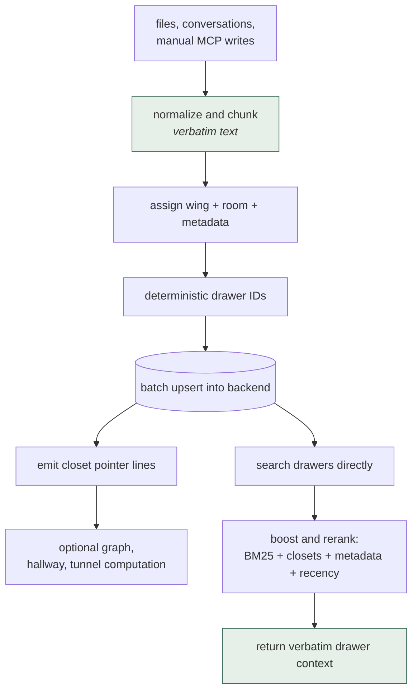
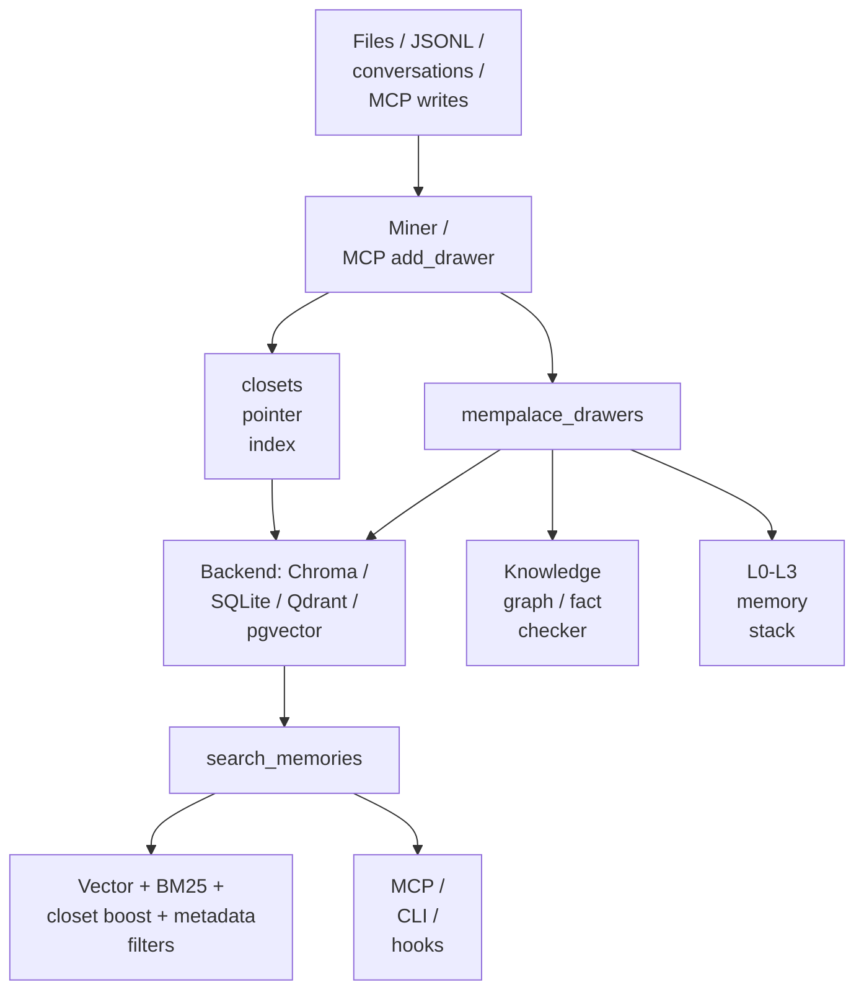

## 1. Executive Summary

`mempalace` is a local-first, verbatim-memory system for coding agents and personal AI workflows. Its core bet is almost the opposite of `mem0`: do not summarize, paraphrase, or LLM-extract the primary memory. Store original text chunks as "drawers", index them with embeddings and metadata, then retrieve the original evidence.

The implementation is broad and operationally mature for a local memory tool:

- ChromaDB default storage, with backend abstraction for `sqlite_exact`, Qdrant, and pgvector.
- Hybrid retrieval combining vector search, BM25 reranking, metadata filters, closet boosts, and fallback SQLite/FTS paths.
- A "palace" information model: wings, rooms, halls, closets, drawers, tunnels.
- MCP server, CLI, hooks for Claude/Cursor/Antigravity, and a wake-up memory stack.
- Knowledge graph, fact-checking primitives, entity registry, dedup, repair, sync, backups, benchmarks, and conformance tests.
- Explicit operational safety rails: embedder identity checks, stdio protection, mine locks, idempotent writes, collision scans, HNSW repair warnings, backend mismatch checks.

The most important design distinction: MemPalace treats verbatim stored text as the authoritative memory layer. Structured layers such as closets and the knowledge graph are indexes or navigation aids, not replacements for the source memory.

Main risk: the system stores large amounts of raw text. That preserves evidence and avoids extraction loss, but it shifts the hard problems to retrieval quality, privacy/deletion, corpus hygiene, and context assembly.

## 2. Mental Model

Primary units:

- `Palace`: local memory root.
- `Wing`: project/person/top-level scope.
- `Room`: topic within a wing.
- `Drawer`: verbatim text chunk. This is the primary searchable evidence.
- `Closet`: compact index/pointer layer that points back to drawer IDs.
- `Hall`: conceptual category inside a wing.
- `Tunnel`: graph connection between related rooms/wings.
- `KG triple`: temporal entity relation stored in local SQLite.

Lifecycle:



Verbatim in, verbatim out — the two highlighted ends are the same commitment.
Nothing between them rewrites the text, so retrieval returns what was stored
rather than a model's account of it.

The system's answer to "what should be remembered?" is conservative: remember the original content first, then let retrieval decide what matters later.

## 3. Architecture

Core files:

- `mempalace/palace/`: shared collection access (`collection.py`), backend resolution, embedder identity, closet helpers, mine and palace locks.
- `mempalace/miner.py`: project/file mining, chunking, room detection, drawer writes, closet generation.
- `mempalace/convo_miner.py`: conversation mining.
- `mempalace/searcher/`: programmatic search (`query.py`), hybrid ranking (`ranking.py`), scope filters (`filters.py`), SQLite BM25 fallback (`sqlite_bm25.py`), CLI search (`cli_search.py`).
- `mempalace/mcp_server/`: MCP tools for search, add/delete/update drawers, mine, graph/KG, diary, sync, status (`tools_read.py`, `tools_write.py`, `tools_kg.py`, `tools_diary.py`).
- `mempalace/backends/base.py`: typed backend contract.
- `mempalace/backends/chroma.py`: default Chroma backend.
- `mempalace/backends/sqlite_exact.py`: local exact-vector backend.
- `mempalace/backends/qdrant.py`, `pgvector.py`, `milvus.py`: external backend adapters.
- `mempalace/layers.py`: 4-layer wake-up/recall/search stack.
- `mempalace/knowledge_graph.py`: temporal SQLite entity-relation graph.
- `mempalace/fact_checker.py`: conservative contradiction/name-confusion checks.
- `mempalace/dedup.py`: near-duplicate drawer cleanup.
- `mempalace/repair.py`: index/schema/extraction repair utilities.

Architecture:



The backend abstraction is unusually explicit. `BaseCollection` and `BaseBackend` define typed result shapes, error classes, health status, maintenance hooks, embedder identity, and isolation contracts.

## 4. Essential Implementation Paths

### Collection and Backend Resolution

`get_collection()` in `palace/collection.py` resolves the configured backend, opens the collection, wraps backends that require explicit embeddings, and enforces embedder identity. This is a critical operational guardrail: a palace indexed with one embedding model should not be silently searched with another.

The backend contract in `backends/base.py` defines:

- `PalaceRef` with `id`, `local_path`, and optional `namespace`.
- backend isolation rules;
- typed `QueryResult` / `GetResult`;
- `EmbedderIdentity`;
- mismatch and capability errors;
- maintenance result semantics.

### Mining and Drawer Writes

`mine()` in `miner.py` acquires a palace-level lock, then `_mine_impl()` scans files, opens drawer and closet collections, and calls `process_file()`.

`process_file()`:

- skips already-mined files by metadata/mtime;
- reads text without following symlinks;
- detects the room;
- chunks text with line metadata;
- enforces a max chunks per file safety rail;
- locks the source file;
- deletes stale drawers for modified files;
- builds deterministic drawer IDs with `make_drawer_id_from_chunk()`;
- batch-upserts documents and metadata;
- collision-checks IDs;
- builds closet pointer lines and upserts them.

This is not a casual ingest path. It is engineered around concurrent agents, large files, HNSW/chroma update hazards, generated-file caps, and reproducible IDs.

### MCP Manual Writes

`tool_add_drawer()` in `mcp_server/tools_write.py` is the hot path for agent-supplied memory. It sanitizes wing/room/content/source metadata, computes a deterministic content-derived logical drawer ID, logs a WAL event, checks idempotency, and writes either a single row or chunked physical rows with `parent_drawer_id`.

Important details:

- oversized content is chunked before embedding;
- batch upsert is all-or-nothing from the caller's perspective;
- the last chunk is probed after write to verify readability;
- chunked logical drawers return both `drawer_id` and `chunk_ids`;
- delete paths handle logical chunk groups.

### Search

`search_memories()` in `searcher/query.py` is the core retrieval implementation.

It:

- validates candidate strategy;
- can route to vector-disabled SQLite/BM25 fallback;
- opens the drawer collection;
- applies wing/room/source metadata filters;
- queries drawers directly as the retrieval floor;
- queries closets separately as a rank signal;
- applies rank-based closet boosts, never as a hard gate;
- computes effective distance;
- enriches closet-boosted hits with neighboring drawer chunks;
- returns source path, created/authored timestamps, similarity, raw/effective distance, and match mode.

The docstring in `searcher/query.py` is a good design rule: closets are a ranking signal, never a gate. This avoids the failure mode where a weak extracted index hides verbatim evidence that direct drawer search would have found.

### Hybrid Ranking

`_hybrid_rank()` in `searcher/ranking.py` combines backend vector similarity with BM25 over candidates:

- vector similarity is derived from backend-declared metric;
- BM25 is Okapi-style over the candidate set;
- BM25 is normalized before fusion;
- authored time breaks exact score ties;
- vector-unknown candidates can still rank by BM25.

This is a pragmatic hybrid retrieval implementation. It is more careful than the common "vector search and hope" baseline.

### Context Assembly

`layers.py` implements a 4-layer stack:

- L0 identity: `~/.mempalace/identity.txt`.
- L1 essential story: top drawers grouped by room, capped around 3,200 chars.
- L2 on-demand recall: wing/room-filtered drawers.
- L3 deep search: semantic search.

This stack is simpler than Letta's runtime memory but useful: bounded startup context plus explicit deeper retrieval.

### Knowledge Graph and Fact Checking

`knowledge_graph.py` stores entities and temporal triples in SQLite with WAL. Triples include:

- `subject`, `predicate`, `object`;
- `valid_from`, `valid_to` — when the fact held;
- `extracted_at`, defaulted to `CURRENT_TIMESTAMP` — when the row was written;
- `confidence`;
- source closet/file/drawer provenance;
- adapter name.

**The last two of those are two different clocks, and the graph queries them
separately.** `_temporal_filter_sql` builds the as-of predicate against the
validity pair, with an upper bound that is deliberately strict — *"a fact whose
`valid_to` equals the query instant has already ended at that instant, so the
interval is treated as half-open `[valid_from, valid_to)`"* — while
`extracted_at` records when the system learned it and is not what the as-of
filter compares. Legacy date-only values are normalised for comparison so a
`valid_from` of `2026-05-06` reads as `T00:00:00Z` and a `valid_to` of the same
date reads as `T23:59:59Z`.

`supersede` is where that asymmetry stops being a footnote. It closes the open
`(subject, predicate, old_obj)` triple with `valid_to = at` and opens the
successor with `valid_from = at` **in one transaction at one identical
instant**. The docstring works through the bug that motivates it: doing the
handover by hand as `invalidate(ended=D)` plus `add_triple(valid_from=D)` with a
date-only `D` leaves the two facts sharing the whole of day `D`, because the
`valid_to` expands to the end of the day and the `valid_from` to its start, so
an as-of query on `D` returns both. Writing one precise boundary to both sides
is the fix, and a date-only `at` is normalised to `T00:00:00Z` rather than left
asymmetric. If no open predecessor exists the successor is opened anyway, so
`supersede` degrades to `add_triple` rather than failing.

### The write-ahead log

`wal.py` appends JSON lines through `os.open(..., O_WRONLY | O_APPEND |
O_CREAT, 0o600)`. `_wal_log` writes an intent line — `{timestamp, operation,
params, result}` with `result` null — before the backend mutation, so the intent
survives a crash inside it. It is called for nine operations: `add_drawer`,
`update_drawer`, `delete_drawer`, `delete_by_source`, `kg_add`,
`kg_invalidate`, `kg_supersede` and `diary_write` from the MCP tools, and
`sync_prune` from `sync`, which the MCP tool, the CLI and the service each hand
the logger as a callable. A bulk delete writes one `delete_drawer` line per id,
marked `bulk`. `_wal_result` appends an outcome-only line after `add_drawer` and
`kg_add`, on success and on the caught failures; the other seven operations
leave only the intent.

The log sees the agent-facing write surface and the sync prune, not every
writer. Mining writes drawers without it, and the plan-then-apply tools in
section 7 rewrite drawer rooms and wings and close graph facts with no line in
it.

Two decisions in it are worth copying. Payload keys — `content`,
`content_preview`, `document`, `entry`, `entry_preview`, `query`, `text` — are
redacted before the line is written, so a drawer or diary line records *what
changed* without carrying the text that changed, which is what lets it be kept
as long as an operator wants. A graph write is the exception: `kg_add` logs
subject, predicate and object in full, and its outcome line repeats the fact as
one string, because `_wal_result` applies none of the redaction its docstring
promises. And `_ensure_wal` deliberately
does not run at import time, because a user who deleted `~/.mempalace` has
engaged the documented kill switch, and recreating the directory on import would
*"silently re-arm the autosave/mining hooks they disabled."*

The limit is stated in the module too: a WAL failure is *"logged and non-fatal,
never crashing the tool call."* The record is best-effort, which is the ordinary
arrangement in this corpus and the opposite of the one
[Veracium](../veracium/) makes, where the audit row committing is a precondition
for the state change.

`fact_checker.py` is conservative. It flags:

- similar-name confusion against known entities;
- relationship mismatch against current KG facts;
- stale facts when matching triples have expired.

The docs explicitly say contradiction detection is not fully integrated end-to-end in the MCP workflow. Treat the KG/fact checker as promising primitives, not a finished trust layer comparable to Verel.

## 5. Data Model and Storage Semantics

Drawer metadata includes fields such as:

- `wing`
- `room`
- `source_file`
- `chunk_index`
- `parent_drawer_id` for logical chunk groups
- `filed_at`
- `authored_at`
- source mtime/content date
- line start/end
- `normalize_version`
- extracted entities/hall metadata
- ID recipe

Important storage properties:

- The primary memory is the document text itself.
- Deterministic IDs make re-mining and duplicate checks tractable.
- Modified files are purged and reinserted to avoid unsafe vector update paths.
- Collections record embedder identity to prevent model-swap corruption.
- External backends are opt-in; local Chroma is default.
- Namespace isolation is explicitly part of the backend contract for remote backends.

## 6. Retrieval and Ranking

MemPalace's retrieval has several layers:

1. Direct drawer vector search.
2. Candidate BM25 reranking.
3. Optional lexical candidate union where backend supports it.
4. Closet lookup for source-level boost.
5. Metadata filters for wing, room, source file.
6. Neighbor chunk expansion.
7. SQLite/FTS fallback when vector/HNSW is unavailable or unsafe.

This is one of the better retrieval implementations in the workspace because it assumes vector retrieval will fail in boring ways:

- exact terms matter;
- source-level match can point to a better neighboring chunk;
- HNSW indexes can diverge or become unsafe;
- backend distance metrics must be declared;
- adding lexical candidates should not silently bypass distance filters.

## 7. Update, Correction, and Deletion

Update/deletion is mostly storage-level, not epistemic:

- `tool_delete_drawer()` deletes a logical drawer or chunk group by ID.
- `tool_delete_drawers()` and `tool_get_drawers()` take 1 to 500 ids per call; each delete runs the single-id path, closet purge and WAL line included.
- `tool_delete_by_source()` removes mined content from a source file.
- `tool_update_drawer()` can update content and metadata.
- `dedup.py` removes near-duplicate drawers by source group.
- `repair.py` handles index/schema recovery.

Contradiction handling is not a central write-time memory policy. The knowledge graph has temporal invalidation, and the fact checker can detect some relationship/stale conflicts, but normal drawer memory remains verbatim evidence. This is appropriate for its design: it avoids rewriting memory into false certainty, but it also means the system needs retrieval and context consumers that can reason over conflicting raw evidence.

**Plan-then-apply repair.** `mempalace audit` scores a palace on rooms, naming,
tunnels, hallways and the graph, and the CLI repairs what it finds in two steps:
`rooms propose|apply`, `wings split`, `tunnels propose|prune` and `kg normalize`
write a plan or print a dry run, and `--yes` carries it out. `kg normalize`
has a model map each off-vocabulary predicate onto a closed list of eight and
applies each row through `KnowledgeGraph.rewrite`, which closes the original and
opens its rewording at one instant with the original's provenance and
confidence, and writes nothing if the fact was closed after the plan was made.
Nothing is deleted, so an as-of query before the boundary returns the original
wording.

The plan file is a review surface, not a gate. The packaged audit instructions
tell the agent to show each plan, ask the user one question at a time and then
run `--yes` itself, and nothing in the CLI checks who runs it, so approval is a
convention the agent is asked to keep and `human_review` is withheld.

## 8. Trust, Provenance, and Safety

Strengths:

- Verbatim evidence is retained.
- Drawers link to source file, chunk, authored/filed time, line spans, parent IDs.
- KG triples carry source fields.
- MCP server has read-only mode.
- Content and metadata are sanitized.
- The MCP server protects JSON-RPC stdio from dependency stdout pollution.
- Local-first default keeps data on machine unless a remote backend is chosen.

Weaknesses:

- There is no first-class trust state like candidate/verified/rejected for drawers.
- Raw recalled text is not inherently fenced as untrusted data in the same way as Verel's recall renderer.
- Fact-checking is conservative and partial.
- Large verbatim stores increase privacy/deletion burden.

Compared with extraction-first systems, MemPalace preserves provenance better because the source content is the memory. Compared with Verel, it has less epistemic machinery.

## 9. Extensibility and Operations

MemPalace is strong operationally:

- Backend registry and conformance tests.
- CLI, MCP stdio/HTTP, Docker, hooks, commands, skills, and integrations.
- Repair/migrate/sync/export/backups.
- Benchmarks and benchmark-result artifacts.
- Embedder identity and dimension checks.
- Palace locks and per-file mine locks.
- HNSW capacity and metric checks.
- WAL logging for MCP writes.

This is a system built by people who have hit local-agent failure modes in practice.

## 9a. The shared brain, and the line it draws through itself

The fleet layer is split from the memory on exactly the axis this atlas uses. From
`website/guide/shared-brain.md`:

| | Memory (drawers, KG, diary) | Logstream (events, artifacts) |
| --- | --- | --- |
| Holds | Durable knowledge worth recalling | Active work moving between agents |
| Access | Semantic search | Structured filters + long-poll |
| Examples | Decisions, facts, people, outcomes | Delegations, replies, patches, acks |

> Rule of thumb: if another agent should **act** on it, it's an event. If a
> future session should **know** it, it's a drawer.

That is the memory/coordination boundary in one sentence, and it is load-bearing
here rather than decorative: **one hub process owns the palace**, and the fleet
— local Claude and Codex over stdio, remote agents over HTTPS with a bearer
token — connects to it over MCP. The memory is centralised. What replicates
between palaces is the *logstream*: `logsync.py` is a pull-based anti-entropy
engine that diffs version vectors and pulls missing per-origin op ranges,
artifacts first *"so referenced ids never dangle,"* with no push path and no
coordinator.

`hlc.py` is the ordering primitive under it — a hybrid logical clock rendered as
`<unix_ms:13>-<counter:6 hex>-<replica_id>` so that *"SQLite TEXT comparison IS
the causal comparison"* — and it carries the distinction most implementations of
this get wrong:

> Cursor semantics stay LOCAL (rowid arrival order) […] a tail consumer must see
> late-arriving remote ops even though their HLC is older. HLC is the
> *display/merge* order; arrival is the *delivery* order.

Conflating those two is how a consumer silently skips a remote op whose
timestamp sorts before its cursor. Naming them as separate orders, in the
module's own docstring, is the kind of care this atlas usually has to reconstruct
from a bug report.

**None of it earns a mark, and the reason is the boundary the project itself
drew.** The logstream is append-only with immutable events and corrections that
reference prior ones, which is the shape of an audit log — but what it records is
delegations, replies and patches between agents, not changes to the memory
store. The mutations of memory go to the WAL in section 4.

## 10. Tests and Evidence

The repo has broad test coverage:

- search and hybrid candidate union;
- backends and backend conformance;
- Chroma/Qdrant/pgvector/sqlite exact;
- MCP server and HTTP transport;
- mining, conversation mining, format mining;
- hooks for Claude/Cursor/Antigravity;
- locks, repair, sync, backups;
- knowledge graph, fact checker, entity registry;
- line numbers, authored-at backfill, dedup, collision scan;
- benchmarks.

Nothing was installed, built or run for this report; everything below is from
reading the tests at the pin.

**Negative retrieval cases.** The suite asserts that particular material must not
come back, on the graph's as-of read and on drawer search, and all but one case
carry a positive control, so a filter that returned nothing would fail them. In
the graph, `TestSupersessionBoundary` writes a fact and its successor sharing one instant and asserts that
`query_entity` returns exactly the predecessor one second before the boundary and
exactly the successor at it (`tests/test_knowledge_graph.py:364-404`); the
superseded fact is the excluded material. A second pair, on the shared
`seeded_kg` fixture, asserts an employer returned at one date and excluded at
another, with the other employer as control (`:102-112`).

In the searcher, `test_source_file_filter_excludes_other_sources` asks a
four-drawer palace for five results under one `source_file`, so an unfiltered
query would return all four, and asserts a non-empty result holding only that
source. Its companion puts a strong closet behind a different source and asserts
that source stays out, with a subset check that an empty result also passes
(`tests/test_hybrid_search.py:188-221`). At the backend,
`test_sqlite_exact_lexical_search_filters_after_full_fts_window` fills the
lexical window with twelve identical drawers in another wing and asserts the one
in-scope drawer is the only hit (`tests/test_sqlite_exact_backend.py:388-400`),
and `assert_partition_isolation` writes a record to one palace and asserts that a
query, get or count through another palace does not return it and that the
writer keeps it, for each local backend (`tests/_backend_conformance.py:19-60`).

All of them are collected: `testpaths` is `tests`, and the only deselected
markers are `benchmark`, `slow` and `stress`, which none of them carries. The CI
workflow runs `pytest tests/ --ignore=tests/benchmarks` on every push and pull
request to `main` and `develop`. An autouse fixture replaces the embedder with a
hash-based stub (`tests/conftest.py:112-141`), so these cases test the filters
against real ChromaDB and SQLite, not the shipped model's ranking. The wing and
room cases in `tests/test_searcher.py:79-89` assert `all(...)` over the results
and would pass on an empty list.

The benchmark docs make strong claims, but also include caveats about metric comparability and overfitting. The most important internal result for design purposes is not the headline score; it is the empirical argument that verbatim storage plus good retrieval is a strong baseline before adding LLM extraction.

## 11. For Your Own Build

### Steal

Best fit:

- local coding-agent memory;
- Claude/Cursor/Gemini-style session retention;
- project knowledge recall;
- offline/private memory;
- evidence-preserving retrieval;
- benchmarked retrieval experiments.

Less ideal:

- systems requiring compact canonical user profiles;
- cases where the application needs verified facts rather than raw evidence;
- hosted multi-user SaaS memory without additional privacy/tenant controls;
- small agents that need a minimal memory primitive.

MemPalace is closest to `engram` in local-first spirit, but much broader and more retrieval/benchmark heavy. It is closest to `verel` in caring about correctness, but chooses preservation of evidence over explicit trust-state promotion.

### Avoid

Patterns worth borrowing:

- Store raw evidence before extracting anything.
- Make metadata scopes human-legible.
- Use lexical and vector retrieval together.
- Treat extracted/indexed summaries as boosts, not gates.
- Record embedder identity with the index.
- Use deterministic IDs for reproducible mining.
- Add repair and fallback paths for local vector stores.
- Validate writes by reading after write.
- Include benchmark fixtures and failure-analysis notes.

Antipatterns avoided:

- Throwing away source context after fact extraction.
- Vector-only retrieval.
- Silent embedding-model swaps.
- Agent-facing MCP tools that corrupt stdio.
- Concurrent mining without locks.

Remaining risks:

- Raw memory can become huge and noisy.
- Retrieval can surface contradictory evidence without resolving it.
- Context assembly may still inject raw text as if it were safe instruction unless callers fence it.
- Deletion must chase drawers, closets, KG triples, backups, and remote backends.

### Fit

Borrow aggressively:

- verbatim drawer baseline;
- hybrid retrieval;
- closet-as-boost-not-gate principle;
- embedder identity checks;
- deterministic drawer IDs;
- MCP stdio hardening;
- local repair/fallback tooling;
- benchmark discipline.

Do not copy blindly:

- the full palace metaphor if your users do not need it;
- Chroma-specific recovery paths if using another store;
- raw-everything retention without privacy controls;
- claims about retrieval benchmarks as if they prove end-to-end answer quality.

For your own memory system, MemPalace is the strongest reminder that extraction is not always the right first step. A serious system should first prove that raw evidence plus hybrid retrieval is insufficient before adding lossy LLM memory synthesis.

## 12. Open Questions

- How well does the raw-drawer approach behave at very large personal-memory scale?
- What is the best UX for resolving contradictory drawers?
- How integrated will KG/fact-checking become with MCP write/search flows?
- How expensive is hybrid candidate union on each backend at scale?
- How reliably do hooks capture all important agent context across tools?
- What is the deletion story across drawers, closets, KG, backups, and sync?

## Appendix: File Index

- Core collection/backend access: `mempalace/palace/collection.py`, `mempalace/palace/backend.py`.
- Backend contract: `mempalace/backends/base.py`.
- Default backend: `mempalace/backends/chroma.py`.
- Other backends: `mempalace/backends/sqlite_exact.py`, `rust_exact.py`, `qdrant.py`, `pgvector.py`, `milvus.py`.
- Mining: `mempalace/miner.py`, `mempalace/convo_miner.py`, `mempalace/format_miner.py`.
- Search: `mempalace/searcher/` — `query.py`, `ranking.py`, `filters.py`, `candidates.py`, `sqlite_bm25.py`, `cli_search.py`.
- MCP server: `mempalace/mcp_server/` — `tools_read.py`, `tools_write.py`, `tools_kg.py`, `tools_diary.py`.
- Write-ahead log: `mempalace/wal.py`.
- Context stack: `mempalace/layers.py`.
- Graph: `mempalace/palace_graph.py`, `mempalace/hallways.py`, `mempalace/knowledge_graph.py`.
- Fact checking: `mempalace/fact_checker.py`.
- Dedup/repair/sync: `mempalace/dedup.py`, `repair.py`, `sync.py`.
- Audit and plan-then-apply repair: `mempalace/palace_audit.py`, `rooms.py`, `wing_split.py`, `tunnels_tool.py`, `kg_normalize.py`, `mempalace/instructions/audit.md`.
- Fleet layer: `mempalace/hlc.py`, `logstream.py`, `logsync.py`, `replica.py`.
- Benchmarks: `benchmarks/`.
- Tests: `tests/`; negative cases in `tests/test_knowledge_graph.py`, `tests/test_hybrid_search.py`, `tests/test_sqlite_exact_backend.py`, `tests/_backend_conformance.py`.

Searches run at the pin, from the repository root:

```sh
grep -rn '_wal_log(\|_wal_result(\|wal_log(' mempalace
grep -n -E '\bwal\b|_wal_|from \.+wal' mempalace/miner.py mempalace/convo_miner.py mempalace/rooms.py mempalace/wing_split.py mempalace/kg_normalize.py mempalace/tunnels_tool.py
grep -rn -E 'assert .*not in ' tests --include='*.py'
grep -n -A12 '\[tool.pytest' pyproject.toml
grep -n 'pytest' .github/workflows/ci.yml
grep -n -E 'isatty|input\(|getuser|getpass|confirm|MEMPALACE_' mempalace/cli/cmd_kg.py mempalace/cli/cmd_rooms.py mempalace/cli/cmd_wings.py mempalace/cli/cmd_tunnels.py
```

## History

**2026-09-26** — [`8c4865f70c49b6346c53474a9e5684c5f17d3fa9`](https://github.com/MemPalace/mempalace/commit/8c4865f70c49b6346c53474a9e5684c5f17d3fa9) — read at the head of `develop`, 13 commits past the previous pin. `negative_eval` added as a correction, not new capability: the as-of pair and the source-filter and lexical-window cases existed at the first pin and the supersession-boundary cases from the second, each asserting excluded material beside a positive control ([section 10](#10-tests-and-evidence)). The other three marks held. The WAL gained an outcome line after `add_drawer` and `kg_add`; it logs nine operations, not eight, since `sync_prune` was already wired, and a graph write logs the triple unredacted ([section 4](#the-write-ahead-log)). New: bulk get and delete, and plan-then-apply repair tools that write no WAL line ([section 7](#7-update-correction-and-deletion)). File paths corrected to the `palace/`, `searcher/` and `mcp_server/` packages. Screened first: five auto-run surfaces, two build-time execution points, two unpinned surfaces, none in the cooldown. Nothing was installed, built or run.

**2026-09-16** — [`25203ed6ee1a739103a77e87219a1f679dee81e9`](https://github.com/MemPalace/mempalace/commit/25203ed6ee1a739103a77e87219a1f679dee81e9) — re-read at a commit dated 16 September 2026, 146 commits past the previous pin. All three marks re-tested and held. `mempalace/searcher.py` is gone as a file and back as a package: the 2,267-line module was split into `mempalace/searcher/`, and the scope predicate came out of it better placed than it went in. `build_where_filter(wing, room, source_file)` now lives in one fragment and is called from three read paths — the vector query, the SQLite BM25 arm and the CLI search — so all three narrow through the same builder rather than each assembling its own clause. The fragments refuse to be imported on their own, raising `ImportError` unless loaded into the package namespace. The write-ahead log is unchanged except for where it lives, moving from a hardcoded `~/.mempalace` to the configured directory, and the validity columns are threaded through the new entity-candidate lookups, which carry `valid_from`, `valid_to` and a derived `current` rather than dropping them. Screened before reading, from a full clone: five auto-run surfaces, two build-time execution points, two unpinned dependency surfaces and five dependency files inside the seven-day cooldown. Nothing was installed, built or run.


**2026-08-30** — [`a9f345cc63254eb4dea7abad36963b85c9f8453a`](https://github.com/MemPalace/mempalace/commit/a9f345cc63254eb4dea7abad36963b85c9f8453a) — re-pinned 452 commits on, and the marks go from one to three. **Both additions are corrections rather than new capability: each mechanism was present at the first pin and neither was credited.**

`bitemporal` was missed on a column the first reading's own field list left out. A `triples` row carries `valid_from` and `valid_to` — which that list records — beside `extracted_at DEFAULT CURRENT_TIMESTAMP`, which it does not, and the two are separate axes queried separately: `_temporal_filter_sql` runs the as-of predicate against the validity pair with a half-open upper bound, while `extracted_at` holds when the row was written. Both columns exist at the earlier commit. Section 6 now carries them and the `supersede` primitive that closes a predecessor and opens its successor at one identical instant, with the date-only boundary bug the docstring works through.

`audit_log` was missed on a module that has since moved rather than appeared. `_wal_log` was called nine times from `mcp_server.py` at the first pin and now lives in its own `wal.py` with eight call sites, appending one JSON line per write through `O_APPEND` at mode `0600`. The operations are the memory mutations — `add_drawer`, `update_drawer`, `delete_drawer`, `delete_by_source`, `kg_add`, `kg_invalidate`, `kg_supersede`, `diary_write` — with payload keys redacted before the line is written. The mark's caveat is in the module: a WAL failure is *"logged and non-fatal, never crashing the tool call."*

**What actually is new is a fleet layer, and it earns nothing on purpose.** Fifteen new modules — `hlc.py`, `logstream.py`, `logsync.py`, `replica.py`, `transport.py`, `server_registry.py`, `mcp_proxy.py`, `tasks.py`, `write_routing.py`, a Milvus backend among them — build a shared hub: one host owns the palace, a fleet of local and remote agents connects over MCP, and an anti-entropy engine replicates the *coordination log* between palaces. Section 9a describes it, including the hybrid logical clock's distinction between merge order and delivery order. The logstream is append-only and immutable and still not an `audit_log`, because what it records is delegations and patches between agents rather than changes to the memory — a line the project's own documentation draws better than this report had: *"if another agent should act on it, it's an event. If a future session should know it, it's a drawer."*

`stack_source` promoted from `seeded` to `reviewed`, and `milvus` added to the storage census. The repository's canonical path resolves as `MemPalace/mempalace` again, so the rename recorded below has reverted. Screened again first: five auto-run surfaces — a plugin directory, a devcontainer, two MCP manifests and a hooks directory — two build-time execution surfaces and one unpinned surface; nothing was installed and nothing was run.
**2026-08-09** — the repository now lives at `milla-jovovich/mempalace` and `MemPalace/mempalace` redirects to it; the pin below resolves unchanged. Recorded because an outside corpus listed the new path as an uncovered system, and a join on `source_url` cannot see an owner change.

**2026-07-26** — [`afd0428823b47f9a9d1d68c450d54bb0045a4988`](https://github.com/MemPalace/mempalace/commit/afd0428823b47f9a9d1d68c450d54bb0045a4988) — first reading.
