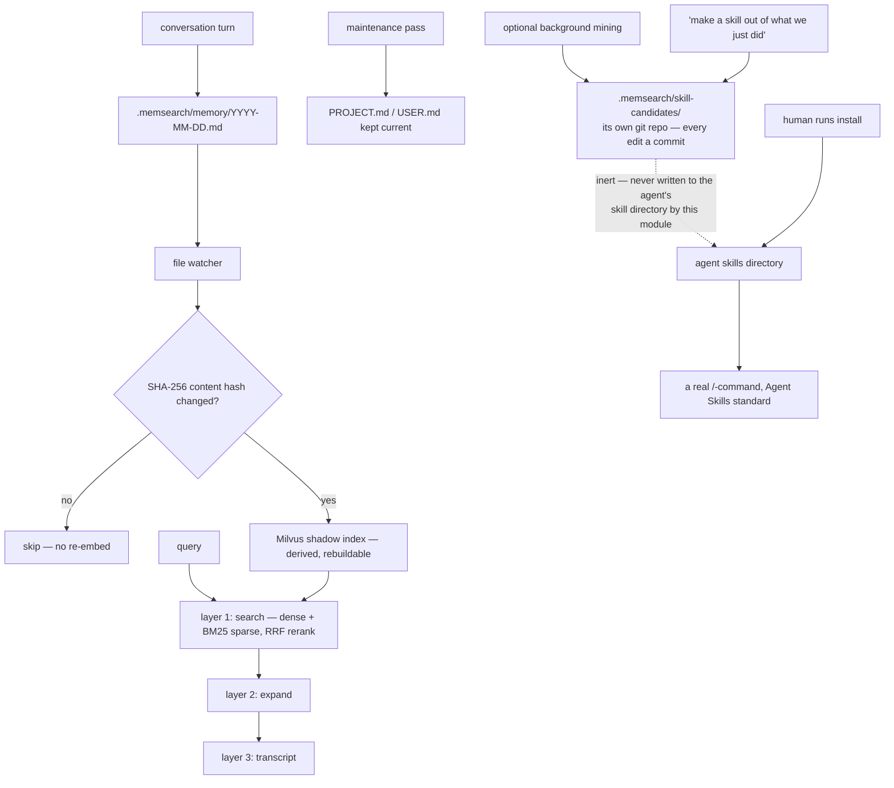

## 1. Executive Summary

MemSearch is Zilliz's agent-memory layer: markdown journals captured
automatically from conversations, indexed into Milvus, with plugins for Claude
Code, OpenClaw, OpenCode and Codex CLI so "a conversation in one agent becomes
searchable context in all others".

**Two things here are worth other people's attention.**

**First, the mark of a distilled skill is that it does nothing.**
`src/memsearch/skills.py` distils recurring multi-step workflows from the
journals into *candidates*, and the docstring is categorical:

> "Candidates are **inert**: they are never written into an agent's skills
> directory by this module. Turning a candidate into an agent-visible skill is a
> separate, human-driven step… The candidate store is a self-contained git
> repository at `.memsearch/skill-candidates/` so every automatic edit is a
> commit with full history, diff, and revert — the agent (or a human) can trace
> which change broke a skill and roll it back."

The README adds that the feature is **off by default** and enabled by asking the
agent to enable it.

This atlas has read several systems that learn procedures from experience and
then execute them. The gap between *distilled* and *installed* is where the risk
lives — a workflow mined from a session the model misread becomes a
`/`-command — and MemSearch puts a person in it, gives the candidate store its
own git history so a bad distillation is diffable and revertible, and ships the
whole thing disabled.

**Second, a vector-database vendor is telling you the vector database is
derived:**

> "**Markdown is the source of truth** — inspired by OpenClaw. Your memories are
> just `.md` files — human-readable, editable, version-controllable. Milvus is a
> 'shadow index': a derived, rebuildable cache."

Zilliz builds Milvus. Naming their own product the disposable half — the thing
you can delete and rebuild from the files — is the correct architecture and it
costs them the lock-in.

**And the evaluation is built the right way round** — section 10.

## 2. Mental Model

Conversation turns are captured into daily markdown journals. A watcher indexes
them into Milvus. Recall proceeds in three widening layers. Alongside the
episodic journals, durable `PROJECT.md` and `USER.md` notes hold the semantic
layer, and repeated workflows can be distilled into a third, procedural one.

## 3. Architecture

`src/memsearch/` is compact and legible: `chunker`, `scanner`, `watcher`,
`store`, `embeddings/`, `reranker`, `transcript`, `compact`, `maintenance`,
`skills`, `index_state`, `index_report`, `io`, `core`, `cli`, `config`,
`prompts/`.

`index_state.py` and `index_report.py` exist for "index health state used by CLI
and plugin diagnostics", with an `IndexFailure` type and a `.index-state.json` —
so a stale or broken index is a diagnosable condition rather than silently
degraded recall. For a design where the index is explicitly disposable, knowing
whether it is currently trustworthy is the necessary companion piece.

`plugins/` carries four separate integrations, each with its own README.
19,600 lines of Python, 31 test files, and an mkdocs site.

## 4. Essential Implementation Paths

**Distil and gate** — `src/memsearch/skills.py` (the inertness contract and the
git-repo rationale `:1-16`, `install`).

**Index** — `src/memsearch/watcher.py`, `scanner.py`, `chunker.py`,
`store.py`, `index_state.py`, `index_report.py`.

**Retrieve** — `src/memsearch/core.py`, `reranker.py`, `transcript.py`.

**Maintain** — `src/memsearch/maintenance.py`, `compact.py`.

**Evaluate** — `evaluation/README.md`.

## 5. Memory Data Model

Three layers, named as such: **episodic** daily journals, **semantic**
`PROJECT.md` and `USER.md`, and **procedural** skill candidates. Chunking is by
markdown heading, and identity is a SHA-256 of the content so an unchanged chunk
is not re-embedded.

There is no status field, no confidence, no supersession pointer and no
tombstone on a memory. The markdown is editable and version-controllable, which
is the intended correction path, and — unlike [DiffMem](../diffmem/) — the
project does not claim git as part of the memory model, so a corrected journal
entry simply reads differently.

The one place a state distinction exists is the procedural layer:
**candidate** versus **installed**. That is a real epistemic boundary — a
candidate is a hypothesis about a workflow, an installed skill is something the
agent will run — and it is the distinction most procedural-memory systems in
this atlas collapse.

## 6. Retrieval Mechanics

Three-layer progressive recall — "search → expand → transcript" — with dense
vectors plus BM25 sparse and RRF reranking at the first layer, widening only as
needed. Widening on demand rather than retrieving a large window up front is the
cheaper shape and the one that keeps the transcript out of context unless the
answer needs it.

**Scope is the project directory.** One `.memsearch/` store per project; no
stored scope key reaches a query, so `scope_enforced` is not earned. The
cross-agent story is that four plugins share *one* store, which is the opposite
of isolation and is the point.

## 7. Write Mechanics

Capture is automatic per conversation turn. The SHA-256 hash gate means a
re-scan does no embedding work on unchanged content, which is what makes a live
file watcher affordable.

The maintenance pass keeps `PROJECT.md` and `USER.md` current — an LLM rewriting
durable notes in the background, which is the usual risk shape and is here at
least confined to two named files a person can read and revert.

## 8. Agent Integration

Four plugins, one memory. `/plugin marketplace add zilliztech/memsearch` for
Claude Code, with equivalents for the others, plus a CLI and a Python API for
building it into your own agent. Distilled skills follow the
[Agent Skills](https://agentskills.io) open standard, "so one capture is
portable across Claude Code, Codex, OpenCode, and others".

The verification instruction in the README is a small good habit: after a few
conversations, `ls .memsearch/memory/` and `cat` today's file. Telling a user how
to see that the thing is working, in files they can read, is better than a status
command.

## 9. Reliability, Safety, and Trust

**One mark: human review**, for the candidate-to-installed gate described in
section 1. It is a strong instance — the gate is architectural (a separate
module boundary, not a flag), the candidate store is independently versioned so
the review has a diff to work from, and the feature ships off.

**Trust state — withheld**, narrowly. The candidate/installed distinction is
about a *skill*, not about whether a memory is true, and nothing marks a journal
entry or a durable note as doubtful.

**Tombstone, bitemporal, audit log, scope, negative eval — no.**

**The risk is the maintenance pass**, not the skills. Skill distillation is
gated, disabled by default and revertible; the background rewriting of
`PROJECT.md` and `USER.md` is none of those things, and those two files are what
the agent reads as durable truth. A distilled skill you never install cannot hurt
you; a durable note quietly rewritten can.

## 10. Tests, Evals, and Benchmarks

**No paper and no retrieval benchmark — but a real evaluation of the decision
that mattered**, and it is built the right way round.

`evaluation/README.md` selects the default embedding provider. The dataset is
**not** a public benchmark: it is built from the project's own memory logs
"collected across 12 projects", chunked with the system's own
`chunk_markdown()`, cleaned (HTML comments stripped, chunks under 50 characters
dropped, paths, IPs and tokens sanitised), annotated by `gpt-5-mini` into three
question kinds — simple, complex, and multi-hop across related chunks — and
translated so the same set exists in Chinese and English. **955 chunks × 2,172
queries.**

Twelve models across four categories (API, local PyTorch, Ollama, plus ONNX
variants) with their sizes in the table, scored on Recall@1/5/10, MRR and
NDCG@10 — and the primary metric is chosen from the product, not from
convention:

> "For the Claude Code plugin use case (user typically sees top 3-5 results),
> **Recall@5** is the primary metric, with **MRR** as secondary."

The result makes the engineering trade visible: `bge-m3` PyTorch at 1.7 GB scores
0.783 Chinese Recall@5; the ONNX int8 build at 558 MB scores 0.776 — three times
smaller for seven thousandths — and both beat `text-embedding-3-large` at 0.750.
The stated goal included "run locally without an API key or GPU, and have a small
dependency footprint", so the table is answering the question the goal posed.

**Evaluating on your own production data, for the specific decision you have to
make, with the metric your interface implies, is better than a leaderboard
number** — and it is what this atlas has been asking benchmark sections to do.

What is *not* evaluated is everything downstream of the embedder: the three-layer
recall, the RRF fusion, the chunking, or whether distilled skills are correct.
31 test files cover the code.

**I ran nothing.** The figures above are read from `evaluation/README.md`.

## 11. For Your Own Build

### Steal

- **Make a distilled procedure inert until a person installs it.** Enforce it at
  a module boundary — "never written into an agent's skills directory by this
  module" — not with a config flag, and ship the feature off.
- **Give the candidate store its own git repository.** Every automatic edit
  becomes a commit, so a bad distillation is diffable, traceable and revertible,
  and the human doing the review has something to review.
- **Say which layer is the source of truth and which is a cache.** "Milvus is a
  shadow index: a derived, rebuildable cache" — and then make sure deleting it
  really is safe.
- **Ship index-health diagnostics with a disposable index.** If the index can be
  stale, `.index-state.json` and an `IndexFailure` type are what turn degraded
  recall from a mystery into a status line.
- **Hash content and skip unchanged chunks.** SHA-256 identity is what makes a
  live file watcher affordable.
- **Widen retrieval in layers.** Search, then expand, then transcript — the
  expensive context is only paid for when the cheap layer did not answer.
- **Build your evaluation set from your own data.** Twelve projects' real memory
  logs, chunked by the system's own chunker, with simple, complex and multi-hop
  questions generated over them, in both languages your users write in.
- **Choose the primary metric from your interface.** "The user typically sees top
  3-5 results, so Recall@5 is primary" is a better justification than any
  convention.
- **Put model sizes in the comparison table.** 558 MB at 0.776 against 1.7 GB at
  0.783 is the row that decides the default, and it is only visible because size
  is a column.
- **Tell users how to verify with `ls` and `cat`.**

### Avoid

- **Do not gate the safe path and leave the dangerous one open.** Skill
  distillation is gated, off by default and revertible; the background rewriting
  of `PROJECT.md` and `USER.md` is automatic and those are the files read as
  durable truth.
- **Do not stop the evaluation at the embedder.** The chunker, the three-layer
  widening and the RRF fusion all shape recall, and the careful methodology built
  for one choice would transfer to them directly.

### Fit

A good fit if you use more than one agent CLI and want them to share one memory —
that is the differentiator, and four maintained plugins is more than anyone else
in this atlas ships. Markdown as truth means adopting it is reversible.

`evaluation/README.md` and `skills.py`'s docstring are the two files worth
reading regardless: one is a model for choosing a component with evidence, the
other is the clearest statement in this corpus of where a person belongs in a
procedural-memory loop.

## 12. Open Questions

- **What does the maintenance pass do to a note a user edited by hand?** The
  markdown is the source of truth and a background LLM also writes it.
- **How are recurring workflows detected?** The mining pass is described in the
  README; the recurrence criterion was not traced.
- **Is the three-layer recall evaluated anywhere?** The embedder evaluation is
  thorough and stops before the pipeline.
- **Do the four plugins capture identically?** One memory across four agents
  depends on it.

## Appendix: File Index

**Skills** — `src/memsearch/skills.py` (the inertness contract, the human-driven
install step, and the git-repo candidate store `:1-16`)

**Index** — `src/memsearch/watcher.py`, `scanner.py`, `chunker.py`,
`store.py`, `index_state.py` (`INDEX_STATE_FILENAME` `:14`),
`index_report.py` (`IndexFailure`, `IndexReport`), `embeddings/`

**Retrieval** — `src/memsearch/core.py`, `reranker.py`, `transcript.py`

**Maintenance** — `src/memsearch/maintenance.py`, `compact.py`

**Evaluation** — `evaluation/README.md` (the goal and its practical constraints
`:5-7`, the dataset pipeline `:9-23`, the twelve models with sizes `:25-45`, the
metrics and the primary-metric justification `:47-56`, the results table `:58-`)

**Plugins** — `plugins/claude-code/`, `plugins/openclaw/`,
`plugins/opencode/`, `plugins/codex/`

**Documentation** — `README.md` (the shadow-index stance, the skills section and
its off-by-default note), `MEMORY.md`, `AGENT.md`, `CLAUDE.md`

## History

**2026-08-09** — [`b734a142ea017657959dfe918ecfe9e1a16c6654`](https://github.com/zilliztech/memsearch/commit/b734a142ea017657959dfe918ecfe9e1a16c6654) — first reading. Screened before reading; the tree was read, never installed, and no evaluation was run.
