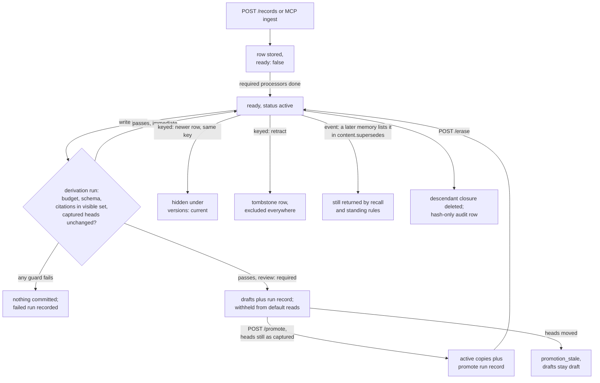

## 1. Executive Summary

Memseek is a self-hosted context engine for agents. An operator writes a
catalog of YAML declarations — collections, derivations, views, artifacts and
an MCP tool allowlist — and publishes it to a workspace. Memseek then stores
immutable records in Postgres, runs bounded LLM derivations over them in a
worker, and renders cited, token-budgeted context.

What is notable is how much the runtime refuses. A derived record may cite only
ids its run was shown. A run commits only if its captured heads still hold. A
review-required emission stays draft until an explicit promotion that is not on
the agent's tool surface.

What is weak sits at two seams. One workspace key authorises every route, and the
MCP ingest bridge forwards fields its own tool schema omits. The flagship
agent-memory catalog records supersession of atomic memories as a content array
that no read filters on.

**The design is a compiler, and the memory is whatever the catalog says.** The
engine knows records, keys, statuses, provenance edges and runs; it does not know
facts, preferences or beliefs. `examples/agent_memory_catalog/` is the four-layer
agent memory the README and the Claude Code plugin point at: messages, atomic
memories, scene blocks and persona, plus a reviewed procedure pipeline. It ports
the [TencentDB Agent Memory](../tencentdb-agent-memory/) L0–L3 design
(`docs/agent-memory-l0-l3-plan.md`). This report reads the engine and that
catalog, because the engine's guarantees reach an agent only through a catalog.

**Relation to [MemBukkit](../membukkit/).** Both are published by `memseekai`.
Memseek shares no code with MemBukkit and does not depend on it:
`pyproject.toml` and `uv.lock` do not name it, and nothing under `src/`, `tests/`
or `conf/` mentions it. The relation is a plan and a website.
`docs/membukkit-integration-plan.md` proposes a `membukkit@1` search method and
calls itself *"an implementation plan, not a claim that the method already
ships"*. `SearchProfileDefinition` accepts only a `pg` or `turbopuffer` backend,
with no method field (`src/memseek/definitions/models.py:433-445`). The
benchmark figures in `marketing/src/lib/benchmark-data.ts` are MemBukkit's
LongMemEval-S runs, not measurements of Memseek.

Five marks: `trust_state`, `scope_enforced`, `audit_log`, `human_review` and
`negative_eval`. Section 9 names the two withheld and the limits on each award.

## 2. Mental Model

A record becomes retrievable in three steps, and a belief only in the sense a
catalog gives it. Ingest writes an immutable row. The row stays `ready: false`
until the collection's required processors, usually an embedding, have run, and
until then no search and no trigger sees it (`src/memseek/records.py:891`). Once
ready, it is visible to every view whose scope matches, and write triggers may
enqueue derivations that read it.

**A derived record is a claim with a receipt.** A derivation captures an
Evaluation Basis before any task runs: the driving source's checkpoint and ids,
guarded current reads, and the active keyed heads at its destination. Its LLM
tasks see rendered rows whose ids are the only ones they may cite
(`src/memseek/derive/candidates.py:120-149`). At commit the runtime re-verifies
the basis, writes a `_system` run record, and writes each output with
`derived_from = (run_id, *citations)` (`src/memseek/derive/runner.py:1343-1472`).
A run that overspends, cites an id it was not shown, or finds its heads moved
commits nothing.

**Status separates what is on record from what is in force.** `status` is
`active` or `draft` (`migrations/001_init.sql:21-22`). A derivation declaring
`review: required` writes drafts. Every default read predicate asks for `active`,
so a draft is stored, inspectable through `GET /runs/{id}` and the document
route with `status=draft`, and absent from search and rendered context.
`POST /promote` copies a complete draft Candidate Set into new active successors
and never mutates the drafts (`src/memseek/promote.py:1-7`).

**How a record stops being current depends on the collection's mode.** In a
keyed collection the newest row per entity, collection, key and status is
current. A successor hides its predecessor under `versions: current`, the default
(`src/memseek/search/scope.py:80-91`). A retraction is a keyed row with
`content.tombstone = true`, excluded by every read. In an event collection
nothing supersedes anything at the engine level. The agent-memory catalog's L1
`memories` collection is an event collection. Its merge decision writes the
replaced ids into `content.supersedes`, and no view hides a memory named there
(section 6).

**Erasure is the only death.** `POST /erase` deletes a record's full descendant
closure and leaves a hash-only audit row. Nothing decays or expires except
retention purges of tombstoned keyed slots, which the catalog declares.

## 3. Architecture

A FastAPI service (`src/memseek/api.py`) and a worker (`src/memseek/worker.py`)
share one Postgres with pgvector. The schema is one `record` table carrying every
record, run and erasure receipt, plus `job`, `cursor`, `workspace_catalog`,
`artifact_use`, `backfill`, `record_embedding` and the Computer tables
(`migrations/001_init.sql`; `alembic/versions/0002`–`0010`). A workspace is a row
holding a SHA-256 of its API key, and every route resolves the workspace from the
bearer and the catalog published to it (`src/memseek/api.py:193-215`).

**The catalog is the program.** `src/memseek/definitions/loader.py` (4,461 lines)
compiles a directory of YAML into hashed definitions. A collection's record
contract is hashed separately, so a changed schema cannot silently reinterpret
stored rows (`src/memseek/definitions/hashing.py:86-99`). Tasks are Python
adapters the deployment installs through `TASK_MODULES`; workspace YAML selects
them and cannot upload code or SQL (`CONTEXT.md`).

**The worker is a lease-based job queue in the same database.** Job kinds are
`derive`, `cron_scan`, `retention_purge`, `annotation_backfill`, `invocation`,
`index_upsert` and `index_delete` (`alembic/versions/0010_computer_invocations.py`).
A partial unique index allows one active derive job per derivation and entity
(`migrations/001_init.sql:121-123`). Leases default to 300 seconds and the poll to
500 ms (`src/memseek/config.py:157-160`).

**Search indexes are projections.** The Postgres backend queries the canonical
table directly. The Turbopuffer backend returns candidate ids, which are reloaded
from Postgres under the same scope predicate before ranking
(`src/memseek/search/engine.py:892-940`). Index upserts and deletes are jobs
enqueued in the writing transaction, so an index can lag the canonical rows but
not lead them.

**Computers and invocations** (`src/memseek/computers.py`,
`src/memseek/invocations.py`) are a durable-agent substrate beside the memory: a
sandboxed filesystem session, an append-only `invocation_event` log and working
briefs per invocation. Their results reach canonical memory only through a
derivation's writeback outbox, validated like any other emission
(`src/memseek/harnesses/writeback.py:1-15`).

### Deployment and ergonomics

`make up` starts Postgres with pgvector, the API and the worker under Docker
Compose, creates a workspace and publishes `agent_memory@0.3.0`. The shipped
catalog needs an OpenAI-compatible key for embeddings and derivations. Storing a
record needs no model, but the record stays unready and unsearchable until its
embedding exists. Python 3.14 is required. The store is SQL-readable and every
derived row names its run and parents, so a bad memory is traceable by hand.
Correcting one means a new keyed successor, a retraction or an erasure, not an
edit.

## 4. Essential Implementation Paths

**Ingest.** `POST /records` → `insert_public_records` → `insert_records_tx`
(`src/memseek/records.py:1035-1140`). `_prepare_record` resolves the collection,
enforces event versus keyed mode, refuses reserved collections and the types `run`
and `erasure`, validates the JSON schema, and shapes a tombstone: key required,
at least one parent, empty text, no other content (`:377-491`). Parents must
exist in the workspace and precede the child in sequence (`:494-595`). Readiness
is decided in `_insert_one` (`:877-992`).

**Enrichment.** The worker runs declared processors and writes annotations,
scores and the embedding with one UPDATE that sets `enriched_at` once
(`src/memseek/enrichment.py:1303-1325`), which releases the row to search and
triggers.

**Derivation.** `process_derivation_job` (`src/memseek/derive/runner.py:1602`)
builds the basis (`src/memseek/derive/basis.py`), executes tasks in order
(`_execute_tasks`, `:1029`), compiles the emission with `compile_candidate_set`
(`src/memseek/derive/candidates.py:257-354`), and commits in `_commit_execution`
(`runner.py:1343-1495`). The commit re-verifies the basis under the workspace and
entity locks, checks every source id still exists, writes the run record, then
each output.

**Promotion.** `POST /promote` → `promote_run` (`src/memseek/promote.py:108-406`).
The source run must be a derive, materialize or promote run for the same entity.
For a derive run every source row must be a ready keyed draft and the manifest
complete (`:195-230`). An artifact promotion must match its declared candidate
processor and keys (`:232-258`), and captured heads must equal the current ones
(`:298-313`). It then writes a promote run and one active copy per draft
(`:327-384`).

**Retrieval.** `execute_search` (`src/memseek/search/engine.py:1196`) resolves each
source, fetches candidates through a backend, and reloads them from Postgres with
`scope_conditions` (`:529-571`). It then filters, ranks with the declared rank
expression or sorts structurally, optionally reranks with an LLM, fuses sources,
and touches `last_accessed` on the returned rows (`:1078-1095`). Named views
(`src/memseek/search/named_views.py`) bind parameters into a fixed query.

**Context assembly.** `render_artifact` (`src/memseek/artifacts.py`) fills each
block from a view or a keyed document read, cuts it to the block's `max_tokens`,
and renders the template deterministically. `POST /artifacts/{name}/uses` also
registers an Artifact Use handle for later feedback.

**Erasure.** `POST /erase` → `erase` → `_erase_tx`
(`src/memseek/erase.py:180-338`): seed rows, a recursive closure over
`derived_from` capped at 10,000 rows, fencing of active derive jobs, an
`index_delete` job, the DELETE, a refresh of keyed current state, the
`_system/erasure` row, and a trigger re-evaluation.

**MCP.** `GET /tools` publishes the catalog's allowlist (`src/memseek/tools.py`).
`MemseekMcpBridge._invoke` maps each kind to one route
(`src/memseek/mcp_server.py:150-222`), and `make_http_mcp_server` serves it at
`/mcp` with the caller's bearer (`:309-335`).

## 5. Memory Data Model

| Field | Meaning |
| --- | --- |
| `workspace` | tenant; from the bearer key |
| `entity` | the memory a record belongs to, such as `project:apollo` or `skill:billing`; caller-chosen |
| `collection`, `collection_version`, `collection_hash` | the contract the row was written under |
| `key` | present in keyed collections; the version identity |
| `type` | caller-chosen within the collection; `run` and `erasure` reserved |
| `status` | `active` or `draft` |
| `content` | JSON object with a required `text`; `tombstone: true` is engine-owned |
| `derived_from` | up to 256 parent ids; the provenance graph erasure walks |
| `run_id`, `depth` | producing run, and abstraction depth capped at 16 |
| `scores`, `annotations` | processor or caller outputs |
| `occurred_at`, `created_at`, `seq` | event time (caller-settable), insert time, total order |

(`migrations/001_init.sql:11-47`.)

**Episodic, semantic and profile memory are collections, not types.** In the
agent-memory catalog `messages` (L0) and `memories` (L1) are event collections;
`scenes` (L2), `persona` (L3), `procedures` and `context_snapshots` are keyed. The
L1 schema carries `memory_kind` (persona, episodic, instruction), `priority`,
`scene_name`, `decision` (store or merge) and `supersedes`
(`examples/agent_memory_catalog/collections/memories.yaml:11-43`).

**Provenance is mandatory for derived rows and optional for ingested ones.** A
derived output always carries its run and at least one citation. A public record
may declare parents; a tombstone must.

**Time.** `occurred_at` is when something happened, and `created_at` and `seq`
are when it was stored. Currency is decided by `seq`, never by `occurred_at`, and
no field states when a keyed value stopped being true beyond its successor's
arrival.

## 6. Retrieval Mechanics

Every search path composes its WHERE clause through `scope_conditions`
(`src/memseek/search/scope.py:33-91`). It always adds the workspace, `enriched_at
is not null` and the tombstone exclusion, and it excludes `_system` unless
collections are named. It applies entities, types, status (default active),
keyed, time bounds, depth and `versions: current` when declared. The Postgres
backend's four candidate queries and the canonical reload all call it
(`src/memseek/search/pg.py:68-139`; `engine.py:541`).

Modes are `text` (`ts_rank_cd` over an English `tsvector`), `vector` (pgvector
cosine in the catalog's embedding space), `hybrid`, `recent` and `structured`,
which forbids a rank expression and sorts on declared fields. A view may fuse
several sources by reciprocal rank with per-source weights, apply a graph boost
from connected edges, and rerank a bounded prefix with an LLM judge
(`engine.py:844-1075`). Graph views traverse an edge collection recursively,
excluding tombstoned edges (`src/memseek/graph.py:179-325`).

Budgets are per block. The agent-memory `agent_context` artifact gives persona
1,200 tokens, scenes 2,500, standing rules 1,500 and relevance recall 2,500, so a
long scene cannot crowd out a rule
(`examples/agent_memory_catalog/artifacts/agent_context.yaml`). The plugin injects
the rendered artifact on every `UserPromptSubmit` inside a `<memseek-context>`
envelope that calls it untrusted
(`integrations/claude-code/scripts/memseek_hook.py:104-132`).

**Superseded L1 memories stay in recall.** The L1 merge rule tells the model to
emit one record that *"lists every replaced memory id in supersedes"* and to
*"never leave the old and the new claim both standing"*
(`examples/agent_memory_catalog/derivations/l1_extract.yaml:237-241`). The old
memory is an event row, so `versions: current` does not apply to it, and neither
`memory_recall` nor `standing_instructions` has a predicate on being superseded
(`examples/agent_memory_catalog/views/recall.yaml:6-69`). The view language
filters a row on its own fields, and being named in another row's `supersedes`
is not one of them.

A changed standing rule is therefore rendered beside its replacement in the
standing-rules block. The catalog's comment on `memory_audit` calls that view the
only place a reader can see a superseded claim still exists (`:71-74`); the other
views show it too. The keyed layers, scenes and persona, supersede correctly.

## 7. Write Mechanics

Writes are explicit ingest plus declared derivation. Nothing extracts on the
request path: `POST /records` validates and commits without a provider call
(`src/memseek/records.py:1-7`), so the agent never blocks on a model. The Claude
Code plugin spools each user prompt and assistant reply to disk and flushes it
asynchronously, with a dedupe key per session ordinal
(`integrations/claude-code/scripts/memseek_hook.py:135-178`).

**Derivation is where memory is made.** In the agent-memory catalog, a ready
message triggers `l1_extract` after a two-second debounce. Pass one extracts up to
ten claims citing message ids. Pass two searches existing memories per topic.
Pass three decides store or merge and may only copy, except in a merge. L1 writes
trigger `scene_synthesis`, whose keyed writes trigger `persona` after a 30-second
cooldown. A trace ingested under a skill entity triggers `skill_extract`, whose
four-section procedure is `complete: true` and `review: required`.

**Deduplication is a model judgment** over a bounded hybrid search of existing L1
memories, not a key. A skipped claim is never written, so the only record of the
skip is the run's task trace.

**Correction** is a keyed successor, a keyed retraction, or, in event collections,
a later record that says it supersedes an earlier one. Only the first two change
what reads return (section 6).

**Agent-generated content** reaches memory only as source messages through the one
ingest tool, then through the same derivation as a user's words. Prompts fence
every rendered row as `<records untrusted="true">` and tell the model to treat it
as evidence, never as instruction.

### Operational cost

- **Write:** a synchronous insert with no model call. A new message is searchable
  after its embedding job: the 500 ms worker poll plus one provider call. Derived
  L1 memories follow after the debounce and up to four model calls, from seconds
  to about a minute.
- **Background:** incremental. `changes` sources consume the suffix after a
  cursor, and `snapshot` sources re-read a bounded scope. Nothing rewrites the
  whole store on a schedule, and per-run limits in the catalog cap records,
  tokens, model calls and wall time.
- **Read:** one artifact render per prompt, bounded by the per-block token caps.
  The block sits in the user turn, so a provider's cached system prefix survives.

## 8. Agent Integration

The MCP surface is whatever the catalog's `mcp/*.yaml` declares, and only six
kinds exist: `view`, `artifact`, `answer`, `record`, `ingest` and `invocation`
(`src/memseek/definitions/models.py:1191-1210`). The agent-memory interface
declares `context`, `recall`, `standing_rules`, `replay_session`, `remember`
(ingest into `messages@1`), `record` and `answer`
(`examples/agent_memory_catalog/mcp/agent_memory.yaml`). The bridge forces
`save = False` on answer (`src/memseek/mcp_server.py:165-170`) and drops any
caller-supplied collection on ingest (`:176-183`). The agent cannot run a
derivation, promote, erase or publish a catalog through MCP.

**The ingest bridge forwards more than its schema allows.** `_ingest_input_schema`
omits `derived_from`, `scores`, `annotations`, `status` and `tombstone`. Its
docstring says an agent may *"never forge provenance, pre-score its own writes,
publish drafts, or retract anything"* (`src/memseek/tools.py:80-127`). The bridge
builds the record by spreading the arguments and removes only the collection
fields (`mcp_server.py:181-183`), and `PublicRecordInput` accepts all five fields
(`src/memseek/records.py:45-69`). The `mcp` release pinned in `uv.lock`, 2.0.0,
validates `CallToolRequestParams` and does not check arguments against a tool's
`inputSchema` (its `server/runner.py` and `server/lowlevel/server.py` at tag
v2.0.0).

So a client that sends those keys gets them stored. The results are provenance
edges to any record id the agent has seen, self-assigned scores, and drafts in
`messages`. A tombstone fails there, because `messages` forbids keys. This was
read, not reproduced.

**The Claude Code plugin** registers five hooks
(`integrations/claude-code/hooks/hooks.json`). SessionStart states the entity
and write policy. UserPromptSubmit binds and injects the context artifact and,
asynchronously, captures the prompt. Stop captures the reply, PreCompact prints a
compaction anchor re-rendered for the last task, and SessionEnd detaches a final
spool flush. `MEMSEEK_CAPTURE_MODE` selects `conversation`, `explicit` or `off`,
and the entity derives from the project root unless overridden
(`integrations/claude-code/scripts/memseek_client.py:137-195`). Hooks fail open:
an unreachable service injects nothing and blocks nothing.

## 9. Reliability, Safety, and Trust

**Provenance is enforced where it is produced.** A derived output may cite only
ids present in its run's visible set, checked at compile time
(`src/memseek/derive/candidates.py:137-145`), and every model-visible source is
re-read under lock at commit (`runner.py:1370-1386`). Invented UUIDs in a prompt
never become citation-visible (`tests/test_derive_provenance.py:112-130`).

**One key, every power.** A workspace has one API key, and `auth.py` has no role
or scope concept. The key that authenticates the plugin's MCP connection also
authorises `/promote`, `/erase`, `POST /catalog`, `/reindex` and unrestricted
`POST /records`. The MCP allowlist narrows the agent's declared tools, not its
credential.

**Erasure cascades further than a record's own descendants.** `_seed_rows` adds
the producing run of every seeded record (`src/memseek/erase.py:134-135`), so
erasing one derived memory erases every sibling its run emitted. Each
`changes`-driven run also lists the previous run of the same pipeline and entity
among its parents (`runner.py:1389-1396`; `basis.py:169-195`). Erasing any record
a run consumed therefore reaches that run, every later run, and everything they
emitted.

The closure is capped at 10,000 rows, and an over-cap erasure is refused entirely
(`erase.py:160-166`). A long-lived entity may reach a size where erasing an early
message, or the entity itself, fails with `erasure_too_large`. After an erasure,
the pipeline's watermark falls back to the newest surviving run and re-derives
(`basis.py:169-195`). Neither the cascade nor the cap is covered by a test. This
was read, not reproduced.

**Erasing a keyed successor revives its predecessor.** Currency is the newest
surviving row, and erasure enqueues a refresh of the prior version
(`src/memseek/projections.py:309-345`). That is correct for "forget this
correction", and surprising for "forget this person" when the predecessor was
ingested without a parent link.

**Concurrency** is handled by advisory workspace and entity locks, a unique active
derive job per derivation and entity, and head preconditions at commit and at
promotion. **Prompt injection** is addressed by fencing, by citation validation,
and by the MCP allowlist.

Capability marks:

- `trust_state` — awarded: `draft` is stored and withheld from every default read.
  There is no `rejected` state, and a caller can write `status` directly on
  `POST /records`.
- `scope_enforced` — awarded on the workspace, taken from the key and applied by
  the one shared predicate. The entity is a caller argument, and `/answer`
  without entities spans the workspace.
- `audit_log` — awarded on the `_system` run and erasure records over an
  append-only record table. No actor is recorded.
- `human_review` — awarded: a reviewed draft waits for `/promote`, which is not an
  MCP kind, and promotion refuses stale candidates. Any key holder resolves it,
  nothing records who, and an agent whose shell can read the key can reach the
  route.
- `negative_eval` — awarded; evidence in section 10.
- `tombstone` — withheld. A retraction is keyed on the record's key, not on the
  rejected value, and the L1 layer, where extraction happens, has no keys.
  Nothing stops the next extraction re-asserting a retracted value in a new row.
- `bitemporal` — withheld. `occurred_at` is event time settable by the caller,
  currency is by `seq`, and no row carries a validity interval.

## 10. Tests, Evals, and Benchmarks

I read the tests at the pin and ran none of them. `tests/` holds 612 test
functions in 71 test modules, and CI runs the whole suite against a
`pgvector/pgvector:0.8.2-pg16` service (`.github/workflows/ci.yml:42-73`).
`tests/conftest.py:37-42` fails on a non-test database with `pytest.fail` rather
than skipping. `skipif` markers appear only in `test_harness_writeback.py` and
`test_local_computer.py`, conditioned on an external runtime; neither file tests
retrieval.

**Negative retrieval cases.**
`test_current_versions_hide_prior_ready_key_when_newer_unready_exists`
(`tests/test_search.py:255-327`) writes role *Engineer*, then *Manager* under the
same key. It asserts a current-versions search for "engineer" returns nothing
(line 309) and the same search over all versions returns one hit (line 327), so
the empty result cannot come from an empty store.

`test_answer_entities_scope_excludes_another_entitys_memory`
(`tests/test_answer.py:446-494`) stores an Alice and a Bob observation and scopes
an answer to Alice. The fake model cites Bob, and the test asserts the citation
is refused, Bob's id is absent from the prompt, and Alice's is present.

**Promotion.** `test_corpus_rebuild_divergence_promotion_and_stale_guard`
(`tests/test_rebuild_promotion.py:132-358`) asserts that drafts land with no
active rows and that a wrong-processor promotion is refused. It asserts a
promotion copies all five keys and leaves the drafts, a repeat is a no-op, and a
promotion after a head changed returns `promotion_stale` and writes nothing.

**MCP.** `test_ingest_writes_only_to_the_declared_collection`
(`tests/test_mcp_server.py:109-147`) proves a caller-supplied collection is
dropped. No test sends `status`, `derived_from` or `scores` through the bridge.

**Not covered.** Erasure has two tests, each over ingested rows only
(`tests/test_erase.py`). None erases a derived record, a run's siblings, a
successor run chain or an over-cap closure. `tests/test_agent_memory_catalog.py`
has one test and none on L1 merge or supersession. No test asserts a draft is
absent from search.

**Evaluation and papers.** `src/memseek/evals/skill_learning.py` and
`evals/scrape_suite.yaml` score the skill-maintenance loop on a scraping task,
not retrieval. No retrieval benchmark result for Memseek is committed, and the
LongMemEval-S numbers on the marketing site are MemBukkit's. No paper or citation
file is in the tree; the arXiv links in two marketing blog posts cite other
people's work.

## 11. For Your Own Build

### Steal

- **Capture a read receipt before the model runs and recheck it at commit.**
  Record what the run saw and the heads it expected, and refuse the commit if
  either moved. A race becomes a refused write instead of a lost update.
- **Validate citations against the visible set, not against existence.** A
  derived claim may cite only what its producing task was shown.
- **Promote by copying, never by flipping.** The draft stays, the active copy
  derives from it, and a stale candidate is refused.
- **Make readiness a gate.** A row that has not finished enrichment is stored and
  invisible, so no agent acts on half-processed memory.
- **Declare the MCP surface in data and bind the write destination there,** so a
  tool call cannot choose where it writes.
- **Budget context per block,** so one long section cannot evict a critical rule.

### Avoid

- **A tool schema that is only advice.** If the server does not validate arguments
  against the published schema, strip everything the schema omits in the handler.
- **Supersession recorded on the newer row only.** A read that must hide the older
  row needs a field on the older row or a keyed identity; an array on the
  successor is audit, not a filter.
- **Control dependencies in the provenance graph.** An edge added for scheduling,
  such as the previous run, becomes a deletion edge once erasure walks the graph.
- **One credential for the agent and the operator.** A tool allowlist narrows what
  the agent is offered, not what its key can do.

### Fit

Memseek suits a team that wants memory to be a governed data product: Postgres it
already runs, schemas and derivations reviewed as code, and every derived claim
traceable to evidence. It asks for real investment: a catalog language with its
own compiler, a worker, embeddings and Python 3.14. The agent-memory catalog is a
starting point whose L1 supersession needs a fix before it is trusted. A single
developer who wants a coding agent to remember a few rules will find this far
heavier than the problem. A multi-tenant product must add its own per-user
credential layer, because one workspace key is all-powerful.

## 12. Open Questions

- Does any MCP client used with the plugin validate tool arguments against the
  published `inputSchema` before sending them, closing the ingest gap in practice?
- How large does an active entity's erasure closure grow under the agent-memory
  catalog, and when does `erasure_too_large` start refusing?
- Does the `memory_audit` comment describe an intended filter on superseded L1
  memories that was never built?
- Who is expected to call `/promote` in production: an operator, an application
  rule, or a person through a surface outside this repository?
- Does the Turbopuffer projection honour erasure within a bounded delay, and is
  that measured anywhere?

## Appendix: File Index

- **Schema:** `migrations/001_init.sql`, `alembic/versions/0002_workspace_catalog.py`
  to `0010_computer_invocations.py`, `src/memseek/canonical_records.py`.
- **Ingest:** `src/memseek/records.py`, `src/memseek/enrichment.py`.
- **Derivation:** `src/memseek/derive/runner.py`, `derive/basis.py`,
  `derive/candidates.py`, `derive/emission.py`, `derive/provenance.py`,
  `src/memseek/triggers.py`, `src/memseek/worker.py`.
- **Promotion and erasure:** `src/memseek/promote.py`, `src/memseek/erase.py`,
  `src/memseek/projections.py`.
- **Retrieval and context:** `src/memseek/search/{engine,scope,spec,pg,turbopuffer,named_views}.py`,
  `src/memseek/graph.py`, `src/memseek/artifacts.py`, `src/memseek/views/*.py`,
  `src/memseek/answer.py`.
- **Catalog:** `src/memseek/definitions/loader.py`, `definitions/models.py`,
  `definitions/hashing.py`, `src/memseek/workspace_catalog.py`,
  `examples/agent_memory_catalog/`.
- **API, MCP, auth:** `src/memseek/api.py`, `src/memseek/tools.py`,
  `src/memseek/mcp_server.py`, `src/memseek/auth.py`, `src/memseek/sdk.py`.
- **Plugin:** `integrations/claude-code/hooks/hooks.json`,
  `integrations/claude-code/scripts/*.py`, `integrations/claude-code/skills/`.
- **Tests:** `tests/test_search.py`, `tests/test_answer.py`,
  `tests/test_rebuild_promotion.py`, `tests/test_erase.py`,
  `tests/test_mcp_server.py`, `tests/test_derive_provenance.py`,
  `tests/test_agent_memory_catalog.py`, `tests/conftest.py`.

### Recorded searches

Checked against the checkout at the pinned revision, from the tree root.

- `grep -rn -i 'membukkit' src tests conf schemas pyproject.toml uv.lock` — no match. `grep -rln -i membukkit . --exclude-dir=.git` — `mkdocs.yml`, `docs/membukkit-integration-plan.md` and files under `marketing/` only.
- `grep -rn -i -E 'renamed|formerly' . --exclude-dir=.git --exclude-dir=node_modules` — code comments and one changelog line about a test parameter; no project rename.
- `grep -rn -i -E 'update record|delete from record' src` — UPDATEs in `enrichment.py`, `workspace_catalog.py`, `evolution.py`, `promote.py` (embedding copy), `reembed.py` and three `last_accessed` touches; one DELETE, `erase.py:262`.
- `grep -rn 'supersedes' --include='*.py' --include='*.yaml' src examples/agent_memory_catalog` — the `src/` hits are the processor-chain feature; the catalog hits write or project `content.supersedes`, and no view filters on it.
- `grep -rn -E 'promote_run|/promote|"promote"' src integrations harnesses skillpacks cloudflare examples` — `api.py`, `sdk.py`, `views/runs.py` and three example scripts; no MCP kind and no plugin script.
- `grep -rn -i -E 'def .*(reject|decline|discard)|"/(reject|decline|discard)' src` — no reject verb for drafts.
- `grep -rn -E 'actor|reviewer|approved_by|promoted_by' src/memseek/promote.py src/memseek/api.py` — no match.
- `grep -n -i -E 'role|scope|permission|read_only|readonly' src/memseek/auth.py` — no match.
- `grep -rn -E 'valid_from|valid_to|valid_at|as_of|at_seq|asof' src` — no match.
- `grep -rn -E 'status|tombstone|derived_from|scores' src/memseek/mcp_server.py` — one unrelated `status_code`; the bridge strips none of them.
- `grep -n -E 'arguments|schema|validate' src/mcp/server/runner.py` in `modelcontextprotocol/python-sdk` at tag v2.0.0 — params-model validation only.
- `grep -n -E 'tombstone|derived_from|"status"|scores' tests/test_mcp_server.py tests/test_mcp_http.py` — no match.
- `grep -rn -E 'erasure_too_large|_MAX_ERASURE_ROWS|predecessor' tests/test_erase.py` — no match.
- `grep -n -i -E 'supersed|merge' tests/test_agent_memory_catalog.py` — no match.
- `grep -rliE 'arxiv|bibtex|@article|@misc|doi\.org' . --exclude-dir=.git --exclude-dir=node_modules` — two marketing blog posts citing third-party papers; no `CITATION.cff`.

## History

**2026-09-30** — [`c2ec72abb0ca6743472687ad20dc1e33a14a217a`](https://github.com/memseekai/memseek/commit/c2ec72abb0ca6743472687ad20dc1e33a14a217a) — first reading, at the head of `main`, a commit dated 28 September 2026 and one commit past the triage pin. Five marks awarded; section 9 names the two withheld. Screened before reading: two auto-run surfaces (`.claude-plugin/marketplace.json`, and `.vscode/tasks.json` with no `runOn`), three build-time execution points (`Makefile` and two `conftest.py`), three unpinned surfaces, and seven files inside the cooldown. Every file in a depth-1 clone dates to the tip; by history the newest manifest change is dated 16 September 2026. No agent-instruction file is in the tree. Read with `grep` and `sed`; nothing installed, built or run.
