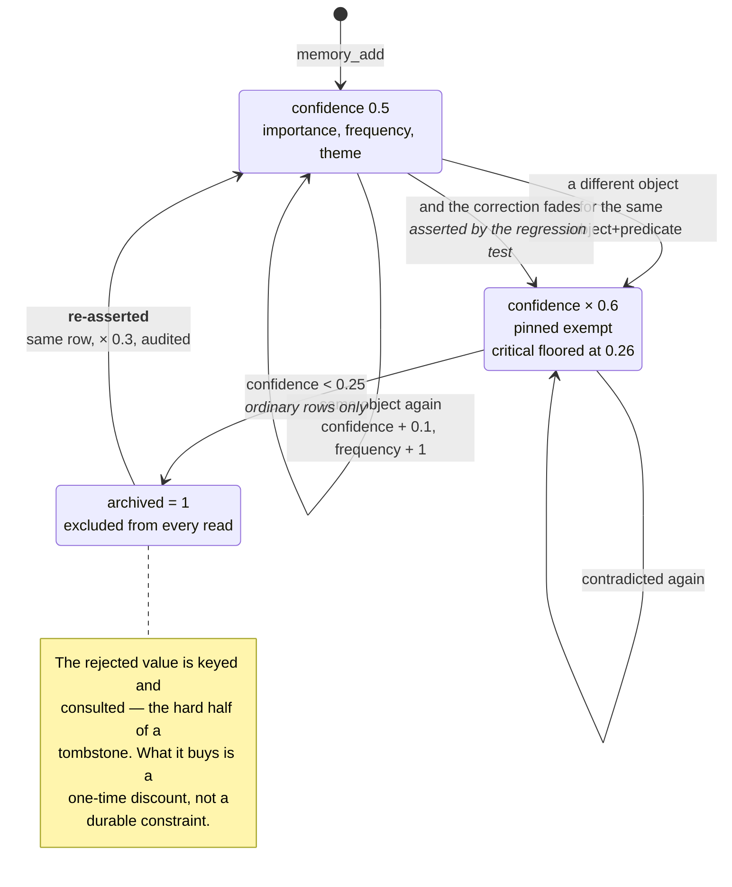

## 1. Executive Summary

memsem is 2,600 lines of TypeScript exposing an MCP server, an opencode plugin
and a CLI over a single SQLite file. It is MIT-licensed, twenty commits old,
and ships sixteen translated READMEs — a presentation-to-code ratio that in this
atlas usually predicts claims outrunning implementation. It does not here, and
the reason is worth leading with.

**Its benchmark reproduces.** `DESIGN.md` §11 publishes P@3 0.958 on a 51-fact,
20-query set, alongside four alternative constant weightings. From a clean clone,
`npm install && npm test` reproduces every figure in that table exactly —
0.958 / 0.958 / 0.320 / 0.958 for the defaults, 0.933 for the égalitaire,
recency-heavy and confidence-heavy variants, 0.958 for the relaxed lexical
threshold — offline, deterministic, in seconds, with no model and no network.

That is rare enough in this atlas to state plainly. The recurring finding on the
[benchmarks page](../../benchmarks/) is untraceable numbers — figures in a README
with no committed harness, no committed results, and no way to get from one to
the other. memsem publishes the harness, wires it into `npm test`, and the number
is what the harness prints.

**The honesty extends past the number.** §11 carries a section headed *"Lecture
honnête"* that states the set is author-designed rather than a standard, explains
that the low P@5 of 0.320 is an artifact of most queries having only one to three
relevant facts among five returned, names the single query that discriminates
between the weightings, and lists what would have to change to make the result
mean more. This is a calibration ablation with its own limitations attached, and
almost nothing else in the corpus does it.

**The design's central claim is about correction**, and it is the claim this
report tests hardest. The README says memsem fixes what other systems miss:
*"A fact contradicted months ago stays as strong as the day it was written."*
Its answer is attenuation — a contradicting fact fades its rivals by multiplying
confidence by 0.6, or 0.9 for facts above the critical importance threshold, and
archives them below 0.25 rather than deleting. History is kept, a `contradicts`
edge is written between the two, and the correction is reversible.

**And a re-asserted rejection still costs the correction, deliberately.** The
supersession path now consults archived rows: a value that already lost is
reactivated in its original row at a discount rather than inserted fresh, and the
reactivation is audited. But the same call still fades the live correction, and
`src/test/regression-test.ts` locks that in as intended behaviour rather than
leaving it as an accident. What that costs depends on whether the correction was
pinned — measured three ways below, against the repository's own headline
example.

## 2. Mental Model

A fact is a triple, and its standing is a number that goes up when repeated and
down when contradicted. There are no epistemic states — only a live/archived
flag and a confidence float that moves.



The loop from `Archived` back to `Live` is the design position and the finding at
once. Everything around it is considered: attenuation instead of deletion,
keeping the loser, a `contradicts` edge between the two, and now a pin that
`fade()` refuses to touch. The unresolved part is what the discount is worth —
the [rejected-value tombstone](../../patterns/rejected-value-tombstone/) pattern
asks for a durable constraint on the value, and a discount is paid off by
repetition.

## 3. Architecture

One SQLite file at `~/.memsem/`, opened through Node 22's built-in `node:sqlite`
— no native addon, no server, no vector database required. Schema arrives through
a versioned migration list in `db.ts`: `memories`, `memory_history`, `edges`,
`episodes`, then a history index, then `audit_log`.

`src/` is eight files. `db.ts` (1,517 lines) holds the schema and every query;
`index.ts` is the MCP server and its fourteen tools; `plugin.ts` is the opencode
integration and the prompts that drive three background sub-agents; `scoring.ts`
is the priority formula; `config.ts` is every tunable constant with defaults and
partial-override validation; `cli.ts` is `list`, `edit`, `forget` and `doctor`.

### Deployment and ergonomics

`npx memsem` and a setup command that writes the MCP configuration. Node ≥ 22.13
is the only hard requirement — the `node:sqlite` dependency is why, and it still
emits an experimental-feature warning on every run. Embeddings are optional and
local: `embed.ts` talks to Ollama, and without it the relax mode's cosine arm is
simply unavailable while strict lexical search continues to work.

That is a genuinely low adoption cost. The whole thing installs in one command,
runs offline, and its default retrieval path needs no model at all.

## 4. Essential Implementation Paths

### The benchmark, and what running it settles

`scripts/bench.mjs` builds 51 facts across four themes, ages some of them by one
to thirty days so recency discriminates, and runs 20 queries with expected
results — including deliberately ambiguous ones. The DESIGN document names the
query that decides between weightings: *"node"*, where five candidates match
lexically, two are relevant, and one of those two has been aged while carrying
importance 0.9. Only the default weighting keeps it in the top three.

Run at this commit:

```text
jeu de constantes    | P@3    R@3    P@5    R@5
---------------------+------------------------------
defaut               | 0.958  0.958  0.320  0.958
egalitaire           | 0.933  0.933  0.320  0.958
recence-heavy        | 0.933  0.933  0.320  0.958
confiance-heavy      | 0.933  0.933  0.320  0.958
seuil-0.4            | 0.958  0.958  0.320  0.958
```

Every cell matches the committed table. What this settles is narrow and worth
being precise about: it settles that the published number is the harness's
output and that the constants were chosen by comparison rather than by taste. It
does not settle that the constants generalise — the author says as much, and the
set is 51 facts of their own construction.

The transferable move is the ablation itself. Four alternative weightings are run
on every `npm test`, so a future change that improves the defaults on paper and
regresses them against the alternatives is visible immediately. Most systems in
this atlas that publish a tuning constant publish only the winner.

### Supersession by attenuation

`add()` selects live rows sharing the subject and predicate. If the incoming
object matches one exactly, that row is reinforced — confidence + 0.1, frequency
+ 1, importance raised to the max, tags merged — and every rival is faded. If no
live row matches, the new object is inserted at `supersedeConfidence` 0.6, every
rival is faded, and a `contradicts` edge is written from the new row to each.

`fade()` is eleven lines and does the whole job:

```ts
const factor = row.importance >= cfg.criticalImportance ? cfg.criticalFadeFactor : cfg.fadeFactor;
const next = row.confidence * factor;
if (next < cfg.archiveThreshold) {
  // archive, and record the previous object in memory_history
}
```

Nothing is deleted. The archived row stays, its object is copied into
`memory_history`, and `stats` counts it. As a treatment of *"I drank milk for
years… wait, lactose intolerant"* — the README's own example — this is a good
design, and better than the overwrite-in-place that several larger systems here
use.

### Where it inverts

The rival query is `WHERE subject = ? AND predicate = ? AND project = ? AND
archived = 0`. An archived value is not a rival, because it is not live. So the
system has no way to notice that an incoming fact is one it already rejected.

Re-asserting a value that already lost does not create a new row. `add()` finds
the archived row, reactivates it in place, and returns `resurrected: true` with
its confidence discounted through `resurrectConfidence` (0.3) —
`archivedRow.confidence × 0.3 + reinforceConfidenceStep`. The reactivation is
audited: `{field: "archived", oldValue: "1", newValue: "0", reason:
"resurrection"}`.

**And the same call fades the live correction, by design.** That is not an
oversight; `src/test/regression-test.ts` pins it as a specified property under
the heading *"Re-asserting a rejected value also supersedes its current
contradiction"*, asserting that the live correction is faded again, that its
confidence decreases, and that the rejected value becomes active. The design
position is that a re-assertion is evidence and must count for something.

The consequence is measurable, and what it is depends entirely on whether the
correction was protected in advance. Run against the repository's own
milk/lactose example — establish `milk`, correct to `oat milk` until `milk`
archives, then re-assert `milk` as a later extraction pass over an old transcript
would:

| The correction is… | What repeated re-assertion does to it |
| --- | --- |
| **pinned** | Nothing. `fade()` returns `untouched` on the first line, confidence flat at 0.500 across fifteen re-assertions, and it stays the top result. |
| **critical (≥ 0.8), not pinned** | Never archived — the fade floors at `archiveThreshold + 0.01` = 0.260 — but the rejected value climbs 0.600 → 1.000 and **takes the top rank at re-assertion #5**, permanently, with the correction surviving underneath it. |
| **ordinary** | Archived at re-assertion #3. The rejected value climbs 0.190 → 0.290 → 0.390 and ends up alone. |

So pinning is now real protection and criticality is half of one: it guarantees
the correction survives, not that anyone will see it. For an unpinned, ordinary
correction the outcome is unchanged from the design's own worst case — repetition
wins — it now takes three repetitions rather than one.

**This is why the tombstone mark is still withheld, and the near-miss is now
deliberate rather than accidental.** The archived row *is* keyed on the value and
*is* consulted, which is the hard half of the
[rejected-value tombstone](../../patterns/rejected-value-tombstone/) pattern. What
that page asks for next is a durable *constraint*; what exists here is a one-time
re-entry discount that repetition pays off. Reasonable people can hold memsem's
position — a fact restated ten times across ten sessions probably is evidence —
but the pattern's argument is that an extractor re-reading one old transcript ten
times looks identical to that, and nothing here distinguishes them.

The three protection tiers the README described as one are now two:

| Threat | Protection |
| --- | --- |
| The scoring sub-agent adjusting importance | **Enforced in code** — pinned and importance ≥ 0.9 are refused, the refusal is audited, and a committed test proves it |
| Supersession by a contradicting write | **Enforced in code for pinned, floored for critical** — `fade()` exits on `pinned === 1` and clamps critical facts above the archive threshold |
| The consolidation sub-agent archiving small facts | **Prompt only** — `plugin.ts` instructs it never to archive a pinned or critical fact |

The remaining gap is the one that was always the odd one out: the two paths
enforced in code are the ones a database can check, and the path still governed by
a sentence is the one where an LLM decides what to throw away.

### Retrieval that defaults to strict

Strict lexical search requires 50% of query words to match, with no graph
propagation, and ranks by `0.45 × importance + 0.25 × confidence + 0.2 × recency
+ 0.1 × frequency` with a 7-day recency half-life. `relax: true` opts into cosine
similarity and two-hop graph propagation with a 0.3 boost.

Defaulting to the precise mode and making the fuzzy one opt-in is the opposite of
the usual arrangement in this atlas, and it is defensible for the stated use —
the README's complaint is that similarity search over everything drowns signal in
noise. It also means the default path degrades to nothing when the query shares
no vocabulary with the stored fact, which is the trade taken knowingly.

The `theme` and focus mechanisms sit on top: a `memory-index.md` routing card of
themes and keywords is injected at session start, and out-of-focus themes are
attenuated by 0.35 rather than filtered out. Attenuate-don't-exclude is the same
instinct as fade-don't-delete, applied to retrieval.

## 5. Memory Data Model

`memories` is a triple — `subject`, `predicate`, `object` — plus `tags`,
`importance`, `confidence`, `frequency`, `project`, `provenance`, `archived`,
`pinned`, `theme`, `embedding`, `created_at`, `updated_at`.

Around it: `memory_history` (`memory_id`, `previous`, `changed_at`), `edges`
(`source_id`, `target_id`, `relation`, unique on the pair), `episodes`, and
`audit_log` (`entity`, `entity_id`, `field`, `old_value`, `new_value`, `reason`,
`pass_id`, `dry_run`, `created_at`).

The `audit_log` shape is the best thing in the schema. A **reason** is carried on
every entry, a `pass_id` groups a sub-agent's adjustments so a per-pass cumulative
cap can be enforced, and `dry_run` lets a proposed change be recorded without
being applied — the scoring sub-agent can be asked what it *would* do and the
answer is durable. Very little in this atlas records a refused or simulated
mutation; memsem records both.

Its coverage now reaches the automatic path, which is where it was thinnest.
`audit()` is called from `forget`, from `cli-edit`, from the scoring path
including its refusals and dry runs, and from `add()` in both directions — an
archival by supersession writes `{field: "archived", "0" → "1", reason:
"supersession"}` and a reactivation writes the same fields reversed with reason
`"resurrection"`. What still leaves no audit row is a fade that does not cross
the archive threshold, so the confidence a correction loses on the way down is
visible only in the value itself; `memory_history` records the previous object at
the moment of archival, and only then.

What is absent: no discrete epistemic status. `archived` is a lifecycle flag and
`pinned` is a user preference; neither expresses candidate versus verified versus
rejected, and `confidence` is a score. The near-miss is real — an archived row is
withheld from every read, which is what a rejected state would do — but it is
keyed on the row, and the demonstration above is what that difference costs.
Validity time is not tracked separately from record time.

## 6. Retrieval Mechanics

One SQL pass over rows filtered by `project` and `theme`, scored in TypeScript,
sorted by priority. `whereClause(project, theme)` is applied on the list, search
and index paths alike, so the scope key genuinely reaches the query rather than
being stored and forgotten — the distinction the
[scope as a first-class key](../../patterns/scope-as-a-first-class-key/) pattern
draws. The caller supplies the project string, which is the standard caveat: this
certifies the key reaches the query, not that a caller cannot pass a different
one.

Two committed negative cases exist, which is unusual enough to name. One asserts
that a weak lexical match is excluded — `"stricte: faible correspondance exclue
(1 mot sur 3)"`. The other asserts that an archived fact stays out of the active
set across an export/import round trip. Both are the shape the
[benchmarks page](../../benchmarks/) asks for: a test that fails if the wrong
thing comes back.

Neither covers the supersession outcome measured in section 4. There is no
committed case bounding how many re-assertions an unpinned correction survives —
and the regression test that does cover this path asserts the opposite property,
that a rejected value *does* come back.

## 7. Write Mechanics

Writes are synchronous SQLite transactions; nothing queues, and a memory is
searchable the moment `memory_add` returns. There is no extraction on the write
path — the MCP tool takes a structured triple, and the work of deciding what is
worth remembering is done by a sub-agent that calls the tool.

Three background passes are defined as prompts in `plugin.ts`: session-end
extraction of durable facts, consolidation of small facts into patterns, and
pairwise-comparison scoring. Their safety rules are prose in those prompts, with
one exception — the scoring caps are enforced in `db.ts` and tested. The
consolidation pass carries the more interesting prompt rule: before archiving a
small fact it must re-run a search with two of that fact's keywords and confirm
the consolidated pattern still ranks in the top five, or leave the fact alive.
**A consolidation that must prove the memory stayed at least as searchable** is a
good idea and one this atlas has not seen stated elsewhere. It is also a rule an
LLM is asked to follow rather than one the code enforces.

### Operational cost

The default read path costs one SQLite query and some arithmetic — no model, no
network. The background passes cost whatever the host agent's model costs, and
they run at session end rather than per turn. Storage grows monotonically:
nothing is deleted, archived rows stay, and every archival appends to history.
For a personal memory that is the right trade and the growth is trivial.

## 8. Agent Integration

An MCP server with fourteen tools — add, search, list, forget, edit, score,
index, stats, episode search, export/import — so any MCP client can use it, plus
a dedicated opencode plugin and a CLI. The `memory-index.md` routing card
injected at session start is the interesting integration choice: rather than
retrieving into every turn, it puts a table of contents in front of the agent and
lets the agent decide when to search.

The CLI is where a person enters. `list` shows priority order with pins flagged,
`edit` prints before and after, `forget` asks for confirmation unless given
`--yes`, and `doctor` shows recent adjustments with their audit reasons sorted by
magnitude of change. That is a real review surface — inspect, adjudicate, and see
what the sub-agents did and why.

## 9. Reliability, Safety, and Trust

Strengths:

- **A committed benchmark that reproduces exactly**, offline and deterministic,
  wired into `npm test`.
- **An ablation over its own constants**, so a regression against the
  alternatives is visible on every run.
- **A stated honest reading** of that benchmark's limits, written by the author.
- **An audit log carrying a reason, a pass id and a dry-run flag**, recording
  refused and simulated changes as well as applied ones.
- **Bounded sub-agent authority** — per-call and per-pass caps on importance
  adjustment, floors and ceilings, enforced in code and tested.
- **Scope applied on the read path**, and attenuation rather than exclusion for
  focus.
- **Two committed negative retrieval cases.**
- **Nothing is ever deleted** — archived rows and history both persist.

Gaps:

- **Supersession is keyed on the record, not the value.** A discredited fact that
  is repeated returns as live and demotes its own correction.
- **Pinning and criticality do not protect against supersession**, though the
  README's diagram says they do.
- **`add()` writes no audit row**, so the automatic path that changes what is
  believed is the one path that leaves no reasoned trace.
- **No discrete trust state**, so a candidate and a confirmed fact differ only by
  a float.
- **The consolidation and extraction safety rules are prompts**, not code.

## 10. Tests, Evals, and Benchmarks

`npm test` builds and runs five suites plus the benchmark, in seconds, with no
services. It passes at this commit, and the benchmark output matches DESIGN.md
§11 cell for cell, so the published figures are the harness's live output rather
than a committed record of one.

The suites are real assertions, not print scripts: the scoring caps, the pin and
critical-importance refusals, the dry-run path, `doctor`'s ordering, the CLI's
confirmation behaviour, export/import durability, and the two negative retrieval
cases above.

`src/test/regression-test.ts` now covers the supersession path directly, and it
is worth reading for what it chose to assert. Its resurrection section pins three
properties: the live correction *is* faded again, its confidence *does* decrease,
and the rejected value *does* become active. Fading the correction is therefore
specified behaviour, not an accident — disagreeing with it means disagreeing with
a decision that has a test behind it.

What no test covers is the outcome over repetition, which is where the decision
shows its cost: nothing asserts an upper bound on how many re-assertions an
unpinned correction survives, and the measured answer is three. The same commit
also fixed two things unrelated to correction — Unicode case folding in the
supersession lookup, so a Cyrillic restatement no longer creates a duplicate
rival, and configured confidence values actually being returned instead of
hardcoded ones. The second is the kind of defect a report that quotes a config
constant without setting it will always miss.

## 11. For Your Own Build

### Steal

- **Commit the harness, not the number.** memsem's P@3 is credible because
  `npm test` prints it. A figure in a README with no runnable path to it is the
  single most common unverifiable claim in this atlas.
- **Ablate your own constants and keep the ablation in CI.** Four alternative
  weightings run on every test, so the defaults have to keep winning.
- **Write the honest reading yourself.** Naming the set as author-designed, the
  metric artifact, and the one query that discriminates costs a paragraph and is
  worth more than the number.
- **Put a reason, a pass id and a dry-run flag on the audit row.** Recording what
  a sub-agent was refused, and what it would have done, is cheap and rare.
- **Attenuate rather than exclude** on retrieval, and fade rather than delete on
  contradiction — both keep a recoverable path that a hard filter destroys.
- **Make consolidation prove the memory stayed findable** before it archives the
  parts it merged.

### Avoid

- **Pricing a rejection instead of constraining it.** A discount on re-entry is
  paid off by repetition; if you want a rejection to hold, the check has to refuse
  rather than charge. memsem's own answer — pin the ones that matter — is a real
  answer and it moves the decision to a user who has to make it in advance.
- **Making the durable protection opt-in and the fragile one the default.** An
  unpinned correction here survives three re-assertions; a pinned one survives
  indefinitely. Whichever way that trade is set, the docs have to say which side
  a user is on.
- **Leaving the sub-agent path governed by a sentence** once the database paths
  are enforced in code. The consolidation prompt is now the only place where "do
  not archive a pinned fact" is an instruction rather than a check.

### Fit

Right for a single developer who wants a local, offline, MIT-licensed memory that
installs in one command, ranks precisely by default, and can be inspected and
corrected from a CLI. At 2,600 lines it is readable end to end in an afternoon,
and the engineering habits — committed benchmark, ablation, bounded sub-agent
authority, audit with reasons — are better than its twenty commits suggest.

Wrong wherever a correction has to hold **without anyone having pinned it**. Pin
the facts you cannot afford to lose and the guarantee is absolute; leave one
ordinary and three repetitions of the value it corrected will archive it. That is
a coherent product decision — memsem treats repetition as evidence and gives you
an override — and it puts the burden on a user knowing in advance which
corrections matter, which is the thing users are worst at.

## 12. Open Questions

- Is `resurrectConfidence` meant to be a one-time discount or the start of a
  ladder? At 0.3 a value returns cheap and then climbs on ordinary reinforcement.
- Should an unpinned correction have a floor too, or is pinning the intended
  answer and the docs' job to say so?
- Would a value-keyed rejection record fit the existing schema, or does the
  triple's `object` column already provide the key?
- What is a new memory's initial confidence meant to express, given 0.5 is both
  the default and the midpoint? The DESIGN document lists this as open.
- The document also asks who wins when a consolidated pattern is contradicted by
  a critical fact — is that decided anywhere in code?
- Does the relax mode's 0.5 cosine threshold hold up against real embeddings, or
  is it carried over from the lexical floor?

## Appendix: File Index

- Schema, queries and correction: `src/db.ts` (`add`, `fade`, `whereClause`,
  `forget`, `edit`, `score`, `audit`, `historyOf`, `importJSON`).
- MCP server and tools: `src/index.ts`.
- Sub-agent prompts and opencode plugin: `src/plugin.ts` (`SCORE_PROMPT`, the
  consolidation and extraction prompts).
- Scoring: `src/scoring.ts`; constants and overrides: `src/config.ts`.
- CLI review surface: `src/cli.ts` (`list`, `edit`, `forget`, `doctor`).
- Benchmark: `scripts/bench.mjs`; its documented result and honest reading:
  `DESIGN.md` §11.
- Tests: `src/test/score-test.ts`, `cli-test.ts`, `durability-test.ts`,
  `client-test.ts`, `config-test.ts`, `regression-test.ts`.

## History

**2026-08-04** — [`226c171ac21b6175bfda8e3b29256341e7fb2ff3`](https://github.com/WindSeries69/memsem/commit/226c171ac21b6175bfda8e3b29256341e7fb2ff3) — second reading, two commits on. `1.2.0` and the tombstone commit before it change the supersession path in three ways, all verified against the built module rather than read. `fade()` now returns `untouched` on `pinned === 1`, so a pinned correction is exempt: fifteen consecutive re-assertions of the value it corrected left its confidence flat at 0.500 and it stayed the top result. Critical rows (importance ≥ 0.8) are clamped at `archiveThreshold + 0.01`, so they can no longer be archived, though the rejected value climbs past them in rank at the fifth re-assertion and stays there. A re-asserted rejected value now reactivates its own archived row through `resurrectConfidence` (0.3) instead of being inserted fresh at 0.6, and both the archival and the reactivation write audit rows with reasons `"supersession"` and `"resurrection"` — closing most of the audit gap this report recorded on `add()`. What did not change is that a re-assertion still fades the live correction, and `src/test/regression-test.ts` now asserts that as intended behaviour; an ordinary unpinned correction is archived at the third re-assertion rather than the first. The same commits also fixed Unicode case folding in the supersession lookup and made configured confidence values actually be returned, neither of which this report had looked for. `npm test` passes and the benchmark is unchanged: 0.958 / 0.958 / 0.320 / 0.958 with the same ablation.

**2026-08-04** — [`33b0d4624020f28fc7b2bee0a3b9865948d90818`](https://github.com/WindSeries69/memsem/commit/33b0d4624020f28fc7b2bee0a3b9865948d90818) — first reading. `npm test` run from a clean clone: all suites pass and the benchmark reproduces DESIGN.md §11 exactly. The supersession inversion and the unprotected pin were demonstrated against the built module rather than read.
