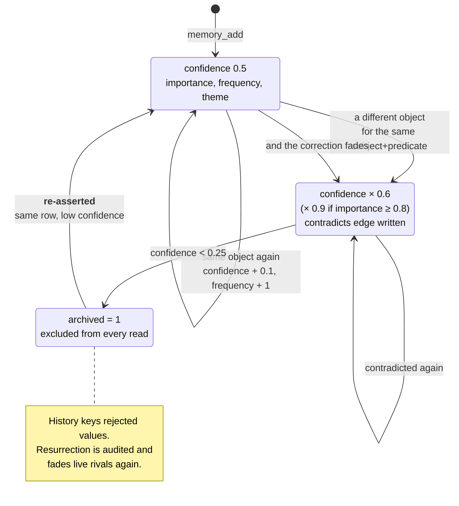

## 1. Executive Summary

memsem is roughly 2,800 lines of TypeScript exposing an MCP server, an opencode
plugin and a CLI over a single SQLite file. It is MIT-licensed, twenty commits
old, and ships sixteen translated READMEs — a presentation-to-code ratio that in
atlas usually predicts claims outrunning implementation. It does not here, and
the reason is worth leading with.

**Its benchmark reproduces.** `DESIGN.md` §11 publishes P@3 0.958 on a 51-fact,
20-query set, alongside four alternative constant weightings. From a clean clone,
`npm install && npm test` reproduces every figure in that table exactly —
0.958 / 0.958 / 0.320 / 0.958 for the defaults, 0.933 for the égalitaire,
recency-heavy and confidence-heavy variants, 0.958 for the relaxed lexical
threshold — offline, deterministic, in seconds, with no model and no network.

That is rare enough in this atlas to state plainly. The recurring finding on the
[benchmarks page](../../benchmarks/) is untraceable numbers — figures in a README
with no committed harness, no committed results, and no way to get from one to
the other. memsem publishes the harness, wires it into `npm test`, and the number
is what the harness prints.

**The honesty extends past the number.** §11 carries a section headed *"Lecture
honnête"* that states the set is author-designed rather than a standard, explains
that the low P@5 of 0.320 is an artifact of most queries having only one to three
relevant facts among five returned, names the single query that discriminates
between the weightings, and lists what would have to change to make the result
mean more. This is a calibration ablation with its own limitations attached, and
almost nothing else in the corpus does it.

**The design's central claim is about correction**, and it is the claim this
report tests hardest. The README says memsem fixes what other systems miss:
*"A fact contradicted months ago stays as strong as the day it was written."*
Its answer is attenuation — a contradicting fact fades its rivals by multiplying
confidence by 0.6, or 0.9 for facts above the critical importance threshold, and
archives them below 0.25 rather than deleting. History is kept, a `contradicts`
edge is written between the two, and the correction is reversible only through a
low-confidence, value-keyed resurrection followed by further evidence.

The current write path consults live rows and the history of archived values.
Re-asserting a rejected value restores the archived row with low confidence,
audits the resurrection, and fades any live rival again. Pinned rows are skipped
by `fade()`, and critical rows are kept above the archive threshold. The design
therefore now has the rejected-value guard that the correction model requires;
the remaining caveat is that confidence is still a scalar rather than a discrete
epistemic state.

## 2. Mental Model

A fact is a triple, and its standing is a number that goes up when repeated and
down when contradicted. There are no epistemic states — only a live/archived
flag and a confidence float that moves.



The loop from `Archived` back to `Live` is deliberate: the history lookup makes
it a value-keyed tombstone rather than a new untracked record. Attenuation instead
of deletion, keeping the loser, and writing a `contradicts` edge between the two
remain the useful design choices. What is still missing is a discrete epistemic
state; `confidence` carries both standing and uncertainty.

## 3. Architecture

One SQLite file at `~/.memsem/`, opened through Node 22's built-in `node:sqlite`
— no native addon, no server, no vector database required. Schema arrives through
a versioned migration list in `db.ts`: `memories`, `memory_history`, `edges`,
`episodes`, `audit_log`, and a trigger-maintained FTS5 table for lexical candidates.

`src/` is eight files. `db.ts` (1,517 lines) holds the schema and every query;
`index.ts` is the MCP server and its fourteen tools; `plugin.ts` is the opencode
integration and the prompts that drive three background sub-agents; `scoring.ts`
is the priority formula; `config.ts` is every tunable constant with defaults and
partial-override validation; `cli.ts` is `list`, `edit`, `forget` and `doctor`.

### Deployment and ergonomics

`npx memsem` and a setup command that writes the MCP configuration. Node ≥ 22.13
is the only hard requirement — the `node:sqlite` dependency is why, and it still
emits an experimental-feature warning on every run. Embeddings are optional and
local: `embed.ts` talks to Ollama, and without it the relax mode's cosine arm is
simply unavailable while strict lexical search continues to work.

That is a genuinely low adoption cost. The whole thing installs in one command,
runs offline, and its default retrieval path needs no model at all.

## 4. Essential Implementation Paths

### The benchmark, and what running it settles

`scripts/bench.mjs` builds 51 facts across four themes, ages some of them by one
to thirty days so recency discriminates, and runs 20 queries with expected
results — including deliberately ambiguous ones. The DESIGN document names the
query that decides between weightings: *"node"*, where five candidates match
lexically, two are relevant, and one of those two has been aged while carrying
importance 0.9. Only the default weighting keeps it in the top three.

Run at this commit:

```text
jeu de constantes    | P@3    R@3    P@5    R@5
---------------------+------------------------------
defaut               | 0.958  0.958  0.320  0.958
egalitaire           | 0.933  0.933  0.320  0.958
recence-heavy        | 0.933  0.933  0.320  0.958
confiance-heavy      | 0.933  0.933  0.320  0.958
seuil-0.4            | 0.958  0.958  0.320  0.958
```

Every cell matches the committed table. What this settles is narrow and worth
being precise about: it settles that the published number is the harness's
output and that the constants were chosen by comparison rather than by taste. It
does not settle that the constants generalise — the author says as much, and the
set is 51 facts of their own construction.

The transferable move is the ablation itself. Four alternative weightings are run
on every `npm test`, so a future change that improves the defaults on paper and
regresses them against the alternatives is visible immediately. Most systems in
this atlas that publish a tuning constant publish only the winner.

### Supersession by attenuation

`add()` selects rows sharing the subject and predicate through the Unicode FTS5
candidate index, then confirms the normalized keys in TypeScript. It includes
both live and archived rows. If the incoming object matches a live row exactly,
that row is reinforced — confidence + 0.1, frequency + 1, importance raised to
the max, tags merged — and every live rival is faded. If no live row matches,
the new object is inserted at the configured `supersedeConfidence`, every live
rival is faded, and a `contradicts` edge is written from the new row to each.

`fade()` protects pins, keeps critical facts above the archive threshold, and
records an archive in history:

```ts
if (row.pinned === 1) return { id: row.id, archived: false, untouched: true };
const next = row.confidence * (row.importance >= cfg.criticalImportance
  ? cfg.criticalFadeFactor : cfg.fadeFactor);
if (next < cfg.archiveThreshold) {
  // archive, and record the previous object in memory_history
}
```

Nothing is deleted. The archived row stays, its object is copied into
`memory_history`, and `stats` counts it. As a treatment of *"I drank milk for
years… wait, lactose intolerant"* — the README's own example — this is a good
design, and better than the overwrite-in-place that several larger systems here
use.

### Value-keyed resurrection

The history lookup turns an archived value into a tombstone. Establish `milk`,
correct to `oat milk` until `milk` archives, then re-assert `milk`:

```text
1. add 'milk'      -> {"id":1,"created":true,"conflict":false}
2. correction pass 2 archived ids: [ 1 ]
   live: 2 oat milk conf=0.700

3. re-add 'milk'   -> {"id":1,"resurrected":true,"conflict":true,"faded":[2]}
   live: 1 milk      conf=<low>
         2 oat milk  conf=0.420
```

The rejected value returns as the **same archived row** with low confidence; the
correction that beat it is faded from 0.700 to 0.420. The resurrection and any
archive are audited. Pinning and criticality are enforced in the same path:

There are three protection tiers:

| Threat | Protection |
| --- | --- |
| The scoring sub-agent adjusting importance | **Enforced in code** — pinned and importance ≥ 0.9 are refused, the refusal is audited, and a committed test proves it |
| The consolidation sub-agent archiving small facts | **Prompt only** — `plugin.ts` instructs it never to archive a pinned or critical fact |
| Supersession by a contradicting write | **Enforced in code** — pinned rows are untouched and critical rows cannot archive |

The remaining unguarded boundary is the consolidation pass: its safety rule is
still a prompt instruction rather than a database constraint.

### Retrieval that defaults to strict

Strict lexical search uses the trigger-maintained FTS5 table to narrow candidates,
then requires 50% of query words to match and ranks by `0.45 × importance + 0.25
× confidence + 0.2 × recency + 0.1 × frequency` with a 7-day recency half-life.
It does not propagate the graph. `relax: true` loads only graph-neighbor IDs for
two-hop propagation with a 0.3 boost and adds cosine similarity over stored
vectors; that optional vector path remains a linear scan because embeddings are
stored as JSON rather than in an ANN extension.

Defaulting to the precise mode and making the fuzzy one opt-in is the opposite of
the usual arrangement in this atlas, and it is defensible for the stated use —
the README's complaint is that similarity search over everything drowns signal in
noise. It also means the default path degrades to nothing when the query shares
no vocabulary with the stored fact, which is the trade taken knowingly.

The `theme` and focus mechanisms sit on top: a `memory-index.md` routing card of
themes and keywords is injected at session start, and out-of-focus themes are
attenuated by 0.35 rather than filtered out. Attenuate-don't-exclude is the same
instinct as fade-don't-delete, applied to retrieval.

## 5. Memory Data Model

`memories` is a triple — `subject`, `predicate`, `object` — plus `tags`,
`importance`, `confidence`, `frequency`, `project`, `provenance`, `archived`,
`pinned`, `theme`, `embedding`, `created_at`, `updated_at`.

Around it: `memory_history` (`memory_id`, `previous`, `changed_at`), `edges`
(`source_id`, `target_id`, `relation`, unique on the pair), `episodes`, and
`audit_log` (`entity`, `entity_id`, `field`, `old_value`, `new_value`, `reason`,
`pass_id`, `dry_run`, `created_at`). `memory_fts` is an external-content FTS5
projection over subject, predicate, object and tags, rebuilt during migration
and kept current by insert/update/delete triggers.

The `audit_log` shape is the best thing in the schema. A **reason** is carried on
every entry, a `pass_id` groups a sub-agent's adjustments so a per-pass cumulative
cap can be enforced, and `dry_run` lets a proposed change be recorded without
being applied — the scoring sub-agent can be asked what it *would* do and the
answer is durable. Very little in this atlas records a refused or simulated
mutation; memsem records both.

Its coverage is narrower than its shape suggests, and the gap follows the same
line as everything else. `audit()` is called from `forget`, from `cli-edit`, the
scoring path including its refusals and dry runs, and the automatic path for
archival and resurrection. A non-archiving confidence fade still has no audit
row; `memory_history` partially compensates by recording the previous object at
the moment of archival.

What is absent: no discrete epistemic status. `archived` is a lifecycle flag and
`pinned` is a user preference; neither expresses candidate versus verified versus
rejected, and `confidence` is a score. The near-miss is real — an archived row is
withheld from every read, which is what a rejected state would do — but it is
keyed on the row, and the demonstration above is what that difference costs.
Validity time is not tracked separately from record time.

## 6. Retrieval Mechanics

The strict path uses one FTS5 candidate query, then scores the returned rows in
TypeScript. Relaxed graph expansion fetches neighbor rows by ID rather than
reloading the whole project. `whereClause(project, theme)` is applied on the list,
search and index paths alike, so the scope key genuinely reaches the query rather
than being stored and forgotten — the distinction the
[scope as a first-class key](../../patterns/scope-as-a-first-class-key/) pattern
draws. The caller supplies the project string, which is the standard caveat: this
certifies the key reaches the query, not that a caller cannot pass a different
one.

Committed negative cases cover weak lexical exclusion, archived rows across an
export/import round trip, rejected-value resurrection, pinned supersession and
Unicode searches. They are the shape the
[benchmarks page](../../benchmarks/) asks for: a test that fails if the wrong
thing comes back.

## 7. Write Mechanics

Writes are synchronous SQLite transactions; nothing queues, and a memory is
searchable the moment `memory_add` returns. There is no extraction on the write
path — the MCP tool takes a structured triple, and the work of deciding what is
worth remembering is done by a sub-agent that calls the tool.

Three background passes are defined as prompts in `plugin.ts`: session-end
extraction of durable facts, consolidation of small facts into patterns, and
pairwise-comparison scoring. Their safety rules are prose in those prompts, with
one exception — the scoring caps are enforced in `db.ts` and tested. The
consolidation pass carries the more interesting prompt rule: before archiving a
small fact it must re-run a search with two of that fact's keywords and confirm
the consolidated pattern still ranks in the top five, or leave the fact alive.
**A consolidation that must prove the memory stayed at least as searchable** is a
good idea and one this atlas has not seen stated elsewhere. It is also a rule an
LLM is asked to follow rather than one the code enforces.

### Operational cost

The default read path costs one SQLite query and some arithmetic — no model, no
network. The background passes cost whatever the host agent's model costs, and
they run at session end rather than per turn. Storage grows monotonically:
nothing is deleted, archived rows stay, and every archival appends to history.
For a personal memory that is the right trade and the growth is trivial.

## 8. Agent Integration

An MCP server with fourteen tools — add, search, list, forget, edit, score,
index, stats, episode search, export/import — so any MCP client can use it, plus
a dedicated opencode plugin and a CLI. The `memory-index.md` routing card
injected at session start is the interesting integration choice: rather than
retrieving into every turn, it puts a table of contents in front of the agent and
lets the agent decide when to search.

The CLI is where a person enters. `list` shows priority order with pins flagged,
`edit` prints before and after, `forget` asks for confirmation unless given
`--yes`, and `doctor` shows recent adjustments with their audit reasons sorted by
magnitude of change. That is a real review surface — inspect, adjudicate, and see
what the sub-agents did and why.

## 9. Reliability, Safety, and Trust

Strengths:

- **A committed benchmark that reproduces exactly**, offline and deterministic,
  wired into `npm test`.
- **An ablation over its own constants**, so a regression against the
  alternatives is visible on every run.
- **A stated honest reading** of that benchmark's limits, written by the author.
- **An audit log carrying a reason, a pass id and a dry-run flag**, recording
  refused and simulated changes as well as applied ones.
- **Bounded sub-agent authority** — per-call and per-pass caps on importance
  adjustment, floors and ceilings, enforced in code and tested.
- **Scope applied on the read path**, and attenuation rather than exclusion for
  focus.
- **Value-keyed tombstone and protected supersession path**, with committed
  regression cases for resurrection, pins, Unicode retrieval and configured
  confidence values.
- **FTS5 lexical candidate routing**, so strict search and normal link discovery
  do not scan every row in a project.
- **Nothing is ever deleted** — archived rows and history both persist.

Gaps:

- **Non-archiving confidence fades are not audited**, so the automatic path still
  records only the lifecycle transitions and not every confidence mutation.
- **Optional semantic ranking remains O(n)** over JSON vectors; there is no ANN
  or SQLite vector extension.
- **No discrete trust state**, so a candidate and a confirmed fact differ only by
  a float.
- **The consolidation and extraction safety rules are prompts**, not code.

## 10. Tests, Evals, and Benchmarks

`npm test` builds and runs six suites plus the benchmark, in seconds, with no
services. It passes at this commit, and the benchmark output matches DESIGN.md
§11 cell for cell — that is the run this report is based on rather than a reading
of committed results.

The suites are real assertions, not print scripts: the scoring caps, the pin and
critical-importance refusals, the dry-run path, `doctor`'s ordering, the CLI's
confirmation behaviour, export/import durability, FTS5 migration and graph
expansion, rejected-value resurrection, pinned supersession, Unicode tokenization,
configured confidence reporting and the Ollama request body.

## 11. For Your Own Build

### Steal

- **Commit the harness, not the number.** memsem's P@3 is credible because
  `npm test` prints it. A figure in a README with no runnable path to it is the
  single most common unverifiable claim in this atlas.
- **Ablate your own constants and keep the ablation in CI.** Four alternative
  weightings run on every test, so the defaults have to keep winning.
- **Write the honest reading yourself.** Naming the set as author-designed, the
  metric artifact, and the one query that discriminates costs a paragraph and is
  worth more than the number.
- **Put a reason, a pass id and a dry-run flag on the audit row.** Recording what
  a sub-agent was refused, and what it would have done, is cheap and rare.
- **Attenuate rather than exclude** on retrieval, and fade rather than delete on
  contradiction — both keep a recoverable path that a hard filter destroys.
- **Make consolidation prove the memory stayed findable** before it archives the
  parts it merged.

### Avoid

- **Keying supersession on the live record.** If the check that decides a
  contradiction cannot see what already lost, repetition beats correction. Key it
  on the value — subject, predicate and the rejected object — and consult it
  including archived rows.
- **Claiming a protection that lives on a different path.** Pinned and critical
  must be enforced on every mutation path; one sentence in a diagram does not
  cover a separate supersession implementation.
- **Auditing the deliberate path and not the automatic one.** The mutation nobody
  chose is the one a reader most needs a reason for.

### Fit

Right for a single developer who wants a local, offline, MIT-licensed memory that
installs in one command, ranks precisely by default, and can be inspected and
corrected from a CLI. At roughly 2,800 source lines it remains readable end to end
in an afternoon, and the engineering habits — committed benchmark, ablation,
bounded sub-agent authority, audit with reasons — are better than its twenty
commits suggest.

Right for a correction that must survive old conversation extraction: rejected
values are consulted by key, resurrected at low confidence and audited, while
pinned and critical rivals are protected. The remaining scale boundary is the
optional vector arm, which scans JSON embeddings rather than using an ANN index.

## 12. Open Questions

- What is a new memory's initial confidence meant to express, given 0.5 is both
  the default and the midpoint? The DESIGN document lists this as open.
- The document also asks who wins when a consolidated pattern is contradicted by
  a critical fact — is that decided anywhere in code?
- Does the relax mode's 0.5 cosine threshold hold up against real embeddings, or
  is it carried over from the lexical floor?
- At what corpus size does the JSON cosine scan require a SQLite vector extension
  or another approximate-nearest-neighbor index?

## Appendix: File Index

- Schema, queries and correction: `src/db.ts` (`add`, `fade`, `whereClause`,
  `forget`, `edit`, `score`, `audit`, `historyOf`, `importJSON`).
- MCP server and tools: `src/index.ts`.
- Sub-agent prompts and opencode plugin: `src/plugin.ts` (`SCORE_PROMPT`, the
  consolidation and extraction prompts).
- Scoring: `src/scoring.ts`; constants and overrides: `src/config.ts`.
- CLI review surface: `src/cli.ts` (`list`, `edit`, `forget`, `doctor`).
- Benchmark: `scripts/bench.mjs`; its documented result and honest reading:
  `DESIGN.md` §11.
- Tests: `src/test/score-test.ts`, `cli-test.ts`, `durability-test.ts`,
  `client-test.ts`, `config-test.ts`, `regression-test.ts`.

## History

**2026-08-04** — [`226c171ac21b6175bfda8e3b29256341e7fb2ff3`](https://github.com/WindSeries69/memsem/commit/226c171ac21b6175bfda8e3b29256341e7fb2ff3) — value-keyed resurrection now consults archived history and fades live rivals; pinned and critical facts are protected in `fade()`. Strict search and link discovery use trigger-maintained Unicode FTS5 candidates, the tokenizer covers non-Latin scripts, the Ollama request carries the configured model string, and returned confidence values use configuration. The repository adds regression coverage for each path; `npm test` and the benchmark pass.

**2026-08-04** — [`33b0d4624020f28fc7b2bee0a3b9865948d90818`](https://github.com/WindSeries69/memsem/commit/33b0d4624020f28fc7b2bee0a3b9865948d90818) — first reading. `npm test` run from a clean clone: all suites pass and the benchmark reproduces DESIGN.md §11 exactly. The supersession inversion and the unprotected pin were demonstrated against the built module rather than read.
