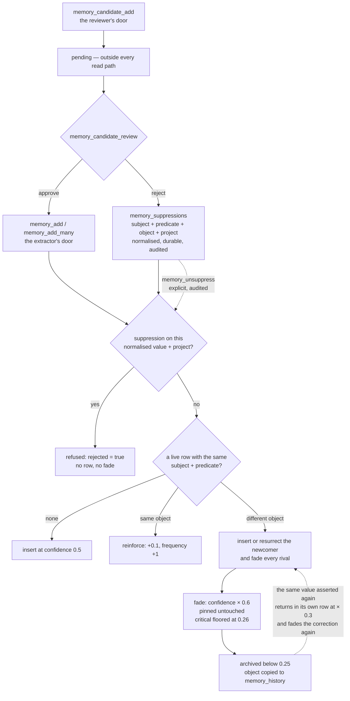

## 1. Executive Summary

memsem is 3,700 lines of TypeScript exposing an MCP server, an opencode plugin
and a CLI over a single SQLite file. It is MIT-licensed, twenty-one commits old,
and ships sixteen READMEs in sixteen languages — a presentation-to-code ratio that in this
atlas usually predicts claims outrunning implementation. It does not here, and
the reason is worth leading with.

**Its benchmark reproduces.** `DESIGN.md` §11 publishes P@3 0.958 on a 51-fact,
20-query set, alongside four alternative constant weightings. From a clean clone,
an install and `npm test` reproduce every figure in that table exactly —
0.958 / 0.958 / 0.320 / 0.958 for the defaults, 0.933 for the égalitaire,
recency-heavy and confidence-heavy variants, 0.958 for the relaxed lexical
threshold — offline, deterministic, in seconds, with no model and no network.

That is rare enough in this atlas to state plainly. The recurring finding on the
[benchmarks page](../../benchmarks/) is untraceable numbers — figures in a README
with no committed harness, no committed results, and no way to get from one to
the other. memsem publishes the harness, wires it into `npm test`, and the number
is what the harness prints.

**The honesty extends past the number.** §11 carries a section headed *"Lecture
honnête"* that states the set is author-designed rather than a standard, explains
that the low P@5 of 0.320 is an artifact of most queries having only one to three
relevant facts among five returned, names the single query that discriminates
between the weightings, and lists what would have to change to make the result
mean more. This is a calibration ablation with its own limitations attached, and
almost nothing else in the corpus does it.

**The design's central claim is about correction**, and it is the claim this
report tests hardest. The README says memsem fixes what other systems miss:
*"A fact contradicted months ago stays as strong as the day it was written."*
Its answer is attenuation — a contradicting fact fades its rivals by multiplying
confidence by 0.6, or 0.9 for facts above the critical importance threshold, and
archives them below 0.25 rather than deleting. History is kept, a `contradicts`
edge is written between the two, and the correction is reversible.

**There are two ways to reject a value here, and only one of them holds.**
`memory_candidate_add` parks an uncertain fact outside retrieval until a person
decides; approving it publishes it, and rejecting it writes a row into
`memory_suppressions` keyed on the normalised subject, predicate, object and
project. Every subsequent `memory_add` and `memory_add_many` consults that table
first and is refused outright — `{rejected: true, rejectionReason:
"suppressed"}`, no row written, no rival faded — until someone calls
`memory_unsuppress`, which is audited. That is a durable constraint on a value
rather than a price on it, it is the thing the
[rejected-value tombstone](../../patterns/rejected-value-tombstone/) pattern asks
for, and `src/test/governance-test.ts` asserts it.

**The other way is automatic supersession, and it writes no suppression at
all.** When a contradicting write fades an old value to the archive threshold,
nothing records that the value was rejected; the archived row is consulted on
re-entry and discounted, and that is all. So the write path a background
extractor actually uses is unchanged: re-assert an archived value and it returns,
fading the live correction as it comes. Measured against the repository's own
milk/lactose example, an ordinary correction is archived at the third
re-assertion, and even a pinned one — which never loses a point of confidence —
stops being the top search result at the sixth. The gate that would refuse this
exists, and only a human clicking reject can arm it.

## 2. Mental Model

A fact is a triple whose standing is a number that goes up when repeated and down
when contradicted, plus a trust level that only a person can raise to the top.
There are two doors into the store, and they treat a rejected value completely
differently.



The two doors are the whole report. The reviewer's door ends in a value-keyed
record that the write path consults and obeys — the durable constraint the
[rejected-value tombstone](../../patterns/rejected-value-tombstone/) pattern
argues for. The extractor's door produces archival, which is keyed on the *row*:
the value is remembered well enough to be discounted on re-entry and not well
enough to be refused. Nothing in the automatic path ever reaches the suppression
table, so the door that a background pass uses is the one with no lock on it.

## 3. Architecture

One SQLite file at `~/.memory-mcp/memory.db`, overridable through
`MEMORY_DB_PATH`, opened through Node 22's built-in `node:sqlite` — no native
addon, no server, no vector database required. `~/.memsem/` is the adjacent state
directory holding the config override, the injected protocol and the session
index. Schema arrives through a six-step versioned migration list in `db.ts`:
`memories`, `memory_history`, `edges`, `episodes`, then a history index, then
`audit_log`, then the `memory_fts` FTS5 virtual table kept in step by triggers on
insert, delete and update, then the evidence and validity columns, and finally
`memory_candidates` and `memory_suppressions`. The migrations are written to run
against an existing database — each column addition is wrapped individually and
swallows the already-present error, and the evidence-and-time step backfills
`recorded_at` from `created_at` and the history table's `changed_at`.

`src/` is eight files. `db.ts` (2,195 lines) holds the schema and every query;
`index.ts` is the MCP server and its eighteen tools; `plugin.ts` is the opencode
integration and the prompts that drive three background sub-agents; `scoring.ts`
is the priority formula; `config.ts` is every tunable constant with defaults and
partial-override validation; `cli.ts` is `list`, `edit`, `forget`, `purge` and
`doctor`.

### Deployment and ergonomics

`npx memsem` and a setup command that writes the MCP configuration. Node ≥ 22.13
is the only hard requirement — the `node:sqlite` dependency is why, and it
emits an experimental-feature warning on every run. Embeddings are optional and
local: `embed.ts` talks to Ollama, and without it the relax mode's cosine arm is
simply unavailable while strict lexical search continues to work.

That is a genuinely low adoption cost. The whole thing installs in one command,
runs offline, and its default retrieval path needs no model at all.

## 4. Essential Implementation Paths

### The benchmark, and what running it settles

`scripts/bench.mjs` builds 51 facts across four themes, ages some of them by one
to thirty days so recency discriminates, and runs 20 queries with expected
results — including deliberately ambiguous ones. The DESIGN document names the
query that decides between weightings: *"node"*, where five candidates match
lexically, two are relevant, and one of those two has been aged while carrying
importance 0.9. Only the default weighting keeps it in the top three.

Run at this commit:

```text
jeu de constantes    | P@3    R@3    P@5    R@5
---------------------+------------------------------
defaut               | 0.958  0.958  0.320  0.958
egalitaire           | 0.933  0.933  0.320  0.958
recence-heavy        | 0.933  0.933  0.320  0.958
confiance-heavy      | 0.933  0.933  0.320  0.958
seuil-0.4            | 0.958  0.958  0.320  0.958
```

Every cell matches the committed table. What this settles is narrow and worth
being precise about: it settles that the published number is the harness's
output and that the constants were chosen by comparison rather than by taste. It
does not settle that the constants generalise — the author says as much, and the
set is 51 facts of their own construction.

The transferable move is the ablation itself. Four alternative weightings are run
on every `npm test`, so a future change that improves the defaults on paper and
regresses them against the alternatives is visible immediately. Most systems in
this atlas that publish a tuning constant publish only the winner.

### Supersession by attenuation

`add()` selects live rows sharing the subject and predicate. If the incoming
object matches one exactly, that row is reinforced — confidence + 0.1, frequency
+ 1, importance raised to the max, tags merged — and every rival is faded. If no
live row matches, the new object is inserted at `supersedeConfidence` 0.6, every
rival is faded, and a `contradicts` edge is written from the new row to each.

`fade()` is eleven lines and does the whole job:

```ts
const factor = row.importance >= cfg.criticalImportance ? cfg.criticalFadeFactor : cfg.fadeFactor;
const next = row.confidence * factor;
if (next < cfg.archiveThreshold) {
  // archive, and record the previous object in memory_history
}
```

Nothing is deleted. The archived row stays, its object is copied into
`memory_history`, and `stats` counts it. As a treatment of *"I drank milk for
years… wait, lactose intolerant"* — the README's own example — this is a good
design, and better than the overwrite-in-place that several larger systems here
use.

### The write gate, and the one thing that arms it

`blockedBySuppression()` is the first thing `add()` does once it has normalised
and validated its arguments. It runs before the rival lookup, before the
exact-match check, before anything is inserted or faded:

```ts
if (this.blockedBySuppression(subject, predicate, object, input.project)) return this.rejectedAddResult();
```

The lookup is `WHERE subject_key = ? AND predicate_key = ? AND object_key = ? AND
project = ? AND (expires_at IS NULL OR expires_at > ?)`, over keys put through
`normalizeKey` — trimmed and lower-cased — so `"MILK "` and `"milk"` are the same
rejection. `expires_at` exists in the schema and nothing writes it, so a
suppression is permanent until lifted. Lifting is `memory_unsuppress`, which
deletes the row and writes `{entity: "suppression", field: "status", "active" →
"removed", reason: "unsuppress"}`.

This is a rejected-value tombstone: keyed on the normalised value rather than the
row, scoped to a project, durable past the row it came from, consulted on the
write path, and liftable only by an explicit audited act. `memory_add_many` goes
through the same `add()` and inherits it, which matters because that is the tool
the extraction sub-agent is told to call.

**Only one thing writes a row into that table**: `reviewCandidate(id,
"reject")`. A candidate is a triple parked in `memory_candidates` with status
`pending`, in a table no read path joins, so it is invisible to retrieval until a
person approves it. Approval replays it through `add()` — and throws if a
suppression blocks it by then, so the gate outranks the reviewer's earlier
inclination. Rejection writes the suppression and records the reason.

That is a clean governed-write shape. What it does not cover is the path that
does not involve a person.

### Where it inverts

The rival query is `archived = 0` filtered by subject and predicate, so an
archived value is not a rival. `add()` additionally reads `memory_history` for
values this key has previously lost, and a match there routes the write into the
resurrection branch: the archived row is reactivated in place at
`archivedRow.confidence × resurrectConfidence (0.3) + reinforceConfidenceStep`,
the reactivation is audited as `{field: "archived", "1" → "0", reason:
"resurrection"}`, and a `contradicts` edge is written to each live rival.

**And the same call fades the live correction, by design.**
`src/test/regression-test.ts` pins it as a specified property under the heading
*"Re-asserting a rejected value also supersedes its current contradiction"*,
asserting that the live correction is faded again, that its confidence decreases,
and that the rejected value becomes active. The design position is that a
re-assertion is evidence and must count for something.

Nothing on this path writes a suppression. Archiving a value by attenuation and
rejecting a candidate by review are two different judgements about the same
sentence, and only the second one is remembered as a rejection.

The consequence is measurable. Establish `milk`, correct to `oat milk` until
`milk` archives — two corrections, leaving the correction at confidence 0.700 —
then re-assert `milk` fifteen times as a later extraction pass over an old
transcript would, and watch both the confidence and the rank returned by
`memory_search`:

| The correction is… | What repeated re-assertion does to it |
| --- | --- |
| **pinned** | Its confidence never moves — `fade()` returns `untouched` on the first line, flat at 0.700 through all fifteen. But the rejected value climbs 0.190 → 1.000 and **takes the top search result at re-assertion #6**, 0.900 against 0.896, and keeps it. |
| **critical (≥ 0.8), not pinned** | Never archived — the fade floors at `archiveThreshold + 0.01` = 0.260 — but it decays 0.630 → 0.260 while the rejected value climbs, which **takes the top result at re-assertion #9**, permanently, with the correction surviving underneath it. |
| **ordinary** | **Archived at re-assertion #3**, after 0.700 → 0.420 → 0.252 → below the threshold. The rejected value climbs 0.190 → 0.290 → 0.390 and ends up alone. |

Pinning is therefore a guarantee about survival and not about visibility. The
distinction is sharp enough to be worth stating in the two places it shows: a
pinned correction is always first in `memsem list`, which sorts `pinned DESC`
before anything else, and it is not first in `memory_search`, which sorts by the
priority formula where a pin is not a term. A person auditing the store by hand
sees the correction on top; the agent retrieving through MCP sees the value the
correction was meant to remove.

**The mechanism is the right shape and its trigger is the narrow part.** It
exists, keyed correctly, with a test. What is missing is a route from the
automatic judgement to it — no path in the codebase turns "this value
was contradicted until it archived" into "refuse this value", and the pattern's
argument is precisely that an extractor re-reading one old transcript ten times
is indistinguishable from ten sessions of genuine repetition.

Two smaller routes also write past the gate:

- **`importJSON` does not consult it.** A dump carrying a suppressed value
  inserts it as a live row at its recorded confidence, searchable immediately,
  while the suppression stays active and continues to refuse direct writes. Both
  tables travel in the same export, so restoring a backup onto a machine that has
  since rejected the value reinstates it.
- **`edit` does not consult it.** Changing a row's `object` to a suppressed value
  succeeds. This one is defensible — the pattern page allows a trusted human
  correction to override, and every edit is audited — but the override is
  indistinguishable in the log from an ordinary edit.

The three protection tiers the README describes as one are two:

| Threat | Protection |
| --- | --- |
| The scoring sub-agent adjusting importance | **Enforced in code** — pinned and importance ≥ 0.9 are refused, the refusal is audited, and a committed test proves it |
| Supersession by a contradicting write | **Enforced in code for pinned, floored for critical** — `fade()` exits on `pinned === 1` and clamps critical facts above the archive threshold |
| The consolidation sub-agent archiving small facts | **Prompt only** — `plugin.ts` instructs it never to archive a pinned or critical fact |

The odd one out is the informative one: the two paths enforced in code are the
ones a database can check, and the path governed by a sentence is the one where
an LLM decides what to throw away.

### Retrieval that defaults to strict

Strict lexical search requires 50% of query words to match, with no graph
propagation, and ranks by `0.45 × importance + 0.25 × confidence + 0.2 × recency
+ 0.1 × frequency` with a 7-day recency half-life. `relax: true` opts into cosine
similarity and two-hop graph propagation with a 0.3 boost.

Defaulting to the precise mode and making the fuzzy one opt-in is the opposite of
the usual arrangement in this atlas, and it is defensible for the stated use —
the README's complaint is that similarity search over everything drowns signal in
noise. It also means the default path degrades to nothing when the query shares
no vocabulary with the stored fact, which is the trade taken knowingly.

The `theme` and focus mechanisms sit on top: a `memory-index.md` routing card of
themes and keywords is injected at session start, and out-of-focus themes are
attenuated by 0.35 rather than filtered out. Attenuate-don't-exclude is the same
instinct as fade-don't-delete, applied to retrieval.

A theme does not carry a search out of its project. `whereClause` keeps the
project clause when both are given unless the caller passes `crossProject: true`,
and the committed governance suite asserts both halves: a search in project `a`
returns nothing from project `b`, and the same search with `crossProject` does.
Crossing the boundary is something a caller has to ask for by name, which is the
arrangement the scope mark is worth having under.

## 5. Memory Data Model

`memories` is a triple — `subject`, `predicate`, `object` — plus `tags`,
`importance`, `confidence`, `frequency`, `project`, `provenance`, `archived`,
`pinned`, `theme`, `embedding`, `created_at`, `updated_at`, `trust`,
`evidence`, `recorded_at`, `valid_from` and `valid_until`.

Around it: `memory_history` (`memory_id`, `previous`, `changed_at`, and a
`previous_*` copy of the trust, evidence and validity fields), `edges`
(`source_id`, `target_id`, `relation`, unique on the pair), `episodes`,
`audit_log` (`entity`, `entity_id`, `field`, `old_value`, `new_value`, `reason`,
`pass_id`, `dry_run`, `created_at`), `memory_candidates` and
`memory_suppressions`.

### Trust is a state, not only a score

`trust` is one of `inferred`, `verbatim` or `verified`, ranked, and a
reinforcement keeps the higher of the two rather than the newer. What gives the
top level meaning is that an agent cannot claim it: the input schemas for
`memory_add`, `memory_add_many` and `memory_candidate_add` are
`z.enum(["inferred", "verbatim"])`, so `verified` is not a value the MCP boundary
will accept, and the only route to it is `verify(id, evidence)` — which refuses an
empty proof, refuses an archived row, and writes two audit rows, one for the trust
change and one for the evidence. The extraction prompt says the same thing in
words, and the schema is what holds it.

The check is at the boundary rather than in the store, which is worth naming
precisely: `db.add()` itself calls `normalizeTrust`, which accepts all three
levels, so a caller reaching the library directly — or an `import` carrying a
dump — can write `verified` without going through `verify` and without leaving the
two audit rows behind. For the MCP and plugin paths, which is every path an agent
takes, the reservation holds.

Alongside that, `memory_candidates.status` is `pending` / `approved` / `rejected`
and `memory_suppressions` is the durable form of the third. Candidate, verified
and rejected are therefore all discrete fields rather than regions of a float,
which is what the confidence score never expressed.

### Record time and validity time are separate columns

`recorded_at` is server-managed and `valid_from` / `valid_until` describe when the
fact is true; `add()` refuses a `validUntil` that is not after `validFrom`.
`whereClause` appends `(valid_from IS NULL OR valid_from <= ?)` and `(valid_until
IS NULL OR valid_until > ?)` to every read, against now or against an `asOf` the
caller supplies, so an expired fact drops out of retrieval without being archived
and a past state can be asked for. The governance suite asserts all three: the
expired fact is gone by default, it comes back `asOf` a date inside its interval,
and the fact that is only valid later does not.

Two honest limits on how far that goes. The `asOf` filter runs on validity time
only — a fact recorded today with no declared interval is returned by a query
`asOf` 2020, because nothing compares `recorded_at` against the requested instant.
And `recorded_at` is overwritten on every reinforcement, so it holds the last time
the fact was written rather than the first. Both are fine for the stated purpose,
which is "what was true then", and neither supports the other bi-temporal
question, which is "what did the store believe then".

The `audit_log` shape is the best thing in the schema. A **reason** is carried on
every entry, a `pass_id` groups a sub-agent's adjustments so a per-pass cumulative
cap can be enforced, and `dry_run` lets a proposed change be recorded without
being applied — the scoring sub-agent can be asked what it *would* do and the
answer is durable. Very little in this atlas records a refused or simulated
mutation; memsem records both.

Its coverage reaches the automatic path as well as the deliberate one. `audit()`
is called from `forget`, from `cli-edit`, from the scoring path including its
refusals and dry runs, from every candidate decision, from `verify`, from
`unsuppress`, and from `add()` in both directions — an archival by supersession
writes `{field: "archived", "0" → "1", reason: "supersession"}` and a reactivation
writes the same fields reversed with reason `"resurrection"`. What leaves no
audit row is a fade that does not cross the archive threshold, so the confidence a
correction loses on the way down is visible only in the value itself;
`memory_history` records the previous object at the moment of archival, and only
then. A refused write leaves none either — the suppression gate returns
`rejected: true` without recording that the refusal happened, which is the only
governance event the log does not carry.

### Forgetting has two depths, and the deeper one is nearly complete

`forget` archives. `purge` deletes: it rewrites `old_value` and `new_value` to
`[redacted]` on every `audit_log` row for that memory, appends a `purged` entry
carrying the reason, and deletes the row. `memory_history` and `edges` declare
`REFERENCES memories(id) ON DELETE CASCADE` and the connection sets `PRAGMA
foreign_keys = ON`, so the history and the graph edges go with it, and the FTS
delete trigger removes the index entry. The MCP tool requires `confirm: true` as a
literal and the CLI asks before acting. That is a real erasure path rather than a
flag rename, and it is rarer in this atlas than it should be.

One place the content survives it: a memory promoted from an approved candidate
leaves the candidate row untouched, so purging the memory leaves the full subject,
predicate, object and evidence text in `memory_candidates`. Purging a fact that a
person reviewed is exactly the case where the review table exists, so this is the
likely path rather than the exotic one. The suppression table is a deliberate
version of the same tension — a rejected value has to be stored somewhere to be
refused later — and the pattern page names it as a cost of adopting the mechanism
rather than a defect.

## 6. Retrieval Mechanics

**The strict path is an FTS5 index, not a scan.** `memory_fts` is a virtual table
over subject, predicate, object and tags, declared `tokenize = 'unicode61'` and
kept in step by three triggers on insert, delete and update. Search joins it —
`FROM memories m JOIN memory_fts ON memory_fts.rowid = m.id WHERE memory_fts
MATCH ?` — at three call sites. The `unicode61` tokenizer is what makes the
non-Latin cases work, and it is why the regression suite can assert that a
one-character CJK term and a Cyrillic restatement are both findable.

Scoring then happens in TypeScript over the matched rows, and
`whereClause(project, theme, crossProject, asOf)` is applied on the list, search
and index paths alike, so the scope key genuinely reaches the query rather than
being stored and forgotten — the distinction the
[scope as a first-class key](../../patterns/scope-as-a-first-class-key/) pattern
draws. One function assembles the archived, project, theme and validity clauses
for every read path, which is why the validity filter applies on all of them
rather than only where it would have been needed first. The caller supplies the
project string, which is the standard caveat: this certifies the key reaches the
query, not that a caller cannot pass a different one.

**The relax arm has a stated cost the strict arm does not.** Embeddings are
persisted as JSON text, so cosine ranking parses every candidate row:

```js
// ponytail: cosine over stored JSON is O(n); add a SQLite vector extension only when corpus size justifies it.
const sim = cosine(qv, JSON.parse(row.embedding) as number[]);
```

Naming the complexity and the remedy in the same comment, rather than discovering
either later, is the same habit as the retrieval docstring that says what the
path deliberately does not do. It also explains why relax mode is opt-in: the
default path is an index lookup and the optional one is a full parse.

Committed negative cases run to five, which is unusual enough to enumerate. A
weak lexical match is excluded — `"stricte: faible correspondance exclue (1 mot
sur 3)"`. An archived fact stays out of the active set across an export/import
round trip. A project scope does not leak into another project. A fact whose
validity window has closed does not come back by default, and one whose window has
not opened does not come back `asOf` an earlier date. All five are the shape the
[benchmarks page](../../benchmarks/) asks for: a test that fails if the wrong
thing comes back.

None covers the supersession outcome measured in section 4. There is no committed
case bounding how many re-assertions an unpinned correction survives — and the
regression test that does cover this path asserts the opposite property, that a
rejected value *does* come back.

## 7. Write Mechanics

Writes are synchronous SQLite transactions; nothing queues, and a memory is
searchable the moment `memory_add` returns. There is no extraction on the write
path — the MCP tool takes a structured triple, and the work of deciding what is
worth remembering is done by a sub-agent that calls the tool.

There are two write destinations and the caller chooses between them.
`memory_add` publishes immediately. `memory_candidate_add` parks the fact outside
retrieval until a person decides, and the protocol document tells the agent when
to use which: uncertain but worth a human decision goes to the candidate queue.
`memory_add_many` batches into one transaction that rolls back as a unit, and each
member goes through the same gate and the same supersession logic as a single
write, so the batch path carries no separate policy.

Three background passes are defined as prompts in `plugin.ts`: session-end
extraction of durable facts, consolidation of small facts into patterns, and
pairwise-comparison scoring. Their safety rules are prose in those prompts, with
one exception — the scoring caps are enforced in `db.ts` and tested. The
consolidation pass carries the more interesting prompt rule: before archiving a
small fact it must re-run a search with two of that fact's keywords and confirm
the consolidated pattern still ranks in the top five, or leave the fact alive.
**A consolidation that must prove the memory stayed at least as searchable** is a
good idea and one this atlas has not seen stated elsewhere. It is also a rule an
LLM is asked to follow rather than one the code enforces.

### Operational cost

The default read path costs one SQLite query and some arithmetic — no model, no
network. The background passes cost whatever the host agent's model costs, and
they run at session end rather than per turn. Storage grows monotonically unless
someone purges: archived rows stay, every archival appends to history, and
rejections accumulate their own table. For a personal memory that is the right
trade and the growth is trivial.

## 8. Agent Integration

An MCP server with eighteen tools — add, add-many, search, list, themes, stats,
index, episode add and search, score, forget, purge, audit, verify, unsuppress
and the three candidate tools — so any MCP client can use it, plus a dedicated
opencode plugin and a CLI. The `memory-index.md` routing card injected at session
start is the interesting integration choice: rather than retrieving into every
turn, it puts a table of contents in front of the agent and lets the agent decide
when to search.

The CLI is where a person enters. `list` shows priority order with pins and the
trust level flagged, `edit` prints before and after, `forget` asks for
confirmation unless given `--yes`, `purge` asks separately and says it is
permanent, and `doctor` shows recent adjustments with their audit reasons sorted
by magnitude of change. That is a real review surface — inspect, adjudicate, and
see what the sub-agents did and why.

The review queue is the half of it that is MCP-only. `memory_candidate_list`
and `memory_candidate_review` have no CLI counterpart, so the person adjudicating
a pending fact does it by asking an agent to call a tool rather than from the
terminal where the rest of the review surface lives.

## 9. Reliability, Safety, and Trust

Strengths:

- **A committed benchmark that reproduces exactly**, offline and deterministic,
  wired into `npm test`.
- **An ablation over its own constants**, so a regression against the
  alternatives is visible on every run.
- **A stated honest reading** of that benchmark's limits, written by the author.
- **An audit log carrying a reason, a pass id and a dry-run flag**, recording
  refused and simulated changes as well as applied ones.
- **Bounded sub-agent authority** — per-call and per-pass caps on importance
  adjustment, floors and ceilings, enforced in code and tested.
- **Scope applied on the read path**, isolated by project unless the caller asks
  to cross it, and attenuation rather than exclusion for focus.
- **A value-keyed write gate** that refuses a rejected value before any row is
  written or faded, liftable only by an explicit audited call.
- **Trust as a state whose top level an agent cannot claim** — the add tools'
  schemas do not accept `verified`, so the only route to it is `memory_verify`,
  which demands a non-empty proof and audits both fields it changes.
- **Five committed negative retrieval cases**, covering weak matches, archival,
  scope and both ends of a validity window.
- **A real erasure path** — `purge` deletes the row and cascades to its history
  and edges, redacting the audit trail it leaves behind.

Gaps:

- **Automatic supersession writes no suppression.** The mechanism that would
  refuse a repeated wrong value exists and only a human rejection arms it, so a
  discredited fact that is repeated returns as live and demotes its own
  correction.
- **Pinning protects survival, not visibility.** A pinned correction never loses
  confidence and stops being the top search result once the value it
  corrected has been repeated six times.
- **`import` writes past the gate**, inserting a suppressed value as a live row
  while the suppression stays active for direct writes.
- **A refused write leaves no audit row**, so the one governance event that
  happens automatically is the one the log does not carry.
- **Purging a reviewed fact leaves its text in `memory_candidates`.**
- **The consolidation and extraction safety rules are prompts**, not code.

## 10. Tests, Evals, and Benchmarks

`npm test` builds and runs seven suites plus the benchmark, in seconds, with no
services. It passes at this commit, and the benchmark output matches DESIGN.md
§11 cell for cell, so the published figures are the harness's live output rather
than a committed record of one.

The suites are real assertions, not print scripts: the scoring caps, the pin and
critical-importance refusals, the dry-run path, `doctor`'s ordering, the CLI's
confirmation behaviour, export/import durability, and the negative retrieval
cases above.

`src/test/governance-test.ts` is the new one and it is written as adverse cases
rather than happy paths — a rejected value must be refused at the write path, a
project must not leak into another project, an expired fact must not come back, a
purge must remove the content. It counts failures, prints each assertion, and sets
a non-zero exit code, so it is a gate rather than a demonstration. A suite whose
sections are named for the thing that must *not* happen is the shape this atlas
asks for on the [benchmarks page](../../benchmarks/) and rarely finds.

`src/test/regression-test.ts` covers the supersession path directly, and it is
worth reading for what it chose to assert. Its resurrection section pins three
properties: the live correction *is* faded again, its confidence *does* decrease,
and the rejected value *does* become active. Fading the correction is therefore
specified behaviour, not an accident — disagreeing with it means disagreeing with
a decision that has a test behind it.

The two suites therefore disagree about what a rejected value is entitled to, and
the disagreement is exactly the seam in the design. The governance suite proves a
rejection can be made to hold; the regression suite proves that the rejection
supersession produces does not. What no test covers is the outcome over
repetition, which is where the cost shows: nothing asserts an upper bound on how
many re-assertions an unpinned correction survives, and the measured answer is
three.

## 11. For Your Own Build

### Steal

- **Commit the harness, not the number.** memsem's P@3 is credible because
  `npm test` prints it. A figure in a README with no runnable path to it is the
  single most common unverifiable claim in this atlas.
- **Ablate your own constants and keep the ablation in CI.** Four alternative
  weightings run on every test, so the defaults have to keep winning.
- **Write the honest reading yourself.** Naming the set as author-designed, the
  metric artifact, and the one query that discriminates costs a paragraph and is
  worth more than the number.
- **Put a reason, a pass id and a dry-run flag on the audit row.** Recording what
  a sub-agent was refused, and what it would have done, is cheap and rare.
- **Attenuate rather than exclude** on retrieval, and fade rather than delete on
  contradiction — both keep a recoverable path that a hard filter destroys.
- **Make consolidation prove the memory stayed findable** before it archives the
  parts it merged.
- **Put the rejection check first in the write function**, before the dedupe and
  before the conflict policy. Ordering it that way makes a refusal cheap and makes
  it impossible for a suppressed value to fade a rival on its way to being
  refused.
- **Reserve the top trust level for a call the extractor cannot make.** `verified`
  costs nothing to model and means something only because the write tool's schema
  refuses it — put that refusal where the agent meets the system, and keep the
  route that does grant it audited.

### Avoid

- **Building the gate and leaving the automatic path outside it.** memsem has a
  correct value-keyed suppression and nothing in the supersession path writes one,
  so the route a background extractor takes is the route with no check. If you
  build this, decide explicitly whether an automatic rejection is a rejection.
- **Confusing a guarantee about survival with a guarantee about visibility.** A
  pin here keeps a correction's confidence intact forever and does not keep it at
  the top of a search, because the ranking formula has no term for it. Both are
  defensible; only one is what a user assumes.
- **Leaving one ingestion route unchecked.** The write gate covers `memory_add`
  and `memory_add_many` and not `import`, which is enough to reinstate a rejected
  value from a backup.
- **Leaving the sub-agent path governed by a sentence** once the database paths
  are enforced in code. The consolidation prompt is the only place where "do
  not archive a pinned fact" is an instruction rather than a check.

### Fit

Right for a single developer who wants a local, offline, MIT-licensed memory that
installs in one command, ranks precisely by default, keeps a real review queue,
and can be inspected, corrected and genuinely erased from a CLI. At 3,700 lines it
is readable end to end in a day, and the engineering habits — committed
benchmark, ablation, bounded sub-agent authority, audit with reasons, adverse-case
suite — are better than its twenty-one commits suggest.

Wrong wherever a correction has to hold **without anyone having reviewed it**.
Route the facts that matter through the candidate queue and reject the wrong value
there, and the refusal is durable and absolute; let supersession handle it and
three repetitions of the value it corrected will archive it. That is a coherent
product decision — memsem treats repetition as evidence and gives you a place to
overrule it — and it puts the burden on a person deciding in advance which
corrections matter, which is the thing people are worst at.

## 12. Open Questions

- Should supersession write a suppression when it archives, or is a rejection
  deliberately reserved for a human? The two paths currently answer this
  differently and neither document says which is intended. The sharpest form of
  the question is the maintainer's own, from
  [PR #16](https://github.com/neoneye/agent-memory-atlas/pull/16): is there a
  shape in which the write gate refuses on the automatic path's behalf without
  giving up the design's position that repetition is evidence?
- Is `resurrectConfidence` meant to be a one-time discount or the start of a
  ladder? At 0.3 a value returns cheap and then climbs on ordinary reinforcement.
- Should `import` consult the suppression table, or is restoring a backup meant to
  restore what the backup believed?
- Nothing writes `memory_suppressions.expires_at`. Is a lapsing rejection intended
  and unbuilt, or is the column a placeholder?
- Should `asOf` also filter on `recorded_at`, so a historical query returns what
  the store believed then rather than what is now claimed about then?
- What is a new memory's initial confidence meant to express, given 0.5 is both
  the default and the midpoint? The DESIGN document lists this as open.
- The document also asks who wins when a consolidated pattern is contradicted by
  a critical fact — is that decided anywhere in code?
- Does the relax mode's 0.5 cosine threshold hold up against real embeddings, or
  is it carried over from the lexical floor?

## Appendix: File Index

- Schema, queries and correction: `src/db.ts` (`add`, `fade`, `blockedBySuppression`,
  `whereClause`, `forget`, `purge`, `edit`, `verify`, `addCandidate`,
  `reviewCandidate`, `unsuppress`, `score`, `audit`, `historyOf`, `importJSON`,
  `MIGRATIONS`).
- MCP server and tools: `src/index.ts`.
- Sub-agent prompts and opencode plugin: `src/plugin.ts` (`SCORE_PROMPT`, the
  consolidation and extraction prompts).
- Scoring: `src/scoring.ts`; constants and overrides: `src/config.ts`.
- CLI review surface: `src/cli.ts` (`list`, `edit`, `forget`, `purge`, `doctor`).
- Benchmark: `scripts/bench.mjs`; its documented result and honest reading:
  `DESIGN.md` §11.
- The write protocol the agent is given: `memory-protocol.md`.
- Tests: `src/test/score-test.ts`, `cli-test.ts`, `durability-test.ts`,
  `client-test.ts`, `config-test.ts`, `regression-test.ts`, `governance-test.ts`.

## History

**2026-08-05** — [`16c28a940beac69fc060eb6bf5828061ad881d1a`](https://github.com/WindSeries69/memsem/commit/16c28a940beac69fc060eb6bf5828061ad881d1a) — third reading, one commit on: `1.3.0`, +780 lines in `db.ts` and a new suite. Screened before reading: 0 auto-run surfaces, 1 build-time exec (`prepublishOnly: npm test`), 4 floating ranges behind a lockfile, and 2 dependency surfaces inside the seven-day cooldown — the lockfile's resolved dependencies have not changed since the repository's first commit, and both `FRESH` findings are the project's own version field, which a git-date heuristic cannot distinguish from a resolution change but a diff can. Installed with `npm install --ignore-scripts --min-release-age=7` rather than `npm ci`, per the cooldown rule; `npm test` passes and the benchmark is unchanged, 0.958 / 0.958 / 0.320 / 0.958 with the same five-row ablation. Three capability marks move to present, all verified against the built module. `tombstone`: `memory_suppressions` is keyed on the normalised subject, predicate, object and project, `blockedBySuppression()` is the first effective statement in `add()`, `memory_add_many` inherits it, and `memory_unsuppress` is the only lift and is audited — a rejected value is refused with no row written and no rival faded. `trust_state`: `inferred` / `verbatim` / `verified` as a ranked field whose top level the add tools' schemas refuse, leaving `memory_verify` as the only route to it from an agent, alongside a pending/approved/rejected candidate status in a table no read path joins. `bitemporal`: `recorded_at` is a separate column from `valid_from` / `valid_until`, every read path filters on the interval, and `asOf` queries a past state. The milk/lactose demonstration was re-run at this commit and at `226c171a`, and the two are identical output for output, so the correction path did not change: only a human candidate rejection writes a suppression, an ordinary correction is still archived at the third re-assertion, and a pinned correction — whose confidence never moves — stops being the top `memory_search` result at the sixth, 0.900 against 0.896, while remaining first in `memsem list`, which sorts on the pin. That distinction between the two surfaces corrects this report's protection table, which recorded a pinned correction as keeping the top result and reported the critical tier's rank flip five re-assertions earlier than the setup above produces; running it at both commits establishes the difference is in the earlier reading, not upstream. Two other published details were wrong rather than overtaken, both unchanged upstream since the first reading: the tool count was given as fourteen and was eleven at the previous pin, and it is eighteen here; and the database lives at `~/.memory-mcp/memory.db` per `src/index.ts`, while `~/.memsem/` — named here as the database's home — is the state directory for the config override, the protocol copy and the session index. Also new and verified: project scope now holds through a theme search unless `crossProject: true` is passed, `purge` deletes a row and cascades to its history and edges under `ON DELETE CASCADE` with `foreign_keys = ON` — the purged string appears nowhere in a full export or the audit log afterwards — and `importJSON` inserts a suppressed value as a live searchable row while the suppression remains active for direct writes. The project's maintainer read the same commit independently and reached the same conclusion about the mark, in [PR #16](https://github.com/neoneye/agent-memory-atlas/pull/16) against this atlas, opened before this reading began: the write gate earns `tombstone` and the automatic supersession path does not, with an unpinned correction archived at the third re-assertion. Two readings agreeing on a mark is worth recording, and one claim in it does not survive checking — that the governance suite asserts a pending candidate is not retrieved until approved. It does not; every `search` call in `src/test/governance-test.ts` is in the temporal and scope sections, and the candidate section makes no retrieval assertion at all. The property holds structurally, because `memory_candidates` is a table no read path joins, but nothing tests it.

**2026-08-04** — [`226c171ac21b6175bfda8e3b29256341e7fb2ff3`](https://github.com/WindSeries69/memsem/commit/226c171ac21b6175bfda8e3b29256341e7fb2ff3) — second reading, two commits on. Two mechanism details were added afterwards from a pull request opened by the project's author against this atlas, both verified here before being taken: the strict path runs over an FTS5 virtual table declared `tokenize = 'unicode61'` and joined with `memory_fts MATCH` at three call sites, and the relax arm parses every candidate embedding from JSON text, with the cost and its remedy stated in a source comment. The same pull request proposed the `tombstone` mark, which is declined — the demonstration below was re-run at this commit and an ordinary correction is still archived at the third re-assertion. `1.2.0` and the tombstone commit before it change the supersession path in three ways, all verified against the built module rather than read. `fade()` now returns `untouched` on `pinned === 1`, so a pinned correction is exempt: fifteen consecutive re-assertions of the value it corrected left its confidence flat at 0.500 and it stayed the top result. Critical rows (importance ≥ 0.8) are clamped at `archiveThreshold + 0.01`, so they can no longer be archived, though the rejected value climbs past them in rank at the fifth re-assertion and stays there. A re-asserted rejected value now reactivates its own archived row through `resurrectConfidence` (0.3) instead of being inserted fresh at 0.6, and both the archival and the reactivation write audit rows with reasons `"supersession"` and `"resurrection"` — closing most of the audit gap this report recorded on `add()`. What did not change is that a re-assertion still fades the live correction, and `src/test/regression-test.ts` now asserts that as intended behaviour; an ordinary unpinned correction is archived at the third re-assertion rather than the first. The same commits also fixed Unicode case folding in the supersession lookup and made configured confidence values actually be returned, neither of which this report had looked for. `npm test` passes and the benchmark is unchanged: 0.958 / 0.958 / 0.320 / 0.958 with the same ablation.

**2026-08-04** — [`33b0d4624020f28fc7b2bee0a3b9865948d90818`](https://github.com/WindSeries69/memsem/commit/33b0d4624020f28fc7b2bee0a3b9865948d90818) — first reading. `npm test` run from a clean clone: all suites pass and the benchmark reproduces DESIGN.md §11 exactly. The supersession inversion and the unprotected pin were demonstrated against the built module rather than read.
