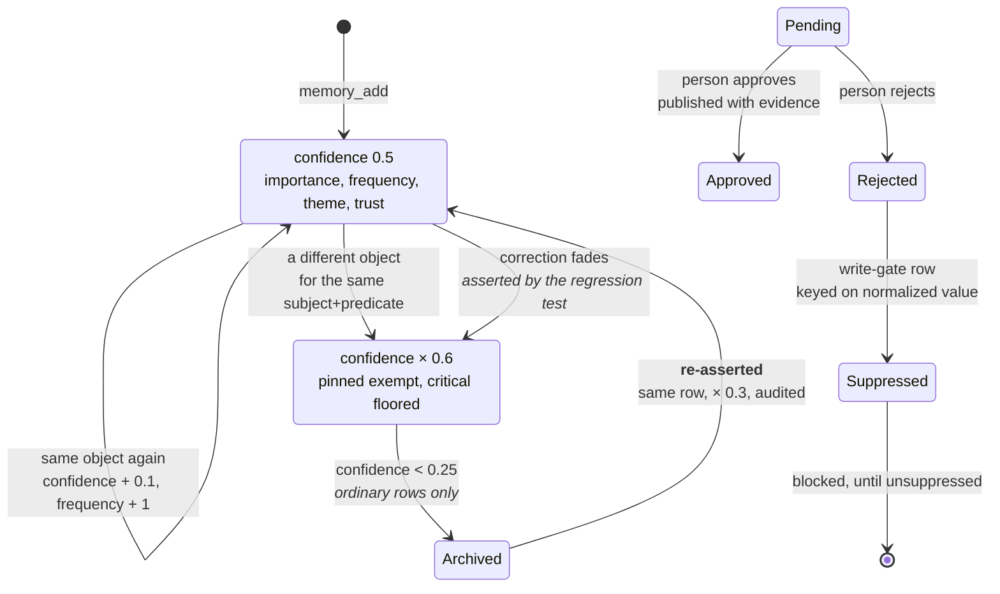

## 1. Executive Summary

memsem is TypeScript exposing an MCP server, an opencode plugin and a CLI over
a single SQLite file. It is MIT-licensed, twenty-one commits old, and ships
sixteen translated READMEs. Its committed benchmark reproduces, and its 1.3.0
release adds real governance: a human write-gate tombstone, a discrete trust
state and bi-temporal validity.

**Its benchmark reproduces.** `DESIGN.md` §11 publishes P@3 0.958 on a 51-fact,
20-query set, alongside four alternative constant weightings. From a clean clone,
`npm install && npm test` reproduces every figure in that table exactly —
0.958 / 0.958 / 0.320 / 0.958 for the defaults, 0.933 for the egalitarian,
recency-heavy and confidence-heavy variants, 0.958 for the relaxed lexical
threshold — offline, deterministic, in seconds, with no model and no network.
The number is what the committed harness prints, and the ablation runs on every
test.

**The honesty extends past the number.** §11 carries a section headed *"Lecture
honnête"* that states the set is author-designed rather than a standard,
explains that the low P@5 of 0.320 is an artifact of most queries having only one
to three relevant facts among five returned, and names the single query that
discriminates between the weightings.

**The correction design is the claim these re-reads test hardest, and 1.3.0
finally separates the two questions it had been conflating.** The automatic
supersession path still *prices* a re-asserted rejection as a one-time discount
that repetition pays off — an unpinned correction is archived at the third
re-assertion, exactly as the previous reading measured. That is the design
position and it is unchanged. What is *new* is a second, human path that
*refuses*: a person reviews candidates, and a rejected one writes a
`memory_suppressions` row keyed on the normalized value that blocks any future
write of that value until it is explicitly unsuppressed — the demonstration below
returns `rejected: true`, which is the
thing the [rejected-value tombstone](../../patterns/rejected-value-tombstone/)
pattern asks for even where the automatic path declines to provide it.

## 2. Mental Model

A fact is a triple, and its standing is a number that goes up when repeated and
down when contradicted. There are now two distinct mechanisms for keeping a value
away, and the distinction is the whole difference between a discount and a
constraint.



Left column is the automatic supersession path, and it remains a discount paid
off by repetition. Right column is the human path added in 1.3.0, and it is the
durable refusal the
[rejected-value tombstone](../../patterns/rejected-value-tombstone/) pattern
names. Writing the same blob through `memory_add` and through `reviewCandidate`
now reaches different ends — which is the honest way to hold both the design
position and the pattern's argument at once.

## 3. Architecture

One SQLite file at `~/.memsem/`, opened through Node 22's built-in `node:sqlite`
— no native addon, no server, no vector database required. Schema arrives
through a versioned migration list in `db.ts`: `memories`, `memory_history`,
`edges`, `episodes`, `audit_log`, a `memory_fts` FTS5 virtual table kept in step
by triggers, and — new in 1.3.0 — `memory_candidates` and `memory_suppressions`
for the human review gate.

`src/` holds the schema and every query in `db.ts`; `index.ts` is the MCP server
and its tools; `plugin.ts` is the opencode integration and the prompts that drive
three background sub-agents; `scoring.ts` is the priority formula; `config.ts`
is every tunable constant; `cli.ts` is the review surface, now including `purge`.

### Deployment and ergonomics

`npx memsem` and a setup command that writes the MCP configuration. Node ≥ 22.13
is the only hard requirement — the `node:sqlite` dependency is why, and it still
emits an experimental-feature warning on every run. Embeddings are optional and
local: `embed.ts` talks to Ollama, and without it the relax mode's cosine arm is
simply unavailable while strict lexical search continues to work.

## 4. Essential Implementation Paths

### The benchmark, and what running it settles

`scripts/bench.mjs` builds 51 facts across four themes, ages some of them by one
to thirty days so recency discriminates, and runs 20 queries with expected
results. The DESIGN document names the query that decides between weightings:
*"node"*.

Run at this commit:

```text
jeu de constantes    | P@3    R@3    P@5    R@5
---------------------+------------------------------
defaut               | 0.958  0.958  0.320  0.958
egalitaire           | 0.933  0.933  0.320  0.958
recence-heavy        | 0.933  0.933  0.320  0.958
confiance-heavy      | 0.933  0.933  0.320  0.958
seuil-0.4            | 0.958  0.958  0.320  0.958
```

Every cell matches the committed table. The transferable move is the ablation
itself: four alternative weightings run on every `npm test`, so a regression
against the alternatives is visible immediately.

### The automatic supersession path: still a priced re-entry

`add()` selects live rows sharing the subject and predicate. If the incoming
object matches one exactly, that row is reinforced and every rival is faded. If
no live row matches but the object is found only as a past `previous` in
`memory_history`, the value is detected as rejected and reactivated in its
original row at `resurrectConfidence` (0.3) — a discount — with the reactivation
audited.

`fade()` carries the three floors verified in the previous reading and unchanged
here:

```ts
if (row.pinned === 1) return { id: row.id, archived: false, untouched: true };
if (row.importance >= cfg.criticalImportance) {
  const next = Math.max(row.confidence * cfg.criticalFadeFactor, cfg.archiveThreshold + 0.01);
  this.db.prepare(`UPDATE memories SET confidence = ? WHERE id = ?`).run(next, row.id);
  return { id: row.id, archived: false, untouched: false };
}
const next = row.confidence * cfg.fadeFactor;
```

`pinned` is untouched, critical is floored above the archive threshold, and a
re-asserted rejected value still fades the live correction — `regression-test.ts`
asserts that as intended behaviour. The consequence measured in the previous
reading holds: an unpinned, ordinary correction is archived at the third
re-assertion of the value that corrected it. Nothing here is new; it is the
design position, held.

### The new human write-gate tombstone: refusal at the write

What is new in 1.3.0 is a second path that *refuses* rather than prices. A
sub-agent can route a fact into `memory_candidates` rather than straight into the
live store. A pending candidate is withheld from retrieval until a person calls
`memory_candidate_review`:

- **Approve** publishes the candidate into the live store (carrying its trust and
  evidence), recording a `candidate → approved` audit row.
- **Reject** does not merely mark the candidate; it writes a
  `memory_suppressions` row keyed on the *normalized* `(subject, predicate,
  object, project)`, and every subsequent `add()` of that value is refused
  outright before any supersession logic runs:

```ts
if (this.blockedBySuppression(subject, predicate, object, input.project)) {
  return this.rejectedAddResult(); // rejected: true
}
```

`unsuppress()` removes the row ("une réautorisation explicite est possible"), and
a re-assertion after that is evaluated fresh. This is the value-keyed refusal the
rejected-value tombstone pattern asks for, and it is verified by the governance
suite: a rejected candidate blocks the write (`blocked.rejected === true`), an
explicit unsuppress restores it, and the re-authorized value can be re-evaluated.

The two paths are deliberately different. The automatic supersession path treats
repetition as evidence and prices the re-entry; the human gate treats a
person's rejection as durable and refuses it. Holding both is coherent, and it is
the honest way to answer the previous reading's central question: the automatic
mechanism still inverts under repetition, but a human is no longer limited to
hoping — they can write a refusal that holds.

## 5. Memory Data Model

`memories` is a triple — `subject`, `predicate`, `object` — plus `tags`,
`importance`, `confidence`, `frequency`, `project`, `provenance`, `archived`,
`pinned`, `theme`, `embedding`, `trust`, `evidence`, `created_at`, `updated_at`,
`recorded_at`, `valid_from`, `valid_until`.

Around it: `memory_history` (now carrying the superseded value's trust and
validity), `edges`, `episodes`, `audit_log`, and — new in 1.3.0 —
`memory_candidates` (with `pending` / `approved` / `rejected` status and a
`rejection_reason`) and `memory_suppressions` (the write gate).

The `audit_log` shape remains the best thing in the schema: a **reason** on every
entry, a `pass_id` grouping a sub-agent's adjustments, and a `dry_run` flag. Its
reach is broad and deliberate: `forget`, `cli-edit`, the scoring path including
refusals and dry runs, both directions of supersession (`"supersession"` and
`"resurrection"`), the candidate lifecycle (`candidate-add`, `human-approve`,
`human-reject`), and a purge that leaves a redacted trace.

The two additions to the trust model matter. **Bi-temporal validity** —
`recorded_at` separate from `valid_from` / `valid_until`, queryable with `asOf` —
lets "where I lived last March" and "what we believed last March" be different
queries. And a **discrete trust state** (`inferred` / `verbatim` / `verified`,
with `evidence`) separates "how sure am I" from "may this be acted on", joined by
the candidate gate whose `pending` rows are withheld until approved.

## 6. Retrieval Mechanics

The strict path is an FTS5 index over subject, predicate, object and tags,
declared `tokenize = 'unicode61'` and kept in step by triggers, joined with
`memory_fts MATCH` at three call sites. Scoring happens in TypeScript over the
matched rows, and `whereClause(project, theme)` reaches the query on the list,
search and index paths alike — the
[scope as a first-class key](../../patterns/scope-as-a-first-class-key/) pattern.
Cross-project reach is opt-in via `crossProject: true`; a project supplied by the
caller is the standard caveat that this certifies the key reaches the query, not
that a caller cannot pass a different one.

The relax arm carries a stated cost the strict arm does not: embeddings are
persisted as JSON text and cosine ranking parses every candidate row, with the
complexity and remedy in one source comment (`cosine over stored JSON is O(n)…`).
An `asOf` arm reads bi-temporal validity — an expired fact is not returned by
default, and the state valid at a past date is queryable.

Two committed negative cases exist, unchanged: a weak lexical match is excluded,
and an archived fact stays out of the active set across an export/import round
trip. The governance suite adds negative cases for the new material: a pending
candidate is not retrieved until approved, a project does not leak to another,
and a suppressed value stays out.

## 7. Write Mechanics

Writes are synchronous SQLite transactions; nothing queues, and a memory is
searchable the moment `memory_add` returns. Three background passes are defined
as prompts in `plugin.ts`: session-end extraction, consolidation, and
pairwise-comparison scoring. The consolidation pass re-runs a search with two of
the fact's keywords and confirms the merged pattern still ranks in the top five
before archiving the parts — a good prompt rule, still prompted rather than
enforced.

The 1.3.0 addition is the upstream write gate. A candidate can be routed to
`memory_candidates` as `pending` and kept out of the live store until a person
adjudicates it. The interesting consequence is that the review surface now sits
*before* the live store as well as after it: `forget` and `purge` act on what is
already believed, while `reviewCandidate` decides what will be.

### Operational cost

The default read path costs one SQLite query and some arithmetic — no model, no
network. Storage grows monotonically: nothing is automatically deleted, archived
rows and history persist. A deliberate `purge` is the exception and requires
explicit confirmation, deleting the content and history while keeping a redacted
audit trace.

## 8. Agent Integration

An MCP server whose tool set now spans add, search, list, forget, edit, score,
index, stats, episode search, export/import and the 1.3.0 additions — candidate
add/list/review, verify, unsuppress, and a confirmed purge — plus an opencode
plugin and a CLI with list, edit, forget, doctor and purge. The
`memory-index.md` routing card injected at session start remains the interesting
integration choice: a table of contents in front of the agent rather than
retrieval into every turn.

## 9. Reliability, Safety, and Trust

Strengths:

- **A committed benchmark that reproduces exactly**, offline and deterministic,
  wired into `npm test`.
- **An ablation over its own constants**, so a regression against the
  alternatives is visible on every run.
- **A stated honest reading** of that benchmark's limits, written by the author.
- **An audit log carrying a reason, a pass id and a dry-run flag**, reaching the
  scoring refusals, both directions of supersession, the candidate lifecycle and
  purge.
- **A human write-gate tombstone.** A rejected candidate writes a value-keyed
  suppression that refuses the write until explicitly unsuppressed — verified by
  the governance suite in both directions.
- **A discrete trust state and bi-temporal validity**, added in 1.3.0.
- **Scope enforced on the read path**, with cross-project reach opt-in.
- **Two committed negative retrieval cases**, plus governance negatives for the
  new material.
- **Nothing is automatically deleted** — archived rows, history and a redacted
  purge trace all persist.

Gaps:

- **The automatic supersession path still prices a rejection rather than
  constraining it.** An unpinned, ordinary correction is archived at the third
  re-assertion of its value; only pinning or the new human gate stops it.
- **The human tombstone protects only what a person explicitly rejects.** The
  common, unexamined case — a later extraction pass re-reading an old transcript
  against an *unpinned, unreviewed* correction — still resolves to repetition
  wins.
- **The consolidation and extraction safety rules remain prompts, not code.**
- **Scope is enforced on the read path, not on write authorization.**

## 10. Tests, Evals, and Benchmarks

`npm test` builds and runs the client, durability, config, scoring, CLI,
regression and governance suites plus the benchmark, in seconds, with no
services. It passes at this commit, and the benchmark output matches DESIGN.md
§11 cell for cell.

The suites are real assertions: the scoring caps, the pin and critical refusals,
the dry-run path, `doctor`'s ordering, CLI confirmation, export/import durability,
the value-keyed resurrection (re-assertion returns weak and is audited), the
pinned fact surviving a contradicting write, and — new in 1.3.0 — the governance
suite: a rejected candidate blocks the write, an explicit unsuppress restores it,
the approved candidate publishes evidence, a human verify elevates trust, a
project does not leak, and a confirmed purge removes the content while leaving a
redacted audit trace.

## 11. For Your Own Build

### Steal

- **Commit the harness, not the number.** memsem's P@3 is credible because
  `npm test` prints it.
- **Ablate your own constants and keep the ablation in CI.**
- **Write the honest reading yourself.**
- **Put a reason, a pass id and a dry-run flag on the audit row.**
- **Refuse at the write gate, not just at the read path, when a person decides.**
  A `memory_suppressions`-style row keyed on the normalized value, cleared only by
  explicit unsuppress, is the difference between a belief and a standing refusal.
- **Separate record time from validity time**, and hold a discrete trust state
  with a withholding status.
- **Attenuate rather than exclude** on the read path, and fade rather than delete
  on automatic contradiction.

### Avoid

- **Pricing a rejection instead of constraining it on the automatic path.** The
  discount is paid off by repetition; if a correction must hold against a
  re-extraction, only the explicit human gate refuses.
- **Making the durable protection opt-in and the fragile one the default.** A
  pinned or human-rejected value holds; an ordinary unpinned correction does
  not — the docs have to say which side a user is on.
- **Leaving the sub-agent path governed by a sentence** once the database paths
  are enforced in code.

### Fit

Right for a single developer who wants a local, offline, MIT-licensed memory that
installs in one command, ranks precisely by default, and can be inspected and
corrected from a CLI. At roughly four thousand lines it is readable end to end,
and the engineering habits — committed benchmark, ablation, bounded sub-agent
authority, audit with reasons — are better than its twenty-one commits suggest.

Wrong wherever a correction has to hold **without anyone having pinned it or
reviewed it**. The automatic path still treats repetition as evidence; the 1.3.0
governance is a real answer, but it is an answer a person has to exercise.

## 12. Open Questions

- Is `resurrectConfidence` meant to be a one-time discount or the start of a
  ladder? At 0.3 a value returns cheap and then climbs on ordinary reinforcement.
- Should an unpinned correction have a floor too, or is pinning the intended
  answer?
- The human tombstone writes only on explicit rejection — is there a shape where
  the write gate refuses on the automatic supersession's behalf without erasing
  the design's "repetition is evidence" position?
- Who wins when a consolidated pattern is contradicted by a critical fact — is
  that decided anywhere in code?
- Does the relax mode's 0.5 cosine threshold hold up against real embeddings, or
  is it carried over from the lexical floor?

## Appendix: File Index

- Schema, queries and correction: `src/db.ts` (`add`, `fade`, `blockedBySuppression`,
  `whereClause`, `forget`, `edit`, `score`, `audit`, `historyOf`, `addCandidate`,
  `reviewCandidate`, `unsuppress`, `purge`, `importJSON`).
- MCP server and tools: `src/index.ts`.
- Sub-agent prompts and opencode plugin: `src/plugin.ts`.
- Scoring: `src/scoring.ts`; constants and overrides: `src/config.ts`.
- CLI review surface: `src/cli.ts` (`list`, `edit`, `forget`, `doctor`, `purge`).
- Benchmark: `scripts/bench.mjs`; its documented result and honest reading:
  `DESIGN.md` §11.
- Tests: `src/test/client-test.ts`, `cli-test.ts`, `durability-test.ts`,
  `score-test.ts`, `config-test.ts`, `regression-test.ts`, `governance-test.ts`.

## History

**2026-08-05** — [`16c28a940beac69fc060eb6bf5828061ad881d1a`](https://github.com/WindSeries69/memsem/commit/16c28a940beac69fc060eb6bf5828061ad881d1a) — third reading, on 1.3.0, two releases past the previous pin. Adds two mechanism facts and one capability mark to the 1.2.0 report. 1.3.0 routes a fact into `memory_candidates` until a person approves or rejects it; a rejection writes a `memory_suppressions` row keyed on the normalized value that refuses every further `add()` of that value until `unsuppress` — verified by the governance suite (a rejected candidate blocks the write, an explicit unsuppress restores it). That is a value-keyed refusal at the write gate, distinct from the automatic supersession path, which still prices a re-asserted rejection as a discount (`regression-test.ts` asserts the correction fades) and was and remains declined for the `tombstone` mark on its own. The write gate earns the mark. 1.3.0 also adds a discrete `trust` state (`inferred`/`verbatim`/`verified`) with evidence, bi-temporal `valid_from`/`valid_until`/`recorded_at` queried with `asOf`, a scope key reached on the read path with `crossProject` opt-in, a human `verify` that elevates trust, and a confirmed `purge` that removes content while keeping a redacted audit trace — `trust_state` and `bitemporal` marks added. `npm test` at this commit passes and the benchmark still matches §11.

**2026-08-04** — [`226c171ac21b6175bfda8e3b29256341e7fb2ff3`](https://github.com/WindSeries69/memsem/commit/226c171ac21b6175bfda8e3b29256341e7fb2ff3) — second reading. FTS5 `unicode61` route, relax-mode O(n) cosine cost, pinned/critical floors, and the value-keyed resurrection discount; the `tombstone` mark was declined for the automatic supersession path.

**2026-08-04** — [`33b0d4624020f28fc7b2bee0a3b9865948d90818`](https://github.com/WindSeries69/memsem/commit/33b0d4624020f28fc7b2bee0a3b9865948d90818) — first reading. `npm test` run from a clean clone: all suites pass and the benchmark reproduces DESIGN.md §11 exactly. The supersession inversion and the unprotected pin were demonstrated against the built module rather than read.
